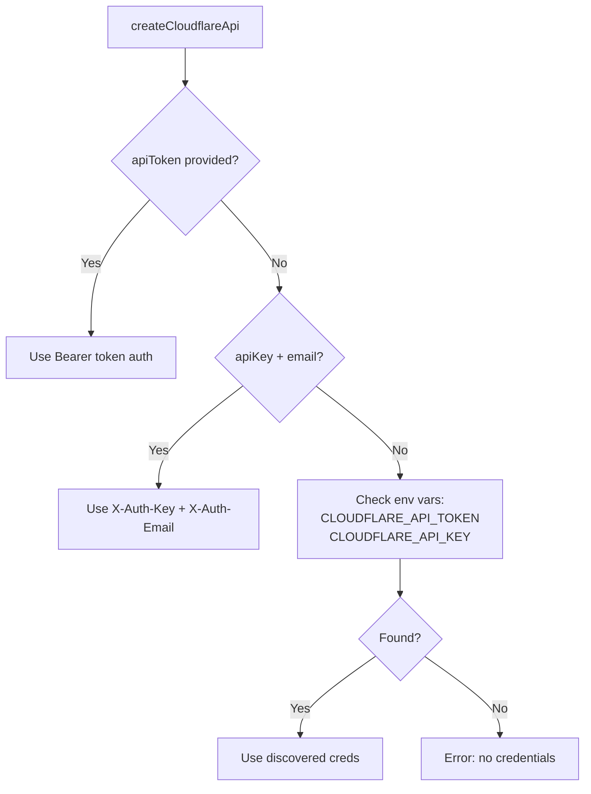
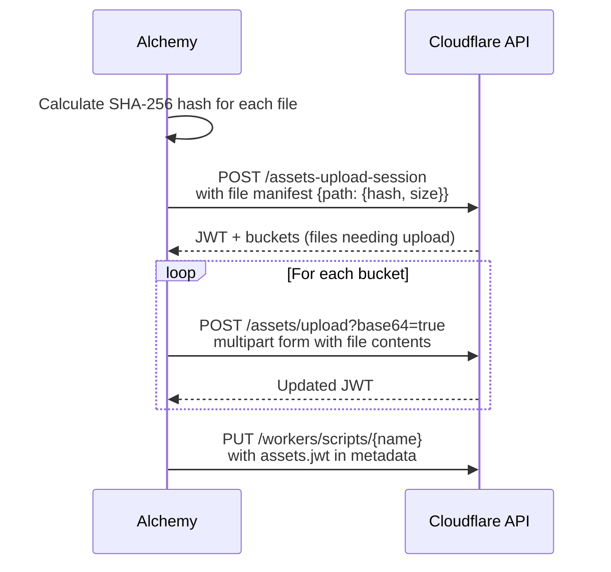

# Alchemy Cloudflare Provider Deep Dive

## Overview

The Cloudflare provider is the most mature and complex provider in alchemy. It manages Workers, KV Namespaces, R2 Buckets, Durable Object Namespaces, DNS Records, Zones, Custom Domains, Workflows, and API Tokens. All resources interact with the Cloudflare REST API via an authenticated HTTP client.

## API Client Architecture

### `api.ts` -- The Cloudflare API Wrapper

The `createCloudflareApi()` function constructs an authenticated HTTP client that:

1. Discovers the Cloudflare account ID automatically if not provided (via `AccountId` resource)
2. Authenticates using either an API token (Bearer) or API key + email combination
3. Provides `get/post/put/delete/patch` methods that prefix all URLs with `https://api.cloudflare.com/client/v4`

Options cascade: individual resource props can override the account ID, API key, or email.

### Authentication Flow

## Worker Resource -- The Centerpiece

The Worker resource (`worker.ts`, ~996 lines) is the most complex single provider. It handles:

### Lifecycle Phases

**Create/Update:**
1. Validate: must have either `script` or `entrypoint`
2. If `entrypoint` given, create a nested `Bundle` resource (esbuild) to compile the script
3. Process bindings: KV, R2, Durable Objects, Workflows, Assets, Secrets, plain text
4. Handle asset uploads if any binding is type "assets"
5. Prepare worker metadata including migration configuration for Durable Objects
6. Upload worker script as multipart/form-data
7. Upsert any Workflow bindings
8. Configure workers.dev URL if requested

**Delete:**
1. Delete the worker script via API
2. Disable the workers.dev URL if it was enabled

### Binding System

Workers bind to other Cloudflare resources. The binding type mapping:

| Alchemy Type | CF Binding Type | Key Fields |
|---|---|---|
| string | `plain_text` | `text` |
| KVNamespace | `kv_namespace` | `namespace_id` |
| Worker (service) | `service` | `service` (worker id) |
| DurableObjectNamespace | `durable_object_namespace` | `class_name`, `script_name` |
| R2Bucket | `r2_bucket` | `bucket_name` |
| Assets | `assets` | (none) |
| Secret | `secret_text` | `text` (unencrypted value) |
| Workflow | `workflow` | `workflow_name`, `class_name` |

### Durable Object Migration Management

When bindings include Durable Object namespaces, the worker metadata must include migration directives. The system automatically detects:

- **New classes**: DO binding exists in current props but not in previous bindings (tracked via `ctx.get("bindings")`)
- **Renamed classes**: DO binding with same stable ID but different className
- **SQLite classes**: DO bindings with `sqlite: true` go into `new_sqlite_classes` instead of `new_classes`

### Asset Upload Protocol

For Workers with static assets:

Files already uploaded (matching hash) are skipped.

## Other Cloudflare Resources

### KVNamespace (`kv-namespace.ts`)
Creates/deletes Cloudflare KV namespaces. Simple CRUD against `/storage/kv/namespaces`.

### R2Bucket (`bucket.ts`)
Manages R2 object storage buckets. Supports jurisdiction restrictions (EU).

### DurableObjectNamespace (`durable-object-namespace.ts`)
Represents a Durable Object class binding. Does NOT create the namespace directly -- that happens through Worker migrations. This resource primarily exists to be referenced in Worker bindings.

### Zone (`zone.ts`)
Manages Cloudflare DNS zones. Can create new zones or look up existing ones.

### DnsRecords (`dns-records.ts`)
Bulk manages DNS records for a zone. Compares desired records against actual records and creates/updates/deletes to converge.

### CustomDomain (`custom-domain.ts`)
Attaches a custom domain to a Worker, handling the DNS record and SSL certificate.

### Workflow (`workflow.ts`)
Manages Cloudflare Workflows -- durable execution workflows that run on Workers.

### AccountApiToken (`account-api-token.ts`)
Creates scoped API tokens for the Cloudflare account with specific permission groups.

### PermissionGroups (`permission-groups.ts`)
Fetches available permission groups for an account (read-only resource).

### WranglerJson (`wrangler.json.ts`)
Generates a wrangler.json configuration file, useful for local development with `wrangler dev`.

## R2RestStateStore

The Cloudflare provider also includes `R2RestStateStore`, an alternative StateStore implementation that persists alchemy state to an R2 bucket via the REST API. This is used in CI (GitHub Actions) where filesystem state would not persist between runs.

Key design aspects:
- Objects stored at `alchemy/{scope-chain}/{resource-id}`
- Slashes in resource IDs are converted to colons for storage
- All operations include exponential backoff for transient 502/503 errors
- Pagination support for listing (1000 objects per page)

## The `alchemy.run.ts` Dogfooding Example

Alchemy uses itself to deploy its own documentation website. This file demonstrates the full Cloudflare integration:

1. Creates a DNS Zone for `alchemy.run`
2. Creates permission groups and scoped API tokens
3. Sets up GitHub OIDC for CI/CD (AWS side)
4. Creates an R2 bucket for state storage
5. Imports DNS records from GoDaddy
6. Builds a VitePress documentation site
7. Deploys it as a Cloudflare Worker with static assets
8. Attaches a custom domain

This is an excellent real-world example of infrastructure-as-code using alchemy itself.
