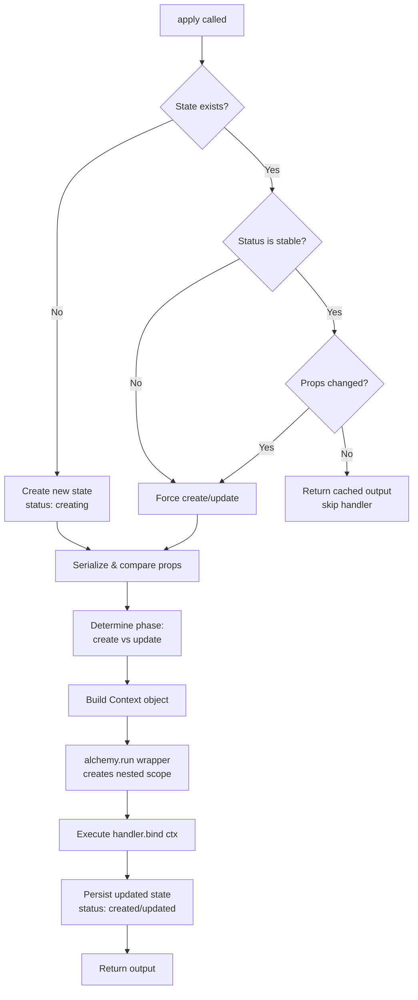
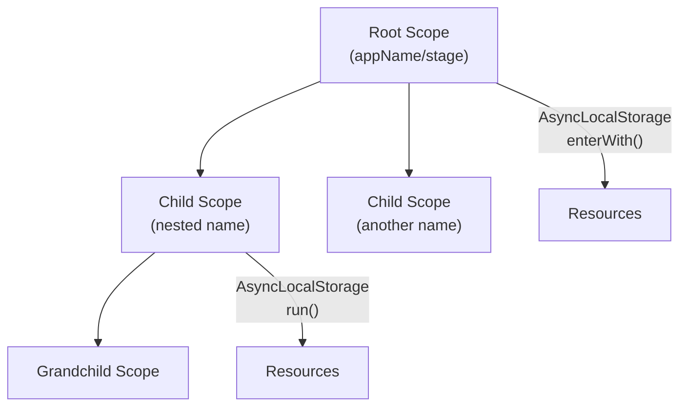
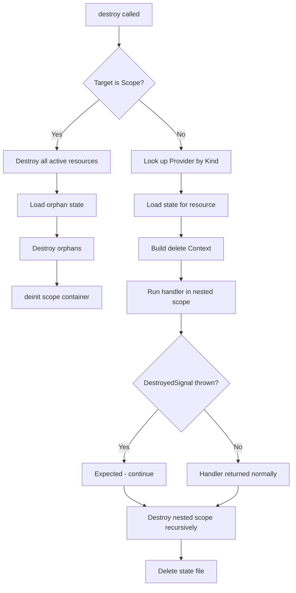

# Alchemy Resource Lifecycle Deep Dive

## Overview

Alchemy's core abstraction is the **Resource** -- a function-as-a-class that represents an infrastructure component with a full create/update/delete lifecycle. The system uses AsyncLocalStorage for scope management, JSON-based state persistence, and libsodium-based secret encryption. This document traces the complete lifecycle from resource definition through state persistence.

## The Resource Primitive

A Resource in alchemy is simultaneously a function and a type. The `Resource()` factory function registers a provider handler and returns a callable that, when invoked, enters the apply pipeline.

```
Resource(type, [options], handler) --> Provider function
```

The handler receives a `Context` object via `this` binding that encapsulates the current phase (create/update/delete), previous state, and helper methods for constructing output.

### Provider Registration

All providers are stored in a global `PROVIDERS` Map keyed by their type string (e.g., `"cloudflare::Worker"`, `"docs::Document"`). This global registry is essential: when destroying resources, alchemy looks up the provider by the Kind stored in state. If the provider import is missing, destruction fails -- this is why `alchemy.run.ts` explicitly imports all provider modules at the top.

### The `PendingResource` Type

When you call a provider like `Worker("my-worker", props)`, it does NOT immediately execute the handler. Instead it:

1. Gets the current Scope from AsyncLocalStorage
2. Validates the resource ID (no colons, no duplicates of different kinds)
3. Assigns a sequence number for ordering destruction
4. Calls `apply()` which returns a Promise
5. Merges metadata (Kind, ID, FQN, Seq, Scope) onto the promise itself
6. Registers the resource in the scope's resource map

The result is a `PendingResource<T>` -- a Promise augmented with resource metadata. This is why `await Worker(...)` gives you the resolved output.

## The Apply Pipeline

The `apply()` function in `apply.ts` is the execution engine:



### Change Detection

Props are serialized (without encryption) and compared via `JSON.stringify`. This means:
- Secrets compare by their unencrypted value (encryption produces different nonces each time)
- ArkType schemas are serialized to their JSON representation
- Dates are converted to ISO strings
- Scope references are stripped (serialized as undefined)

### The `alwaysUpdate` Option

Some providers (like `Worker`) set `alwaysUpdate: true`, meaning the handler runs on every apply regardless of whether props changed. This is important for resources where external state may have drifted.

## Context Object

The Context is both a function and an object -- a pattern used throughout alchemy. As a function, `this(props)` constructs the Resource envelope (attaching Kind, ID, FQN, Scope, Seq). As an object, it provides:

- `this.phase` -- "create", "update", or "delete"
- `this.output` -- previous output (undefined on create)
- `this.props` -- previous props (undefined on create)
- `this.get/set/delete` -- key-value store scoped to this resource in state.data
- `this.replace()` -- marks resource for replacement
- `this.destroy()` -- throws DestroyedSignal to terminate handler during delete

The `destroy()` mechanism is clever: throwing `DestroyedSignal` lets the handler "return never" during deletion, which means `await MyResource()` always returns a value in normal operation (the delete path never resolves).

## Scope Hierarchy



Scopes form a tree. The chain (e.g., `["github:alchemy", "prod", "docs"]`) determines:
- The filesystem path for state storage: `.alchemy/github:alchemy/prod/docs/`
- The FQN of resources: `github:alchemy/prod/docs/my-resource`

### Orphan Cleanup

When `scope.finalize()` is called, it compares the set of resource IDs registered during this run against the IDs found in state storage. Any state entries not re-registered are "orphans" -- they were removed from the code. These get destroyed in reverse sequence order.

## State Storage

### FileSystemStateStore (Default)

State is persisted as JSON files under `.alchemy/{chain}/`. Each resource gets a `{resourceID}.json` file containing:

```json
{
  "status": "created",
  "kind": "cloudflare::Worker",
  "id": "my-worker",
  "fqn": "my-app/prod/my-worker",
  "seq": 0,
  "data": {},
  "props": { "name": "my-worker", "entrypoint": "./src/worker.ts" },
  "output": { "Kind": "cloudflare::Worker", "ID": "my-worker", "url": "https://..." }
}
```

### R2RestStateStore (Cloud-backed)

For CI environments, state can be stored in Cloudflare R2 buckets via the REST API. This uses the same serialization format but stores objects at paths like `alchemy/{chain}/{resourceID}`. It includes exponential backoff for transient errors.

## Secret Encryption

Secrets use libsodium's `crypto_secretbox_easy` (XSalsa20-Poly1305):

1. Derive a 32-byte key from the passphrase via `crypto_generichash`
2. Generate a random 24-byte nonce
3. Encrypt the plaintext
4. Concatenate nonce + ciphertext
5. Base64-encode the result

In state files, secrets appear as `{"@secret": "base64-encoded-value"}`.

## Destruction Pipeline



Resources are destroyed in reverse sequence order (last created, first destroyed) to respect dependency ordering.

## Key Design Decisions

1. **Function-as-class pattern**: Resources look like constructors (`Worker("id", props)`) but are actually async functions. The `IsClass` type trick makes them render as types in IDE semantic highlighting.

2. **AsyncLocalStorage for scope propagation**: No need to pass scope/context through every function call. The current scope is always available via `Scope.current`.

3. **Promise-augmented resources**: Resources are promises with metadata, enabling both `await Worker(...)` for the resolved value and accessing `.Kind`, `.ID` etc. without awaiting.

4. **Serialization-based change detection**: Simple but effective -- JSON.stringify comparison avoids the complexity of deep-equal libraries.

5. **Encrypted secrets in state**: State files can be committed to version control because secrets are encrypted. The password never appears in state.
