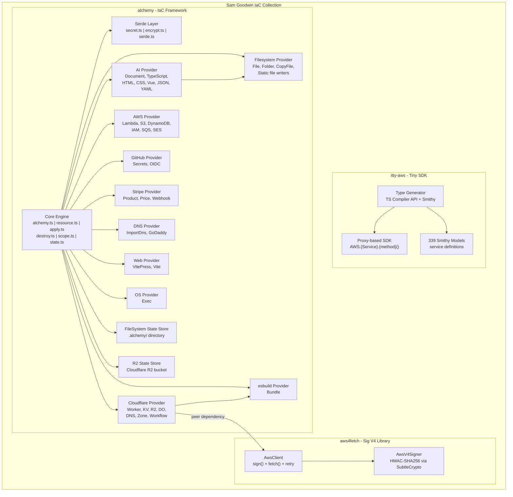
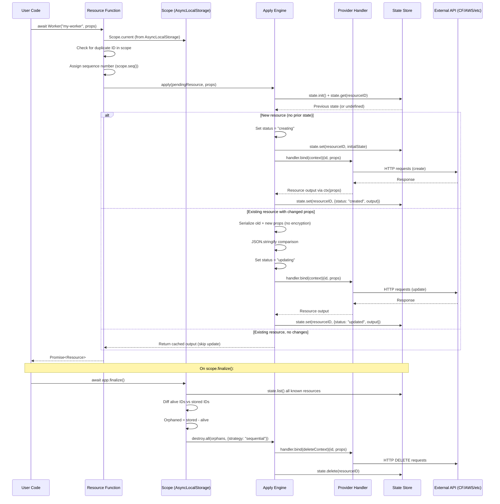
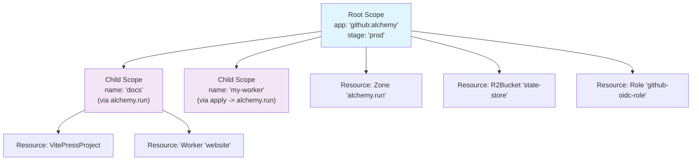
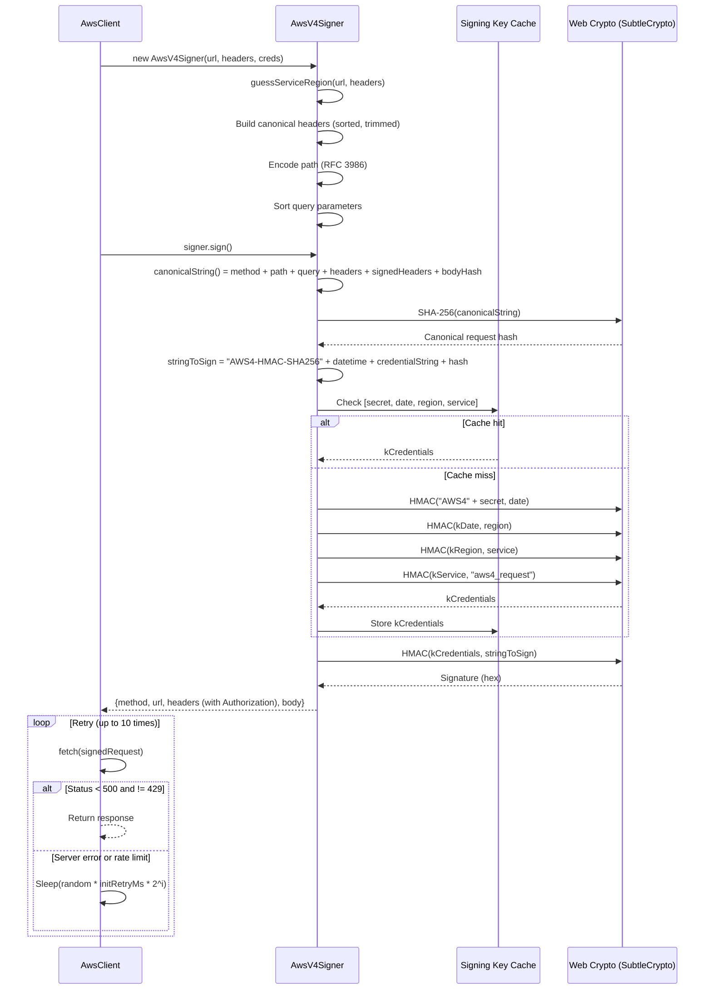
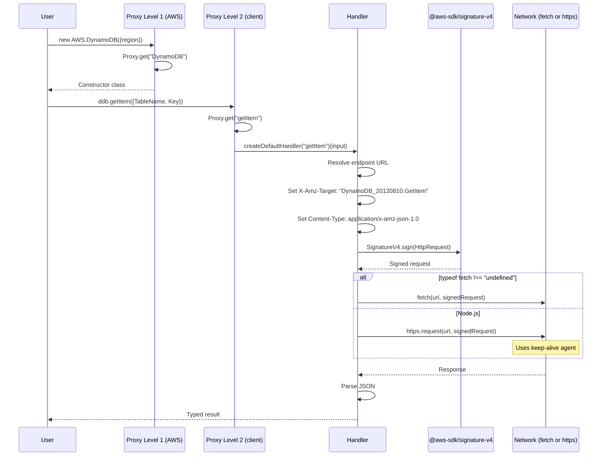

# Project Exploration: Sam Goodwin Infrastructure-as-Code Collection

## Overview

This collection contains three projects by or closely related to Sam Goodwin, all orbiting the theme of making AWS and cloud infrastructure accessible from lightweight, modern JavaScript/TypeScript environments. They represent an evolutionary arc: from minimalist AWS request signing (aws4fetch), through a tiny proxy-based SDK (itty-aws), to a full infrastructure-as-code framework (alchemy).

**alchemy** is the crown jewel -- a TypeScript IaC framework that treats infrastructure resources as async functions with create/update/delete lifecycle semantics. It supports Cloudflare Workers, AWS services, AI-generated content, filesystem operations, Stripe billing, GitHub automation, and DNS management. Its key innovation is the "Resource" primitive: a function that looks like a constructor call (`await Worker("my-api", props)`) but manages full CRUD lifecycle with encrypted state persistence. Alchemy uses `AsyncLocalStorage` to propagate scope context implicitly, eliminating the need to thread context objects through every function call. The framework is self-hosting: its own documentation site at alchemy.run is deployed using alchemy itself.

**aws4fetch** is a dependency of alchemy -- a 6.4kb AWS Signature V4 implementation built on Web Crypto APIs (SubtleCrypto), designed for Cloudflare Workers and browsers where Node.js crypto is unavailable. It implements the full SigV4 signing algorithm with credential caching and exponential backoff retry.

**itty-aws** is an earlier experiment by Sam Goodwin -- a ~22KB proxy-based AWS SDK that generates type-safe client classes from AWS Smithy models, using a single generic HTTP handler for all services. It uses JavaScript `Proxy` objects to intercept property access and method calls, routing them through a unified request signing and dispatch pipeline. It's the spiritual predecessor to alchemy's approach of bypassing heavy official SDKs.

## Repository

- **Location:** `/home/darkvoid/Boxxed/@formulas/src.deployanywhere/src.sam-goodwin[infrAsCode]/`
- **Remote:** N/A (local filesystem copies)
- **Primary Language:** TypeScript
- **Licenses:** Apache 2.0 (alchemy), MIT (aws4fetch, itty-aws)

## Directory Structure

```
src.sam-goodwin[infrAsCode]/
├── alchemy/                          # IaC framework (main project)
│   ├── alchemy/                      # Core npm package "alchemy" v0.7.0
│   │   ├── package.json
│   │   ├── src/
│   │   │   ├── index.ts              # Main exports (re-exports + alchemy default)
│   │   │   ├── alchemy.ts            # Entry point: scope/run/template-literal overloaded API
│   │   │   ├── resource.ts           # Resource primitive, Provider registry (global PROVIDERS Map)
│   │   │   ├── apply.ts              # Create/update execution engine (prop diffing, state transitions)
│   │   │   ├── destroy.ts            # Delete execution engine (reverse-order, orphan detection)
│   │   │   ├── context.ts            # Lifecycle context builder (create/update/delete phases)
│   │   │   ├── scope.ts              # Hierarchical scope tree via AsyncLocalStorage
│   │   │   ├── state.ts              # StateStore interface (init/deinit/get/set/delete/list)
│   │   │   ├── secret.ts             # Secret wrapper class + secret.env() helper
│   │   │   ├── serde.ts              # Serialize/deserialize with Secret/Date/ArkType/Scope handling
│   │   │   ├── encrypt.ts            # libsodium XSalsa20-Poly1305 symmetric encryption
│   │   │   ├── ai/                   # AI-powered code/content generation providers
│   │   │   │   ├── client.ts         # Vercel AI SDK model factory + rate limit retry
│   │   │   │   ├── document.ts       # AI-generated markdown documents (```md fence extraction)
│   │   │   │   ├── typescript-file.ts # AI-generated TypeScript files
│   │   │   │   ├── html-file.ts      # AI-generated HTML
│   │   │   │   ├── css-file.ts       # AI-generated CSS
│   │   │   │   ├── vue-file.ts       # AI-generated Vue components
│   │   │   │   ├── json-file.ts      # AI-generated JSON
│   │   │   │   ├── yaml-file.ts      # AI-generated YAML
│   │   │   │   ├── astro-file.ts     # AI-generated Astro components
│   │   │   │   ├── ark.ts            # ArkType schema validation for AI output
│   │   │   │   └── data.ts           # AI-generated structured data
│   │   │   ├── aws/                   # AWS resource providers
│   │   │   │   ├── bucket.ts         # S3 Bucket (CreateBucket/DeleteBucket)
│   │   │   │   ├── function.ts       # Lambda Function (zip upload, URL config)
│   │   │   │   ├── table.ts          # DynamoDB Table
│   │   │   │   ├── queue.ts          # SQS Queue
│   │   │   │   ├── role.ts           # IAM Role (assume role policy, managed policies)
│   │   │   │   ├── policy.ts         # IAM Policy
│   │   │   │   ├── policy-attachment.ts # IAM Policy Attachment
│   │   │   │   ├── ses.ts            # Simple Email Service
│   │   │   │   ├── credentials.ts    # AWS credential handling
│   │   │   │   ├── account-id.ts     # STS-based account ID lookup
│   │   │   │   └── oidc/             # GitHub OIDC provider for CI/CD
│   │   │   ├── cloudflare/            # Cloudflare resource providers (most mature, 25 files)
│   │   │   │   ├── worker.ts         # Workers (996 lines -- bundling, bindings, asset upload)
│   │   │   │   ├── kv-namespace.ts   # KV Namespaces
│   │   │   │   ├── bucket.ts         # R2 Buckets
│   │   │   │   ├── durable-object-namespace.ts  # Durable Objects with SQLite migration
│   │   │   │   ├── workflow.ts       # Cloudflare Workflows
│   │   │   │   ├── assets.ts         # Static asset manifest (file hashing + upload)
│   │   │   │   ├── zone.ts           # DNS Zones
│   │   │   │   ├── dns-records.ts    # DNS Record management
│   │   │   │   ├── custom-domain.ts  # Custom domains for Workers
│   │   │   │   ├── account-api-token.ts  # Scoped API tokens
│   │   │   │   ├── permission-groups.ts  # Permission group lookup
│   │   │   │   ├── wrangler.json.ts  # Generate wrangler config as resource
│   │   │   │   ├── zone-settings.ts  # Zone-level settings
│   │   │   │   ├── api.ts            # Cloudflare REST API client (retry, auth)
│   │   │   │   ├── bindings.ts       # Worker binding type definitions
│   │   │   │   ├── bound.ts          # Binding type resolution for Worker.Env
│   │   │   │   ├── auth.ts           # Cloudflare auth helpers (token/key+email)
│   │   │   │   ├── r2-rest-state-store.ts  # R2-backed state persistence for CI
│   │   │   │   ├── asset-manifest.ts # Asset file metadata
│   │   │   │   ├── response.ts       # API response helpers
│   │   │   │   ├── types.ts          # Shared Cloudflare types
│   │   │   │   ├── account-id.ts     # Account ID resolution
│   │   │   │   ├── worker-metadata.ts # Worker script metadata types
│   │   │   │   └── worker-migration.ts # Durable Object migration types
│   │   │   ├── dns/                   # DNS provider
│   │   │   │   ├── import-dns.ts     # Import DNS records from registrars
│   │   │   │   ├── godaddy.ts        # GoDaddy DNS API client
│   │   │   │   └── record.ts         # DNS record type definitions
│   │   │   ├── esbuild/              # Build tools
│   │   │   │   └── bundle.ts         # esbuild bundling resource
│   │   │   ├── fs/                    # Filesystem providers
│   │   │   │   ├── file.ts           # Generic file resource
│   │   │   │   ├── copy-file.ts      # File copy resource
│   │   │   │   ├── folder.ts         # Directory creation resource
│   │   │   │   ├── file-ref.ts       # File reference for template literals
│   │   │   │   ├── file-collection.ts # Multiple file references
│   │   │   │   ├── file-system-state-store.ts # Default state backend (.alchemy/ dir)
│   │   │   │   ├── static-text-file.ts # Static text file writer
│   │   │   │   ├── static-html-file.ts
│   │   │   │   ├── static-css-file.ts
│   │   │   │   ├── static-json-file.ts
│   │   │   │   ├── static-typescript-file.ts
│   │   │   │   ├── static-vue-file.ts
│   │   │   │   ├── static-yaml-file.ts
│   │   │   │   └── static-astro-file.ts
│   │   │   ├── github/               # GitHub provider
│   │   │   │   ├── secret.ts         # GitHub Actions secrets (libsodium-encrypted)
│   │   │   │   └── client.ts         # Octokit wrapper
│   │   │   ├── stripe/               # Stripe billing provider
│   │   │   │   ├── product.ts        # Stripe Products
│   │   │   │   ├── price.ts          # Stripe Prices
│   │   │   │   └── webhook.ts        # Stripe Webhooks
│   │   │   ├── os/                    # OS-level providers
│   │   │   │   └── exec.ts           # Shell command execution resource
│   │   │   ├── web/                   # Web framework providers
│   │   │   │   └── vitepress/        # VitePress site generation + config
│   │   │   ├── util/                  # Shared utilities
│   │   │   │   ├── retry.ts          # Exponential backoff with jitter
│   │   │   │   ├── sha256.ts         # SHA-256 hashing
│   │   │   │   ├── slugify.ts        # String slugification for tags
│   │   │   │   ├── content-type.ts   # MIME type detection by extension
│   │   │   │   ├── rm.ts             # Safe file removal
│   │   │   │   └── ignore.ts         # Error code filtering (e.g., ignore ENOENT)
│   │   │   ├── test/
│   │   │   │   └── bun.ts            # Bun test harness with scope + cleanup management
│   │   │   └── internal/
│   │   │       └── docs/providers.ts  # Auto-generate provider docs via AI
│   │   └── test/                      # Integration tests (live cloud services)
│   │       ├── aws/                   # Lambda, S3, DynamoDB, IAM, SQS, SES tests
│   │       ├── cloudflare/            # Worker, KV, R2, DNS, Zone tests
│   │       ├── dns/                   # DNS import tests
│   │       ├── fs/                    # File copy tests
│   │       ├── github/                # GitHub secret tests
│   │       ├── os/                    # Exec tests
│   │       ├── scope.test.ts          # Core scope lifecycle tests
│   │       ├── serde.test.ts          # Serialization round-trip tests
│   │       ├── esbuild.test.ts        # Bundle tests
│   │       ├── stripe.test.ts         # Stripe integration tests
│   │       ├── handler.ts             # Test helper handler
│   │       └── util.ts               # Test utilities
│   ├── alchemy-web/                   # Documentation site (VitePress)
│   │   ├── .vitepress/               # VitePress theme config
│   │   ├── docs/                      # Markdown documentation
│   │   │   ├── concepts/             # Core concept docs (scope, state, secrets)
│   │   │   ├── guides/               # Tutorial guides
│   │   │   ├── providers/            # Provider reference (ai, aws, cloudflare, dns, etc.)
│   │   │   └── advanced/             # Advanced topics
│   │   └── blogs/                    # Blog posts
│   ├── examples/
│   │   ├── aws-app/                   # AWS Lambda + DynamoDB + SQS example
│   │   │   └── alchemy.run.ts        # Deploys Lambda with Function URL
│   │   └── cloudflare-vite/           # Cloudflare Workers + Vite + Auth example
│   │       └── alchemy.run.ts        # Deploys Worker with Durable Objects + R2
│   ├── alchemy.run.ts                 # Self-deploying infrastructure for alchemy.run
│   ├── .github/workflows/test.yml     # CI: Bun + AWS OIDC + Cloudflare integration
│   ├── package.json                   # Monorepo root (Bun workspaces)
│   ├── biome.json                     # Biome formatter/linter config
│   ├── tsconfig.base.json            # Shared TS config (ESNext, strict)
│   ├── tsconfig.json                  # Project references
│   ├── .cursorrules                   # AI coding assistant rules (19KB)
│   └── LICENSE                        # Apache 2.0
│
├── aws4fetch/                         # AWS Signature V4 for fetch API
│   ├── src/
│   │   └── main.js                    # Single-file implementation (442 lines)
│   ├── dist/                          # Pre-built bundles
│   │   ├── aws4fetch.cjs.js           # CommonJS bundle
│   │   ├── aws4fetch.esm.js           # ESM bundle (for Workers)
│   │   ├── aws4fetch.esm.mjs          # ESM with .mjs extension (for Node imports)
│   │   ├── aws4fetch.umd.js           # UMD bundle (for browsers)
│   │   ├── main.d.ts                  # TypeScript declarations
│   │   └── main.d.mts                 # ESM-compatible declarations
│   ├── example/                       # Cloudflare Worker API Gateway example
│   │   └── src/index.js
│   ├── test/
│   │   ├── test.js                    # Test runner (Puppeteer browser tests)
│   │   ├── aws-sig-v4-test-suite/    # 25+ official AWS test vectors
│   │   │   ├── get-vanilla/          # Basic GET signing
│   │   │   ├── post-vanilla/         # Basic POST signing
│   │   │   ├── normalize-path/       # Path normalization (relative, slashes, spaces)
│   │   │   ├── get-header-*/         # Header handling (duplicate, multiline, trim, order)
│   │   │   ├── post-sts-token/       # STS session token tests
│   │   │   └── ...
│   │   ├── integration.js            # Live AWS integration tests
│   │   ├── node-es.mjs               # Node ESM import test
│   │   └── node-commonjs.js          # Node CJS require test
│   ├── package.json                   # v1.0.20, MIT, by Michael Hart
│   ├── rollup.config.mjs             # Rollup bundler (CJS, ESM, UMD outputs)
│   ├── jsconfig.json                  # TypeScript-in-JS config
│   └── LICENSE                        # MIT
│
└── itty-aws/                          # Tiny proxy-based AWS SDK
    ├── src/
    │   └── index.ts                   # Single-file SDK (560 lines, Proxy + signing)
    ├── aws-models/                    # ~339 Smithy JSON model files (service definitions)
    ├── scripts/
    │   ├── gen-sdk-types.mts          # TypeScript Compiler API: extract types from AWS SDK v2
    │   ├── gen-sdk-mappings.mts       # Generate service name mappings (X-Amz-Target headers)
    │   ├── smithy.ts                  # Smithy JSON model parser
    │   ├── aws.ts                     # AWS SDK v2 type definitions for extraction
    │   ├── download-smithy-models.sh  # Download models from GitHub releases
    │   ├── analyze-bundle.sh          # esbuild bundle size analysis
    │   └── tsconfig.json              # Scripts-specific TS config
    ├── benchmark/
    │   ├── functions/src/             # Lambda handler implementations (v2, v3, itty)
    │   └── infra/src/                 # CDK benchmark infrastructure
    ├── test/
    │   ├── dynamodb.test.ts           # DynamoDB CRUD operations
    │   ├── s3.test.ts                 # S3 object operations (get, put, list, delete)
    │   ├── sqs.test.ts                # SQS send/receive
    │   ├── ssm.test.ts                # SSM parameter store
    │   ├── event-bus.test.ts          # EventBridge put events
    │   └── constants.ts              # Test table/bucket names
    ├── package.json                   # v0.0.10, pnpm
    ├── pnpm-workspace.yaml            # pnpm workspace config
    ├── tsconfig.json                  # ESNext + strict
    ├── CHANGELOG.md                   # Release history
    ├── CONTRIBUTING.md                # Contribution guidelines
    └── .editorconfig                  # Editor formatting rules
```

## Architecture

### High-Level Diagram



### Component Breakdown

#### Core Engine (`alchemy/alchemy/src/`)

- **Location:** `alchemy/alchemy/src/`
- **Purpose:** The resource lifecycle management system -- defines how infrastructure resources are created, updated, destroyed, and their state persisted.
- **Dependencies:** `libsodium-wrappers` (encryption), `arktype` (schema serialization)
- **Dependents:** All providers, all user code

| Component | File | Purpose | Key Detail |
|---|---|---|---|
| `alchemy.ts` | Main entry | Overloaded function: `alchemy("app")` creates scope, `` alchemy`template` `` processes file refs | Uses `_alchemy` wrapper for dual-signature (scope vs template) |
| `resource.ts` | Resource factory | Global `PROVIDERS` Map, `Resource()` registers handler + returns callable | `IsClass` type trick makes it display as a class in IDEs |
| `apply.ts` | Create/update | Compares serialized props, manages state transitions | Skips update if serialized props are identical |
| `destroy.ts` | Delete | Reverse-order destruction, orphan cleanup | `DestroyedSignal` exception is the "return never" mechanism |
| `scope.ts` | Scope tree | `AsyncLocalStorage`-based context propagation | `finalize()` detects orphaned resources and destroys them |
| `state.ts` | State interface | Abstract StateStore contract (init/get/set/delete/list) | Two implementations: filesystem and R2 |
| `context.ts` | Lifecycle context | Phase-aware context with get/set/delete for provider data | `ctx.destroy()` throws `DestroyedSignal` for clean delete lifecycle |
| `secret.ts` | Secret wrapper | Wraps sensitive strings for encrypted state persistence | `secret.env()` combines env lookup + wrapping |
| `serde.ts` | Serialization | Handles `Secret`, `Date`, `ArkType`, `Scope` during JSON round-trips | `@secret`, `@date`, `@schema` sentinel keys in JSON |
| `encrypt.ts` | Encryption | libsodium `crypto_secretbox_easy` (XSalsa20-Poly1305) | Key derived via `crypto_generichash` from password string |

For deep analysis, see: [alchemy-resource-lifecycle-deep-dive.md](./alchemy-resource-lifecycle-deep-dive.md)

#### Cloudflare Provider (`alchemy/alchemy/src/cloudflare/`)

- **Location:** `alchemy/alchemy/src/cloudflare/`
- **Purpose:** Most mature provider. Manages Workers, KV, R2, Durable Objects, Workflows, DNS, Zones, Custom Domains, and API Tokens via the Cloudflare REST API.
- **Dependencies:** `cloudflare` (types), `aws4fetch` (R2 signing), `esbuild` (Worker bundling)
- **Dependents:** User code, `alchemy.run.ts` (self-hosting)

Key resources:
- **Worker** (996 lines): The most complex provider. Handles script upload via multipart form, esbuild bundling, binding resolution (KV, R2, DO, Assets, Secrets, Workflows), asset upload sessions, workers.dev URL configuration, and Durable Object migration tracking.
- **R2RestStateStore**: Alternative to FileSystemStateStore for CI environments. Uses R2 HTTP REST API with exponential backoff, pagination for listing, and scope-path-based key prefixing.

For deep analysis, see: [alchemy-cloudflare-provider-deep-dive.md](./alchemy-cloudflare-provider-deep-dive.md)

#### AI Provider (`alchemy/alchemy/src/ai/`)

- **Location:** `alchemy/alchemy/src/ai/`
- **Purpose:** Uses the Vercel AI SDK (`ai` package) to generate code and content as infrastructure resources.
- **Dependencies:** `ai` (Vercel AI SDK), `@ai-sdk/openai`, `prettier` (formatting), `arktype` (schema validation)
- **Dependents:** `alchemy-web` docs generation, user code

The `Document` resource generates markdown by:
1. Calling `generateText()` with a system prompt instructing markdown output in `` ```md `` fences
2. Extracting content between the fences
3. Re-prompting with an error if extraction fails
4. Optionally writing to disk via `StaticTextFile`
5. Supporting `freeze: true` to skip regeneration on updates

The `Ark` resource validates AI output against ArkType schemas, enabling structured data generation with type safety.

#### AWS Provider (`alchemy/alchemy/src/aws/`)

- **Location:** `alchemy/alchemy/src/aws/`
- **Purpose:** Manages AWS resources (Lambda, S3, DynamoDB, IAM, SQS, SES) using official AWS SDK v3 clients.
- **Dependencies:** `@aws-sdk/client-*` packages (all peer deps)
- **Dependents:** User code, `alchemy.run.ts` (GitHub OIDC role)

Unlike itty-aws, alchemy's AWS provider uses the official SDK v3 clients. Each resource directly imports the specific client commands it needs (e.g., `CreateRoleCommand`, `DeleteRoleCommand`).

#### aws4fetch (`aws4fetch/src/main.js`)

- **Location:** `aws4fetch/src/main.js`
- **Purpose:** Compact AWS Signature V4 implementation for `fetch`-based environments.
- **Dependencies:** None (uses Web Crypto API only)
- **Dependents:** alchemy (Cloudflare provider, R2 state store)

| Component | Purpose |
|---|---|
| `AwsClient` | High-level client with `sign()` and `fetch()` methods. Retry with exponential backoff + full jitter (up to 25.6s with 10 retries). |
| `AwsV4Signer` | Low-level V4 signature computation: canonical request, string-to-sign, HMAC chain (date -> region -> service -> aws4_request). Caches signing keys in a Map keyed by `[secret, date, region, service]`. |
| `guessServiceRegion()` | Infers AWS service and region from URL hostname patterns. Handles edge cases: Lambda URLs (`.on.aws`), Cloudflare R2 (`.r2.cloudflarestorage.com`), Backblaze B2, gov-cloud, S3 accelerate, IoT subdomains. |
| `encodeRfc3986()` | RFC 3986 URI encoding (percent-encodes `!'()*` which standard `encodeURIComponent` misses). |

#### itty-aws (`itty-aws/src/index.ts`)

- **Location:** `itty-aws/src/index.ts`
- **Purpose:** Proxy-based AWS SDK that covers all services in ~22KB minified.
- **Dependencies:** `@rgrove/parse-xml` (S3 XML), `@aws-sdk/signature-v4` (request signing)
- **Dependents:** None (standalone project)

| Component | Purpose |
|---|---|
| `AWS` Proxy | Top-level Proxy intercepts property access (e.g., `AWS.DynamoDB`) and returns a class constructor |
| Service client | Constructor returns a second Proxy that intercepts method calls (e.g., `ddb.getItem()`) |
| `createDefaultHandler()` | JSON protocol: POST with `X-Amz-Target` header, parses JSON response. Used by DynamoDB, EventBridge, SQS, etc. |
| `createS3Handler()` | XML protocol: Maps method names to HTTP verbs, maps S3 input properties to HTTP headers, parses XML responses with `@rgrove/parse-xml`. Handles arrays, numbers, booleans, and quoted ETag strings. |
| `sendRequest()` | Signs with `@aws-sdk/signature-v4`, dispatches via `fetch` (browser/Worker) or `https` (Node.js with keep-alive agent) |
| Type generator | `scripts/gen-sdk-types.mts` uses the TypeScript Compiler API to extract service interfaces from AWS SDK v2 types, generating `sdk.generated.ts` |
| Mapping generator | `scripts/gen-sdk-mappings.mts` generates `mappings.js` containing X-Amz-Target prefixes and JSON version numbers per service |

## Entry Points

### alchemy

- **Library entry:** `alchemy/alchemy/src/index.ts`
  - Exports: `alchemy` default, `Resource`, `Secret`, `State` types, `ignore` utility
  - Uses `export type *` for Context and Scope (type-only re-exports)

- **Self-deploy script:** `alchemy/alchemy.run.ts`
  - Creates Cloudflare Zone, R2 buckets, API tokens, AWS IAM roles with GitHub OIDC
  - Sets GitHub Actions secrets via GitHubSecret resource
  - Builds and deploys VitePress documentation site to Cloudflare Workers
  - Sets up custom domain alchemy.run

- **Test harness:** `alchemy/alchemy/src/test/bun.ts`
  - Extends `alchemy` interface via declaration merging (`alchemy.test`)
  - Creates file-scoped test scope from `import.meta.filename`
  - Auto-destroys resources in `afterAll` unless `destroy: false`
  - Supports R2 state store for CI via `ALCHEMY_STATE_STORE=cloudflare`

- **Provider registration:** Each provider `index.ts` must be imported to register resources in the global `PROVIDERS` map. Missing imports cause destroy failures.

### aws4fetch

- **Library entry:** `aws4fetch/src/main.js` -- exports `AwsClient` and `AwsV4Signer`
- **Distribution:** `aws4fetch/dist/` -- pre-built CJS, ESM, UMD, and MJS bundles with type declarations
- **Example:** `aws4fetch/example/src/index.js` -- Cloudflare Worker as API Gateway replacement

### itty-aws

- **Library entry:** `itty-aws/src/index.ts` -- exports `AWS` proxy object and `AWSError`
- **Code generation:** `itty-aws/scripts/gen-sdk-types.mts` -- run with `pnpm generate:types`
- **Mapping generation:** `itty-aws/scripts/gen-sdk-mappings.mts` -- run with `pnpm generate:mappings`
- **Model download:** `itty-aws/scripts/download-smithy-models.sh` -- fetches from GitHub

## Data Flow

### Alchemy Resource Lifecycle



### Alchemy Scope Hierarchy



### aws4fetch Signing Flow



### itty-aws Request Flow



## External Dependencies

### alchemy

| Dependency | Version | Purpose | Type |
|---|---|---|---|
| `ai` (Vercel AI SDK) | ^4.0.0 | AI text generation for Document/File resources | peer |
| `@ai-sdk/openai` | ^1.1.9 | OpenAI model provider | peer |
| `@ai-sdk/openai-compatible` | ^0.2.2 | Custom OpenAI-compatible endpoints | peer |
| `@aws-sdk/client-dynamodb` | ^3.0.0 | DynamoDB operations | peer |
| `@aws-sdk/client-iam` | ^3.0.0 | IAM role/policy management | peer |
| `@aws-sdk/client-lambda` | ^3.0.0 | Lambda function deployment | peer |
| `@aws-sdk/client-s3` | ^3.0.0 | S3 bucket management | peer |
| `@aws-sdk/client-sagemaker` | ^3.0.0 | SageMaker (reserved) | peer |
| `@aws-sdk/client-ses` | ^3.0.0 | Email sending | peer |
| `@aws-sdk/client-sesv2` | ^3.0.0 | Email v2 | peer |
| `@aws-sdk/client-sqs` | ^3.0.0 | SQS queue management | peer |
| `@aws-sdk/client-sts` | ^3.0.0 | Account ID resolution | peer |
| `aws4fetch` | ^1.0.20 | AWS Sig V4 for edge environments | peer |
| `cloudflare` | ^4.0.0 | Cloudflare API types | peer |
| `esbuild` | ^0.25.1 | Worker script bundling | peer |
| `libsodium-wrappers` | ^0.7.15 | Secret encryption (XSalsa20-Poly1305) | peer |
| `arktype` | ^2.0.0 | Runtime type validation for AI outputs | peer |
| `stripe` | ^17.0.0 | Stripe API client | peer |
| `@octokit/rest` | ^21.1.1 | GitHub API client | peer |
| `yaml` | ^2.0.0 | YAML parsing/generation | peer |
| `diff` | ^7.0.0 | Text diffing for AI file updates | peer |
| `prettier` | ^3.0.0 | Code formatting for AI-generated files | peer |
| `glob` | ^10.0.0 | File globbing for asset collection | peer |
| `turndown` | ^7.0.0 | HTML to markdown conversion | peer |
| `jszip` | ^3.0.0 | ZIP file creation for Lambda deployment | peer |
| `hono` | ^4.0.0 | HTTP framework for Workers | peer |
| `zod` | ^3.0.0 | Schema validation | peer |
| `@iarna/toml` | ^2.2.5 | TOML parsing | peer |
| `xdg-app-paths` | ^8.0.0 | XDG base directory paths | peer |

### aws4fetch

| Dependency | Version | Purpose | Type |
|---|---|---|---|
| `rollup` | ^4.18.1 | Bundle building (CJS, ESM, UMD) | dev |
| `typescript` | ^5.5.3 | Type declaration generation | dev |
| `puppeteer` | ^22.13.1 | Browser-based testing | dev |
| `eslint` | ^8.57.0 | Linting | dev |

### itty-aws

| Dependency | Version | Purpose | Type |
|---|---|---|---|
| `@rgrove/parse-xml` | ^4.0.1 | XML parsing for S3 responses | runtime |
| `aws-sdk` | 2.1295.0 | Type extraction source for code generation | runtime |
| `@aws-crypto/sha256-js` | ^3 | SHA-256 for request signing | peer |
| `@aws-sdk/credential-providers` | ^3 | Credential resolution (fromEnv) | peer |
| `@aws-sdk/protocol-http` | ^3 | HttpRequest class | peer |
| `@aws-sdk/signature-v4` | ^3 | AWS Sig V4 signing | peer |
| `vitest` | ^1.2.2 | Test runner | dev |
| `tsup` | ^8.0.1 | ESM bundler | dev |
| `tsx` | ^4.6.0 | TypeScript execution for scripts | dev |

## Configuration

### alchemy

- **Runtime:** Bun (required: `bun:test`, Bun workspaces, `bun.lock`)
- **Package manager:** Bun (workspaces: `["alchemy", "alchemy-web", "examples/*"]`)
- **TypeScript:** ESNext target, strict mode, ESM modules, bundler resolution, project references
- **Linting/Formatting:** Biome (2-space indent, LF line endings, 80 char width, linter disabled by default)
- **State directory:** `.alchemy/{stage}/{scope-chain}/` in project root (JSON files per resource)
- **Environment variables:**
  - `ALCHEMY_STAGE` -- deployment stage name (default: `$USER` or `"dev"`)
  - `CLOUDFLARE_API_TOKEN` or (`CLOUDFLARE_API_KEY` + `CLOUDFLARE_EMAIL`) -- Cloudflare authentication
  - `CLOUDFLARE_ACCOUNT_ID` -- Cloudflare account (auto-discovered if not set)
  - `OPENAI_API_KEY` -- for AI providers
  - `SECRET_PASSPHRASE` -- password for encrypting/decrypting secrets in state files
  - `ALCHEMY_STATE_STORE=cloudflare` -- use R2 state store instead of filesystem
  - `CLOUDFLARE_BUCKET_NAME`, `R2_ACCESS_KEY_ID`, `R2_SECRET_ACCESS_KEY` -- for R2 state store
  - `STRIPE_API_KEY` -- for Stripe provider
  - `GITHUB_ACCESS_TOKEN` -- for GitHub provider (Octokit)
  - Standard AWS credential env vars (`AWS_ACCESS_KEY_ID`, `AWS_SECRET_ACCESS_KEY`, `AWS_REGION`, etc.)

### aws4fetch

- **Runtime:** Any environment with `fetch` and `SubtleCrypto` (browsers, Cloudflare Workers, Node 18+, Deno)
- **Build:** Rollup with `rollup-plugin-cleanup` (CJS, ESM, UMD output)
- **TypeScript:** JSDoc-based types with `tsc -p declaration.jsconfig.json` for `.d.ts` generation
- **No runtime config** -- all options passed to constructor

### itty-aws

- **Runtime:** Node.js (with `https`) or `fetch`-capable environments (browser, Workers)
- **Build:** `tsup src/index.ts --format esm --target esnext --dts`
- **Package manager:** pnpm with workspace
- **Code generation:** Requires `aws-models/` directory populated via `download-smithy-models.sh`
- **Environment variables:** Standard AWS credentials (`AWS_REGION`, `AWS_ACCESS_KEY_ID`, `AWS_SECRET_ACCESS_KEY`)

## Testing

### alchemy

Tests run with `bun test --timeout 120000` and require **live cloud credentials** -- there are no mocks. The custom test harness (`src/test/bun.ts`) provides:

- **Scope isolation:** Each test file gets its own scope based on `import.meta.filename`
- **Auto-cleanup:** Resources destroyed in `afterAll` unless `destroy: false`
- **R2 state store:** For CI, set `ALCHEMY_STATE_STORE=cloudflare` to use R2 instead of local filesystem
- **Default test password:** `"test-password"` for secret encryption in tests
- **Prefix support:** Isolate test runs with configurable scope prefix
- **Skip support:** `test.skipIf(condition)` for conditional test skipping

**CI (GitHub Actions):**
- Runs on push/PR to `main` with concurrency control (no parallel runs)
- Bun runtime with latest version
- AWS OIDC authentication via `aws-actions/configure-aws-credentials` (no static keys)
- Cloudflare API key + email as repository secrets
- R2 state store for cross-run test isolation

**Test coverage by provider:**
| Provider | Tests |
|---|---|
| AWS | function, queue, role, ses, table |
| Cloudflare | account-api-token, bucket, dns-records, kv-namespace, permission-groups, worker, zone |
| DNS | import-dns |
| FS | copy-file |
| GitHub | secret |
| OS | exec |
| Core | scope, serde, esbuild, stripe |

### aws4fetch

Tests use the official AWS Signature V4 test suite (25+ test vectors covering GET/POST, header normalization, path encoding, query string ordering, STS token signing). Tests run in both Node.js and browser (via Puppeteer). Integration tests require live AWS credentials.

```
npm test           # Browser tests via Puppeteer
npm run test-node  # Node ESM + CJS import tests
npm run integration # Live AWS tests
```

### itty-aws

Tests use Vitest (`vitest run`) with live AWS integration tests:
- DynamoDB: CRUD operations
- S3: GetObject, PutObject, ListObjectsV2, DeleteObject, HeadObject
- SQS: SendMessage, ReceiveMessage
- SSM: GetParameter, PutParameter
- EventBridge: PutEvents

Benchmarks compare Lambda cold-start times against AWS SDK v2 and v3 using CDK-deployed functions.

## Key Insights

### The Evolutionary Arc

These three projects tell a story of progressively abstracted cloud access:

1. **aws4fetch** (by Michael Hart) solved the fundamental problem: AWS requires Signature V4 for all API calls, but the official SDK is too heavy for edge environments. aws4fetch provides signing + fetch in 6.4KB using only Web Crypto APIs.

2. **itty-aws** (by Sam Goodwin) took the next step: if you can sign requests cheaply, why not build a complete SDK as a thin proxy? The Proxy pattern means zero code per service -- all methods are handled dynamically at runtime. Types are generated from AWS's own Smithy model definitions.

3. **alchemy** (by Sam Goodwin) represents the full vision: infrastructure should be code, not YAML or JSON. Resources are functions. State is local (or R2). Secrets are encrypted. AI can generate code. The framework deploys itself.

### Architectural Decisions and Their Implications

- **Peer dependency strategy:** alchemy declares 28+ peer dependencies rather than bundling them. This means the core package has zero required dependencies. Users install only what their providers need. The trade-off is a complex installation experience and potential version conflicts.

- **AsyncLocalStorage for implicit context:** Instead of passing a `scope` object through every function, alchemy uses Node's `AsyncLocalStorage` to make the current scope available anywhere in the call chain. This enables the clean `await Worker("id", props)` API without explicit context threading. The downside: it only works in Node.js/Bun (the `// TODO: support browser` comment in `alchemy.ts` acknowledges this).

- **State as local files:** Unlike Terraform (which recommends remote state backends) or Pulumi (which requires a SaaS service), alchemy stores state as individual JSON files in `.alchemy/`. This is simpler and more inspectable, but limits concurrent access and has no built-in locking. The R2 state store for CI partially addresses remote state needs.

- **Resource as function-and-type:** The `Resource()` factory uses a clever `IsClass` intersection type so that `Worker` appears as both a callable function and a class (for `typeof Worker` and IDE display). This is the only way to get TypeScript to show a capital-letter identifier with class-like coloring while keeping it callable.

- **Single-file principle:** Both aws4fetch and itty-aws are single-file projects. alchemy's individual providers are also largely self-contained files. This minimizes coupling and makes each file independently comprehensible.

### Relationship Between Projects

alchemy lists `aws4fetch` as a peer dependency (`^1.0.20`). It uses aws4fetch specifically in the Cloudflare provider for signing AWS requests from edge environments where the full AWS SDK cannot run (the R2 state store is one example). itty-aws is not directly referenced by alchemy -- it's an independent experiment, but the philosophy of "make AWS accessible without heavy SDKs" clearly influenced alchemy's approach. Notably, alchemy's AWS provider chose to use the official SDK v3 clients rather than itty-aws, trading bundle size for API completeness and stability.

### Noteworthy Patterns

- **Template literal API:** `` await alchemy`Generate docs using ${alchemy.file("src/api.ts")}` `` processes file references, reads their contents, and builds formatted prompts with code appendices. The implementation detects `FileRef` and `FileCollection` objects in interpolation values and converts them to markdown links with content appended at the end.

- **Self-hosting infrastructure:** `alchemy.run.ts` uses alchemy to deploy alchemy's own documentation website, including Cloudflare Zone creation, AWS IAM role setup, GitHub OIDC configuration, GitHub Actions secret management, DNS record import from GoDaddy, VitePress build, static asset upload, and custom domain assignment.

- **DestroyedSignal pattern:** When a provider's delete handler calls `ctx.destroy()`, it throws a `DestroyedSignal` exception. The destroy pipeline catches this specifically and treats it as success. This lets providers "return never" during deletion while still maintaining typed return values for create/update.

- **Orphan detection:** On `scope.finalize()`, the system compares the set of resources created during the current run against the set known from state. Any resource in state but not in the current run is an "orphan" and gets destroyed. This handles resource removal without explicit delete commands.

- **Serialization sentinels:** The serde layer uses JSON key prefixes (`@secret`, `@date`, `@schema`) to mark special types during serialization. On deserialization, these are reconstituted to `Secret` objects (with decryption), `Date` objects, and ArkType schemas respectively.

## Open Questions

1. **Concurrent state access:** With filesystem-based state, what happens if two alchemy processes run simultaneously on the same scope? There is no locking mechanism. The R2 state store also lacks CAS (compare-and-swap) semantics.

2. **Rollback on failure:** If `apply()` succeeds in calling the external API but fails to persist state, the resource exists but alchemy doesn't know about it. The `adopt` flag on Worker partially addresses this, but there is no general recovery mechanism. The comment `// TODO: it is less than ideal that this can fail, resulting in state problem` in `worker.ts` acknowledges this.

3. **Dependency ordering:** Resources within a scope run in the order they're awaited. There is no explicit dependency graph -- if resource B depends on resource A's output, the user must `await` A before creating B. `Promise.all` enables parallel creation when resources are independent (as seen in the examples), but incorrect ordering produces runtime errors rather than static analysis feedback.

4. **itty-aws production readiness:** The README explicitly warns "do not use for anything serious" and S3 XML parsing is incomplete (many S3 APIs beyond the basic CRUD don't work). The project appears to be a proof-of-concept that validated the idea of lightweight SDK alternatives.

5. **alchemy's pre-1.0 maturity:** At v0.7.0 with 10+ cloud providers and a self-deploying production website, alchemy is clearly used in production by Sam Goodwin himself. The stability guarantees for external users are unclear, and the API surface (particularly around state format) may still change.

6. **Browser support:** The code has `// TODO: support browser` comments and conditional `cloudflare:workers` imports in `alchemy.ts`, suggesting browser-based IaC execution is planned but not yet implemented. The `AsyncLocalStorage` dependency is the primary blocker.

7. **Secret key derivation weakness:** The encryption layer uses `crypto_generichash` (BLAKE2b) to derive the encryption key directly from the user-provided password string. This is a simple hash, not a key derivation function like Argon2 or scrypt. For passwords with low entropy, the derived key may be vulnerable to brute-force attacks. The `@secret` values in state files would be the attack surface.

8. **Provider type string collisions:** Resources are keyed by type strings like `"cloudflare::Worker"` and `"docs::Document"` in a global Map. There is no namespace enforcement beyond convention -- a user-defined resource with the same type string would silently overwrite a built-in provider (the code throws on duplicate, but import order determines who wins).
