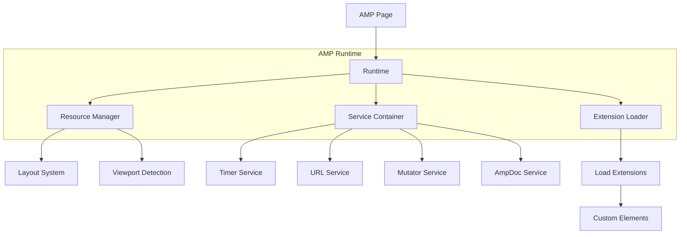
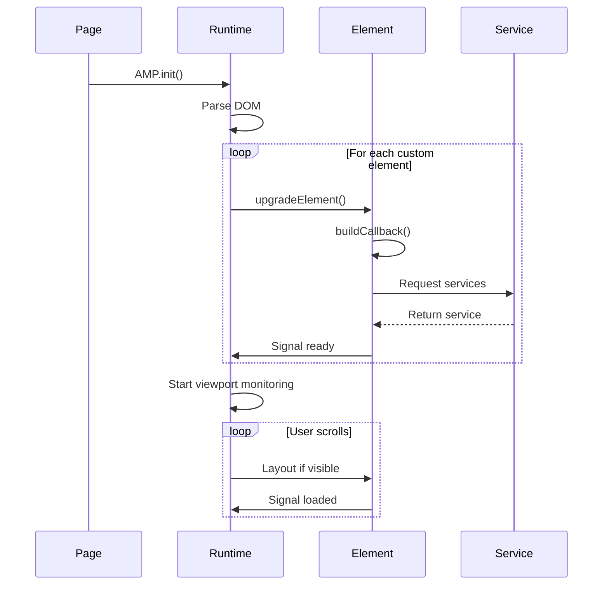
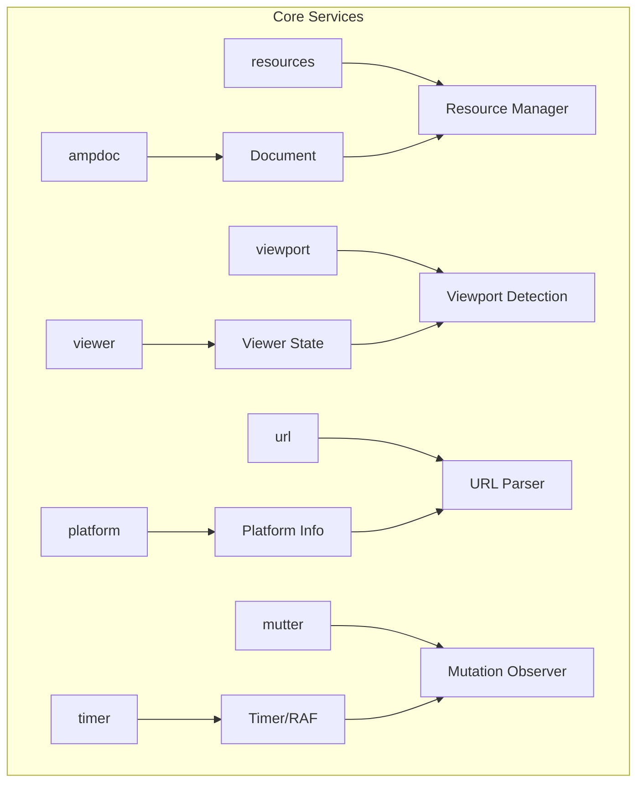

# Project Exploration: AMP HTML

## Overview

AMP (Accelerated Mobile Pages) is a web component framework for creating user-first websites, stories, ads, emails, and more. Originally launched by Google, AMP provides a subset of HTML with restrictions and optimizations to ensure fast loading times and smooth user experiences.

**Key Characteristics:**
- **Performance First** - Optimized for fast page loads
- **Component-Based** - Custom elements for common patterns
- **Validated HTML** - Strict validation ensures best practices
- **Mobile Optimized** - Designed for mobile-first experiences
- **Cache Friendly** - Works with AMP Cache for instant loading
- **SEO Friendly** - Improved search visibility
- **Multi-Format** - Websites, Stories, Ads, Emails

## Repository Structure

```
amphtml/
├── build-system/             # Build configuration
│   ├── babel-config.js       # Babel configuration
│   ├── babel-transform.js    # Babel transforms
│   ├── bundle-size/          # Bundle size tracking
│   ├── check-git-clean.js    # Git cleanliness checks
│   ├── ci-check.js           # CI validation
│   ├── compilation/          # Closure compilation
│   ├── config.js             # Build configuration
│   ├── css-build.js          # CSS processing
│   ├── extension-imports/    # Extension imports
│   ├── lint.js               # Linting tasks
│   ├── pr-check.js           # PR validation
│   ├── test-config.js        # Test configuration
│   ├── unit-test-config.js   # Unit test config
│   └── tasks/
│       ├── build.js          # Build tasks
│       ├── clean.js          # Cleanup tasks
│       ├── exec.js           # Execution tasks
│       ├── test.js           # Test tasks
│       └── update-versions.js # Version updates
│
├── src/
│   ├── amp.js                # Core AMP runtime
│   ├── core/
│   │   ├── dom/              # DOM utilities
│   │   │   ├── element.js
│   │   │   ├── query-selector-cache.js
│   │   │   └── ...
│   │   ├── event-helper.js   # Event helpers
│   │   ├── native-includes.js # Polyfills
│   │   ├── predicate.js      # Predicates
│   │   ├── service-helpers.js # Service helpers
│   │   └── ...
│   ├── dom/
│   │   ├── animation.js      # Animation utilities
│   │   ├── form.js           # Form utilities
│   │   ├── iframe.js         # iframe utilities
│   │   ├── input.js          # Input utilities
│   │   ├── measured-element.js # Measured elements
│   │   ├── styles.js         # Style utilities
│   │   └── ...
│   ├── react/
│   │   ├── amp-react-list/   # Virtual scrolling list
│   │   ├── amp-react-img/    # Optimized images
│   │   └── ...
│   ├── preconnect/           # Preconnection handling
│   ├── resource/             # Resource management
│   ├── services/             # Core services
│   │   ├── ampdoc-impl.js    # Document service
│   │   ├── bind-impl.js      # Data binding
│   │   ├── extensions-impl.js # Extension loader
│   │   ├── mutator-impl.js   # Mutation observer
│   │   ├── resources-impl.js # Resource manager
│   │   ├── sizing-impl.js    # Sizing service
│   │   ├── timer-impl.js     # Timer service
│   │   ├── url-replacements.js # URL replacement
│   │   └── ...
│   ├── utils/
│   │   ├── array.js          # Array utilities
│   │   ├── async.js          # Async utilities
│   │   ├── browser.js        # Browser detection
│   │   ├── function.js       # Function utilities
│   │   ├── json.js           # JSON utilities
│   │   ├── log.js            # Logging
│   │   ├── math.js           # Math utilities
│   │   ├── object.js         # Object utilities
│   │   ├── promise.js        # Promise utilities
│   │   ├── string.js         # String utilities
│   │   ├── template.js       # Template utilities
│   │   └── ...
│   └── index.js              # Main entry
│
├── extensions/               # AMP Extensions (Custom Elements)
│   ├── amp-accordion/        # Collapsible sections
│   │   └── 0.1/
│   │       └── amp-accordion.js
│   ├── amp-anim/             # Animated images
│   │   └── 0.1/
│   │       └── amp-anim.js
│   ├── amp-bind/             # Dynamic data binding
│   │   └── 0.1/
│   │       ├── amp-bind.js
│   │       ├── bind-evaluator.js
│   │       └── ...
│   ├── amp-bodymovin/        # Lottie animations
│   ├── amp-brid-player/      # BRID player
│   ├── amp-brightcove/       # Brightcove player
│   ├── amp-carousel/         # Image carousels
│   │   └── 0.2/
│   │       └── amp-carousel.js
│   ├── amp-dailymotion/      # Dailymotion embed
│   ├── amp-date-countdown/   # Date countdown
│   ├── amp-date-display/     # Date display
│   ├── amp-date-picker/      # Date picker
│   ├── amp-embed/            # Embed placeholder
│   ├── amp-experiment/       # A/B experiments
│   ├── amp-fx-flying-carpet/ # Flying carpet
│   ├── amp-geo/              # Geo location
│   ├── amp-iframe/           # Optimized iframes
│   │   └── 0.1/
│   │       └── amp-iframe.js
│   ├── amp-img/              # Optimized images
│   │   └── 0.1/
│   │       └── amp-img.js
│   ├── amp-inputmask/        # Input masking
│   ├── amp-instagram/        # Instagram embed
│   ├── amp-install-serviceworker/ # Service worker
│   ├── amp-jwplayer/         # JW Player
│   ├── amp-kaltura-player/   # Kaltura player
│   ├── amp-lightbox/         # Lightbox overlay
│   ├── amp-list/             # Dynamic lists
│   │   └── 0.1/
│   │       └── amp-list.js
│   ├── amp-live-list/        # Live content updates
│   ├── amp-mustache/         # Mustache templates
│   │   └── 0.2/
│   │       └── amp-mustache.js
│   ├── amp-next-page/        # Infinite scroll
│   ├── amp-o2-player/        # O2 player
│   ├── amp-ooyala-player/    # Ooyala player
│   ├── amp-orientation/      # Orientation observer
│   ├── amp-pinterest/        # Pinterest widgets
│   ├── amp-player/           # Base player
│   ├── amp-reach-player/     # Reach player
│   ├── amp-recaptcha/        # reCAPTCHA
│   ├── amp-reddit/           # Reddit embed
│   ├── amp-script/          # Custom JavaScript
│   ├── amp-sidebar/          # Off-canvas sidebar
│   ├── amp-skimlinks/        # Skimlinks
│   ├── amp-springboard-player/ # Springboard
│   ├── amp-story/            # AMP Stories
│   │   └── 1.0/
│   │       ├── amp-story.js
│   │       ├── amp-story-page.js
│   │       ├── amp-story-player.js
│   │       └── ...
│   ├── amp-timeago/          # Relative time
│   ├── amp-twitter/          # Twitter embed
│   ├── amp-user-notification/ # Cookie consent
│   ├── amp-video/            # Video player
│   │   └── 0.1/
│   │       └── amp-video.js
│   ├── amp-vimeo/            # Vimeo embed
│   ├── amp-viz-vega/         # Vega visualizations
│   ├── amp-web-push/         # Web push notifications
│   ├── amp-wordpress/        # WordPress embed
│   ├── amp-youtube/          # YouTube embed
│   └── ...
│
├── third_party/              # Third-party dependencies
│   ├── amp-toolbox/          # AMP Toolbox
│   ├── bento/                # Bento components
│   ├── closure/              # Closure library
│   ├── react-dom-17/         # React DOM
│   ├── react-17/             # React
│   └── ...
│
├── validator/                # AMP Validator
│   ├── cs/                   # C# validator
│   ├── java/                 # Java validator
│   ├── js/                   # JavaScript validator
│   │   ├── nodejs/           # Node.js version
│   │   └── webui/            # Web UI
│   └── package.json
│
├── ads/                      # AMP Ad components
│   ├── amp-ad/               # Ad placeholder
│   ├── amp-ad-exit/          # Ad exit
│   └── ...
│
├── examples/                 # Example AMP pages
│   ├── article.amp.html      # Article example
│   ├── product.amp.html      # Product page
│   └── ...
│
├── test/                     # Test files
│   ├── integration/          # Integration tests
│   ├── unit/                 # Unit tests
│   ├── e2e/                  # E2E tests
│   └── fixtures/             # Test fixtures
│
├── css/                      # CSS stylesheets
│   └── amp.css               # Core AMP styles
│
├── img/                      # Image assets
├── tools/                    # Developer tools
├── package.json              # Root package.json
├── tsconfig.json             # TypeScript config
└── README.md
```

## Architecture

### Runtime Architecture



### Component Lifecycle



### Service Architecture



## AMP Components

### Layout Components

| Component | Description |
|-----------|-------------|
| amp-accordion | Collapsible content sections |
| amp-carousel | Image/content carousel |
| amp-lightbox | Modal overlay |
| amp-sidebar | Off-canvas navigation |
| amp-list | Dynamic JSON-driven lists |
| amp-live-list | Live content updates |
| amp-next-page | Infinite scroll/pagination |

### Media Components

| Component | Description |
|-----------|-------------|
| amp-img | Optimized images with lazy loading |
| amp-anim | Animated GIFs with placeholder |
| amp-video | Video player with lazy loading |
| amp-audio | Audio player |
| amp-iframe | Sandboxed iframes |
| amp-embed | Embed placeholder |

### Third-Party Embeds

| Component | Description |
|-----------|-------------|
| amp-youtube | YouTube videos |
| amp-vimeo | Vimeo videos |
| amp-twitter | Twitter embeds |
| amp-instagram | Instagram embeds |
| amp-reddit | Reddit embeds |
| amp-pinterest | Pinterest widgets |
| amp-facebook | Facebook embeds |
| amp-snapchat | Snapchat embeds |

### Interactive Components

| Component | Description |
|-----------|-------------|
| amp-bind | Dynamic data binding |
| amp-form | Form handling |
| amp-inputmask | Input field masking |
| amp-selector | Item selection |
| amp-date-picker | Date selection |
| amp-fx-flying-carpet | Flying carpet ad |

### Story Components

| Component | Description |
|-----------|-------------|
| amp-story | Full AMP stories |
| amp-story-player | Story player embed |
| amp-story-page | Story pages |

## Core API

### Basic AMP Page

```html
<!doctype html>
<html ⚡ lang="en">
<head>
  <meta charset="utf-8">
  <meta name="viewport" content="width=device-width,minimum-scale=1">
  <title>My AMP Page</title>
  <link rel="canonical" href="https://example.com/page.html">
  <script async src="https://cdn.ampproject.org/v0.js"></script>
  <script async custom-element="amp-carousel"
          src="https://cdn.ampproject.org/v0/amp-carousel-0.2.js"></script>
  <style amp-boilerplate>body{-webkit-animation:-amp-start 8s steps(1,end) 0s 1 normal both;-moz-animation:-amp-start 8s steps(1,end) 0s 1 normal both;-ms-animation:-amp-start 8s steps(1,end) 0s 1 normal both;animation:-amp-start 8s steps(1,end) 0s 1 normal both}@-webkit-keyframes -amp-start{from{visibility:hidden}to{visibility:visible}}@-moz-keyframes -amp-start{from{visibility:hidden}to{visibility:visible}}@-ms-keyframes -amp-start{from{visibility:hidden}to{visibility:visible}}@keyframes -amp-start{from{visibility:hidden}to{visibility:visible}}</style>
  <noscript><style amp-boilerplate>body{-webkit-animation:none;-moz-animation:none;-ms-animation:none;animation:none}</style></noscript>
</head>
<body>
  <h1>Hello AMP</h1>
</body>
</html>
```

### AMP Image

```html
<amp-img
  src="/images/hero.jpg"
  alt="Hero image"
  width="1200"
  height="800"
  layout="responsive"
  loading="lazy"
  placeholder>
  <amp-img
    placeholder
    src="/images/hero-placeholder.jpg"
    width="1200"
    height="800"
    layout="responsive">
  </amp-img>
</amp-img>
```

### AMP Carousel

```html
<amp-carousel
  width="800"
  height="600"
  layout="responsive"
  type="slides"
  autoplay
  delay="3000">

  <amp-img
    src="/images/slide1.jpg"
    width="800"
    height="600"
    alt="Slide 1">
  </amp-img>

  <amp-img
    src="/images/slide2.jpg"
    width="800"
    height="600"
    alt="Slide 2">
  </amp-img>

  <amp-img
    src="/images/slide3.jpg"
    width="800"
    height="600"
    alt="Slide 3">
  </amp-img>

</amp-carousel>
```

### AMP List with Mustache

```html
<amp-list
  width="auto"
  height="400"
  layout="fixed-height"
  src="https://example.com/products.json"
  binding="no"
  items="."
  class="m1">

  <template type="amp-mustache">
    <div class="product-card">
      <amp-img src="{{image}}" width="100" height="100"></amp-img>
      <h3>{{name}}</h3>
      <p>${{price}}</p>
    </div>
  </template>

</amp-list>
```

### AMP Bind (Dynamic Content)

```html
<body>
  <!-- State declaration -->
  <amp-state id="myState">
    <script type="application/json">
    {
      "count": 0,
      "selected": "option1"
    }
    </script>
  </amp-state>

  <!-- Bind to state -->
  <p [text]="myState.count">Initial count: 0</p>

  <!-- Update state on tap -->
  <button on="tap:AMP.setState({myState: {count: myState.count + 1}})">
    Increment
  </button>

  <!-- Conditional rendering -->
  <div [hidden]="myState.selected != 'option1'">
    Option 1 content
  </div>
</body>
```

### AMP Form

```html
<amp-form
  method="post"
  action-xhr="https://example.com/api/submit"
  target="_top">

  <input
    type="text"
    name="name"
    placeholder="Enter your name"
    required
    on="input-debounced:AMP.setState({name: event.value})">

  <button type="submit">Submit</button>

  <div submitting>
    Submitting...
  </div>

  <div submit-success>
    <template type="amp-mustache">
      Success! Thanks {{name}}
    </template>
  </div>

  <div submit-error>
    <template type="amp-mustache">
      Error submitting form
    </template>
  </div>

</amp-form>
```

### AMP Story

```html
<!doctype html>
<html ⚡ lang="en">
<head>
  <meta charset="utf-8">
  <meta name="viewport" content="width=device-width,minimum-scale=1">
  <script async src="https://cdn.ampproject.org/v0.js"></script>
  <script async custom-element="amp-story"
          src="https://cdn.ampproject.org/v0/amp-story-1.0.js"></script>
  <title>My Story</title>
</head>
<body>
  <amp-story standalone>
    <amp-story-page id="page1">
      <amp-story-grid-layer template="vertical">
        <h1>My Story</h1>
        <amp-img src="cover.jpg" width="720" height="1280"></amp-img>
      </amp-story-grid-layer>
    </amp-story-page>

    <amp-story-page id="page2">
      <amp-story-grid-layer template="thirds">
        <amp-img src="image1.jpg" grid-area="lower"></amp-img>
        <h1 grid-area="upper">Page 2</h1>
      </amp-story-grid-layer>
    </amp-story-page>

    <amp-story-bookend src="bookend.json"></amp-story-bookend>
  </amp-story>
</body>
</html>
```

## Layout System

### Layout Types

```html
<!-- Responsive (width/height defines aspect ratio) -->
<amp-img src="image.jpg" width="16" height="9" layout="responsive"></amp-img>

<!-- Fixed (explicit width/height) -->
<amp-img src="image.jpg" width="300" height="200" layout="fixed"></amp-img>

<!-- Fixed-height (width fills container) -->
<amp-img src="image.jpg" height="300" layout="fixed-height"></amp-img>

<!-- Fill (fills parent container) -->
<div style="width:300px;height:200px;position:relative;">
  <amp-img src="image.jpg" layout="fill"></amp-img>
</div>

<!-- Container (sizes to content) -->
<amp-img src="image.jpg" layout="container">
  <amp-img src="overlay.jpg" width="50" height="50"></amp-img>
</amp-img>

<!-- Intrinsic (uses natural size) -->
<amp-img src="image.jpg" layout="intrinsic"></amp-img>

<!-- No-size (no size specified) -->
<amp-img src="image.jpg" layout="nodisplay"></amp-img>
```

## Validator Rules

### Required Elements

```html
<!doctype html>
<html ⚡ lang="en">  <!-- or <html amp> -->
<head>
  <meta charset="utf-8">
  <meta name="viewport" content="width=device-width,minimum-scale=1">
  <link rel="canonical" href="https://example.com/page.html">
  <script async src="https://cdn.ampproject.org/v0.js"></script>
  <style amp-boilerplate>...</style>
  <noscript><style amp-boilerplate>...</style></noscript>
  <title>Page Title</title>
</head>
<body>
  <!-- Content -->
</body>
</html>
```

### Validation Rules

- Must use valid AMP HTML
- Inline CSS limited to 75KB
- No external JavaScript except AMP components
- All resources must specify width/height
- Fonts must use amp-font or link preload
- Iframes must use amp-iframe
- Forms must use amp-form
- Videos must use amp-video

## Performance Optimizations

### Resource Loading

```javascript
// AMP Runtime handles:
// 1. Lazy loading of images/videos
// 2. Preloading of critical resources
// 3. Viewport-based loading
// 4. Resource prioritization
// 5. Preconnect hints

// Example: amp-img automatically lazy loads
<amp-img
  src="below-fold.jpg"
  width="800"
  height="600"
  loading="lazy"> <!-- Explicit lazy loading -->
</amp-img>
```

### Preconnect

```html
<head>
  <!-- Preconnect to CDN -->
  <link rel="preconnect" href="https://cdn.ampproject.org">
  <link rel="dns-prefetch" href="https://fonts.googleapis.com">

  <!-- Preload critical images -->
  <link rel="preload" as="image" href="hero.jpg">
</head>
```

### AMP Cache

```
AMP Cache URL format:
https://<hash>-cdn.ampproject.org/v/s/example.com/page.html

Benefits:
- CDN distribution
- HTTP/2 push
- Validation guarantee
- Instant loading
```

## Dependencies

### Core Dependencies

| Package | Purpose |
|---------|---------|
| closure-library | Google Closure utilities |
| react/react-dom | React for components (internal) |
| babel | JavaScript compilation |
| rollup | Bundle generation |
| gulp | Build tasks |
| ava | Testing framework |
| karma | Browser testing |

### AMP Toolbox

| Package | Purpose |
|---------|---------|
| @ampproject/toolbox-core | Core toolbox |
| @ampproject/toolbox-optimizer | AMP optimization |
| @ampproject/toolbox-cache-url | Cache URL generation |
| @ampproject/toolbox-validator | AMP validation |

## Examples

### Product Listing

```html
<amp-list
  width="auto"
  height="600"
  layout="fixed-height"
  src="/api/products"
  binding="no">

  <template type="amp-mustache">
    <div class="product">
      <amp-img
        src="{{imageUrl}}"
        width="200"
        height="200"
        alt="{{name}}">
      </amp-img>
      <h3>{{name}}</h3>
      <p class="price">${{price}}</p>
      <button on="tap:AMP.setState({cart: cart.concat(productId)})">
        Add to cart
      </button>
    </div>
  </template>

</amp-list>
```

### Image Gallery with Lightbox

```html
<amp-carousel
  width="800"
  height="600"
  layout="responsive"
  type="slides"
  lightbox="gallery"
  id="gallery">

  <amp-img
    src="photo1.jpg"
    width="800"
    height="600"
    lightbox="gallery"
    alt="Photo 1">
  </amp-img>

  <amp-img
    src="photo2.jpg"
    width="800"
    height="600"
    lightbox="gallery"
    alt="Photo 2">
  </amp-img>

  <amp-img
    src="photo3.jpg"
    width="800"
    height="600"
    lightbox="gallery"
    alt="Photo 3">
  </amp-img>

</amp-carousel>

<amp-lightbox
  id="lightbox"
  layout="nodisplay">
  <amp-img
    src="{{selectedImage}}"
    width="1200"
    height="900"
    layout="responsive">
  </amp-img>
</amp-lightbox>
```

### Accordion FAQ

```html
<amp-accordion>
  <section expanded>
    <h2>What is AMP?</h2>
    <p>AMP is a web component framework for creating user-first websites.</p>
  </section>

  <section>
    <h2>How do I get started?</h2>
    <p>Include the AMP runtime and use AMP components.</p>
  </section>

  <section>
    <h2>Is AMP SEO-friendly?</h2>
    <p>Yes, AMP pages are optimized for search engines.</p>
  </section>
</amp-accordion>
```

## Key Insights

1. **Runtime Control** - AMP runtime manages all resource loading and layout.

2. **Component Isolation** - Each extension is self-contained and lazy-loaded.

3. **Viewport Detection** - Resources load only when near viewport.

4. **Static Sizing** - All elements must have defined dimensions to prevent layout shift.

5. **Service Locator** - Services are injected into components on demand.

6. **Validation First** - Strict validation ensures performance compliance.

7. **Cache Integration** - Built for AMP Cache CDN distribution.

8. **Progressive Enhancement** - Works without JavaScript, enhanced with it.

## Open Considerations

1. **AMP-to-Web** - How does AMP compare to modern web performance practices?

2. **Core Web Vitals** - How does AMP address LCP, FID, CLS metrics?

3. **Bento Components** - What is the Bento component strategy?

4. **PWA Integration** - How does AMP work with Progressive Web Apps?

5. **Module System** - Plans for ES modules instead of Closure?

6. **React Integration** - Better React component support?

7. **Web Stories** - Future of AMP Stories format?

8. **Email/Ads** - AMP for Email and AMP for Ads adoption?
