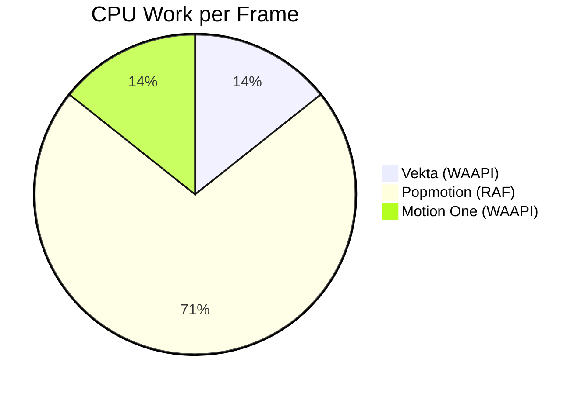
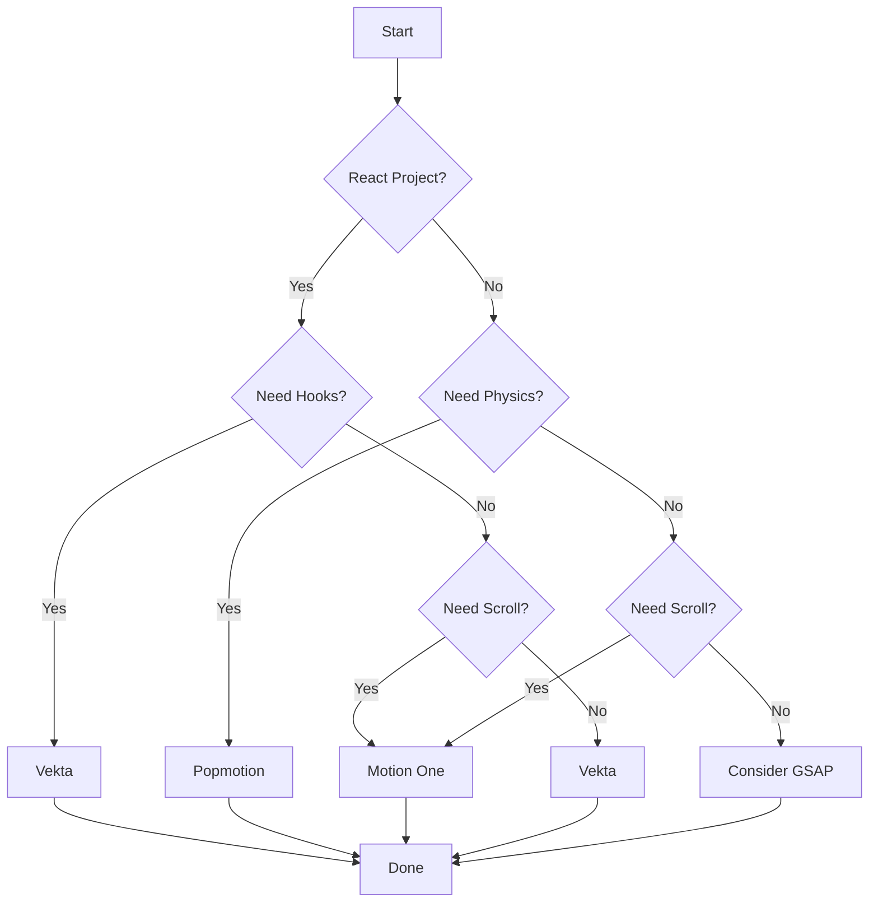

# Animation Libraries Comparison: Vekta, Popmotion, Motion One

**Category:** Comparative Analysis

---

## Executive Summary

This document provides a comprehensive comparison of three modern JavaScript animation libraries: **Vekta**, **Popmotion**, and **Motion One**. All three libraries share a focus on minimal bundle sizes and modern browser APIs, but each takes a distinct approach to animation.

### Quick Recommendations

| Use Case | Recommended Library |
|----------|---------------------|
| React apps, minimal size | **Vekta** |
| Physics-based, interactive | **Popmotion** |
| Scroll animations, smallest | **Motion One** |
| Complex timelines | Consider GSAP |
| Maximum browser support | Consider GSAP |

---

## Architecture Comparison

### Rendering Engine

```mermaid
graph TB
    subgraph "Vekta"
        A1[React Hook] --> A2[WAAPI]
        A2 --> A3[GPU Compositor]
    end

    subgraph "Popmotion"
        B1[Action Creator] --> B2[RAF Loop]
        B2 --> B3[Solver]
        B3 --> B4[Style Update]
    end

    subgraph "Motion One"
        C1[animate()] --> C2[WAAPI]
        C2 --> C3[GPU Compositor]
    end

    style A1 fill:#61dafb
    style B1 fill:#ff6b6b
    style C1 fill:#4ecdc4
```

### Key Architectural Differences

| Aspect | Vekta | Popmotion | Motion One |
|--------|-------|-----------|------------|
| **Core Engine** | WAAPI | RAF + Solvers | WAAPI |
| **Frame Timing** | Browser-managed | Manual (RAF) | Browser-managed |
| **Value Updates** | Native | Subscriber pattern | Native |
| **Garbage Collection** | Automatic | Manual cleanup | Automatic |

---

## Bundle Size Analysis

### Raw Sizes (minified + gzip)

```
Vekta:       ~2 KB  ████████
Motion One:  ~6 KB  ████████████████████████
Popmotion:   ~9 KB  ██████████████████████████████████████
GSAP Core:   ~17 KB ███████████████████████████████████████████████████████████████████████████████
```

### Size vs Features Trade-off

```mermaid
xychart-beta
    x "Bundle Size (KB)" [2, 6, 9, 17]
    y "Feature Score" 0 --> 100
    "Vekta" [2, 45]
    "Motion One" [6, 60]
    "Popmotion" [9, 75]
    "GSAP" [17, 95]
```

---

## API Comparison

### Creating a Basic Animation

#### Vekta (Hook-based)

```tsx
import { useAnimation } from 'vekta';

function Component() {
  const [ref, animate] = useAnimation({
    from: { opacity: 0 },
    to: { opacity: 1 },
    duration: 500
  });

  return <div ref={ref}>Hello</div>;
}
```

#### Popmotion (Functional)

```typescript
import { tween, styler } from 'popmotion';

const element = document.querySelector('.box');
const elementStyler = styler(element);

tween({
  from: { opacity: 0 },
  to: { opacity: 1 },
  duration: 500
}).start(v => elementStyler.set('opacity', v.opacity));
```

#### Motion One (Function-based)

```typescript
import { animate } from 'motion';

animate(
  element,
  { opacity: [0, 1] },
  { duration: 0.5 }
);
```

### API Philosophy

| Library | Paradigm | Lines of Code | Learning Curve |
|---------|----------|---------------|----------------|
| Vekta | Declarative Hooks | 5-7 | Low |
| Popmotion | Functional Reactive | 7-10 | Medium |
| Motion One | Imperative Function | 3-5 | Low |

---

## Physics Support

### Spring Animation Comparison

#### Vekta

```typescript
import { useSpring } from 'vekta';

const [ref, spring] = useSpring({
  from: { x: 0 },
  to: { x: 100 },
  stiffness: 100,
  damping: 15,
  mass: 1
});
```

#### Popmotion

```typescript
import { spring } from 'popmotion';

spring({
  from: 0,
  to: 100,
  velocity: 5,
  stiffness: 100,
  damping: 15,
  mass: 1
}).start(value => {
  element.style.transform = `translateX(${value}px)`;
});
```

#### Motion One

```typescript
import { animate, spring } from 'motion';

// Motion One approximates springs for WAAPI
animate(
  element,
  { x: [0, 100] },
  { duration: 0.5, easing: spring({ stiffness: 100, damping: 15 }) }
);
```

### Physics Feature Matrix

| Feature | Vekta | Popmotion | Motion One |
|---------|-------|-----------|------------|
| Spring Animation | Basic | Advanced | Approximated |
| Decay/Inertia | No | Yes | Yes |
| Velocity Tracking | No | Yes | Limited |
| Custom Solvers | No | Yes | No |

---

## Scroll-Linked Animations

### Implementation Comparison

#### Vekta

```typescript
import { useScrollAnimation } from 'vekta';

function Component() {
  const [ref, state] = useScrollAnimation({
    from: { opacity: 0 },
    to: { opacity: 1 },
    threshold: 0.2
  });

  return <div ref={ref}>Content</div>;
}
```

#### Popmotion

```typescript
import { listen, scroll } from 'popmotion';

listen(window, 'scroll')
  .pipe(
    transform.map(e => e.target.scrollY),
    transform.clamp(0, maxScroll)
  )
  .start(scrollY => {
    element.style.opacity = scrollY / maxScroll;
  });
```

#### Motion One

```typescript
import { scroll, animate } from 'motion';

scroll(
  animate(element, { opacity: [0, 1] }),
  {
    offset: ['start end', 'end start']
  }
);
```

### Scroll Feature Matrix

| Feature | Vekta | Popmotion | Motion One |
|---------|-------|-----------|------------|
| Built-in Scroll | Basic | Manual | Full |
| Offset Syntax | No | No | Yes |
| Container Support | Limited | Yes | Yes |
| Horizontal Scroll | Yes | Yes | Yes |

---

## Composition Patterns

### Sequential Animations

#### Vekta

```typescript
import { sequence } from 'vekta';

sequence([
  [animate, { x: 100 }, { duration: 300 }],
  [animate, { y: 100 }, { duration: 300 }],
  [animate, { rotate: 45 }, { duration: 300 }]
]).play();
```

#### Popmotion

```typescript
import { chain, tween } from 'popmotion';

chain(
  tween({ from: 0, to: 100, duration: 300 }),
  tween({ from: 100, to: 200, duration: 300 }),
  tween({ from: 200, to: 250, duration: 300 })
).start(value => {
  element.style.transform = `translateX(${value}px)`;
});
```

#### Motion One

```typescript
import { animate } from 'motion';

// Manual sequencing with async/await
await animate(el, { x: [0, 100] }, { duration: 0.3 }).finished;
await animate(el, { y: [0, 100] }, { duration: 0.3 }).finished;
await animate(el, { rotate: [0, 45] }, { duration: 0.3 }).finished;
```

### Composition Matrix

| Feature | Vekta | Popmotion | Motion One |
|---------|-------|-----------|------------|
| Sequential | sequence() | chain() | Manual |
| Parallel | parallel() | merge() | Multiple calls |
| Stagger | delay option | delay option | stagger() |
| Timeline | Basic | Chain | timeline() |

---

## Performance Comparison

### Frame Budget Analysis



### Memory Management

| Library | Cleanup Strategy | GC-Friendly |
|---------|-----------------|-------------|
| Vekta | Automatic (useEffect) | Yes |
| Popmotion | Manual (return cleanup) | With care |
| Motion One | Automatic (WAAPI) | Yes |

### Optimization Techniques

#### Vekta
- Automatic `will-change` hints
- Batched DOM operations
- WeakRef for element tracking

#### Popmotion
- Object pooling
- Delta time normalization
- Early exit optimization

#### Motion One
- Compositor-only property detection
- Reduced motion support
- Automatic cleanup

---

## Browser Support

### Compatibility Matrix

| Browser | Vekta | Popmotion | Motion One |
|---------|-------|-----------|------------|
| Chrome 60+ | ✓ | ✓ | ✓ |
| Firefox 55+ | ✓ | ✓ | ✓ |
| Safari 11+ | ✓ | ✓ | ✓ |
| Edge 79+ | ✓ | ✓ | ✓ |
| IE 11 | ✗ | ✓ | ✗ |
| Samsung Internet | ✓ | ✓ | ✓ |

### Feature Detection Required

```typescript
// WAAPI support check (Vekta, Motion One)
function supportsWAAPI() {
  return typeof Element?.prototype?.animate === 'function';
}

// Popmotion works everywhere RAF exists
function supportsRAF() {
  return typeof requestAnimationFrame === 'function';
}
```

---

## Developer Experience

### TypeScript Support

| Library | Type Definitions | Inference | DX Score |
|---------|-----------------|-----------|----------|
| Vekta | Built-in | Excellent | 9/10 |
| Popmotion | Built-in | Good | 8/10 |
| Motion One | Built-in | Good | 8/10 |

### Debugging Support

```typescript
// Popmotion has built-in logging
import { transform } from 'popmotion';

const debugPipe = pipe(
  transform.map(v => v),
  transform.pipe(console.log) // Log every value
);

// Vekta and Motion One rely on browser DevTools
// for WAAPI inspection
```

### Ecosystem

| Aspect | Vekta | Popmotion | Motion One |
|--------|-------|-----------|------------|
| React Integration | Native | Via Framer Motion | Manual |
| Vue Integration | Manual | Manual | Manual |
| Svelte Integration | Manual | Manual | Manual |
| Community Size | Small | Medium | Medium |
| Documentation | Good | Excellent | Good |

---

## Use Case Recommendations

### Best for React Applications

**Winner: Vekta**

```tsx
// Vekta's React-first design shines
function AnimatedList({ items }) {
  return (
    <ul>
      {items.map((item, i) => (
        <AnimatedItem key={item.id} item={item} index={i} />
      ))}
    </ul>
  );
}

function AnimatedItem({ item, index }) {
  const [ref, animate] = useAnimation({
    from: { opacity: 0, y: 20 },
    to: { opacity: 1, y: 0 },
    delay: index * 50
  });

  return <li ref={ref}>{item.name}</li>;
}
```

### Best for Interactive Animations

**Winner: Popmotion**

```typescript
// Popmotion's physics and pointer tracking
import { pointer, spring } from 'popmotion';

function createDraggable(element) {
  pointer()
    .start({
      update: ({ x, y }) => {
        element.style.transform = `translate(${x}px, ${y}px)`;
      },
      complete: () => {
        // Spring back with physics
        spring({
          from: { x, y },
          to: { x: 0, y: 0 },
          velocity
        }).start(updateElement);
      }
    });
}
```

### Best for Scroll Animations

**Winner: Motion One**

```typescript
// Motion One's scroll offset syntax is unmatched
import { scroll, animate } from 'motion';

scroll(
  animate(element, {
    opacity: [0, 1],
    y: [50, 0]
  }),
  {
    offset: [
      'start end',    // Start when element top hits container bottom
      'center center' // End when element center hits container center
    ]
  }
);
```

---

## Migration Paths

### From GSAP to Modern Libraries

```typescript
// GSAP
gsap.to(element, { x: 100, duration: 0.5 });

// Vekta
const [ref, animate] = useAnimation({
  from: { x: 0 },
  to: { x: 100 },
  duration: 500
});

// Popmotion
tween({
  from: { x: 0 },
  to: { x: 100 },
  duration: 500
}).start(v => element.style.transform = `translateX(${v.x}px)`);

// Motion One
animate(element, { x: [0, 100] }, { duration: 0.5 });
```

### Between Modern Libraries

```typescript
// Vekta to Motion One
// Replace hook with function call
const [ref, animate] = useAnimation(config);
// becomes
const controls = animate(ref.current, keyframes, options);

// Popmotion to Motion One
// Replace RAF with WAAPI
tween(config).start(update);
// becomes
animate(element, keyframes, options);
```

---

## Decision Framework



---

## Summary Matrix

| Criteria | Vekta | Popmotion | Motion One |
|----------|-------|-----------|------------|
| **Bundle Size** | ⭐⭐⭐ | ⭐⭐ | ⭐⭐ |
| **Performance** | ⭐⭐⭐ | ⭐⭐ | ⭐⭐⭐ |
| **React DX** | ⭐⭐⭐ | ⭐⭐ | ⭐⭐ |
| **Physics** | ⭐⭐ | ⭐⭐⭐ | ⭐ |
| **Scroll** | ⭐⭐ | ⭐ | ⭐⭐⭐ |
| **Composition** | ⭐⭐ | ⭐⭐⭐ | ⭐⭐ |
| **Browser Support** | ⭐⭐ | ⭐⭐⭐ | ⭐⭐ |
| **Learning Curve** | ⭐⭐⭐ | ⭐⭐ | ⭐⭐⭐ |
| **Documentation** | ⭐⭐⭐ | ⭐⭐⭐ | ⭐⭐⭐ |
| **Ecosystem** | ⭐⭐ | ⭐⭐⭐ | ⭐⭐ |

---

## Conclusions

### Vekta
**Best for:** React applications prioritizing minimal bundle size with hook-based APIs.

**Strengths:**
- Smallest bundle size (~2KB)
- React-first design with hooks
- WAAPI-based for GPU acceleration
- Excellent TypeScript support

**Weaknesses:**
- React-only (no framework agnostic)
- Limited physics support
- Basic timeline capabilities

### Popmotion
**Best for:** Interactive, physics-based animations with functional programming patterns.

**Strengths:**
- Advanced physics (springs, decay)
- Functional reactive API
- Excellent composition primitives
- Framework agnostic

**Weaknesses:**
- Larger bundle (~9KB)
- RAF-based (more CPU work)
- Manual cleanup required

### Motion One
**Best for:** Scroll-linked animations and modern web apps targeting evergreen browsers.

**Strengths:**
- Small bundle (~6KB)
- Built-in scroll animations
- WAAPI-based performance
- Simple, intuitive API

**Weaknesses:**
- Limited physics support
- Modern browsers only
- Basic composition tools

---

*Document generated as part of animation library exploration series - 2026-03-20*
