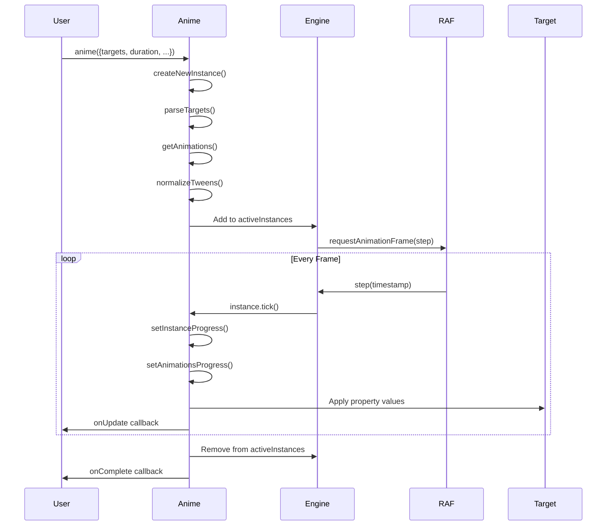
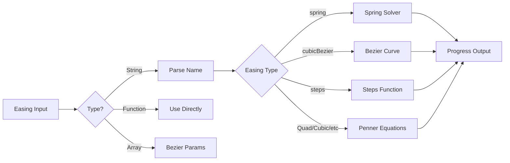

# Project Exploration: Anime.js (Animations)

## Overview

Anime.js is a lightweight JavaScript animation engine with a simple yet powerful API. It works with CSS properties, SVG, DOM attributes, and JavaScript objects, providing a unified interface for animating virtually anything on the web.

**Key Characteristics:**
- **Lightweight** - Only ~6KB gzipped
- **Versatile** - Animate CSS, SVG, DOM attributes, JS objects
- **Simple API** - Intuitive animation declarations
- **Powerful Easing** - Custom easing functions, springs, bezier curves
- **Timeline Support** - Sequence and orchestrate multiple animations
- **SVG Animation** - Path animation, morphing, line drawing
- **No Dependencies** - Pure vanilla JavaScript

## Repository Structure

```
anime/
├── lib/
│   ├── anime.js              # Uncompiled source
│   ├── anime.es.js           # ES module version
│   ├── anime.min.js          # Minified production build
│   └── anime.min.js.gz       # Gzipped version
│
├── src/
│   ├── index.js              # Main entry point
│   ├── utils.js              # Utility functions
│   ├── easing.js             # Easing functions
│   ├── animations.js         # Animation core
│   ├── timeline.js           # Timeline implementation
│   └── svg.js                # SVG utilities
│
├── documentation/
│   ├── index.html            # Documentation site
│   ├── assets/
│   │   ├── css/
│   │   │   ├── anime-theme.css
│   │   │   ├── documentation.css
│   │   │   └── website.css
│   │   ├── js/
│   │   │   ├── anime/
│   │   │   │   ├── anime.1.0.js       # v1.0 legacy
│   │   │   │   ├── anime.2.0.0.js     # v2.0 legacy
│   │   │   │   ├── anime.3.0.0-alpha.js
│   │   │   │   └── anime.es.js        # Current ES module
│   │   │   ├── vendors/
│   │   │   │   ├── beautify-html.js
│   │   │   │   ├── highlight.pack.js  # Syntax highlighting
│   │   │   │   └── stats.min.js       # Performance stats
│   │   │   ├── anime.player.js        # Animation player
│   │   │   └── documentation.js       # Docs interactivity
│   │   ├── fonts/
│   │   │   ├── InputMono-*.woff       # Code font
│   │   │   └── Roobert-*.woff         # UI font
│   │   └── img/
│   │       ├── icons/                 # SVG icons
│   │       ├── sponsors/              # Sponsor logos
│   │       └── *.gif                  # Animation demos
│   │
│   └── examples/
│       ├── DOM-stress-test.html
│       ├── advanced-staggering.html
│       ├── animejs-v3-logo-animation.html
│       ├── built-in-easings.html
│       ├── callbacks.html
│       ├── colors-test.html
│       ├── complex-properties.html
│       ├── directions-testing.html
│       ├── ease-visualizer.html
│       ├── keyframes.html
│       ├── layered-animations.html
│       ├── stagger-demo.html
│       ├── stagger-grid-demo.html
│       ├── svg-lines-animations.html
│       ├── svg-path-animation.html
│       ├── timeline.html
│       └── transforms-demo.html
│
├── build                     # Build configuration
├── package.json
└── README.md
```

## Architecture

### Core Animation System

```mermaid
graph TB
    A[anime()] --> B[createNewInstance]

    B --> C[parseTargets]
    B --> D[getProperties]
    B --> E[getAnimations]

    C --> F[Animatables Array]
    D --> G[Tween Settings]
    E --> H[Animation Objects]

    G --> I[Normalize Tweens]
    H --> J[Engine Loop]

    I --> K[Value Decomposition]
    K --> L[Progress Calculation]

    J --> M[requestAnimationFrame]
    M --> N[setAnimationsProgress]

    N --> O[Apply Values]
    O --> P[Callbacks]
```

### Animation Lifecycle



### Easing System



## Core API

### Basic Animation

```javascript
import anime from 'animejs/lib/anime.es.js';

anime({
  targets: '.my-element',
  translateX: 250,
  rotate: '1turn',
  backgroundColor: '#FFF',
  duration: 800,
  easing: 'easeInOutQuad'
});
```

### Animation Parameters

```javascript
anime({
  targets: '.box',

  // What to animate
  translateX: '100px',     // CSS transform
  translateY: 50,          // Pixels by default
  scale: 1.5,              // Scale factor
  rotate: '0.5turn',       // Rotation
  opacity: 0.5,            // CSS property
  backgroundColor: '#ff0', // CSS color

  // Timing
  duration: 1000,          // Milliseconds
  delay: 200,              // Delay before start
  endDelay: 100,           // Delay after end

  // Playback
  loop: 3,                 // Number of loops (or true for infinite)
  direction: 'alternate',  // 'normal', 'reverse', 'alternate'
  easing: 'easeInOutQuad', // Easing function

  // Callbacks
  begin: function(anim) {},
  update: function(anim) {},
  complete: function(anim) {}
});
```

### Targets

```javascript
// CSS selector
anime({ targets: '.my-class' });

// DOM element
anime({ targets: document.getElementById('myElement') });

// Multiple elements
anime({ targets: [el1, el2, el3] });

// NodeList
anime({ targets: document.querySelectorAll('.items') });

// SVG element
anime({ targets: '#myPath' });

// JavaScript object
const obj = { value: 0 };
anime({
  targets: obj,
  value: 100,
  update: () => console.log(obj.value)
});

// Array of mixed targets
anime({ targets: ['.class1', '#id', element] });
```

## Easing Functions

### Built-in Easings

```javascript
// Linear
'easing': 'linear'

// Penner equations
'easing': 'easeInQuad'
'easing': 'easeOutQuad'
'easing': 'easeInOutQuad'
'easing': 'easeInCubic'
'easing': 'easeOutCubic'
'easing': 'easeInOutCubic'
'easing': 'easeInQuart'
'easing': 'easeOutQuart'
'easing': 'easeInOutQuart'
'easing': 'easeInQuint'
'easing': 'easeOutQuint'
'easing': 'easeInOutQuint'

// Special easings
'easing': 'easeInSine'
'easing': 'easeOutSine'
'easing': 'easeInOutSine'
'easing': 'easeInExpo'
'easing': 'easeOutExpo'
'easing': 'easeInOutExpo'
'easing': 'easeInCirc'
'easing': 'easeOutCirc'
'easing': 'easeInOutCirc'
'easing': 'easeInBack'
'easing': 'easeOutBack'
'easing': 'easeInOutBack'
'easing': 'easeInBounce'
'easing': 'easeOutBounce'
'easing': 'easeInOutBounce'

// Elastic easings (with amplitude and period)
'easing': 'easeInElastic(1, .5)'
'easing': 'easeOutElastic(1, .5)'
'easing': 'easeInOutElastic(1, .5)'
```

### Spring Easing

```javascript
// spring(mass, stiffness, damping, velocity)
anime({
  targets: '.spring-box',
  translateX: 200,
  easing: 'spring(1, 100, 10, 0)'
});

// Parameters:
// - mass: 0.1 to 100 (default: 1)
// - stiffness: 0.1 to 100 (default: 100)
// - damping: 0.1 to 100 (default: 10)
// - velocity: 0.1 to 100 (default: 0)
```

### Cubic Bezier

```javascript
// Custom cubic bezier
anime({
  targets: '.bezier-box',
  translateX: 200,
  easing: 'cubicBezier(0.5, 0, 0.5, 1)'
});

// Equivalent to CSS: transition-timing-function: cubic-bezier(0.5, 0, 0.5, 1)
```

### Steps

```javascript
// Step easing
anime({
  targets: '.step-box',
  translateX: 200,
  easing: 'steps(10)'
});
```

### Custom Easing Function

```javascript
// Custom easing function
anime({
  targets: '.custom-box',
  translateX: 200,
  easing: function(t) {
    // t is a value between 0 and 1
    return Math.pow(t, 3); // Custom cubic
  }
});
```

## Timeline

### Basic Timeline

```javascript
const timeline = anime.timeline({
  duration: 800,
  easing: 'linear',
  autoplay: true
});

timeline
  .add({
    targets: '.box',
    translateX: 100
  })
  .add({
    targets: '.box',
    translateY: 50
  }, '-=400') // Start 400ms before previous ends
  .add({
    targets: '.circle',
    scale: 2
  }, '+=200'); // Start 200ms after previous ends
```

### Timeline Offsets

```javascript
const tl = anime.timeline();

// Add with offset
tl.add({
  targets: '.box',
  translateX: 100,
  duration: 500
}, 1000); // Start at 1000ms

tl.add({
  targets: '.circle',
  scale: 2,
  duration: 500
}, '-=250'); // Start 250ms before previous ends

tl.add({
  targets: '.triangle',
  rotate: '1turn',
  duration: 500
}, '+=500'); // Start 500ms after previous ends
```

### Nested Timelines

```javascript
const masterTimeline = anime.timeline();

const subTimeline = anime.timeline({
  autoplay: false
});

subTimeline
  .add({ targets: '.a', x: 100 })
  .add({ targets: '.b', y: 50 });

masterTimeline.add(subTimeline);
```

## Staggering

### Basic Stagger

```javascript
anime({
  targets: '.grid-item',
  scale: [
    {value: .1, easing: 'easeOutSine', duration: 500},
    {value: 1, easing: 'easeInOutQuad', duration: 1200}
  ],
  delay: anime.stagger(200), // Delay each by 200ms
  from: 'center' // Start from center
});
```

### Stagger Options

```javascript
// Stagger from start
delay: anime.stagger(100, {from: 'first'})

// Stagger from end
delay: anime.stagger(100, {from: 'last'})

// Stagger from center
delay: anime.stagger(100, {from: 'center'})

// Stagger from index
delay: anime.stagger(100, {from: 3})

// Stagger with easing
delay: anime.stagger(100, {
  from: 'center',
  easing: 'easeInOutQuad'
})

// Grid staggering
delay: anime.stagger(100, {
  grid: [cols, rows],
  from: 'center',
  axis: 'x' // or 'y'
})
```

### Stagger Grid Example

```javascript
anime({
  targets: '.grid-item',
  translateY: [
    {value: -50, easing: 'easeOutExpo', duration: 400},
    {value: 0, easing: 'easeInOutQuad', duration: 800}
  ],
  delay: anime.stagger(100, {
    grid: [5, 3], // 5 columns, 3 rows
    from: 'center',
    axis: 'y'
  })
});
```

## SVG Animation

### Motion Path

```javascript
anime({
  targets: '.following-element',
  translateX: anime.path('#motion-path', 'x'),
  translateY: anime.path('#motion-path', 'y'),
  rotate: anime.path('#motion-path', 'angle'),
  easing: 'linear',
  duration: 2000
});
```

### SVG Line Drawing

```javascript
// Set initial stroke-dashoffset
const path = document.querySelector('#myPath');
const length = path.getTotalLength();

anime({
  targets: '#myPath',
  strokeDashoffset: [length, 0],
  easing: 'easeInOutSine',
  duration: 1500,
  delay: function(el, i) { return i * 250 },
  direction: 'alternate'
});
```

### Morphing SVG Paths

```javascript
anime({
  targets: '#morph-path',
  d: [
    {value: 'M100 100 Q200 50 300 100 T500 100'},
    {value: 'M100 200 Q200 250 300 200 T500 200'},
    {value: 'M100 100 Q200 50 300 100 T500 100'}
  ],
  easing: 'easeInOutSine',
  duration: 2000,
  loop: true
});
```

## Advanced Features

### Keyframes

```javascript
anime({
  targets: '.box',
  translateX: [
    {value: 100, duration: 500},
    {value: 200, duration: 500},
    {value: 0, duration: 500}
  ],
  rotate: [
    {value: '0.25turn', duration: 500},
    {value: '0.5turn', duration: 500},
    {value: '1turn', duration: 500}
  ],
  easing: 'easeInOutQuad'
});
```

### Dynamic Values

```javascript
// Function-based values
anime({
  targets: '.items',
  translateX: function(target, index, total) {
    return index * 100; // Each moves progressively further
  },
  delay: function(target, index, total) {
    return index * 100;
  },
  duration: function(target, index, total) {
    return 500 + (index * 100);
  }
});
```

### Relative Values

```javascript
anime({
  targets: '.box',
  translateX: '+=100',  // Add 100px to current
  translateY: '-=50',  // Subtract 50px from current
  scale: '*=1.5',      // Multiply current by 1.5
  rotate: '/=2'        // Divide current by 2
});
```

### Colors

```javascript
anime({
  targets: '.colored-box',
  backgroundColor: [
    {value: 'rgb(255, 0, 0)'},
    {value: 'hsl(120, 100%, 50%)'},
    {value: '#0000ff'}
  ],
  duration: 2000
});
```

## Controls

### Playback Control

```javascript
const animation = anime({
  targets: '.box',
  translateX: 200,
  autoplay: false
});

// Play
animation.play();

// Pause
animation.pause();

// Stop and reset
animation.restart();

// Reverse
animation.reverse();

// Seek to specific time
animation.seek(500); // Seek to 500ms

// Remove specific targets
animation.remove('.some-element');
```

### Running Animations

```javascript
// Get all running animations
const running = anime.running;

// Remove targets from all running animations
anime.remove('.my-element');

// Get original value of a property
const value = anime.get('.box', 'transform');

// Set values without animation
anime.set('.box', {translateX: 100});

// Convert pixel values to other units
const px = anime.convertPx('100em');
```

## Callbacks

### Animation Callbacks

```javascript
anime({
  targets: '.box',
  translateX: 200,

  begin: function(anim) {
    console.log('Animation started');
  },

  update: function(anim) {
    console.log('Frame updated', anim.progress);
  },

  loopBegin: function(anim) {
    console.log('Loop started');
  },

  changeBegin: function(anim) {
    console.log('Value change started');
  },

  change: function(anim) {
    console.log('Value changed');
  },

  changeComplete: function(anim) {
    console.log('Value change completed');
  },

  loopComplete: function(anim) {
    console.log('Loop completed');
  },

  complete: function(anim) {
    console.log('Animation completed');
  }
});
```

### Promises

```javascript
// Using promises
async function animateBox() {
  const anim = anime({
    targets: '.box',
    translateX: 200,
    duration: 1000
  });

  await anim.finished;
  console.log('Animation complete!');

  // Chain another animation
  return anime({
    targets: '.box',
    translateX: 0,
    duration: 1000
  });
}
```

## Examples

### Loading Spinner

```javascript
const spinner = anime({
  targets: '.spinner',
  rotate: '1turn',
  duration: 1000,
  easing: 'linear',
  loop: true
});

// Stop spinner
spinner.pause();
```

### Typing Effect

```javascript
anime({
  targets: '.text span',
  opacity: [0, 1],
  translateX: [-10, 0],
  delay: anime.stagger(100, {start: 500}),
  easing: 'easeOutSine'
});
```

### Card Flip

```javascript
anime({
  targets: '.card',
  rotateY: '180deg',
  duration: 600,
  easing: 'easeInOutSine'
});
```

### Exploding Particles

```javascript
// Create particles
for (let i = 0; i < 20; i++) {
  const particle = document.createElement('div');
  particle.className = 'particle';
  document.body.appendChild(particle);
}

anime({
  targets: '.particle',
  translateX: function() { return anime.random(-200, 200); },
  translateY: function() { return anime.random(-200, 200); },
  scale: function() { return anime.random(0.5, 1.5); },
  opacity: [1, 0],
  easing: 'easeOutExpo',
  duration: 1500,
  delay: anime.stagger(50)
});
```

## Dependencies

### Core (No External Dependencies)

| Feature | Implementation |
|---------|----------------|
| Animation Engine | Custom requestAnimationFrame loop |
| Easing Functions | Penner equations, Bezier solver, Spring solver |
| SVG Support | Native SVG DOM API |
| Color Animation | RGB/HSL parsing and interpolation |
| Unit Handling | Regex-based unit detection |

### Browser Support

| Browser | Minimum Version |
|---------|-----------------|
| Chrome | 24+ |
| Safari | 8+ |
| IE/Edge | 11+ |
| Firefox | 32+ |
| Opera | 15+ |

## Key Insights

1. **Unified Animation Model** - Single API for CSS, SVG, DOM attributes, and JS objects.

2. **Lightweight Core** - Minimal footprint with maximum capability.

3. **Composable Easings** - Spring, bezier, steps, and custom functions.

4. **Timeline Orchestration** - Precise control over animation sequences.

5. **Staggering System** - Powerful grid-based and directional staggering.

6. **SVG Native Support** - First-class SVG path and attribute animation.

7. **Promise Integration** - Modern async/await support via `.finished`.

8. **Direction Control** - Normal, reverse, and alternate looping.

## Open Considerations

1. **Web Animations API** - Could leverage native WAAPI for better performance?

2. **GSAP Comparison** - How does it compare to GSAP for complex sequences?

3. **3D Transforms** - Full support for all 3D transform properties?

4. **Performance at Scale** - How does it handle 1000+ concurrent animations?

5. **Scroll Integration** - Scroll-linked animation support?

6. **Physics Engine** - Plan for more advanced physics-based animations?

7. **React/Vue Integration** - Official framework integrations?

8. **GPU Acceleration** - Explicit control over GPU compositing?
