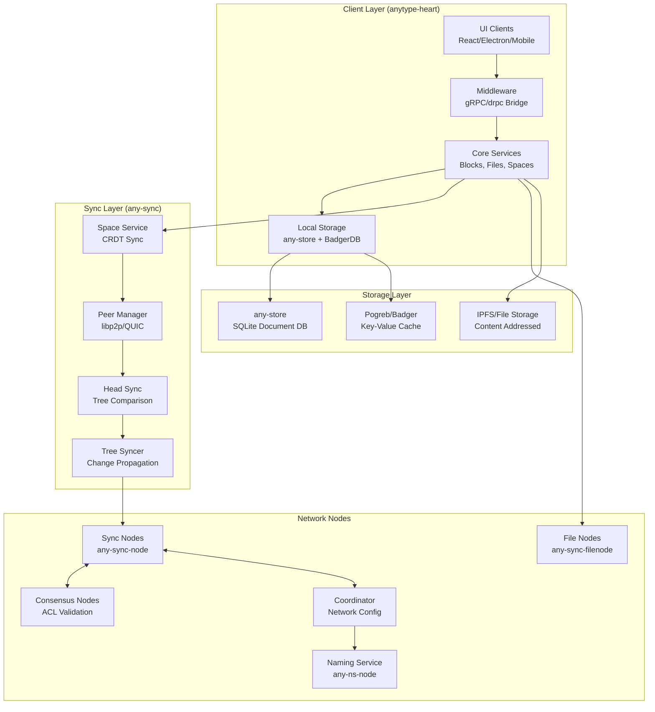
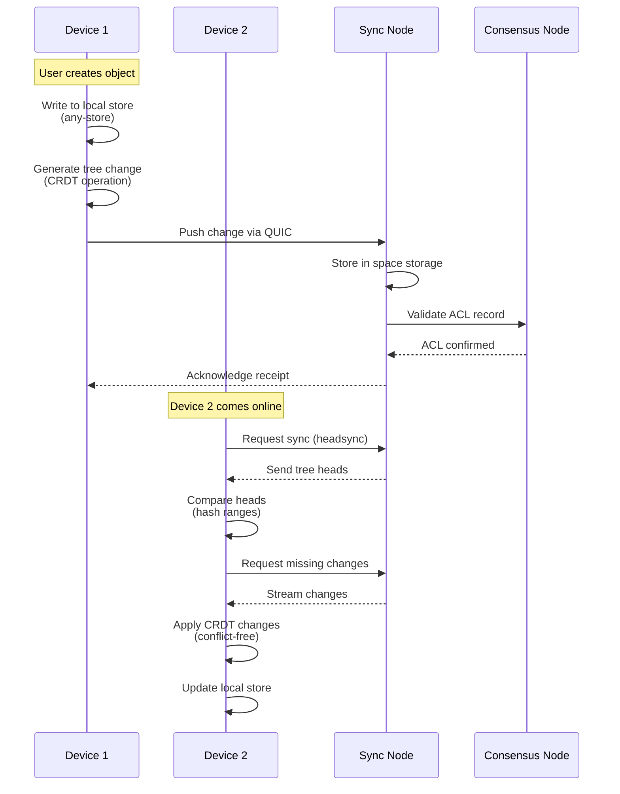
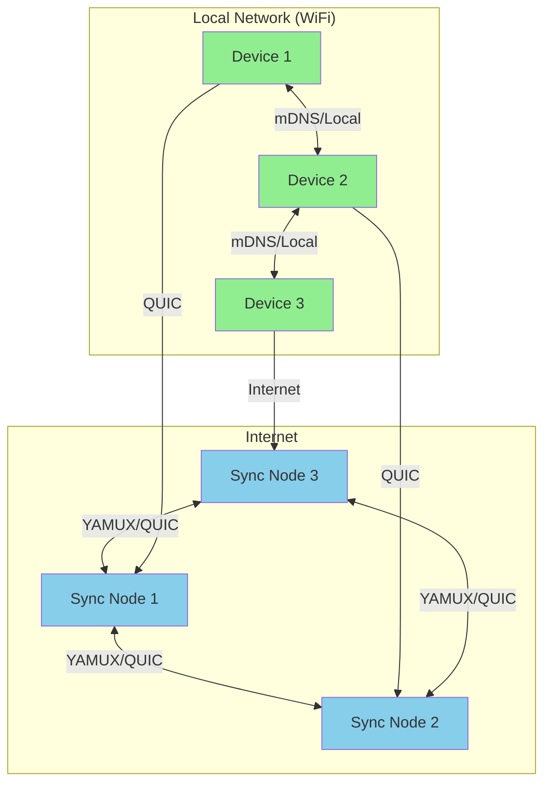
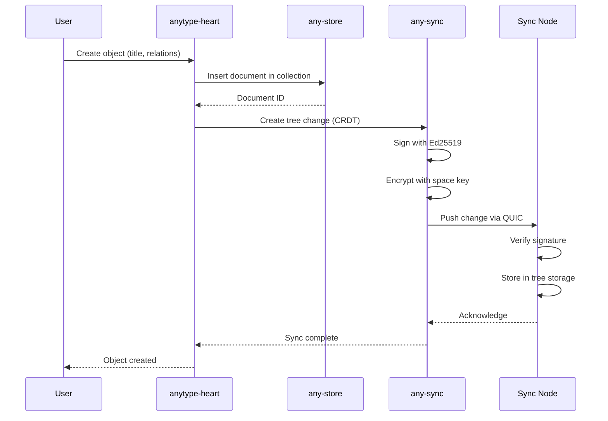
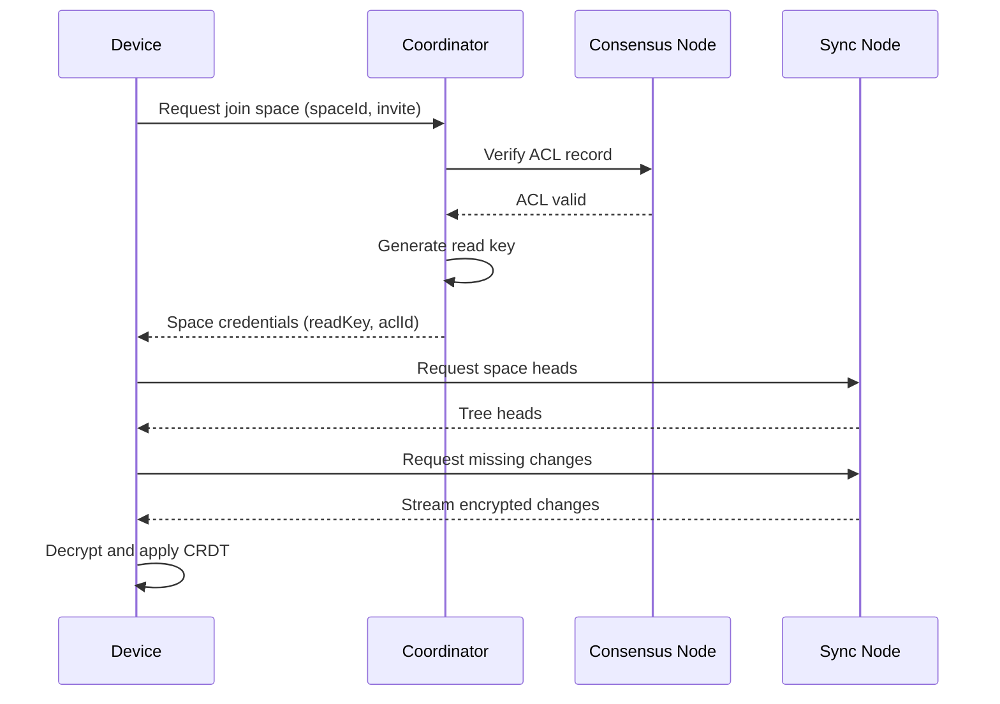
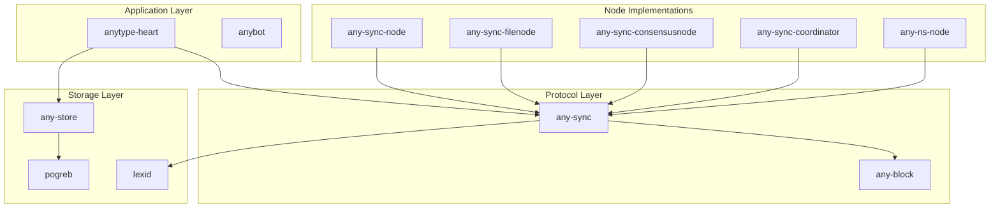

# Anyproto Ecosystem Exploration

## Overview

Anyproto is the protocol layer behind **Anytype** - a local-first, peer-to-peer knowledge management platform that enables offline collaboration and data ownership. The ecosystem consists of 15 interconnected projects implementing a complete local-first synchronization protocol with CRDT-based conflict resolution, end-to-end encryption, and decentralized storage.

The core philosophy follows the [local-first software manifesto](https://www.inkandswitch.com/local-first/):
- **No spinners**: Primary data copy lives on local devices
- **Seamless collaboration**: CRDTs resolve conflicts automatically
- **Network optional**: Works offline, syncs via WiFi or Internet
- **Security by default**: End-to-end encryption with user-controlled keys
- **Creator-controlled keys**: No central user registry, self-hosting supported

## Repository Summary

| Project | Description | Language | Key Dependencies |
|---------|-------------|----------|------------------|
| any-store | Document-oriented DB on SQLite | Go | SQLite, fastjson |
| any-sync | Sync protocol implementation | Go | libp2p, QUIC, drpc |
| any-sync-node | Sync node for spaces/objects | Go | any-sync |
| any-sync-filenode | File storage node | Go | any-sync, Redis |
| any-sync-consensusnode | ACL consensus validation | Go | any-sync, MongoDB |
| any-sync-coordinator | Network coordination | Go | any-sync |
| anytype-heart | Anytype core/middleware | Go | any-sync, any-store, IPFS |
| any-ns-node | Naming system (ENS-like) | Go | Ethereum, go-ethereum |
| any-block | Protobuf data structures | Protobuf | - |
| anybot | GitHub contribution bot | TypeScript | Probot |
| lexid | Lexicographic ID generation | Go | - |
| pogreb | Embedded KV store | Go | - |

---

## Directory Structure

### Root Organization
```
src.anyproto/
├── any-store/              # Core storage layer (SQLite-based document DB)
├── any-sync/               # Synchronization protocol core library
├── any-sync-node/          # Sync node implementation
├── any-sync-filenode/      # File storage node
├── any-sync-consensusnode/ # Consensus node for ACL validation
├── any-sync-coordinator/   # Network coordinator node
├── any-sync-tools/         # Network configuration tools
├── anytype-heart/          # Anytype middleware/core application
├── any-ns-node/            # Naming system node (blockchain-based)
├── any-block/              # Protocol buffer definitions
├── anybot/                 # GitHub automation bot
├── lexid/                  # Lexicographic ID generator
└── pogreb/                 # Embedded key-value store
```

### any-store/ - Document Database
```
any-store/
├── cmd/
│   └── any-store-cli/      # CLI interface (Go)
├── encoding/               # JSON/document encoding
├── internal/
│   ├── bitmap/             # Bitmap utilities
│   ├── driver/             # SQLite driver abstraction
│   ├── key/                # Key utilities
│   ├── objectid/           # Object ID generation
│   ├── parser/             # JSON parser
│   ├── registry/           # Filter/sort registries
│   ├── sql/                # SQL query generation
│   └── syncpool/           # Buffer synchronization pool
├── jsonutil/               # JSON utilities
├── query/                  # Query builder, filters, sorting
├── test/                   # Test fixtures
├── collection.go           # Collection interface/implementation
├── db.go                   # Database interface/implementation
├── document.go             # Document representation
├── index.go                # Indexing support
├── iterator.go             # Document iteration
├── tx.go                   # Transaction support
└── README.md
```

### any-sync/ - Synchronization Protocol
```
any-sync/
├── accountservice/         # Account management
├── acl/                    # Access control lists
├── app/                    # Application framework
│   ├── debugstat/          # Debug statistics
│   ├── ldiff/              # Local diff/hash comparison
│   ├── logger/             # Logging configuration
│   └── ocache/             # Object cache with TTL/GC
├── commonfile/             # Common file handling
│   ├── fileblockstore/     # Block storage interface
│   ├── fileproto/          # File protocol buffers
│   └── fileservice/        # File service implementation
├── commonspace/            # Core space abstraction
│   ├── acl/                # Space ACL management
│   ├── deletionmanager/    # Soft deletion handling
│   ├── headsync/           # Tree head synchronization
│   ├── object/             # Object/tree management
│   ├── objectmanager/      # Object lifecycle
│   ├── peermanager/        # Peer connection management
│   ├── spacestorage/       # Space storage abstraction
│   ├── spacesyncproto/     # Sync protocol (drpc)
│   ├── sync/               # Object sync service
│   └── syncstatus/         # Sync status tracking
├── consensus/              # Consensus client/protocol
│   ├── consensusclient/    # gRPC/drpc client
│   └── consensusproto/     # Consensus protobuf messages
├── coordinator/            # Coordinator node client
│   ├── coordinatorclient/  # Client implementation
│   ├── coordinatorproto/   # Protocol definitions
│   └── nodeconfsource/     # Node configuration source
├── identityrepo/           # Identity repository protocol
├── metric/                 # Prometheus/OpenTelemetry metrics
├── nameservice/            # Naming service client
├── net/                    # Networking layer
│   ├── connutil/           # Connection utilities
│   ├── peer/               # Peer abstraction
│   ├── peerservice/        # Peer service
│   ├── pool/               # Connection pooling
│   ├── rpc/                # RPC server/client
│   ├── secureservice/      # Secure handshake
│   ├── streampool/         # Stream multiplexing
│   └── transport/          # QUIC, Yamux transports
├── node/                   # Node client
├── nodeconf/               # Node configuration service
├── paymentservice/         # Payment/tier service
├── testutil/               # Test utilities
└── util/
    ├── cidutil/            # Content ID utilities
    ├── crypto/             # Ed25519, X25519, AES
    ├── strkey/             # String key encoding
    └── syncqueues/         # Synchronized queues
```

### anytype-heart/ - Core Application
```
anytype-heart/
├── clientlibrary/          # Native bindings (Android, iOS, JS)
│   ├── clib/               # C bridge
│   ├── jsaddon/            # Node.js addon
│   └── service/            # Service initialization
├── cmd/                    # CLI tools
│   ├── grpcserver/         # gRPC server for clients
│   ├── usecasevalidator/   # Usecase validation
│   └── debugtree/          # Tree debugging
├── core/                   # Core application logic
│   ├── account.go          # Account management
│   ├── anytype/            # Bootstrap configuration
│   ├── application/        # Application service
│   ├── block/              # Block editor operations
│   ├── converter/          # Export formats (HTML, MD, JSON)
│   ├── device/             # Device synchronization
│   ├── domain/             # Domain types/errors
│   ├── event/              # Event broadcasting
│   ├── files/              # File management
│   ├── filestorage/        # File storage backends
│   ├── identity/           # User identity
│   ├── indexer/            # Full-text indexing
│   ├── notifications/      # Notification system
│   ├── payments/           # Payment integration
│   ├── session/            # Session management
│   ├── space.go            # Space abstraction
│   ├── subscription/       # Data subscriptions
│   ├── syncstatus/         # Sync status service
│   └── wallet/             # Wallet/key management
├── metrics/                # Metrics (Prometheus, OpenTelemetry)
├── net/                    # Network utilities
├── pb/                     # Protocol buffer generated code
├── pkg/lib/                # Shared libraries
│   ├── bundle/             # Built-in objects/relations
│   ├── crypto/             # Cryptography
│   ├── database/           # Database abstraction
│   ├── ipfs/               # IPFS integration
│   ├── localstore/         # Local storage
│   └── threads/            # Thread management
├── space/                  # Space management
│   ├── clientspace/        # Client space interface
│   ├── coordinatorclient/  # Coordinator RPC
│   ├── deletioncontroller/ # Deletion lifecycle
│   ├── spacecore/          # Core space service
│   ├── spaceinfo/          # Space metadata
│   └── techspace/          # Technical space
├── tests/                  # Integration tests
└── util/                   # Utilities
    ├── anyerror/           # Error handling
    ├── bufferpool/         # Buffer pooling
    ├── jsonutil/           # JSON utilities
    ├── persistentqueue/    # Persistent queues
    └── slice/              # Slice utilities
```

---

## Architecture

### High-Level System Architecture



### Local-First Sync Architecture



### Space and Object Model

```mermaid
graph LR
    subgraph "Account"
        A1[Master Key<br/>BIP39 Mnemonic]
        A2[Signing Key<br/>Ed25519]
        A3[Identity<br/>DID-like]
    end

    subgraph "Space"
        S1[Space Header<br/>Type + Payload]
        S2[ACL List<br/>Owner + Permissions]
        S3[Space Settings<br/>Metadata Key]
        S4[Trees<br/>Objects]
    end

    subgraph "Tree"
        T1[Root Change]
        T2[Change 1<br/>hash(T1)]
        T3[Change 2<br/>hash(T2)]
        T4[Change N<br/>hash(T3)]
    end

    A1 --> S3
    A2 --> S2
    S2 --> S4
    S4 --> T1
    T1 --> T2
    T2 --> T3
    T3 --> T4
```

### P2P Network Topology



---

## Component Breakdown

### any-store (Storage Layer)

**Location:** `any-store/`
**Purpose:** Document-oriented database built on SQLite with MongoDB-like queries

**Key Features:**
- JSON document storage with fastjson parsing
- MongoDB-style query language (`$in`, `$gt`, `$exists`, etc.)
- Automatic indexing on fields
- Transaction support (read/write isolation)
- Connection pooling for concurrent access

**Architecture:**
```
┌─────────────────────────────────────────────┐
│              Application                     │
├─────────────────────────────────────────────┤
│  Collection Interface                        │
│  - Find/Insert/Update/Delete                 │
│  - Query Builder ($filter, $sort)           │
├─────────────────────────────────────────────┤
│  Query Layer                                 │
│  - Filter Registry                           │
│  - Sort Registry                             │
│  - JSON Parser                               │
├─────────────────────────────────────────────┤
│  SQLite Driver Abstraction                   │
│  - Connection Manager                        │
│  - Statement Pooling                         │
│  - Sync Buffer Pool                          │
├─────────────────────────────────────────────┤
│  SQLite (via zombiezen.com/go/sqlite)       │
└─────────────────────────────────────────────┘
```

**Key Files:**
- `db.go` - Database initialization and connection management
- `collection.go` - Collection CRUD operations
- `query/builder.go` - Query construction
- `internal/driver/conn.go` - SQLite connection pooling
- `internal/sql/db.go` - SQL query generation

---

### any-sync (Synchronization Protocol)

**Location:** `any-sync/`
**Purpose:** CRDT-based synchronization protocol for local-first applications

**Core Concepts:**
1. **Space**: Isolated data domain with its own ACL and encryption keys
2. **Tree**: Append-only log of changes (CRDT operations)
3. **Head Sync**: Compare tree heads (hash ranges) to find divergence
4. **Object Sync**: Stream missing changes between nodes

**Key Components:**

| Component | Purpose |
|-----------|---------|
| `commonspace/` | Space abstraction, tree management |
| `headsync/` | Tree head comparison, diff computation |
| `sync/` | Object synchronization service |
| `peermanager/` | Peer connection lifecycle |
| `streampool/` | Multiplexed stream management |
| `ocache/` | LRU cache with TTL and GC |

**Sync Flow:**
```
1. Device connects to sync node via QUIC
2. Request head sync for space
3. Node returns tree heads (id, heads[], aclId)
4. Device computes diff (missing changes)
5. Request missing changes via object sync
6. Node streams changes (verified, encrypted)
7. Device applies CRDT changes locally
```

---

### anytype-heart (Core Application)

**Location:** `anytype-heart/`
**Purpose:** Middleware layer connecting UI clients to sync/storage backends

**Architecture Pattern:** Service Locator
All components register in bootstrap (`core/anytype/bootstrap.go`) and are resolved via dependency injection.

**Service Bootstrap Example:**
```go
// core/anytype/bootstrap.go
func Bootstrap() *app.App {
    a := app.New()
    a.Register(account.New())
    a.Register(space.New())
    a.Register(files.New())
    a.Register(indexer.New())
    // ... 40+ services
    return a
}
```

**Key Services:**
- `application/` - Account lifecycle (create, select, delete)
- `block/` - Block editor (text, relations, dataviews)
- `space/` - Space management (create, join, leave)
- `files/` - File upload/download, image processing
- `indexer/` - Full-text search (Tantivy)
- `event/` - Event broadcasting to UI clients

---

### Sync Nodes (Infrastructure)

#### any-sync-node
**Purpose:** Store spaces and objects, handle sync requests

**Key Modules:**
- `nodespace/` - Space lifecycle on node
- `nodestorage/` - Tree storage implementation
- `nodesync/` - Inter-node synchronization
- `nodehead/` - Tree head tracking

#### any-sync-filenode
**Purpose:** Distributed file storage with content addressing

**Key Modules:**
- `index/` - CID-to-identity mapping (Redis-backed)
- `store/` - S3 or local file storage
- `deletelog/` - Soft deletion tracking

#### any-sync-consensusnode
**Purpose:** ACL validation and consensus

**Key Modules:**
- `consensus/` - Record log validation
- `stream/` - ACL change stream
- `db/` - MongoDB storage for logs

#### any-sync-coordinator
**Purpose:** Network configuration and space coordination

**Key Modules:**
- `coordinator/` - Space creation, ACL receipts
- `spacestatus/` - Space lifecycle tracking
- `deletionlog/` - Space deletion confirmations

---

## Entry Points

### any-store CLI
**File:** `any-store/cmd/any-store-cli/main.go`

```go
// Commands: open, create, insert, find, update, delete
func main() {
    db, err := anystore.Open(ctx, dbPath, config)
    coll, _ := db.Collection(ctx, "myCollection")
    doc, _ := coll.FindId(ctx, docId)
}
```

### any-sync-node
**File:** `any-sync-node/cmd/any-sync-node.go`

```go
func main() {
    a := app.New()
    a.Register(node.New())
    a.Register(sync.New())
    a.Run(ctx)
}
```

### anytype-heart gRPC Server
**File:** `anytype-heart/cmd/grpcserver/grpc.go`

```go
func RunGRPCServer() {
    service := service.New()
    service.Init(a)
    grpcServer := grpc.NewServer()
    pb.RegisterServiceServer(grpcServer, service)
    lis, _ := net.Listen("tcp", ":8080")
    grpcServer.Serve(lis)
}
```

---

## Data Flow

### Object Creation and Sync



### Space Join Flow



---

## External Dependencies

### Core Dependencies

| Dependency | Purpose | Projects Using |
|------------|---------|----------------|
| `zombiezen.com/go/sqlite` | Pure Go SQLite | any-store |
| `github.com/valyala/fastjson` | Fast JSON parsing | any-store, anytype-heart |
| `github.com/libp2p/go-libp2p` | P2P networking | any-sync |
| `github.com/quic-go/quic-go` | QUIC transport | any-sync |
| `storj.io/drpc` | Lightweight RPC | all sync projects |
| `github.com/ipfs/boxo` | IPFS block handling | any-sync, anytype-heart |
| `go.uber.org/zap` | Structured logging | all projects |
| `github.com/prometheus/client_golang` | Metrics | all node projects |
| `github.com/ethereum/go-ethereum` | Ethereum client | any-ns-node |
| `github.com/dgraph-io/badger/v4` | Key-value store | anytype-heart |
| `github.com/anyproto/tantivy-go` | Full-text search | anytype-heart |

### Cryptographic Dependencies

| Library | Algorithm | Usage |
|---------|-----------|-------|
| `golang.org/x/crypto` | Ed25519, X25519, AES | Signing, encryption |
| `github.com/anyproto/go-slip10` | SLIP-10 | HD key derivation |
| `github.com/tyler-smith/go-bip39` | BIP-39 | Mnemonic phrases |
| `github.com/multiformats/go-multihash` | Multihash | Content addressing |

---

## Configuration

### Sync Node Configuration (`etc/any-sync-node.yml`)

```yaml
account:
  peerId: "12D3KooW..."      # libp2p peer ID
  peerKey: "CAES..."          # Ed25519 private key

nodeConf:
  networkId: "anytype.network"
  nodes:                      # Known nodes
    - peerId: "..."
      addresses: ["/ip4/.../quic"]

spacesync:
  grpcPort: 31001
  streamPort: 31002

storage:
  path: "/data/spaces"
  treeStorage: "badger"
```

### Coordinator Configuration (`etc/any-sync-coordinator.yml`)

```yaml
db:
  mongoUri: "mongodb://localhost:27017"
  mongoDb: "coordinator"

accountLimit:
  defaultLimit: 1073741824    # 1GB per account

spaceStatus:
  checkIntervalSec: 300
  minPeerCount: 2
```

### Anytype Heart Configuration

```go
// Configured via app.App components
type Config struct {
    Space: commonspace.Config{
        GCTTL: 300,             // Cache TTL seconds
        StreamQuota: 100,       // Stream limit
    }
    Storage: storage.Config{
        Path: "/data/anytype",
        FileStoreSize: 10737418240, // 10GB
    }
}
```

---

## Testing

### Test Strategy

| Project | Testing Approach | Coverage |
|---------|-----------------|----------|
| any-store | Unit tests with in-memory SQLite | ~70% |
| any-sync | Mock-based integration tests | ~60% |
| anytype-heart | Integration tests with test servers | ~50% |
| Node projects | End-to-end with Docker Compose | Varies |

### Running Tests

```bash
# any-store
cd any-store && go test ./...

# any-sync (with coverage)
cd any-sync && go test -cover ./...

# anytype-heart (integration)
cd anytype-heart && go test ./tests/integration/...

# Node projects (Docker)
cd any-sync-node && docker-compose up --build
```

### Test Fixtures

- `any-store/test/` - JSON test data for queries
- `any-sync/testutil/` - Mock services and test nodes
- `anytype-heart/tests/` - Integration test scenarios

---

## Key Insights for Engineers

### 1. Local-First Architecture
- **Primary storage is local** - all operations work offline
- **Sync is async and best-effort** - no blocking on network
- **CRDTs guarantee convergence** - conflicts resolved automatically

### 2. Space-Based Isolation
- Each space has independent encryption keys
- ACL changes require consensus node validation
- Spaces can be joined/left without affecting other spaces

### 3. Tree-Based Object Model
- Objects are stored as append-only trees
- Each change references parent hash (like blockchain)
- Enables efficient sync via head comparison

### 4. Multi-Transport Networking
- **QUIC** for low-latency sync
- **YAMUX** for multiplexed streams
- **mDNS** for local network discovery

### 5. Storage Layering
```
┌─────────────────────┐
│   any-store         │  Document DB (SQLite)
├─────────────────────┤
│   BadgerDB          │  Key-value cache
├─────────────────────┤
│   IPFS/Blockstore   │  Content-addressed files
└─────────────────────┘
```

### 6. Security Model
- **User-controlled keys** - BIP-39 mnemonic derives all keys
- **End-to-end encryption** - nodes cannot read space content
- **No central identity** - peer IDs are public keys

---

## Open Questions

1. **CRDT Implementation Details**: How exactly are conflicts resolved at the CRDT level? The code shows tree structures but the specific CRDT types (LWW, OR-Set, etc.) are not clearly documented.

2. **Consensus Node Failure**: What happens if consensus nodes disagree? Is there a fallback mechanism or is the network partitioned?

3. **File Storage Economics**: How are file nodes incentivized? Is there a payment mechanism or is it purely volunteer-based?

4. **Scalability Limits**: What are the practical limits for:
   - Number of spaces per node?
   - Objects per space?
   - Concurrent sync clients?

5. **Mobile Performance**: How is battery impact managed for background sync on mobile devices?

6. **Backup/Recovery**: What is the recommended self-hosting backup strategy? Can users run their own sync node?

7. **Migration Path**: How are schema migrations handled for existing objects when the protocol evolves?

8. **Name Service Integration**: How does any-ns-node integrate with the sync layer? Is ENS resolution required for all space operations?

---

## Appendix: Project Relationships



---

*Generated for repo-expolorations project following the exploration agent format from `.agents/exploration-agent.md`*
