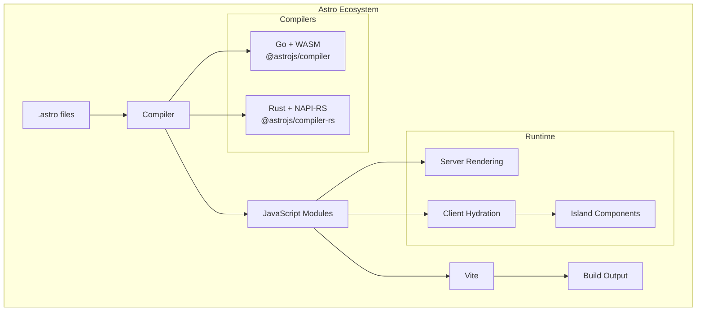

# Project Exploration: Astro Framework Ecosystem

## Overview

Astro is a modern website build tool designed for content-driven websites. Its key differentiator is the **Islands Architecture**, which ships less JavaScript to the client by default. Astro supports multiple rendering strategies (SSG, SSR, hybrid) and multi-framework support (React, Preact, Solid, Svelte, Vue).

## Directory Structure

```
/home/darkvoid/Boxxed/@formulas/src.UIFrameworks/src.Astro/
├── astro/                 # Main Astro framework (Go + WASM compiler)
├── astro.build/           # Official astro.build website source
├── compiler/              # JavaScript compiler wrapper (Go → WASM)
├── compiler-rs/           # Rust compiler implementation (NAPI-RS)
├── flue/                  # Experimental sandbox agent framework
├── src.astrojs/           # Main Astro monorepo
│   ├── astro/             # Core Astro framework
│   ├── astro.build/       # Build system
│   ├── astro.new/         # Project scaffolding
│   ├── compiler/          # Compiler package
│   ├── starlight/         # Documentation theme
│   └── storefront/        # Theme marketplace
└── starlight/             # Starlight documentation theme
```

## Architecture

### High-Level Diagram (Mermaid)



## Islands Architecture

### Concept

Islands Architecture is Astro's core architectural pattern. Instead of shipping a fully hydrated JavaScript application, Astro:

1. **Renders everything to static HTML on the server** - All components (React, Vue, Svelte, etc.) render to HTML at build time or request time
2. **Identifies interactive "islands"** - Components marked with client directives become hydration boundaries
3. **Ships zero JavaScript by default** - Only interactive islands receive JavaScript
4. **Hydrates islands independently** - Each island hydrates separately without affecting the rest of the page

### Client Directives

Components become "islands" through client directives:

```astro
---
import Counter from '../components/Counter.jsx';
import Search from '../components/Search.svelte';
---

<!-- Static by default - no JS shipped -->
<Counter />

<!-- Hydrate on page load -->
<Counter client:load />

<!-- Hydrate when browser is idle -->
<Counter client:idle />

<!-- Hydrate when element is visible -->
<Counter client:visible />

<!-- Hydrate at specific media query -->
<Counter client:media="(min-width: 768px)" />

<!-- Client-only, never rendered on server -->
<Counter client:only />
```

### Island Implementation

The hydration is managed by `astro-island` web components:

**File**: `/home/darkvoid/Boxxed/@formulas/src.UIFrameworks/src.Astro/src.astrojs/astro/packages/astro/src/runtime/server/astro-island.ts`

Key features:
- Custom element that wraps hydrated components
- Handles multiple hydration strategies (load, idle, visible, media)
- Supports nested islands with parent-child hydration ordering
- Manages prop serialization/deserialization with support for complex types (Map, Set, Date, RegExp, BigInt, URL, typed arrays)

The island component:
1. Waits for children to be connected (supports HTML streaming)
2. Loads the component module and hydrator based on directive
3. Manages hydration ordering for nested islands (parent-first)
4. Handles unmounting during view transitions

## Core Astro Framework

### Key Features

1. **Hybrid Rendering** - Support for SSG, SSR, and hybrid modes
2. **Content Collections** - Type-safe content management
3. **View Transitions API** - Native page transition animations
4. **Multi-framework** - React, Preact, Solid, Svelte, Vue, Alpine.js
5. **Server Islands** - Dynamic server-rendered components
6. **Actions** - Form handling with server mutations

### Core Architecture

**File**: `/home/darkvoid/Boxxed/@formulas/src.UIFrameworks/src.Astro/src.astrojs/astro/packages/astro/src/core/README.md`

```
┌─────────────────────────────────────────────────────────────────┐
│                         Pages                                    │
│                          ↑                                       │
│                          │ used by                               │
│                    AstroGlobal                                   │
│                          ↑                                       │
│                          │ created by                            │
│                    RenderContext                                 │
│                          ↑                                       │
│                          │                                       │
│  ┌─────────────┐    ┌─────┴─────┐    ┌──────────────────┐       │
│  │   Dev       │───→│ Pipeline  │←───│   BuildPipeline  │       │
│  │  Pipeline   │    │(interface)│    │                  │       │
│  └─────────────┘    └─────┬─────┘    └──────────────────┘       │
│                          ↑                                       │
│                          │ implemented by                        │
│  ┌───────────────────────┼───────────────────────────┐          │
│  │                       │                           │          │
│  │  vite-plugin-astro    │    AppPipeline            │          │
│  │  -server              │  (production SSR)         │          │
│  └───────────────────────┴───────────────────────────┘          │
└─────────────────────────────────────────────────────────────────┘
```

### Pipeline Interface

The pipeline is a core abstraction representing data that stays unchanged throughout the server or build:

- **DevPipeline**: Used during `astro dev` - full access to settings, config, routes
- **BuildPipeline**: Used during `astro build` for SSG and prerendering
- **AppPipeline**: Used in production server deployments, derived from SSRManifest

### RenderContext

Each request is rendered using a `RenderContext` which manages per-request data:

**File**: `/home/darkvoid/Boxxed/@formulas/src.UIFrameworks/src.Astro/src.astrojs/astro/packages/astro/src/core/render-context.ts`

```typescript
class RenderContext {
  constructor(
    pipeline: Pipeline,
    locals: App.Locals,
    middleware: MiddlewareHandler,
    pathname: string,
    request: Request,
    routeData: RouteData,
    // ... more options
  )

  async render(componentInstance, slots): Promise<Response>
}
```

The `render()` method handles:
- Page rendering
- Endpoint rendering
- Redirects
- Rewrites
- Middleware execution

## Astro Compiler (JavaScript/Go)

### Architecture

**Location**: `/home/darkvoid/Boxxed/@formulas/src.UIFrameworks/src.Astro/compiler/`

The JavaScript compiler is a **Go-based compiler** that compiles to WASM for browser/Node.js usage.

**Key Files**:
- `internal/parser.go` - Main parser for .astro syntax (76KB)
- `internal/token.go` - Tokenizer (57KB)
- `internal/transform/transform.go` - AST transformations
- `packages/compiler/src/node/index.ts` - Node.js WASM wrapper

### Compilation Process

1. **Parse**: `.astro` file → AST
2. **Transform**: Apply scope, extract scripts, process components
3. **Print**: AST → JavaScript/TypeScript module

**Transform Options** (from `transform.go`):
```go
type TransformOptions struct {
    Scope                   string  // Unique component scope
    Filename                string
    InternalURL             string  // Runtime import URL
    SourceMap               string  // "external" | "inline" | "both"
    ScopedStyleStrategy     string  // "where" | "class" | "attribute"
    Compact                 bool    // Whitespace collapsing
    ResultScopedSlot        bool
    TransitionsAnimationURL string
}
```

### AST Transformation

The transform process:
1. Walks the AST
2. Extracts scripts to `doc.Scripts`
3. Adds component props for client directives
4. Scopes CSS selectors
5. Handles transitions directives
6. Normalizes set directives

**Usage** (from README):
```javascript
import { transform } from "@astrojs/compiler";

const result = await transform(source, {
  filename: "/src/pages/index.astro",
  sourcemap: "both",
  internalURL: "astro/runtime/server/index.js",
});
```

## Astro Compiler (Rust)

### Architecture

**Location**: `/home/darkvoid/Boxxed/@formulas/src.UIFrameworks/src.Astro/compiler-rs/`

The Rust compiler uses **NAPI-RS** for Node.js bindings and **OXC** for JavaScript parsing/transformation.

**Key Files**:
- `crates/astro_napi/src/lib.rs` - NAPI bindings
- `Cargo.toml` - Dependencies (oxc_allocator, oxc_parser, oxc_span, oxc_estree)

### Differences from JS/Go Compiler

| Feature | Go + WASM | Rust + NAPI-RS |
|---------|-----------|----------------|
| Language | Go | Rust |
| Binding | WASM | Native NAPI |
| Parser | Custom Go parser | OXC (Rust) |
| Performance | Good (WASM) | Excellent (native) |
| Memory | WASM heap | Native allocation |
| Error Handling | Go errors | Rust Result |

### Rust Compiler API

```rust
/// Options for compiling Astro files to JavaScript
pub struct CompileOptions {
    pub filename: Option<String>,
    pub internal_url: Option<String>,
    pub sourcemap: Option<SourcemapOption>,
    pub compact: Option<CompactOptions>,
    pub scoped_style_strategy: Option<ScopedStyleStrategy>,
    pub resolve_path_provided: Option<bool>,
    pub preprocessed_styles: Option<Vec<Option<String>>>,
    // ... more options
}
```

### Sourcemap Options

```rust
pub enum SourcemapOption {
    External,  // JSON source map in result.map
    Inline,    // Inline comment in code
    Both,      // Both external and inline
}
```

### Compact Options (Whitespace Handling)

```rust
pub enum CompactOptions {
    None,  // No modification
    Html,  // HTML-aware whitespace collapsing
    Jsx,   // JSX-style whitespace removal
}
```

### CSS Scoping Strategies

```rust
pub enum ScopedStyleStrategy {
    Where,      // :where(.astro-XXXX) - default
    Class,      // .astro-XXXX class selector
    Attribute,  // [data-astro-cid-XXXX] attribute
}
```

## Hybrid Rendering Model (SSR + SSG)

Astro supports three rendering modes:

### 1. Static Site Generation (SSG)

- **Default mode**
- Pages are prerendered at build time
- Output: Static HTML files
- Best for: Content pages, blogs, documentation

### 2. Server-Side Rendering (SSR)

- Enabled via `output: 'server'` in config
- Pages render on each request
- Requires adapter (Node, Cloudflare, Vercel, Netlify, Deno)
- Best for: Dynamic content, personalization

### 3. Hybrid Mode

- Enabled via `output: 'hybrid'` in config
- Most pages are prerendered
- Specific routes can opt into SSR via `export const prerender = false`
- Best for: Mostly static sites with some dynamic pages

### Route-Level Control

Each route can individually control prerendering:

```typescript
// src/pages/blog/[slug].astro
export async function getStaticPaths() { /* ... */ }
export const prerender = true; // or false for SSR
```

### SSR Manifest

For production SSR builds, Astro creates an `SSRManifest` that contains:
- Route definitions
- Page/component mappings
- Configuration subset

This manifest is deserialized at runtime to create the `Environment`.

## Content Collections API

### Architecture

**Location**: `/home/darkvoid/Boxxed/@formulas/src.UIFrameworks/src.Astro/src.astrojs/astro/packages/astro/src/content/`

Key files:
- `content-layer.ts` - Main content processing layer
- `data-store.ts` - Data storage interface
- `mutable-data-store.ts` - Writable store implementation
- `utils.ts` - Content utilities
- `loaders/` - Content loader implementations

### How It Works

1. **Collection Definition**: Define collections in `src/content/config.ts`
2. **Content Files**: Add markdown/mdx files to `src/content/<collection>/`
3. **Type Generation**: Astro generates TypeScript types automatically
4. **Content Loading**: Load via `getCollection()` or custom loaders
5. **Processing**: Markdown is processed through the markdown processor

### Content Layer Class

```typescript
class ContentLayer {
  async sync(): Promise<void>;
  async refreshContent(options: RefreshContentOptions): Promise<void>;

  #processMarkdown(content: string): Promise<RenderedContent>;
  #getLoaderContext(options): Promise<LoaderContext>;
}
```

### Features

- **Schema Validation**: Zod schemas for collection data
- **TypeScript Integration**: Auto-generated types
- **Image Optimization**: Automatic image handling
- **Custom Loaders**: Support for external content sources
- **Watch Mode**: Hot reloading for content changes
- **Rendered Content**: Markdown can be rendered to HTML with metadata

### Entry Types

Content entries can be:
- **Content entries**: `.md`, `.mdx`, `.markdown` - rendered with frontmatter
- **Data entries**: `.json`, `.yaml`, `.yml`, `.csv` - raw data only

## Starlight Documentation Theme

### Overview

**Location**: `/home/darkvoid/Boxxed/@formulas/src.UIFrameworks/src.Astro/src.astrojs/starlight/`

Starlight is a documentation theme built on top of Astro, designed for building accessible, performant documentation websites.

### Key Features

1. **Accessibility First**: Built with accessibility in mind
2. **Markdown/MDX Support**: Full markdown with MDX for React components
3. **i18n Support**: Built-in internationalization
4. **Search**: Integrated search via Pagefind
5. **Syntax Highlighting**: Expressive Code integration
6. **Responsive Design**: Mobile-first responsive layout
7. **Dark Mode**: Built-in dark mode support
8. **Navigation**: Sidebar navigation with nested items
9. **Table of Contents**: Auto-generated table of contents
10. **Edit Links**: GitHub edit links for pages

### Installation & Usage

```bash
npm create astro@latest -- --template starlight
```

### Configuration

```typescript
// astro.config.mjs
import starlight from '@astrojs/starlight';

export default {
  integrations: [
    starlight({
      title: 'My Docs',
      sidebar: [/* ... */],
      social: { /* ... */},
    })
  ]
}
```

### Architecture

**File**: `/home/darkvoid/Boxxed/@formulas/src.UIFrameworks/src.Astro/src.astrojs/starlight/packages/starlight/index.ts`

Starlight is an Astro integration that:

1. **Injects Routes**: 404 page and catch-all `[...slug]` route
2. **Adds Middleware**: For i18n and routing
3. **Configures Markdown**: Adds remark/rehype plugins for asides, headings
4. **Injects Types**: TypeScript type definitions
5. **Integrates Tools**: MDX, sitemap, expressive-code

### Plugins System

Starlight supports plugins for extending functionality:

```typescript
const pluginResult = await runPlugins(opts, plugins, {
  command,
  config,
  isRestart,
  logger,
});
```

### Key Dependencies

- `@astrojs/markdown-remark` - Markdown processing
- `@astrojs/mdx` - MDX support
- `@astrojs/sitemap` - Sitemap generation
- `astro-expressive-code` - Code blocks
- `pagefind` - Search functionality
- `i18next` - Internationalization

## flue - Experimental Agent Framework

### Overview

**Location**: `/home/darkvoid/Boxxed/@formulas/src.UIFrameworks/src.Astro/flue/`

Flue is an **experimental sandbox agent framework** for connecting OpenCode sessions to AI agents and CI workflows.

### Packages

| Package | Description |
|---------|-------------|
| `@flue/client` | Container-side SDK for writing workflows |
| `@flue/cli` | CLI for running workflows locally or in CI |
| `@flue/cloudflare` | Cloudflare Workers + Containers runtime adapter |

### Usage Example

```typescript
// .flue/workflows/issue-triage.ts
import type { FlueClient } from '@flue/client';
import { anthropic, github } from '@flue/client/proxies';

export const proxies = {
  anthropic: anthropic(),
  github: github({ policy: 'read-only' }),
};

export default async function triage(flue: FlueClient, args: { issueNumber: number }) {
  const issueDetails = await flue.shell(`gh issue view ${args.issueNumber} --json title,body`);
  const result = await flue.skill('triage', { args: { issueDetails } });
  const comment = await flue.prompt(
    `Summarize the triage for issue #${args.issueNumber}: ${result}`,
  );
  await flue.shell(`gh issue comment ${args.issueNumber} --body-file -`, { stdin: comment });
}
```

## Key Insights

### 1. Performance-First Design

Astro's Islands Architecture fundamentally changes how we think about JavaScript frameworks:
- Ship zero JavaScript by default
- Only interactive components hydrate
- Multiple hydration strategies (load, idle, visible, media)

### 2. Compiler Architecture

Two compiler implementations provide flexibility:
- **Go + WASM**: Mature, production-ready
- **Rust + NAPI-RS**: Higher performance, native bindings
- Both share the same API surface

### 3. Rendering Flexibility

Astro supports all rendering strategies:
- SSG for content pages
- SSR for dynamic content
- Hybrid for the best of both worlds

### 4. Content-First Approach

Content Collections API provides:
- Type safety for content
- Schema validation
- Unified content API
- Support for external sources

### 5. Developer Experience

- Multi-framework support without vendor lock-in
- TypeScript types generated automatically
- Hot module reloading
- Clear error messages with hints

### 6. Extensibility

- Integration API for extending functionality
- Vite plugin architecture
- Custom content loaders
- Middleware support

## Conclusion

Astro represents a shift in web framework design, prioritizing performance through Islands Architecture while maintaining developer experience through multi-framework support and modern tooling. The dual compiler approach (Go/WASM and Rust/NAPI) shows commitment to performance, while the Content Collections API and Starlight theme demonstrate focus on content-driven websites.
