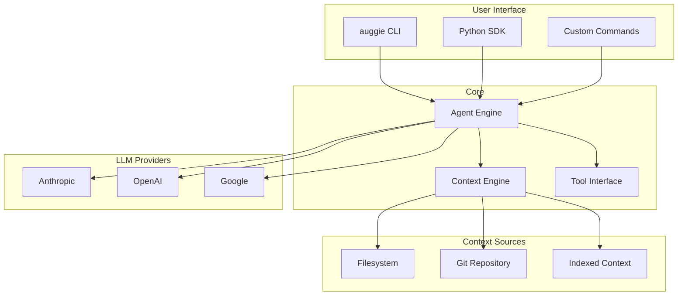
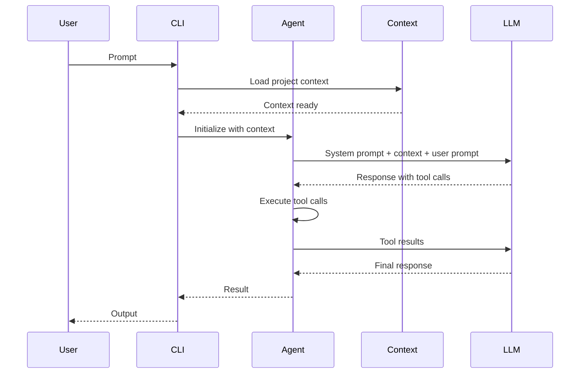
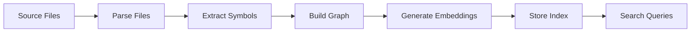
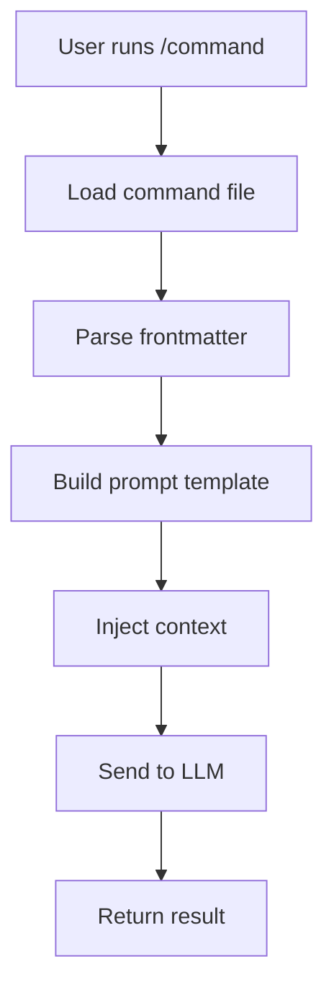

# Project Exploration: auggie

## Overview

Auggie is Augment's agentic coding CLI that runs in the terminal. It understands codebases and helps developers ship faster by analyzing code, making safe edits, and automating routine tasks through natural language interaction.

Auggie provides both an interactive CLI experience and a SDK for building custom AI-powered workflows. It supports custom slash commands stored in `.augment/commands/` directories, GitHub Actions integration for automated PR reviews, and a Python SDK for programmatic access.

## Repository

- **Location:** `/home/darkvoid/Boxxed/@formulas/src.augmentcode/auggie`
- **Remote:** git@github.com:augmentcode/auggie
- **Primary Language:** TypeScript, Python
- **License:** MIT

## Directory Structure

```
auggie/
├── src/                              # TypeScript source (CLI)
│   ├── index.ts                      # Main entry point
│   ├── commands/                     # CLI commands
│   ├── sdk/                          # SDK internals
│   └── utils/                        # Utilities
├── examples/
│   ├── commands/                     # Example custom commands
│   │   ├── bug-fix.md
│   │   ├── code-review.md
│   │   ├── documentation.md
│   │   ├── performance-optimization.md
│   │   ├── security-review.md
│   │   ├── tests.md
│   │   └── README.md
│   └── python-sdk/
│       ├── basic_usage.py            # Basic SDK usage
│       ├── acp_demo.py               # ACP protocol demo
│       ├── cli_analyzer.py           # CLI analyzer example
│       └── context/
│           ├── direct_context/       # Direct context examples
│           ├── file_search_server/   # File search examples
│           ├── filesystem_context/   # Filesystem context
│           └── github_action_indexer/ # GitHub Actions indexer
├── .augment/
│   └── commands/                     # Built-in command templates
│       ├── bug-fix.md
│       ├── code-review.md
│       ├── documentation.md
│       ├── performance-optimization.md
│       ├── security-review.md
│       └── tests.md
├── package.json                      # Node.js dependencies
├── CHANGELOG.md                      # Version history
├── README.md                         # Main documentation
└── .github/
    └── workflows/
        ├── publish.yml               # NPM publish
        └── test.yml                  # Test pipeline
```

## Architecture

### High-Level Diagram



### Component Breakdown

#### CLI Engine

**Location:** `src/index.ts`

**Purpose:** Main CLI entry point handling command parsing and execution

**Key Commands:**
- `auggie <prompt>` - Interactive chat
- `auggie --print <prompt>` - Print result to stdout
- `auggie --instruction-file <path>` - Read prompt from file
- `auggie login` - Authenticate
- `auggie --print-augment-token` - Print session token

#### Custom Commands System

**Location:** `.augment/commands/*.md`

**Purpose:** User-defined slash commands stored as markdown files with frontmatter

**Command Structure:**
```markdown
---
name: code-review
description: Review code for quality and security issues
model: sonnet4.5
---

# Code Review Instructions

Review the following code for:
1. Security vulnerabilities
2. Code quality issues
3. Performance concerns
4. Best practices adherence

Provide actionable feedback with specific line references.
```

**Built-in Commands:**
- `/bug-fix` - Debug and fix issues
- `/code-review` - Review code quality
- `/documentation` - Generate documentation
- `/performance-optimization` - Optimize performance
- `/security-review` - Security audit
- `/tests` - Generate tests

#### Python SDK (`auggie_sdk`)

**Location:** `examples/python-sdk/`

**Purpose:** Programmatic access to Auggie capabilities

**Key Classes:**

```python
class Auggie:
    def __init__(self, model: str = "sonnet4.5"):
        """Initialize Auggie agent."""

    def run(self, prompt: str, return_type: type = None) -> Any:
        """Run agent and return typed result."""

    def session() -> SessionContext:
        """Create session context manager."""

class SessionContext:
    def run(self, prompt: str) -> Any:
        """Run agent within session context."""

    @property
    def session_id(self) -> str:
        """Get session ID for continuity."""
```

#### Context System

Auggie supports multiple context types:

**Direct Context:**
```python
# Direct context for targeted file analysis
from auggie_sdk import DirectContext

context = DirectContext(api_key="...")
await context.add_files(["src/main.py", "src/utils.py"])
result = await context.search("authentication logic")
```

**Filesystem Context:**
```python
# Index entire directory
context = FilesystemContext(root="/path/to/project")
await context.index()
```

**GitHub Action Indexer:**
```python
# Automated indexing via GitHub Actions
# See examples/python-sdk/context/github_action_indexer/
```

## Entry Points

### CLI Usage

**Interactive Mode:**
```bash
cd /path/to/project
auggie "Add error handling to the login function"
```

**Print Mode (CI-friendly):**
```bash
auggie --print "Generate unit tests for auth.py" --quiet
```

**Instruction File:**
```bash
auggie --instruction-file prompt.txt
```

**Custom Command:**
```bash
auggie "/code-review src/api/handlers.py"
```

### Python SDK Usage

**Basic Example:**
```python
from auggie_sdk import Auggie

agent = Auggie(model="sonnet4.5")

# Simple query
result = agent.run("What is 15 + 27?")
print(f"Result: {result}")

# Typed response
answer = agent.run("What is 15 + 27?", int)
print(f"Typed: {answer} (type: {type(answer).__name__})")
```

**Dataclass Response:**
```python
from dataclasses import dataclass

@dataclass
class Task:
    title: str
    priority: str
    estimated_hours: int

task = agent.run(
    "Create a task: 'Write unit tests', medium priority, 4 hours",
    return_type=Task
)
print(f"Task: {task.title}, Priority: {task.priority}")
```

**Session Management:**
```python
# Without session (no memory)
agent.run("Create a function called 'greet'")
agent.run("Add error handling")  # Won't remember greet

# With session (has memory)
with agent.session() as session:
    session.run("Create a function called 'calculate'")
    session.run("Add input validation")  # Remembers calculate
    session.run("Add type hints")  # Still remembers

# Session automatically resumes
with agent.session():  # Same session ID
    session.run("Add unit tests")  # Still has context
```

### GitHub Actions Integration

**PR Review Workflow:**
```yaml
name: PR Review

on:
  pull_request:
    branches: [main]

jobs:
  review:
    runs-on: ubuntu-latest
    steps:
      - uses: actions/checkout@v4

      - name: Run Auggie Review
        uses: augmentcode/auggie@main
        with:
          instruction: "/code-review"
          augment_session_auth: ${{ secrets.AUGMENT_SESSION_AUTH }}
```

## Data Flow

### Agent Execution Flow



### Context Indexing Flow



### Custom Command Flow



## External Dependencies

| Dependency | Version | Purpose |
|------------|---------|---------|
| @anthropic-ai/sdk | Latest | Claude API |
| openai | Latest | OpenAI API |
| @google/genai | Latest | Google AI |
| prompt_toolkit | Latest | Python CLI |
| rich | Latest | Console output |

## Configuration

### Authentication

**Login:**
```bash
auggie login
# Opens browser for OAuth flow
```

**Print Token:**
```bash
auggie --print-augment-token
# Outputs session JSON:
# {"accessToken": "...", "tenantURL": "..."}
```

**Environment Variables:**
```bash
export AUGMENT_API_TOKEN="your-token"
export AUGMENT_API_URL="https://your-tenant.api.augmentcode.com/"
```

### Model Selection

**Supported Models:**
- `haiku4.5` - Claude Haiku 4.5 (fast, cheap)
- `sonnet4.5` - Claude Sonnet 4.5 (balanced)
- `sonnet4` - Claude Sonnet 4
- `gpt5` - GPT-5

**Set Model:**
```bash
auggie --model sonnet4.5 "prompt"
```

```python
agent = Auggie(model="sonnet4.5")
```

## Testing

### Python SDK Examples

The `examples/python-sdk/` directory contains working examples:

```bash
# Basic usage
python examples/python-sdk/basic_usage.py

# ACP protocol demo
python examples/python-sdk/acp_demo.py

# CLI analyzer
python examples/python-sdk/cli_analyzer.py

# Context examples
python examples/python-sdk/context/direct_context/test_example.py
```

### Example Commands

Example custom commands in `examples/commands/`:

```bash
# Bug fix command
auggie "/bug-fix src/auth/login.py"

# Code review
auggie "/code-review src/api/"

# Generate tests
auggie "/tests src/utils/"
```

## Key Insights

1. **Session-Based Memory:** Auggie supports session contexts that maintain conversation history across multiple prompts, enabling iterative development.

2. **Type-Aware Responses:** The Python SDK can return typed results (int, bool, dataclass, enum) by parsing LLM output.

3. **Custom Commands:** The `.augment/commands/` system allows users to create reusable, project-specific AI workflows.

4. **CI Integration:** `--print` mode enables seamless integration with CI/CD pipelines for automated code review and documentation.

5. **Multiple Context Types:** Supports direct file context, filesystem indexing, and GitHub Action-based automatic indexing.

6. **Provider Flexibility:** Supports multiple LLM providers (Anthropic, OpenAI, Google) with a unified interface.

## GitHub Actions for PRs

Auggie powers several GitHub Actions:

| Action | Purpose |
|--------|---------|
| [augmentcode/augment-agent](https://github.com/augmentcode/augment-agent) | General AI agent for workflows |
| [augmentcode/review-pr](https://github.com/augmentcode/review-pr) | Automated PR review |
| [augmentcode/describe-pr](https://github.com/augmentcode/describe-pr) | PR description generation |

## Privacy and Data Usage

Per the README:
- See [augmentcode.com/legal](https://augmentcode.com/legal) for policies
- Product docs have latest data usage details

## Feedback and Support

**In-Product:**
- Use `/feedback` command in Auggie or IDE agent

**GitHub:**
- [Issues](https://github.com/augmentcode/auggie/issues) for bugs and feature requests

**Community:**
- Support: [support.augmentcode.com](https://support.augmentcode.com/)
- Reddit: [r/AugmentCodeAI](https://www.reddit.com/r/AugmentCodeAI/)

## Open Questions

1. How does Auggie handle large codebases with thousands of files?
2. What is the rate limiting strategy for the Augment API?
3. How are custom commands versioned and shared across teams?
4. What context window sizes are supported?

## Related Projects

- **augment-agent:** GitHub Action wrapper for Auggie
- **context-connectors:** Context indexing library
- **auggie-sdk:** Python SDK for programmatic access
- **review-pr:** Specialized PR review action
- **describe-pr:** Specialized PR description action
