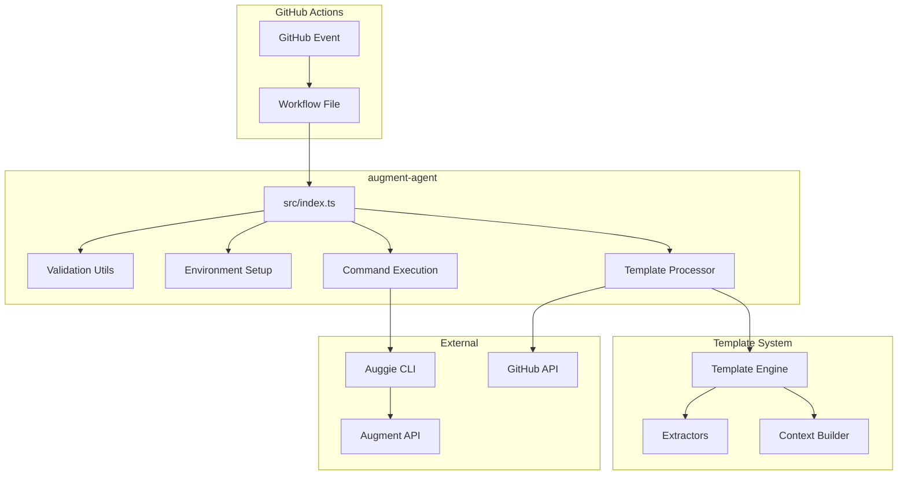
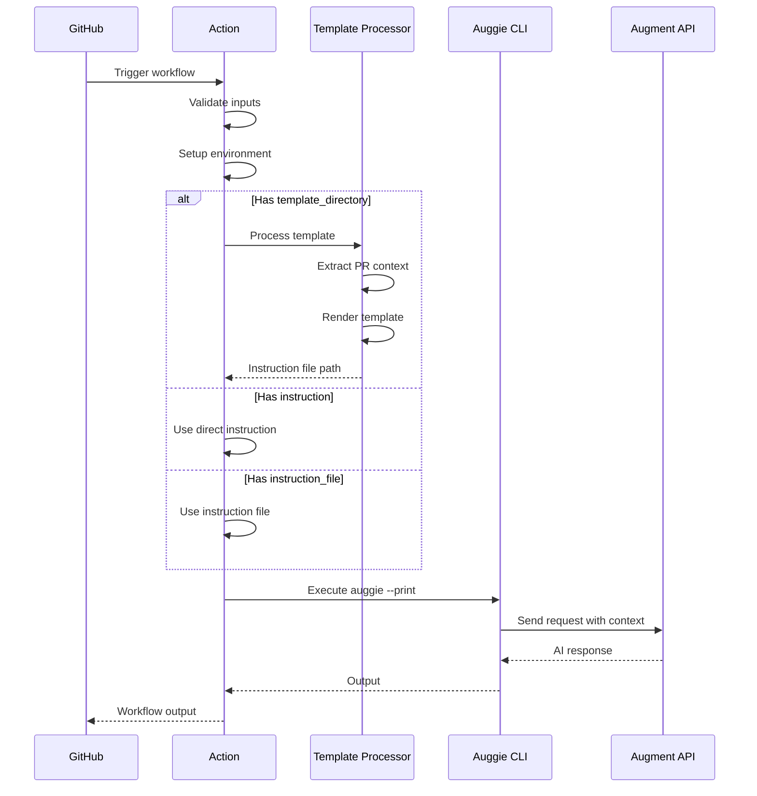
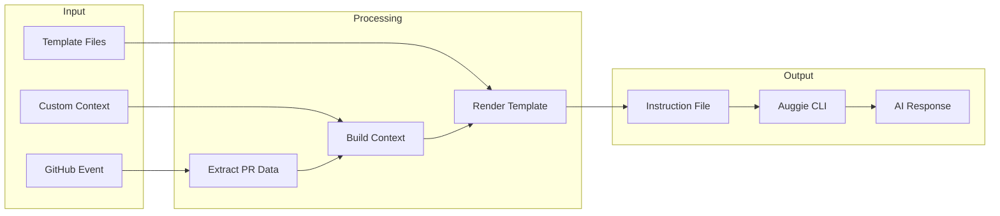

# Project Exploration: augment-agent

## Overview

The `augment-agent` project is a GitHub Action that provides AI-powered code assistance using Augment's Auggie CLI. It enables automated pull request reviews, code descriptions, issue triage, and custom template-based workflows directly within GitHub Actions.

The action serves as a bridge between GitHub workflows and Augment's AI capabilities, allowing teams to automate code quality checks, generate comprehensive PR descriptions, and perform intelligent code analysis without manual intervention.

## Repository

- **Location:** `/home/darkvoid/Boxxed/@formulas/src.augmentcode/augment-agent`
- **Remote:** git@github.com:augmentcode/augment-agent
- **Primary Language:** TypeScript
- **License:** MIT

## Directory Structure

```
augment-agent/
├── src/
│   ├── index.ts                          # Main action entry point
│   ├── config/
│   │   └── constants.ts                  # Configuration constants
│   ├── services/
│   │   └── github-service.ts             # GitHub API interactions
│   ├── template/
│   │   ├── template-engine.ts            # Template rendering engine
│   │   ├── template-processor.ts         # Template processing orchestration
│   │   ├── context-builder.ts            # Context extraction for templates
│   │   └── extractors/
│   │       ├── base-extractor.ts         # Base extractor interface
│   │       ├── pr-extractor.ts           # PR data extraction
│   │       └── custom-context-extractor.ts # Custom context handling
│   ├── types/
│   │   ├── inputs.ts                     # Action input types
│   │   ├── github.ts                     # GitHub-related types
│   │   └── context.ts                    # Context types for templates
│   └── utils/
│       ├── logger.ts                     # Logging utilities
│       ├── validation.ts                 # Input validation
│       └── file-utils.ts                 # File system utilities
├── example-workflows/
│   ├── code-review.yml                   # Automated code review workflow
│   ├── pr-description.yml                # PR description generation
│   ├── triage-issue.yml                  # Issue triage automation
│   └── template-pr-review.yml            # Template-based review example
├── .github/workflows/
│   ├── pr-review.yml                     # Internal PR review workflow
│   ├── describe-pr.yml                   # Internal PR description workflow
│   ├── release.yml                       # Release automation
│   └── test-action.yml                   # Action testing workflow
├── action.yml                            # GitHub Action definition
├── TEMPLATE.md                           # Template system documentation
├── README.md                             # User documentation
├── package.json                          # Node.js dependencies
├── tsconfig.json                         # TypeScript configuration
└── bun.lock                              # Bun package lock
```

## Architecture

### High-Level Diagram



### Component Breakdown

#### Main Entry Point (`src/index.ts`)
- **Location:** `src/index.ts`
- **Purpose:** Orchestrates the entire GitHub Action workflow
- **Responsibilities:**
  - Validates action inputs
  - Sets up environment variables for authentication
  - Processes templates or uses direct instructions
  - Executes the `auggie` CLI command
  - Handles errors and reports failures

#### Template Processor (`src/template/template-processor.ts`)
- **Location:** `src/template/template-processor.ts`
- **Purpose:** Processes Nunjucks templates with GitHub PR context
- **Dependencies:** Template engine, context builders, extractors
- **Key Features:**
  - Extracts PR diff, files changed, commit history
  - Supports custom context injection
  - Generates instruction files for Auggie

#### Context Extractors
- **Base Extractor (`src/template/extractors/base-extractor.ts`):** Abstract base class defining extractor interface
- **PR Extractor (`src/template/extractors/pr-extractor.ts`):** Extracts PR-specific data (diff, commits, files)
- **Custom Context Extractor (`src/template/extractors/custom-context-extractor.ts`):** Handles user-provided JSON context

#### Validation Utils (`src/utils/validation.ts`)
- **Location:** `src/utils/validation.ts`
- **Purpose:** Validates action inputs and authentication
- **Key Functions:**
  - Ensures either session auth OR token+URL is provided
  - Validates instruction/instruction_file/template_directory
  - Checks required environment variables

## Entry Points

### GitHub Action (`action.yml`)

The action is triggered by GitHub workflows and accepts the following inputs:

```yaml
inputs:
  augment_session_auth:  # Session auth JSON (optional)
  augment_api_token:     # API token (optional)
  augment_api_url:       # API URL (optional)
  github_token:          # GitHub token (optional)
  instruction:           # Direct instruction text (optional*)
  instruction_file:      # Path to instruction file (optional*)
  template_directory:    # Path to template directory (optional*)
  template_name:         # Template filename (default: prompt.njk)
  pull_number:           # PR number for context
  repo_name:             # Repository name
  custom_context:        # Additional JSON context
  model:                 # Model to use (e.g., sonnet4)
```

*One of `instruction`, `instruction_file`, or `template_directory` must be provided.

### Execution Flow



## Data Flow



## External Dependencies

| Dependency | Version | Purpose |
|------------|---------|---------|
| `@modelcontextprotocol/sdk` | Latest | MCP protocol support |
| `nunjucks` | Latest | Template engine |
| `@octokit/rest` | Latest | GitHub API client |

## Configuration

### Authentication

The action supports two authentication methods:

1. **Session Authentication** (recommended):
   ```json
   {
     "accessToken": "your-api-token",
     "tenantURL": "https://your-tenant.api.augmentcode.com"
   }
   ```

2. **Token + URL Authentication**:
   - `AUGMENT_API_TOKEN`: API token
   - `AUGMENT_API_URL`: API endpoint URL

### Environment Variables

| Variable | Description | Required |
|----------|-------------|----------|
| `AUGMENT_SESSION_AUTH` | Session auth JSON | One of session or token |
| `AUGMENT_API_TOKEN` | API token | One of session or token |
| `AUGMENT_API_URL` | API URL | Required with token |
| `GITHUB_API_TOKEN` | GitHub token | For PR context extraction |

## Testing

The project uses GitHub Actions workflows for testing:

- **test-action.yml:** Tests the action with various configurations
- **format-check.yml:** Validates code formatting
- **on-demand-review.yml:** On-demand PR review testing

## Key Insights

1. **Template-Driven Architecture:** The action uses a flexible template system that allows users to create custom workflows without modifying code.

2. **Progressive Enhancement:** Works with simple direct instructions but scales to complex template-based workflows with rich context extraction.

3. **Context Extraction:** Automatically extracts PR diffs, file changes, and commit history to provide rich context to the AI.

4. **Authentication Flexibility:** Supports both session-based and token-based authentication for different deployment scenarios.

5. **Example Workflows:** Includes production-ready examples for common use cases (code review, PR description, issue triage).

## Open Questions

1. How does the template engine handle large PRs with many file changes?
2. What rate limiting is in place for the Augment API?
3. How are template errors surfaced to users in workflow logs?

## Related Projects

- **auggie:** The underlying CLI tool that powers the AI interactions
- **context-connectors:** Provides context indexing and search capabilities
- **review-pr:** Specialized PR review action
- **describe-pr:** Specialized PR description action
