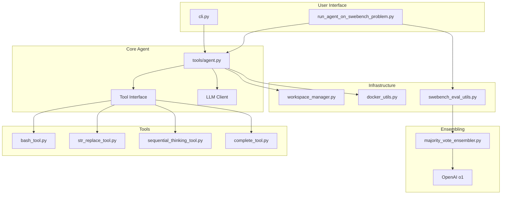
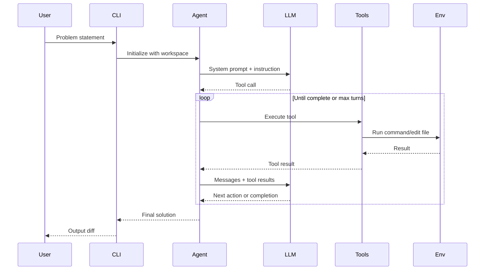
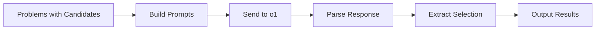

# Project Exploration: augment-swebench-agent

## Overview

This repository contains Augment's implementation of an AI agent for solving SWE-bench Verified tasks. SWE-bench tests how well AI systems handle real-world software engineering tasks pulled from actual GitHub issues in popular open-source projects.

The agent achieved a 65.4% success rate on SWE-bench Verified using Claude Sonnet 3.7 as the core driver and OpenAI's o1 as an ensembler. The implementation is intentionally simple and modular, making it easy to run and build upon as a baseline for future improvements.

## Repository

- **Location:** `/home/darkvoid/Boxxed/@formulas/src.augmentcode/augment-swebench-agent`
- **Remote:** git@github.com:augmentcode/augment-swebench-agent
- **Primary Language:** Python
- **License:** MIT

## Directory Structure

```
augment-swebench-agent/
├── cli.py                              # Interactive CLI interface
├── run_agent_on_swebench_problem.py    # Batch SWE-bench runner
├── majority_vote_ensembler.py          # Solution ensembling
├── __init__.py                         # Package initialization
├── pyproject.toml                      # Project configuration
├── requirements.txt                    # Python dependencies
├── uv.lock                             # UV package manager lock
├── setup.sh                            # Setup script
├── .python-version                     # Python version specification
├── .pre-commit-config.yaml             # Pre-commit hooks
├── pyrightconfig.ci.json               # Type checking configuration
├── LICENSE                             # MIT License
├── README.md                           # Documentation
├── .gitignore                          # Git ignore patterns
├── .secrets.baseline                   # Secret scanning baseline
├── .github/workflows/ci.yml            # CI pipeline
├── tools/
│   ├── __init__.py
│   ├── agent.py                        # Main agent implementation
│   ├── bash_tool.py                    # Bash command execution
│   ├── str_replace_tool.py             # File editing
│   ├── complete_tool.py                # Task completion
│   ├── sequential_thinking_tool.py     # Complex reasoning
│   └── test_*.py                       # Tool tests
├── prompts/
│   ├── instruction.py                  # Instruction templates
│   ├── system_prompt.py                # System prompt
│   └── ensembler_prompt.py             # Ensembling prompts
├── utils/
│   ├── __init__.py
│   ├── llm_client.py                   # LLM client abstraction
│   ├── workspace_manager.py            # Workspace management
│   ├── docker_utils.py                 # Docker integration
│   ├── swebench_eval_utils.py          # SWE-bench evaluation
│   ├── token_counter.py                # Token tracking
│   ├── indent_utils.py                 # Indentation handling
│   ├── common.py                       # Common utilities
│   └── test_indent_utils.py            # Utility tests
├── example_ensembler_data.jsonl        # Example ensembler input
└── example_ensembler_results.json      # Example ensembler output
```

## Architecture

### High-Level Diagram



### Component Breakdown

#### Agent (`tools/agent.py`)

**Location:** `tools/agent.py`

**Purpose:** Main agent loop that processes tool calls and manages conversation turns

**Key Responsibilities:**
- Maintains conversation state
- Processes LLM responses and tool calls
- Manages tool execution
- Handles error recovery
- Tracks token usage

**Agent Loop:**
```python
def run_agent_turn(self, messages: list) -> ToolResult:
    # 1. Get LLM response
    response = self.client.generate(messages, tools=self.tools)

    # 2. Check for completion
    if response.complete:
        return response.content

    # 3. Execute tool calls
    for tool_call in response.tool_calls:
        result = self.execute_tool(tool_call)
        messages.append({"role": "tool", "content": result})

    # 4. Continue to next turn
    return self.run_agent_turn(messages)
```

#### Tool Interface

All tools implement a common interface:

```python
class Tool:
    def run_impl(self, **kwargs) -> str:
        """Execute the tool and return result."""
        pass

    def get_tool_param(self) -> dict:
        """Return tool parameters for LLM."""
        pass

    def get_tool_name(self) -> str:
        """Return tool name."""
        pass
```

#### Bash Tool (`tools/bash_tool.py`)

**Purpose:** Execute shell commands in a controlled environment

**Features:**
- Command approval management
- Docker container support
- Output capture and streaming
- Timeout handling

**Usage:**
```python
bash_tool = BashTool(
    workspace="/path/to/workspace",
    ask_permission=True,
    docker_container_id="container-123"
)
result = bash_tool.run_impl(command="git status")
```

#### String Replace Tool (`tools/str_replace_tool.py`)

**Purpose:** Edit files using string replacement

**Operations:**
- `view`: View file contents
- `create`: Create new file
- `str_replace`: Replace text in file
- `insert`: Insert text at line
- `undo_edit`: Undo last edit

**Example:**
```python
{
    "command": "str_replace",
    "path": "src/main.py",
    "old_str": "def hello():\n    print('Hi')",
    "new_str": "def hello():\n    print('Hello, World!')"
}
```

#### Sequential Thinking Tool (`tools/sequential_thinking_tool.py`)

**Purpose:** Enable complex multi-step reasoning

**Operations:**
- `declare_thought`: Record a thought
- `read_thoughts`: Read previous thoughts
- `revise_thought`: Modify existing thought

This allows the agent to break down complex problems into manageable steps.

#### Workspace Manager (`utils/workspace_manager.py`)

**Purpose:** Manage file system operations and paths

**Features:**
- Root directory management
- Container workspace support
- Path resolution and validation
- File read/write operations

#### LLM Client (`utils/llm_client.py`)

**Purpose:** Abstract LLM API interactions

**Supported Providers:**
- Anthropic (Claude)
- OpenAI (GPT, o1)

**Features:**
- Caching support
- Token counting
- Retry logic
- Response parsing

## Entry Points

### Interactive CLI

```bash
python cli.py [options]
```

**Options:**
- `--workspace`: Path to workspace directory
- `--problem-statement`: Non-interactive mode with problem statement
- `--needs-permission`: Require command approval
- `--docker-container-id`: Docker container for execution
- `--use-container-workspace`: Container workspace path

**Example:**
```bash
python cli.py --workspace /app --problem-statement "Fix the login bug"
```

### SWE-bench Batch Runner

```bash
python run_agent_on_swebench_problem.py [options]
```

**Options:**
- `--num-examples`: Number of problems to solve
- `--shard-ct`: Number of shards for parallelization
- `--shard-id`: Shard ID (0-indexed)
- `--num-processes`: Processes per shard
- `--num-candidate-solutions`: Candidates per problem

**Example:**
```bash
# Test run: 5 problems, 2 candidates each
python run_agent_on_swebench_problem.py --num-examples 5 --num-candidate-solutions 2

# Full run: 10 shards, 8 processes each
python run_agent_on_swebench_problem.py --shard-ct 10 --shard-id 0 --num-processes 8
```

### Majority Vote Ensembler

```bash
python majority_vote_ensembler.py input.jsonl --output_path results.json --workers 8
```

**Process:**
1. Reads candidate solutions from JSONL
2. Sends candidates to o1 for analysis
3. Selects best solution using voting
4. Outputs results with selected diffs

## Data Flow

### Agent Execution Flow



### Ensembling Flow



## External Dependencies

| Dependency | Version | Purpose |
|------------|---------|---------|
| anthropic | Latest | Claude API |
| openai | Latest | OpenAI API |
| docker | Latest | Docker SDK |
| prompt_toolkit | Latest | CLI interface |
| rich | Latest | Console output |
| pytest | Latest | Testing |

## Configuration

### Environment Variables

| Variable | Description | Required |
|----------|-------------|----------|
| `ANTHROPIC_API_KEY` | Anthropic API key | For Claude models |
| `OPENAI_API_KEY` | OpenAI API key | For ensembling |
| `DOCKER_HOST` | Docker daemon URL | For Docker execution |

### Docker Setup

```bash
# Pull evaluation image
docker pull swebench/swebench.eval:latest

# Run container with workspace
docker run -v /workspace:/app swebench/swebench.eval
```

## Testing

### Running Tests

```bash
pytest
```

### Test Coverage

Tests cover:
- Tool implementations
- String replace operations
- Bash tool execution
- Sequential thinking
- Indentation utilities

## Key Insights

1. **Simple Architecture:** The agent is intentionally simple, making it easy to understand and modify.

2. **Tool-Based Design:** All interactions with the environment happen through well-defined tools, making it easy to add new capabilities.

3. **Ensembling Matters:** Using multiple candidates and selecting the best via ensembling significantly improves success rates.

4. **Parallelization Support:** Built-in sharding support enables scaling across multiple machines for large evaluations.

5. **Docker Integration:** Full Docker support ensures reproducible execution environments matching SWE-bench requirements.

## Prompt Structure

### System Prompt

The system prompt defines:
- Agent role and capabilities
- Available tools and their usage
- Response format requirements
- Safety guidelines

### Instruction Prompt

```python
INSTRUCTION_PROMPT = """
You are an AI assistant tasked with solving software engineering problems.

Location: {location}
Problem: {pr_description}

You have access to the following tools:
- bash: Execute shell commands
- str_replace: Edit files
- sequential_thinking: Break down complex problems

Think step by step and use tools to solve the problem.
"""
```

## Open Questions

1. What specific prompt engineering techniques contributed most to the 65.4% success rate?
2. How does the ensembler decide between conflicting candidate solutions?
3. What are the common failure modes of the agent on SWE-bench tasks?

## Related Projects

- **SWE-bench:** The original benchmark
- **Anthropic SWE-bench:** Reference implementation this was forked from
- **OpenHands:** Alternative agent framework
- **Aider:** Pair programming with AI

## Citation

The SWE-bench papers:
```bibtex
@article{jimenez2023swebench,
  title={SWE-bench: Can Language Models Resolve Real-World GitHub Issues?},
  author={Jimenez, Carlos E et al.},
  journal={arXiv preprint arXiv:2310.06770},
  year={2023}
}
```
