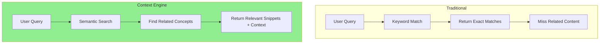
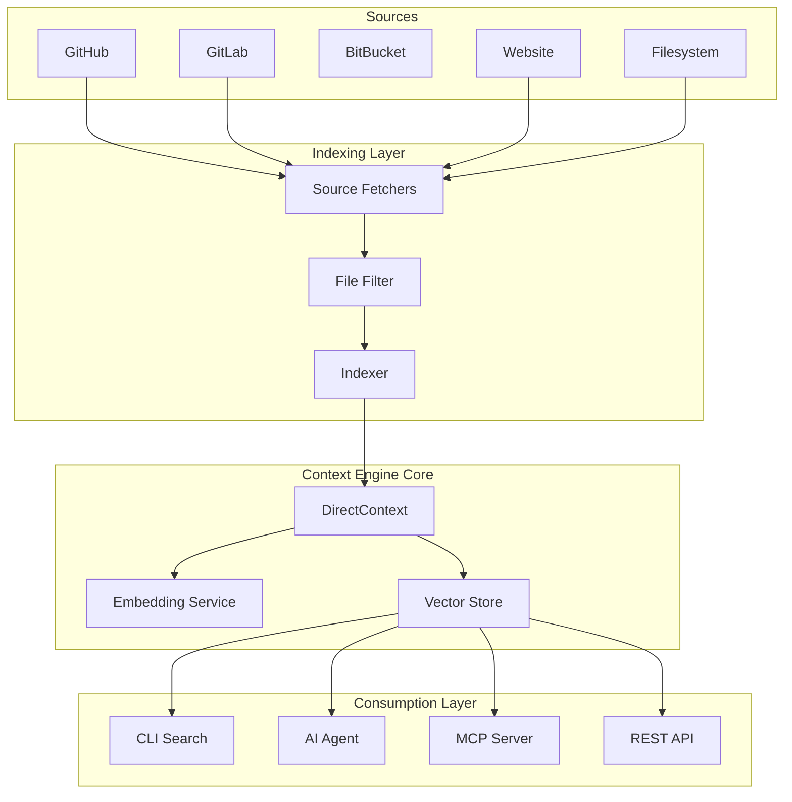
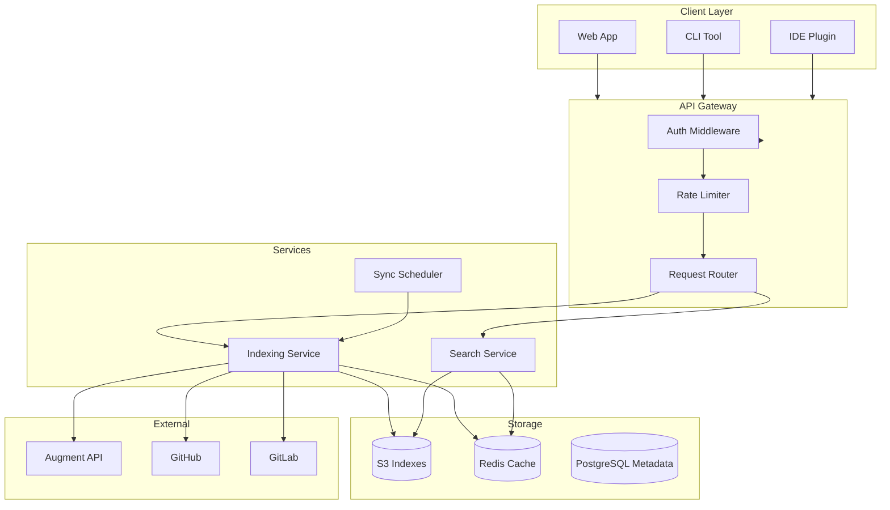

# AugmentCode Context Engine: A Comprehensive Deep Dive

## Overview

The AugmentCode Context Engine is a powerful system that enables semantic search and contextual understanding across codebases, documentation, and other knowledge sources. It forms the foundation for AI agents (like Auggie) to understand and work with specific codebases by creating searchable embeddings of content.

**Key Stats:**
- **1M+ files** indexed in production deployments
- **Real-time** knowledge graph updates
- **100%** retention of team-specific patterns

This deep dive explores:
- What the Context Engine is and what problem it solves
- Architecture and core components
- How to build your own context-aware service
- Key design considerations and trade-offs
- Making it a production service
- Integration patterns and best practices

## Why the Context Engine Matters

### The Problem: Why Most Agents Fail on Complex Tasks

Most AI agents rely on grep and keyword matching to build context. The fundamental limitations:

| Traditional Approach | Limitation |
|---------------------|------------|
| Grep/keyword search | Finds strings, misses architecture |
| Limited context windows | Gets lost in large codebases |
| No pattern recognition | Misses team-specific conventions |
| File-by-file analysis | Loses system-wide understanding |

**The Result:** Agents that start strong but degrade quickly, requiring constant re-explanation and manual intervention.

### The Solution: Full Code Search with Semantic Understanding

The Context Engine provides:

1. **Real-time semantic understanding** - Not just grep, but a full search engine for code
2. **Architecture mapping** - Understands relationships between hundreds of thousands of files
3. **Pattern preservation** - Maintains team-specific conventions and naming patterns
4. **Context curation** - Signal over noise, automatically selecting what matters

**Example:** When you ask "add logging to payment requests," the Context Engine maps the entire path:
- React app → Node API → Payment service → Database → Webhook handlers

It then adds logging at every critical point using the team's existing utilities and conventions.

### Beyond Syntax: Understanding Team Reality

The Context Engine grounds AI in the team's actual reality:

- **Why changes were made**, not just what changed
- **How the team actually builds**, not generic best practices
- **Docs, tickets, and design decisions** via native integrations and MCP
- **Edge cases and team conventions** discovered through deep codebase analysis

### Proven Impact

| Metric | Improvement |
|--------|-------------|
| Engineer onboarding | 18 months → 2 weeks |
| PR review time | 7 minutes → 3 minutes |
| Complex refactoring | 6 months → 1 week |
| Test coverage | 45% → 80% in one quarter |

Blind study comparing 500 agent-generated pull requests to merged human code on Elasticsearch (3.6M Java LOC, 2,187 contributors):
- **Correctness**: Code executes as intended, passes tests, handles edge cases
- **Completeness**: Full implementation without placeholders or TODOs
- **Code Reuse**: Intelligent use of existing utilities and components
- **Best Practice**: Matches unique team patterns and architecture

## What Problem Does It Solve?

### The Context Problem

When AI assistants work with code, they face a fundamental challenge: **how to provide relevant context without overwhelming the model's context window**. Traditional approaches include:

1. **Full file injection**: Send entire files → wastes tokens, loses forest-for-trees
2. **Keyword search**: Misses semantically related content, fails on synonyms
3. **Manual context selection**: Requires users to know what to share → defeats the purpose

### The Context Engine Solution

The Context Engine solves this through **semantic embeddings + intelligent retrieval**:

1. **Embeddings**: Convert code/docs into vector representations capturing semantic meaning
2. **Incremental indexing**: Only process changed content, caching the rest
3. **Semantic search**: Query by meaning, not keywords
4. **Context construction**: Dynamically build context packages for specific queries



## Architecture

### High-Level Architecture



### Core Components

#### 1. DirectContext (The Heart)

`DirectContext` is the primary abstraction from the `@augmentcode/auggie-sdk`. It manages:
- File content and embeddings
- Incremental update tracking
- Search operations
- Context export/import

```typescript
import { DirectContext } from "@augmentcode/auggie-sdk";

// Create new context
const context = await DirectContext.create({
  apiKey: process.env.AUGMENT_API_TOKEN,
  apiUrl: process.env.AUGMENT_API_URL,
});

// Add files
await context.addFiles([
  { path: "src/index.ts", contents: "..." },
]);

// Search
const results = await context.search("authentication logic");

// Export for persistence
const state = context.export({ mode: "full" });
```

#### 2. Indexer Orchestrator

The `Indexer` class orchestrates the full indexing pipeline:

```typescript
export class Indexer {
  async index(source: Source, store: IndexStore, key: string): Promise<IndexResult> {
    // 1. Load previous state
    const previousState = await store.loadState(key);

    // 2. Check for changes
    const changes = await source.fetchChanges(previousState.source);

    // 3. Full or incremental index
    if (!previousState || changes === null) {
      return this.fullIndex(source, store, key);
    }

    // 4. Incremental update
    return this.incrementalIndex(source, store, key, previousState, changes);
  }
}
```

**Key insight**: The indexer automatically detects whether to do a full re-index or incremental update based on:
- Existence of previous state
- Source's ability to report changes
- File change detection (additions, modifications, deletions)

#### 3. Source Abstraction

Sources define a common interface for different data providers:

```typescript
interface Source {
  // Fetch all files for initial index
  fetchAll(): Promise<FileEntry[]>;

  // Fetch changes since previous state
  fetchChanges(previous: SourceState): Promise<FileChanges | null>;

  // Get source metadata
  getMetadata(): Promise<SourceMetadata>;
}
```

**Built-in Sources:**
- `GitHubSource` - Uses Octokit REST API
- `GitLabSource` - Uses GitLab API v4
- `BitBucketSource` - Supports Cloud and Server
- `WebsiteSource` - Crawls static HTML

**Custom Source Example:**
```typescript
class ConfluenceSource implements Source {
  constructor(private config: { baseUrl: string; space: string }) {}

  async fetchAll(): Promise<FileEntry[]> {
    // Fetch all pages from Confluence space
    const pages = await this.confluence.getPages(this.config.space);
    return pages.map(p => ({
      path: `${p.title}.md`,
      contents: p.content,
    }));
  }

  async fetchChanges(): Promise<FileChanges | null> {
    // Confluence doesn't support efficient change detection
    return null; // Will trigger full re-index
  }

  async getMetadata(): Promise<SourceMetadata> {
    return {
      type: "confluence",
      config: { baseUrl: this.config.baseUrl, space: this.config.space },
      syncedAt: new Date().toISOString(),
    };
  }
}
```

#### 4. Store Abstraction

Stores handle persistence of index state:

```typescript
interface IndexStore {
  // Save both full and search-only states
  save(key: string, full: IndexState, search: IndexStateSearchOnly): Promise<void>;

  // Load full state (for incremental indexing)
  loadState(key: string): Promise<IndexState | null>;

  // Load search-only state (lighter weight)
  loadSearchState(key: string): Promise<IndexStateSearchOnly | null>;

  // Delete index
  delete(key: string): Promise<void>;
}
```

**Built-in Stores:**
- `FilesystemStore` - Local file persistence
- `S3Store` - AWS S3 or S3-compatible storage
- `MemoryStore` - In-memory (testing)

### State Structure

The index state uses a dual-format approach:

```typescript
// Full state - for incremental indexing
interface IndexState {
  version: 1;
  contextState: FullContextState;  // Includes blobs for re-indexing
  source: SourceMetadata;          // Source config and sync info
}

// Search-only state - optimized for querying
interface IndexStateSearchOnly {
  version: 1;
  contextState: SearchOnlyContextState;  // Minimal, no blobs
  source: SourceMetadata;
}
```

**Why two formats?**
- **Full state** is large (contains all file contents/embeddings) - needed for incremental updates
- **Search-only state** is compact - sufficient for querying, faster to load

## Building Your Own Context Engine Service

### Step 1: Define Your Sources

Identify what content needs indexing:

```typescript
// Example: Internal documentation source
class InternalDocsSource implements Source {
  constructor(private apiClient: DocsApiClient) {}

  async fetchAll(): Promise<FileEntry[]> {
    const docs = await this.apiClient.getAllDocs();
    return docs.map(doc => ({
      path: `${doc.category}/${doc.slug}.md`,
      contents: doc.markdown,
    }));
  }

  async fetchChanges(previous: SourceState): Promise<FileChanges | null> {
    const updatedSince = new Date(previous.source.syncedAt);
    const changes = await this.apiClient.getChangesSince(updatedSince);

    return {
      added: changes.new.map(d => ({ path: `${d.category}/${d.slug}.md`, contents: d.markdown })),
      modified: changes.updated.map(d => ({ path: `${d.category}/${d.slug}.md`, contents: d.markdown })),
      removed: changes.deleted.map(d => `${d.category}/${d.slug}.md`),
    };
  }

  async getMetadata(): Promise<SourceMetadata> {
    return {
      type: "internal-docs",
      config: { apiVersion: "v2" },
      syncedAt: new Date().toISOString(),
    };
  }
}
```

### Step 2: Choose/Create a Store

Select storage based on deployment needs:

```typescript
// Development: Filesystem store
const store = new FilesystemStore({
  basePath: "./indexes",
});

// Production: S3 store
const store = new S3Store({
  bucket: process.env.INDEX_BUCKET!,
  endpoint: process.env.S3_ENDPOINT,  // For MinIO, etc.
});

// Custom store example (Redis)
class RedisStore implements IndexStore {
  constructor(private redis: Redis) {}

  async save(key: string, full: IndexState, search: IndexStateSearchOnly): Promise<void> {
    await this.redis.set(`index:${key}:full`, JSON.stringify(full));
    await this.redis.set(`index:${key}:search`, JSON.stringify(search));
  }

  async loadState(key: string): Promise<IndexState | null> {
    const data = await this.redis.get(`index:${key}:full`);
    return data ? JSON.parse(data) : null;
  }

  async loadSearchState(key: string): Promise<IndexStateSearchOnly | null> {
    const data = await this.redis.get(`index:${key}:search`);
    return data ? JSON.parse(data) : null;
  }

  async delete(key: string): Promise<void> {
    await this.redis.del(`index:${key}:full`);
    await this.redis.del(`index:${key}:search`);
  }
}
```

### Step 3: Build the Indexing Service

Create a service that orchestrates indexing:

```typescript
class ContextIndexingService {
  private indexer: Indexer;
  private store: IndexStore;
  private sources: Map<string, Source>;

  constructor(config: { apiKey: string; apiUrl: string }) {
    this.indexer = new Indexer({
      apiKey: config.apiKey,
      apiUrl: config.apiUrl,
    });
    this.store = new S3Store({ bucket: "my-context-indexes" });
    this.sources = new Map();
  }

  registerSource(name: string, source: Source): void {
    this.sources.set(name, source);
  }

  async indexSource(name: string): Promise<IndexResult> {
    const source = this.sources.get(name);
    if (!source) throw new Error(`Unknown source: ${name}`);

    return this.indexer.index(source, this.store, name);
  }

  async indexAll(): Promise<Map<string, IndexResult>> {
    const results = new Map();
    for (const [name, source] of this.sources) {
      try {
        const result = await this.indexer.index(source, this.store, name);
        results.set(name, result);
      } catch (error) {
        console.error(`Failed to index ${name}:`, error);
      }
    }
    return results;
  }
}
```

### Step 4: Build the Search Service

Create a search API for consumption:

```typescript
import { SearchClient } from "@augmentcode/context-connectors";

class ContextSearchService {
  private clients: Map<string, SearchClient>;

  constructor(store: IndexStore, indexes: string[]) {
    this.clients = new Map();
    for (const indexName of indexes) {
      const client = new SearchClient({
        store,
        indexName,
      });
      this.clients.set(indexName, client);
    }
  }

  async initialize(): Promise<void> {
    for (const client of this.clients.values()) {
      await client.initialize();
    }
  }

  async search(query: string, indexes?: string[]): Promise<SearchResult[]> {
    const targetIndexes = indexes || Array.from(this.clients.keys());
    const allResults: SearchResult[] = [];

    for (const indexName of targetIndexes) {
      const client = this.clients.get(indexName);
      if (client) {
        const result = await client.search(query);
        allResults.push(...result.results);
      }
    }

    // Rank and deduplicate results
    return this.rankResults(allResults, query);
  }

  private rankResults(results: SearchResult[], query: string): SearchResult[] {
    // Implement custom ranking logic
    return results
      .sort((a, b) => b.score - a.score)
      .slice(0, 20);
  }
}
```

### Step 5: Expose via API

Build a REST or gRPC API:

```typescript
// Express.js example
import express from "express";

const app = express();
const searchService = new ContextSearchService(store, ["main-repo", "docs"]);

await searchService.initialize();

app.post("/api/search", async (req, res) => {
  const { query, indexes } = req.body;

  try {
    const results = await searchService.search(query, indexes);
    res.json({ results });
  } catch (error) {
    res.status(500).json({ error: error.message });
  }
});

app.listen(3000);
```

## Key Design Considerations

### 1. Incremental vs. Full Indexing

**Trade-off**: Incremental is faster but requires change tracking; full is simpler but slower.

**Solution**: The `Indexer` automatically chooses based on:
- No previous state → Full index
- Source supports `fetchChanges()` → Try incremental
- Incremental fails → Fall back to full

**Best Practice**: Implement `fetchChanges()` for sources where it's efficient (GitHub, GitLab). Return `null` for sources where full re-fetch is simpler (static websites).

### 2. Embedding Management

**Challenge**: Embeddings are expensive to compute and store.

**DirectContext Approach**:
- Embeddings are computed server-side (Augment API)
- Client only stores references and metadata
- `alreadyUploaded` tracking avoids re-uploading unchanged files

```typescript
const result = await context.addToIndex(files, {
  onProgress: (progress) => {
    console.log(`Uploaded: ${progress.uploaded}/${progress.total}`);
    console.log(`Indexed: ${progress.indexed}/${progress.total}`);
  },
});

// result.newlyUploaded - files that needed embedding
// result.alreadyUploaded - files already cached
```

### 3. Storage Optimization

**Problem**: Full context state is large (embeddings + file contents).

**Solution**: Dual-state export:
```typescript
const fullState = context.export({ mode: "full" });      // For re-indexing
const searchState = context.export({ mode: "search-only" });  // For querying
```

**Storage Strategy**:
- Store both states
- Load `search-only` for query services (faster, smaller)
- Load `full` only when incremental indexing is needed

### 4. Multi-Tenancy

For SaaS applications, isolate indexes per tenant:

```typescript
class MultiTenantContextService {
  async getOrCreateIndex(tenantId: string, repoName: string): Promise<string> {
    const indexKey = `${tenantId}/${repoName}`;

    // Check if exists
    const state = await this.store.loadState(indexKey);
    if (state) return indexKey;

    // Create new index
    const source = new GitHubSource({ owner: tenantId, repo: repoName });
    await this.indexer.index(source, this.store, indexKey);

    return indexKey;
  }

  async search(tenantId: string, query: string): Promise<SearchResult[]> {
    // Ensure tenant can only access their indexes
    const indexPrefix = `${tenantId}/`;
    const indexes = await this.store.listIndexes(indexPrefix);

    const results: SearchResult[] = [];
    for (const indexName of indexes) {
      const client = new SearchClient({ store: this.store, indexName });
      await client.initialize();
      results.push(...(await client.search(query)).results);
    }

    return results;
  }
}
```

### 5. Rate Limiting and Quotas

When building a service, implement rate limiting:

```typescript
class RateLimitedSearchService {
  private rateLimiter: RateLimiter;

  async search(userId: string, query: string): Promise<SearchResult[]> {
    // Check rate limit
    const allowed = await this.rateLimiter.check(userId, "search");
    if (!allowed) {
      throw new RateLimitExceededError();
    }

    return this.searchService.search(query);
  }
}
```

## Making It a Service

### Architecture for Production



### Service Components

#### 1. Indexing Service (Async)

Indexing is long-running and should be async:

```typescript
// Using Bull queue with Redis
import { Queue, Worker } from "bullmq";

const indexingQueue = new Queue("context-indexing", {
  connection: redisConfig,
});

// Queue indexing job
async function queueIndexing(tenantId: string, repoName: string): Promise<string> {
  const job = await indexingQueue.add("index", {
    tenantId,
    repoName,
    timestamp: Date.now(),
  }, {
    attempts: 3,
    backoff: { type: "exponential", delay: 1000 },
  });
  return job.id!;
}

// Process indexing jobs
const worker = new Worker("context-indexing", async (job) => {
  const { tenantId, repoName } = job.data;

  const source = new GitHubSource({
    owner: tenantId,
    repo: repoName,
    token: await getGitHubToken(tenantId),
  });

  const result = await indexer.index(source, store, `${tenantId}/${repoName}`);

  // Update metadata in database
  await db.indexes.update({
    where: { tenantId, repoName },
    data: {
      lastIndexedAt: new Date(),
      fileCount: result.filesIndexed,
      status: "ready",
    },
  });

  return result;
}, { connection: redisConfig });
```

#### 2. Search Service (Sync)

Search is real-time and should be fast:

```typescript
// With caching layer
class CachedSearchService {
  private cache: Redis;

  async search(tenantId: string, query: string): Promise<SearchResult[]> {
    // Check cache for common queries
    const cacheKey = `search:${tenantId}:${hash(query)}`;
    const cached = await this.cache.get(cacheKey);
    if (cached) return JSON.parse(cached);

    // Perform search
    const results = await this.searchService.search(query, [tenantId]);

    // Cache for 5 minutes
    await this.cache.setex(cacheKey, 300, JSON.stringify(results));

    return results;
  }
}
```

#### 3. Webhook Integration

Automate indexing on source changes:

```typescript
// GitHub webhook handler
import { createExpressHandler } from "@augmentcode/context-connectors/integrations/express";

const app = express();
const store = new S3Store({ bucket: "my-indexes" });

app.post("/webhook/github",
  express.raw({ type: "application/json" }),
  createExpressHandler({
    store,
    secret: process.env.GITHUB_WEBHOOK_SECRET!,

    // Only index main branch pushes
    shouldIndex: (event) => {
      return event.ref === "refs/heads/main";
    },

    // Handle indexing completion
    onIndexed: (key, result) => {
      console.log(`Indexed ${key}: ${result.filesIndexed} files`);
      // Notify via webhook, update database, etc.
    },
  })
);
```

### Health Checks and Monitoring

```typescript
// Health check endpoint
app.get("/health", async (req, res) => {
  const checks = {
    api: "ok",
    indexing: await checkQueueHealth(),
    search: await checkSearchLatency(),
    storage: await checkStorageHealth(),
  };

  const allHealthy = Object.values(checks).every(v => v === "ok");
  res.status(allHealthy ? 200 : 503).json(checks);
});

// Metrics
app.get("/metrics", async (req, res) => {
  const metrics = {
    indexes: await store.countIndexes(),
    queueLength: await indexingQueue.getJobCountByTypes("waiting"),
    avgSearchLatency: await getAvgSearchLatency(),
    cacheHitRate: await getCacheHitRate(),
  };
  res.json(metrics);
});
```

## Integration Patterns

### Pattern 1: MCP Server for AI Assistants

Expose context via Model Context Protocol:

```typescript
import { runMCPServer } from "@augmentcode/context-connectors";

await runMCPServer({
  store: new S3Store({ bucket: "my-indexes" }),
  indexName: "main-repo",
  searchOnly: false,  // Enable list_files, read_file tools
});
```

**Claude Desktop config:**
```json
{
  "mcpServers": {
    "my-repo": {
      "command": "npx",
      "args": ["context-connectors", "mcp", "stdio", "-i", "main-repo"],
      "env": {
        "AUGMENT_API_TOKEN": "token",
        "AUGMENT_API_URL": "https://api.augmentcode.com/"
      }
    }
  }
}
```

### Pattern 2: Embedded Search in Applications

Add semantic search to your docs site:

```typescript
// React component example
function DocsSearch() {
  const [query, setQuery] = useState("");
  const [results, setResults] = useState([]);

  const search = async () => {
    const response = await fetch("/api/search", {
      method: "POST",
      headers: { "Content-Type": "application/json" },
      body: JSON.stringify({ query }),
    });
    const data = await response.json();
    setResults(data.results);
  };

  return (
    <div>
      <input
        value={query}
        onChange={e => setQuery(e.target.value)}
        placeholder="Search docs..."
      />
      <button onClick={search}>Search</button>
      <Results results={results} />
    </div>
  );
}
```

### Pattern 3: CI/CD Integration

Auto-index on deployment:

```yaml
# GitHub Actions
name: Index Documentation

on:
  push:
    branches: [main]
    paths: ["docs/**"]

jobs:
  index:
    runs-on: ubuntu-latest
    steps:
      - uses: actions/checkout@v4

      - name: Index docs folder
        run: |
          npx context-connectors index filesystem \
            --path ./docs \
            -i docs-site
        env:
          AUGMENT_API_TOKEN: ${{ secrets.AUGMENT_API_TOKEN }}
          AUGMENT_API_URL: ${{ secrets.AUGMENT_API_URL }}
```

### Pattern 4: Multi-Index Aggregation

Search across multiple indexes:

```typescript
class AggregatedSearchService {
  private indexes: Map<string, SearchClient>;

  async globalSearch(query: string, tenantId: string): Promise<SearchResult[]> {
    const accessibleIndexes = await this.getAccessibleIndexes(tenantId);

    const allResults: SearchResult[] = [];
    for (const indexName of accessibleIndexes) {
      const client = this.indexes.get(indexName);
      if (client) {
        const result = await client.search(query);
        allResults.push(...result.results);
      }
    }

    // Rank, deduplicate, and filter by tenant permissions
    return this.processResults(allResults, tenantId);
  }
}
```

## Best Practices

### 1. Index Naming Conventions

Use hierarchical names for organization:
```
tenant-id/repo-name
tenant-id/docs
tenant-id/tickets/jira
```

### 2. Incremental Indexing

Always prefer incremental when possible:
```typescript
// The Indexer handles this automatically
const result = await indexer.index(source, store, key);
// result.type indicates "full", "incremental", or "unchanged"
```

### 3. File Filtering

Use `.augmentignore` for custom patterns:
```
# .augmentignore
node_modules/
dist/
build/
*.min.js
CHANGELOG.md
```

### 4. Error Handling

Handle common failure modes:
```typescript
try {
  await client.initialize();
} catch (error) {
  if (error.message.includes("not found")) {
    // Index doesn't exist - trigger indexing
    await queueIndexing(key);
  } else if (error.message.includes("type mismatch")) {
    // Source changed - re-index required
    await reindexWithNewSource(key);
  }
}
```

### 5. Security

- **API Key Management**: Use environment variables or secrets managers
- **Index Isolation**: Prefix indexes by tenant/user
- **Access Control**: Validate permissions before search
- **Data Sensitivity**: Don't index sensitive content (secrets, PII)

## Performance Optimization

### 1. Parallel Indexing

Index multiple sources in parallel:
```typescript
const results = await Promise.all(
  sources.map(s => indexer.index(s, store, s.name))
);
```

### 2. Batch File Operations

Group file operations for efficiency:
```typescript
// Bad: One at a time
for (const file of files) {
  await context.addFiles([file]);
}

// Good: Batch together
await context.addFiles(files);
```

### 3. Caching Strategy

```typescript
// Cache search results for repeated queries
const cacheKey = `search:${hash(query + indexName)}`;
const cached = await redis.get(cacheKey);
if (cached) return JSON.parse(cached);

const results = await client.search(query);
await redis.setex(cacheKey, 300, JSON.stringify(results));  // 5 min TTL
```

### 4. Connection Pooling

For high-throughput services:
```typescript
// Reuse SearchClient instances
const clientPool = new Map<string, SearchClient>();

function getClient(indexName: string): SearchClient {
  if (!clientPool.has(indexName)) {
    const client = new SearchClient({ store, indexName });
    clientPool.set(indexName, client);
  }
  return clientPool.get(indexName)!;
}
```

## Conclusion

The AugmentCode Context Engine provides a powerful foundation for building context-aware AI applications. Key takeaways:

1. **DirectContext** is the core abstraction for managing embeddings and search
2. **Incremental indexing** dramatically reduces indexing time and cost
3. **Dual-state storage** (full + search-only) optimizes for both operations
4. **Source/Store abstractions** enable extensibility
5. **MCP integration** provides out-of-the-box AI assistant support

The architecture balances:
- **Simplicity** (single `index()` call)
- **Flexibility** (custom sources, stores)
- **Performance** (incremental updates, caching)
- **Scalability** (async indexing, distributed storage)

Whether embedding it in an application or building a standalone service, the Context Engine provides the primitives needed for semantic understanding of code and documentation.
