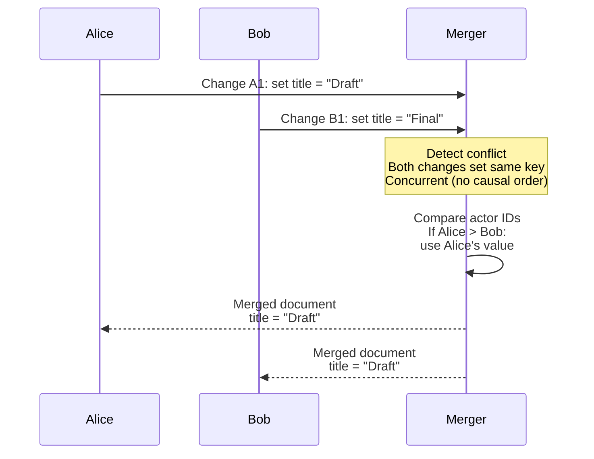
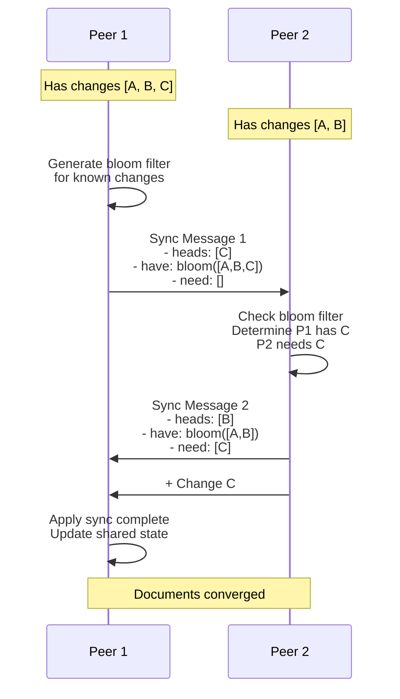
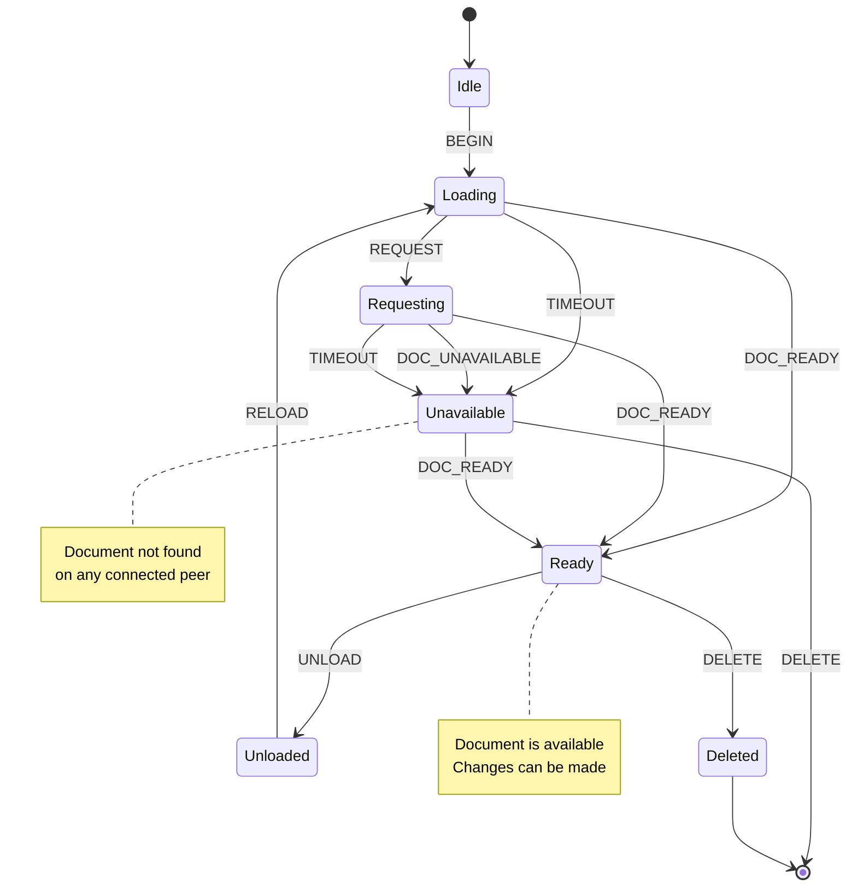
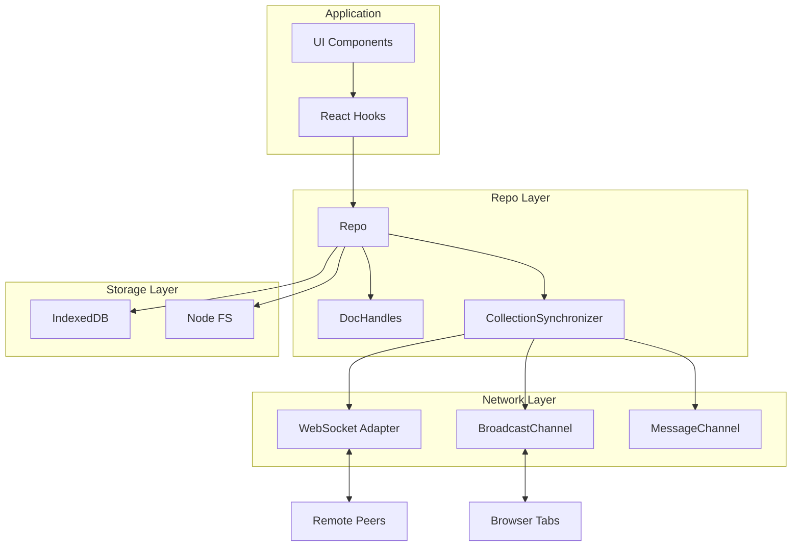
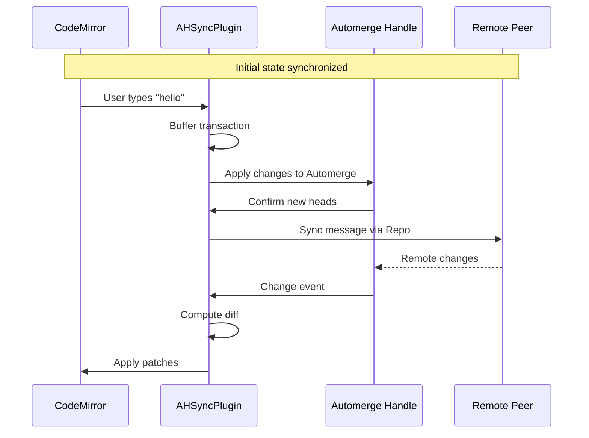
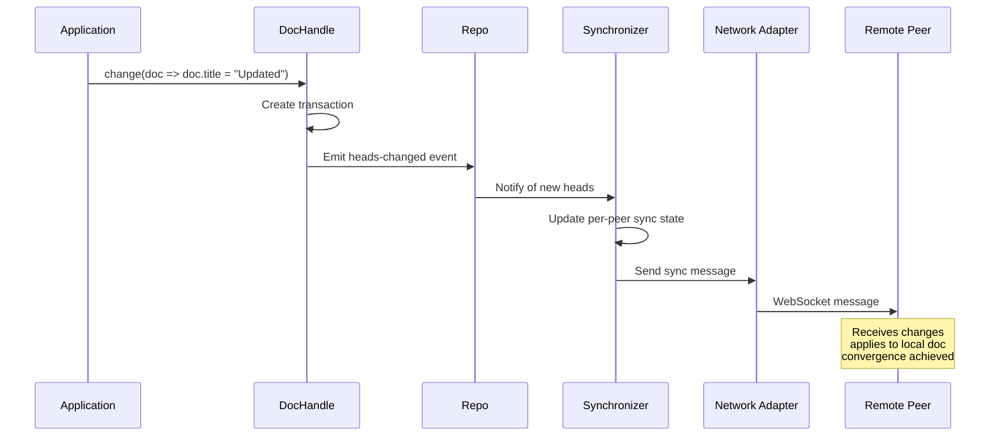

# Automerge Ecosystem Exploration

## Project Overview

Automerge is a library and ecosystem of tools for building **local-first collaborative applications**. At its core, Automerge implements **CRDTs (Conflict-free Replicated Data Types)** - data structures that can be independently modified on multiple devices and later merged without conflicts.

The ecosystem consists of 30+ repositories spanning:
- **Core CRDT library** - The underlying data structures and sync protocol (Rust + TypeScript)
- **High-level Repo API** - Document management, networking, and storage abstractions
- **Language bindings** - Go, Python, Java, Swift implementations
- **Editor integrations** - CodeMirror and ProseMirror plugins for collaborative editing
- **Infrastructure** - Sync servers, network adapters, storage adapters
- **Example applications** - MeetingNotes, PushPin, pixelpusher

The philosophy follows the **"local-first" paradigm**: applications should work offline by default and sync when connectivity is available, treating network failures as a normal operating condition rather than an error state.

---

## Repository Structure

```
src.automerge/
├── automerge/                          # Core CRDT library (Rust + TypeScript/JS)
│   ├── javascript/                     # TypeScript/JavaScript bindings
│   │   ├── src/
│   │   │   ├── index.ts               # Main exports
│   │   │   ├── stable.ts              # Stable API
│   │   │   ├── next.ts                # Next-gen API
│   │   │   ├── low_level.ts           # WASM interop
│   │   │   └── text.ts                # Text CRDT helpers
│   │   ├── test/                       # Test suite
│   │   └── examples/                   # Example applications
│   ├── rust/
│   │   ├── automerge/                  # Core Rust implementation
│   │   │   └── src/
│   │   │       ├── lib.rs             # Library entry point
│   │   │       ├── automerge.rs       # Main Automerge struct
│   │   │       ├── change_graph.rs    # Change dependency graph
│   │   │       ├── sync.rs            # Sync protocol implementation
│   │   │       ├── op_set.rs          # Operation set data structure
│   │   │       ├── op_tree.rs         # Tree-based op storage
│   │   │       ├── transaction/       # Transaction management
│   │   │       ├── storage/           # Binary format encoding/decoding
│   │   │       ├── columnar/          # Columnar compression
│   │   │       └── types.rs           # Core type definitions
│   │   ├── automerge-wasm/            # WASM bindings for JavaScript
│   │   ├── automerge-c/               # C FFI bindings
│   │   └── automerge-cli/             # Command-line tools
│   ├── interop/                        # Cross-implementation testing
│   └── scripts/                        # Build and CI scripts
│
├── automerge-classic/                  # Previous generation (deprecated)
│   ├── frontend/                       # JavaScript frontend
│   └── backend/                        # Rust backend
│
├── automerge-repo/                     # High-level document management
│   ├── packages/
│   │   ├── automerge-repo/            # Core repo implementation
│   │   │   └── src/
│   │   │       ├── Repo.ts            # Main Repo class
│   │   │       ├── DocHandle.ts       # Document handle with state machine
│   │   │       ├── AutomergeUrl.ts    # URL parsing/validation
│   │   │       ├── network/           # Network abstraction layer
│   │   │       ├── storage/           # Storage abstraction layer
│   │   │       └── synchronizer/      # Doc synchronization
│   │   ├── automerge-repo-network-websocket/  # WebSocket networking
│   │   ├── automerge-repo-network-broadcastchannel/  # Tab-to-tab sync
│   │   ├── automerge-repo-network-messagechannel/  # Worker communication
│   │   ├── automerge-repo-storage-indexeddb/  # Browser storage
│   │   ├── automerge-repo-storage-nodefs/   # Node.js filesystem storage
│   │   ├── automerge-repo-react-hooks/      # React integration
│   │   └── automerge-repo-svelte-store/     # Svelte integration
│   └── examples/
│       ├── react-todo/                # Todo app example
│       ├── react-counter/             # Counter example
│       └── svelte-counter/            # Svelte counter example
│
├── automerge-codemirror/               # CodeMirror 6 collaborative editing
│   └── src/
│       ├── plugin.ts                  # ViewPlugin for sync
│       ├── amToCodemirror.ts          # Automerge -> CodeMirror patches
│       └── codeMirrorToAm.ts          # CodeMirror -> Automerge changes
│
├── automerge-prosemirror/              # ProseMirror collaborative editing
│   └── src/
│       ├── index.ts                   # Main exports
│       ├── syncPlugin.ts              # ProseMirror plugin
│       ├── amToPm.ts                  # Automerge -> ProseMirror
│       ├── pmToAm.ts                  # ProseMirror -> Automerge
│       ├── schema.ts                  # Schema adapter
│       └── basicSchema.ts             # Default rich text schema
│
├── automerge-go/                       # Go implementation
│   ├── automerge.go                   # Main Go bindings
│   ├── automerge.h                    # C header (cgo)
│   └── deps/autommerge/               # Embedded Rust library
│
├── automerge-py/                       # Python implementation
│   ├── src/automerge/                 # Python module
│   └── rust/                          # Rust backend
│
├── automerge-java/                     # Java implementation
│   ├── lib/                           # Native libraries
│   └── rust/                          # Rust backend
│
├── automerge-swift/                    # Swift implementation
│   ├── Sources/Automerge/             # Swift module
│   └── rust/                          # Rust backend
│
├── autosurgeon/                        # ORM-like abstraction for Rust
│   ├── autosurgeon/                   # Main library
│   └── autosurgeon-derive/            # Procedural macros (Reconcile, Hydrate)
│
├── hypermerge/                         # Hypercore-based Automerge (DEPRECATED)
│   ├── src/
│   │   ├── Repo.ts                    # Repository management
│   │   ├── DocBackend.ts              # Backend processing
│   │   ├── DocFrontend.ts             # Frontend UI
│   │   ├── ClockStore.ts              # Vector clock storage
│   │   └── Crypto.ts                  # Cryptographic primitives
│   └── ARCHITECTURE.md                # Architecture documentation
│
├── sync-server/                        # Simple sync server
│   └── src/
│       └── index.ts                   # WebSocket server
│
├── automerge-repo-sync-server/         # Production sync server
│   ├── src/
│   │   └── index.ts                   # Express + WebSocket server
│   └── Dockerfile
│
├── pixelpusher/                        # Collaborative pixel art editor
│   └── src/
│       └── index.tsx                  # React canvas editor
│
├── pixelpusherd/                       # Pixel art sync server
│   └── pixelpusherd.js                # Node.js server
│
├── MeetingNotes/                       # iOS/macOS example application
│   └── MeetingNotes/
│       ├── Models/                    # Data models
│       ├── Views/                     # SwiftUI views
│       └── Sync/                      # Sync configuration
│
├── automerge.github.io/                # Documentation site
│   └── docs/
│       ├── understanding-automerge/   # Conceptual guide
│       ├── api/                       # API reference
│       └── tutorials/                 # Getting started
│
└── automerge-binary-format-spec/       # Binary format specification
    └── spec.md                         # Format documentation
```

---

## Architecture

### CRDT Foundation

Automerge implements several CRDT types:

1. **LWW Register (Last-Writer-Wins)** - For scalar values
2. **G-Set (Grow-only Set)** - For sets that only grow
3. **2P-Set (Two-Phase Set)** - For sets with add/remove
4. **OR-Set (Observed-Remove Set)** - For concurrent set operations
5. **LSEQ/Logoot** - For collaborative text editing
6. **Counter** - For increment/decrement operations

#### Data Model

```
Document
├── Objects (maps, lists, text, scalars)
│   ├── Map: key -> value
│   ├── List: index -> value
│   ├── Text: character sequence with marks
│   └── Scalar: string, number, boolean, null
├── Operations
│   ├── Make(objType) - Create new object
│   ├── Put(key/value) - Set value
│   ├── Insert(index, value) - Insert in list/text
│   ├── Delete(key/index) - Remove value
│   └── Mark(start, end, name, value) - Apply text mark
└── Change Graph
    ├── Changes (topologically ordered)
    │   ├── actor: ActorId
    │   ├── seq: sequence number
    │   ├── deps: dependency hashes
    │   └── operations: list of ops
    └── Heads: current frontier of changes
```

### Change Graph Structure

The change graph is the core data structure that enables conflict-free merging:

```mermaid
graph TD
    subgraph Change Graph
        A[Change A<br/>actor: Alice<br/>seq: 1]
        B[Change B<br/>actor: Bob<br/>seq: 1]
        C[Change C<br/>actor: Alice<br/>seq: 2<br/>deps: [A]]
        D[Change D<br/>actor: Bob<br/>seq: 2<br/>deps: [A, B]]
    end

    A --> C
    A --> D
    B --> D

    subgraph Operation Representation
        C --> C1["put /title 'Meeting Notes'"]
        D --> D1["insert text at 0"]
    end

    style A fill:#e1f5fe
    style B fill:#fff3e0
    style C fill:#e1f5fe
    style D fill:#fff3e0
```

Each change contains:
- **Actor ID**: Unique identifier for the editing client
- **Sequence Number**: Monotonically increasing per actor
- **Dependencies**: Hashes of changes this change depends on
- **Operations**: The actual modifications to the document

### Merge Algorithm

When merging concurrent changes, Automerge uses a deterministic algorithm:

1. **Causal Ordering**: Changes are topologically sorted by dependencies
2. **Actor Ordering**: For concurrent operations, the actor with the lexicographically larger ID wins
3. **Operation Specificity**: More specific operations take precedence (e.g., deleting a specific list item vs. updating the list)



### Sync Protocol

The sync protocol efficiently exchanges changes between peers:



The protocol uses:
- **Bloom Filters**: Space-efficient set membership for known changes
- **Head Exchange**: Each peer shares their change frontier
- **Delta Detection**: Only missing changes are transmitted
- **Batching**: Multiple changes bundled in single message

---

## Component Breakdowns

### Automerge Core (Rust)

The Rust core provides the high-performance CRDT implementation:

| Component | File | Purpose |
|-----------|------|---------|
| `Automerge` | `automerge.rs` | Main document struct, read/write operations |
| `ChangeGraph` | `change_graph.rs` | Dependency graph for causal ordering |
| `OpSet` | `op_set.rs` | Operation storage with efficient lookup |
| `OpTree` | `op_tree.rs` | B-tree for ordered operation access |
| `Sync` | `sync.rs` | Sync protocol implementation |
| `Transaction` | `transaction/` | Atomic change batching |
| `Storage` | `storage/` | Binary encoding/decoding |
| `Columnar` | `columnar/` | Compression format |

**Key Data Structures:**

```rust
// Simplified representation
pub struct Automerge {
    queue: Vec<Change>,           // Unapplied changes waiting for deps
    history: Vec<Change>,         // Applied changes (topo sorted)
    history_index: HashMap<Hash, usize>,  // Fast lookup
    change_graph: ChangeGraph,    // Dependency relationships
    states: HashMap<Actor, Vec<Seq>>,  // Per-actor sequences
    ops: OpSet,                   // Current state as operations
    actor: Actor,                 // This document's actor
    max_op: u64,                  // Highest operation ID seen
}

pub struct Change {
    actor: ActorId,
    seq: u64,
    deps: Vec<ChangeHash>,
    operations: Vec<Operation>,
    timestamp: i64,
}
```

### DocHandle State Machine

The `DocHandle` in automerge-repo manages document lifecycle:



### Repo Architecture



**Key Components:**

| Component | Responsibility |
|-----------|---------------|
| `Repo` | Central dispatcher, manages handles, networking, storage |
| `DocHandle` | Per-document state machine, change coordination |
| `CollectionSynchronizer` | Manages DocSynchronizers for all documents |
| `DocSynchronizer` | Syncs single document with all connected peers |
| `NetworkSubsystem` | Routes messages to/from network adapters |
| `StorageSubsystem` | Persists/loads documents from storage adapters |

### CodeMirror Integration

The CodeMirror plugin syncs Automerge text with the editor:



Key files:
- `plugin.ts` - ViewPlugin coordinating sync
- `codeMirrorToAm.ts` - Translates CM transactions to Automerge ops
- `amToCodemirror.ts` - Applies Automerge patches to CM

### ProseMirror Integration

ProseMirror integration handles rich text with schema mapping:

```mermaid
graph LR
    subgraph "Automerge Document"
        AM[Text with Marks<br/>blocks + marks arrays]
    end

    subgraph "Schema Adapter"
        BLOCK[Block Mapping]
        MARK[Mark Mapping]
        ATTR[Attribute Parsers]
    end

    subgraph "ProseMirror Document"
        PM[Nodes + Marks<br/>Schema-conformant]
    end

    AM <--> BLOCK
    AM <--> MARK
    BLOCK <--> PM
    MARK <--> PM

    note right of BLOCK
        paragraph -> paragraph
        heading -> heading
        list_item -> ordered/unordered
    end note
```

---

## Entry Points and Execution Flows

### Creating/Loading Documents

```typescript
// Application code
const repo = new Repo({
  storage: new NodeFSStorageAdapter("./data"),
  network: [new WebSocketNetworkAdapter("wss://sync.example.com")],
  peerId: "peer-" + randomId(),
})

// Create new document
const handle = repo.create<{ title: string }>()
handle.change(doc => {
  doc.title = "New Document"
})

// Load existing document
const existingHandle = repo.find<{ title: string }>(automergeUrl)
const doc = await existingHandle.value()  // Wait for ready
```

**Flow:**
1. `Repo.create()` generates new document ID, creates DocHandle
2. DocHandle starts in `idle` state, transitions to `loading`
3. Storage subsystem checked for existing data
4. If not found, REQUEST sent to peers
5. Peers respond with changes via sync protocol
6. DocHandle transitions to `ready` when materialized
7. Application can now read/modify document

### Sync Message Processing

```rust
// Rust core - simplified
fn receive_sync_message(
    &mut self,
    state: &mut SyncState,
    message: SyncMessage
) -> Result<(), AutomergeError> {
    // 1. Process any changes the peer sent
    for change in message.changes {
        self.apply_change(change)?;
    }

    // 2. Update our knowledge of peer's heads
    state.their_heads = Some(message.heads);

    // 3. Calculate what they need
    let missing = self.get_missing_deps(&message.heads);

    // 4. Send missing changes
    for hash in missing {
        if let Some(change) = self.get_change(hash) {
            state.changes_to_send.push(change);
        }
    }

    Ok(())
}
```

### Change Propagation



---

## External Dependencies

### Core Library (automerge)

| Dependency | Purpose |
|------------|---------|
| `itertools` | Iterator utilities for change processing |
| `serde` | Serialization for binary format |
| `thiserror` | Error handling |
| `tracing` | Logging and debugging |
| `flate2` | Compression for storage |
| `sha2` | Hashing for change IDs |
| `wasm-bindgen` | JavaScript interop |

### Repo (automerge-repo)

| Dependency | Purpose |
|------------|---------|
| `eventemitter3` | Event handling |
| `xstate` | DocHandle state machine |
| `debug` | Namespaced logging |
| `cbor` | Binary encoding for messages |
| `uuid` | ID generation |

### Integrations

| Project | Dependencies |
|---------|--------------|
| automerge-codemirror | `@codemirror/state`, `@codemirror/view` |
| automerge-prosemirror | `prosemirror-state`, `prosemirror-model`, `prosemirror-view` |

---

## Configuration

### Package Configuration

**automerge (TypeScript):**
```json
{
  "name": "@automerge/automerge",
  "version": "2.2.x",
  "main": "./dist/index.js",
  "dependencies": {
    "@automerge/automerge-wasm": "^2.2.x"
  }
}
```

**automerge-repo:**
```json
{
  "name": "@automerge/automerge-repo",
  "version": "2.0.0-alpha.27",
  "type": "module",
  "peerDependencies": {
    "@automerge/automerge": "^2.2.8"
  }
}
```

### Build System

The project uses:
- **pnpm** for monorepo package management
- **TypeScript** for type checking
- **Vite** for bundling
- **wasm-pack** for Rust WASM builds
- **vitest** for testing

---

## Testing Strategies

### Unit Tests

Each component has isolated unit tests:
- `automerge/rust/automerge/tests/` - Core CRDT operations
- `automerge-repo/packages/automerge-repo/test/` - Repo and handle tests
- Integration tests verify cross-component behavior

### Property-Based Testing

The core library uses property-based testing to verify CRDT invariants:
- Convergence: All peers converge to same state
- Causality: Causal order preserved
- Idempotency: Applying same change twice has no effect

### Fuzz Testing

```rust
// From automerge/rust/automerge/fuzz/fuzz_targets/load.rs
#[export_name="rust_fuzzer_test_input"]
pub fn fuzz_load(data: &[u8]) {
    // Generate random byte sequences
    // Attempt to load as automerge document
    // Verify no panics or memory issues
    let _doc = AutoCommit::load(data);
}
```

### Integration Tests

Editor integrations tested with:
- **Cypress** for E2E browser testing
- **Playwright** for cross-browser validation
- Custom test harnesses for concurrent editing scenarios

---

## Key Insights for Engineers

### 1. CRDTs Trade Storage for Correctness

Automerge stores every change ever made. This enables:
- Perfect history preservation
- Offline operation
- Guaranteed convergence

But means documents grow unboundedly. Consider:
- Compaction strategies for long-lived documents
- Archiving old changes for audit scenarios
- Using separate documents for ephemeral vs. persistent data

### 2. Sync Protocol is Optimized for Churn

The bloom filter-based sync protocol excels when:
- Peers frequently disconnect/reconnect
- Network bandwidth is limited
- Multiple peers edit concurrently

But has overhead for:
- Initial sync of large documents
- Scenarios where full document transfer would be simpler

### 3. Editor Integrations Require Careful Patching

Text synchronization is the hardest problem:
- Cursor positions must be transformed
- Undo/redo behavior can surprise users
- Concurrent edits at same position need policies

The CodeMirror/ProseMirror plugins use:
- Patch-based updates (not full re-renders)
- Transaction batching for performance
- Mark preservation across edits

### 4. Rust Core Enables Multi-Language Support

All language bindings call the same Rust code via FFI:
- Consistent behavior across languages
- Single codebase for CRDT logic
- Performance benefits of native code

Trade-offs:
- WASM load time in browsers
- Binary size for mobile apps
- Build complexity for multiple targets

### 5. Repo Abstraction Solves Real Problems

The core Automerge library is low-level. The Repo layer provides:
- Document lifecycle management
- Peer discovery and connection
- Storage adapter abstraction
- Automatic sync coordination

For production apps, always use Repo unless you need custom sync behavior.

---

## Open Questions

### Architecture Decisions

1. **Document Granularity**: How large should individual documents be? Large documents simplify relationships but increase sync overhead.

2. **Storage Strategy**: When to use IndexedDB vs. filesystem vs. custom backend? Each has tradeoffs for quota, performance, and portability.

3. **Peer Topology**: Full mesh vs. star topology vs. CRDT-aware relay servers? Affects latency, reliability, and infrastructure costs.

### Performance Considerations

4. **Change Compaction**: How to compact sequential changes without losing undo history or forkability?

5. **Lazy Loading**: Can documents be partially loaded for read-heavy workloads?

6. **Index Queries**: How to efficiently query across documents or within large documents?

### Developer Experience

7. **Schema Evolution**: How to handle breaking changes to document schemas while maintaining compatibility with old clients?

8. **Debugging Tools**: What tooling is needed to inspect document state, change history, and sync state in production?

9. **Testing Collaborative Features**: How to test multi-user scenarios deterministically?

### Security Model

10. **Access Control**: How to implement document-level permissions in a peer-to-peer system?

11. **Encrypted Documents**: Can documents be end-to-end encrypted while maintaining CRDT properties?

12. **Sybil Resistance**: How to prevent spam in open peer-to-peer networks?

---

## Related Projects

- **Yjs** - Alternative CRDT library with YATA algorithm
- **Diamond-types** - High-performance CRDT for text
- **GunDB** - Real-time graph database with CRDTs
- **ElectricSQL** - Postgres sync with CRDT conflict resolution
- **RxDB** - Reactive database with PouchDB/CouchDB sync

---

## Resources

- [Automerge Documentation](https://automerge.org/)
- [Automerge Binary Format Spec](https://automerge.org/automerge-binary-format-spec/)
- [Local-First Software](https://www.inkandswitch.com/local-first/)
- [CRDT Papers](https://crdt.tech/papers.html)
- [Discord Community](https://discord.gg/HrpnPAU5zx)

---

*Exploration generated 2026-03-20*
*Total repositories analyzed: 30+*
*Primary languages: TypeScript, Rust*
