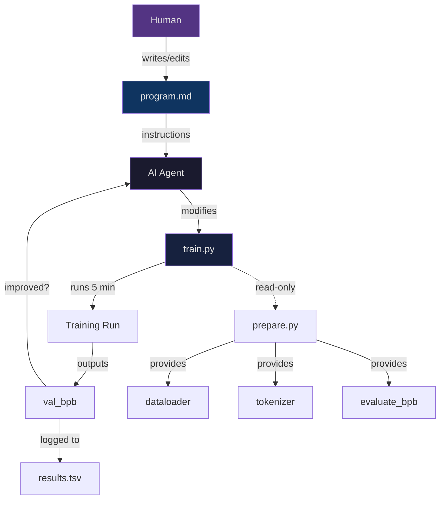
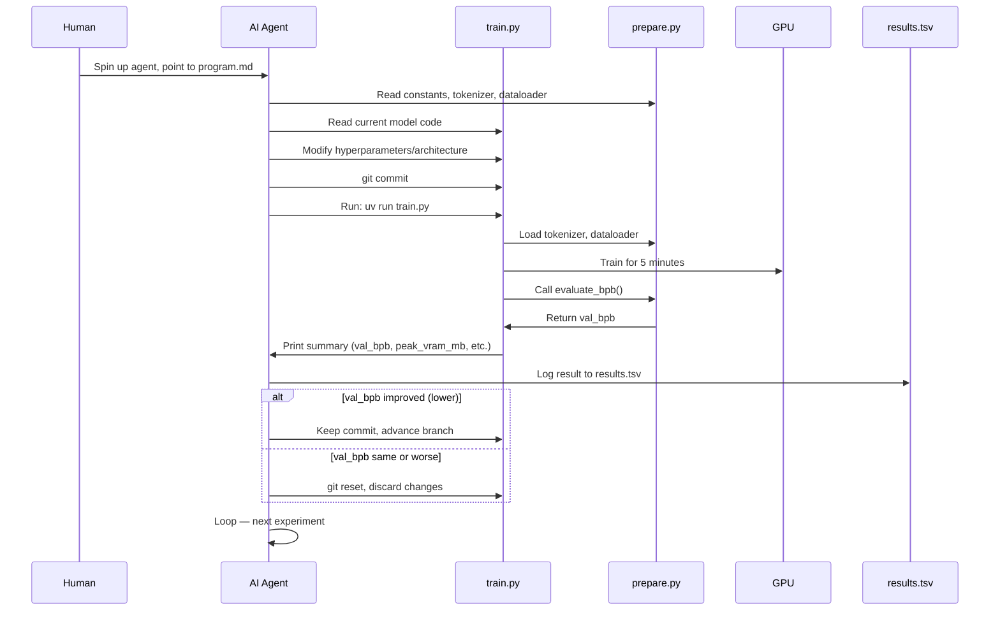

# autoresearch -- Architecture

## Project Structure

The repository is deliberately kept small. Only three files matter:

```
autoresearch/
├── prepare.py       # Constants, data prep, tokenizer, dataloader, eval (DO NOT MODIFY)
├── train.py         # GPT model, optimizer, training loop (AGENT MODIFIES THIS)
├── program.md       # Agent instructions / "skill" file (HUMAN MODIFIES THIS)
├── pyproject.toml   # Dependencies (uv)
├── uv.lock          # Lockfile
├── results.tsv      # Experiment log (untracked, not committed)
└── run.log          # Latest experiment output
```

## The Three Key Files

### `prepare.py` — Fixed Foundation

This file is read-only. The agent is not allowed to modify it. It provides:

- **Constants:** `MAX_SEQ_LEN` (2048), `TIME_BUDGET` (300 seconds), `EVAL_TOKENS` (40 * 524288)
- **Data download:** Fetches ClimbMix-400B dataset shards from HuggingFace, stores them in `~/.cache/autoresearch/data/`
- **Tokenizer training:** Trains a BPE tokenizer using `rustbpe`, saves as a tiktoken pickle in `~/.cache/autoresearch/tokenizer/`
- **Dataloader:** BOS-aligned dataloader with best-fit packing — 100% token utilization, no padding
- **Evaluation:** `evaluate_bpb()` function — the ground truth metric. Computes validation bits per byte on the pinned validation shard (shard_06542)

### `train.py` — The Agent's Canvas

This is the only file the agent modifies. It contains:

- **GPT model:** Full transformer with causal self-attention, MLP blocks, value embeddings (ResFormer), rotary positional embeddings, sliding window attention patterns, soft-capped logits, residual connections with learnable lambdas
- **Optimizer:** Combined Muon + AdamW optimizer with fused `torch.compile` kernels
- **Training loop:** Gradient accumulation, LR warmup/warmdown schedules, momentum scheduling, weight decay scheduling, GC management
- **Hyperparameters:** All defined as module-level constants (no CLI flags). The agent can change any of them: architecture, optimizer, batch size, learning rates, etc.

### `program.md` — The Human's Lever

This is a lightweight "skill" file that guides the AI agent. It contains:

- **Setup instructions:** How to initialize a new experiment run (branch creation, data verification, results TSV initialization)
- **Rules:** What the agent can and cannot do
- **The experiment loop:** The autonomous research procedure
- **Logging format:** How to record results in `results.tsv`
- **Behavioral directives:** "NEVER STOP" — the agent must continue until manually interrupted

The human iterates on this file over time to improve the "research org code."



## Data Flow



## File Interaction Summary

| File | Modified by | Purpose |
|------|-------------|---------|
| `prepare.py` | Nobody (read-only) | Data, tokenizer, dataloader, evaluation |
| `train.py` | AI Agent | Model architecture, optimizer, training loop |
| `program.md` | Human | Agent instructions, research strategy |
| `results.tsv` | AI Agent (untracked) | Experiment log with commit, val_bpb, memory, status, description |
| `pyproject.toml` | Nobody (read-only) | Dependencies |

## Next

- [02-agent-research](./02-agent-research.md) — how the autonomous agent loop works
- [03-training-setup](./03-training-setup.md) — model architecture and optimizer details
