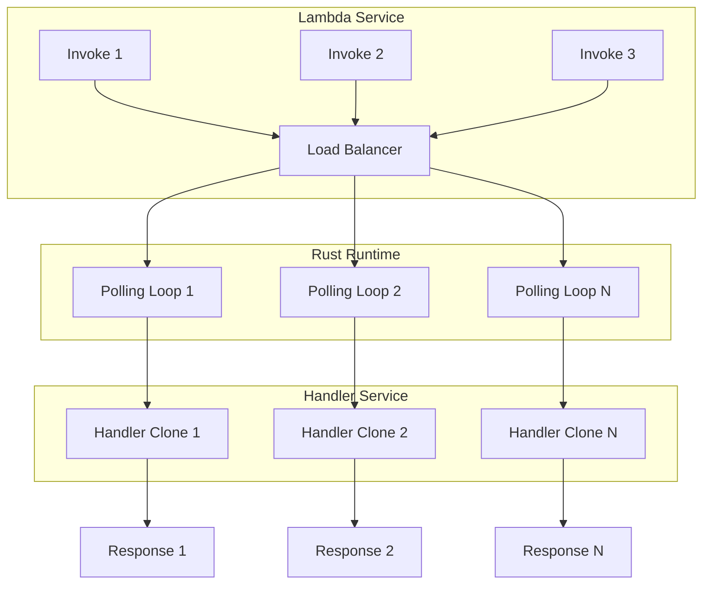

# Tokio Integration Deep Dive

## Introduction

This document provides a comprehensive analysis of how the Lambda Rust Runtime integrates with Tokio for async execution. We examine the runtime's async patterns, concurrent invocation handling, and graceful shutdown mechanisms.

### Source Code Location

```
/home/darkvoid/Boxxed/@formulas/src.rust/src.aws/aws-lambda-rust-runtime/
├── lambda-runtime/src/
│   ├── lib.rs              # Main entry points: run(), run_concurrent()
│   ├── runtime.rs          # Runtime struct and event loop
│   └── layers/             # Tower middleware
│
├── lambda-runtime-api-client/src/
│   └── lib.rs              # HTTP client for Runtime API
```

---

## Part 1: Tokio Runtime Bootstrap

### Entry Point Pattern

All Lambda Rust functions use the same bootstrap pattern:

```rust
#[tokio::main]
async fn main() -> Result<(), Error> {
    let func = service_fn(my_handler);
    lambda_runtime::run(func).await?;
    Ok(())
}
```

### What #[tokio::main] Does

```rust
// Expanded form of #[tokio::main]
fn main() -> Result<(), Error> {
    let rt = tokio::runtime::Builder::new_multi_thread()
        .enable_all()  // Enable all Tokio features
        .build()
        .unwrap();

    rt.block_on(async {
        let func = service_fn(my_handler);
        lambda_runtime::run(func).await
    })
}
```

### Tokio Features Used

```toml
tokio = { version = "1", features = [
    "macros",           # #[tokio::main], #[tokio::test]
    "rt-multi-thread",  # Multi-threaded runtime
    "time",             # tokio::time (sleep, timeout, interval)
    "sync",             # Sync primitives (channels, mutex, etc.)
    "net",              # Network I/O
    "io-util",          # I/O utilities
] }
```

---

## Part 2: Runtime Event Loop

### Sequential Execution (run)

```rust
pub async fn run<A, F, R, B, S, D, E>(handler: F) -> Result<(), Error>
where
    F: Service<LambdaEvent<A>, Response = R>,
    F::Future: Future<Output = Result<R, F::Error>>,
    // ... more bounds
{
    let runtime = Runtime::new(handler).layer(layers::TracingLayer::new());
    runtime.run().await
}
```

### Runtime::run() Implementation

```rust
impl<S> Runtime<S>
where
    S: Service<LambdaInvocation, Response = (), Error = BoxError>,
{
    pub async fn run(self) -> Result<(), BoxError> {
        let incoming = incoming(&self.client);
        Self::run_with_incoming(self.service, self.config, incoming).await
    }
}

async fn run_with_incoming<S, I>(
    service: S,
    config: Arc<Config>,
    mut incoming: I,
) -> Result<(), BoxError>
where
    S: Service<LambdaInvocation, Response = (), Error = BoxError>,
    I: Stream<Item = Result<LambdaInvocation, BoxError>> + Unpin,
{
    while let Some(invocation) = incoming.next().await {
        let invocation = invocation?;
        let mut service = tower::ServiceBuilder::new()
            .service(&mut service);

        service.ready().await?;
        service.call(invocation).await?;
    }

    Ok(())
}
```

### Event Polling Stream

```rust
fn incoming(
    client: &ApiClient,
) -> impl Stream<Item = Result<LambdaInvocation, BoxError>> {
    stream::unfold((), move |()| {
        let client = client.clone();
        async move {
            // Long-poll for next invocation
            match get_next_invocation(&client).await {
                Ok(invocation) => Some((Ok(invocation), ())),
                Err(e) => Some((Err(e), ())),
            }
        }
    })
}

async fn get_next_invocation(client: &ApiClient) -> Result<LambdaInvocation, BoxError> {
    let req = build_request()
        .method(Method::GET)
        .uri("http://{AWS_LAMBDA_RUNTIME_API}/2018-06-01/runtime/invocation/next")
        .body(Body::empty())?;

    let response = client.call(req).await?;

    // Parse response and extract invocation details
    // ...
}
```

---

## Part 3: Concurrent Invocations (run_concurrent)

### Concurrent Mode Overview

```rust
#[cfg(feature = "concurrency-tokio")]
pub async fn run_concurrent<A, F, R, B, S, D, E>(handler: F) -> Result<(), Error>
where
    F: Service<LambdaEvent<A>, Response = R> + Clone + Send + 'static,
    F::Future: Future<Output = Result<R, F::Error>> + Send + 'static,
    // ... more bounds
{
    let runtime = Runtime::new(handler).layer(layers::TracingLayer::new());
    runtime.run_concurrent().await
}
```

### Concurrency Detection

```rust
fn max_concurrency_from_env() -> Option<u32> {
    std::env::var("_X_AMZN_MAX_CONCURRENCY")
        .ok()
        .and_then(|s| s.parse().ok())
}
```

### Concurrent Runtime Implementation

```rust
impl<S> Runtime<S>
where
    S: Service<LambdaInvocation, Response = (), Error = BoxError> + Clone + Send + 'static,
    S::Future: Send,
{
    pub async fn run_concurrent(self) -> Result<(), BoxError> {
        if self.concurrency_limit > 1 {
            Self::run_concurrent_inner(
                self.service,
                self.config,
                self.client,
                self.concurrency_limit,
            ).await
        } else {
            // Fall back to sequential
            let incoming = incoming(&self.client);
            Self::run_with_incoming(self.service, self.config, incoming).await
        }
    }

    async fn run_concurrent_inner(
        service: S,
        config: Arc<Config>,
        client: Arc<ApiClient>,
        concurrency_limit: u32,
    ) -> Result<(), BoxError> {
        // Spawn N independent polling loops
        let mut handles = Vec::new();

        for i in 0..concurrency_limit {
            let service = service.clone();
            let client = client.clone();
            let config = config.clone();

            let handle = tokio::spawn(async move {
                tracing::info!("Starting concurrent polling loop {}", i);

                let incoming = incoming(&client);
                Runtime::run_with_incoming(service, config, incoming).await
            });

            handles.push(handle);
        }

        // Wait for all loops to complete
        for handle in handles {
            handle.await??;
        }

        Ok(())
    }
}
```

### Concurrency Flow Diagram



---

## Part 4: Tower Service Integration

### Service Wrapper

```rust
fn wrap_handler<'a, F, EventPayload, Response, BufferedResponse, StreamingResponse, StreamItem, StreamError>(
    handler: F,
    client: Arc<ApiClient>,
) -> RuntimeApiClientService<RuntimeApiResponseService<CatchPanicService<'a, F>>>
where
    F: Service<LambdaEvent<EventPayload>, Response = Response>,
    // ... bounds
{
    let catch_panic = CatchPanicService::new(handler);
    let api_response = RuntimeApiResponseService::new(catch_panic, client.clone());
    RuntimeApiClientService::new(api_response, client)
}
```

### Middleware Layers

```rust
pub mod layers {
    /// Tracing layer for handler invocations
    pub struct TracingLayer;

    impl<S> Layer<S> for TracingLayer {
        type Service = TracingService<S>;

        fn layer(&self, service: S) -> Self::Service {
            TracingService::new(service)
        }
    }

    pub struct TracingService<S> {
        inner: S,
    }

    impl<S, Request> Service<Request> for TracingService<S>
    where
        S: Service<Request>,
        Request: Debug,
    {
        type Response = S::Response;
        type Error = S::Error;
        type Future = S::Future;

        fn poll_ready(&mut self, cx: &mut Context<'_>) -> Poll<Result<(), Self::Error>> {
            self.inner.poll_ready(cx)
        }

        fn call(&mut self, request: Request) -> Self::Future {
            tracing::debug!("Handler called with: {:?}", request);
            self.inner.call(request)
        }
    }
}
```

### Using Custom Middleware

```rust
use lambda_runtime::{Runtime, layers, LambdaEvent};
use tower::{ServiceBuilder, Layer};

// Custom logging layer
struct LoggingLayer;

impl<S> Layer<S> for LoggingLayer {
    type Service = LoggingService<S>;

    fn layer(&self, service: S) -> Self::Service {
        LoggingService { inner: service }
    }
}

// Apply middleware
let runtime = Runtime::new(handler)
    .layer(layers::TracingLayer::new())
    .layer(LoggingLayer);

runtime.run().await?;
```

---

## Part 5: Graceful Shutdown

### Shutdown Handler

```rust
#[cfg(all(unix, feature = "graceful-shutdown"))]
pub async fn spawn_graceful_shutdown_handler<Fut>(
    shutdown_hook: impl FnOnce() -> Fut + Send + 'static,
) where
    Fut: Future<Output = ()> + Send + 'static,
{
    // Register no-op extension to receive shutdown signals
    let extension = lambda_extension::Extension::new()
        .with_events(&[])
        .with_extension_name("_lambda-rust-runtime-no-op-graceful-shutdown-helper")
        .register()
        .await
        .expect("could not register no-op extension");

    tokio::task::spawn(async move {
        let graceful_shutdown_future = async move {
            let mut sigint = tokio::signal::unix::signal(
                tokio::signal::unix::SignalKind::interrupt()
            ).unwrap();

            let mut sigterm = tokio::signal::unix::signal(
                tokio::signal::unix::SignalKind::terminate()
            ).unwrap();

            tokio::select! {
                biased;
                _ = sigint.recv() => {
                    eprintln!("[runtime] SIGINT received");
                    shutdown_hook().await;
                    std::process::exit(0);
                }
                _ = sigterm.recv() => {
                    eprintln!("[runtime] SIGTERM received");
                    shutdown_hook().await;
                    std::process::exit(0);
                }
            }
        };

        tokio::join!(
            graceful_shutdown_future,
            async { let _ = extension.run().await; }
        );
    });
}
```

### Usage Example

```rust
#[tokio::main]
async fn main() -> Result<(), Error> {
    let func = service_fn(my_handler);

    // Set up graceful shutdown
    let (writer, log_guard) = tracing_appender::non_blocking(std::io::stdout());
    lambda_runtime::tracing::init_default_subscriber_with_writer(writer);

    let shutdown_hook = || async move {
        std::mem::drop(log_guard);  // Flush logs
    };

    lambda_runtime::spawn_graceful_shutdown_handler(shutdown_hook).await;

    lambda_runtime::run(func).await?;
    Ok(())
}
```

---

## Part 6: Response Streaming

### StreamResponse Type

```rust
pub struct StreamResponse<S>
where
    S: Stream + Unpin + Send + 'static,
{
    stream: S,
    prelude: Option<MetadataPrelude>,
}

impl<S, D, E> StreamResponse<S>
where
    S: Stream<Item = Result<D, E>> + Unpin + Send + 'static,
    D: Into<bytes::Bytes> + Send,
    E: Into<BoxError> + Send + Debug,
{
    pub fn new(stream: S) -> Self {
        Self {
            stream,
            prelude: None,
        }
    }

    pub fn with_prelude(mut self, prelude: MetadataPrelude) -> Self {
        self.prelude = Some(prelude);
        self
    }
}
```

### Streaming Handler

```rust
use lambda_runtime::{LambdaEvent, Error, StreamResponse};
use tokio_stream::{StreamExt, iter};
use bytes::Bytes;

async fn stream_handler(
    event: LambdaEvent<Value>,
) -> Result<StreamResponse<impl Stream<Item = Result<Bytes, Error>>>, Error> {
    let chunks = vec![
        "data: Hello\n\n",
        "data: World\n\n",
        "data: Done\n\n",
    ];

    let stream = iter(chunks)
        .then(|chunk| async move {
            Ok(Bytes::from(chunk.to_string()))
        });

    Ok(StreamResponse::new(stream))
}
```

### Streaming Runtime Path

```rust
async fn send_streaming_response(
    client: &ApiClient,
    request_id: &str,
    mut stream: impl Stream<Item = Result<Bytes, BoxError>> + Unpin + Send,
) -> Result<(), BoxError> {
    let url = format!(
        "http://{}/2018-06-01/runtime/invocation/{}/response",
        env::var("AWS_LAMBDA_RUNTIME_API")?,
        request_id
    );

    while let Some(chunk) = stream.next().await {
        let chunk = chunk?;

        let req = build_request()
            .method(Method::POST)
            .uri(&url)
            .body(Body::from(chunk))?;

        client.call(req).await?;
    }

    Ok(())
}
```

---

## Part 7: Tokio Configuration for Lambda

### Optimized Runtime Builder

```rust
// For custom runtime configuration
fn build_lambda_runtime() -> tokio::runtime::Runtime {
    tokio::runtime::Builder::new_multi_thread()
        // Reduce worker threads for Lambda's constrained environment
        .worker_threads(2)
        // Reduce thread stack size
        .thread_stack_size(64 * 1024)
        // Disable global queue for predictable scheduling
        .disable_lifo_slot()
        // Enable all necessary features
        .enable_all()
        .build()
        .unwrap()
}
```

### Environment Variables

```bash
# Tokio respects these environment variables:
TOKIO_WORKER_THREADS=2      # Override worker thread count
RUST_LOG=debug              # Enable debug logging
AWS_LAMBDA_MAX_CONCURRENCY=10  # Max concurrent invocations
```

---

## Summary

| Feature | Implementation |
|---------|----------------|
| **Runtime Bootstrap** | `#[tokio::main]` macro |
| **Event Loop** | Stream-based polling of Runtime API |
| **Concurrent Mode** | Multiple spawned polling tasks |
| **Middleware** | Tower Service trait + Layer |
| **Graceful Shutdown** | Unix signal handling via extension |
| **Streaming** | StreamResponse with chunk forwarding |

---

*Continue to [02-event-sources-deep-dive.md](02-event-sources-deep-dive.md) to learn about event source handling.*
