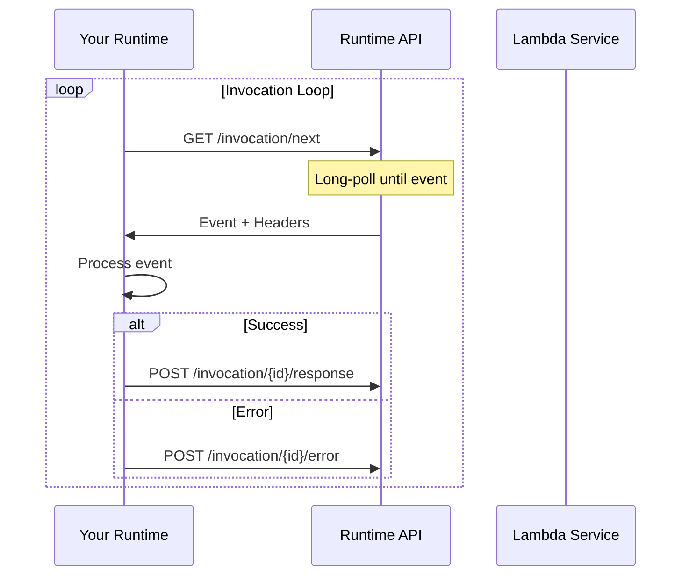
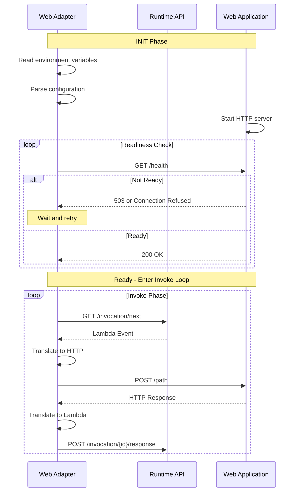

# Zero to Lambda Engineer: Foundations of Serverless Computing

## Introduction

This document takes you from zero knowledge of AWS Lambda to understanding how the Lambda Web Adapter enables any web framework to run on Lambda. By the end, you'll understand:

1. What AWS Lambda is and how it works
2. The Lambda Runtime API
3. Lambda Extensions
4. HTTP translation patterns
5. How adapters bridge Lambda and web frameworks

---

## Part 1: What is AWS Lambda?

### The Serverless Model

AWS Lambda is a **Function-as-a-Service (FaaS)** platform. Instead of provisioning servers, you deploy code that runs in response to events.

```
Traditional Server:                    Lambda Function:
┌─────────────────────┐                ┌─────────────────────┐
│  Provision Server   │                │  Write Function     │
│  Install Runtime    │                │  Deploy Code        │
│  Deploy Application │                │  Lambda Provisions  │
│  Manage Scaling     │                │  Lambda Scales      │
│  Pay for Uptime     │                │  Pay for Usage      │
└─────────────────────┘                └─────────────────────┘
```

### Lambda Execution Model

When you invoke a Lambda function:

```
1. Invocation Request
   │
   ▼
2. Lambda checks for available execution environment (sandbox)
   │
   ├── If available: Reuse existing sandbox (warm start)
   │
   └── If not available: Create new sandbox (cold start)
       │
       ├── Download code
       ├── Initialize runtime
       ├── Initialize function (init phase)
       └── Ready for invocations
   │
   ▼
3. Invoke handler function (invoke phase)
   │
   ▼
4. Return response
   │
   ▼
5. Sandbox freezes (available for reuse) or terminates
```

### Cold Starts vs Warm Starts

| Aspect | Cold Start | Warm Start |
|--------|-----------|------------|
| **Definition** | New sandbox created | Reusing existing sandbox |
| **Duration** | 100ms - 5s+ | 1-50ms |
| **When** | First invocation, scale-up, after inactivity | Subsequent invocations |
| **Impact** | Higher latency | Low latency |

**Optimizing cold starts:**
- Use provisioned concurrency (pre-warmed sandboxes)
- Minimize initialization code
- Use smaller deployment packages
- Choose appropriate runtime (Rust is fast!)

---

## Part 2: The Lambda Runtime API

### Overview

The Runtime API is an HTTP endpoint (localhost:9001) that Lambda provides to custom runtimes. It's the interface between your code and the Lambda service.

```
┌─────────────────────┐         HTTP         ┌─────────────────────┐
│   Your Runtime      │ ───────────────────► │  Lambda Service     │
│   (custom code)     │     localhost:9001   │  (orchestration)    │
└─────────────────────┘                      └─────────────────────┘
```

### Key Endpoints

#### 1. Get Next Invocation

```http
GET /2018-06-01/runtime/invocation/next
```

Long-polls for the next invocation. Returns:

```http
HTTP/1.1 200 OK
Lambda-Runtime-Aws-Request-Id: 12345678-1234-1234-1234-123456789012
Lambda-Runtime-Deadline-Ms: 1711555200000
Lambda-Runtime-Invoked-Function-Arn: arn:aws:lambda:us-east-1:123456789012:function:my-function
Lambda-Runtime-Trace-Id: Root=1-abc123def456

{"key": "value"}  <- Event payload
```

**Headers you receive:**
| Header | Description |
|--------|-------------|
| `Lambda-Runtime-Aws-Request-Id` | Unique request ID |
| `Lambda-Runtime-Deadline-Ms` | Millisecond Unix timestamp when function times out |
| `Lambda-Runtime-Invoked-Function-Arn` | Full ARN of invoked function |
| `Lambda-Runtime-Client-Context` | Mobile app context (if applicable) |
| `Lambda-Runtime-Cognito-Identity` | Cognito identity (if applicable) |
| `Lambda-Runtime-Trace-Id` | X-Ray trace ID |

#### 2. Post Response

```http
POST /2018-06-01/runtime/invocation/{request-id}/response
Content-Type: application/json

{"statusCode": 200, "body": "Hello, World!"}
```

Returns the function's response to the caller.

#### 3. Post Error

```http
POST /2018-06-01/runtime/invocation/{request-id}/error
Content-Type: application/json

{
  "errorType": "Error",
  "errorMessage": "Something went wrong",
  "stackTrace": ["line 1", "line 2"]
}
```

Reports an error for the invocation.

### Runtime API Flow



---

## Part 3: Lambda Extensions

### What are Extensions?

Lambda Extensions are processes that run alongside your Lambda function. They can:

- Extend Lambda's capabilities (monitoring, security, logging)
- Receive lifecycle events (init, invoke, shutdown)
- Run as internal or external extensions

### Extension Types

| Type | Description | Use Case |
|------|-------------|----------|
| **Internal** | Runs in the same process as runtime | Tightly coupled extensions |
| **External** | Runs as separate process | Language-agnostic extensions |

### Extension Lifecycle

```
┌─────────────────────────────────────────────────────────────┐
│                    INIT PHASE                                │
│  ┌─────────────────────────────────────────────────────────┐ │
│  │ 1. Extension registers with Runtime API                 │ │
│  │ 2. Extension receives INIT event                        │ │
│  │ 3. Extension initializes                                │ │
│  └─────────────────────────────────────────────────────────┘ │
└─────────────────────────────────────────────────────────────┘
                          │
                          ▼
┌─────────────────────────────────────────────────────────────┐
│                   INVOKE PHASE                               │
│  ┌─────────────────────────────────────────────────────────┐ │
│  │ 1. Lambda receives invocation                           │ │
│  │ 2. Extension receives INVOKE event (if subscribed)      │ │
│  │ 3. Runtime processes invocation                         │ │
│  │ 4. Extension can process response                       │ │
│  └─────────────────────────────────────────────────────────┘ │
└─────────────────────────────────────────────────────────────┘
                          │
                          ▼
┌─────────────────────────────────────────────────────────────┐
│                  SHUTDOWN PHASE                              │
│  ┌─────────────────────────────────────────────────────────┐ │
│  │ 1. Lambda decides to shutdown                           │ │
│  │ 2. Extension receives SHUTDOWN event                    │ │
│  │ 3. Extension performs cleanup                           │ │
│  └─────────────────────────────────────────────────────────┘ │
└─────────────────────────────────────────────────────────────┘
```

### Extension Registration

```rust
// Register as external extension
let registration = ExtensionRegistration {
    events: vec![
        EventType::Invoke,
        EventType::Shutdown,
    ],
    extension_name: "my-extension".to_string(),
};

let response = client.register_extension(registration).await?;
// Returns extension_id and function_name
```

### Extension Events

| Event | When | Data |
|-------|------|------|
| `INVOKE` | Function invoked | Request ID, deadline, trace ID |
| `SHUTDOWN` | Sandbox shutting down | Reason (spindown, timeout, failure) |
| `PRE_SHUTDOWN` | Before shutdown (newer) | Same as SHUTDOWN |

---

## Part 4: HTTP Translation Patterns

### The Core Problem

Web frameworks expect HTTP requests:
```
GET /api/users HTTP/1.1
Host: example.com
Authorization: Bearer token123
```

But Lambda receives events:
```json
{
  "version": "2.0",
  "rawPath": "/api/users",
  "rawQueryString": "",
  "headers": {
    "authorization": "Bearer token123",
    "host": "example.com"
  },
  "requestContext": {
    "http": {
      "method": "GET",
      "path": "/api/users"
    }
  }
}
```

### Translation: Lambda Event → HTTP Request

```rust
fn lambda_to_http(event: LambdaEvent) -> http::Request<String> {
    // Extract method
    let method = match event.request_context {
        RequestContext::ApiGatewayV2(ctx) => ctx.http.method,
        _ => "GET".to_string(),
    };

    // Build URI
    let uri = format!("{}{}", event.headers.get("host").unwrap(), event.raw_path);

    // Build request
    http::Request::builder()
        .method(method.as_str())
        .uri(uri)
        .body(event.body.unwrap_or_default())
        .unwrap()
}
```

### Translation: HTTP Response → Lambda Response

```rust
fn http_to_lambda(response: http::Response<String>) -> LambdaResponse {
    LambdaResponse {
        status_code: response.status().as_u16(),
        headers: response.headers()
            .iter()
            .map(|(k, v)| (k.to_string(), v.to_str().unwrap().to_string()))
            .collect(),
        body: response.body().clone(),
        is_base64_encoded: detect_if_binary(response.body()),
    }
}
```

---

## Part 5: How Lambda Web Adapter Works

### Architecture Overview

```
┌─────────────────────────────────────────────────────────────┐
│                    AWS Lambda Sandbox                        │
│                                                              │
│  ┌──────────────────┐    ┌─────────────────────────────┐    │
│  │ Lambda Web       │    │ Your Web Application        │    │
│  │ Adapter          │◄──►│ (Express, Flask, FastAPI)   │    │
│  │ (Extension)      │    │ (listening on localhost:8080)│    │
│  │                  │    │                              │    │
│  │ - Polls Runtime  │    │ - Handles HTTP requests      │    │
│  │ - Translates     │    │ - Returns HTTP responses     │    │
│  │ - Forwards       │    │                              │    │
│  └────────┬─────────┘    └─────────────────────────────┘    │
│           │                                                   │
│           ▼                                                   │
│  ┌──────────────────┐                                        │
│  │ Runtime API      │                                        │
│  │ (localhost:9001) │                                        │
│  └──────────────────┘                                        │
└─────────────────────────────────────────────────────────────┘
```

### Startup Sequence



### Key Components

1. **Readiness Checker**
   - Polls web application health endpoint
   - Blocks until application is ready
   - Configurable protocol (HTTP or TCP)

2. **Event Loop**
   - Long-polls Runtime API for invocations
   - Translates Lambda events to HTTP requests
   - Forwards to web application
   - Translates responses back to Lambda format

3. **HTTP Client**
   - Forwards requests to web application
   - Handles connection pooling
   - Supports response streaming

---

## Part 6: Example - Running Express.js on Lambda

### Traditional Express.js App

```javascript
// app.js
const express = require('express');
const app = express();

app.get('/api/users', (req, res) => {
  res.json({ users: ['Alice', 'Bob', 'Charlie'] });
});

app.listen(8080, () => {
  console.log('Server running on port 8080');
});
```

### Dockerfile with Lambda Web Adapter

```dockerfile
FROM node:18-alpine

WORKDIR /app
COPY package*.json ./
RUN npm ci --only=production
COPY . .

# Add Lambda Web Adapter
COPY --from=public.ecr.aws/awsguru/aws-lambda-adapter:1.0.0-rc1 \
  /lambda-adapter /opt/extensions/lambda-adapter

EXPOSE 8080
CMD ["node", "app.js"]
```

### That's It!

No code changes. The adapter handles everything:
- Converts Lambda API Gateway events to HTTP requests
- Forwards to Express.js on port 8080
- Converts Express.js responses back to Lambda format

---

## Part 7: Summary

### Key Takeaways

1. **Lambda is FaaS** - No servers to manage, pay per invocation
2. **Runtime API is HTTP** - Simple HTTP interface for custom runtimes
3. **Extensions extend Lambda** - Run alongside functions, receive lifecycle events
4. **Translation is key** - Adapters translate between Lambda events and HTTP
5. **No code changes needed** - Web Adapter enables any HTTP framework on Lambda

### What You've Learned

| Concept | Understanding |
|---------|--------------|
| Lambda execution model | ✓ Cold/warm starts, sandbox reuse |
| Runtime API | ✓ Endpoints, headers, flow |
| Extensions | ✓ Registration, lifecycle, events |
| HTTP translation | ✓ Event ↔ Request, Response ↔ Lambda |
| Adapter architecture | ✓ Readiness check, event loop, proxy |

### Next Steps

1. **[01-runtime-api-deep-dive.md](01-runtime-api-deep-dive.md)** - Deep dive into Runtime API endpoints
2. **[02-adapter-pattern-deep-dive.md](02-adapter-pattern-deep-dive.md)** - How the adapter implements translation
3. **[03-valtron-integration.md](03-valtron-integration.md)** - Replacing Tokio with Valtron

---

## Exercises

### Exercise 1: Runtime API Simulation

Create a simple HTTP server that simulates the Runtime API:

```python
from http.server import HTTPServer, BaseHTTPRequestHandler
import json

class RuntimeAPI(BaseHTTPRequestHandler):
    def do_GET(self):
        if self.path == '/2018-06-01/runtime/invocation/next':
            # Long-poll simulation
            self.send_response(200)
            self.send_header('Lambda-Runtime-Aws-Request-Id', 'test-123')
            self.end_headers()
            self.wfile.write(json.dumps({"test": "event"}).encode())

HTTPServer(('localhost', 9001), RuntimeAPI).serve_forever()
```

### Exercise 2: Event Translation

Write functions to translate between Lambda events and HTTP:

```rust
fn event_to_request(event: serde_json::Value) -> http::Request<String> {
    // Your implementation
}

fn response_to_lambda(response: http::Response<String>) -> serde_json::Value {
    // Your implementation
}
```

---

*Continue to [01-runtime-api-deep-dive.md](01-runtime-api-deep-dive.md) for detailed Runtime API documentation.*
