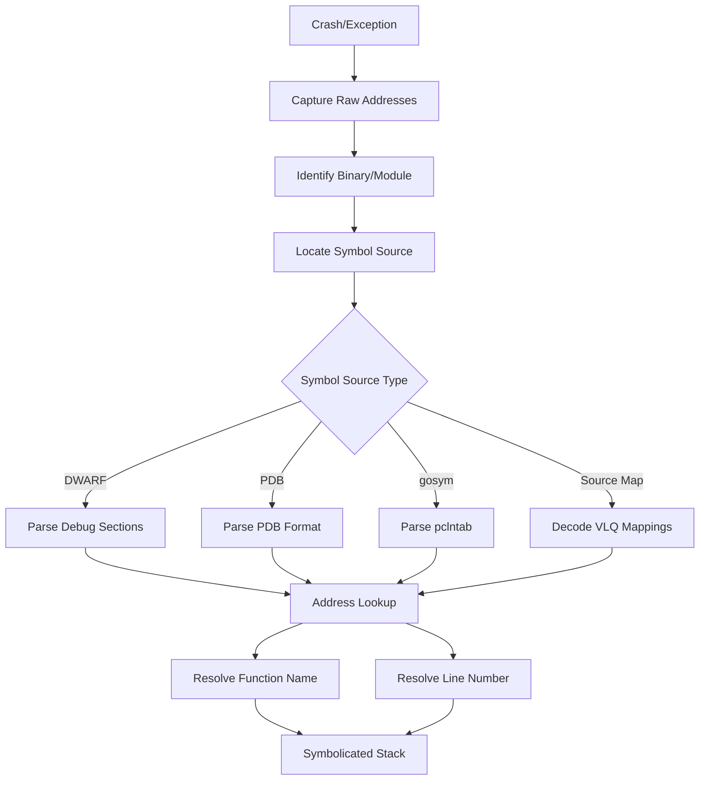
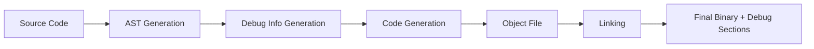
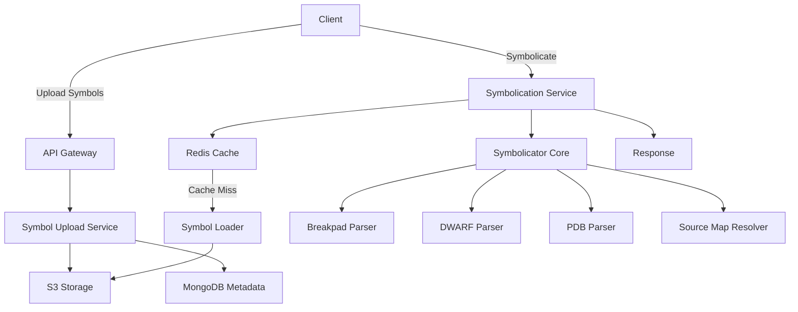

# Symbol Resolution and Symbolication Deep Dive

**Project:** Backtrace  
**Location:** `/home/darkvoid/Boxxed/@dev/repo-expolorations/backtrace/`  
**Created:** 2026-04-05  
**Purpose:** Comprehensive technical reference for implementing symbolication systems

---

## Table of Contents

1. [Symbolication Fundamentals](#1-symbolication-fundamentals)
2. [Go Symbol Resolution](#2-go-symbol-resolution)
3. [Apple Platform Symbols (dSYM)](#3-apple-platform-symbols-dsym)
4. [JavaScript Source Maps](#4-javascript-source-maps)
5. [Android Symbol Resolution](#5-android-symbol-resolution)
6. [Native Symbols (Breakpad/Crashpad)](#6-native-symbols-breakpadcrashpad)
7. [Server-Side Symbolication](#7-server-side-symbolication)
8. [Symbol Quality Comparison](#8-symbol-quality-comparison)
9. [Troubleshooting Missing Symbols](#9-troubleshooting-missing-symbols)

---

## 1. Symbolication Fundamentals

### 1.1 What is Symbolication?

**Symbolication** is the process of translating raw memory addresses (e.g., `0x00000001000012a4`) into human-readable symbols (function names, file paths, and line numbers).

```
Raw Stack Trace (Before Symbolication):
0x00000001000012a4
0x00000001000013f8
0x00007fff20345f3d

Symbolicated Stack Trace (After):
main at main.c:42
process_request at server.c:128
_start at crt0.c:0
```

#### The Symbolication Pipeline



### 1.2 Debug Symbols Overview

#### DWARF (Debugging With Attributed Record Formats)

DWARF is the standard debug format for Unix-like systems (Linux, macOS, BSD).

**DWARF Sections:**

| Section | Purpose |
|---------|---------|
| `.debug_info` | Core debugging information (types, variables, functions) |
| `.debug_abbrev` | Abbreviation tables for compact encoding |
| `.debug_line` | Source line number mappings |
| `.debug_frame` | Call frame information (unwind data) |
| `.debug_str` | String table |
| `.debug_ranges` | Address range lists |
| `.debug_loc` | Location lists for variables |
| `.debug_pubnames` | Public names index |
| `.debug_aranges` | Address range lookup |

**DWARF Entry Structure:**

```
┌─────────────────────────────────────┐
│  DW_TAG_compile_unit                │  ← Debug Information Entry (DIE)
├─────────────────────────────────────┤
│  AT_name: "main.c"                  │  ← Attributes
│  AT_low_pc: 0x400520                │
│  AT_high_pc: 0x4005f0               │
│  AT_language: DW_LANG_C11           │
├─────────────────────────────────────┤
│  DW_TAG_subprogram                  │  ← Nested DIE
│    AT_name: "main"                  │
│    AT_low_pc: 0x400530              │
│    AT_high_pc: 0x400560             │
│    AT_decl_file: "main.c"           │
│    AT_decl_line: 42                 │
└─────────────────────────────────────┘
```

#### PDB (Program Database)

PDB is Microsoft's proprietary debug format for Windows.

**PDB Structure:**

```
PDB File Header
├── MSF Superblock
├── Directory Blocks
├── Stream Directory
│   ├── Stream 0: PDB Stream
│   ├── Stream 1: DBI Stream (module info)
│   ├── Stream 2: TPI Stream (type info)
│   ├── Stream 3: IPI Stream (item info)
│   └── Stream N: Module-specific symbols
└── Hash Tables (for lookup)
```

**Key PDB Streams:**

- **DBI Stream**: Module names, source file info, section contributions
- **TPI Stream**: Type information (classes, structs, enums)
- **Symbol Records**: Function symbols, global variables, local scopes

### 1.3 How Compilers Emit Debug Info

#### GCC/Clang DWARF Emission

```bash
# Generate DWARF v5 debug info
gcc -g -gdwarf-5 -O0 program.c -o program

# Separate debug symbols
objcopy --only-keep-debug program program.debug
strip --strip-debug program

# Link external debug file
objcopy --add-gnu-debuglink=program.debug program
```

**Compilation Stages:**



#### Compiler Flags for Debug Info

| Flag | Description |
|------|-------------|
| `-g` | Generate debug info (default: DWARF) |
| `-g0` | No debug info |
| `-g1` | Minimal debug info |
| `-g2` | Standard debug info |
| `-g3` | Extended debug info (includes macros) |
| `-gsplit-dwarf` | Separate debug info into `.dwo` files |
| `-gpubnames` | Generate `.debug_pubnames` section |

### 1.4 Symbol Tables vs Debug Info

**Symbol Table (`.symtab`, `.dynsym`):**

```bash
# View symbol table
readelf -s program
```

```
Num:    Value          Size Type    Bind   Vis      Ndx Name
  1: 0000000000000000     0 SECTION LOCAL  DEFAULT    1
  2: 0000000000000000     0 FILE    LOCAL  DEFAULT  ABS main.c
  5: 0000000000400520    47 FUNC    GLOBAL DEFAULT   14 main
  6: 0000000000400550    32 FUNC    GLOBAL DEFAULT   14 process_request
```

**Key Differences:**

| Feature | Symbol Table | Debug Info (DWARF) |
|---------|-------------|-------------------|
| Function names | Yes | Yes |
| Line numbers | No | Yes |
| Variable names | Limited | Full |
| Type information | Minimal | Complete |
| Inlined functions | No | Yes |
| File paths | No | Yes |
| Size overhead | Small (~KB) | Large (~MB) |
| Strippable | Yes | Yes (separately) |

### 1.5 Address to Line Number Mapping

**DWARF `.debug_line` Format:**

```
.debug_line Section
├── Line Number Program Header
│   ├── Unit length
│   ├── DWARF version
│   ├── Header length
│   ├── Minimum instruction length
│   ├── Maximum operations per instruction
│   ├── Default IS statement
│   └── Line base, range, opcode base
├── Opcode standard lengths
├── Directory table
├── File name table
└── Bytecode program (per CU)
```

**Address Lookup Algorithm:**

```rust
fn lookup_address_line(debug_line: &DebugLine, target_addr: u64) -> Option<LineInfo> {
    let mut matrix = Vec::new();
    let mut row = LineRow::default();
    let mut addr = 0;

    for op in debug_line.bytecode {
        match op {
            Opcode::SetAddress(val) => addr = val,
            Opcode::AdvPc(val) => addr += val,
            Opcode::AdvLine(val) => row.line += val,
            Opcode::Copy => {
                matrix.push((addr, row.clone()));
            }
            Opcode::Reset => row = LineRow::default(),
            _ => handle_standard_opcode(&mut row, op),
        }
    }

    // Binary search for the address
    matrix.binary_search_by(|(a, _)| a.cmp(&target_addr))
        .ok()
        .map(|i| matrix[i].1.clone())
}
```

---

## 2. Go Symbol Resolution

### 2.1 Go Symbol Table Format (gosym)

Go binaries embed their symbol table directly in the binary via the `pclntab` section.

**pclntab Structure:**

```
┌───────────────────────────────────────┐
│  pclntab Header                        │
│  - magic: 0xfffffffb                  │
│  - pad1, pad2                         │
│  - nFunc (number of functions)        │
│  - nFiles (number of source files)    │
├───────────────────────────────────────┤
│  functionTable[nFunc]                 │
│  - entry (PC offset)                  │
│  - nameOff (offset to function name)  │
│  - args (arg size)                    │
│  - pcspOff (PC→SP delta table)        │
│  - pcfileOff (PC→file index table)    │
│  - pclnOff (PC→line number table)     │
│  - npcData, funcFlag, entryOff        │
├───────────────────────────────────────┤
│  fileTable[nFiles]                    │
│  - filename offsets                   │
├───────────────────────────────────────┤
│  String table                         │
│  - function names                     │
│  - file names                         │
└───────────────────────────────────────┘
```

**Go 1.18+ pclntab Format:**

```go
type pclntabHeader struct {
    magic     uint32  // 0xfffffffb
    pad1, pad2 uint8
    nFunc     uint64  // Number of functions
    nFiles    uint64  // Number of files
    funcStart uint64  // Offset to function table
    funcEnd   uint64  // End of function table
    fileStart uint64  // Offset to file table
    fileEnd   uint64  // End of file table
    pcHeader  pcHeader
}

type pcHeader struct {
    magic          uint32  // 0xffff00fb
    pad1, pad2     uint8
    minLC          uint8   // Minimum instruction length
    ptrSize        uint8   // Size of pointer
    nFunc          uint32
    nFiles         uint32
    funcnameOffset uintptr // Offset to function name base
    cuOffset       uintptr // Offset to compilation unit table
    filetabOffset  uintptr // Offset to file table
    pctabOffset    uintptr // Offset to PC table
    pclnOffset     uintptr // Offset to PC-ln table
}
```

### 2.2 Reading Go Symbol Tables

```go
package main

import (
    "debug/gosym"
    "debug/elf"
    "fmt"
    "os"
)

func main() {
    f, _ := elf.Open("myprogram")
    defer f.Close()

    // Extract pclntab section
    pclntab := f.Section(".gopclntab")
    symtab := f.Section(".symtab")

    // Parse symbol table
    symData, _ := symtab.Data()
    pclnData, _ := pclntab.Data()

    table, _ := gosym.NewTable(symData, gosym.NewRaw(pclnData))

    // Lookup PC address
    pc := uint64(0x4a5c21)
    sym := table.LookupPC(pc)
    fmt.Printf("Function: %s\n", sym.Name)
    fmt.Printf("File: %s:%d\n", sym.File, sym.Line(pc))
}
```

### 2.3 buildinfo Embedding

Go embeds build information directly in the binary:

```bash
# View embedded build info
go version -m myprogram
```

**Build Info Structure:**

```
buildinfo Section
├── magic: "\x00\x00\x00\x00\x00\x00\x00\x00"
├── magic2: "go1.sum\x00"
├── Go version string
├── Architecture string
├── OS string
├── Build settings (key-value pairs)
│   - -buildmode
│   - -compiler
│   - CGO_ENABLED
│   - CGO_CFLAGS
│   - vcs (git/hg/mod)
│   - vcs.time
│   - vcs.revision
└── Module dependencies (if modules used)
```

**Reading buildinfo Programmatically:**

```go
import "runtime/debug"

func printBuildInfo() {
    info, ok := debug.ReadBuildInfo()
    if !ok {
        fmt.Println("No build info available")
        return
    }

    fmt.Printf("Go Version: %s\n", info.GoVersion)
    fmt.Printf("Path: %s\n", info.Path)
    fmt.Printf("Main: %s %s\n", info.Main.Path, info.Main.Version)

    for _, dep := range info.Deps {
        fmt.Printf("  %s %s %s\n", dep.Path, dep.Version, dep.Sum)
    }
}
```

### 2.4 cgo Symbol Resolution

cgo creates hybrid Go/C binaries with complex symbol resolution:

**cgo Symbol Mapping:**

```c
// C code (Cgo.C)
void myCFunction() {
    // This will appear in stack traces
}
```

```go
// Go code
/*
void myCFunction();
*/
import "C"

func GoWrapper() {
    C.myCFunction()
}
```

**Stack Trace with cgo:**

```
goroutine 1 [running]:
main.GoWrapper()
    /path/to/main.go:15 +0x23
main._cgoexp_GoWrapper()
    _cgo_gotypes.go:45 +0x1f
runtime.cgocallbackg1(0x4d2a80, 0xc0000a8000, 0x0)
    /usr/local/go/src/runtime/cgocall.go:312 +0x123
```

**Resolving cgo Symbols:**

```bash
# Use addr2line with the binary
addr2line -e myprogram 0x4a5c21

# For C symbols, use nm
nm myprogram | grep myCFunction
```

### 2.5 go tool addr2line Integration

```bash
# Go's built-in addr2line (Go 1.13+)
go tool addr2line -e myprogram 0x4a5c21

# Output:
# main.main /path/to/main.go:42
```

**Implementing Go addr2line:**

```go
package main

import (
    "debug/elf"
    "debug/gosym"
    "flag"
    "fmt"
    "os"
    "strconv"
)

func main() {
    exe := flag.String("e", "", "executable")
    flag.Parse()

    f, _ := elf.Open(*exe)
    defer f.Close()

    pclntab := f.Section(".gopclntab")
    symtab := f.Section(".symtab")

    symData, _ := symtab.Data()
    pclnData, _ := pclntab.Data()

    table, _ := gosym.NewTable(symData, gosym.NewRaw(pclnData))

    for _, arg := range flag.Args() {
        pc, _ := strconv.ParseUint(arg, 0, 64)
        sym := table.LookupPC(pc)
        if sym != nil {
            line := sym.Line(pc)
            fmt.Printf("%s %s:%d\n", sym.Name, sym.File, line)
        }
    }
}
```

### 2.6 Stripping Symbols and Impact

```bash
# Strip all symbols (including Go pclntab)
strip myprogram

# Keep Go symbols but strip DWARF
go build -ldflags="-s -w" -o myprogram

# -s: Omit symbol table
# -w: Omit DWARF debug info
```

**Impact of Stripping:**

| Build Option | Binary Size | Stack Traces | Profiling | Panic Messages |
|-------------|-------------|--------------|-----------|----------------|
| Full debug | 100% | Full | Full | Full file:line |
| `-s` | ~30% smaller | Function only | Limited | Function only |
| `-s -w` | ~50% smaller | Function only | No | Function only |
| `strip` | ~70% smaller | Addresses only | No | Addresses only |

**Recovering Stripped Go Binaries:**

```bash
# Go binaries retain pclntab even after strip
go tool nm myprogram | head

# Extract function names
objdump -t myprogram | grep FUNC
```

---

## 3. Apple Platform Symbols (dSYM)

### 3.1 dSYM Bundle Structure

dSYM is a DWARF-in-a-directory format used by macOS and iOS.

```
MyApp.dSYM/
└── Contents/
    ├── Info.plist              # Bundle metadata
    │   ├── CFBundleIdentifier
    │   ├── DWARFFileName
    │   └── UUID
    └── Resources/
        └── DWARF/
            └── MyApp           # Actual DWARF debug info
```

**Info.plist Contents:**

```xml
<?xml version="1.0" encoding="UTF-8"?>
<!DOCTYPE plist PUBLIC "-//Apple//DTD PLIST 1.0//EN"
 "http://www.apple.com/DTDs/PropertyList-1.0.dtd">
<plist version="1.0">
<dict>
    <key>CFBundleIdentifier</key>
    <string>com.example.MyApp.dSYM</string>
    <key>CFBundleName</key>
    <string>MyApp.dSYM</string>
    <key>DWARFFileName</key>
    <string>MyApp</string>
    <key>UUID</key>
    <string>A1B2C3D4-E5F6-7890-ABCD-EF1234567890</string>
</dict>
</plist>
```

### 3.2 DWARF Format Inside dSYM

The DWARF file inside dSYM follows standard DWARF format with Apple extensions.

**Reading dSYM DWARF:**

```bash
# Inspect dSYM contents
dwarfdump MyApp.dSYM

# Output example:
# UUID: A1B2C3D4-E5F6-7890-ABCD-EF1234567890 (arm64)
# ----------------------------------------------------------------------
# FILE: /Users/dev/MyApp/MyApp/main.swift
# Line table for compile unit: 0x0000000000000053
#
# Address            Line     Column    File    IS
# ------------------ -------- --------- ------- --
# 0x000000010000094c 1        1         1       1   // main.swift:1:1
# 0x0000000100000950 2        5         1       1   // main.swift:2:5
```

**DWARF Sections in dSYM:**

| Section | Size (typical) | Purpose |
|---------|---------------|---------|
| __debug_info | 40% | Debug information entries |
| __debug_line | 25% | Line number mappings |
| __debug_frame | 15% | Call frame information |
| __debug_str | 10% | String table |
| __debug_abbrev | 5% | Abbreviation declarations |
| Other | 5% | Ranges, loc, pubnames |

### 3.3 UUID Matching (Binary vs dSYM)

**Finding UUID in Binary:**

```bash
# Get UUID from binary
dscextract --uuid MyApp

# Or use:
xcrun dsymutil -dump_debug_map MyApp

# Output:
# === UUID:
#    UUID: A1B2C3D4-E5F6-7890-ABCD-EF1234567890 (x86_64)
#    Path: MyApp
#    UUID: B2C3D4E5-F6A7-8901-BCDE-F23456789012 (arm64)
#    Path: MyApp
```

**Finding UUID in dSYM:**

```bash
# Get UUID from dSYM
dwarfdump --uuid MyApp.dSYM

# Output:
# UUID: A1B2C3D4-E5F6-7890-ABCD-EF1234567890 (x86_64)
#       MyApp.dSYM/Contents/Resources/DWARF/MyApp
```

**Programmatic UUID Matching:**

```swift
import MachO
import Foundation

func getBinaryUUID() -> UUID? {
    let header = _dyld_get_image_header(0)
    guard let uuidCmd = getUuidCommand(header) else { return nil }
    return UUID(uuid: uuidCmd.uuid)
}

func getUuidCommand(_ header: UnsafePointer<mach_header_64>) -> UnsafePointer<uuid_command>? {
    var loadCmds = UnsafeRawPointer(header).advanced(by: MemoryLayout<mach_header_64>.stride)
    
    for _ in 0..<Int(header.pointee.ncmds) {
        let cmd = loadCmds.load(as: load_command.self)
        if cmd.cmd == LC_UUID {
            return loadCmds.bindMemory(to: uuid_command.self, capacity: 1)
        }
        loadCmds = loadCmds.advanced(by: Int(cmd.cmdsize))
    }
    return nil
}
```

### 3.4 dsymutil Workflow

**Creating dSYM:**

```bash
# Generate dSYM from binary
xcrun dsymutil MyApp -o MyApp.dSYM

# Generate dSYM with specific architecture
xcrun dsymutil -arch arm64 MyApp -o MyApp-arm64.dSYM

# Verify dSYM
xcrun dsymutil -verify MyApp.dSYM
```

**dsymutil Options:**

| Option | Description |
|--------|-------------|
| `-o <path>` | Output dSYM path |
| `-arch <arch>` | Specific architecture |
| `-verify` | Verify dSYM integrity |
| `-dump_debug_map` | Show debug map |
| `-symbol-map` | Create symbol mapping file |
| `-flat` | Create flat dSYM (single file) |
| `-no-uuid` | Don't add UUID to dSYM |

**Symbol Map Generation:**

```bash
# Generate symbol map
xcrun dsymutil -symbol-map ./symbols MyApp

# Creates:
# ./symbols/
#   A1B2C3D4-E5F6-7890-ABCD-EF1234567890.symbols
```

### 3.5 Xcode Build Integration

**Xcode Build Settings for dSYM:**

```
# Project.pbxproj settings
GCC_GENERATE_DEBUGGING_SYMBOLS = YES;
DEAD_CODE_STRIPPING = NO;
DEBUG_INFORMATION_FORMAT = "dwarf-with-dsym";
SEPARATE_DWARF = YES;
```

**Build Phase Script:**

```bash
#!/bin/bash
# Post-build script to upload dSYM

DSYM_PATH="${DWARF_DSYM_FOLDER_PATH}/${DWARF_DSYM_FILE_NAME}"
UUID="${DWARF_DSYM_UUID}"

# Upload to symbol server
curl -X POST \
  -F "uuid=${UUID}" \
  -F "dsym=@${DSYM_PATH}" \
  https://symbols.example.com/upload
```

### 3.6 Bitcode and Symbols

**Bitcode Impact on Symbolication:**

When Bitcode is enabled, the App Store recompiles your binary, requiring new dSYM.

**Retrieving Bitcode dSYM:**

```bash
# Download dSYM from App Store Connect
xcrun altool \
  --download-dsym \
  --bundle-id com.example.app \
  --platform ios \
  --output-path ./downloaded-dsyms
```

**Bitcode Build Settings:**

```
ENABLE_BITCODE = YES;          # Enable bitcode
BITCODE_GENERATION_MODE = bitcode;
ONLY_ACTIVE_ARCH = NO;
```

### 3.7 arm64e Pointer Authentication

**Pointer Authentication Codes (PAC):**

arm64e uses pointer authentication, which affects symbolication.

```
┌───────────────────────────────────────┐
│  64-bit Pointer with PAC              │
├───────────────────────────────────────┤
│  Bits 63-55: PAC (9 bits)             │
│  Bit 54: Key indicator (1 bit)        │
│  Bits 53-0: Actual address (54 bits)  │
└───────────────────────────────────────┘
```

**Stripping PAC for Symbolication:**

```c
// Strip PAC from pointer
static inline uintptr_t strip_pac(uintptr_t ptr) {
    #if __arm64e__
    return ptr & 0x00ffffffffffffff;  // Mask out PAC bits
    #else
    return ptr;
    #endif
}
```

**LLDB PAC Handling:**

```bash
# LLDB automatically strips PAC
lldb MyApp
(lldb) register read x0
x0 = 0x00000001000012a4

# Manual PAC strip
(lldb) p/x $x0 & 0x00ffffffffffffff
```

---

## 4. JavaScript Source Maps

### 4.1 Source Map v3 Format Specification

**Source Map Structure:**

```json
{
  "version": 3,
  "file": "bundle.min.js",
  "sourceRoot": "https://example.com/src/",
  "sources": ["main.ts", "utils.ts", "components/App.tsx"],
  "sourcesContent": ["// Original source...", null, null],
  "names": ["main", "processRequest", "App", "render", "useState"],
  "mappings": "AAAA,SAASA,MAAT,QAAyB;AACzBC,EAAAA,WAAW,EAAE;AACbC,EAAAA,OAAO",
  "x_google_ignoreList": [1],
  "x_facebook_sourceURLs": ["main.ts"]
}
```

**Required Fields:**

| Field | Type | Description |
|-------|------|-------------|
| `version` | number | Must be 3 |
| `sources` | [string] | Original source file paths |
| `mappings` | string | VLQ-encoded mappings |

**Optional Fields:**

| Field | Type | Description |
|-------|------|-------------|
| `file` | string | Generated file name |
| `sourceRoot` | string | Base path for sources |
| `sourcesContent` | [string] | Inline source content |
| `names` | [string] | Variable/function names |

### 4.2 VLQ Encoding Explained

VLQ (Variable-Length Quantity) encodes integers as base-64 strings.

**VLQ Bit Structure:**

```
┌───────────────────────────────────────┐
│  VLQ Byte Structure                   │
├───────────────────────────────────────┤
│  Bit 7: Continuation flag (1=more)   │
│  Bit 6: Sign flag (1=negative)       │
│  Bits 5-0: Value (6 bits)            │
└───────────────────────────────────────┘
```

**VLQ Encoding Table:**

| Value | Binary | VLQ | Base64 |
|-------|--------|-----|--------|
| 0 | 000000 | 000000 | A |
| 1 | 000001 | 000010 | C |
| 2 | 000010 | 000100 | G |
| 3 | 000011 | 000110 | I |
| -1 | 000001 | 100010 | g |
| -2 | 000010 | 100100 | k |
| 16 | 010000 | 100000 | w |
| 32 | 100000 | 0100000 | 2A |

**VLQ Encoding Algorithm:**

```javascript
const BASE64_CHARS = 'ABCDEFGHIJKLMNOPQRSTUVWXYZabcdefghijklmnopqrstuvwxyz0123456789+/';

function vlqEncode(num) {
    let result = '';
    
    // Handle negative numbers
    let isNegative = num < 0;
    if (isNegative) num = -num;
    
    // Encode the number
    do {
        let digit = num & 0xF;  // Get lowest 4 bits
        num >>= 4;
        
        // If more digits, set continuation bit
        if (num > 0) digit |= 0x10;
        
        // Add sign bit for first digit
        if (isNegative) digit |= 0x20;
        
        result += BASE64_CHARS[digit];
        isNegative = false;  // Sign only on first digit
    } while (num > 0);
    
    return result;
}

function vlqDecode(str) {
    let result = 0;
    let shift = 0;
    let isNegative = false;
    
    for (const char of str) {
        const digit = BASE64_CHARS.indexOf(char);
        
        // Extract sign from first digit
        if (shift === 0) {
            isNegative = (digit & 0x20) !== 0;
        }
        
        result |= (digit & 0x0F) << shift;
        shift += 4;
        
        // Check continuation bit
        if ((digit & 0x10) === 0) break;
    }
    
    return isNegative ? -result : result;
}
```

**Mapping String Decoding:**

```javascript
function decodeMappings(mappings) {
    const result = [];
    let decoded = [];
    let column = 0;
    let source = 0;
    let line = 0;
    let name = 0;
    
    const segments = mappings.split(';');
    for (let i = 0; i < segments.length; i++) {
        const lineSegments = [];
        const segmentGroups = segments[i].split(',');
        
        for (const segment of segmentGroups) {
            if (segment.length === 0) continue;
            
            const values = [];
            let columnDelta = vlqDecode(segment);
            values.push(column += columnDelta);
            
            if (segment.length > 1) {
                values.push(source += vlqDecode(segment.slice(values.length)));
                values.push(line += vlqDecode(segment.slice(values.length)));
                values.push(name += vlqDecode(segment.slice(values.length)));
            }
            
            lineSegments.push(values);
        }
        
        result.push(lineSegments);
    }
    
    return result;
}
```

### 4.3 Names, Sources, Mappings, sourcesContent

**Mapping Segment Structure:**

Each segment in the mappings array is:

```
[column, sourceIndex, sourceLine, sourceColumn, nameIndex?]
```

**Example Mapping:**

```javascript
// Source: ["app.ts", "utils.ts"]
// Names: ["main", "helper"]
// Generated line 0:
//   Segment 0: [0, 0, 0, 0]  // col 0 → app.ts line 0 col 0
//   Segment 1: [10, 1, 5, 2] // col 10 → utils.ts line 5 col 2
//   Segment 2: [25, 0, 1, 0, 1] // col 25 → app.ts line 1 col 0, name "helper"
```

**sourcesContent Usage:**

```json
{
  "version": 3,
  "sources": ["main.ts"],
  "sourcesContent": [
    "export function main() {\n  console.log('Hello');\n}\n"
  ],
  "mappings": "AAAA,SAAS,GAAG"
}
```

### 4.4 Inline Source Maps (data: URLs)

**Inline Source Map Format:**

```javascript
// bundle.min.js
(function(){...})();// Original code

//# sourceMappingURL=data:application/json;base64,eyJ2ZXJzaW9uIjozLCJzb3VyY2VzIjpbIm1haW4udHMiXSwibmFtZXMiOltdLCJtYXBwaW5ncyI6IkFBQUEifQ==
```

**Decoding Inline Source Maps:**

```javascript
function extractInlineSourceMap(code) {
    const regex = /\/\/# sourceMappingURL=data:application\/json;base64,([^\n]+)/;
    const match = code.match(regex);
    
    if (match) {
        const base64 = match[1];
        const json = Buffer.from(base64, 'base64').toString('utf8');
        return JSON.parse(json);
    }
    
    return null;
}
```

**Regex Source Map (for CSS):**

```css
/* bundle.css */
.body{margin:0}

/*# sourceMappingURL=data:application/json;base64,... */
```

### 4.5 Webpack/Rollup/Vite Source Map Generation

**Webpack Configuration:**

```javascript
// webpack.config.js
module.exports = {
    devtool: 'source-map',  // or:
    // devtool: 'eval-source-map'
    // devtool: 'cheap-module-source-map'
    // devtool: 'hidden-source-map'
    // devtool: 'nosources-source-map'
    
    output: {
        filename: 'bundle.[contenthash].js',
        sourceMapFilename: 'bundle.[contenthash].js.map',
    },
};
```

**Webpack devtool Options:**

| Value | Build Speed | Quality | Hidden Sources | No Sources |
|-------|------------|---------|----------------|------------|
| `source-map` | Slowest | Full | No | No |
| `eval-source-map` | Medium | Full | No | No |
| `cheap-module-source-map` | Fast | Line only | No | No |
| `hidden-source-map` | Slow | Full | Yes | No |
| `nosources-source-map` | Slow | Full | No | Yes |

**Rollup Configuration:**

```javascript
// rollup.config.js
export default {
    input: 'src/main.js',
    output: {
        file: 'dist/bundle.js',
        format: 'es',
        sourcemap: true,
        sourcemapPathTransform: (relativePath) => {
            // Transform source paths
            return relativePath.replace('src/', 'app://');
        }
    },
    plugins: [
        // Source map plugins
    ]
};
```

**Vite Configuration:**

```typescript
// vite.config.ts
export default defineConfig({
    build: {
        sourcemap: true,  // or 'inline'
        rollupOptions: {
            output: {
                sourcemapIgnoreList: (relativePath) => {
                    return relativePath.includes('node_modules');
                }
            }
        }
    },
    server: {
        sourcemapIgnoreList: (relativePath) => {
            return relativePath.includes('node_modules');
        }
    }
});
```

### 4.6 webpack-source-map Package Internals

**Source Map Concatenation:**

```javascript
// webpack/lib/SourceMapDevToolPlugin.js
const { SourceMapGenerator } = require('source-map');

class SourceMapDevToolPlugin {
    apply(compiler) {
        compiler.hooks.compilation.tap('SourceMapDevToolPlugin', (compilation) => {
            compilation.hooks.afterOptimizeChunkAssets.tap(
                'SourceMapDevToolPlugin',
                (chunks) => {
                    for (const chunk of chunks) {
                        for (const file of chunk.files) {
                            this.generateSourceMap(compilation, file);
                        }
                    }
                }
            );
        });
    }
    
    generateSourceMap(compilation, file) {
        const source = compilation.assets[file];
        const sourceMap = source.map();
        
        const generator = new SourceMapGenerator({
            file: file,
            sourceRoot: this.sourceRoot
        });
        
        sourceMap.sources.forEach((sourceFile, i) => {
            generator.addSource({
                name: sourceFile,
                sourceContent: sourceMap.sourcesContent?.[i]
            });
        });
        
        // Apply mappings
        sourceMap.mappings.split(';').forEach((line, lineIndex) => {
            line.split(',').forEach(segment => {
                if (segment.length > 0) {
                    // Parse VLQ segments and add to generator
                }
            });
        });
        
        compilation.assets[file + '.map'] = {
            source: () => generator.toString(),
            size: () => generator.toString().length
        };
    }
}
```

### 4.7 Mozilla source-map Library

**Installation:**

```bash
npm install source-map
```

**Usage:**

```javascript
const sourceMap = require('source-map');

// Create a SourceMapConsumer
async function consumeSourceMap(mapUrl) {
    const response = await fetch(mapUrl);
    const rawMap = await response.json();
    
    const consumer = await new sourceMap.SourceMapConsumer(rawMap);
    
    // Look up original position
    const original = consumer.originalPositionFor({
        line: 42,
        column: 15
    });
    
    console.log(original);
    // { source: 'app.ts', line: 10, column: 5, name: 'myFunction' }
    
    // Look up generated position
    const generated = consumer.generatedPositionFor({
        source: 'app.ts',
        line: 10,
        column: 5
    });
    
    consumer.destroy();
}

// Create a SourceMapGenerator
function generateSourceMap() {
    const generator = new sourceMap.SourceMapGenerator({
        file: 'bundle.js',
        sourceRoot: 'https://example.com/src/'
    });
    
    generator.addMapping({
        generated: { line: 1, column: 0 },
        original: { line: 1, column: 0 },
        source: 'main.ts',
        name: 'main'
    });
    
    generator.addSource('main.ts');
    generator.setSourceContent('main.ts', 'export function main() {}');
    
    return generator.toString();
}
```

**SourceMapConsumer API:**

```javascript
class SourceMapConsumer {
    // Look up original position from generated
    originalPositionFor(generatedPosition): { source, line, column, name }
    
    // Look up generated position from original
    generatedPositionFor(originalPosition): { line, column }
    
    // Get all sources for a generated line
    allGeneratedPositionsFor(originalPosition): [{ line, column }]
    
    // Get source content
    sourceContentFor(source): string
    
    // Iterate over mappings
    eachMapping(callback, context, order)
    
    // Clean up resources
    destroy()
}
```

---

## 5. Android Symbol Resolution

### 5.1 ProGuard/R8 Mapping Files

**ProGuard Mapping File Format:**

```
# mapping.txt
com.example.MyClass -> a.a:
    int myField -> a
    void myMethod() -> a
    java.lang.String processRequest(java.lang.String) -> a
com.example.Utils -> a.b:
    10:15:void helper() -> a
```

**Line Number Mapping:**

```
# mapping.txt with line numbers
com.example.MyClass -> a.a:
    10:12:int getValue() -> a
    # Lines 10-12 in MyClass.java → method 'a' in a.a
```

**Reading Mapping Files:**

```java
public class MappingParser {
    public static Map<String, ClassMapping> parseMappingFile(File mappingFile) 
            throws IOException {
        Map<String, ClassMapping> mappings = new HashMap<>();
        ClassMapping currentClass = null;
        
        try (BufferedReader reader = new BufferedReader(
                new FileReader(mappingFile))) {
            String line;
            while ((line = reader.readLine()) != null) {
                if (line.startsWith("#") || line.isEmpty()) continue;
                
                if (line.contains("->") && !line.contains(":")) {
                    // Class mapping
                    String[] parts = line.split(" -> ");
                    currentClass = new ClassMapping(
                        parts[0].trim(),
                        parts[1].replace(":", "").trim()
                    );
                    mappings.put(currentClass.obfuscated, currentClass);
                } else if (currentClass != null && line.contains("->")) {
                    // Method/field mapping
                    String[] parts = line.split(" -> ");
                    String member = parts[0].trim();
                    String obfuscated = parts[1].trim();
                    currentClass.addMember(member, obfuscated);
                }
            }
        }
        
        return mappings;
    }
}
```

### 5.2 retrace Tool Workflow

**Using retrace:**

```bash
# Basic stack trace deobfuscation
retrace mapping.txt obfuscated_stacktrace.txt

# With verbose output
retrace -verbose mapping.txt obfuscated_stacktrace.txt

# Interactive mode
retrace -interactive mapping.txt
```

**Obfuscated Stack Trace:**

```
java.lang.NullPointerException
    at a.a.a(Unknown Source)
    at a.b.b(Unknown Source:2)
    at com.example.MainActivity.onCreate(Unknown Source:15)
```

**Deobfuscated Output:**

```
java.lang.NullPointerException
    at com.example.MyClass.myMethod(MyClass.java:42)
    at com.example.Utils.helper(Utils.java:15)
    at com.example.MainActivity.onCreate(MainActivity.java:28)
```

**Programmatic Retracing:**

```java
import com.android.tools.r8.retrace.MappingFile;
import com.android.tools.r8.retrace.Retrace;

public class RetraceExample {
    public static String retraceStackTrace(
            File mappingFile, 
            String obfuscatedTrace) {
        
        MappingFile mapping = MappingFile.parse(mappingFile);
        Retrace retracer = new Retrace(mapping);
        
        return retracer.retrace(obfuscatedTrace);
    }
}
```

### 5.3 Native Symbol Resolution (objdump, addr2line)

**Android NDK Symbol Resolution:**

```bash
# Using addr2line with Android NDK
$ANDROID_NDK/toolchains/llvm/prebuilt/linux-x86_64/bin/llvm-addr2line \
    -e lib/mylib.so \
    0x1234 0x5678

# Using readelf for symbol table
readelf -s lib/mylib.so | grep FUNC

# Using objdump for disassembly with symbols
objdump -d -S lib/mylib.so > disassembly.txt
```

**Automated Native Stack Trace Resolution:**

```bash
#!/bin/bash
# resolve_android_stack.sh

SO_FILE=$1
STACK_TRACE=$2

while read -r line; do
    if [[ $line =~ 0x([0-9a-fA-F]+) ]]; then
        addr="0x${BASH_REMATCH[1]}"
        result=$(addr2line -e "$SO_FILE" "$addr" 2>/dev/null)
        echo "$line → $result"
    else
        echo "$line"
    fi
done < "$STACK_TRACE"
```

### 5.4 ELF Symbol Tables

**Android ELF Structure:**

```
ELF Header
├── Program Headers (LOAD, DYNAMIC, etc.)
├── .dynsym (Dynamic Symbol Table)
│   └── Exported symbols for linking
├── .dynstr (Dynamic String Table)
├── .symtab (Full Symbol Table - stripped in release)
├── .strtab (String Table)
├── .debug_* sections (DWARF - stripped in release)
└── Section Headers
```

**Reading ELF Symbols:**

```python
from elftools.elf.elffile import ELFFile

def read_elf_symbols(filepath):
    with open(filepath, 'rb') as f:
        elffile = ELFFile(f)
        
        # Get symbol table
        symtab = elffile.get_section_by_name('.symtab')
        if symtab is None:
            print("No symbol table (stripped)")
            return
        
        for symbol in symtab.iter_symbols():
            if symbol['st_info']['type'] == 'STT_FUNC':
                print(f"{symbol.name}: 0x{symbol['st_value']:x}")

# Usage
read_elf_symbols('lib/mylib.so')
```

### 5.5 Android NDK Debug Symbols

**Building with Debug Symbols:**

```makefile
# Android.mk
LOCAL_PATH := $(call my-dir)

include $(CLEAR_VARS)
LOCAL_MODULE := mylib
LOCAL_SRC_FILES := mylib.cpp

# Enable debug symbols
LOCAL_CFLAGS += -g -O0
LOCAL_CPPFLAGS += -g -O0

# Generate separate debug symbols
LOCAL_STRIP_MODULE := false

include $(BUILD_SHARED_LIBRARY)
```

**CMake Configuration:**

```cmake
# CMakeLists.txt
cmake_minimum_required(VERSION 3.4.1)

project(mylib)

# Debug build type
set(CMAKE_BUILD_TYPE Debug)

# Add debug flags
set(CMAKE_C_FLAGS_DEBUG "${CMAKE_C_FLAGS_DEBUG} -g3 -O0")
set(CMAKE_CXX_FLAGS_DEBUG "${CMAKE_CXX_FLAGS_DEBUG} -g3 -O0")

add_library(mylib SHARED mylib.cpp)

# Keep symbols
set_target_properties(mylib PROPERTIES LINK_FLAGS_RELEASE "-Wl,--no-strip-all")
```

**Separate Debug File:**

```bash
# Extract debug symbols
$ANDROID_NDK/toolchains/llvm/prebuilt/linux-x86_64/bin/llvm-objcopy \
    --only-keep-debug lib/mylib.so lib/mylib.so.debug

# Strip original
$ANDROID_NDK/toolchains/llvm/prebuilt/linux-x86_64/bin/llvm-strip \
    --strip-debug lib/mylib.so

# Add debug link
$ANDROID_NDK/toolchains/llvm/prebuilt/linux-x86_64/bin/llvm-objcopy \
    --add-gnu-debuglink=lib/mylib.so.debug lib/mylib.so
```

---

## 6. Native Symbols (Breakpad/Crashpad)

### 6.1 Linux: ELF Symbols, Separate Debug Files

**Breakpad Symbol File Format:**

```
MODULE Linux x86_64 A1B2C3D4E5F67890ABCDEF1234567890 app
INFO CODE_URL https://example.com/app
FILE 1 /home/user/app/main.c
FILE 2 /home/user/app/utils.c
PUBLIC 1000 0 main
PUBLIC 1040 0 process_request
STACK CFI INIT 1000 100 .cfa: $rsp 8 + .ra: .cfa 8 - ^
STACK CFI 1010: .cfa: $rsp 8 + .ra: .cfa 8 - ^
FUNC 1000 50 10 main
1000 10 10 1
1010 20 15 1
1030 20 5 2
END
```

**Breakpad Module Header:**

```
MODULE <OS> <Architecture> <UUID> <Name>
```

| Field | Description |
|-------|-------------|
| OS | Linux, Windows, Mac, Android |
| Architecture | x86, x86_64, arm, arm64 |
| UUID | Build ID (40 hex chars) |
| Name | Module name |

**STACK CFI Format:**

```
STACK CFI INIT <start> <size> <rules>
STACK CFI <offset>: <rules>
```

**Rules:**

| Rule | Description |
|------|-------------|
| `.cfa: <expr>` | Canonical Frame Address |
| `.ra: <expr>` | Return Address |
| `<reg>: <expr>` | Register recovery |

**dump_syms Tool:**

```bash
# Generate Breakpad symbols
dump_syms ./app > app.sym

# Or use minidump-stackwalk
minidump-stackwalk --dump-json ./core.dump ./app.sym
```

### 6.2 Windows: PDB Format, DIA SDK

**Reading PDB with DIA:**

```cpp
#include <dia2.h>

void readPDBSymbols(const wchar_t* pdbPath) {
    IDiaDataSource* dataSource = nullptr;
    CoInitialize(NULL);
    CoCreateInstance(CLSID_DiaSource, NULL, CLSCTX_INPROC_SERVER, 
                     IID_IDiaDataSource, (void**)&dataSource);
    
    dataSource->loadDataFromPdb(pdbPath);
    
    IDiaSession* session = nullptr;
    dataSource->openSession(&session);
    
    IDiaSymbol* globalSymbol = nullptr;
    session->get_globalScope(&globalSymbol);
    
    // Enumerate functions
    IDiaEnumSymbols* symbols = nullptr;
    globalSymbol->findChildren(SymTagFunction, NULL, nsNone, &symbols);
    
    IDiaSymbol* symbol = nullptr;
    while (symbols->next(1, &symbol, nullptr) == S_OK) {
        BSTR name;
        symbol->get_name(&name);
        
        DWORD address;
        symbol->get_addressOffset(&address);
        
        wprintf(L"%s: 0x%x\n", name, address);
        
        SysFreeString(name);
        symbol->Release();
    }
    
    symbols->Release();
    globalSymbol->Release();
    session->Release();
    dataSource->Release();
}
```

**PDB Stream Structure:**

```
PDB File
├── MSF Header
│   ├── Signature: "Microsoft C/C++ MSF 7.00\r\n"
│   ├── Block size
│   ├── Free block map
│   └── Number of blocks
├── Directory
├── Stream 0: PDB Stream
│   ├── Version
│   ├── Signature (GUID)
│   ├── Age
│   └── Named stream mapping
├── Stream 1: DBI Stream
│   ├── Version
│   ├── Age
│   ├── Module stream indices
│   └── Section contributions
├── Stream 2: TPI Stream (Type Info)
├── Stream 3: IPI Stream (Item Info)
└── Stream N: Module streams
```

### 6.3 Symbol Servers (symstore, symbolicator)

**Microsoft Symbol Server Structure:**

```
\\symbols\
├── app.pdb\
│   ├── A1B2C3D4E5F6...\
│   │   └── app.pdb
│   └── B2C3D4E5F6A7...\
│       └── app.pdb
└── kernel32.pdb\
    └── ...
```

**symstore Usage:**

```cmd
REM Add symbols to symbol store
symstore add /f app.pdb /s \\symbols\ /t MyApp

REM Add with recursive search
symstore add /r /f *.pdb /s \\symbols\ /t MyApp

REM Delete from store
symstore delete /id MyApp /s \\symbols\
```

**Symbol Server HTTP Format:**

```
GET /symbols/app.pdb/A1B2C3D4E5F67890ABCDEF12345678901/app.pdb
Host: symbolserver.example.com

HTTP/1.1 200 OK
Content-Type: application/octet-stream
Content-Length: 1234567

[binary PDB data]
```

**Symbol Path Format:**

```
SRV*c:\symbols*https://msdl.microsoft.com/download/symbols
```

### 6.4 HTTP Symbol Fetching

**Symbol Download Client:**

```rust
use reqwest;
use sha2::{Sha256, Digest};

struct SymbolDownloader {
    base_url: String,
    cache_dir: PathBuf,
}

impl SymbolDownloader {
    async fn download_symbol(&self, module: &str, debug_id: &str) -> Result<PathBuf> {
        let filename = format!("{}.breakpad", module);
        let cache_path = self.cache_dir.join(module).join(debug_id).join(&filename);
        
        // Check cache first
        if cache_path.exists() {
            return Ok(cache_path);
        }
        
        // Construct symbol server URL
        let url = format!("{}/{}/{}/{}", 
            self.base_url, module, debug_id, filename);
        
        let response = reqwest::get(&url).await?;
        if !response.status().is_success() {
            return Err(Error::NotFound);
        }
        
        // Create directories and save
        fs::create_dir_all(cache_path.parent().unwrap())?;
        fs::write(&cache_path, response.bytes().await?)?;
        
        Ok(cache_path)
    }
}
```

**Breakpad Symbol Server Protocol:**

```
GET /<module_name>/<debug_id>/<module_name>.breakpad
Accept: text/plain

MODULE <OS> <arch> <debug_id> <name>
...
```

### 6.5 Caching Strategies

**Multi-Level Cache:**

```
┌─────────────────────────────────────────┐
│  Memory Cache (LRU, ~100MB)             │
│  - Recently used symbols                │
│  - Hot paths: stack walking             │
├─────────────────────────────────────────┤
│  Local Disk Cache (~10GB)               │
│  - ~/.cache/symbols                     │
│  - LRU eviction                         │
├─────────────────────────────────────────┤
│  Remote Cache (S3/CDN)                  │
│  - Shared across instances              │
│  - Pre-populated for known builds       │
└─────────────────────────────────────────┘
```

**Cache Key Structure:**

```rust
fn generate_cache_key(module: &str, debug_id: &str) -> String {
    format!("{}/{}", 
        module.replace('/', "_"),
        debug_id.to_lowercase()
    )
}

// Example: "app/A1B2C3D4E5F67890ABCDEF12345678901"
```

**Cache Metadata:**

```json
{
  "key": "app/A1B2C3D4E5F67890",
  "module": "app",
  "debug_id": "A1B2C3D4E5F67890",
  "size": 1234567,
  "created_at": "2026-04-05T10:30:00Z",
  "last_accessed": "2026-04-05T14:22:00Z",
  "access_count": 42,
  "source": "http://symbols.example.com"
}
```

---

## 7. Server-Side Symbolication

### 7.1 Symbol Upload APIs

**Symbol Upload API Design:**

```rust
// POST /api/v1/symbols
// Content-Type: multipart/form-data

pub struct SymbolUploadRequest {
    pub platform: String,        // "linux", "windows", "macos", "android"
    pub module_name: String,     // "app", "libmylib.so"
    pub debug_id: String,        // Build ID or UUID
    pub debug_file: String,      // "app.pdb", "app.sym"
    #[multipart(file)]
    pub symbol_file: File,       // Breakpad .sym or raw debug file
}

// Response
pub struct SymbolUploadResponse {
    pub id: String,
    pub status: String,          // "uploaded", "processed", "error"
    pub message: Option<String>,
}
```

**Symbol Upload Implementation:**

```rust
use axum::{extract::Multipart, http::StatusCode, Json};
use sha2::{Sha256, Digest};

async fn upload_symbols(
    mut multipart: Multipart,
    symbols: SymbolStore,
) -> Result<Json<SymbolUploadResponse>, StatusCode> {
    let mut module_name = String::new();
    let mut debug_id = String::new();
    let mut platform = String::new();
    let mut symbol_data = Vec::new();
    
    while let Some(field) = multipart.next_field().await.unwrap() {
        match field.name() {
            Some("module_name") => module_name = field.text().await.unwrap(),
            Some("debug_id") => debug_id = field.text().await.unwrap(),
            Some("platform") => platform = field.text().await.unwrap(),
            Some("symbol_file") => symbol_data = field.bytes().await.unwrap().to_vec(),
            _ => {}
        }
    }
    
    // Validate
    if module_name.is_empty() || debug_id.is_empty() {
        return Err(StatusCode::BAD_REQUEST);
    }
    
    // Calculate hash for deduplication
    let hash = Sha256::digest(&symbol_data);
    
    // Store symbol
    let key = format!("{}/{}/{}", platform, module_name, debug_id);
    symbols.store(&key, &symbol_data).await
        .map_err(|_| StatusCode::INTERNAL_SERVER_ERROR)?;
    
    Ok(Json(SymbolUploadResponse {
        id: format!("{:x}", hash),
        status: "uploaded".to_string(),
        message: None,
    }))
}
```

### 7.2 Symbol Storage (MongoDB, S3)

**S3 Storage Layout:**

```
s3://symbols-bucket/
├── linux/
│   └── app/
│       ├── A1B2C3D4E5F67890/
│       │   ├── symbols.sym
│       │   └── metadata.json
│       └── B2C3D4E5F6A78901/
│           └── ...
├── windows/
│   └── app.pdb/
│       └── ...
└── android/
    └── libmylib.so/
        └── ...
```

**S3 Symbol Store:**

```rust
use aws_sdk_s3::{Client, types::PutObjectInput};

pub struct S3SymbolStore {
    client: Client,
    bucket: String,
}

impl S3SymbolStore {
    pub async fn store(&self, key: &str, data: &[u8]) -> Result<()> {
        let parts: Vec<&str> = key.split('/').collect();
        let platform = parts[0];
        let module = parts[1];
        let debug_id = parts[2];
        
        self.client.put_object()
            .bucket(&self.bucket)
            .key(format!("{}/{}/{}/symbols.sym", platform, module, debug_id))
            .body(data.to_vec().into())
            .content_type("text/plain")
            .send()
            .await?;
        
        Ok(())
    }
    
    pub async fn retrieve(&self, platform: &str, module: &str, debug_id: &str) 
            -> Result<Vec<u8>> {
        let response = self.client.get_object()
            .bucket(&self.bucket)
            .key(format!("{}/{}/{}/symbols.sym", platform, module, debug_id))
            .send()
            .await?;
        
        Ok(response.body.collect().await?.into_bytes().to_vec())
    }
}
```

**MongoDB Metadata Storage:**

```rust
use mongodb::{Client, Collection, bson::{doc, Document}};

pub struct SymbolMetadata {
    pub platform: String,
    pub module_name: String,
    pub debug_id: String,
    pub debug_file: String,
    pub size: i64,
    pub uploaded_at: chrono::DateTime<chrono::Utc>,
    pub uploaded_by: String,
    pub checksum: String,
}

impl SymbolMetadataStore {
    pub async fn insert(&self, metadata: SymbolMetadata) -> Result<()> {
        let collection: Collection<Document> = 
            self.db.collection("symbol_metadata");
        
        collection.insert_one(doc! {
            "platform": &metadata.platform,
            "module_name": &metadata.module_name,
            "debug_id": &metadata.debug_id,
            "debug_file": &metadata.debug_file,
            "size": metadata.size,
            "uploaded_at": metadata.uploaded_at,
            "uploaded_by": &metadata.uploaded_by,
            "checksum": &metadata.checksum,
        }).await?;
        
        Ok(())
    }
    
    pub async fn find(&self, platform: &str, module: &str, debug_id: &str) 
            -> Result<Option<SymbolMetadata>> {
        let collection: Collection<Document> = 
            self.db.collection("symbol_metadata");
        
        let result = collection.find_one(doc! {
            "platform": platform,
            "module_name": module,
            "debug_id": debug_id,
        }).await?;
        
        Ok(result.map(|doc| SymbolMetadata {
            platform: doc.get_str("platform").unwrap().to_string(),
            module_name: doc.get_str("module_name").unwrap().to_string(),
            debug_id: doc.get_str("debug_id").unwrap().to_string(),
            debug_file: doc.get_str("debug_file").unwrap().to_string(),
            size: doc.get_i64("size").unwrap(),
            uploaded_at: doc.get_datetime("uploaded_at").unwrap().into(),
            uploaded_by: doc.get_str("uploaded_by").unwrap().to_string(),
            checksum: doc.get_str("checksum").unwrap().to_string(),
        }))
    }
}
```

### 7.3 Symbolication Service Architecture

**Service Architecture:**



**Symbolication Request:**

```rust
#[derive(Deserialize)]
pub struct SymbolicateRequest {
    pub platform: String,
    pub stack_traces: Vec<StackTrace>,
}

#[derive(Deserialize)]
pub struct StackTrace {
    pub frames: Vec<StackFrame>,
    pub thread_name: Option<String>,
}

#[derive(Deserialize)]
pub struct StackFrame {
    pub module: String,
    pub offset: u64,
    pub address: Option<u64>,
}

#[derive(Serialize)]
pub struct SymbolicateResponse {
    pub stack_traces: Vec<SymbolicatedStackTrace>,
    pub symbolication_status: String,
}

#[derive(Serialize)]
pub struct SymbolicatedStackTrace {
    pub frames: Vec<SymbolicatedFrame>,
    pub thread_name: Option<String>,
}

#[derive(Serialize)]
pub struct SymbolicatedFrame {
    pub module: String,
    pub offset: u64,
    pub function: Option<String>,
    pub line: Option<u32>,
    pub file: Option<String>,
}
```

**Core Symbolication Logic:**

```rust
pub struct SymbolicationService {
    symbol_store: Arc<dyn SymbolStore>,
    cache: Arc<dyn SymbolCache>,
    parsers: SymbolParsers,
}

impl SymbolicationService {
    pub async fn symbolicate(&self, request: SymbolicateRequest) 
            -> Result<SymbolicateResponse> {
        let mut response_traces = Vec::new();
        
        for trace in request.stack_traces {
            let mut symbolicated_frames = Vec::new();
            
            for frame in trace.frames {
                let symbolicated = self.symbolicate_frame(&frame, &request.platform).await?;
                symbolicated_frames.push(symbolicated);
            }
            
            response_traces.push(SymbolicatedStackTrace {
                frames: symbolicated_frames,
                thread_name: trace.thread_name,
            });
        }
        
        Ok(SymbolicateResponse {
            stack_traces: response_traces,
            symbolication_status: "complete".to_string(),
        })
    }
    
    async fn symbolicate_frame(&self, frame: &StackFrame, platform: &str) 
            -> Result<SymbolicatedFrame> {
        // Check cache first
        let cache_key = format!("{}:{}:{}:{}", 
            platform, frame.module, frame.offset, frame.address.unwrap_or(0));
        
        if let Some(cached) = self.cache.get(&cache_key).await? {
            return Ok(cached);
        }
        
        // Load symbols
        let symbols = self.symbol_store.load(platform, &frame.module).await?;
        
        // Symbolicate based on platform
        let result = match platform {
            "linux" | "android" => {
                self.parsers.breakpad.lookup(&symbols, frame.offset)
            }
            "windows" => {
                self.parsers.pdb.lookup(&symbols, frame.offset)
            }
            "macos" => {
                self.parsers.dsym.lookup(&symbols, frame.offset)
            }
            _ => return Err(Error::UnknownPlatform),
        };
        
        let symbolicated = SymbolicatedFrame {
            module: frame.module.clone(),
            offset: frame.offset,
            function: result.function,
            line: result.line,
            file: result.file,
        };
        
        // Cache result
        self.cache.set(&cache_key, &symbolicated).await?;
        
        Ok(symbolicated)
    }
}
```

### 7.4 Caching Layers (Redis)

**Redis Cache Implementation:**

```rust
use redis::{Client, Commands};

pub struct RedisSymbolCache {
    client: Client,
    ttl: Duration,
}

impl RedisSymbolCache {
    pub async fn get(&self, key: &str) -> Result<Option<SymbolicatedFrame>> {
        let mut conn = self.client.get_async_connection().await?;
        
        let data: Option<Vec<u8>> = conn.get(key).await?;
        
        match data {
            Some(bytes) => {
                let frame = bincode::deserialize(&bytes)?;
                Ok(Some(frame))
            }
            None => Ok(None),
        }
    }
    
    pub async fn set(&self, key: &str, frame: &SymbolicatedFrame) -> Result<()> {
        let mut conn = self.client.get_async_connection().await?;
        
        let bytes = bincode::serialize(frame)?;
        
        // Set with expiration
        conn.set_ex(key, bytes, self.ttl.as_secs()).await?;
        
        Ok(())
    }
    
    pub async fn invalidate_module(&self, platform: &str, module: &str) -> Result<()> {
        let mut conn = self.client.get_async_connection().await?;
        
        // Use SCAN to find and delete all keys for this module
        let pattern = format!("{}:{}:*", platform, module);
        let mut iter = conn.scan::<redis::Iter<String>>().await?;
        
        while let Some(key) = iter.next_item().await {
            if key.starts_with(&pattern) {
                conn.del::<_, ()>(key).await?;
            }
        }
        
        Ok(())
    }
}
```

**Cache Statistics:**

```rust
pub struct CacheStats {
    pub hits: u64,
    pub misses: u64,
    pub evictions: u64,
    pub memory_used: u64,
    pub keys_count: u64,
}

impl CacheStats {
    pub fn hit_rate(&self) -> f64 {
        let total = self.hits + self.misses;
        if total == 0 { return 0.0; }
        self.hits as f64 / total as f64
    }
}

// GET /api/v1/cache/stats
// Response:
// {
//   "hits": 1000000,
//   "misses": 50000,
//   "evictions": 1000,
//   "memory_used": 104857600,
//   "keys_count": 25000,
//   "hit_rate": 0.952
// }
```

### 7.5 addr2line, bpftrace, symbolic Crates

**addr2line Crate:**

```rust
use addr2line::{Context, LookupResult};
use gimli::EndianRcSlice;

pub fn symbolicate_with_addr2line(
    binary_path: &str,
    addresses: &[u64],
) -> Result<Vec<FrameInfo>> {
    let file = std::fs::File::open(binary_path)?;
    let map = unsafe { memmap::Mmap::map(&file)? };
    
    let context = Context::new(&map)?;
    
    let mut frames = Vec::new();
    for &addr in addresses {
        let mut frame_iter = context.find_frames(addr)?;
        
        while let LookupResult::Output(result) = frame_iter.next()? {
            if let Some(frame) = result {
                frames.push(FrameInfo {
                    function: frame.function.map(|f| f.to_string()),
                    file: frame.file.map(|f| f.to_string()),
                    line: frame.line,
                });
            }
        }
    }
    
    Ok(frames)
}
```

**bpftrace Symbol Resolution:**

```bash
# bpftrace with symbol resolution
bpftrace -e 'kprobe:sys_read { printf("%s\n", ksym(addr)); }'

# Using bpftrace's built-in symbol resolver
bpftrace -e 'profile:99 /pid == 1234/ { @[kstack] = count(); }'
```

**symbolic Crate (Sentry):**

```rust
use symbolic::common::{ByteView, DebugId};
use symbolic::debuginfo::Object;
use symbolic::symcache::SymCache;

pub fn symbolicate_with_symbolic(
    binary_path: &str,
    addresses: &[u64],
) -> Result<Vec<FrameInfo>> {
    let data = ByteView::open(binary_path)?;
    let object = Object::parse(&data)?;
    
    // Build symcache for faster lookups
    let mut buffer = Vec::new();
    let symcache = SymCache::write(&mut buffer, &object)?;
    let symcache = SymCache::parse(&buffer)?;
    
    let mut frames = Vec::new();
    for &addr in addresses {
        let lookup = symcache.lookup(addr);
        
        for frame in lookup {
            frames.push(FrameInfo {
                function: Some(frame.function().to_string()),
                file: frame.compilation_dir().map(|p| p.to_string()),
                line: Some(frame.line()),
            });
        }
    }
    
    Ok(frames)
}
```

### 7.6 Performance Optimization

**Batch Symbolication:**

```rust
pub async fn symbolicate_batch(
    &self,
    requests: Vec<StackFrame>,
) -> Result<Vec<SymbolicatedFrame>> {
    // Group by module for batch symbol loading
    let mut by_module: HashMap<String, Vec<&StackFrame>> = HashMap::new();
    for frame in &requests {
        by_module.entry(frame.module.clone())
            .or_insert_with(Vec::new)
            .push(frame);
    }
    
    // Load all symbols for each module
    let mut results = HashMap::new();
    for (module, frames) in by_module {
        let symbols = self.symbol_store.load(&module).await?;
        
        for frame in frames {
            let symbolicated = self.parsers.lookup(&symbols, frame.offset);
            results.insert(frame, symbolicated);
        }
    }
    
    // Return in original order
    Ok(requests.iter()
        .map(|f| results.remove(f).unwrap())
        .collect())
}
```

**Pre-built Lookup Tables:**

```rust
pub struct OptimizedSymbolTable {
    // Function address ranges for binary search
    functions: Vec<(u64, u64, String)>,  // (start, end, name)
    // Line number mappings
    lines: BTreeMap<u64, (String, u32)>, // addr -> (file, line)
}

impl OptimizedSymbolTable {
    pub fn build(symbols: &BreakpadSymbols) -> Self {
        let mut functions = Vec::new();
        let mut lines = BTreeMap::new();
        
        for func in &symbols.functions {
            functions.push((func.address, func.address + func.size, func.name.clone()));
            
            for line in &func.lines {
                lines.insert(line.address, (line.file.clone(), line.line));
            }
        }
        
        // Sort for binary search
        functions.sort_by_key(|(start, _, _)| *start);
        
        OptimizedSymbolTable { functions, lines }
    }
    
    pub fn lookup(&self, addr: u64) -> Option<FrameInfo> {
        // Binary search for function
        let idx = self.functions
            .binary_search_by_key(&addr, |(start, _, _)| *start)
            .ok()?;
        
        let (start, end, name) = &self.functions[idx];
        if addr < *start || addr >= *end {
            return None;
        }
        
        // Find line number
        let line_info = self.lines
            .range(*start..=addr)
            .last()
            .map(|(_, (file, line))| (file.clone(), *line));
        
        Some(FrameInfo {
            function: Some(name.clone()),
            file: line_info.as_ref().map(|(f, _)| f.clone()),
            line: line_info.map(|(_, l)| l),
        })
    }
}
```

---

## 8. Symbol Quality Comparison

### 8.1 Symbol Source Comparison

| Platform | Best Source | Quality | Size Overhead | Strippable |
|----------|-------------|---------|---------------|------------|
| Linux (ELF) | Full DWARF | Excellent | 3-5x binary | Yes |
| Linux (ELF) | .symtab only | Good | 10-20% | Yes |
| macOS (Mach-O) | dSYM | Excellent | Separate file | N/A |
| Windows (PE) | PDB | Excellent | Separate file | N/A |
| Go | pclntab | Good | Built-in | Partial |
| Android | ProGuard map | Good (Java) | Small | No |
| Android | NDK debug | Excellent | Separate | Yes |
| JavaScript | Source Map | Excellent | 2-3x bundle | Inline/separate |

### 8.2 Debug Build vs Release Build Symbols

| Build Type | Function Names | Line Numbers | Variables | Inlines | Types |
|-----------|----------------|--------------|-----------|---------|-------|
| Debug (-g) | Yes | Yes | Yes | Yes | Full |
| Release (-O2) | Yes | Sometimes | No | Sometimes | Minimal |
| Stripped | No | No | No | No | No |
| Go -ldflags="-s" | Yes | Yes | No | No | No |
| Go -ldflags="-s -w" | Yes | No | No | No | No |

### 8.3 Symbol Resolution Accuracy

```
Accuracy Hierarchy (best to worst):

1. Full DWARF/PDB with line tables
   └── Function + Line + File + Variables + Types

2. DWARF/PDB without variables
   └── Function + Line + File

3. Symbol table only (.symtab)
   └── Function + Address

4. Dynamic symbols only (.dynsym)
   └── Exported functions only

5. Go pclntab (stripped binary)
   └── Function + Line + File (built-in)

6. Frame pointer unwinding
   └── Function addresses only

7. Stack scanning
   └── Heuristic-based
```

---

## 9. Troubleshooting Missing Symbols

### 9.1 Common Issues and Solutions

**Issue: "No symbols found"**

```bash
# Check if binary has symbols
readelf -S program | grep debug
# Should show: .debug_info, .debug_line, etc.

# Check symbol table
readelf -s program | head
# Should show FUNC entries

# If empty, rebuild with debug info
gcc -g -O0 program.c -o program
```

**Issue: "Mismatched UUID"**

```bash
# Check binary UUID
dwarfdump --uuid program

# Check dSYM UUID
dwarfdump --uuid program.dSYM

# If different, regenerate dSYM
dsymutil program -o program.dSYM
```

**Issue: "ProGuard mapping not found"**

```bash
# Locate mapping.txt
find . -name "mapping.txt"

# For Android builds, check:
# app/build/outputs/mapping/release/mapping.txt

# Copy mapping file before next build (it gets overwritten)
cp mapping.txt mapping-$(date +%Y%m%d).txt
```

**Issue: "Source map 404"**

```javascript
// Check source map URL in minified file
// Look for: //# sourceMappingURL=...

// If path is wrong, configure webpack:
// output: { devtoolModuleFilenameTemplate: ... }

// Or host source maps at correct path
```

### 9.2 Diagnostic Commands

**Linux ELF Diagnostics:**

```bash
# Check for debug sections
readelf -S program | grep -E "debug|symtab"

# List all symbols
nm program

# Show build ID
readelf -n program | grep "Build ID"

# Check for separate debug link
readelf -S program | grep gnu_debuglink
```

**macOS Mach-O Diagnostics:**

```bash
# Check dSYM association
dwarfdump --uuid program
dwarfdump --uuid program.dSYM

# List sections
otool -l program | grep -A 5 "__debug"

# Check for embedded debug info
dsymutil -dump_debug_map program
```

**Windows PDB Diagnostics:**

```cmd
REM Check PDB path in binary
dumpbin /headers program.exe | findstr "pdb"

REM Verify PDB match
dumpbin /summary program.exe
REM Compare GUID with PDB
```

**Go Binary Diagnostics:**

```bash
# Check for pclntab
go tool nm program | head

# Check build info
go version -m program

# Check for DWARF
readelf -S program | grep debug
```

### 9.3 Recovery Strategies

**Recovering Symbols from Stripped Binary:**

```bash
# For Go binaries, pclntab often survives strip
go tool addr2line -e program 0x123456

# For ELF, try finding separate debug file
find /usr/lib/debug -name "program.debug"

# Use objdump for basic symbols
objdump -t program | grep FUNC
```

**Finding Missing dSYM:**

```bash
# Search Spotlight for dSYM
mdfind "com_apple_xcode_dsym_uuid == A1B2C3D4-E5F6-7890"

# Check Xcode DerivedData
find ~/Library/Developer/Xcode/DerivedData -name "*.dSYM"

# Download from App Store Connect for released apps
xcrun altool --download-dsym --bundle-id com.example.app
```

**Recovering JavaScript Source Maps:**

```javascript
// Extract inline source map
const fs = require('fs');
const code = fs.readFileSync('bundle.js', 'utf8');
const match = code.match(/\/\/# sourceMappingURL=data:.*base64,(.+)/);
if (match) {
    const map = JSON.parse(Buffer.from(match[1], 'base64'));
    fs.writeFileSync('bundle.js.map', JSON.stringify(map));
}

// Fetch from server
curl -O https://example.com/bundle.js.map
```

---

## Appendix A: File Format Specifications

### A.1 Breakpad Symbol File Format

```
MODULE <OS> <Architecture> <UUID> <Name>
INFO CODE_URL <url>
INFO URL <url>
INFO OS_VERSION <version>
FILE <id> <path>
PUBLIC <address> <parameter_size> <name>
FUNC <address> <size> <parameter_size> <name>
<address> <line_size> <end_address> <source_id>
STACK CFI INIT <address> <size> <rules>
STACK CFI <address>: <rules>
STACK WIN <type> <address> <size> <prolog_size> <epilog_size> ...
END
```

### A.2 Source Map v3 Grammar

```
source_map ::= "{" mapping_section "}"
mapping_section ::= 
    "version" : 3 ","
    [ "file" : string "," ]
    [ "sourceRoot" : string "," ]
    [ "sources" : "[" source_list "]" "," ]
    [ "sourcesContent" : "[" content_list "]" "," ]
    [ "names" : "[" name_list "]" "," ]
    "mappings" : base64_vlq_string

base64_vlq_string ::= [base64_character]*
base64_character ::= [A-Za-z0-9+/]
```

### A.3 DWARF DIE Structure

```
unit_length: u32
version: u16
debug_abbrev_offset: u32
address_size: u8

die ::= 
    abbrev_code: uleb128
    [attribute: uleb128, form: <form_data>]*
```

---

## Appendix B: Tool Reference

| Tool | Platform | Purpose |
|------|----------|---------|
| addr2line | Linux/macOS | Address to line lookup |
| dsymutil | macOS | Generate dSYM |
| dwarfdump | macOS | Inspect DWARF |
| dump_syms | Cross | Generate Breakpad symbols |
| minidump-stackwalk | Cross | Process crash dumps |
| nm | Linux/macOS | List symbols |
| objdump | Linux | Disassemble with symbols |
| readelf | Linux | Read ELF sections |
| retrace | Android | Deobfuscate stack traces |
| symstore | Windows | Manage symbol server |
| xcrun altool | macOS | Download dSYM from App Store |

---

## Appendix C: Implementation Checklist

For implementing a complete symbolication system:

- [ ] Symbol upload API with authentication
- [ ] Multi-platform symbol parser (Breakpad, DWARF, PDB, Source Maps)
- [ ] Symbol storage (S3-compatible)
- [ ] Metadata database (MongoDB/PostgreSQL)
- [ ] Redis caching layer
- [ ] Batch symbolication endpoint
- [ ] Symbol validation and deduplication
- [ ] Cache invalidation on symbol update
- [ ] Rate limiting and quotas
- [ ] Monitoring and metrics
- [ ] Symbol retention policies
- [ ] UI for symbol upload and management
