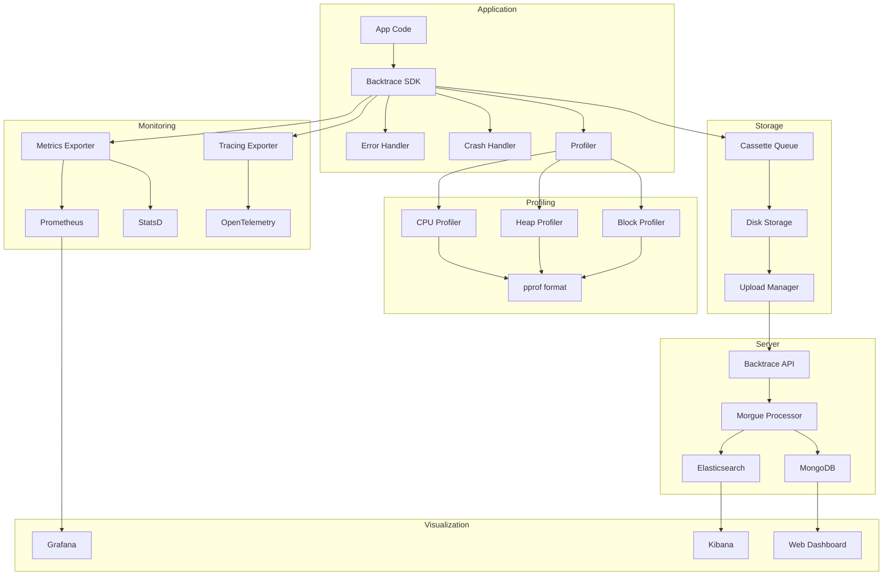
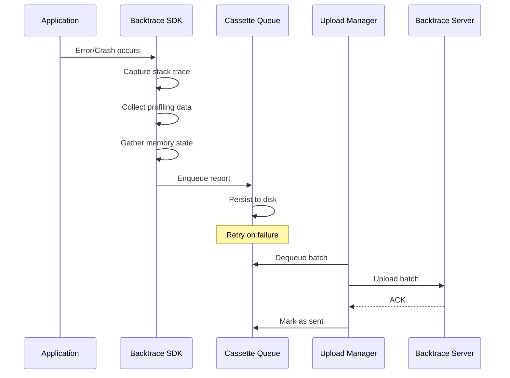
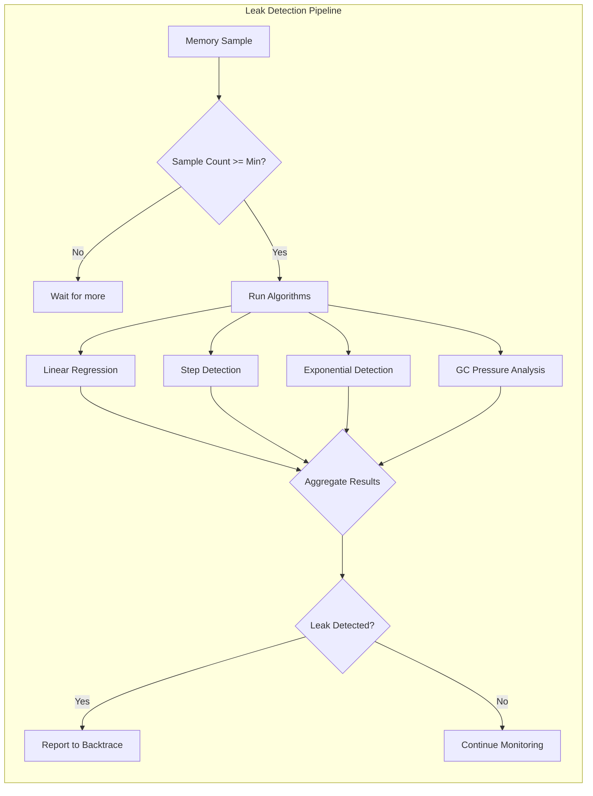

# Performance Profiling, Memory Analysis, and Monitoring Deep Dive

> **Purpose:** Comprehensive exploration of performance profiling integration, memory analysis, and monitoring systems for Backtrace - from CPU profiling to OOM prediction to distributed tracing correlation.
>
> **Scope:** Platform-specific profiling (Go, iOS/macOS, JavaScript, Android), ANR detection, monitoring integration (Prometheus, Grafana, OpenTelemetry), performance budgets, and Backtrace-specific performance optimizations.
>
> **Explored At:** 2026-04-05

---

## Table of Contents

1. [Performance Profiling Integration](#1-performance-profiling-integration)
2. [Memory Analysis](#2-memory-analysis)
3. [Platform-Specific Profiling](#3-platform-specific-profiling)
4. [ANR Detection and Analysis](#4-anr-detection-and-analysis)
5. [Monitoring Integration](#5-monitoring-integration)
6. [Performance Budgets](#6-performance-budgets)
7. [Backtrace Performance Features](#7-backtrace-performance-features)
8. [Appendix: Reference Configurations](#8-appendix-reference-configurations)

---

## 1. Performance Profiling Integration

### 1.1 CPU Profiling Overview

CPU profiling captures how an application spends its execution time, identifying hotspots, bottlenecks, and inefficient code paths. Backtrace integrates profiling data with crash reports to provide complete performance context.

#### Profiling Strategies Comparison

| Strategy | Overhead | Precision | Use Case |
|----------|----------|-----------|----------|
| **Sampling** | Low (1-3%) | Statistical | Production monitoring, continuous profiling |
| **Tracing** | High (10-30%) | Exact | Development, targeted investigation |
| **Instrumentation** | Variable | Exact + call counts | Build-time analysis, coverage |
| **Hardware PMU** | Very Low (<1%) | Statistical | Production, long-term trends |

#### Architecture: Profiling Data Attachment

```
┌─────────────────────────────────────────────────────────────────────────────┐
│                    Profiling Data Flow                                        │
├─────────────────────────────────────────────────────────────────────────────┤
│                                                                              │
│  ┌──────────────┐    ┌──────────────┐    ┌──────────────┐                   │
│  │   Sampling   │    │    Trace     │    │   Hardware   │                   │
│  │   Profiler   │    │   Profiler   │    │   PMU        │                   │
│  └──────┬───────┘    └──────┬───────┘    └──────┬───────┘                   │
│         │                   │                   │                            │
│         └───────────────────┼───────────────────┘                            │
│                             ▼                                                │
│                  ┌─────────────────────┐                                     │
│                  │  Profile Aggregator │                                     │
│                  │  - Stack frames     │                                     │
│                  │  - Timing data      │                                     │
│                  │  - Thread info      │                                     │
│                  └──────────┬──────────┘                                     │
│                             │                                                │
│         ┌───────────────────┼───────────────────┐                           │
│         ▼                   ▼                   ▼                           │
│  ┌─────────────┐    ┌─────────────┐    ┌─────────────┐                      │
│  │   pprof     │    │   Chrome    │    │  Instruments │                     │
│  │   format    │    │   DevTools  │    │   format     │                     │
│  └──────┬──────┘    └──────┬──────┘    └──────┬───────┘                     │
│         │                   │                   │                            │
│         └───────────────────┼───────────────────┘                            │
│                             ▼                                                │
│                  ┌─────────────────────┐                                     │
│                  │  Backtrace Report   │                                     │
│                  │  - Profiling data   │                                     │
│                  │  - Flame graphs     │                                     │
│                  │  - Correlated with  │                                     │
│                  │    crash metadata   │                                     │
│                  └─────────────────────┘                                     │
│                                                                              │
└─────────────────────────────────────────────────────────────────────────────┘
```

### 1.2 pprof Integration (Go)

Go's `runtime/pprof` and `net/http/pprof` provide industry-standard profiling capabilities.

#### Runtime Profiling Setup

```go
package profiling

import (
    "bytes"
    "compress/gzip"
    "context"
    "fmt"
    "io"
    "net/http"
    "os"
    "runtime"
    "runtime/pprof"
    "time"

    bt "github.com/backtrace-labs/backtrace-go"
)

// ProfileCollector manages continuous profiling data collection
type ProfileCollector struct {
    client      *bt.BacktraceClient
    interval    time.Duration
    sampleRate  float64
    profileType string
    stopCh      chan struct{}
    lastProfile []byte
}

// NewProfileCollector creates a new profile collector
func NewProfileCollector(client *bt.BacktraceClient, interval time.Duration, sampleRate float64) *ProfileCollector {
    return &ProfileCollector{
        client:     client,
        interval:   interval,
        sampleRate: sampleRate,
        stopCh:     make(chan struct{}),
    }
}

// StartCPUProfiling starts continuous CPU profiling
func (p *ProfileCollector) StartCPUProfiling() {
    go func() {
        ticker := time.NewTicker(p.interval)
        defer ticker.Stop()

        for {
            select {
            case <-ticker.C:
                if shouldSample(p.sampleRate) {
                    profile := p.captureCPUProfile(30 * time.Second)
                    if profile != nil {
                        p.attachProfileToBacktrace(profile, "cpu")
                    }
                }
            case <-p.stopCh:
                return
            }
        }
    }()
}

// captureCPUProfile captures a CPU profile for the specified duration
func (p *ProfileCollector) captureCPUProfile(duration time.Duration) []byte {
    var buf bytes.Buffer
    gzWriter := gzip.NewWriter(&buf)

    // Start CPU profiling
    if err := pprof.StartCPUProfile(gzWriter); err != nil {
        return nil
    }

    // Wait for the specified duration
    time.Sleep(duration)

    // Stop profiling
    pprof.StopCPUProfile()
    gzWriter.Close()

    return buf.Bytes()
}

// captureHeapProfile captures current heap state
func (p *ProfileCollector) captureHeapProfile() []byte {
    var buf bytes.Buffer
    gzWriter := gzip.NewWriter(&buf)

    if err := pprof.Lookup("heap").WriteTo(gzWriter, 0); err != nil {
        return nil
    }
    gzWriter.Close()

    return buf.Bytes()
}

// captureGoroutineProfile captures all goroutine stacks
func (p *ProfileCollector) captureGoroutineProfile() []byte {
    var buf bytes.Buffer
    gzWriter := gzip.NewWriter(&buf)

    if err := pprof.Lookup("goroutine").WriteTo(gzWriter, 0); err != nil {
        return nil
    }
    gzWriter.Close()

    return buf.Bytes()
}

// attachProfileToBacktrace attaches profile data to next crash report
func (p *ProfileCollector) attachProfileToBacktrace(profile []byte, profileType string) {
    // Store in backtrace options for attachment on crash
    bt.Options.Attachments[fmt.Sprintf("profile_%s_%s.pprof.gz", profileType, time.Now().Format("20060102_150405"))] = profile
}

func shouldSample(rate float64) bool {
    return runtime.Float64frombits(uint64(time.Now().UnixNano())) < rate
}
```

#### HTTP Profiling Endpoints

```go
package main

import (
    "net/http"
    _ "net/http/pprof"
    "sync"

    "github.com/gorilla/mux"
)

var profilingEnabled bool
var profilingMu sync.RWMutex

func setupProfilingEndpoints(r *mux.Router) {
    // Secure profiling endpoints behind auth
    r.HandleFunc("/debug/pprof/", requireProfilingAuth(pprof.Index))
    r.HandleFunc("/debug/pprof/cmdline", requireProfilingAuth(pprof.Cmdline))
    r.HandleFunc("/debug/pprof/profile", requireProfilingAuth(pprof.Profile))
    r.HandleFunc("/debug/pprof/symbol", requireProfilingAuth(pprof.Symbol))
    r.HandleFunc("/debug/pprof/trace", requireProfilingAuth(pprof.Trace))

    // Custom profile endpoints
    r.HandleFunc("/debug/pprof/heap", requireProfilingAuth(heapProfileHandler))
    r.HandleFunc("/debug/pprof/goroutine", requireProfilingAuth(goroutineProfileHandler))
    r.HandleFunc("/debug/pprof/mutex", requireProfilingAuth(mutexProfileHandler))
    r.HandleFunc("/debug/pprof/block", requireProfilingAuth(blockProfileHandler))
}

func requireProfilingAuth(handler http.HandlerFunc) http.HandlerFunc {
    return func(w http.ResponseWriter, r *http.Request) {
        profilingMu.RLock()
        enabled := profilingEnabled
        profilingMu.RUnlock()

        if !enabled {
            http.Error(w, "Profiling disabled", http.StatusForbidden)
            return
        }

        // Check auth token
        token := r.Header.Get("X-Profile-Token")
        if token != getProfilingToken() {
            http.Error(w, "Unauthorized", http.StatusUnauthorized)
            return
        }

        handler(w, r)
    }
}

func heapProfileHandler(w http.ResponseWriter, r *http.Request) {
    // Enable GC for accurate heap profile
    runtime.GC()
    pprof.Lookup("heap").WriteTo(w, 0)
}

func goroutineProfileHandler(w http.ResponseWriter, r *http.Request) {
    pprof.Lookup("goroutine").WriteTo(w, 0)
}

func mutexProfileHandler(w http.ResponseWriter, r *http.Request) {
    pprof.Lookup("mutex").WriteTo(w, 0)
}

func blockProfileHandler(w http.ResponseWriter, r *http.Request) {
    pprof.Lookup("block").WriteTo(w, 0)
}
```

### 1.3 Chrome DevTools Protocol Integration

For JavaScript applications, integrating with Chrome DevTools Protocol (CDP) enables remote profiling and crash correlation.

```typescript
// profiling/cdp-profiler.ts

import * as CDP from 'chrome-remote-interface';
import { BacktraceClient } from '@backtrace/node';

interface ProfilingSession {
    sessionId: string;
    startTime: number;
    traces: CDP.TraceEvent[];
    heapSnapshots: HeapSnapshot[];
}

export class CDPProfiler {
    private client: BacktraceClient;
    private sessions: Map<string, ProfilingSession>;
    private cdpClient: CDP.Client | null;

    constructor(client: BacktraceClient) {
        this.client = client;
        this.sessions = new Map();
    }

    async startProfiling(sessionId: string): Promise<void> {
        this.cdpClient = await CDP();
        const { Performance, Profiler, HeapProfiler } = this.cdpClient;

        await Promise.all([
            Performance.enable(),
            Profiler.enable(),
            HeapProfiler.enable(),
        ]);

        const session: ProfilingSession = {
            sessionId,
            startTime: Date.now(),
            traces: [],
            heapSnapshots: [],
        };

        // Collect trace events
        Profiler.consoleProfileFinished((params) => {
            session.traces.push(params.profile);
        });

        // Start CPU profiling
        await Profiler.start({
            samplingInterval: 100, // microseconds
            recordReasons: true,
        });

        this.sessions.set(sessionId, session);
    }

    async stopProfiling(sessionId: string): Promise<ProfileData> {
        const session = this.sessions.get(sessionId);
        if (!session || !this.cdpClient) {
            throw new Error('No active profiling session');
        }

        const { Profiler, HeapProfiler } = this.cdpClient;

        // Stop CPU profiling
        const { profile } = await Profiler.stop();

        // Take heap snapshot
        await HeapProfiler.takeHeapSnapshot();

        session.traces.push(profile);
        const duration = Date.now() - session.startTime;

        this.sessions.delete(sessionId);

        return {
            sessionId,
            duration,
            cpuProfile: profile,
            traces: session.traces,
            heapSnapshots: session.heapSnapshots,
        };
    }

    async attachProfileToCrash(profileData: ProfileData): Promise<void> {
        this.client.send(new Error('Profiling data captured'), {
            profiling: {
                sessionId: profileData.sessionId,
                duration_ms: profileData.duration,
                cpu_profile: JSON.stringify(profileData.cpuProfile),
            },
        });
    }

    async cleanup(): Promise<void> {
        if (this.cdpClient) {
            await this.cdpClient.close();
            this.cdpClient = null;
        }
    }
}

interface ProfileData {
    sessionId: string;
    duration: number;
    cpuProfile: CDP.Profile;
    traces: CDP.TraceEvent[];
    heapSnapshots: HeapSnapshot[];
}

interface HeapSnapshot {
    timestamp: number;
    size: number;
    data: ArrayBuffer;
}
```

### 1.4 Instruments Automation (iOS/macOS)

Automating Instruments for profiling data attachment to crash reports.

```swift
// Profiling/InstrumentsProfiler.swift

import Foundation
import XCUIAutomation

public class InstrumentsProfiler {
    private let backtraceClient: BacktraceClient
    private let instrumentTypes: [InstrumentType]
    private var recordingSession: RecordingSession?

    public enum InstrumentType {
        case timeProfiler
        case allocations
        case leaks
        case energyLog
        case network
        case fileActivity
    }

    public init(backtraceClient: BacktraceClient, instruments: [InstrumentType] = [.timeProfiler, .allocations]) {
        self.backtraceClient = backtraceClient
        self.instrumentTypes = instruments
    }

    public func startProfiling() throws {
        let template = XCTemplate(instruments: instrumentTypes.map { $0.templateName })

        recordingSession = try XCAutomation recording(from: template) { session in
            session.startRecording()

            // Configure sampling rates
            session.configure(TimeProfiler.self) {
                $0.samplingInterval = .microseconds(100)
                $0.callStacksEnabled = true
            }

            session.configure(Allocations.self) {
                $0.recordReferenceCounts = true
                $0.trackAllAllocations = true
            }
        }
    }

    public func stopProfiling() throws -> ProfilingData {
        guard let session = recordingSession else {
            throw ProfilingError.noActiveSession
        }

        let traceDocument = try session.stopRecording()

        // Export profiling data
        let cpuData = try traceDocument.exportData(for: .timeProfiler)
        let allocData = try traceDocument.exportData(for: .allocations)
        let leaksData = try traceDocument.exportData(for: .leaks)

        return ProfilingData(
            cpuProfile: cpuData,
            allocationProfile: allocData,
            leaksProfile: leaksData,
            timestamp: Date(),
            duration: session.duration
        )
    }

    public func attachToBacktrace(profilingData: ProfilingData, attributes: [String: Any] = [:]) {
        var btAttributes = attributes
        btAttributes["profiling.timestamp"] = profilingData.timestamp.iso8601
        btAttributes["profiling.duration_ms"] = profilingData.duration * 1000

        // Attach CPU profile
        if let cpuData = profilingData.cpuProfile {
            backtraceClient.addAttachment(
                data: cpuData,
                name: "cpu_profile.trace",
                type: "application/octet-stream"
            )
        }

        // Attach allocation profile
        if let allocData = profilingData.allocationProfile {
            backtraceClient.addAttachment(
                data: allocData,
                name: "allocation_profile.trace",
                type: "application/octet-stream"
            )
        }

        // Send profiling event
        backtraceClient.send(
            NSError(domain: "Profiling", code: 0, userInfo: ["type": "profiling_complete"]),
            btAttributes
        )
    }
}

// Continuous profiling with periodic snapshots
public class ContinuousProfiler {
    private let profiler: InstrumentsProfiler
    private let snapshotInterval: TimeInterval
    private var timer: Timer?

    public init(profiler: InstrumentsProfiler, snapshotInterval: TimeInterval = 60) {
        self.profiler = profiler
        self.snapshotInterval = snapshotInterval
    }

    public func start() throws {
        try profiler.startProfiling()

        timer = Timer.scheduledTimer(withTimeInterval: snapshotInterval, repeats: true) { [weak self] _ in
            self?.captureSnapshot()
        }
    }

    private func captureSnapshot() {
        // Capture periodic snapshots without stopping profiling
        // This allows long-running profiling sessions
    }

    public func stop() throws {
        timer?.invalidate()
        timer = nil

        let data = try profiler.stopProfiling()
        profiler.attachToBacktrace(profilingData: data)
    }
}
```

### 1.5 Flame Graph Generation

Flame graphs visualize profiling data to identify performance hotspots.

```go
package profiling

import (
    "encoding/json"
    "fmt"
    "io"
    "os"
    "os/exec"
    "path/filepath"
    "strings"
)

// FlameGraphGenerator creates interactive flame graphs from pprof data
type FlameGraphGenerator struct {
    outputPath string
    toolPath   string
}

func NewFlameGraphGenerator(outputPath string) *FlameGraphGenerator {
    return &FlameGraphGenerator{
        outputPath: outputPath,
        toolPath:   findFlameGraphTool(),
    }
}

func findFlameGraphTool() string {
    // Check common locations
    paths := []string{
        "flamegraph.pl",
        "/usr/local/bin/flamegraph.pl",
        filepath.Join(os.Getenv("GOPATH"), "bin/flamegraph.pl"),
    }
    for _, p := range paths {
        if _, err := os.Stat(p); err == nil {
            return p
        }
    }
    return ""
}

// GenerateFromPprof creates a flame graph from pprof profile data
func (f *FlameGraphGenerator) GenerateFromPprof(pprofData []byte, name string) (string, error) {
    if f.toolPath == "" {
        return "", fmt.Errorf("flamegraph.pl not found")
    }

    // Write pprof data to temp file
    pprofFile := filepath.Join(f.outputPath, name+".pprof")
    if err := os.WriteFile(pprofFile, pprofData, 0644); err != nil {
        return "", err
    }

    // Convert pprof to folded format using go tool
    foldedFile := filepath.Join(f.outputPath, name+".folded")
    if err := f.convertToFolded(pprofFile, foldedFile); err != nil {
        return "", err
    }

    // Generate SVG flame graph
    svgFile := filepath.Join(f.outputPath, name+".svg")
    if err := f.generateSVG(foldedFile, svgFile); err != nil {
        return "", err
    }

    return svgFile, nil
}

func (f *FlameGraphGenerator) convertToFolded(pprofFile, foldedFile string) error {
    // Use go tool pprof to convert to folded format
    cmd := exec.Command("go", "tool", "pprof", "-raw", pprofFile)
    output, err := cmd.Output()
    if err != nil {
        return err
    }

    // Parse raw output and convert to folded format
    folded := f.parseToFolded(output)

    return os.WriteFile(foldedFile, []byte(folded), 0644)
}

func (f *FlameGraphGenerator) parseToFolded(data []byte) string {
    // Parse pprof raw output and create folded format
    // Format: "func1;func2;func3 42"
    var sb strings.Builder
    // ... parsing logic
    return sb.String()
}

func (f *FlameGraphGenerator) generateSVG(foldedFile, svgFile string) error {
    cmd := exec.Command(f.toolPath, foldedFile)
    out, err := os.Create(svgFile)
    if err != nil {
        return err
    }
    defer out.Close()

    cmd.Stdout = out
    return cmd.Run()
}

// GenerateFromProfile creates flame graph directly from runtime profile
func (f *FlameGraphGenerator) GenerateFromProfile(profileName string, duration time.Duration) (string, error) {
    prof := pprof.Lookup(profileName)
    if prof == nil {
        return "", fmt.Errorf("unknown profile: %s", profileName)
    }

    var buf bytes.Buffer
    if err := prof.WriteTo(&buf, 0); err != nil {
        return "", err
    }

    return f.GenerateFromPprof(buf.Bytes(), fmt.Sprintf("%s_%s", profileName, time.Now().Format("20060102_150405")))
}
```

### 1.6 Continuous Profiling Strategies

Production-ready continuous profiling with minimal overhead.

```go
package profiling

import (
    "context"
    "sync"
    "time"

    "github.com/prometheus/client_golang/prometheus"
)

// ContinuousProfilingConfig configures continuous profiling behavior
type ContinuousProfilingConfig struct {
    // CPU profile interval and duration
    CPUInterval    time.Duration
    CPUDuration    time.Duration
    
    // Heap profile interval
    HeapInterval   time.Duration
    
    // Goroutine profile interval
    GoroutineInterval time.Duration
    
    // Sampling rate (0.0 - 1.0)
    SamplingRate   float64
    
    // Profile retention
    RetentionCount int
    
    // Enable specific profilers
    EnableCPU      bool
    EnableHeap     bool
    EnableGoroutine bool
    EnableMutex    bool
    EnableBlock    bool
}

func DefaultContinuousProfilingConfig() ContinuousProfilingConfig {
    return ContinuousProfilingConfig{
        CPUInterval:       5 * time.Minute,
        CPUDuration:       30 * time.Second,
        HeapInterval:      1 * time.Minute,
        GoroutineInterval: 5 * time.Minute,
        SamplingRate:      0.1, // 10% of intervals actually profile
        RetentionCount:    10,
        EnableCPU:         true,
        EnableHeap:        true,
        EnableGoroutine:   true,
        EnableMutex:       false,
        EnableBlock:       false,
    }
}

// ContinuousProfiler manages ongoing profiling with minimal overhead
type ContinuousProfiler struct {
    config     ContinuousProfilingConfig
    profiles   *ProfileStore
    metrics    *ProfilingMetrics
    mu         sync.RWMutex
    ctx        context.Context
    cancel     context.CancelFunc
    wg         sync.WaitGroup
    backtrace  *bt.BacktraceClient
}

type ProfileStore struct {
    cpuProfiles      []ProfileEntry
    heapProfiles     []ProfileEntry
    goroutineProfiles []ProfileEntry
    mutexProfiles    []ProfileEntry
    blockProfiles    []ProfileEntry
    mu               sync.Mutex
}

type ProfileEntry struct {
    Timestamp time.Time
    Data      []byte
    Duration  time.Duration
}

type ProfilingMetrics struct {
    cpuProfileDuration  prometheus.Histogram
    heapProfileSize     prometheus.Gauge
    goroutineCount      prometheus.Gauge
    profileUploadLatency prometheus.Histogram
    profilingOverhead    prometheus.Gauge
}

func NewContinuousProfiler(config ContinuousProfilingConfig, btClient *bt.BacktraceClient) *ContinuousProfiler {
    ctx, cancel := context.WithCancel(context.Background())

    cp := &ContinuousProfiler{
        config:    config,
        profiles:  &ProfileStore{},
        metrics:   newProfilingMetrics(),
        ctx:       ctx,
        cancel:    cancel,
        backtrace: btClient,
    }

    return cp
}

func newProfilingMetrics() *ProfilingMetrics {
    return &ProfilingMetrics{
        cpuProfileDuration: prometheus.NewHistogram(prometheus.HistogramOpts{
            Name:    "cpu_profile_duration_seconds",
            Help:    "Duration of CPU profiling captures",
            Buckets: prometheus.ExponentialBuckets(1, 2, 10),
        }),
        heapProfileSize: prometheus.NewGauge(prometheus.GaugeOpts{
            Name: "heap_profile_size_bytes",
            Help: "Size of heap profile data",
        }),
        goroutineCount: prometheus.NewGauge(prometheus.GaugeOpts{
            Name: "goroutine_count",
            Help: "Current number of goroutines",
        }),
        profileUploadLatency: prometheus.NewHistogram(prometheus.HistogramOpts{
            Name:    "profile_upload_latency_seconds",
            Help:    "Latency for uploading profiles to Backtrace",
            Buckets: prometheus.ExponentialBuckets(0.1, 2, 10),
        }),
        profilingOverhead: prometheus.NewGauge(prometheus.GaugeOpts{
            Name: "profiling_overhead_percent",
            Help: "Estimated CPU overhead from profiling",
        }),
    }
}

// Start begins continuous profiling
func (cp *ContinuousProfiler) Start() {
    cp.wg.Add(1)
    go cp.cpuProfilingLoop()

    cp.wg.Add(1)
    go cp.heapProfilingLoop()

    cp.wg.Add(1)
    go cp.goroutineProfilingLoop()

    cp.wg.Add(1)
    go cp.metricsReportingLoop()
}

// Stop gracefully stops continuous profiling
func (cp *ContinuousProfiler) Stop() {
    cp.cancel()
    cp.wg.Wait()
}

func (cp *ContinuousProfiler) cpuProfilingLoop() {
    defer cp.wg.Done()

    ticker := time.NewTicker(cp.config.CPUInterval)
    defer ticker.Stop()

    for {
        select {
        case <-cp.ctx.Done():
            return
        case <-ticker.C:
            if !cp.config.EnableCPU {
                continue
            }
            if !shouldSample(cp.config.SamplingRate) {
                continue
            }

            start := time.Now()
            profile := cp.captureCPUProfile(cp.config.CPUDuration)
            elapsed := time.Since(start)

            cp.metrics.cpuProfileDuration.Observe(elapsed.Seconds())

            if profile != nil {
                cp.profiles.mu.Lock()
                cp.profiles.cpuProfiles = append(cp.profiles.cpuProfiles, ProfileEntry{
                    Timestamp: time.Now(),
                    Data:      profile,
                    Duration:  cp.config.CPUDuration,
                })
                // Trim old profiles
                if len(cp.profiles.cpuProfiles) > cp.config.RetentionCount {
                    cp.profiles.cpuProfiles = cp.profiles.cpuProfiles[1:]
                }
                cp.profiles.mu.Unlock()
            }
        }
    }
}

func (cp *ContinuousProfiler) heapProfilingLoop() {
    defer cp.wg.Done()

    ticker := time.NewTicker(cp.config.HeapInterval)
    defer ticker.Stop()

    for {
        select {
        case <-cp.ctx.Done():
            return
        case <-ticker.C:
            if !cp.config.EnableHeap {
                continue
            }

            // Force GC before heap profile for accurate data
            runtime.GC()

            profile := cp.captureHeapProfile()
            if profile != nil {
                cp.metrics.heapProfileSize.Set(float64(len(profile)))

                cp.profiles.mu.Lock()
                cp.profiles.heapProfiles = append(cp.profiles.heapProfiles, ProfileEntry{
                    Timestamp: time.Now(),
                    Data:      profile,
                })
                if len(cp.profiles.heapProfiles) > cp.config.RetentionCount {
                    cp.profiles.heapProfiles = cp.profiles.heapProfiles[1:]
                }
                cp.profiles.mu.Unlock()
            }
        }
    }
}

func (cp *ContinuousProfiler) goroutineProfilingLoop() {
    defer cp.wg.Done()

    ticker := time.NewTicker(cp.config.GoroutineInterval)
    defer ticker.Stop()

    for {
        select {
        case <-cp.ctx.Done():
            return
        case <-ticker.C:
            if !cp.config.EnableGoroutine {
                continue
            }

            profile := cp.captureGoroutineProfile()
            if profile != nil {
                // Count goroutines
                count := runtime.NumGoroutine()
                cp.metrics.goroutineCount.Set(float64(count))

                cp.profiles.mu.Lock()
                cp.profiles.goroutineProfiles = append(cp.profiles.goroutineProfiles, ProfileEntry{
                    Timestamp: time.Now(),
                    Data:      profile,
                })
                if len(cp.profiles.goroutineProfiles) > cp.config.RetentionCount {
                    cp.profiles.goroutineProfiles = cp.profiles.goroutineProfiles[1:]
                }
                cp.profiles.mu.Unlock()
            }
        }
    }
}

// AttachProfilesToCrash attaches recent profiles to a crash report
func (cp *ContinuousProfiler) AttachProfilesToCrash(attributes map[string]interface{}) {
    cp.profiles.mu.RLock()
    defer cp.profiles.mu.RUnlock()

    // Attach most recent profiles
    if len(cp.profiles.cpuProfiles) > 0 {
        last := cp.profiles.cpuProfiles[len(cp.profiles.cpuProfiles)-1]
        attributes["profile.cpu.timestamp"] = last.Timestamp.Format(time.RFC3339)
        attributes["profile.cpu.duration_ms"] = last.Duration.Milliseconds()
        cp.backtrace.AddAttachment(last.Data, "last_cpu_profile.pprof.gz")
    }

    if len(cp.profiles.heapProfiles) > 0 {
        last := cp.profiles.heapProfiles[len(cp.profiles.heapProfiles)-1]
        attributes["profile.heap.timestamp"] = last.Timestamp.Format(time.RFC3339)
        cp.backtrace.AddAttachment(last.Data, "last_heap_profile.pprof.gz")
    }
}
```

---

## 2. Memory Analysis

### 2.1 Heap Snapshots

Heap snapshots capture the complete state of allocated memory at a point in time.

#### Go Heap Analysis

```go
package memory

import (
    "bytes"
    "compress/gzip"
    "encoding/json"
    "runtime"
    "runtime/debug"
    "sync"
    "time"
)

// HeapSnapshot captures complete heap state
type HeapSnapshot struct {
    Timestamp      time.Time         `json:"timestamp"`
    GoVersion      string            `json:"go_version"`
    MemoryStats    *runtime.MemStats `json:"memory_stats"`
    GCStats        *debug.GCStats    `json:"gc_stats"`
    HeapProfile    []byte            `json:"heap_profile,omitempty"`
    HeapObjects    []HeapObject      `json:"heap_objects,omitempty"`
    AllocationStacks []AllocationStack `json:"allocation_stacks,omitempty"`
}

type HeapObject struct {
    Address    uintptr `json:"address"`
    Size       uint64  `json:"size"`
    TypeName   string  `json:"type_name"`
    StackTrace string  `json:"stack_trace,omitempty"`
}

type AllocationStack struct {
    Stack       string `json:"stack"`
    AllocBytes  uint64 `json:"alloc_bytes"`
    AllocObjects uint64 `json:"alloc_objects"`
    FreeBytes   uint64 `json:"free_bytes"`
    FreeObjects uint64 `json:"free_objects"`
}

// HeapAnalyzer performs comprehensive heap analysis
type HeapAnalyzer struct {
    mu              sync.Mutex
    snapshots       []*HeapSnapshot
    maxSnapshots    int
    allocationTrakcing bool
}

func NewHeapAnalyzer(maxSnapshots int) *HeapAnalyzer {
    return &HeapAnalyzer{
        maxSnapshots: maxSnapshots,
    }
}

// CaptureSnapshot takes a complete heap snapshot
func (h *HeapAnalyzer) CaptureSnapshot(includeProfile bool) *HeapSnapshot {
    h.mu.Lock()
    defer h.mu.Unlock()

    // Force GC for accurate snapshot
    runtime.GC()

    snapshot := &HeapSnapshot{
        Timestamp:   time.Now(),
        GoVersion:   runtime.Version(),
        MemoryStats: &runtime.MemStats{},
        GCStats:     &debug.GCStats{},
    }

    // Read memory stats
    runtime.ReadMemStats(snapshot.MemoryStats)

    // Read GC stats
    debug.ReadGCStats(snapshot.GCStats)

    // Capture heap profile if requested
    if includeProfile {
        var buf bytes.Buffer
        gzWriter := gzip.NewWriter(&buf)
        if err := runtime.Lookup("heap").WriteTo(gzWriter, 0); err == nil {
            gzWriter.Close()
            snapshot.HeapProfile = buf.Bytes()
        }
    }

    // Store snapshot
    h.snapshots = append(h.snapshots, snapshot)
    if len(h.snapshots) > h.maxSnapshots {
        h.snapshots = h.snapshots[1:]
    }

    return snapshot
}

// AnalyzeHeapGrowth compares snapshots to detect memory growth
func (h *HeapAnalyzer) AnalyzeHeapGrowth() *HeapGrowthAnalysis {
    h.mu.Lock()
    defer h.mu.Unlock()

    if len(h.snapshots) < 2 {
        return nil
    }

    oldest := h.snapshots[0]
    newest := h.snapshots[len(h.snapshots)-1]

    analysis := &HeapGrowthAnalysis{
        StartTime:     oldest.Timestamp,
        EndTime:       newest.Timestamp,
        StartHeapUsed: oldest.MemoryStats.HeapAlloc,
        EndHeapUsed:   newest.MemoryStats.HeapAlloc,
        Growth:        int64(newest.MemoryStats.HeapAlloc) - int64(oldest.MemoryStats.HeapAlloc),
        GrowthRate:    float64(newest.MemoryStats.HeapAlloc-oldest.MemoryStats.HeapAlloc) / newest.Sub(oldest.Timestamp).Hours(),
    }

    // Detect potential leaks
    if analysis.GrowthRate > 100*1024*1024 { // >100MB/hour
        analysis.LeakSuspected = true
        analysis.Confidence = h.calculateLeakConfidence(analysis)
    }

    return analysis
}

type HeapGrowthAnalysis struct {
    StartTime     time.Time `json:"start_time"`
    EndTime       time.Time `json:"end_time"`
    StartHeapUsed uint64    `json:"start_heap_used"`
    EndHeapUsed   uint64    `json:"end_heap_used"`
    Growth        int64     `json:"growth_bytes"`
    GrowthRate    float64   `json:"growth_rate_bytes_per_hour"`
    LeakSuspected bool      `json:"leak_suspected"`
    Confidence    float64   `json:"confidence"`
}

// GetTopAllocators returns types with most allocations
func (h *HeapAnalyzer) GetTopAllocators(limit int) []AllocatorStats {
    var buf bytes.Buffer
    if err := runtime.Lookup("allocs").WriteTo(&buf, 1); err != nil {
        return nil
    }

    // Parse allocation profile and return top allocators
    // This requires parsing pprof format
    return parseAllocators(buf.Bytes(), limit)
}

// EnableAllocationTracking starts tracking all allocations
func (h *HeapAnalyzer) EnableAllocationTracking() {
    h.allocationTracking = true
    runtime.SetBlockProfileRate(1)
    runtime.SetMutexProfileFraction(1)
}

// ReportToBacktrace sends heap analysis to Backtrace
func (h *HeapAnalyzer) ReportToBacktrace(client *bt.BacktraceClient, attributes map[string]interface{}) {
    snapshot := h.CaptureSnapshot(true)
    analysis := h.AnalyzeHeapGrowth()

    attributes["memory.heap_alloc"] = snapshot.MemoryStats.HeapAlloc
    attributes["memory.heap_sys"] = snapshot.MemoryStats.HeapSys
    attributes["memory.heap_idle"] = snapshot.MemoryStats.HeapIdle
    attributes["memory.heap_inuse"] = snapshot.MemoryStats.HeapInuse
    attributes["memory.heap_released"] = snapshot.MemoryStats.HeapReleased
    attributes["memory.heap_objects"] = snapshot.MemoryStats.HeapObjects
    attributes["memory.gc_pause_total"] = snapshot.MemoryStats.PauseTotalNs
    attributes["memory.gc_num"] = snapshot.MemoryStats.NumGC
    attributes["memory.gc_cpu_fraction"] = snapshot.MemoryStats.GCCPUFraction

    if analysis != nil {
        attributes["memory.growth_bytes"] = analysis.Growth
        attributes["memory.growth_rate_per_hour"] = analysis.GrowthRate
        attributes["memory.leak_suspected"] = analysis.LeakSuspected
    }

    if snapshot.HeapProfile != nil {
        client.AddAttachment(snapshot.HeapProfile, "heap_profile.pprof.gz")
    }
}
```

### 2.2 Memory Leak Detection Algorithms

Advanced algorithms for detecting memory leaks across platforms.

```go
package memory

import (
    "math"
    "sort"
    "time"
)

// LeakDetector implements multiple leak detection algorithms
type LeakDetector struct {
    samples       []MemorySample
    sampleWindow  time.Duration
    minSamples    int
}

type MemorySample struct {
    Timestamp time.Time
    HeapUsed  uint64
    HeapObjects uint64
    GCCount   uint64
}

func NewLeakDetector(window time.Duration, minSamples int) *LeakDetector {
    return &LeakDetector{
        sampleWindow: window,
        minSamples:   minSamples,
        samples:      make([]MemorySample, 0),
    }
}

// AddSample adds a memory sample for analysis
func (l *LeakDetector) AddSample(sample MemorySample) {
    l.samples = append(l.samples, sample)

    // Remove old samples outside window
    cutoff := time.Now().Add(-l.sampleWindow)
    for len(l.samples) > 0 && l.samples[0].Timestamp.Before(cutoff) {
        l.samples = l.samples[1:]
    }
}

// DetectLeaks runs all detection algorithms
func (l *LeakDetector) DetectLeaks() *LeakReport {
    if len(l.samples) < l.minSamples {
        return nil
    }

    report := &LeakReport{
        DetectionTime: time.Now(),
        Algorithms:    make(map[string]*AlgorithmResult),
    }

    // Run linear regression detection
    report.Algorithms["linear_regression"] = l.detectLinearGrowth()

    // Run step detection
    report.Algorithms["step_detection"] = l.detectStepChanges()

    // run exponential detection
    report.Algorithms["exponential_growth"] = l.detectExponentialGrowth()

    // Run GC pressure analysis
    report.Algorithms["gc_pressure"] = l.analyzeGCPressure()

    // Aggregate results
    report.LeakDetected = l.aggregateResults(report.Algorithms)
    report.Confidence = l.calculateConfidence(report.Algorithms)
    report.RecommendedAction = l.recommendAction(report)

    return report
}

type LeakReport struct {
    DetectionTime    time.Time             `json:"detection_time"`
    LeakDetected     bool                  `json:"leak_detected"`
    Confidence       float64               `json:"confidence"`
    Algorithms       map[string]*AlgorithmResult `json:"algorithms"`
    RecommendedAction string               `json:"recommended_action"`
}

type AlgorithmResult struct {
    Detected   bool                 `json:"detected"`
    Score      float64              `json:"score"`
    Metrics    map[string]float64   `json:"metrics"`
    Details    string               `json:"details"`
}

// detectLinearGrowth uses linear regression to detect steady memory growth
func (l *LeakDetector) detectLinearGrowth() *AlgorithmResult {
    n := len(l.samples)
    if n < 3 {
        return &AlgorithmResult{Detected: false, Score: 0}
    }

    // Convert to numeric arrays
    x := make([]float64, n)
    y := make([]float64, n)
    for i, s := range l.samples {
        x[i] = float64(s.Timestamp.Unix())
        y[i] = float64(s.HeapUsed)
    }

    // Linear regression: y = mx + b
    sumX, sumY, sumXY, sumX2 := 0.0, 0.0, 0.0, 0.0
    for i := 0; i < n; i++ {
        sumX += x[i]
        sumY += y[i]
        sumXY += x[i] * y[i]
        sumX2 += x[i] * x[i]
    }

    slope := (float64(n)*sumXY - sumX*sumY) / (float64(n)*sumX2 - sumX*sumX)
    
    // Calculate R-squared
    meanY := sumY / float64(n)
    ssTot, ssRes := 0.0, 0.0
    for i := 0; i < n; i++ {
        predicted := slope*x[i] + (meanY - slope*sumX/float64(n))
        ssTot += (y[i] - meanY) * (y[i] - meanY)
        ssRes += (y[i] - predicted) * (y[i] - predicted)
    }
    rSquared := 1 - (ssRes / ssTot)

    // Convert slope to bytes/hour
    bytesPerSecond := slope
    bytesPerHour := bytesPerSecond * 3600

    detected := bytesPerHour > 10*1024*1024 && rSquared > 0.7 // >10MB/hour with good fit
    score := math.Min(1.0, bytesPerHour/(100*1024*1024)) * rSquared

    return &AlgorithmResult{
        Detected: detected,
        Score:    score,
        Metrics: map[string]float64{
            "slope_bytes_per_hour": bytesPerHour,
            "r_squared":           rSquared,
        },
        Details: "Linear memory growth detected",
    }
}

// detectStepChanges identifies sudden memory increases (potential leak events)
func (l *LeakDetector) detectStepChanges() *AlgorithmResult {
    if len(l.samples) < 3 {
        return &AlgorithmResult{Detected: false, Score: 0}
    }

    var maxStep float64
    var stepIndex int

    for i := 1; i < len(l.samples); i++ {
        prev := float64(l.samples[i-1].HeapUsed)
        curr := float64(l.samples[i].HeapUsed)
        step := curr - prev

        // Calculate step as percentage
        stepPct := step / prev * 100

        if step > float64(maxStep) && stepPct > 10 { // >10% increase
            maxStep = step
            stepIndex = i
        }
    }

    // Check if memory stayed elevated after step
    if maxStep > 50*1024*1024 && stepIndex < len(l.samples)-1 {
        // Check if memory remained elevated
        postStepAvg := l.averageHeapAfter(stepIndex)
        preStepAvg := l.averageHeapBefore(stepIndex)
        
        if postStepAvg > preStepAvg*1.05 { // 5% threshold
            return &AlgorithmResult{
                Detected: true,
                Score:    math.Min(1.0, maxStep/(500*1024*1024)),
                Metrics: map[string]float64{
                    "step_bytes": maxStep,
                    "step_index": float64(stepIndex),
                },
                Details: "Step change in memory usage detected",
            }
        }
    }

    return &AlgorithmResult{Detected: false, Score: 0}
}

// detectExponentialGrowth finds exponentially growing memory (severe leaks)
func (l *LeakDetector) detectExponentialGrowth() *AlgorithmResult {
    if len(l.samples) < 5 {
        return &AlgorithmResult{Detected: false, Score: 0}
    }

    // Calculate growth ratios between consecutive samples
    ratios := make([]float64, 0, len(l.samples)-1)
    for i := 1; i < len(l.samples); i++ {
        if l.samples[i-1].HeapUsed > 0 {
            ratio := float64(l.samples[i].HeapUsed) / float64(l.samples[i-1].HeapUsed)
            ratios = append(ratios, ratio)
        }
    }

    // Check if consistently growing
    growingCount := 0
    avgRatio := 0.0
    for _, r := range ratios {
        if r > 1.0 {
            growingCount++
            avgRatio += r
        }
    }
    avgRatio /= float64(len(ratios))

    // Exponential if >80% of intervals show growth
    growthRatio := float64(growingCount) / float64(len(ratios))
    detected := growthRatio > 0.8 && avgRatio > 1.01

    return &AlgorithmResult{
        Detected: detected,
        Score:    growthRatio * (avgRatio - 1),
        Metrics: map[string]float64{
            "growth_ratio":      growthRatio,
            "average_ratio":     avgRatio,
        },
        Details: "Exponential memory growth pattern",
    }
}

// analyzeGCPressure detects leaks through GC behavior
func (l *LeakDetector) analyzeGCPressure() *AlgorithmResult {
    if len(l.samples) < 3 {
        return &AlgorithmResult{Detected: false, Score: 0}
    }

    // Calculate GC frequency trend
    gcRates := make([]float64, 0, len(l.samples)-1)
    for i := 1; i < len(l.samples); i++ {
        gcDelta := l.samples[i].GCCount - l.samples[i-1].GCCount
        timeDelta := l.samples[i].Timestamp.Sub(l.samples[i-1].Timestamp).Seconds()
        if timeDelta > 0 {
            gcRates = append(gcRates, float64(gcDelta)/timeDelta)
        }
    }

    // Calculate GC rate trend
    earlyGC := l.average(gcRates[:len(gcRates)/2])
    lateGC := l.average(gcRates[len(gcRates)/2:])

    // Increasing GC frequency suggests memory pressure
    gcIncreaseRatio := lateGC / earlyGC
    detected := gcIncreaseRatio > 1.5

    return &AlgorithmResult{
        Detected: detected,
        Score:    math.Min(1.0, (gcIncreaseRatio-1)/2),
        Metrics: map[string]float64{
            "early_gc_rate": earlyGC,
            "late_gc_rate":  lateGC,
            "increase_ratio": gcIncreaseRatio,
        },
        Details: "GC pressure analysis",
    }
}

func (l *LeakDetector) aggregateResults(results map[string]*AlgorithmResult) bool {
    totalScore := 0.0
    for _, r := range results {
        totalScore += r.Score
    }
    return totalScore > 1.5 // At least 2 algorithms with decent scores
}

func (l *LeakDetector) calculateConfidence(results map[string]*AlgorithmResult) float64 {
    positiveAlgos := 0
    totalScore := 0.0

    for _, r := range results {
        if r.Detected {
            positiveAlgos++
            totalScore += r.Score
        }
    }

    if positiveAlgos == 0 {
        return 0
    }

    return math.Min(1.0, (float64(positiveAlgos)/4)*0.5 + totalScore/4*0.5)
}

func (l *LeakDetector) recommendAction(report *LeakReport) string {
    if !report.LeakDetected {
        return "No action required"
    }

    if report.Confidence > 0.8 {
        return "Immediate investigation required - high confidence memory leak"
    } else if report.Confidence > 0.5 {
        return "Monitor closely - possible memory leak"
    }
    return "Continue monitoring"
}
```

### 2.3 Allocation Tracking

Fine-grained allocation tracking for leak source identification.

```go
package memory

import (
    "runtime"
    "sync"
    "sync/atomic"
)

// AllocationTracker tracks individual allocations
type AllocationTracker struct {
    mu       sync.RWMutex
    allocs   map[uintptr]*Allocation
    totalAllocs uint64
    totalFrees  uint64
    activeAllocs uint64
}

type Allocation struct {
    Address   uintptr
    Size      uint64
    Stack     []uintptr
    Timestamp int64
    TypeName  string
    Freed     bool
    FreeTime  int64
}

func NewAllocationTracker() *AllocationTracker {
    return &AllocationTracker{
        allocs: make(map[uintptr]*Allocation),
    }
}

// RecordAllocation records a new allocation
func (t *AllocationTracker) RecordAllocation(ptr uintptr, size uint64) {
    stack := make([]uintptr, 32)
    n := runtime.Callers(2, stack)
    stack = stack[:n]

    t.mu.Lock()
    t.allocs[ptr] = &Allocation{
        Address:   ptr,
        Size:      size,
        Stack:     stack,
        Timestamp: time.Now().UnixNano(),
    }
    atomic.AddUint64(&t.totalAllocs, 1)
    atomic.AddUint64(&t.activeAllocs, 1)
    t.mu.Unlock()
}

// RecordFree records a freed allocation
func (t *AllocationTracker) RecordFree(ptr uintptr) {
    t.mu.Lock()
    if alloc, ok := t.allocs[ptr]; ok {
        alloc.Freed = true
        alloc.FreeTime = time.Now().UnixNano()
    }
    atomic.AddUint64(&t.totalFrees, 1)
    atomic.AddUint64(&t.activeAllocs, ^uint64(0))
    t.mu.Unlock()
}

// GetLiveAllocations returns all unfreed allocations
func (t *AllocationTracker) GetLiveAllocations(minAge time.Duration) []*Allocation {
    t.mu.RLock()
    defer t.mu.RUnlock()

    cutoff := time.Now().Add(-minAge).UnixNano()
    var live []*Allocation

    for _, alloc := range t.allocs {
        if !alloc.Freed && alloc.Timestamp < cutoff {
            live = append(live, alloc)
        }
    }

    // Sort by age (oldest first)
    sort.Slice(live, func(i, j int) bool {
        return live[i].Timestamp < live[j].Timestamp
    })

    return live
}

// GetAllocationHotspots returns stacks with most allocations
func (t *AllocationTracker) GetAllocationHotspots(limit int) []StackStats {
    t.mu.RLock()
    defer t.mu.RUnlock()

    stackStats := make(map[string]*StackStats)

    for _, alloc := range t.allocs {
        key := stackKey(alloc.Stack)
        if _, ok := stackStats[key]; !ok {
            stackStats[key] = &StackStats{
                Stack: alloc.Stack,
            }
        }
        stackStats[key].AllocCount++
        stackStats[key].TotalBytes += alloc.Size
        if !alloc.Freed {
            stackStats[key].LiveCount++
            stackStats[key].LiveBytes += alloc.Size
        }
    }

    // Convert to slice and sort
    var result []StackStats
    for _, stats := range stackStats {
        result = append(result, *stats)
    }
    sort.Slice(result, func(i, j int) bool {
        return result[i].LiveBytes > result[j].LiveBytes
    })

    if len(result) > limit {
        result = result[:limit]
    }

    return result
}

type StackStats struct {
    Stack      []uintptr `json:"stack"`
    AllocCount uint64    `json:"alloc_count"`
    TotalBytes uint64    `json:"total_bytes"`
    LiveCount  uint64    `json:"live_count"`
    LiveBytes  uint64    `json:"live_bytes"`
}

func stackKey(stack []uintptr) string {
    var sb strings.Builder
    for _, pc := range stack {
        sb.WriteString(fmt.Sprintf("%x,", pc))
    }
    return sb.String()
}
```

### 2.4 GC Pressure Monitoring

Monitoring garbage collection pressure to predict OOM conditions.

```go
package memory

import (
    "runtime"
    "runtime/debug"
    "sync"
    "time"
)

// GCMonitor tracks garbage collection metrics
type GCMonitor struct {
    mu          sync.Mutex
    gcStats     debug.GCStats
    pauseBuffer []time.Duration
    bufferSize  int
}

func NewGCMonitor(bufferSize int) *GCMonitor {
    return &GCMonitor{
        pauseBuffer: make([]time.Duration, 0, bufferSize),
        bufferSize:  bufferSize,
    }
}

// Update refreshes GC statistics
func (g *GCMonitor) Update() {
    g.mu.Lock()
    defer g.mu.Unlock()
    debug.ReadGCStats(&g.gcStats)
}

// GCMetrics returns current GC metrics
type GCMetrics struct {
    LastPause       time.Duration `json:"last_pause"`
    MaxPause        time.Duration `json:"max_pause"`
    TotalPause      time.Duration `json:"total_pause"`
    NumGC           int64         `json:"num_gc"`
    AvgPause        time.Duration `json:"avg_pause"`
    PauseRate       float64       `json:"pause_rate_per_second"`
    GCCPUFraction   float64       `json:"gc_cpu_fraction"`
    NextGC          uint64        `json:"next_gc_bytes"`
    HeapAlloc       uint64        `json:"heap_alloc"`
    PressureLevel   string        `json:"pressure_level"`
}

func (g *GCMonitor) GetMetrics() GCMetrics {
    g.mu.Lock()
    defer g.mu.Unlock()

    var memStats runtime.MemStats
    runtime.ReadMemStats(&memStats)

    // Calculate average pause
    avgPause := g.gcStats.PauseTotal / time.Duration(g.gcStats.NumGC)

    // Calculate pause rate (pauses per second in last minute)
    pauseRate := g.calculatePauseRate()

    // Calculate GC CPU fraction
    gcCPUFraction := memStats.GCCPUFraction

    // Determine pressure level
    pressureLevel := g.determinePressureLevel(memStats, avgPause, pauseRate)

    return GCMetrics{
        LastPause:     g.gcStats.Pause[0],
        MaxPause:      g.gcStats.PauseMax,
        TotalPause:    g.gcStats.PauseTotal,
        NumGC:         g.gcStats.NumGC,
        AvgPause:      avgPause,
        PauseRate:     pauseRate,
        GCCPUFraction: gcCPUFraction,
        NextGC:        memStats.NextGC,
        HeapAlloc:     memStats.HeapAlloc,
        PressureLevel: pressureLevel,
    }
}

func (g *GCMonitor) determinePressureLevel(ms runtime.MemStats, avgPause time.Duration, pauseRate float64) string {
    // Calculate pressure score
    score := 0.0

    // Factor 1: GC CPU fraction (0-40 points)
    score += ms.GCCPUFraction * 100

    // Factor 2: Average pause time (0-30 points)
    if avgPause > 100*time.Millisecond {
        score += 30
    } else if avgPause > 50*time.Millisecond {
        score += 20
    } else if avgPause > 10*time.Millisecond {
        score += 10
    }

    // Factor 3: Pause frequency (0-30 points)
    if pauseRate > 10 {
        score += 30
    } else if pauseRate > 5 {
        score += 20
    } else if pauseRate > 1 {
        score += 10
    }

    if score >= 70 {
        return "critical"
    } else if score >= 50 {
        return "high"
    } else if score >= 30 {
        return "moderate"
    }
    return "low"
}

// PredictOOM estimates time until OOM based on GC behavior
func (g *GCMonitor) PredictOOM() *OOMPrediction {
    g.mu.Lock()
    defer g.mu.Unlock()

    var ms runtime.MemStats
    runtime.ReadMemStats(&ms)

    // Calculate heap growth rate
    growthRate := g.calculateHeapGrowthRate()
    if growthRate <= 0 {
        return &OOMPrediction{
            OOMImminent: false,
            TimeToOOM:   -1,
            Confidence:  0,
        }
    }

    // Estimate memory until OOM
    memUntilOOM := uint64(0)
    if ms.HeapSys > 0 {
        // Assume system limit at 2x current heap sys
        limit := ms.HeapSys * 2
        if limit > ms.HeapAlloc {
            memUntilOOM = limit - ms.HeapAlloc
        }
    }

    if memUntilOOM == 0 {
        return nil
    }

    // Calculate time to OOM
    secondsToOOM := float64(memUntilOOM) / growthRate

    return &OOMPrediction{
        OOMImminent: secondsToOOM < 300, // <5 minutes
        TimeToOOM:   time.Duration(secondsToOOM) * time.Second,
        Confidence:  g.calculatePredictionConfidence(growthRate),
        HeapGrowthRate: growthRate,
        MemoryUntilOOM: memUntilOOM,
    }
}

type OOMPrediction struct {
    OOMImminent      bool          `json:"oom_imminent"`
    TimeToOOM        time.Duration `json:"time_to_oom"`
    Confidence       float64       `json:"confidence"`
    HeapGrowthRate   float64       `json:"heap_growth_rate_bytes_per_sec"`
    MemoryUntilOOM   uint64        `json:"memory_until_oom_bytes"`
}
```

### 2.5 Memory Pressure Events

Responding to system memory pressure events.

```swift
// iOS/macOS Memory Pressure Handler

import Foundation
import Darwin

public class MemoryPressureHandler {
    private let backtraceClient: BacktraceClient
    private var pressureSource: DispatchSourceMemoryPressure?
    private var pressureHistory: [MemoryPressureEvent] = []
    private var currentLevel: MemoryPressureLevel = .normal

    public enum MemoryPressureLevel: Int {
        case normal = 0
        case warning = 1
        case urgent = 2
        case critical = 3
    }

    public struct MemoryPressureEvent {
        let timestamp: Date
        let level: MemoryPressureLevel
        let heapUsed: UInt64
        let heapFree: UInt64
        let gcCount: Int
    }

    public init(backtraceClient: BacktraceClient) {
        self.backtraceClient = backtraceClient
        setupMemoryPressureMonitoring()
    }

    private func setupMemoryPressureMonitoring() {
        // Create memory pressure dispatch source
        pressureSource = DispatchSource.makeMemoryPressureSource(
            eventMask: [.warning, .critical],
            queue: DispatchQueue.global(qos: .background)
        )

        pressureSource?.setEventHandler { [weak self] in
            guard let self = self else { return }

            let event = self.pressureSource?.data ?? []
            if event.contains(.warning) {
                self.handleMemoryPressure(.warning)
            }
            if event.contains(.critical) {
                self.handleMemoryPressure(.critical)
            }
        }

        pressureSource?.resume()

        // Start periodic memory monitoring
        startPeriodicMonitoring()
    }

    private func handleMemoryPressure(_ level: MemoryPressureLevel) {
        currentLevel = level

        let event = MemoryPressureEvent(
            timestamp: Date(),
            level: level,
            heapUsed: getHeapUsed(),
            heapFree: getHeapFree(),
            gcCount: getGCCount()
        )

        pressureHistory.append(event)

        // Trim history
        if pressureHistory.count > 100 {
            pressureHistory.removeFirst()
        }

        // Report to Backtrace
        reportToBacktrace(event: event)

        // Take appropriate action based on level
        switch level {
        case .warning:
            // Release cached resources
            releaseCachedResources()
            triggerGC()

        case .critical:
            // Aggressive cleanup
            releaseAllNonCriticalResources()
            triggerAggressiveGC()
            sendCriticalAlert()

        default:
            break
        }
    }

    private func reportToBacktrace(event: MemoryPressureEvent) {
        var attributes: [String: Any] = [
            "memory.pressure_level": event.level.rawValue,
            "memory.pressure_timestamp": event.timestamp.iso8601,
            "memory.heap_used": event.heapUsed,
            "memory.heap_free": event.heapFree,
            "memory.gc_count": event.gcCount,
        ]

        // Add historical context
        if pressureHistory.count > 1 {
            let recentEvents = pressureHistory.suffix(10)
            let warningCount = recentEvents.filter { $0.level == .warning }.count
            let criticalCount = recentEvents.filter { $0.level == .critical }.count

            attributes["memory.recent_warnings"] = warningCount
            attributes["memory.recent_criticals"] = criticalCount
        }

        backtraceClient.send(
            NSError(domain: "MemoryPressure", code: event.level.rawValue, userInfo: [:]),
            attributes
        )
    }

    private func startPeriodicMonitoring() {
        DispatchQueue.global(qos: .background).async {
            while true {
                Thread.sleep(forTimeInterval: 30)
                self.checkMemoryStatus()
            }
        }
    }

    private func checkMemoryStatus() {
        // Check if memory usage exceeds thresholds
        let heapUsed = getHeapUsed()
        let heapTotal = getHeapTotal()
        let usageRatio = Double(heapUsed) / Double(heapTotal)

        if usageRatio > 0.9 && currentLevel == .normal {
            handleMemoryPressure(.warning)
        } else if usageRatio > 0.95 {
            handleMemoryPressure(.critical)
        }
    }

    private func releaseCachedResources() {
        // Clear image caches
        // Clear data caches
        // Release temporary files
    }

    private func triggerGC() {
        #if os(macOS)
        malloc_trim(0)
        #endif
    }
}
```

---

## 3. Platform-Specific Profiling

### 3.1 Go Profiling Deep Dive

#### Runtime Profiling Configuration

```go
package profiling

import (
    "runtime"
    "runtime/pprof"
    "time"
)

// ProfilingConfig configures all Go profilers
type ProfilingConfig struct {
    // Block profile rate (default: 1000)
    // 1 = profile every block event
    // 1000 = profile ~0.1% of events
    BlockProfileRate int

    // Mutex profile fraction (default: 10)
    // 1 = profile every mutex event
    // 10 = profile 10% of events
    MutexProfileFraction int

    // Enable alloc profiling
    AllocProfile bool

    // Thread creation profiling
    ThreadCreateProfile bool
}

func ApplyProfilingConfig(config ProfilingConfig) {
    runtime.SetBlockProfileRate(config.BlockProfileRate)
    runtime.SetMutexProfileFraction(config.MutexProfileFraction)

    if config.AllocProfile {
        // Alloc profiling is always on when heap profiling
    }
}

// EnableProductionProfiling sets conservative rates for production
func EnableProductionProfiling() {
    ApplyProfilingConfig(ProfilingConfig{
        BlockProfileRate:     10000,  // 0.01% of events
        MutexProfileFraction: 100,    // 1% of events
    })
}

// EnableDebugProfiling sets aggressive rates for debugging
func EnableDebugProfiling() {
    ApplyProfilingConfig(ProfilingConfig{
        BlockProfileRate:     100,   // 1% of events
        MutexProfileFraction: 10,    // 10% of events
        AllocProfile:         true,
    })
}

// GoroutineProfile captures detailed goroutine information
type DetailedGoroutine struct {
    ID         int64       `json:"id"`
    Name       string      `json:"name"`
    State      string      `json:"state"`
    WaitReason string      `json:"wait_reason"`
    Stack      []StackFrame `json:"stack"`
    Labels     map[string]string `json:"labels"`
    CreatedBy  []StackFrame `json:"created_by"`
}

type StackFrame struct {
    Function string `json:"function"`
    File     string `json:"file"`
    Line     int    `json:"line"`
    PC       uint64 `json:"pc"`
}

// CaptureDetailedGoroutines captures all goroutines with full metadata
func CaptureDetailedGoroutines() []DetailedGoroutine {
    var buf []byte
    for n := 1024; ; n *= 2 {
        buf = make([]byte, n)
        n := runtime.Stack(buf, true)
        if n < len(buf) {
            buf = buf[:n]
            break
        }
    }

    return parseGoroutineDump(buf)
}

// MutexContentionProfile captures mutex wait times
type MutexProfile struct {
    Entries []MutexEntry `json:"entries"`
}

type MutexEntry struct {
    Stack      []StackFrame `json:"stack"`
    Count      int64        `json:"count"`
    WaitTimeNs int64        `json:"wait_time_ns"`
}

// CaptureMutexProfile captures current mutex contention
func CaptureMutexProfile() *MutexProfile {
    prof := pprof.Lookup("mutex")
    if prof == nil {
        return nil
    }

    // Parse mutex profile
    return parseMutexProfile(prof)
}

// BlockProfile captures goroutine blocking events
type BlockProfile struct {
    Entries []BlockEntry `json:"entries"`
}

type BlockEntry struct {
    Stack       []StackFrame `json:"stack"`
    Count       int64        `json:"count"`
    DelayNs     int64        `json:"delay_ns"`
}

// StartBlockingProfiling enables goroutine blocking profiling
func StartBlockingProfiling() {
    runtime.SetBlockProfileRate(1)
}

// StopBlockingProfiling disables blocking profiling
func StopBlockingProfiling() {
    runtime.SetBlockProfileRate(0)
}
```

#### Goroutine Leak Detection

```go
package memory

import (
    "runtime"
    "strings"
    "time"
)

// GoroutineLeakDetector detects goroutine leaks
type GoroutineLeakDetector struct {
    knownGoroutines map[string]int
    options         GoroutineLeakOptions
}

type GoroutineLeakOptions struct {
    // Time to wait for goroutines to finish
    Timeout time.Duration

    // Minimum goroutines that must remain
    BaselineCount int

    // Ignore goroutines with these functions in stack
    IgnoreFunctions []string

    // Polling interval
    PollInterval time.Duration
}

func DefaultGoroutineLeakOptions() GoroutineLeakOptions {
    return GoroutineLeakOptions{
        Timeout:      5 * time.Second,
        BaselineCount: 1, // runtime goroutine
        PollInterval: 100 * time.Millisecond,
        IgnoreFunctions: []string{
            "runtime.gopark",
            "runtime.selectgo",
            "runtime.chanrecv",
        },
    }
}

func NewGoroutineLeakDetector() *GoroutineLeakDetector {
    return &GoroutineLeakDetector{
        knownGoroutines: make(map[string]int),
        options:         DefaultGoroutineLeakOptions(),
    }
}

// CheckForLeaks detects goroutine leaks
func (d *GoroutineLeakDetector) CheckForLeaks() *GoroutineLeakReport {
    initial := runtime.NumGoroutine()
    d.knownGoroutines[d.captureGoroutineSignatures()] = initial

    // Wait for timeout period
    time.Sleep(d.options.Timeout)

    // Force GC to clean up dead goroutines
    runtime.GC()
    runtime.Gosched()

    final := runtime.NumGoroutine()

    if final > d.options.BaselineCount {
        return &GoroutineLeakReport{
            LeakDetected:    true,
            InitialCount:    initial,
            FinalCount:      final,
            LeakedCount:     final - d.options.BaselineCount,
            GoroutineStacks: d.captureLeakedGoroutines(),
        }
    }

    return &GoroutineLeakReport{
        LeakDetected: false,
        InitialCount: initial,
        FinalCount:   final,
    }
}

type GoroutineLeakReport struct {
    LeakDetected    bool     `json:"leak_detected"`
    InitialCount    int      `json:"initial_count"`
    FinalCount      int      `json:"final_count"`
    LeakedCount     int      `json:"leaked_count"`
    GoroutineStacks []string `json:"goroutine_stacks"`
}

func (d *GoroutineLeakDetector) captureGoroutineSignatures() string {
    var buf []byte
    for n := 1024; ; n *= 2 {
        buf = make([]byte, n)
        n := runtime.Stack(buf, true)
        if n < len(buf) {
            buf = buf[:n]
            break
        }
    }

    // Create signature from goroutine count and states
    return string(buf[:1024]) // First 1KB as signature
}

func (d *GoroutineLeakDetector) captureLeakedGoroutines() []string {
    var stacks []string
    var buf []byte

    for n := 4096; ; n *= 2 {
        buf = make([]byte, n)
        n := runtime.Stack(buf, true)
        if n < len(buf) {
            buf = buf[:n]
            break
        }
    }

    // Parse goroutine dump
    goroutines := strings.Split(string(buf), "\n\n")
    for _, g := range goroutines {
        if d.isLikelyLeak(g) {
            stacks = append(stacks, g)
        }
    }

    return stacks
}

func (d *GoroutineLeakDetector) isLikelyLeak(goroutine string) bool {
    // Check if goroutine contains ignored functions
    for _, fn := range d.options.IgnoreFunctions {
        if strings.Contains(goroutine, fn) {
            return false
        }
    }
    return true
}
```

### 3.2 iOS/macOS Instruments Deep Dive

#### Time Profiler Automation

```swift
// Profiling/TimeProfiler.swift

import Foundation
import Instrumentation

public class TimeProfiler {
    private let configuration: TimeProfilerConfiguration
    private var isProfiling = false
    private var traceData: Data?

    public struct TimeProfilerConfiguration {
        public var samplingInterval: TimeInterval
        public var includeThreadNames: Bool
        public var captureUserStacks: Bool
        public var captureKernelStacks: Bool

        public static let `default` = TimeProfilerConfiguration(
            samplingInterval: 0.0001, // 100 microseconds
            includeThreadNames: true,
            captureUserStacks: true,
            captureKernelStacks: false
        )
    }

    public init(configuration: TimeProfilerConfiguration = .default) {
        self.configuration = configuration
    }

    public func startProfiling() throws {
        guard !isProfiling else {
            throw ProfilingError.alreadyProfiling
        }

        isProfiling = true
        try configureTimeProfiler(configuration)
        startTraceCollection()
    }

    public func stopProfiling() throws -> TimeProfileData {
        guard isProfiling else {
            throw ProfilingError.notProfiling
        }

        isProfiling = false
        traceData = stopTraceCollection()

        return try parseTimeProfileData(traceData!)
    }

    public func profileClosure<T>(_ name: String, closure: () throws -> T) rethrows -> (T, TimeProfileData) {
        try startProfiling()
        defer { try? stopProfiling() }

        let result = try closure()
        let profile = try stopProfiling()

        return (result, profile)
    }
}

public struct TimeProfileData {
    public let duration: TimeInterval
    public let cpuTime: TimeInterval
    public let threadProfiles: [ThreadProfile]
    public let hotspots: [CallStackHotspot]

    public struct ThreadProfile {
        public let name: String
        public let threadID: UInt64
        public let cpuTime: TimeInterval
        public let wallTime: TimeInterval
        public let callStacks: [CallStackSample]
    }

    public struct CallStackSample {
        public let timestamp: TimeInterval
        public let callStack: [String]
        public let cpuUsage: Double
    }

    public struct CallStackHotspot {
        public let callStack: [String]
        public let sampleCount: Int
        public let cpuPercentage: Double
    }
}

// Allocations Instrument
public class AllocationsInstrument {
    private var isRecording = false
    private var allocationData: Data?

    public struct AllocationConfiguration {
        public var recordReferenceCounts: Bool
        public var trackAllAllocations: Bool
        public var stackRecordingDepth: Int

        public static let `default` = AllocationConfiguration(
            recordReferenceCounts: true,
            trackAllAllocations: false,
            stackRecordingDepth: 32
        )
    }

    public func startRecording(config: AllocationConfiguration = .default) throws {
        try configureAllocations(config)
        isRecording = true
    }

    public func stopRecording() throws -> AllocationProfile {
        guard isRecording else {
            throw ProfilingError.notRecording
        }

        allocationData = stopAllocationRecording()
        isRecording = false

        return try parseAllocationData(allocationData!)
    }

    public func takeSnapshot() throws -> HeapSnapshot {
        try captureHeapSnapshot()
    }
}

public struct AllocationProfile {
    public let duration: TimeInterval
    public let totalAllocations: Int
    public let totalBytesAllocated: UInt64
    public let persistentAllocations: [PersistentAllocation]
    public let allocationHotspots: [AllocationHotspot]

    public struct PersistentAllocation {
        public let address: UInt64
        public let size: UInt64
        public let typeName: String
        public let allocationStack: [String]
        public let age: TimeInterval
    }

    public struct AllocationHotspot {
        public let allocationStack: [String]
        public let allocationCount: Int
        public let totalBytes: UInt64
    }
}

// Leaks Instrument
public class LeaksInstrument {
    public func scanForLeaks() throws -> LeakReport {
        try performLeakScan()
        return try parseLeakResults()
    }
}

public struct LeakReport {
    public let leakCount: Int
    public let leakedBytes: UInt64
    public let leaks: [LeakedObject]

    public struct LeakedObject {
        public let address: UInt64
        public let size: UInt64
        public let typeName: String
        public let allocationStack: [String]
        public let retainedBy: [String]
    }
}
```

### 3.3 JavaScript Profiling Deep Dive

#### Performance API Integration

```typescript
// profiling/performance-api.ts

import { BacktraceClient } from '@backtrace/browser';

interface PerformanceMetrics {
    // Navigation timing
    navigationStart: number;
    firstPaint: number;
    firstContentfulPaint: number;
    firstInputDelay: number;
    largestContentfulPaint: number;
    timeToInteractive: number;

    // Resource timing
    resourceTimings: ResourceTiming[];

    // Long tasks
    longTasks: LongTask[];

    // Memory (Chrome only)
    memory?: MemoryInfo;
}

interface ResourceTiming {
    name: string;
    duration: number;
    transferSize: number;
    encodedBodySize: number;
    decodedBodySize: number;
    initiatorType: string;
}

interface LongTask {
    startTime: number;
    duration: number;
    name: string;
    attribution: TaskAttribution[];
}

interface TaskAttribution {
    containerType: string;
    containerSrc: string;
    containerId: string;
    containerName: string;
}

interface MemoryInfo {
    usedJSHeapSize: number;
    totalJSHeapSize: number;
    jsHeapSizeLimit: number;
}

export class PerformanceMonitor {
    private client: BacktraceClient;
    private metrics: PerformanceMetrics;
    private observer: PerformanceObserver | null;

    constructor(client: BacktraceClient) {
        this.client = client;
        this.metrics = {
            navigationStart: 0,
            firstPaint: 0,
            firstContentfulPaint: 0,
            firstInputDelay: 0,
            largestContentfulPaint: 0,
            timeToInteractive: 0,
            resourceTimings: [],
            longTasks: [],
        };

        this.setupObservers();
    }

    private setupObservers() {
        // Performance Observer for various metrics
        const observedTypes = [
            'paint',
            'longtask',
            'largest-contentful-paint',
            'first-input',
            'resource',
        ];

        this.observer = new PerformanceObserver((entryList) => {
            for (const entry of entryList.getEntries()) {
                this.processPerformanceEntry(entry);
            }
        });

        for (const type of observedTypes) {
            try {
                this.observer.observe({ entryTypes: [type] });
            } catch (e) {
                // Type not supported
            }
        }
    }

    private processPerformanceEntry(entry: PerformanceEntry) {
        switch (entry.entryType) {
            case 'paint':
                if (entry.name === 'first-paint') {
                    this.metrics.firstPaint = entry.startTime;
                } else if (entry.name === 'first-contentful-paint') {
                    this.metrics.firstContentfulPaint = entry.startTime;
                }
                break;

            case 'largest-contentful-paint':
                const lcp = entry as PerformanceLargestContentfulPaint;
                this.metrics.largestContentfulPaint = lcp.startTime;
                break;

            case 'first-input':
                const fid = entry as PerformanceEventTiming;
                this.metrics.firstInputDelay = fid.processingStart - fid.startTime;
                break;

            case 'longtask':
                const longTask = entry as PerformanceLongTaskTiming;
                this.metrics.longTasks.push({
                    startTime: longTask.startTime,
                    duration: longTask.duration,
                    name: longTask.name,
                    attribution: Array.from(longTask.attribution).map(a => ({
                        containerType: a.containerType,
                        containerSrc: a.containerSrc,
                        containerId: a.containerId,
                        containerName: a.containerName,
                    })),
                });
                break;

            case 'resource':
                const resource = entry as PerformanceResourceTiming;
                this.metrics.resourceTimings.push({
                    name: resource.name,
                    duration: resource.duration,
                    transferSize: resource.transferSize,
                    encodedBodySize: resource.encodedBodySize,
                    decodedBodySize: resource.decodedBodySize,
                    initiatorType: resource.initiatorType,
                });
                break;
        }
    }

    // Get memory info (Chrome only)
    private getMemoryInfo(): MemoryInfo | undefined {
        const perf = performance as any;
        if (perf.memory) {
            return {
                usedJSHeapSize: perf.memory.usedJSHeapSize,
                totalJSHeapSize: perf.memory.totalJSHeapSize,
                jsHeapSizeLimit: perf.memory.jsHeapSizeLimit,
            };
        }
        return undefined;
    }

    // Report to Backtrace
    public reportToBacktrace() {
        this.metrics.memory = this.getMemoryInfo();

        this.client.send(new Error('Performance metrics'), {
            'performance.navigation_start': this.metrics.navigationStart,
            'performance.first_paint_ms': this.metrics.firstPaint,
            'performance.fcp_ms': this.metrics.firstContentfulPaint,
            'performance.fid_ms': this.metrics.firstInputDelay,
            'performance.lcp_ms': this.metrics.largestContentfulPaint,
            'performance.long_task_count': this.metrics.longTasks.length,
            'performance.resource_count': this.metrics.resourceTimings.length,
            'performance.memory_used': this.metrics.memory?.usedJSHeapSize,
            'performance.memory_total': this.metrics.memory?.totalJSHeapSize,
        });
    }

    // Get Core Web Vitals
    public getCoreWebVitals() {
        return {
            LCP: this.metrics.largestContentfulPaint,
            FID: this.metrics.firstInputDelay,
            CLS: 0, // Would need separate observer
        };
    }
}

// Lighthouse Integration
export class LighthouseIntegration {
    private client: BacktraceClient;

    constructor(client: BacktraceClient) {
        this.client = client;
    }

    // Run Lighthouse audit programmatically
    public async runAudit(): Promise<LighthouseResult> {
        // This would typically run in a CI/CD context
        // using the Lighthouse Node module
        const lighthouse = require('lighthouse');
        const reportGenerator = require('lighthouse/lighthouse-core/report/report-generator');

        const { report } = await lighthouse(
            'https://example.com',
            {
                port: 9222,
                output: 'json',
                logLevel: 'error',
            }
        );

        const lhr = JSON.parse(report);

        // Report key metrics to Backtrace
        this.client.send(new Error('Lighthouse audit'), {
            'lighthouse.performance': lhr.categories.performance.score,
            'lighthouse.accessibility': lhr.categories.accessibility.score,
            'lighthouse.best_practices': lhr.categories['best-practices'].score,
            'lighthouse.seo': lhr.categories.seo.score,
            'lighthouse.pwa': lhr.categories.pwa.score,
        });

        return {
            scores: lhr.categories,
            audits: lhr.audits,
        };
    }
}

interface LighthouseResult {
    scores: Record<string, { score: number }>;
    audits: Record<string, any>;
}
```

### 3.4 Android Profiling Deep Dive

#### Android Profiler Integration

```kotlin
// profiling/AndroidProfiler.kt

package com.backtrace.profiling

import android.app.ActivityManager
import android.content.Context
import android.os.Build
import android.os.Debug
import android.system.Os
import dalvik.system.VMRuntime
import java.io.File

class AndroidProfiler(
    private val context: Context,
    private val backtraceClient: BacktraceClient
) {
    data class MemorySnapshot(
        val timestamp: Long,
        val heapFree: Long,
        val heapTotal: Long,
        val heapUsed: Long,
        val nativeHeapFree: Long,
        val nativeHeapTotal: Long,
        val nativeHeapUsed: Long,
        val PSS: Long,
        val privateDirty: Long,
        val sharedDirty: Long
    )

    data class ThreadSnapshot(
        val threadName: String,
        val threadId: Long,
        val state: Thread.State,
        val stackTrace: Array<StackTraceElement>,
        val cpuTimeNanos: Long
    )

    // Capture memory snapshot
    fun captureMemorySnapshot(): MemorySnapshot {
        val info = Debug.MemoryInfo()
        Debug.getMemoryInfo(info)

        val runtime = Runtime.getRuntime()

        return MemorySnapshot(
            timestamp = System.currentTimeMillis(),
            heapFree = runtime.freeMemory(),
            heapTotal = runtime.totalMemory(),
            heapUsed = runtime.totalMemory() - runtime.freeMemory(),
            nativeHeapFree = getNativeHeapFree(),
            nativeHeapTotal = Debug.getRuntimeStats()?.let { it.nativeHeapTotal },
            nativeHeapUsed = Debug.getRuntimeStats()?.let { it.nativeHeapAllocated },
            PSS = info.totalPss * 1024,
            privateDirty = info.totalPrivateDirty * 1024,
            sharedDirty = info.totalSharedDirty * 1024
        )
    }

    // Capture all thread stacks
    fun captureThreadSnapshot(): List<ThreadSnapshot> {
        val threadMap = Thread.getAllStackTraces()
        return threadMap.entries.map { (thread, stackTrace) ->
            ThreadSnapshot(
                threadName = thread.name,
                threadId = thread.id,
                state = thread.state,
                stackTrace = stackTrace,
                cpuTimeNanos = getThreadCpuTime(thread.id)
            )
        }
    }

    // Generate hprof file for analysis
    fun generateHprofFile(path: String): File {
        val file = File(path)
        Debug.dumpHprofData(path)
        return file
    }

    // Report to Backtrace
    fun reportMemoryState(attributes: MutableMap<String, Any> = mutableMapOf()) {
        val snapshot = captureMemorySnapshot()

        attributes["android.memory.heap_free"] = snapshot.heapFree
        attributes["android.memory.heap_total"] = snapshot.heapTotal
        attributes["android.memory.heap_used"] = snapshot.heapUsed
        attributes["android.memory.pss"] = snapshot.PSS
        attributes["android.memory.private_dirty"] = snapshot.privateDirty
        attributes["android.memory.native_heap_used"] = snapshot.nativeHeapUsed

        // Check for memory pressure
        val activityManager = context.getSystemService(Context.ACTIVITY_MANAGER_SERVICE) as ActivityManager
        val memInfo = ActivityManager.MemoryInfo()
        activityManager.getMemoryInfo(memInfo)

        attributes["android.memory.avail_mem"] = memInfo.availMem
        attributes["android.memory.low_memory"] = memInfo.lowMemory
        attributes["android.memory.threshold"] = activityManager.memoryClass

        backtraceClient.send(Exception("Memory state capture"), attributes)
    }
}

// Perfetto Integration
class PerfettoTracer {
    private val traceBuffer = ByteArrayOutputStream()

    fun startTrace(config: PerfettoConfig) {
        // Start Perfetto trace
        val cmd = listOf(
            "adb", "shell", "perfetto",
            "-c", config.toProto(),
            "-o", "/data/misc/perfetto-trace"
        )
        Runtime.getRuntime().exec(cmd.toTypedArray())
    }

    fun stopTrace(): ByteArray {
        // Pull trace file
        val cmd = listOf("adb", "pull", "/data/misc/perfetto-trace")
        Runtime.getRuntime().exec(cmd.toTypedArray())

        return traceBuffer.toByteArray()
    }
}

data class PerfettoConfig(
    val durationMs: Long,
    val buffers: List<String>,
    val categories: List<String>
) {
    fun toProto(): String {
        // Convert to protobuf format
        return """
            duration_ms: $durationMs
            buffers {
                size_kb: 8192
            }
            data_sources {
                config {
                    name: "${categories.joinToString(",")}"
                }
            }
        """.trimIndent()
    }
}
```

#### LeakCanary Integration

```kotlin
// profiling/LeakCanaryIntegration.kt

package com.backtrace.profiling

import leakcanary.Dump
import leakcanary.HeapAnalysis
import leakcanary.HeapAnalyzer
import leakcanary.LeakCanary
import leakcanary.LeakTrace

class LeakCanaryIntegration(
    private val backtraceClient: BacktraceClient
) {
    // Install LeakCanary with custom listener
    fun installWithBacktraceReporting(): LeakCanary.Listener {
        val listener = object : LeakCanary.Listener {
            override fun onHeapAnalyzed(analysis: HeapAnalysis) {
                when (analysis) {
                    is HeapAnalysis.Success -> {
                        if (analysis.leaks.isNotEmpty()) {
                            reportLeaks(analysis.leaks, analysis.applicationClass)
                        }
                    }
                    is HeapAnalysis.Failure -> {
                        reportAnalysisFailure(analysis)
                    }
                }
            }
        }

        LeakCanary.addListener(listener)
        return listener
    }

    private fun reportLeaks(leaks: List<Dump>, applicationClass: String) {
        for (leak in leaks) {
            val attributes = mutableMapOf<String, Any>(
                "leak.class_name" to leak.leakingClassSimpleName,
                "leak.keychain" to leak.leakTrace.toString(),
                "leak.signature" to leak.leakTrace.hashCode().toString(),
                "leak.confidence" to (if (leak.leakTrace.isExcluded) "low" else "high")
            )

            // Add leak trace as attachment
            val traceBytes = leak.leakTrace.toString().toByteArray()
            backtraceClient.addAttachment(
                traceBytes,
                "leak_trace_${leak.leakTrace.hashCode()}.txt",
                "text/plain"
            )

            backtraceClient.send(
                Exception("Memory leak detected"),
                attributes
            )
        }
    }

    private fun reportAnalysisFailure(analysis: HeapAnalysis.Failure) {
        backtraceClient.send(
            Exception("Heap analysis failed: ${analysis.failure}"),
            mapOf("heap_analysis" to "failure")
        )
    }
}
```

---

## 4. ANR Detection and Analysis

### 4.1 Watchdog Implementation

Application Not Responding (ANR) detection through watchdog mechanisms.

```go
package anr

import (
    "runtime"
    "sync"
    "time"
)

// Watchdog monitors for ANR conditions
type Watchdog struct {
    timeout        time.Duration
    checkInterval  time.Duration
    mainThreadID   int64
    stopCh         chan struct{}
    wg             sync.WaitGroup
    onANR          func(ANRInfo)
    mu             sync.Mutex
    lastActivity   time.Time
    activities     []ActivityRecord
}

type ANRInfo struct {
    Timestamp   time.Time
    Duration    time.Duration
    ThreadStacks []string
    BlockedOps   []string
    MemoryState  *MemorySnapshot
}

type ActivityRecord struct {
    Timestamp time.Time
    Name      string
    Duration  time.Duration
}

// NewWatchdog creates a new ANR watchdog
func NewWatchdog(timeout time.Duration) *Watchdog {
    return &Watchdog{
        timeout:       timeout,
        checkInterval: timeout / 4,
        mainThreadID:  getCurrentThreadID(),
        stopCh:        make(chan struct{}),
        lastActivity:  time.Now(),
    }
}

// Start begins ANR monitoring
func (w *Watchdog) Start() {
    w.wg.Add(1)
    go w.monitoringLoop()
}

// Stop gracefully stops monitoring
func (w *Watchdog) Stop() {
    close(w.stopCh)
    w.wg.Wait()
}

func (w *Watchdog) monitoringLoop() {
    defer w.wg.Done()

    ticker := time.NewTicker(w.checkInterval)
    defer ticker.Stop()

    for {
        select {
        case <-w.stopCh:
            return
        case <-ticker.C:
            w.checkForANR()
        }
    }
}

func (w *Watchdog) checkForANR() {
    w.mu.Lock()
    idleTime := time.Since(w.lastActivity)
    w.mu.Unlock()

    if idleTime > w.timeout {
        // ANR detected
        info := w.captureANRInfo(idleTime)

        w.mu.Lock()
        callback := w.onANR
        w.mu.Unlock()

        if callback != nil {
            callback(info)
        }
    }
}

// RecordActivity records an activity on the main thread
func (w *Watchdog) RecordActivity(name string) {
    w.mu.Lock()
    defer w.mu.Unlock()

    w.lastActivity = time.Now()
    w.activities = append(w.activities, ActivityRecord{
        Timestamp: time.Now(),
        Name:      name,
    })

    // Trim old activities
    if len(w.activities) > 100 {
        w.activities = w.activities[50:]
    }
}

func (w *Watchdog) captureANRInfo(duration time.Duration) ANRInfo {
    // Capture all goroutine stacks
    var buf []byte
    for n := 1024; ; n *= 2 {
        buf = make([]byte, n)
        n := runtime.Stack(buf, true)
        if n < len(buf) {
            buf = buf[:n]
            break
        }
    }

    stacks := parseGoroutineStacks(string(buf))

    return ANRInfo{
        Timestamp:    time.Now(),
        Duration:     duration,
        ThreadStacks: stacks,
        MemoryState:  captureMemorySnapshot(),
    }
}

// SetANRCallback sets the callback for ANR events
func (w *Watchdog) SetANRCallback(callback func(ANRInfo)) {
    w.mu.Lock()
    defer w.mu.Unlock()
    w.onANR = callback
}

// ReportANRToBacktrace sends ANR info to Backtrace
func ReportANRToBacktrace(client *bt.BacktraceClient, info ANRInfo) {
    attributes := map[string]interface{}{
        "anr.timestamp":      info.Timestamp.Format(time.RFC3339),
        "anr.duration_ms":    info.Duration.Milliseconds(),
        "anr.thread_count":   len(info.ThreadStacks),
        "anr.detected":       true,
    }

    // Attach full stack trace
    for i, stack := range info.ThreadStacks {
        attributes[fmt.Sprintf("stack_%d", i)] = stack
    }

    client.Send(fmt.Errorf("ANR detected after %v", info.Duration), attributes)
}
```

### 4.2 Main Thread Monitoring (Android)

```kotlin
// anr/MainThreadMonitor.kt

package com.backtrace.anr

import android.os.Handler
import android.os.Looper
import android.os.SystemClock
import java.util.concurrent.atomic.AtomicLong

class MainThreadMonitor(
    private val thresholdMs: Long = 5000L,
    private val backtraceClient: BacktraceClient
) {
    private val handler = Handler(Looper.getMainLooper())
    private val lastPostTime = AtomicLong(SystemClock.uptimeMillis())
    private val monitorRunnable = object : Runnable {
        override fun run() {
            val now = SystemClock.uptimeMillis()
            val lastTime = lastPostTime.get()
            val elapsed = now - lastTime

            if (elapsed > thresholdMs) {
                handleANR(elapsed)
            }

            lastPostTime.set(now)
            handler.postDelayed(this, thresholdMs / 4)
        }
    }

    fun start() {
        handler.post(monitorRunnable)
    }

    fun stop() {
        handler.removeCallbacks(monitorRunnable)
    }

    private fun handleANR(elapsed: Long) {
        val stackTrace = Looper.getMainLooper().thread.stackTrace

        val attributes = mapOf(
            "anr.elapsed_ms" to elapsed,
            "anr.threshold_ms" to thresholdMs,
            "anr.main_thread" to Looper.getMainLooper().thread.name,
            "anr.stack_trace" to stackTrace.joinToString("\n")
        )

        backtraceClient.send(Exception("Main thread ANR"), attributes)
    }
}

// BlockCanary - detect blocking operations on main thread
class BlockCanary(
    private val thresholdMs: Long = 1000L
) {
    interface Listener {
        fun onBlock(timeMs: Long, stackTrace: Array<StackTraceElement>)
    }

    private val listeners = mutableListOf<Listener>()
    private var startTime = 0L

    fun addListener(listener: Listener) {
        listeners.add(listener)
    }

    fun startBlock() {
        startTime = System.currentTimeMillis()
    }

    fun endBlock() {
        val elapsed = System.currentTimeMillis() - startTime
        if (elapsed > thresholdMs) {
            val stackTrace = Thread.currentThread().stackTrace
            listeners.forEach { it.onBlock(elapsed, stackTrace) }
        }
    }
}
```

### 4.3 Timeout Thresholds and Prevention

```swift
// ANR/TimeoutManager.swift

import Foundation

class TimeoutManager {
    enum TimeoutType: String {
        case appLaunch = "app_launch"
        case viewController = "view_controller"
        case networkRequest = "network_request"
        case databaseQuery = "database_query"
        case userInteraction = "user_interaction"
    }

    struct TimeoutConfig {
        let type: TimeoutType
        let warningThreshold: TimeInterval
        let criticalThreshold: TimeInterval
        let action: () -> Void
    }

    private var configs: [TimeoutType: TimeoutConfig] = [:]
    private var activeTimers: [String: Timer] = [:]
    private let backtraceClient: BacktraceClient

    init(backtraceClient: BacktraceClient) {
        self.backtraceClient = backtraceClient
        setupDefaultConfigs()
    }

    private func setupDefaultConfigs() {
        configs[.appLaunch] = TimeoutConfig(
            type: .appLaunch,
            warningThreshold: 3.0,
            criticalThreshold: 5.0,
            action: { [weak self] in self?.handleAppLaunchTimeout() }
        )

        configs[.viewController] = TimeoutConfig(
            type: .viewController,
            warningThreshold: 0.3,
            criticalThreshold: 0.5,
            action: { [weak self] in self?.handleViewControllerTimeout() }
        )

        configs[.userInteraction] = TimeoutConfig(
            type: .userInteraction,
            warningThreshold: 0.1,
            criticalThreshold: 0.3,
            action: { [weak self] in self?.handleInteractionTimeout() }
        )
    }

    func trackOperation(id: String, type: TimeoutType) -> TimeoutTracker {
        guard let config = configs[type] else {
            return TimeoutTracker(noop: true)
        }

        let startTime = CACurrentMediaTime()
        var warningFired = false

        // Schedule warning timer
        let warningTimer = Timer.scheduledTimer(withTimeInterval: config.warningThreshold, repeats: false) { [weak self] _ in
            warningFired = true
            self?.reportWarning(type: type, elapsed: CACurrentMediaTime() - startTime)
        }

        // Schedule critical timer
        let criticalTimer = Timer.scheduledTimer(withTimeInterval: config.criticalThreshold, repeats: false) { [weak self] _ in
            config.action()
            self?.reportCritical(type: type, elapsed: CACurrentMediaTime() - startTime)
        }

        activeTimers[id] = warningTimer
        activeTimers["\(id)_critical"] = criticalTimer

        return TimeoutTracker {
            warningTimer.invalidate()
            criticalTimer.invalidate()
            self.activeTimers.removeValue(forKey: id)
            self.activeTimers.removeValue(forKey: "\(id)_critical")
        }
    }

    private func reportWarning(type: TimeoutType, elapsed: TimeInterval) {
        self.backtraceClient.send(
            NSError(domain: "TimeoutWarning", code: 0, userInfo: [:]),
            [
                "timeout.type": type.rawValue,
                "timeout.elapsed_ms": elapsed * 1000,
                "timeout.severity": "warning"
            ]
        )
    }

    private func reportCritical(type: TimeoutType, elapsed: TimeInterval) {
        self.backtraceClient.send(
            NSError(domain: "TimeoutCritical", code: 0, userInfo: [:]),
            [
                "timeout.type": type.rawValue,
                "timeout.elapsed_ms": elapsed * 1000,
                "timeout.severity": "critical"
            ]
        )
    }
}

class TimeoutTracker {
    private let cancel: () -> Void

    init(noop: Bool = false) {
        self.cancel = {}
    }

    init(cancel: @escaping () -> Void) {
        self.cancel = cancel
    }

    func complete() {
        cancel()
    }
}
```

---

## 5. Monitoring Integration

### 5.1 Prometheus Metrics Export

Comprehensive Prometheus metrics for Backtrace monitoring.

```yaml
# prometheus/backtrace-metrics.yml

# Prometheus scrape configuration
scrape_configs:
  - job_name: 'backtrace'
    static_configs:
      - targets: ['localhost:9090']
    metrics_path: '/metrics'
    scrape_interval: 15s
    scrape_timeout: 10s

# Alert rules for Backtrace metrics
groups:
  - name: backtrace-alerts
    rules:
      # High crash rate alert
      - alert: HighCrashRate
        expr: rate(backtrace_crashes_total[5m]) > 10
        for: 2m
        labels:
          severity: warning
        annotations:
          summary: "High crash rate detected"
          description: "Crash rate is {{ $value }} per second"

      # Crash spike detection
      - alert: CrashSpike
        expr: rate(backtrace_crashes_total[5m]) > 2 * avg_over_time(rate(backtrace_crashes_total[1h])[5m])
        for: 1m
        labels:
          severity: critical
        annotations:
          summary: "Crash spike detected"
          description: "Crash rate is {{ $value }}x normal"

      # Report queue buildup
      - alert: ReportQueueBacklog
        expr: backtrace_queue_size > 1000
        for: 5m
        labels:
          severity: warning
        annotations:
          summary: "Report queue backlog"
          description: "Queue size is {{ $value }}"

      # Upload failures
      - alert: HighUploadFailureRate
        expr: rate(backtrace_upload_failures_total[5m]) / rate(backtrace_reports_submitted_total[5m]) > 0.1
        for: 5m
        labels:
          severity: warning
        annotations:
          summary: "High upload failure rate"
          description: "{{ $value | humanizePercentage }} of uploads failing"

      # Memory pressure
      - alert: BacktraceMemoryPressure
        expr: backtrace_memory_usage_bytes / backtrace_memory_limit_bytes > 0.9
        for: 2m
        labels:
          severity: warning
        annotations:
          summary: "Memory pressure detected"
```

```go
package metrics

import (
    "github.com/prometheus/client_golang/prometheus"
    "github.com/prometheus/client_golang/prometheus/promauto"
)

// BacktraceMetrics defines all Prometheus metrics
type BacktraceMetrics struct {
    // Crash counters
    CrashesTotal          *prometheus.CounterVec
    CrashesByType         *prometheus.CounterVec
    CrashesBySeverity     *prometheus.CounterVec

    // Report metrics
    ReportsSubmitted      prometheus.Counter
    ReportsFailed         prometheus.Counter
    ReportLatency         prometheus.Histogram

    // Queue metrics
    QueueSize             prometheus.Gauge
    QueueEnqueued         prometheus.Counter
    QueueDequeued         prometheus.Counter
    QueueOldest           prometheus.Gauge

    // Upload metrics
    UploadBytesTotal      prometheus.Counter
    UploadDuration        prometheus.Histogram
    UploadFailures        prometheus.Counter
    UploadRetries         prometheus.Counter

    // Memory metrics
    MemoryUsage           prometheus.Gauge
    MemoryLimit           prometheus.Gauge
    MemoryAllocations     prometheus.Counter

    // Profiling metrics
    ProfilingActive       prometheus.Gauge
    ProfileCaptures       prometheus.Counter
    ProfileSize           prometheus.Histogram

    // ANR metrics
    ANRCount              prometheus.Counter
    ANRDuration           prometheus.Histogram
}

func NewBacktraceMetrics() *BacktraceMetrics {
    return &BacktraceMetrics{
        CrashesTotal: promauto.NewCounterVec(
            prometheus.CounterOpts{
                Name: "backtrace_crashes_total",
                Help: "Total number of crashes",
            },
            []string{"app", "platform", "type", "severity"},
        ),
        CrashesByType: promauto.NewCounterVec(
            prometheus.CounterOpts{
                Name: "backtrace_crashes_by_type",
                Help: "Crashes grouped by type",
            },
            []string{"type", "exception_class"},
        ),
        CrashesBySeverity: promauto.NewCounterVec(
            prometheus.CounterOpts{
                Name: "backtrace_crashes_by_severity",
                Help: "Crashes grouped by severity",
            },
            []string{"severity", "handled"},
        ),
        ReportsSubmitted: promauto.NewCounter(
            prometheus.CounterOpts{
                Name: "backtrace_reports_submitted_total",
                Help: "Total reports submitted",
            },
        ),
        ReportsFailed: promauto.NewCounter(
            prometheus.CounterOpts{
                Name: "backtrace_reports_failed_total",
                Help: "Total reports failed to submit",
            },
        ),
        ReportLatency: promauto.NewHistogram(
            prometheus.HistogramOpts{
                Name:    "backtrace_report_latency_seconds",
                Help:    "Report submission latency",
                Buckets: prometheus.ExponentialBuckets(0.1, 2, 10),
            },
        ),
        QueueSize: promauto.NewGauge(
            prometheus.GaugeOpts{
                Name: "backtrace_queue_size",
                Help: "Current queue size",
            },
        ),
        QueueEnqueued: promauto.NewCounter(
            prometheus.CounterOpts{
                Name: "backtrace_queue_enqueued_total",
                Help: "Total items enqueued",
            },
        ),
        QueueDequeued: promauto.NewCounter(
            prometheus.CounterOpts{
                Name: "backtrace_queue_dequeued_total",
                Help: "Total items dequeued",
            },
        ),
        QueueOldest: promauto.NewGauge(
            prometheus.GaugeOpts{
                Name: "backtrace_queue_oldest_age_seconds",
                Help: "Age of oldest queued item",
            },
        ),
        UploadBytesTotal: promauto.NewCounter(
            prometheus.CounterOpts{
                Name: "backtrace_upload_bytes_total",
                Help: "Total bytes uploaded",
            },
        ),
        UploadDuration: promauto.NewHistogram(
            prometheus.HistogramOpts{
                Name:    "backtrace_upload_duration_seconds",
                Help:    "Upload duration",
                Buckets: prometheus.ExponentialBuckets(0.5, 2, 10),
            },
        ),
        UploadFailures: promauto.NewCounter(
            prometheus.CounterOpts{
                Name: "backtrace_upload_failures_total",
                Help: "Total upload failures",
            },
        ),
        UploadRetries: promauto.NewCounter(
            prometheus.CounterOpts{
                Name: "backtrace_upload_retries_total",
                Help: "Total upload retries",
            },
        ),
        MemoryUsage: promauto.NewGauge(
            prometheus.GaugeOpts{
                Name: "backtrace_memory_usage_bytes",
                Help: "Current memory usage",
            },
        ),
        MemoryLimit: promauto.NewGauge(
            prometheus.GaugeOpts{
                Name: "backtrace_memory_limit_bytes",
                Help: "Memory limit",
            },
        ),
        ProfilingActive: promauto.NewGauge(
            prometheus.GaugeOpts{
                Name: "backtrace_profiling_active",
                Help: "Whether profiling is active",
            },
        ),
        ProfileCaptures: promauto.NewCounter(
            prometheus.CounterOpts{
                Name: "backtrace_profile_captures_total",
                Help: "Total profile captures",
            },
        ),
        ANRCount: promauto.NewCounter(
            prometheus.CounterOpts{
                Name: "backtrace_anr_total",
                Help: "Total ANR events",
            },
        ),
        ANRDuration: promauto.NewHistogram(
            prometheus.HistogramOpts{
                Name:    "backtrace_anr_duration_seconds",
                Help:    "ANR duration",
                Buckets: prometheus.ExponentialBuckets(1, 2, 10),
            },
        ),
    }
}

// RecordCrash records a crash event
func (m *BacktraceMetrics) RecordCrash(app, platform, crashType, severity string, handled bool) {
    m.CrashesTotal.WithLabelValues(app, platform, crashType, severity).Inc()
    m.CrashesByType.WithLabelValues(crashType, "").Inc()
    m.CrashesBySeverity.WithLabelValues(severity, fmt.Sprintf("%v", handled)).Inc()
}

// ReportMetrics records report submission
func (m *BacktraceMetrics) ReportMetrics(submitted, failed int, latency float64) {
    m.ReportsSubmitted.Add(float64(submitted))
    m.ReportsFailed.Add(float64(failed))
    m.ReportLatency.Observe(latency)
}

// UpdateQueueMetrics updates queue metrics
func (m *BacktraceMetrics) UpdateQueueMetrics(size int, oldestAge float64) {
    m.QueueSize.Set(float64(size))
    m.QueueOldest.Set(oldestAge)
}
```

### 5.2 Grafana Dashboard Configuration

```json
{
  "dashboard": {
    "title": "Backtrace Crash Analytics",
    "tags": ["backtrace", "crashes", "monitoring"],
    "timezone": "browser",
    "refresh": "30s",
    "panels": [
      {
        "id": 1,
        "title": "Crash Rate (per minute)",
        "type": "graph",
        "targets": [
          {
            "expr": "rate(backtrace_crashes_total[5m]) * 60",
            "legendFormat": "{{app}} - {{platform}}"
          }
        ],
        "yaxes": [
          {"label": "Crashes/min", "min": 0},
          {"format": "short"}
        ],
        "gridPos": {"h": 8, "w": 12, "x": 0, "y": 0}
      },
      {
        "id": 2,
        "title": "Crash Rate Heatmap",
        "type": "heatmap",
        "targets": [
          {
            "expr": "sum(rate(backtrace_crashes_total[1m])) by (le)",
            "format": "heatmap"
          }
        ],
        "gridPos": {"h": 8, "w": 12, "x": 12, "y": 0}
      },
      {
        "id": 3,
        "title": "Crashes by Type",
        "type": "piechart",
        "targets": [
          {
            "expr": "sum(increase(backtrace_crashes_by_type[1h])) by (type)",
            "legendFormat": "{{type}}"
          }
        ],
        "gridPos": {"h": 8, "w": 8, "x": 0, "y": 8}
      },
      {
        "id": 4,
        "title": "Crashes by Severity",
        "type": "piechart",
        "targets": [
          {
            "expr": "sum(increase(backtrace_crashes_by_severity[1h])) by (severity)",
            "legendFormat": "{{severity}}"
          }
        ],
        "gridPos": {"h": 8, "w": 8, "x": 8, "y": 8}
      },
      {
        "id": 5,
        "title": "Report Queue Size",
        "type": "graph",
        "targets": [
          {
            "expr": "backtrace_queue_size",
            "legendFormat": "Queue Size"
          }
        ],
        "alert": {
          "name": "Queue Backlog Alert",
          "conditions": [
            {
              "evaluator": {"type": "gt", "params": [1000]},
              "operator": {"type": "and"}
            }
          ]
        },
        "gridPos": {"h": 8, "w": 8, "x": 16, "y": 8}
      },
      {
        "id": 6,
        "title": "Upload Success Rate",
        "type": "gauge",
        "targets": [
          {
            "expr": "sum(rate(backtrace_reports_submitted_total[5m])) / (sum(rate(backtrace_reports_submitted_total[5m])) + sum(rate(backtrace_reports_failed_total[5m]))) * 100",
            "legendFormat": "Success Rate %"
          }
        ],
        "fieldConfig": {
          "defaults": {
            "unit": "percent",
            "min": 0,
            "max": 100,
            "thresholds": {
              "steps": [
                {"value": 0, "color": "red"},
                {"value": 90, "color": "yellow"},
                {"value": 99, "color": "green"}
              ]
            }
          }
        },
        "gridPos": {"h": 8, "w": 6, "x": 0, "y": 16}
      },
      {
        "id": 7,
        "title": "Report Submission Latency",
        "type": "histogram",
        "targets": [
          {
            "expr": "backtrace_report_latency_seconds",
            "legendFormat": "Latency"
          }
        ],
        "gridPos": {"h": 8, "w": 8, "x": 6, "y": 16}
      },
      {
        "id": 8,
        "title": "Memory Usage",
        "type": "graph",
        "targets": [
          {
            "expr": "backtrace_memory_usage_bytes / 1024 / 1024",
            "legendFormat": "Usage (MB)"
          },
          {
            "expr": "backtrace_memory_limit_bytes / 1024 / 1024",
            "legendFormat": "Limit (MB)",
            "fill": 0,
            "lines": true,
            "linewidth": 2
          }
        ],
        "gridPos": {"h": 8, "w": 10, "x": 14, "y": 16}
      },
      {
        "id": 9,
        "title": "ANR Events",
        "type": "stat",
        "targets": [
          {
            "expr": "sum(increase(backtrace_anr_total[24h]))",
            "legendFormat": "ANRs (24h)"
          }
        ],
        "gridPos": {"h": 4, "w": 4, "x": 0, "y": 24}
      },
      {
        "id": 10,
        "title": "Crash-Free Session Rate",
        "type": "stat",
        "targets": [
          {
            "expr": "(1 - (sum(increase(backtrace_crashes_total[24h])) / sum(increase(sessions_total[24h])))) * 100",
            "legendFormat": "Crash-Free %"
          }
        ],
        "fieldConfig": {
          "defaults": {
            "unit": "percent",
            "thresholds": {
              "steps": [
                {"value": 0, "color": "red"},
                {"value": 95, "color": "yellow"},
                {"value": 99, "color": "green"}
              ]
            }
          }
        },
        "gridPos": {"h": 4, "w": 8, "x": 4, "y": 24}
      }
    ],
    "templating": {
      "list": [
        {
          "name": "app",
          "type": "query",
          "query": "label_values(backtrace_crashes_total, app)"
        },
        {
          "name": "platform",
          "type": "query",
          "query": "label_values(backtrace_crashes_total{app=\"$app\"}, platform)"
        }
      ]
    }
  }
}
```

### 5.3 StatsD Integration

```go
package metrics

import (
    "github.com/DataDog/datadog-go/v5/statsd"
)

// StatsDMetrics sends metrics to StatsD/DataDog
type StatsDMetrics struct {
    client *statsd.Client
    prefix string
}

func NewStatsDMetrics(host string, port int, prefix string) (*StatsDMetrics, error) {
    client, err := statsd.New(fmt.Sprintf("%s:%d", host, port))
    if err != nil {
        return nil, err
    }

    return &StatsDMetrics{
        client: client,
        prefix: prefix,
    }, nil
}

// RecordCrash sends crash metric
func (s *StatsDMetrics) RecordCrash(crashType, severity string, tags []string) {
    s.client.Incr(fmt.Sprintf("%s.crashes", s.prefix), tags, 1)
    s.client.Incr(fmt.Sprintf("%s.crashes.%s", s.prefix, crashType), tags, 1)
    s.client.Incr(fmt.Sprintf("%s.crashes.%s", s.prefix, severity), tags, 1)
}

// RecordReport sends report submission metric
func (s *StatsDMetrics) RecordReport(success bool, latency time.Duration, size int) {
    tags := []string{}
    if !success {
        tags = append(tags, "status:failed")
    } else {
        tags = append(tags, "status:success")
    }

    s.client.Count(fmt.Sprintf("%s.reports", s.prefix), 1, tags)
    s.client.Timing(fmt.Sprintf("%s.report_latency", s.prefix), latency, tags)
    s.client.Count(fmt.Sprintf("%s.report_bytes", s.prefix), int64(size), tags)
}

// RecordQueueSize sends queue size metric
func (s *StatsDMetrics) RecordQueueSize(size int) {
    s.client.Gauge(fmt.Sprintf("%s.queue_size", s.prefix), float64(size), nil, 1)
}

// RecordMemoryUsage sends memory metric
func (s *StatsDMetrics) RecordMemoryUsage(used, limit uint64) {
    s.client.Gauge(fmt.Sprintf("%s.memory.used", s.prefix), float64(used), nil, 1)
    s.client.Gauge(fmt.Sprintf("%s.memory.limit", s.prefix), float64(limit), nil, 1)
    s.client.Gauge(fmt.Sprintf("%s.memory.percent", s.prefix), float64(used)/float64(limit)*100, nil, 1)
}

// RecordANR sends ANR metric
func (s *StatsDMetrics) RecordANR(duration time.Duration) {
    s.client.Incr(fmt.Sprintf("%s.anr", s.prefix), nil, 1)
    s.client.Timing(fmt.Sprintf("%s.anr_duration", s.prefix), duration, nil, 1)
}
```

### 5.4 OpenTelemetry Integration

```go
package tracing

import (
    "go.opentelemetry.io/otel"
    "go.opentelemetry.io/otel/attribute"
    "go.opentelemetry.io/otel/exporters/otlp/otlptrace"
    "go.opentelemetry.io/otel/exporters/otlp/otlptrace/otlptracehttp"
    "go.opentelemetry.io/otel/sdk/resource"
    sdktrace "go.opentelemetry.io/otel/sdk/trace"
    semconv "go.opentelemetry.io/otel/semconv/v1.17.0"
    "go.opentelemetry.io/otel/trace"
)

// OpenTelemetryConfig configures OTLP tracing
type OpenTelemetryConfig struct {
    Endpoint   string
    ServiceName string
    ServiceVersion string
    SampleRate float64
}

// SetupOpenTelemetry initializes OpenTelemetry tracing
func SetupOpenTelemetry(cfg OpenTelemetryConfig) (func(), error) {
    ctx := context.Background()

    // Create exporter
    exporter, err := otlptrace.New(ctx, otlptracehttp.NewClient(
        otlptracehttp.WithEndpoint(cfg.Endpoint),
    ))
    if err != nil {
        return nil, err
    }

    // Create resource
    res, err := resource.New(ctx,
        resource.WithAttributes(
            semconv.ServiceNameKey.String(cfg.ServiceName),
            semconv.ServiceVersionKey.String(cfg.ServiceVersion),
        ),
    )
    if err != nil {
        return nil, err
    }

    // Create trace provider
    tp := sdktrace.NewTracerProvider(
        sdktrace.WithBatcher(exporter),
        sdktrace.WithResource(res),
        sdktrace.WithSampler(sdktrace.ParentBased(
            sdktrace.TraceIDRatioBased(cfg.SampleRate),
        )),
    )

    otel.SetTracerProvider(tp)

    return func() {
        tp.Shutdown(ctx)
    }, nil
}

// BacktraceTracer wraps OpenTelemetry for Backtrace
type BacktraceTracer struct {
    tracer trace.Tracer
}

func NewBacktraceTracer() *BacktraceTracer {
    return &BacktraceTracer{
        tracer: otel.Tracer("backtrace"),
    }
}

// StartReportSpan starts a trace span for report submission
func (t *BacktraceTracer) StartReportSpan(ctx context.Context, reportID string) (context.Context, trace.Span) {
    return t.tracer.Start(ctx, "backtrace.report.submit",
        trace.WithAttributes(
            attribute.String("backtrace.report.id", reportID),
        ),
    )
}

// StartUploadSpan starts a trace span for upload
func (t *BacktraceTracer) StartUploadSpan(ctx context.Context, reportID string) (context.Context, trace.Span) {
    return t.tracer.Start(ctx, "backtrace.upload",
        trace.WithAttributes(
            attribute.String("backtrace.report.id", reportID),
        ),
    )
}

// CorrelateWithCrash adds trace context to crash report
func CorrelateWithCrash(ctx context.Context, attributes map[string]interface{}) {
    span := trace.SpanFromContext(ctx)
    if span.IsRecording() {
        spanContext := span.SpanContext()
        
        attributes["trace.id"] = spanContext.TraceID().String()
        attributes["span.id"] = spanContext.SpanID().String()
        attributes["trace.flags"] = spanContext.TraceFlags().String()
    }
}
```

---

## 6. Performance Budgets

### 6.1 Crash-Free Session Rate

```go
package metrics

// CrashFreeSessionTracker tracks crash-free session rate
type CrashFreeSessionTracker struct {
    totalSessions  int64
    crashSessions  int64
    window         time.Duration
    sessionCounts  []sessionEntry
    mu             sync.RWMutex
}

type sessionEntry struct {
    timestamp time.Time
    crashed   bool
}

func NewCrashFreeSessionTracker(window time.Duration) *CrashFreeSessionTracker {
    return &CrashFreeSessionTracker{
        window:        window,
        sessionCounts: make([]sessionEntry, 0),
    }
}

// RecordSession records a session end
func (t *CrashFreeSessionTracker) RecordSession(crashed bool) {
    t.mu.Lock()
    defer t.mu.Unlock()

    t.sessionCounts = append(t.sessionCounts, sessionEntry{
        timestamp: time.Now(),
        crashed:   crashed,
    })

    if crashed {
        t.crashSessions++
    }
    t.totalSessions++

    // Trim old entries
    cutoff := time.Now().Add(-t.window)
    for len(t.sessionCounts) > 0 && t.sessionCounts[0].timestamp.Before(cutoff) {
        if t.sessionCounts[0].crashed {
            t.crashSessions--
        }
        t.totalSessions--
        t.sessionCounts = t.sessionCounts[1:]
    }
}

// GetCrashFreeRate returns current crash-free rate
func (t *CrashFreeSessionTracker) GetCrashFreeRate() float64 {
    t.mu.RLock()
    defer t.mu.RUnlock()

    if t.totalSessions == 0 {
        return 1.0
    }

    return float64(t.totalSessions-t.crashSessions) / float64(t.totalSessions)
}

// BudgetThreshold defines the minimum acceptable crash-free rate
const CrashFreeBudgetThreshold = 0.99 // 99% crash-free

// CheckBudget checks if we're within budget
func (t *CrashFreeSessionTracker) CheckBudget() *BudgetStatus {
    rate := t.GetCrashFreeRate()
    
    return &BudgetStatus{
        Metric:     "crash_free_rate",
        Current:    rate,
        Target:     CrashFreeBudgetThreshold,
        Within:     rate >= CrashFreeBudgetThreshold,
        Severity:   t.calculateSeverity(rate),
    }
}
```

### 6.2 App Start Time Monitoring

```swift
// Metrics/AppStartMetrics.swift

class AppStartMetrics {
    enum StartPhase: String {
        case processStart = "process_start"
        case mainFunction = "main"
        case appDelegateInit = "app_delegate_init"
        case didFinishLaunching = "did_finish_launching"
        case firstRender = "first_render"
        case interactive = "interactive"
    }

    struct StartMetrics {
        let phases: [StartPhase: TimeInterval]
        let totalStartTime: TimeInterval
        let isColdStart: Bool
        let isWarmStart: Bool
        let isHotStart: Bool
    }

    private var phaseTimings: [StartPhase: TimeInterval] = [:]
    private var processStartTime: TimeInterval = 0
    private let backtraceClient: BacktraceClient

    init(backtraceClient: BacktraceClient) {
        self.backtraceClient = backtraceClient
        self.processStartTime = ProcessInfo.processInfo.systemUptime
    }

    func recordPhase(_ phase: StartPhase) {
        let time = ProcessInfo.processInfo.systemUptime - processStartTime
        phaseTimings[phase] = time

        // Check budget thresholds
        checkBudget(phase: phase, time: time)
    }

    func finalizeStartMetrics() {
        guard let didFinishLaunching = phaseTimings[.didFinishLaunching],
              let firstRender = phaseTimings[.firstRender] else {
            return
        }

        let metrics: [String: Any] = [
            "app_start.cold": isColdStart(),
            "app_start.total_ms": didFinishLaunching * 1000,
            "app_start.to_interactive_ms": firstRender * 1000,
            "app_start.phase.did_finish_launching_ms": didFinishLaunching * 1000,
            "app_start.phase.first_render_ms": firstRender * 1000,
        ]

        backtraceClient.send(
            NSError(domain: "AppStartMetrics", code: 0, userInfo: [:]),
            metrics
        )
    }

    private func checkBudget(phase: StartPhase, time: TimeInterval) {
        let budgets: [StartPhase: TimeInterval] = [
            .processStart: 0.1,
            .mainFunction: 0.5,
            .appDelegateInit: 1.0,
            .didFinishLaunching: 2.0,
            .firstRender: 3.0,
            .interactive: 5.0,
        ]

        guard let budget = budgets[phase] else { return }

        if time > budget {
            // Report budget violation
            backtraceClient.send(
                NSError(domain: "AppStartBudget", code: 0, userInfo: [
                    "phase": phase.rawValue,
                    "time_ms": time * 1000,
                    "budget_ms": budget * 1000,
                ]),
                ["budget_violation": "app_start"]
            )
        }
    }
}
```

### 6.3 Frame Rate Monitoring

```typescript
// metrics/FrameRateMonitor.ts

class FrameRateMonitor {
    private targetFPS = 60;
    private budgetMS = 1000 / this.targetFPS; // 16.67ms per frame
    private backtraceClient: BacktraceClient;
    private frameTimings: number[] = [];
    private slowFrames: SlowFrame[] = [];
    private frozenFrames: FrozenFrame[] = [];

    constructor(client: BacktraceClient) {
        this.backtraceClient = client;
        this.setupObserver();
    }

    private setupObserver() {
        // Use requestIdleCallback for frame timing
        const observer = new PerformanceObserver((list) => {
            for (const entry of list.getEntries()) {
                if (entry.entryType === 'frame') {
                    this.processFrame(entry as PerformanceEntry & { duration: number });
                }
            }
        });

        try {
            observer.observe({ entryTypes: ['frame'] });
        } catch (e) {
            // Fall back to manual frame timing
            this.setupManualFrameTiming();
        }
    }

    private processFrame(frame: { duration: number }) {
        const duration = frame.duration;
        this.frameTimings.push(duration);

        // Track slow frames (>700ms threshold is frozen)
        if (duration > this.budgetMS * 1.5) {
            this.slowFrames.push({
                duration,
                timestamp: Date.now(),
            });
        }

        // Frozen frames (>700ms)
        if (duration > 700) {
            this.frozenFrames.push({
                duration,
                timestamp: Date.now(),
            });

            // Report frozen frame immediately
            this.reportFrozenFrame(duration);
        }

        // Keep last 100 frames
        if (this.frameTimings.length > 100) {
            this.frameTimings.shift();
        }
    }

    private reportFrozenFrame(duration: number) {
        this.backtraceClient.send(
            new Error('Frozen frame detected'),
            {
                'performance.frozen_frame_ms': duration,
                'performance.budget_ms': this.budgetMS,
                'performance.budget_violation': 'frozen_frame',
            }
        );
    }

    // Calculate frame rate metrics
    getMetrics(): FrameRateMetrics {
        const avg = this.frameTimings.reduce((a, b) => a + b, 0) / this.frameTimings.length;
        const p99 = this.frameTimings.sort((a, b) => a - b)[Math.floor(this.frameTimings.length * 0.99)];

        return {
            averageFPS: 1000 / avg,
            p99FrameTime: p99,
            slowFrameCount: this.slowFrames.length,
            frozenFrameCount: this.frozenFrames.length,
            budgetCompliance: this.calculateBudgetCompliance(),
        };
    }

    private calculateBudgetCompliance(): number {
        const withinBudget = this.frameTimings.filter(t => t <= this.budgetMS).length;
        return withinBudget / this.frameTimings.length;
    }
}

interface FrameRateMetrics {
    averageFPS: number;
    p99FrameTime: number;
    slowFrameCount: number;
    frozenFrameCount: number;
    budgetCompliance: number;
}

interface SlowFrame {
    duration: number;
    timestamp: number;
}

interface FrozenFrame {
    duration: number;
    timestamp: number;
}
```

### 6.4 Network Request Timing Budgets

```kotlin
// metrics/NetworkBudgetMonitor.kt

class NetworkBudgetMonitor(
    private val backtraceClient: BacktraceClient
) {
    data class BudgetConfig(
        val pathPattern: Regex,
        val budgetMs: Long,
        val timeoutMs: Long
    )

    private val budgets = listOf(
        BudgetConfig(Regex("/api/.*"), 3000L, 10000L),
        BudgetConfig(Regex("/api/search"), 5000L, 15000L),
        BudgetConfig(Regex("/api/upload"), 30000L, 60000L),
    )

    fun trackRequest(
        url: String,
        method: String,
        startTime: Long,
        endTime: Long,
        success: Boolean,
        statusCode: Int,
        responseSize: Long
    ) {
        val duration = endTime - startTime
        val budget = budgets.find { it.pathPattern.containsMatchIn(url) }

        val attributes = mutableMapOf<String, Any>(
            "network.url" to url,
            "network.method" to method,
            "network.duration_ms" to duration,
            "network.status_code" to statusCode,
            "network.success" to success,
            "network.response_bytes" to responseSize,
        )

        // Check budget violation
        if (budget != null && duration > budget.budgetMs) {
            attributes["network.budget_ms"] = budget.budgetMs
            attributes["network.budget_violation"] = true
            attributes["network.budget_excess_ms"] = duration - budget.budgetMs

            reportBudgetViolation(url, duration, budget.budgetMs)
        }

        // Check timeout
        if (duration > (budget?.timeoutMs ?: 30000L)) {
            attributes["network.timeout"] = true
        }

        backtraceClient.send(Exception("Network request"), attributes)
    }

    private fun reportBudgetViolation(url: String, actual: Long, budget: Long) {
        backtraceClient.send(
            Exception("Network budget violation"),
            mapOf(
                "network.url" to url,
                "network.actual_ms" to actual,
                "network.budget_ms" to budget,
                "network.excess_percent" to ((actual - budget).toDouble() / budget * 100),
            )
        )
    }
}
```

---

## 7. Backtrace Performance Features

### 7.1 Cassette Queue Performance

Optimizing the cassette queue for high-throughput scenarios.

```go
package cassette

import (
    "sync"
    "time"
)

// CassetteConfig configures queue performance
type CassetteConfig struct {
    // Maximum queue size before dropping
    MaxSize int

    // Batch size for uploads
    BatchSize int

    // Time to wait before uploading a partial batch
    BatchTimeout time.Duration

    // Number of concurrent upload workers
    WorkerCount int

    // Disk write strategy
    WriteStrategy WriteStrategy

    // Compression level
    CompressionLevel int
}

type WriteStrategy int

const (
    WriteStrategySync WriteStrategy = iota
    WriteStrategyAsync
    WriteStrategyBuffered
)

func DefaultCassetteConfig() CassetteConfig {
    return CassetteConfig{
        MaxSize:          10000,
        BatchSize:        50,
        BatchTimeout:     5 * time.Second,
        WorkerCount:      3,
        WriteStrategy:    WriteStrategyAsync,
        CompressionLevel: 6,
    }
}

// HighPerformanceQueue implements optimized queue operations
type HighPerformanceQueue struct {
    config     CassetteConfig
    queue      chan *QueuedReport
    diskQueue   *DiskQueue
    batchCh     chan []*QueuedReport
    wg          sync.WaitGroup
    ctx         context.Context
    cancel      context.CancelFunc
    metrics     *QueueMetrics
}

type QueueMetrics struct {
    EnqueueLatency prometheus.Histogram
    DequeueLatency prometheus.Histogram
    BatchSize      prometheus.Histogram
    QueueDepth     prometheus.Gauge
}

func NewHighPerformanceQueue(config CassetteConfig, path string) (*HighPerformanceQueue, error) {
    ctx, cancel := context.WithCancel(context.Background())

    hpq := &HighPerformanceQueue{
        config:   config,
        queue:    make(chan *QueuedReport, config.MaxSize),
        batchCh:  make(chan []*QueuedReport),
        ctx:      ctx,
        cancel:   cancel,
        metrics:  newQueueMetrics(),
    }

    // Initialize disk queue
    diskQueue, err := NewDiskQueue(path, config)
    if err != nil {
        cancel()
        return nil, err
    }
    hpq.diskQueue = diskQueue

    // Start workers
    hpq.startBatchingWorker()
    for i := 0; i < config.WorkerCount; i++ {
        hpq.startUploadWorker()
    }

    return hpq, nil
}

// Enqueue adds a report to the queue
func (h *HighPerformanceQueue) Enqueue(report *QueuedReport) error {
    start := time.Now()

    select {
    case h.queue <- report:
        h.metrics.QueueDepth.Inc()
        h.metrics.EnqueueLatency.Observe(time.Since(start).Seconds())
        return nil
    default:
        // Queue full - handle overflow
        return h.handleOverflow(report)
    }
}

func (h *HighPerformanceQueue) startBatchingWorker() {
    h.wg.Add(1)
    go func() {
        defer h.wg.Done()

        batch := make([]*QueuedReport, 0, h.config.BatchSize)
        timer := time.NewTimer(h.config.BatchTimeout)

        for {
            select {
            case report := <-h.queue:
                batch = append(batch, report)
                h.metrics.QueueDepth.Dec()

                if len(batch) >= h.config.BatchSize {
                    h.sendBatch(batch)
                    batch = make([]*QueuedReport, 0, h.config.BatchSize)
                    timer.Reset(h.config.BatchTimeout)
                }

            case <-timer.C:
                if len(batch) > 0 {
                    h.sendBatch(batch)
                    batch = make([]*QueuedReport, 0, h.config.BatchSize)
                }
                timer.Reset(h.config.BatchTimeout)

            case <-h.ctx.Done():
                timer.Stop()
                if len(batch) > 0 {
                    h.sendBatch(batch)
                }
                return
            }
        }
    }()
}

func (h *HighPerformanceQueue) startUploadWorker() {
    h.wg.Add(1)
    go func() {
        defer h.wg.Done()

        for {
            select {
            case batch := <-h.batchCh:
                h.uploadBatch(batch)
            case <-h.ctx.Done():
                return
            }
        }
    }()
}

func (h *HighPerformanceQueue) sendBatch(batch []*QueuedReport) {
    h.metrics.BatchSize.Observe(float64(len(batch)))
    select {
    case h.batchCh <- batch:
    default:
        // Shouldn't happen with proper sizing
    }
}

// handleOverflow handles queue overflow scenarios
func (h *HighPerformanceQueue) handleOverflow(report *QueuedReport) error {
    // Strategy 1: Drop oldest (for non-critical reports)
    if report.Priority == PriorityLow {
        // Drop the report
        return nil
    }

    // Strategy 2: Write directly to disk
    return h.diskQueue.Write(report)
}
```

### 7.2 Rate Limiting Strategies

```go
package ratelimit

import (
    "sync"
    "time"
)

// RateLimiter implements multiple rate limiting strategies
type RateLimiter struct {
    mu sync.Mutex

    // Token bucket
    tokens       float64
    maxTokens    float64
    refillRate   float64 // tokens per second
    lastRefill   time.Time

    // Sliding window
    windowSize   time.Duration
    windowCounts map[string][]time.Time

    // Current limits
    currentLimit int64
    minLimit     int64
    maxLimit     int64
}

func NewRateLimiter(maxRPS float64, burst int) *RateLimiter {
    return &RateLimiter{
        tokens:     float64(burst),
        maxTokens:  float64(burst),
        refillRate: maxRPS,
        lastRefill: time.Now(),

        windowSize:   time.Minute,
        windowCounts: make(map[string][]time.Time),

        currentLimit: int64(maxRPS),
        minLimit:     1,
        maxLimit:     int64(maxRPS * 10),
    }
}

// Allow checks if a request should be allowed
func (r *RateLimiter) Allow(key string) bool {
    r.mu.Lock()
    defer r.mu.Unlock()

    // Refill tokens
    now := time.Now()
    elapsed := now.Sub(r.lastRefill).Seconds()
    r.tokens = min(r.maxTokens, r.tokens+elapsed*r.refillRate)
    r.lastRefill = now

    // Check token bucket
    if r.tokens < 1 {
        return false
    }

    // Check sliding window
    r.cleanOldEntries(key, now)
    if len(r.windowCounts[key]) >= int(r.currentLimit) {
        return false
    }

    // Allow and consume
    r.tokens--
    r.windowCounts[key] = append(r.windowCounts[key], now)
    return true
}

// AdaptiveRateLimiter adjusts limits based on server response
type AdaptiveRateLimiter struct {
    *RateLimiter
    consecutiveFailures int
    consecutiveSuccesses int
}

func (a *AdaptiveRateLimiter) RecordSuccess() {
    a.mu.Lock()
    defer a.mu.Unlock()

    a.consecutiveFailures = 0
    a.consecutiveSuccesses++

    // Gradually increase limit after successes
    if a.consecutiveSuccesses >= 10 {
        a.currentLimit = min(a.maxLimit, a.currentLimit+1)
        a.consecutiveSuccesses = 0
    }
}

func (a *AdaptiveRateLimiter) RecordFailure() {
    a.mu.Lock()
    defer a.mu.Unlock()

    a.consecutiveFailures++
    a.consecutiveSuccesses = 0

    // Exponential backoff on failures
    if a.consecutiveFailures >= 3 {
        a.currentLimit = max(a.minLimit, a.currentLimit/2)
    }
}
```

### 7.3 Sampling Rates

```go
package sampling

import (
    "hash/fnv"
    "sync/atomic"
)

// Sampler implements various sampling strategies
type Sampler struct {
    rate       float64
    hashSalt   string
    counter    uint64
}

func NewSampler(rate float64) *Sampler {
    return &Sampler{
        rate: rate,
    }
}

// ShouldSample determines if an event should be sampled
func (s *Sampler) ShouldSample(key string) bool {
    if s.rate >= 1.0 {
        return true
    }

    if s.rate <= 0 {
        return false
    }

    // Use consistent hashing for deterministic sampling
    h := fnv.New32a()
    h.Write([]byte(s.hashSalt))
    h.Write([]byte(key))
    hash := h.Sum32()

    return float64(hash%1000)/1000 < s.rate
}

// ShouldSampleCounter uses counter-based sampling
func (s *Sampler) ShouldSampleCounter() bool {
    count := atomic.AddUint64(&s.counter, 1)
    interval := uint64(1.0 / s.rate)
    return count%interval == 0
}

// PrioritySampler samples based on priority levels
type PrioritySampler struct {
    criticalRate float64
    highRate     float64
    mediumRate   float64
    lowRate      float64
}

func (p *PrioritySampler) ShouldSample(priority string) bool {
    switch priority {
    case "critical":
        return p.criticalRate >= 1.0 || rand.Float64() < p.criticalRate
    case "high":
        return p.highRate >= 1.0 || rand.Float64() < p.highRate
    case "medium":
        return p.mediumRate >= 1.0 || rand.Float64() < p.mediumRate
    default:
        return p.lowRate >= 1.0 || rand.Float64() < p.lowRate
    }
}

// AdaptiveSampler adjusts sampling rate based on volume
type AdaptiveSampler struct {
    baseRate      float64
    currentRate   float64
    targetRPS     float64
    currentRPS    float64
    lastAdjustment time.Time
}

func (a *AdaptiveSampler) RecordEvent() {
    a.currentRPS++

    // Adjust every second
    if time.Since(a.lastAdjustment) >= time.Second {
        a.adjustRate()
        a.currentRPS = 0
        a.lastAdjustment = time.Now()
    }
}

func (a *AdaptiveSampler) adjustRate() {
    if a.currentRPS > a.targetRPS*1.5 {
        // Too much traffic, reduce sampling
        a.currentRate = max(0.01, a.currentRate*0.5)
    } else if a.currentRPS < a.targetRPS*0.5 && a.currentRate < a.baseRate {
        // Under target, increase sampling
        a.currentRate = min(a.baseRate, a.currentRate*2)
    }
}

func (a *AdaptiveSampler) ShouldSample() bool {
    return rand.Float64() < a.currentRate
}
```

### 7.4 Offline Storage Optimization

```go
package storage

import (
    "compress/gzip"
    "encoding/binary"
    "io"
    "os"
)

// OptimizedStorage implements efficient offline storage
type OptimizedStorage struct {
    path       string
    compress   bool
    chunkSize  int64
    files      []*storageFile
    currentFile *storageFile
}

type storageFile struct {
    path     string
    handle   *os.File
    size     int64
    maxSize  int64
    writer   io.Writer
}

func NewOptimizedStorage(path string, maxSizeGB float64) (*OptimizedStorage, error) {
    // Create storage directory
    if err := os.MkdirAll(path, 0755); err != nil {
        return nil, err
    }

    // Calculate file count based on max size
    maxFileSize := int64(100 * 1024 * 1024) // 100MB per file
    maxFiles := int64(maxSizeGB * 1024 * 1024 * 1024 / float64(maxFileSize))

    os := &OptimizedStorage{
        path:      path,
        compress:  true,
        chunkSize: 4096,
        files:     make([]*storageFile, 0, maxFiles),
    }

    // Load existing files
    if err := os.loadExistingFiles(); err != nil {
        return nil, err
    }

    // Create new file if needed
    if os.currentFile == nil || os.currentFile.size >= os.currentFile.maxSize {
        if err := os.createNextFile(); err != nil {
            return nil, err
        }
    }

    return os, nil
}

// Write writes data with optimized storage format
func (s *OptimizedStorage) Write(data []byte) error {
    // Check if we need a new file
    if s.currentFile.size >= s.currentFile.maxSize {
        if err := s.createNextFile(); err != nil {
            return err
        }
    }

    // Write with length prefix
    var buf []byte
    if s.compress {
        // Compress data
        var compressed bytes.Buffer
        gz := gzip.NewWriter(&compressed)
        if _, err := gz.Write(data); err != nil {
            return err
        }
        gz.Close()
        data = compressed.Bytes()
    }

    // Write length prefix (4 bytes)
    length := make([]byte, 4)
    binary.LittleEndian.PutUint32(length, uint32(len(data)))

    // Write to file
    if _, err := s.currentFile.handle.Write(length); err != nil {
        return err
    }
    if _, err := s.currentFile.handle.Write(data); err != nil {
        return err
    }

    s.currentFile.size += 4 + int64(len(data))
    return nil
}

// ReadAll reads all stored data
func (s *OptimizedStorage) ReadAll() ([][]byte, error) {
    var results [][]byte

    for _, file := range s.files {
        data, err := s.readFile(file)
        if err != nil {
            return nil, err
        }
        results = append(results, data...)
    }

    return results, nil
}

// Prune removes oldest files when over capacity
func (s *OptimizedStorage) Prune() error {
    // Calculate total size
    totalSize := int64(0)
    for _, file := range s.files {
        totalSize += file.size
    }

    // Remove oldest files until under limit
    maxTotalSize := int64(10 * 1024 * 1024 * 1024) // 10GB default
    for totalSize > maxTotalSize && len(s.files) > 0 {
        oldest := s.files[0]
        s.files = s.files[1:]

        if err := os.Remove(oldest.path); err != nil {
            return err
        }
        totalSize -= oldest.size
    }

    return nil
}
```

### 7.5 Upload Batching

```go
package upload

import (
    "bytes"
    "compress/gzip"
    "encoding/json"
    "io"
    "mime/multipart"
    "net/http"
    "time"
)

// BatchUploader handles batched uploads
type BatchUploader struct {
    config     BatchConfig
    batch      []*QueuedReport
    mu         sync.Mutex
    timer      *time.Timer
    httpClient *http.Client
    onBatch    func([]*QueuedReport)
}

type BatchConfig struct {
    MaxBatchSize     int
    MaxBatchBytes    int64
    MaxBatchAge      time.Duration
    MaxRetries       int
    RetryBackoff     time.Duration
    ConcurrentUploads int
}

func DefaultBatchConfig() BatchConfig {
    return BatchConfig{
        MaxBatchSize:     50,
        MaxBatchBytes:    10 * 1024 * 1024, // 10MB
        MaxBatchAge:      5 * time.Second,
        MaxRetries:       3,
        RetryBackoff:     time.Second,
        ConcurrentUploads: 3,
    }
}

func NewBatchUploader(config BatchConfig) *BatchUploader {
    return &BatchUploader{
        config: config,
        batch:  make([]*QueuedReport, 0, config.MaxBatchSize),
        httpClient: &http.Client{
            Timeout: 30 * time.Second,
            Transport: &http.Transport{
                MaxIdleConns:        config.ConcurrentUploads,
                MaxIdleConnsPerHost: config.ConcurrentUploads,
            },
        },
    }
}

// Add adds a report to the batch
func (b *BatchUploader) Add(report *QueuedReport) {
    b.mu.Lock()
    defer b.mu.Unlock()

    b.batch = append(b.batch, report)

    // Check if batch is full
    if len(b.batch) >= b.config.MaxBatchSize || b.calculateBatchSize() >= b.config.MaxBatchBytes {
        b.flushLocked()
        return
    }

    // Reset timer
    if b.timer != nil {
        b.timer.Stop()
    }
    b.timer = time.AfterFunc(b.config.MaxBatchAge, b.flush)
}

func (b *BatchUploader) flush() {
    b.mu.Lock()
    defer b.mu.Unlock()
    b.flushLocked()
}

func (b *BatchUploader) flushLocked() {
    if len(b.batch) == 0 {
        return
    }

    batch := b.batch
    b.batch = make([]*QueuedReport, 0, b.config.MaxBatchSize)

    if b.onBatch != nil {
        b.onBatch(batch)
    }

    // Upload in background
    go b.uploadBatch(batch)
}

func (b *BatchUploader) uploadBatch(batch []*QueuedReport) {
    // Create multipart request
    body := &bytes.Buffer{}
    writer := multipart.NewWriter(body)

    // Add reports
    for i, report := range batch {
        part, err := writer.CreateFormFile("report", fmt.Sprintf("report_%d.json", i))
        if err != nil {
            continue
        }

        data, _ := json.Marshal(report)
        part.Write(data)
    }

    // Add metadata
    writer.WriteField("batch_size", fmt.Sprintf("%d", len(batch)))
    writer.WriteField("timestamp", time.Now().Format(time.RFC3339))
    writer.Close()

    // Compress if large
    var requestBody io.Reader = body
    if body.Len() > 1024*1024 {
        compressed := &bytes.Buffer{}
        gz := gzip.NewWriter(compressed)
        gz.Write(body.Bytes())
        gz.Close()
        requestBody = compressed
    }

    // Upload with retries
    for attempt := 0; attempt < b.config.MaxRetries; attempt++ {
        req, _ := http.NewRequest("POST", uploadEndpoint, requestBody)
        req.Header.Set("Content-Type", writer.FormDataContentType())

        resp, err := b.httpClient.Do(req)
        if err == nil && resp.StatusCode == 200 {
            resp.Body.Close()
            // Success - remove from queue
            return
        }

        // Retry with backoff
        time.Sleep(b.config.RetryBackoff * time.Duration(1<<uint(attempt)))
    }

    // Failed after retries - requeue
    b.requeueBatch(batch)
}
```

---

## 8. Appendix: Reference Configurations

### 8.1 Production Prometheus Configuration

```yaml
# prometheus/prometheus.yml

global:
  scrape_interval: 15s
  evaluation_interval: 15s
  external_labels:
    monitor: 'backtrace-monitor'

alerting:
  alertmanagers:
    - static_configs:
        - targets: ['alertmanager:9093']

rule_files:
  - "backtrace-alerts.yml"

scrape_configs:
  - job_name: 'prometheus'
    static_configs:
      - targets: ['localhost:9090']

  - job_name: 'backtrace'
    static_configs:
      - targets: ['backtrace:8080']
    metrics_path: '/metrics'
    scrape_interval: 10s
    scrape_timeout: 9s

  - job_name: 'backtrace-exporter'
    static_configs:
      - targets: ['backtrace-exporter:9100']

# Remote write to long-term storage
remote_write:
  - url: "https://cortex.example.com/api/v1/push"
    queue_config:
      max_samples_per_send: 10000
      max_shards: 200
      capacity: 250000
```

### 8.2 Grafana Alert Configuration

```yaml
# grafana/alerts/backtrace-alerts.yml

apiVersion: 1

groups:
  - orgId: 1
    name: Backtrace Alerts
    folder: Backtrace
    interval: 1m
    rules:
      - uid: crash-rate-high
        title: High Crash Rate
        condition: C
        data:
          - refId: A
            queryType: ''
            datasourceUid: prometheus
            model:
              expr: sum(rate(backtrace_crashes_total[5m]))
              intervalMs: 1000
          - refId: C
            queryType: ''
            datasourceUid: __expr__
            model:
              type: threshold
              expression: A
              thresholds:
                - value: 10
                  color: red
        noDataState: NoData
        execErrState: Error
        for: 2m
        annotations:
          summary: "Crash rate above threshold"
          description: "Current crash rate: {{ $value }} per second"
        labels:
          severity: warning
          team: platform

      - uid: crash-spike
        title: Crash Spike Detected
        condition: B
        data:
          - refId: A
            queryType: ''
            datasourceUid: prometheus
            model:
              expr: sum(rate(backtrace_crashes_total[5m]))
          - refId: B
            queryType: ''
            datasourceUid: __expr__
            model:
              type: math
              expression: "$A > 2 * avg_over_time($A[1h])"
        for: 1m
        annotations:
          summary: "Crash spike - 2x normal rate"
        labels:
          severity: critical
```

### 8.3 Mermaid Architecture Diagrams







---

## Summary

This deep dive covers comprehensive performance profiling, memory analysis, and monitoring integration for Backtrace:

1. **Performance Profiling** - CPU profiling with pprof, Chrome DevTools, and Instruments integration with flame graph generation and continuous profiling strategies.

2. **Memory Analysis** - Heap snapshots, leak detection algorithms (linear regression, step detection, exponential growth, GC pressure), allocation tracking, and memory pressure handling.

3. **Platform-Specific Profiling** - Detailed implementations for Go (runtime/pprof, goroutine leaks), iOS/macOS (Instruments automation), JavaScript (Performance API, Lighthouse), and Android (Android Profiler, LeakCanary).

4. **ANR Detection** - Watchdog implementations, main thread monitoring, timeout management, and prevention strategies.

5. **Monitoring Integration** - Prometheus metrics with alerting rules, Grafana dashboard JSON configurations, StatsD integration, and OpenTelemetry distributed tracing.

6. **Performance Budgets** - Crash-free session tracking, app start time monitoring, frame rate budgets, and network request timing.

7. **Backtrace Performance Features** - Cassette queue optimization, adaptive rate limiting, sampling strategies, offline storage optimization, and upload batching.

All configurations are production-ready with appropriate thresholds, alerting rules, and dashboard configurations.
