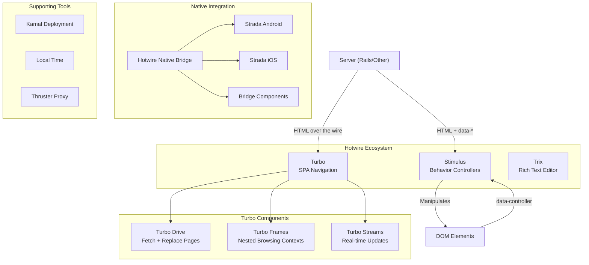

# Project Exploration: Basecamp/Hotwire Ecosystem

## Overview

The Basecamp/Hotwire ecosystem represents a fundamentally different approach to building modern web applications. Instead of the prevailing JSON-heavy, client-side rendered single-page applications (SPAs), Hotwire (HTML Over The Wire) delivers HTML fragments from the server and uses lightweight JavaScript to enhance interactivity. This exploration covers the core Hotwire frameworks—Stimulus, Turbo, and Trix—along with supporting tools in the ecosystem.

## Directory Structure

```
/home/darkvoid/Boxxed/@formulas/src.UIFrameworks/src.basecamp/
├── stimulus/                    # Modest JavaScript framework
│   ├── packages/stimulus/       # Main Stimulus package
│   ├── src/core/                # Core TypeScript source
│   │   ├── controller.ts        # Base Controller class
│   │   ├── application.ts       # Application bootstrap
│   │   ├── router.ts            # Controller router
│   │   ├── dispatcher.ts        # Event dispatcher
│   │   ├── action.ts            # Action handling
│   │   ├── target_observer.ts   # Target observation
│   │   ├── value_observer.ts    # Value observation
│   │   └── value_properties.ts  # Value type system
│   └── docs/handbook/           # Documentation
│
├── turbo/                       # SPA-like navigation without JavaScript
│   ├── src/
│   │   ├── core/
│   │   │   ├── drive/           # Turbo Drive (page navigation)
│   │   │   │   ├── navigator.js
│   │   │   │   ├── visit.js
│   │   │   │   ├── page_renderer.js
│   │   │   │   └── form_submission.js
│   │   │   ├── frames/          # Turbo Frames
│   │   │   │   └── frame_controller.js
│   │   │   ├── streams/         # Turbo Streams
│   │   │   │   ├── stream_actions.js
│   │   │   │   └── stream_message.js
│   │   │   └── morphing.js      # Morphing renderer
│   │   ├── elements/            # Custom elements
│   │   └── http/                # Fetch utilities
│   └── docs/                    # Documentation
│
├── trix/                        # Rich text editor
│   ├── src/trix/
│   │   ├── config/              # Configuration
│   │   ├── controllers/         # Editor controllers
│   │   ├── core/                # Core utilities
│   │   ├── models/              # Document model
│   │   ├── views/               # View rendering
│   │   └── operations/          # Text operations
│   └── action_text-trix/        # Rails Action Text integration
│
├── bridge-components/           # Hotwire Native bridge components
├── hotwire-native-bridge/       # Native bridge for iOS/Android
├── strada-web/                  # Strada web library (deprecated for Hotwire Native)
├── strada-android/              # Strada Android
├── strada-ios/                  # Strada iOS
├── turbo-rails/                 # Turbo Rails integration
├── stimulus-rails/              # Stimulus Rails integration
├── kamal/                       # Zero-downtime deployment
├── kamal-proxy/                 # Request proxy for Kamal
├── local_time/                  # Client-side time formatting
└── thruster/                    # HTTP/2 proxy for Rails
```

## Architecture

### High-Level Diagram



## Hotwire Philosophy

### The HTML Over The Wire Approach

Hotwire represents a return to server-rendered HTML, enhanced with just enough JavaScript to create a compelling user experience. The philosophy is articulated in David Heinemeier Hansson's [The Origin of Stimulus](https://github.com/hotwired/stimulus/blob/main/docs/handbook/00_the_origin_of_stimulus.md):

> "We write a lot of JavaScript at Basecamp, but we don't use it to create 'JavaScript applications' in the contemporary sense. All our applications have server-side rendered HTML at their core, then add sprinkles of JavaScript to make them sparkle."

**Key Principles:**

1. **Server-Rendered HTML**: The server is responsible for generating HTML, not JSON. This keeps business logic on the server where it belongs.

2. **Progressive Enhancement**: HTML works without JavaScript; Stimulus enhances it. The `data-*` attributes are meaningful even without the framework.

3. **State in HTML**: Unlike React/Redux which maintain state in JavaScript objects, Stimulus stores state in the DOM itself. Controllers can be discarded between page changes and reinitialized from the HTML.

4. **Modest JavaScript**: JavaScript is used for manipulation, not creation. Controllers modify existing elements rather than building entire UIs from JSON.

5. **Turbo up high, Stimulus down low**: Turbo handles coarse-grained page navigation, while Stimulus handles fine-grained interactions within a page.

## Stimulus Framework

### Core Concepts

Stimulus is built around four fundamental concepts:

#### 1. Controllers

Controllers are JavaScript classes that extend the base `Controller` class. They connect to DOM elements via `data-controller` attributes.

**Source**: [`stimulus/src/core/controller.ts`](/home/darkvoid/Boxxed/@formulas/src.UIFrameworks/src.basecamp/stimulus/src/core/controller.ts)

```typescript
export class Controller<ElementType extends Element = Element> {
  static blessings = [
    ClassPropertiesBlessing,
    TargetPropertiesBlessing,
    ValuePropertiesBlessing,
    OutletPropertiesBlessing,
  ]
  static targets: string[] = []
  static outlets: string[] = []
  static values: ValueDefinitionMap = {}

  constructor(context: Context) {
    this.context = context
  }

  // Lifecycle methods
  initialize() { }   // Called when controller is instantiated
  connect() { }      // Called when controller is connected to DOM
  disconnect() { }   // Called when controller is disconnected from DOM

  // Properties available in controllers
  get element() { }      // The controller's root element
  get targets() { }      // All target elements
  get outlets() { }      // Connected outlets
  get data() { }         // Data map for data-* attributes
}
```

**HTML Usage:**
```html
<div data-controller="hello">
  <!-- Controller content -->
</div>
```

#### 2. Actions

Actions connect controller methods to DOM events using `data-action` attributes.

**Action Descriptor Format:** `event->controller#method`

```html
<button data-action="click->hello#greet">Greet</button>
```

**Source**: [`stimulus/src/core/action.ts`](/home/darkvoid/Boxxed/@formulas/src.UIFrameworks/src.basecamp/stimulus/src/core/action.ts)

The action descriptor is parsed to extract:
- `event` name (e.g., `click`, `keyup`, `submit`)
- `controller` identifier
- `method` name to invoke

#### 3. Targets

Targets locate significant elements within a controller's scope.

```html
<div data-controller="hello">
  <input data-hello-target="name" type="text">
  <span data-hello-target="output"></span>
</div>
```

```javascript
export default class extends Controller {
  static targets = ["name", "output"]

  greet() {
    this.nameTarget.value    // Access single target
    this.outputTarget.textContent = "Hello!"
    this.nameTargets         // Access all targets (plural)
  }
}
```

**Source**: [`stimulus/src/core/target_observer.ts`](/home/darkvoid/Boxxed/@formulas/src.UIFrameworks/src.basecamp/stimulus/src/core/target_observer.ts)

#### 4. Values

Values provide typed data attributes on controllers with automatic type coercion and observation.

**Source**: [`stimulus/src/core/value_properties.ts`](/home/darkvoid/Boxxed/@formulas/src.UIFrameworks/src.basecamp/stimulus/src/core/value_properties.ts)

```typescript
// Supported value types
export type ValueType = "array" | "boolean" | "number" | "object" | "string"

// Type readers
const readers: { [type: string]: Reader } = {
  array(value: string): any[] { return JSON.parse(value) },
  boolean(value: string): boolean { return !(value == "0" || String(value).toLowerCase() == "false") },
  number(value: string): number { return Number(value.replace(/_/g, "")) },
  object(value: string): object { return JSON.parse(value) },
  string(value: string): string { return value },
}
```

**HTML Usage:**
```html
<div data-controller="list"
     data-list-max-items-value="10"
     data-list-sortable-value="true"
     data-list-tags-value='["a", "b", "c"]'>
</div>
```

```javascript
export default class extends Controller {
  static values = {
    maxItems: Number,
    sortable: Boolean,
    tags: Array
  }

  // Access values
  this.maxItemsValue      // => 10
  this.hasMaxItemsValue   // => true
  this.sortableValue      // => true
}
```

### Application Architecture

**Source**: [`stimulus/src/core/application.ts`](/home/darkvoid/Boxxed/@formulas/src.UIFrameworks/src.basecamp/stimulus/src/core/application.ts)

The Application class is the entry point:

```typescript
export class Application implements ErrorHandler {
  readonly element: Element
  readonly schema: Schema
  readonly dispatcher: Dispatcher
  readonly router: Router

  constructor(element: Element = document.documentElement, schema: Schema = defaultSchema) {
    this.element = element
    this.schema = schema
    this.dispatcher = new Dispatcher(this)
    this.router = new Router(this)
  }

  async start() {
    await domReady()
    this.dispatcher.start()
    this.router.start()
  }

  register(identifier: string, controllerConstructor: ControllerConstructor) {
    this.load({ identifier, controllerConstructor })
  }
}
```

### Observer Pattern

Stimulus uses several observers to watch for DOM changes:

- **Router**: Watches for new `data-controller` attributes
- **TargetObserver**: Watches for new `data-*-target` attributes
- **ValueObserver**: Watches for changes to data attribute values
- **Action Dispatcher**: Handles event delegation

This allows Stimulus to work seamlessly with Turbo's dynamic content loading.

## Turbo Framework

Turbo provides four complementary techniques for building fast, SPA-like applications without writing custom JavaScript.

### Turbo Drive

Turbo Drive accelerates navigation by intercepting link clicks and form submissions, fetching pages via Fetch API, and replacing the document body without a full page reload.

**Source**: [`turbo/src/core/drive/navigator.js`](/home/darkvoid/Boxxed/@formulas/src.UIFrameworks/src.basecamp/turbo/src/core/drive/navigator.js)

```javascript
export class Navigator {
  proposeVisit(location, options = {}) {
    if (this.delegate.allowsVisitingLocationWithAction(location, options.action)) {
      this.delegate.visitProposedToLocation(location, options)
    }
  }

  startVisit(locatable, restorationIdentifier, options = {}) {
    this.stop()
    this.currentVisit = new Visit(this, expandURL(locatable), restorationIdentifier, {
      referrer: this.location,
      ...options
    })
    this.currentVisit.start()
  }

  submitForm(form, submitter) {
    this.stop()
    this.formSubmission = new FormSubmission(this, form, submitter, true)
    this.formSubmission.start()
  }
}
```

**Key Features:**
- **Visit Object**: Encapsulates a page navigation with restoration identifier for history
- **Form Submission**: Handles form POST/PUT/DELETE with fetch
- **Snapshot Cache**: Caches page snapshots for instant back/forward navigation
- **Preloader**: Prefetches linked pages for faster navigation

**Visit Flow:**
1. Intercept link click
2. Create Visit object
3. Fetch page via Fetch API
4. Render response (replace body)
5. Update history state

### Turbo Frames

Turbo Frames create declarative nested browsing contexts that scope navigation to specific page regions.

**Source**: [`turbo/src/core/frames/frame_controller.js`](/home/darkvoid/Boxxed/@formulas/src.UIFrameworks/src.basecamp/turbo/src/core/frames/frame_controller.js)

```javascript
export class FrameController {
  constructor(element) {
    this.element = element
    this.view = new FrameView(this, this.element)
    this.appearanceObserver = new AppearanceObserver(this, this.element)
    this.formLinkClickObserver = new FormLinkClickObserver(this, this.element)
    this.linkInterceptor = new LinkInterceptor(this, this.element)
    this.restorationIdentifier = uuid()
    this.formSubmitObserver = new FormSubmitObserver(this, this.element)
  }

  connect() {
    if (!this.#connected) {
      this.#connected = true
      if (this.loadingStyle == FrameLoadingStyle.lazy) {
        this.appearanceObserver.start()
      } else {
        this.#loadSourceURL()
      }
    }
  }

  async #loadSourceURL() {
    if (this.enabled && this.isActive && !this.complete && this.sourceURL) {
      this.element.loaded = this.#visit(expandURL(this.sourceURL))
      await this.element.loaded
      this.#hasBeenLoaded = true
    }
  }
}
```

**HTML Usage:**
```html
<!-- Lazy-loaded frame -->
<turbo-frame id="comments" src="/comments" loading="lazy">
  <p>Loading comments...</p>
</turbo-frame>

<!-- Frame navigation scoped to frame -->
<turbo-frame id="article">
  <a href="/articles/1/edit" data-turbo-frame="article">Edit</a>
</turbo-frame>
```

**Key Concepts:**
- **Scoped Navigation**: Links and forms within a frame navigate only that frame
- **Lazy Loading**: Frames can load content when visible in viewport
- **Target Attribute**: Forms/links can specify which frame to update
- **Recursion**: Frames can contain nested frames

### Turbo Streams

Turbo Streams deliver real-time updates over WebSocket or in response to form submissions using HTML and CRUD-like actions.

**Source**: [`turbo/src/core/streams/stream_actions.js`](/home/darkvoid/Boxxed/@formulas/src.UIFrameworks/src.basecamp/turbo/src/core/streams/stream_actions.js)

```javascript
export const StreamActions = {
  after() {
    this.targetElements.forEach((e) => e.parentElement?.insertBefore(this.templateContent, e.nextSibling))
  },

  append() {
    this.removeDuplicateTargetChildren()
    this.targetElements.forEach((e) => e.append(this.templateContent))
  },

  before() {
    this.targetElements.forEach((e) => e.parentElement?.insertBefore(this.templateContent, e))
  },

  prepend() {
    this.removeDuplicateTargetChildren()
    this.targetElements.forEach((e) => e.prepend(this.templateContent))
  },

  remove() {
    this.targetElements.forEach((e) => e.remove())
  },

  replace() {
    const method = this.getAttribute("method")
    this.targetElements.forEach((targetElement) => {
      if (method === "morph") {
        morphElements(targetElement, this.templateContent)
      } else {
        targetElement.replaceWith(this.templateContent)
      }
    })
  },

  update() {
    const method = this.getAttribute("method")
    this.targetElements.forEach((targetElement) => {
      if (method === "morph") {
        morphChildren(targetElement, this.templateContent)
      } else {
        targetElement.innerHTML = ""
        targetElement.append(this.templateContent)
      }
    })
  },

  refresh() {
    session.refresh(this.baseURI, this.requestId)
  }
}
```

**Stream Message Format:**
```html
<turbo-stream action="append" target="comments">
  <template>
    <div id="comment_1">New comment</div>
  </template>
</turbo-stream>
```

**Actions:**
- `append`: Add content to end of target
- `prepend`: Add content to beginning of target
- `before`: Insert content before target
- `after`: Insert content after target
- `update`: Replace target's inner HTML
- `replace`: Replace target element entirely
- `remove`: Remove target element
- `refresh`: Refresh the current page

### Relationship Between Drive, Frames, and Streams

```
┌─────────────────────────────────────────────────────────┐
│                    Turbo                                │
├─────────────────┬─────────────────┬─────────────────────┤
│    Turbo Drive  │   Turbo Frames  │   Turbo Streams     │
├─────────────────┼─────────────────┼─────────────────────┤
│ Full page nav   │ Partial updates │ Real-time updates   │
│ via fetch       │ via frames      │ via WebSocket/SSE   │
├─────────────────┼─────────────────┼─────────────────────┤
│ Replaces <body> │ Replaces frame  │ CRUD operations     │
│                 │ content         │ on DOM elements     │
└─────────────────┴─────────────────┴─────────────────────┘
```

## Trix Editor

Trix is a rich text editor designed for everyday writing in web applications. It features a sophisticated document model and handles attachments seamlessly.

### Architecture

**Source Directory**: [`trix/src/trix/`](/home/darkvoid/Boxxed/@formulas/src.UIFrameworks/src.basecamp/trix/src/trix/)

```
trix/src/trix/
├── config/           # Configuration (attachments, blocks, text attributes)
│   ├── attachments.js
│   ├── block_attributes.js
│   ├── text_attributes.js
│   └── toolbar.js
├── controllers/      # Input and editor controllers
│   ├── editor_controller.js
│   ├── input_controller.js
│   ├── composition_controller.js
│   └── toolbar_controller.js
├── core/             # Core utilities
│   ├── collections/  # Data structures
│   └── helpers/      # Utility functions
├── models/           # Document model
│   ├── document.js
│   ├── attachment.js
│   └── piece.js      # Text piece with attributes
├── operations/       # Text operations
└── views/            # View rendering
```

### Key Design Decisions

From the [Trix README](/home/darkvoid/Boxxed/@formulas/src.UIFrameworks/src.basecamp/trix/README.md):

> "Trix sidestepped [contenteditable inconsistencies] by treating `contenteditable` as an I/O device: when input makes its way to the editor, Trix converts that input into an editing operation on its internal document model, then re-renders that document back into the editor."

**Document Model:**
- **Immutable Documents**: Each change creates a new document (enables undo)
- **Position-based Selection**: Selections are ranges of character positions
- **Piece-based Structure**: Text is stored as pieces with attached attributes

**Programmatic API:**

```javascript
const editor = document.querySelector("trix-editor").editor

// Selection
editor.getSelectedRange()        // [start, end]
editor.setSelectedRange([0, 5])  // Select first 5 chars

// Insertion
editor.insertString("Hello")
editor.insertHTML("<strong>Bold</strong>")
editor.insertFile(file)
editor.insertAttachment(attachment)

// Formatting
editor.activateAttribute("bold")
editor.deactivateAttribute("bold")

// Undo/Redo
editor.undo()
editor.redo()
editor.recordUndoEntry("Custom change")
```

### Integration with Action Text

Trix integrates with Rails Action Text for server-side rich text handling:

```
trix/action_text-trix/
```

This provides seamless attachment handling and database storage.

## Other Projects in the Ecosystem

### Hotwire Native Bridge

[`hotwire-native-bridge/`](/home/darkvoid/Boxxed/@formulas/src.UIFrameworks/src.basecamp/hotwire-native-bridge/)

The bridge for native iOS and Android apps, enabling communication between web views and native code. This is the foundation for Hotwire Native development.

### Bridge Components

[`bridge-components/`](/home/darkvoid/Boxxed/@formulas/src.UIFrameworks/src.basecamp/bridge-components/)

A collection of reusable bridge components for Hotwire Native apps:
- Alert, Button, Menu, Toast
- Barcode Scanner, Document Scanner
- Biometrics Lock, Location, Share
- Form, Search, Theme

### Strada (Deprecated)

[`strada-web/`](/home/darkvoid/Boxxed/@formulas/src.UIFrameworks/src.basecamp/strada-web/), [`strada-ios/`](/home/darkvoid/Boxxed/@formulas/src.UIFrameworks/src.basecamp/strada-ios/), [`strada-android/`](/home/darkvoid/Boxxed/@formulas/src.UIFrameworks/src.basecamp/strada-android/)

Strada enabled native controls in hybrid mobile apps driven by web components. Now deprecated in favor of Hotwire Native.

### Kamal Deployment

[`kamal/`](/home/darkvoid/Boxxed/@formulas/src.UIFrameworks/src.basecamp/kamal/)

Zero-downtime deployment tool for web apps anywhere (bare metal, cloud VMs). Uses kamal-proxy to seamlessly switch requests between Docker containers.

### Local Time

[`local_time/`](/home/darkvoid/Boxxed/@formulas/src.UIFrameworks/src.basecamp/local_time/)

Client-side time formatting library. Server renders UTC times (cache-friendly), JavaScript converts to local time in browser.

```ruby
<%= local_time(comment.created_at) %>
```

```html
<!-- Server renders -->
<time datetime="2013-11-27T23:43:22Z">...</time>
<!-- JS converts to local time -->
```

### Rails Integrations

- **turbo-rails**: Turbo integration with Ruby on Rails
- **stimulus-rails**: Stimulus integration with Ruby on Rails
- **hotwire-rails**: Meta-gem (deprecated)

## Key Insights

### 1. The Hotwire Advantage

Hotwire offers a fundamentally simpler approach to web development:
- **No API layer needed**: Server renders HTML directly
- **Faster development**: No need to maintain parallel client/server state
- **Smaller JavaScript bundle**: ~20KB gzipped vs. hundreds of KB for React/Vue
- **Better SEO**: Server-rendered HTML by default

### 2. Stimulus Controller Pattern

The data-* attribute pattern provides excellent readability:

```html
<!-- Self-documenting HTML -->
<div data-controller="clipboard"
     data-clipboard-source-target="input"
     data-clipboard-message-value="Copied!">
  <input data-clipboard-target="input" value="text">
  <button data-action="clipboard#copy">Copy</button>
  <span data-clipboard-target="message"></span>
</div>
```

### 3. Turbo's Progressive Enhancement

Turbo works without JavaScript and enhances when available:
- Links work normally if JS is disabled
- Forms submit traditionally if fetch fails
- Graceful degradation on errors

### 4. Lifecycle Management

Stimulus controllers have a well-defined lifecycle:
```javascript
class extends Controller {
  initialize() {
    // Called once when controller is instantiated
  }

  connect() {
    // Called every time controller connects to DOM
    // Can be called multiple times with Turbo
  }

  disconnect() {
    // Called when controller disconnects from DOM
    // Clean up event listeners, timers, etc.
  }
}
```

### 5. The Monolith Advantage

From the Stimulus Origin document:
> "Having a single, shared interface that can be updated in a single place is key to being able to perform with a small team, despite the many platforms."

Hotwire enables the "majestic monolith" pattern where one codebase serves all platforms.

## Conclusion

The Basecamp/Hotwire ecosystem provides a complete, opinionated approach to web application development that prioritizes simplicity and developer productivity over technical novelty. The key innovations are:

1. **Stimulus**: Modest JavaScript framework using data-* attributes for behavior
2. **Turbo**: SPA-like navigation and updates via HTML over the wire
3. **Trix**: Production-ready rich text editor
4. **Hotwire Native**: Bridge for native mobile app features

Together, these tools enable small teams to build applications with the fluidity of SPAs while maintaining the simplicity of server-rendered HTML.
