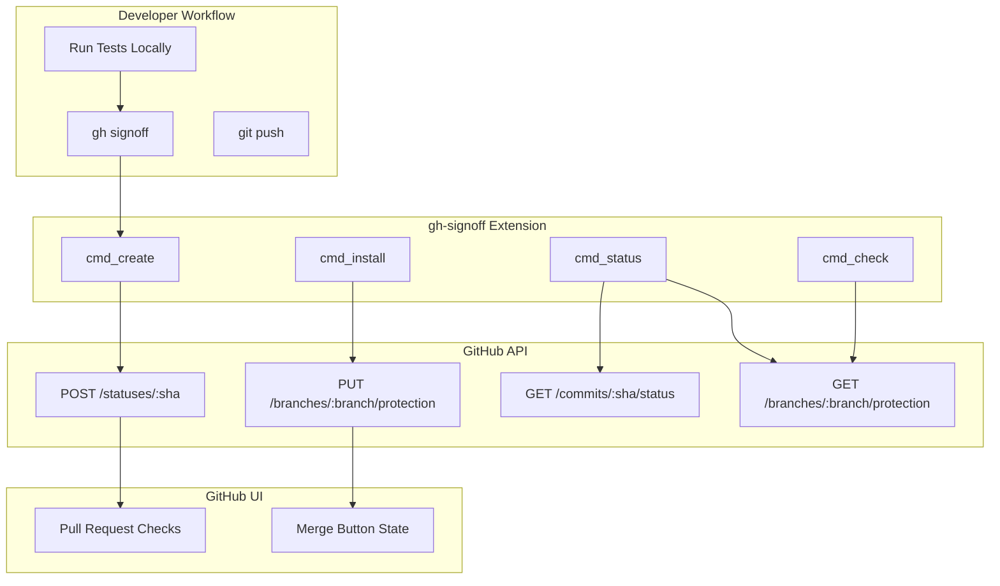

# Deep Dive: GitHub API Integration

## Overview

This deep dive examines gh-signoff's GitHub API integration - how it creates commit statuses, configures branch protection rules, queries status state, and implements partial signoffs through context management.

## Architecture



## GitHub Commit Statuses

### Creating a Status

```bash
#!/usr/bin/env bash
# gh-signoff: cmd_create()

cmd_create() {
  local force=false
  local contexts=()

  # Parse arguments
  while [[ $# -gt 0 ]]; do
    case "$1" in
      -f) force=true; shift ;;
      *) contexts+=("$1"); shift ;;
    esac
  done

  # Verify clean repository (unless forced)
  if ! $force && ! is_clean; then
    fail "repository has uncommitted or unpushed changes"
  fi

  # Get commit information
  local user=$(git config user.name)
  local sha=$(git rev-parse HEAD)

  # Create status for each context
  for context in "${contexts[@]}"; do
    local context_name="signoff"
    [[ -n "$context" ]] && context_name="signoff/${context}"

    gh api \
      --method POST \
      "repos/:owner/:repo/statuses/${sha}" \
      -f state=success \
      -f context="${context_name}" \
      -f description="${user} signed off"
  done
}
```

### Status API Parameters

| Parameter | Type | Description |
|-----------|------|-------------|
| `state` | string | Status state: `success`, `failure`, `pending`, `error` |
| `context` | string | Unique identifier for this status (e.g., `signoff`, `signoff/tests`) |
| `description` | string | Short description shown in GitHub UI |
| `target_url` | string | Optional URL for more details |

### Status Display in GitHub UI

After running `gh signoff`:

```
✓ All checks have passed
  ✓ signoff - Your Name signed off
```

With partial signoffs:

```
✓ 2/4 checks passed
  ✓ signoff/tests - Your Name signed off
  ✓ signoff/lint - Your Name signed off
  ✗ signoff/security - Not yet signed
  ✗ signoff/coverage - Not yet signed
```

## Branch Protection

### Installing Protection

```bash
#!/usr/bin/env bash
# gh-signoff: cmd_install()

cmd_install() {
  local branch=""
  local contexts=()

  # Parse arguments
  while [[ $# -gt 0 ]]; do
    case "$1" in
      --branch) branch="$2"; shift 2 ;;
      *) contexts+=("$1"); shift ;;
    esac
  done

  # Default to default branch
  if [[ -z "$branch" ]]; then
    branch=$(gh api repos/:owner/:repo --jq .default_branch)
  fi

  # Build API fields
  local api_fields=()
  api_fields+=("--field" "required_status_checks[strict]=false")
  api_fields+=("--field" "enforce_admins=null")
  api_fields+=("--field" "required_pull_request_reviews=null")
  api_fields+=("--field" "restrictions=null")

  # Add contexts
  for context in "${contexts[@]}"; do
    local context_name="signoff"
    [[ -n "$context" ]] && context_name="signoff/${context}"
    api_fields+=("--field" "required_status_checks[contexts][]=${context_name}")
  done

  # Set branch protection
  gh api \
    --method PUT \
    "repos/:owner/:repo/branches/${branch}/protection" \
    "${api_fields[@]}"
}
```

### Protection API Parameters

```json
{
  "required_status_checks": {
    "strict": false,
    "contexts": ["signoff", "signoff/tests", "signoff/lint"]
  },
  "enforce_admins": null,
  "required_pull_request_reviews": null,
  "restrictions": null
}
```

### Protection Effects

After `gh signoff install`:

1. **Merge button disabled** until all required statuses are `success`
2. **Applies to everyone** including repository admins
3. **API enforcement** - merges via API also blocked
4. **Per-branch** - can configure different rules per branch

## Clean Repository Check

### Verification Logic

```bash
#!/usr/bin/env bash
# gh-signoff: is_clean()

is_clean() {
  # Check for uncommitted changes
  if [[ -n "$(git status --porcelain)" ]]; then
    debug "found uncommitted changes"
    return 1  # Dirty
  fi

  # Check branch has upstream
  if ! git rev-parse --abbrev-ref @{push} >/dev/null 2>&1; then
    debug "no tracking branch found"
    fail "current branch is not tracking a remote branch"
  fi

  # Check for unpushed commits
  if [[ -n "$(git log @{push}..)" ]]; then
    debug "found unpushed changes"
    return 1  # Unpushed
  fi

  return 0  # Clean
}
```

### What is Checked

| Check | Command | Purpose |
|-------|---------|---------|
| Uncommitted | `git status --porcelain` | No unstaged/uncommitted changes |
| Upstream | `git rev-parse --abbrev-ref @{push}` | Branch tracks remote |
| Unpushed | `git log @{push}..` | No local-only commits |

### Force Flag

```bash
# Bypass clean check (use carefully!)
gh signoff -f

# Typical use cases:
# - You know tests pass but made a documentation change
# - You're updating multiple branches quickly
# - You're scripting signoffs and handle verification separately
```

## Status Querying

### Getting Commit Status

```bash
#!/usr/bin/env bash
# gh-signoff: cmd_status()

cmd_status() {
  local branch=""
  local sha=$(git rev-parse HEAD)

  # Get commit statuses
  local statuses=$(gh api "repos/:owner/:repo/commits/${sha}/status")

  # Get branch protection
  local protection=$(gh api "repos/:owner/:repo/branches/${branch}/protection")

  # Extract required contexts from protection rules
  local required=("signoff")
  while read -r ctx; do
    [[ -z "$ctx" || "$ctx" == "signoff" ]] && continue
    required+=("$ctx")
  done < <(echo "$protection" | jq -r '.required_status_checks?.contexts? | map(select(startswith("signoff"))) | .[]?')

  # Build context→state map
  local context_map=""
  while IFS=$'\t' read -r context state; do
    context_map="${context_map}${context}=${state};"
  done < <(echo "$statuses" | jq -r '.statuses[]? | select(.context? | startswith("signoff")) | [.context, .state] | @tsv')

  # Display status for each required context
  for context in "${required[@]}"; do
    local display_name="$context"
    [[ "$context" == "signoff/"* ]] && display_name="${context#signoff/}"

    if [[ "$context_map" == *"${context}=success;"* ]]; then
      echo "✓ $display_name"
    else
      echo "✗ $display_name"
    fi
  done
}
```

### Status Response Format

```json
{
  "state": "success",
  "statuses": [
    {
      "context": "signoff/tests",
      "state": "success",
      "description": "Alice signed off",
      "created_at": "2024-01-15T10:30:00Z"
    },
    {
      "context": "signoff/lint",
      "state": "success",
      "description": "Alice signed off",
      "created_at": "2024-01-15T10:31:00Z"
    }
  ],
  "sha": "abc1234def5678",
  "total_count": 2
}
```

## Partial Signoffs

### Context Naming Convention

```bash
# Context hierarchy
gh signoff          → context: "signoff"
gh signoff tests    → context: "signoff/tests"
gh signoff lint     → context: "signoff/lint"
gh signoff security → context: "signoff/security"
```

### Installing Multiple Contexts

```bash
# Require multiple signoffs
gh signoff install tests lint security

# Creates branch protection with contexts:
# - signoff/tests
# - signoff/lint  
# - signoff/security

# Sign off on each individually
rails test && gh signoff tests
rubocop && gh signoff lint
bundle audit && gh signoff security

# Or all at once
gh signoff tests lint security
```

### Status Display

```bash
$ gh signoff status
✓ signoff
✓ tests
✓ lint
✗ security

# Shows which contexts are complete and which need signoff
```

## API Rate Limits

### Rate Limit Headers

```bash
# Check rate limits
gh api /rate_limit

# Response:
{
  "resources": {
    "core": {
      "limit": 5000,
      "remaining": 4999,
      "reset": 1642234567
    }
  }
}
```

### Rate Limit Considerations

| Operation | Rate Limit Cost | Typical Usage |
|-----------|-----------------|---------------|
| POST /statuses/:sha | 1 write | Per signoff |
| PUT /branches/:branch/protection | 1 write | Per install |
| GET /commits/:sha/status | 1 read | Per status check |
| GET /branches/:branch/protection | 1 read | Per check/status |

### Mitigation Strategies

```bash
# Cache default branch lookup
DEFAULT_BRANCH=""

default_branch() {
  if [[ -z "$DEFAULT_BRANCH" ]]; then
    DEFAULT_BRANCH=$(gh api repos/:owner/:repo --jq .default_branch)
  fi
  echo "$DEFAULT_BRANCH"
}

# Batch status creation
cmd_create() {
  # Create all statuses in single loop
  for context in "${contexts[@]}"; do
    gh api --method POST "..." &
  done
  wait  # Wait for all parallel requests
}
```

## Error Handling

### Common Errors

```bash
# Repository not found
gh api "repos/:owner/:repo/statuses/${sha}"
# → 404 Not Found

# Solution: Verify repository and permissions
gh repo view

# Permission denied
gh api --method POST "repos/:owner/:repo/statuses/${sha}"
# → 403 Forbidden

# Solution: Ensure write access
gh api "repos/:owner/:repo" --jq .permissions

# Rate limit exceeded
gh api /rate_limit
# → remaining: 0

# Solution: Wait for reset time
```

### Error Messages in gh-signoff

```bash
# fail() function
fail() {
  echo "Error: $*" >&2
  exit 1
}

# Typical error messages:
# - "repository has uncommitted or unpushed changes"
# - "failed to get current commit"
# - "git user.name is not set"
# - "failed to set branch protection"
```

## Bash Completion

### Dynamic Context Completion

```bash
# gh-signoff: cmd_completion()

_gh_signoff_contexts() {
  # Get dynamic contexts from branch protection
  contexts=$(gh signoff completion --contexts 2>/dev/null)
  echo "$contexts"
}

_gh_signoff() {
  local cur prev
  cur="${COMP_WORDS[COMP_CWORD]}"
  prev="${COMP_WORDS[COMP_CWORD-1]}"

  case "$prev" in
    signoff)
      # Include dynamic contexts
      local contexts=$(_gh_signoff_contexts)
      COMPREPLY=( $(compgen -W "create install uninstall check status version -f --help $contexts" -- "$cur") )
      ;;
    create|install|uninstall|check)
      local contexts=$(_gh_signoff_contexts)
      COMPREPLY=( $(compgen -W "--branch $contexts" -- "$cur") )
      ;;
  esac
}

complete -F _gh_signoff gh-signoff
```

### Completion Output

```bash
# Add to ~/.bashrc
eval "$(gh signoff completion)"

# Tab completion now works:
$ gh signoff <TAB>
check      create     install    lint       security   status     tests      uninstall  version
```

## Conclusion

gh-signoff's GitHub API integration provides:

1. **Commit Statuses**: Create success/failure indicators via API
2. **Branch Protection**: Configure required status checks
3. **Context Management**: Support for multiple signoff types
4. **Clean Verification**: Ensure repository state before signoff
5. **Status Querying**: Display current signoff state
6. **Bash Completion**: Dynamic context-aware completion
