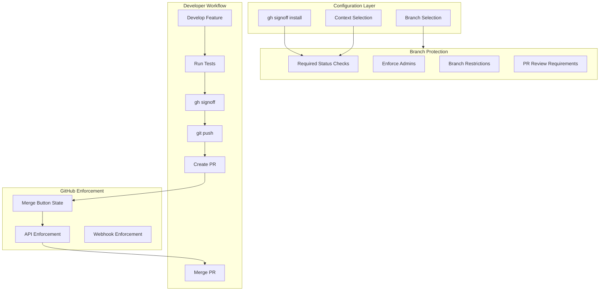

# Deep Dive: Branch Protection Workflows

## Overview

This deep dive examines branch protection workflows with gh-signoff - how to configure protection rules, manage merge requirements, implement team-specific policies, and handle compliance scenarios.

## Architecture



## Branch Protection Configuration

### Basic Installation

```bash
# Install on default branch (main/master)
gh signoff install

# What this does:
# 1. Gets default branch name
# 2. Sets required_status_checks with context ["signoff"]
# 3. Applies to all users including admins
```

### API Call Breakdown

```bash
# gh-signoff: cmd_install()

# Step 1: Get default branch
branch=$(gh api repos/:owner/:repo --jq .default_branch)
# → "main"

# Step 2: Build protection payload
payload=$(cat <<EOF
{
  "required_status_checks": {
    "strict": false,
    "contexts": ["signoff"]
  },
  "enforce_admins": null,
  "required_pull_request_reviews": null,
  "restrictions": null
}
EOF
)

# Step 3: Apply protection
gh api \
  --method PUT \
  "repos/:owner/:repo/branches/${branch}/protection" \
  -H "Accept: application/vnd.github+json" \
  -H "X-GitHub-Api-Version: 2022-11-28" \
  "${payload}"
```

### Protection Response

```json
{
  "url": "https://api.github.com/repos/owner/repo/branches/main/protection",
  "required_status_checks": {
    "url": "...",
    "strict": false,
    "contexts": [
      "signoff"
    ],
    "checks": [
      {
        "context": "signoff",
        "app_id": null
      }
    ]
  },
  "enforce_admins": true,
  "restrictions": null,
  "required_pull_request_reviews": { ... }
}
```

## Multi-Context Protection

### Installing Multiple Contexts

```bash
# Require signoff on multiple CI steps
gh signoff install tests lint security

# Equivalent API call:
gh api \
  --method PUT \
  "repos/:owner/:repo/branches/main/protection" \
  -f "required_status_checks[strict]=false" \
  -f "required_status_checks[contexts][]=signoff/tests" \
  -f "required_status_checks[contexts][]=signoff/lint" \
  -f "required_status_checks[contexts][]=signoff/security" \
  -f "enforce_admins=null" \
  -f "required_pull_request_reviews=null" \
  -f "restrictions=null"
```

### Context Organization Patterns

#### By CI Step Type

```bash
# Organize by test category
gh signoff install \
  tests/unit \
  tests/integration \
  tests/e2e \
  lint \
  security \
  coverage
```

#### By Platform

```bash
# Organize by build platform
gh signoff install \
  linux \
  macos \
  windows
```

#### By Role

```bash
# Organize by team role
gh signoff install \
  dev \
  qa \
  ops \
  security
```

### Signoff Workflow for Multiple Contexts

```bash
#!/bin/bash
# script/signoff-all

set -e

echo "Running unit tests..."
rails test:unit && gh signoff tests/unit

echo "Running integration tests..."
rails test:integration && gh signoff tests/integration

echo "Running linter..."
rubocop && gh signoff lint

echo "Running security scan..."
bundle audit && gh signoff security

echo "All checks passed and signed off!"
```

## Branch-Specific Configuration

### Different Rules Per Branch

```bash
# Main branch - strictest rules
gh signoff install --branch main tests lint security

# Staging branch - moderate rules  
gh signoff install --branch staging tests lint

# Development branch - minimal rules
gh signoff install --branch develop tests
```

### Branch Protection Matrix

| Branch | Required Contexts | Enforce Admins | PR Reviews |
|--------|------------------|----------------|------------|
| `main` | signoff, tests, lint, security | Yes | 2 required |
| `staging` | signoff, tests | Yes | 1 required |
| `develop` | signoff | No | 0 required |
| `feature/*` | None | No | 0 required |

### Checking Branch Configuration

```bash
# Check if signoff is required on current branch
gh signoff check

# Check specific branch
gh signoff check --branch main

# Check multiple contexts
gh signoff check --branch main tests lint security

# Output examples:
# ✓ GitHub main branch requires signoff
# ✓ GitHub main branch requires signoff on tests
# ✓ GitHub main branch requires signoff on lint
# ✗ GitHub main branch does not require signoff on coverage
```

## Merge Enforcement

### GitHub UI Enforcement

When branch protection is active:

```
┌─────────────────────────────────────────────────────────────┐
│  Merging is blocked                                          │
│                                                              │
│  • 1/4 required checks pending                               │
│    - ✓ signoff/tests                                         │
│    - ✓ signoff/lint                                          │
│    - ✓ signoff/security                                      │
│    - ✗ signoff/coverage                                      │
│                                                              │
│  [Merge pull request] ← Disabled                             │
└─────────────────────────────────────────────────────────────┘
```

### API Enforcement

```bash
# Attempting merge via API without signoff
gh pr merge --merge

# Response:
# Error: Merging is blocked by branch protection rules.
# Required status checks: signoff/tests, signoff/lint, signoff/security
```

### Bypassing Protection

| Method | Bypasses Protection | Requirements |
|--------|---------------------|--------------|
| Merge button | No | All checks must pass |
| `gh pr merge` | No | All checks must pass |
| GitHub admin | Yes (if not enforced) | Admin permissions |
| API with bypass | Yes | Special tokens |

## Team Workflows

### Small Team (1-5 developers)

```bash
# Simple setup - single signoff
gh signoff install

# Workflow:
# 1. Developer runs tests locally
# 2. Developer signs off: gh signoff
# 3. Developer pushes and creates PR
# 4. Anyone can merge after review
```

### Medium Team (5-20 developers)

```bash
# Multiple contexts for different checks
gh signoff install tests lint security

# Workflow:
# 1. Developer runs full test suite
# 2. Developer signs off on all: gh signoff tests lint security
# 3. PR requires code review + signoffs
# 4. Senior dev approves merge
```

### Large Team (20+ developers)

```bash
# Role-based signoffs
gh signoff install \
  dev/tests \
  qa/approval \
  security/scan \
  ops/deployable

# Workflow:
# 1. Developer signs off on code: gh signoff dev/tests
# 2. QA team member signs off: gh signoff qa/approval
# 3. Security scan automated: gh signoff security/scan
# 4. Ops lead signs off: gh signoff ops/deployable
```

## Compliance Patterns

### SOX Compliance

```bash
# Require separation of duties
gh signoff install \
  developer/signoff \
  reviewer/approval \
  qa/testing

# Policy:
# - Developer cannot review their own code
# - QA must verify before merge
# - All signoffs audited in GitHub
```

### HIPAA Compliance

```bash
# Require security and privacy signoffs
gh signoff install \
  security/scan \
  privacy/review \
  tests/hipaa

# Additional controls:
# - Security scan must pass
# - Privacy officer review required
# - HIPAA-specific tests required
```

### SOC 2 Compliance

```bash
# Change management workflow
gh signoff install \
  change/request \
  change/review \
  change/approval \
  tests/regression

# Audit trail:
# - All changes logged
# - Reviews documented
# - Approvals tracked
```

## Error Scenarios

### Missing Context

```bash
# Try to sign off on non-configured context
gh signoff nonexistent

# GitHub API response:
# 422 Validation Failed
# - Field: context
# - Message: Context 'signoff/nonexistent' is not configured
```

### Wrong Branch

```bash
# Check signoff on wrong branch
gh signoff check --branch nonexistent

# Output:
# ✗ GitHub nonexistent branch does not require signoff
# (Branch may not exist or has no protection)
```

### Race Condition

```bash
# Two developers sign off simultaneously
gh signoff tests &
gh signoff tests &
wait

# Result: Both succeed (idempotent operation)
# Last writer's description sticks
```

## Combining with Other Protection Rules

### Stack with PR Reviews

```bash
# Install signoff
gh signoff install tests

# Add PR review requirement (via GitHub UI or API)
gh api \
  --method PUT \
  "repos/:owner/:repo/branches/main/protection" \
  -f "required_status_checks[contexts][]=signoff" \
  -f "required_pull_request_reviews[required_approving_review_count]=2" \
  -f "required_pull_request_reviews[dismiss_stale_reviews]=true"
```

### Stack with Required Linear History

```bash
# Install signoff + linear history
gh signoff install tests

gh api \
  --method PUT \
  "repos/:owner/:repo/branches/main/protection" \
  -f "required_status_checks[contexts][]=signoff" \
  -f "required_linear_history=true"
```

### Stack with Signed Commits

```bash
# Install signoff + signed commits
gh signoff install tests

gh api \
  --method PUT \
  "repos/:owner/:repo/branches/main/protection" \
  -f "required_status_checks[contexts][]=signoff" \
  -f "required_signatures=true"
```

## Migration Strategies

### From GitHub Actions

```bash
# Phase 1: Run parallel (Week 1-2)
# - Keep GitHub Actions CI
# - Install gh-signoff
# - Team uses both

# Phase 2: Require signoff (Week 3)
gh signoff install tests lint

# Phase 3: Reduce CI frequency (Week 4)
# - Change Actions to nightly only
# - Signoff handles PR workflow

# Phase 4: Evaluate (Week 5+)
# - Remove Actions for PRs if team disciplined
# - Keep nightly CI as safety net
```

### From CircleCI

```bash
# Phase 1: Hybrid workflow
# 1. Developer runs tests locally
# 2. gh signoff on success
# 3. Push triggers CircleCI (non-blocking)
# 4. Nightly CircleCI run is authoritative

# Phase 2: Transition
# - Make CircleCI scheduled only
# - PRs use signoff exclusively
```

### From Jenkins

```bash
# Similar to CircleCI migration
# Keep Jenkins for:
# - Full regression suites
# - Performance tests
# - Release builds
# Use signoff for:
# - PR workflow
# - Quick feedback
```

## Conclusion

Branch protection workflows with gh-signoff provide:

1. **Flexible Configuration**: Single or multiple contexts per branch
2. **Team Scalability**: From solo to enterprise workflows
3. **Compliance Support**: Audit trails and separation of duties
4. **Rule Stacking**: Combine with other GitHub protection features
5. **Migration Paths**: Transition from traditional CI gradually
