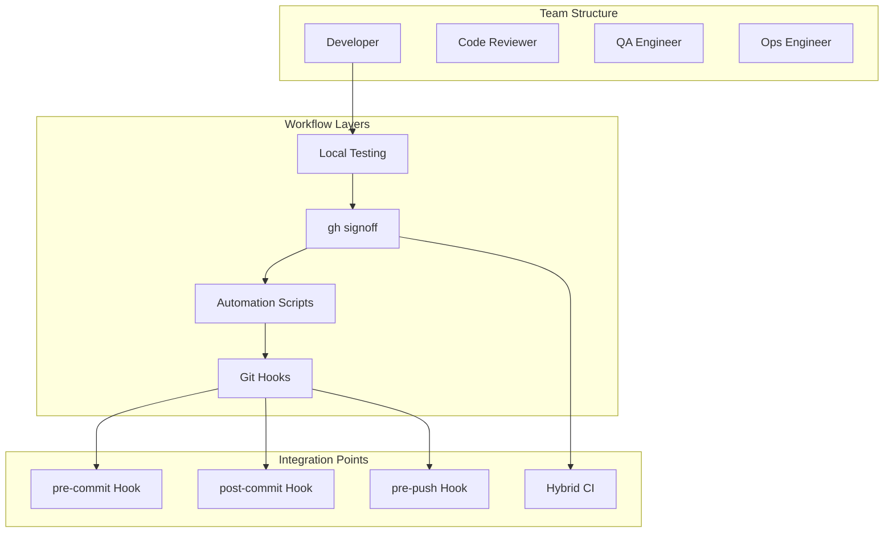

# Deep Dive: Team Workflows and Scripting

## Overview

This deep dive examines team workflows with gh-signoff - how teams coordinate signoffs, automate via scripting, integrate with git hooks, implement hybrid CI approaches, and migrate from traditional CI systems.

## Architecture



## Team Coordination Patterns

### Signoff Responsibilities

| Role | Signoff Context | Responsibility |
|------|----------------|----------------|
| Developer | `signoff/tests` | Tests pass locally |
| Developer | `signoff/lint` | Code style passes |
| QA | `signoff/qa` | Manual testing complete |
| Security | `signoff/security` | Security review done |
| Ops | `signoff/deployable` | Deployment ready |

### Multi-Developer Workflow

```bash
# Developer A works on feature
git checkout -b feature/new-feature
# ... make changes ...
rails test && gh signoff tests
git push origin feature/new-feature

# Developer B reviews
gh pr review --approve
gh signoff qa  # After manual testing

# Merge button enabled when all signoffs present
gh pr merge --merge --delete-branch
```

### Signoff Handoff Pattern

```bash
#!/bin/bash
# script/handoff - Hand off feature for QA testing

echo "Feature ready for QA review"
echo "Signing off on development..."

# Developer signoff
gh signoff dev/tests dev/lint

# Create PR for review
gh pr create \
  --title "Feature: New functionality" \
  --body "Ready for QA review. Tests passing locally." \
  --label "needs-qa"

# Notify QA team
gh api \
  --method POST \
  "repos/:owner/:repo/issues/${PR_NUMBER}/comments" \
  -f "body=@-" <<EOF
@qa-team Ready for testing!

**Tested locally:**
- ✓ Unit tests passing
- ✓ Linting clean
- ✓ Manual smoke test done

**QA checklist:**
- [ ] Functional testing
- [ ] Regression testing  
- [ ] Edge case testing
EOF
```

## Scripting Signoffs

### Automated Test + Signoff

```bash
#!/bin/bash
# script/ci - Local CI replacement

set -euo pipefail

echo "=== Local CI Pipeline ==="

# Track which signoffs we complete
declare -a completed_signoffs=()

# Unit tests
echo "Running unit tests..."
if rails test:unit; then
  completed_signoffs+=("tests/unit")
  echo "✓ Unit tests passed"
else
  echo "✗ Unit tests failed"
  exit 1
fi

# Integration tests
echo "Running integration tests..."
if rails test:integration; then
  completed_signoffs+=("tests/integration")
  echo "✓ Integration tests passed"
else
  echo "✗ Integration tests failed"
  exit 1
fi

# Linting
echo "Running linter..."
if rubocop; then
  completed_signoffs+=("lint")
  echo "✓ Linting passed"
else
  echo "✗ Linting failed"
  exit 1
fi

# Security scan
echo "Running security scan..."
if bundle audit && npm audit; then
  completed_signoffs+=("security")
  echo "✓ Security scan passed"
else
  echo "✗ Security scan found issues"
  exit 1
fi

# All checks passed - sign off
echo ""
echo "All checks passed! Signing off..."
gh signoff "${completed_signoffs[@]}"

echo ""
echo "✓ Ready to push!"
```

### Conditional Signoff

```bash
#!/bin/bash
# script/signoff-if-green - Only signoff if everything passes

set -euo pipefail

# Run full test suite
if ! rails test; then
  echo "Tests failed, not signing off"
  exit 1
fi

# Run linter
if ! rubocop; then
  echo "Linting failed, not signing off"
  exit 1
fi

# Check for uncommitted changes
if [[ -n "$(git status --porcelain)" ]]; then
  echo "Uncommitted changes, not signing off"
  exit 1
fi

# All good - sign off
gh signoff
echo "✓ Signed off on $(git rev-parse --short HEAD)"
```

### Batch Signoff for Multiple Repos

```bash
#!/bin/bash
# script/batch-signoff - Signoff across multiple repositories

set -euo pipefail

repos=(
  "~/projects/app-main"
  "~/projects/app-api"
  "~/projects/app-frontend"
)

for repo in "${repos[@]}"; do
  cd "$repo"
  
  echo "=== $(basename "$repo") ==="
  
  # Check if repo uses signoff
  if ! gh signoff check >/dev/null 2>&1; then
    echo "  Signoff not required, skipping"
    continue
  fi
  
  # Run tests
  if rails test >/dev/null 2>&1; then
    gh signoff
    echo "  ✓ Signed off"
  else
    echo "  ✗ Tests failed"
  fi
done
```

## Git Hooks Integration

### Pre-commit Hook

```bash
#!/bin/bash
# .git/hooks/pre-commit

set -euo pipefail

echo "Running pre-commit checks..."

# Run fast checks only (full suite comes later)
if ! rubocop --format quiet >/dev/null 2>&1; then
  echo "✗ Linting failed"
  exit 1
fi

# Run changed file tests
if ! rails test:changed >/dev/null 2>&1; then
  echo "✗ Tests failed for changed files"
  exit 1
fi

echo "✓ Pre-commit checks passed"
exit 0
```

### Pre-push Hook

```bash
#!/bin/bash
# .git/hooks/pre-push

set -euo pipefail

echo "Running pre-push checks..."

# Full test suite
if ! rails test >/dev/null 2>&1; then
  echo "✗ Full test suite failed"
  exit 1
fi

# Check for signoff requirement
if gh signoff check >/dev/null 2>&1; then
  # Signoff required - check if we have it
  status=$(gh signoff status 2>/dev/null || true)
  
  if echo "$status" | grep -q "✗"; then
    echo "✗ Missing required signoffs:"
    echo "$status"
    exit 1
  fi
else
  # Signoff not required - create status
  echo "Creating signoff..."
  gh signoff
fi

echo "✓ Pre-push checks passed"
exit 0
```

### Post-commit Hook (Auto-signoff)

```bash
#!/bin/bash
# .git/hooks/post-commit

# Only run in development (not CI)
if [[ -n "${CI:-}" ]]; then
  exit 0
fi

# Run tests quietly
if rails test --quiet >/dev/null 2>&1; then
  # Signoff silently if tests pass
  gh signoff 2>/dev/null || true
fi
```

### Installing Hooks

```bash
#!/bin/bash
# script/install-hooks - Install git hooks for all team members

REPO_ROOT=$(git rev-parse --show-toplevel)
HOOKS_DIR="$REPO_ROOT/.git-hooks"

mkdir -p "$HOOKS_DIR"

# Copy hooks
cp "$REPO_ROOT/.github/hooks/pre-commit" "$HOOKS_DIR/"
cp "$REPO_ROOT/.github/hooks/pre-push" "$HOOKS_DIR/"
chmod +x "$HOOKS_DIR"/*

# Configure git to use hooks
git config core.hooksPath "$HOOKS_DIR"

echo "✓ Git hooks installed"
echo ""
echo "Hooks installed:"
echo "  - pre-commit: Fast linting and changed-file tests"
echo "  - pre-push: Full test suite and signoff"
```

## Hybrid CI Approaches

### Local CI + Nightly Cloud CI

```yaml
# .github/workflows/ci.yml

name: CI

on:
  # Nightly full CI
  schedule:
    - cron: "0 2 * * *"  # 2 AM daily
  
  # CI on pushes to main (for direct pushes)
  push:
    branches: [main]
  
  # Manual trigger
  workflow_dispatch:

jobs:
  test:
    runs-on: ubuntu-latest
    
    steps:
      - uses: actions/checkout@v4
      
      - name: Setup Ruby
        uses: ruby/setup-ruby@v1
        with:
          ruby-version: 3.2
          bundler-cache: true
      
      - name: Run tests
        run: bundle exec rails test
      
      - name: Run linter
        run: bundle exec rubocop
      
      - name: Security scan
        run: bundle audit
```

### PR Workflow with Cloud Fallback

```yaml
# .github/workflows/pr-verify.yml

name: PR Verification

on:
  pull_request:
    branches: [main]

jobs:
  verify-signoff:
    runs-on: ubuntu-latest
    steps:
      - name: Check for signoff status
        uses: actions/github-script@v7
        with:
          script: |
            const { data: status } = await github.rest.repos.getCombinedStatusForRef({
              owner: context.repo.owner,
              repo: context.repo.repo,
              ref: context.sha
            });
            
            const signoffStatuses = status.statuses.filter(s => 
              s.context.startsWith('signoff')
            );
            
            if (signoffStatuses.length === 0) {
              core.setFailed('No signoff found. Run "gh signoff" locally.');
            }
            
            const missing = signoffStatuses.filter(s => s.state !== 'success');
            if (missing.length > 0) {
              core.setFailed(`Missing signoffs: ${missing.map(s => s.context).join(', ')}`);
            }
            
            console.log('✓ All signoffs present');
  
  smoke-test:
    runs-on: ubuntu-latest
    # Only run if signoff verification fails (safety net)
    if: failure()
    steps:
      - uses: actions/checkout@v4
      - run: bundle install
      - run: rails test
```

### Staged Rollout Pattern

```bash
#!/bin/bash
# script/staged-deploy - Deploy with staged signoffs

set -euo pipefail

echo "=== Staged Deployment ==="

# Stage 1: Development
echo "Stage 1: Development signoff"
gh signoff dev/tests dev/lint
echo "✓ Development complete"

# Stage 2: QA (after manual testing)
read -p "Has QA completed testing? (y/n) " -n 1 -r
if [[ $REPLY =~ ^[Yy]$ ]]; then
  gh signoff qa/testing
  echo "✓ QA complete"
else
  echo "QA not complete, stopping"
  exit 1
fi

# Stage 3: Production signoff
read -p "Ready for production? (y/n) " -n 1 -r
if [[ $REPLY =~ ^[Yy]$ ]]; then
  gh signoff ops/deployable
  echo "✓ Production signoff complete"
  
  # Merge and deploy
  gh pr merge --merge --delete-branch
else
  echo "Not ready for production"
  exit 1
fi
```

## Migration from Traditional CI

### Assessment Phase

```bash
#!/bin/bash
# script/ci-assessment - Analyze current CI usage

echo "=== CI Usage Assessment ==="

# Get CI run statistics
echo ""
echo "CI runs in last 30 days:"
gh api \
  "repos/:owner/:repo/actions/workflows" \
  --jq '.workflows[] | "\(.name): \(.id)"'

# Check average run time
echo ""
echo "Average CI run duration:"
gh api \
  "repos/:owner/:repo/actions/runs?per_page=100" \
  --jq '[.workflow_runs[].run_duration_ms] | add / length / 1000'

# Check failure rate
echo ""
echo "CI failure rate:"
gh api \
  "repos/:owner/:repo/actions/runs?per_page=100" \
  --jq '[.workflow_runs[].conclusion] | group_by(.) | map({(.[0]): length}) | add'
```

### Migration Script

```bash
#!/bin/bash
# script/migrate-to-local-ci - Migrate from cloud CI

set -euo pipefail

echo "=== Migrating to Local CI ==="

# Step 1: Install gh-signoff
echo ""
echo "Step 1: Installing gh-signoff..."
if ! gh extension list | grep -q signoff; then
  gh extension install basecamp/gh-signoff
  echo "✓ gh-signoff installed"
else
  echo "✓ gh-signoff already installed"
fi

# Step 2: Configure branch protection
echo ""
echo "Step 2: Configuring branch protection..."
gh signoff install tests lint

# Step 3: Update CI workflow (don't delete, just reduce)
echo ""
echo "Step 3: Creating hybrid CI workflow..."
cat > .github/workflows/ci-nightly.yml <<'EOF'
name: CI (Nightly)

on:
  schedule:
    - cron: "0 2 * * *"

jobs:
  test:
    runs-on: ubuntu-latest
    steps:
      - uses: actions/checkout@v4
      - run: bundle install
      - run: rails test
EOF

# Remove old workflow
rm -f .github/workflows/ci.yml

echo "✓ Migration complete!"
echo ""
echo "Next steps:"
echo "1. Team members install gh-signoff: gh extension install basecamp/gh-signoff"
echo "2. Run tests locally: rails test"
echo "3. Sign off: gh signoff"
echo "4. Push and create PR"
```

### Team Onboarding

```bash
#!/bin/bash
# script/onboard-team - Onboard team to local CI

echo "=== Local CI Team Onboarding ==="

# Create onboarding document
cat <<'ONBOARDING' > docs/LOCAL_CI_ONBOARDING.md
# Local CI Onboarding

## Quick Start

1. Install GitHub CLI: https://cli.github.com
2. Install gh-signoff: `gh extension install basecamp/gh-signoff`
3. Authenticate: `gh auth login`

## Workflow

```bash
# Make changes
git checkout -b feature/my-feature

# Run tests
rails test

# Sign off when tests pass
gh signoff

# Push and create PR
git push origin feature/my-feature
gh pr create
```

## Why Local CI?

- Faster feedback (30s vs 2-5 min)
- No CI costs
- Uses your fast laptop
- Same GitHub integration
ONBOARDING

echo "✓ Onboarding document created: docs/LOCAL_CI_ONBOARDING.md"

# Schedule onboarding session
echo ""
echo "Next: Schedule team onboarding session"
echo "Share the onboarding document and do a live demo"
```

## Monitoring and Metrics

### Signoff Tracking

```bash
#!/bin/bash
# script/signoff-metrics - Track signoff usage

echo "=== Signoff Metrics ==="

# Get recent commits with signoffs
echo ""
echo "Signoffs in last 7 days:"
gh api \
  "repos/:owner/:repo/commits?since=$(date -d '7 days ago' -Iseconds)" \
  --jq '[.[] | select(.commit.message | contains("signed off"))] | length'

# Get signoff contexts in use
echo ""
echo "Active signoff contexts:"
gh api \
  "repos/:owner/:repo/branches/main/protection" \
  --jq '.required_status_checks.contexts[]'

# Calculate signoff rate
echo ""
echo "Signoff compliance rate:"
total=$(gh api "repos/:owner/:repo/commits?per_page=100" --jq 'length')
with_signoff=$(gh api "repos/:owner/:repo/commits?per_page=100" --jq '[.[] | select(.commit.message | contains("signed off"))] | length')
echo "$(echo "scale=1; $with_signoff * 100 / $total" | bc)%"
```

## Conclusion

Team workflows with gh-signoff provide:

1. **Clear Responsibilities**: Each role has specific signoffs
2. **Automation**: Scripts for common workflows
3. **Git Integration**: Hooks for automatic checks
4. **Hybrid Approaches**: Local speed + cloud safety
5. **Migration Paths**: Gradual transition from traditional CI
