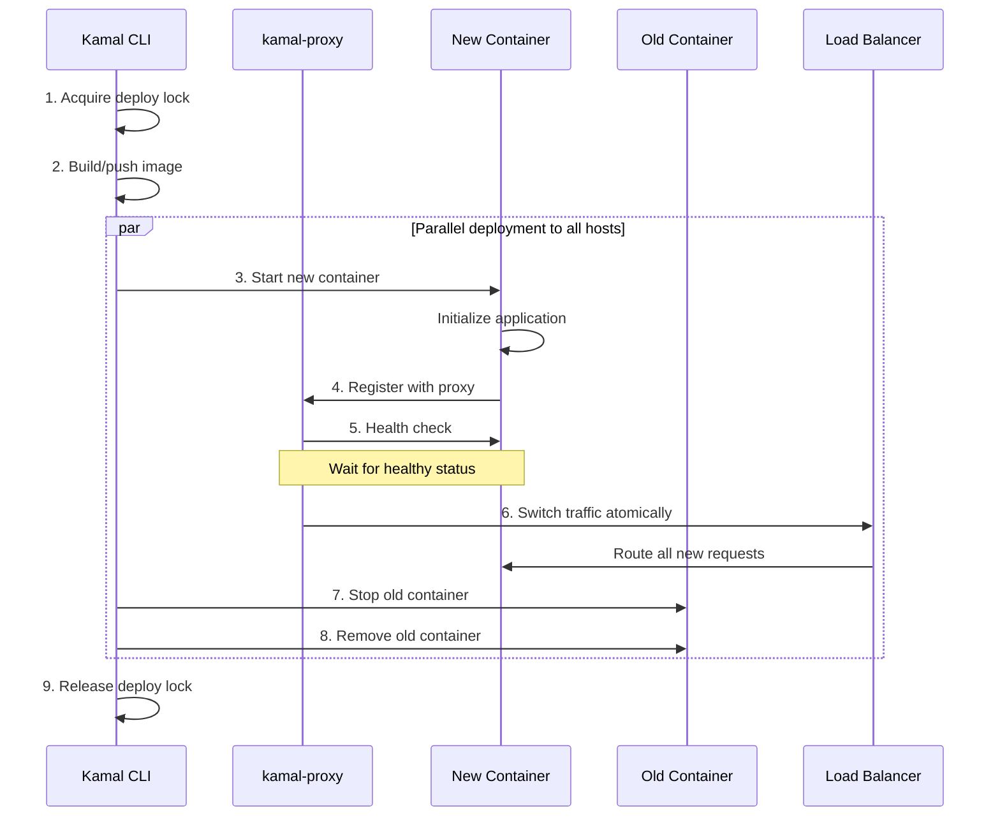
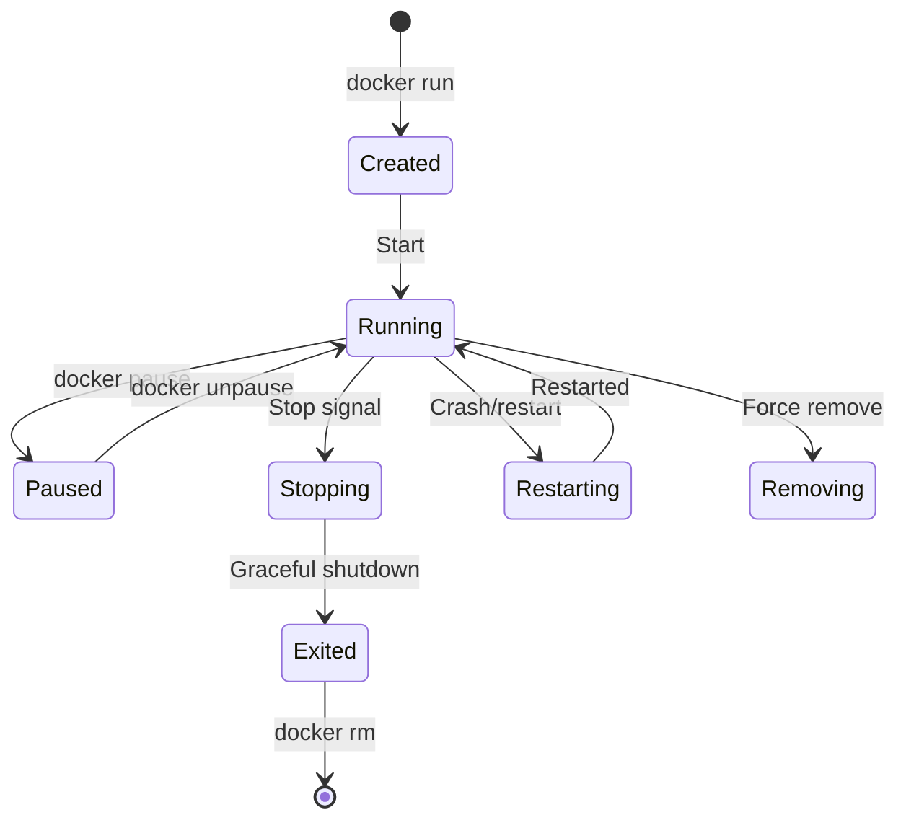

# Deep Dive: Deployment Workflow and Container Lifecycle

## Overview

This deep dive examines Kamal's deployment workflow - how containers are managed through their lifecycle, the deployment phases, health checking mechanisms, and the atomic traffic switching that enables zero-downtime deploys.

## Architecture



## Deployment Phases

### Phase 1: Pre-Deployment

```ruby
# lib/kamal/cli/deploy.rb

class Kamal::Cli::Deploy < Kamal::Cli::Base
  def deploy
    run_hook "pre-deploy"  # Custom pre-deploy hooks
    
    # Acquire deploy lock
    with_lock do
      # Verify prerequisites
      verify_image_accessible
      verify_servers_reachable
      verify_disk_space
      
      # Generate deploy report
      print_deploy_plan
    end
  end
  
  private
  
  def verify_image_accessible
    on_roles(all) do |host, role|
      # Check if image can be pulled
      execute *KAMAL.docker.verify_image(config.absolute_image)
    end
  end
  
  def verify_disk_space
    on_roles(all) do |host, role|
      # Check available disk space
      space = execute *KAMAL.docker.available_space
      raise "Insufficient disk space" if space < MIN_SPACE
    end
  end
end
```

### Phase 2: Container Startup

```ruby
# lib/kamal/commands/app.rb

class Kamal::Commands::App
  def run(hostname: nil)
    docker :run,
      "--detach",
      "--restart unless-stopped",
      "--name", container_name,
      "--network", "kamal",
      
      # Hostname for container
      *([ "--hostname", hostname ] if hostname),
      
      # Kamal metadata
      "--env", "KAMAL_CONTAINER_NAME=\"#{container_name}\"",
      "--env", "KAMAL_VERSION=\"#{config.version}\"",
      "--env", "KAMAL_HOST=\"#{host}\"",
      
      # Environment variables from config
      *role.env_args(host),
      
      # Logging configuration
      *role.logging_args,
      
      # Volume mounts
      *config.volume_args,
      
      # Asset volume for public files
      *role.asset_volume_args,
      
      # Docker labels for identification
      *role.label_args,
      
      # Custom Docker options
      *role.option_args,
      
      # Image and command
      config.absolute_image,
      role.cmd
  end
  
  def container_name
    # Format: {service}-{role}-{destination}-{version}
    "#{config.service}-#{role.name}-#{config.destination}-#{config.version}"
  end
end
```

### Phase 3: Proxy Registration

```ruby
# lib/kamal/commands/proxy.rb

class Kamal::Commands::Proxy
  def deploy(app_name:, target:, host:, tls:)
    # Tell kamal-proxy to route traffic to new container
    proxy_cmd :deploy,
      "--app", app_name,
      "--target", target,         # Container ID or name
      "--host", host,             # Host address
      *("--tls" if tls),          # Enable TLS if configured
      "--drain-time", drain_time  # Graceful drain period
  end
  
  def proxy_cmd(*args)
    docker :exec,
      container_name,            # kamal-proxy container
      "kamal-proxy",
      *args
  end
end
```

## Health Check System

### Docker Health Checks

```ruby
# lib/kamal/cli/healthcheck/poller.rb

class Kamal::Cli::Healthcheck::Poller
  def initialize(host, role, config)
    @host = host
    @role = role
    @config = config
  end
  
  def wait_for_healthy(container_name, timeout: 30)
    start = Time.now
    
    while Time.now - start < timeout
      status = docker_inspect_health(container_name)
      
      case status
      when "healthy"
        return true
      when "unhealthy"
        return false
      when "starting"
        sleep 1
      else
        # Container not yet initialized
        sleep 1
      end
    end
    
    raise HealthcheckTimeoutError, 
      "Health check timed out after #{timeout}s for #{container_name}"
  end
  
  def docker_inspect_health(container_name)
    # Get health status from Docker
    inspect = execute *docker.inspect(
      container_name,
      format: "{{.State.Health.Status}}"
    )
    
    inspect.strip
  rescue
    # If no healthcheck defined, consider healthy
    "healthy"
  end
end
```

### Custom Health Check Commands

```ruby
# lib/kamal/commands/app.rb

class Kamal::Commands::App
  def healthcheck
    # Run custom health check command
    docker :exec,
      container_name,
      *config.healthcheck.cmd
    
    # Returns exit code: 0 = healthy, non-zero = unhealthy
  end
  
  def readycheck
    # Run ready check (lighter than full health check)
    docker :exec,
      container_name,
      *config.readycheck.cmd
  end
end
```

### Dockerfile Health Check

```dockerfile
# Example Dockerfile with health check

FROM ruby:3.2-slim

WORKDIR /app

# Install dependencies
RUN apt-get update && apt-get install -y \
    curl \
    && rm -rf /var/lib/apt/lists/*

# Copy application
COPY . .

# Install gems
RUN bundle install

# Precompile assets
RUN bundle exec rails assets:precompile

# Health check configuration
HEALTHCHECK \
  --interval=5s \
  --timeout=3s \
  --start-period=30s \
  --retries=3 \
  CMD curl -f http://localhost:3000/up || exit 1

# Start application
CMD ["bundle", "exec", "rails", "server"]
```

## Container Lifecycle

### Lifecycle States

```ruby
# lib/kamal/app.rb

module Kamal::App
  class ContainerLifecycle
    STATES = %w[
      created
      running
      paused
      restarting
      removing
      exited
      dead
    ]
    
    def state(container_id)
      # Get container state from Docker
      result = execute *docker.inspect(
        container_id,
        format: "{{.State.Status}}"
      )
      result.strip
    end
    
    def healthy?(container_id)
      # Check if container is healthy
      result = execute *docker.inspect(
        container_id,
        format: "{{.State.Health.Status}}"
      )
      status = result.strip
      status == "healthy" || status == "" # Empty = no healthcheck defined
    end
  end
end
```

### State Transitions



### Graceful Shutdown

```ruby
# lib/kamal/commands/app.rb

class Kamal::Commands::App
  def stop(version: nil, timeout: 30)
    # Send SIGTERM, then SIGKILL after timeout
    pipe \
      version ? container_id_for_version(version) : current_running_container_id,
      xargs(docker(:stop, "--time", timeout))
  end
  
  def drain(version: nil)
    # Tell container to stop accepting new connections
    # Wait for in-flight requests to complete
    pipe \
      container_id_for_version(version),
      xargs(docker(:exec, "-", "kamal-drain"))
  end
end
```

### Shutdown Hook in Application

```ruby
# Rails example: config/initializers/shutdown.rb

Rails.application.config.after_initialize do
  # Register shutdown hook
  at_exit do
    # Stop accepting new connections
    Rails.application.executor.shutdown do
      # Wait for in-flight requests
      sleep 1
    end
    
    # Cleanup resources
    ActiveRecord::Base.connection_pool.disconnect!
  end
end
```

## Rolling Deploys

### Rolling Deploy Strategy

```ruby
# lib/kamal/cli/deploy.rb

class Kamal::Cli::Deploy
  def rolling_deploy
    # Deploy to servers one at a time
    role_servers.each do |server_group|
      # 1. Deploy to first server
      deploy_to_servers(server_group)
      
      # 2. Wait for health check
      wait_for_healthy(server_group)
      
      # 3. Verify traffic switching
      verify_traffic_switching(server_group)
      
      # 4. Continue to next group only if successful
      break unless deploy_successful?
    end
  end
  
  def deploy_to_servers(servers)
    on_hosts(servers) do |host, role|
      # Standard deploy steps
      execute *KAMAL.app(role: role, host: host).run
      execute *KAMAL.proxy.deploy(...)
      wait_for_healthy(host)
      execute *KAMAL.app(role: role, host: host).stop_old
    end
  end
end
```

### Rolling Deploy Configuration

```yaml
# deploy.yml

deploy:
  strategy: rolling
  
  # Number of servers to deploy at once
  batch_size: 1
  
  # Wait time between batches
  wait_between_batches: 10s
  
  # Maximum failed batches before aborting
  max_failures: 1
  
  # Health check timeout per server
  healthcheck_timeout: 30s
  
  # Traffic verification
  verify_traffic: true
  
  # Rollback on failure
  rollback_on_failure: true
```

## Deployment Locking

### Lock Implementation

```ruby
# lib/kamal/commands/lock.rb

class Kamal::Commands::Lock
  def initialize(host)
    @host = host
    @lock_path = "/tmp/kamal-deploy-lock"
  end
  
  def acquire(reason)
    # Create lock file with metadata
    docker :exec,
      "kamal-proxy",
      "sh", "-c",
      "echo '#{reason}' > #{@lock_path} && echo '#{Time.now}' >> #{@lock_path}"
  end
  
  def release
    # Remove lock file
    docker :exec,
      "kamal-proxy",
      "rm", "-f", @lock_path
  end
  
  def check
    # Check if lock exists
    docker :exec,
      "kamal-proxy",
      "test", "-f", @lock_path
  end
  
  def info
    # Get lock information
    docker :exec,
      "kamal-proxy",
      "cat", @lock_path
  end
end
```

### Lock Usage

```ruby
# lib/kamal/cli/base.rb

class Kamal::Cli::Base
  def with_lock
    lock_reason = "Deploying #{config.version} by #{whoami}"
    
    on_roles(all) do |host, role|
      # Try to acquire lock
      if execute(*KAMAL.lock.check, raise_on_non_zero_exit: false) != 0
        execute *KAMAL.lock.acquire(lock_reason)
      else
        lock_info = execute(*KAMAL.lock.info)
        raise "Deploy in progress: #{lock_info}"
      end
    end
    
    yield
  ensure
    # Always release lock
    on_roles(all) do
      execute *KAMAL.lock.release
    end
  end
end
```

## Error Handling

### Deploy Error Types

```ruby
# lib/kamal/errors.rb

module Kamal
  class Error < StandardError; end
  
  class DeployError < Error; end
  
  class HealthcheckError < Error; end
  
  class HealthcheckTimeoutError < HealthcheckError; end
  
  class LockError < Error; end
  
  class SSHError < Error; end
  
  class BuildError < Error; end
  
  class ProxyError < Error; end
end
```

### Error Recovery

```ruby
# lib/kamal/cli/deploy.rb

class Kamal::Cli::Deploy
  def deploy
    with_lock do
      begin
        # Phase 1: Build
        build_image
        
        # Phase 2: Deploy
        deploy_to_servers
        
        # Phase 3: Verify
        verify_deployment
        
      rescue HealthcheckTimeoutError => e
        # Auto-rollback on health check failure
        if config.deploy[:rollback_on_failure]
          puts "Healthcheck failed, rolling back..."
          rollback
        end
        raise
        
      rescue DeployError => e
        # Cleanup on failure
        cleanup_failed_deploy
        raise
      end
    end
  end
end
```

## Conclusion

Kamal's deployment workflow provides:

1. **Atomic Traffic Switching**: Proxy-based zero-downtime deploys
2. **Health Checks**: Docker health checks + custom commands
3. **Rolling Deploys**: Controlled batch-by-batch deployment
4. **Graceful Shutdown**: Drain connections before stopping
5. **Deployment Locking**: Prevent concurrent deploys
6. **Error Recovery**: Auto-rollback on failure
7. **Container Lifecycle**: Full state management
