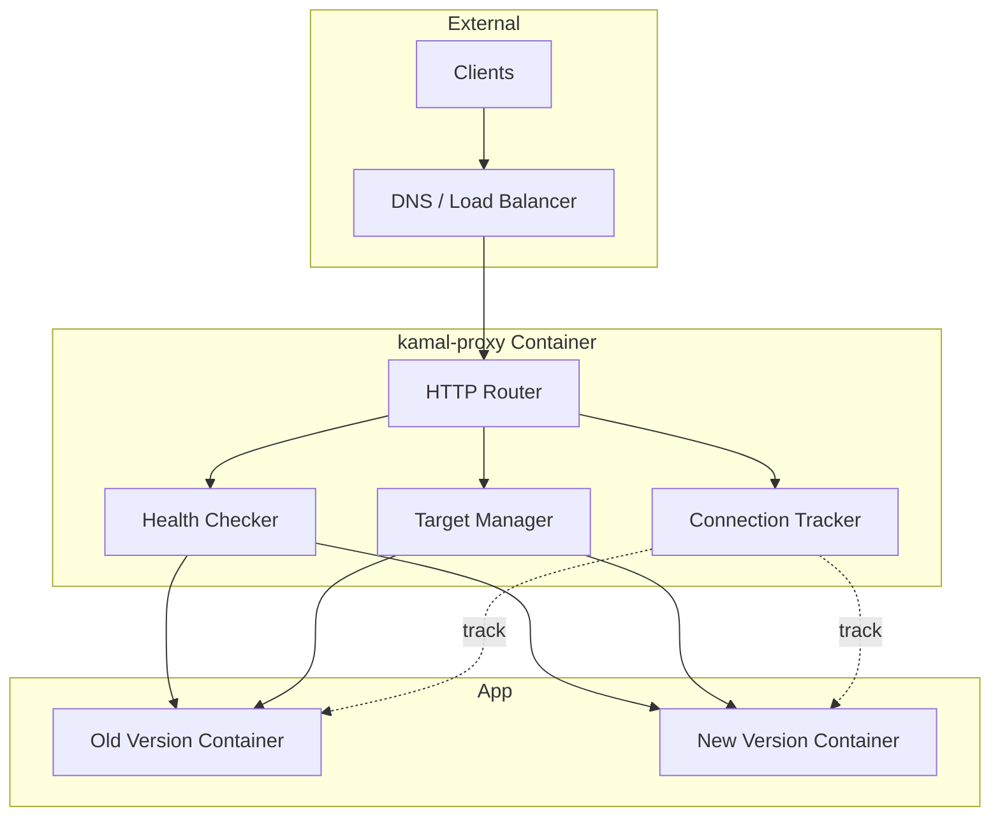

# Deep Dive: kamal-proxy Internals

## Overview

This deep dive examines kamal-proxy - the reverse proxy that enables Kamal's zero-downtime deployments. We'll explore how it routes traffic, performs health checks, and atomically switches traffic between container versions.

## Architecture



## Proxy Core

### HTTP Router

```ruby
# kamal-proxy/lib/kamal/proxy/router.rb

module Kamal::Proxy
  class Router
    def initialize
      @targets = {}
      @active_target = nil
      @draining_target = nil
    end
    
    def deploy(app:, target:, host:, tls: false, drain_time: 30)
      # Register new target
      @targets[target] = Target.new(
        id: target,
        host: host,
        tls: tls,
        drain_time: drain_time
      )
      
      # Health check new target
      health_check(@targets[target])
      
      # Switch traffic atomically
      switch_target(@targets[target])
      
      # Schedule drain of old target
      if @draining_target
        schedule_drain(@draining_target)
      end
    end
    
    def call(env)
      # Route request to active target
      return [404, {}, ["No active target"]] unless @active_target
      
      @active_target.call(env)
    end
    
    private
    
    def switch_target(new_target)
      @draining_target = @active_target
      @active_target = new_target
    end
    
    def schedule_drain(target)
      # Wait for in-flight requests to complete
      Thread.new do
        sleep(target.drain_time)
        target.close
        @targets.delete(target.id)
        @draining_target = nil if @draining_target == target
      end
    end
  end
end
```

### Target Representation

```ruby
# kamal-proxy/lib/kamal/proxy/target.rb

module Kamal::Proxy
  class Target
    attr_reader :id, :host, :tls, :drain_time, :health_status
    
    def initialize(id:, host:, tls:, drain_time:)
      @id = id
      @host = host
      @tls = tls
      @drain_time = drain_time
      @health_status = :checking
      @connections = 0
      @mutex = Mutex.new
    end
    
    def healthy?
      @health_status == :healthy
    end
    
    def health_check
      # Perform HTTP health check
      uri = URI.parse("http://#{@host}/up")
      http = Net::HTTP.new(uri.host, uri.port)
      http.open_timeout = 3
      http.read_timeout = 3
      
      response = http.get(uri.path)
      
      @mutex.synchronize do
        if response.code == "200"
          @health_status = :healthy
        else
          @health_status = :unhealthy
        end
      end
      
      @health_status == :healthy
    rescue => e
      @mutex.synchronize do
        @health_status = :unhealthy
      end
      false
    end
    
    def call(env)
      @mutex.synchronize do
        @connections += 1
      end
      
      # Forward request to target
      forward_request(env)
    ensure
      @mutex.synchronize do
        @connections -= 1
      end
    end
    
    def close
      # Wait for connections to drain
      sleep(@drain_time) while @connections > 0
      
      # Close all connections
      @connections = -1 # Signal closed
    end
    
    def connection_count
      @connections
    end
  end
end
```

## Health Check System

### Health Checker

```ruby
# kamal-proxy/lib/kamal/proxy/health_checker.rb

module Kamal::Proxy
  class HealthChecker
    def initialize(options = {})
      @interval = options[:interval] || 5
      @timeout = options[:timeout] || 3
      @retries = options[:retries] || 3
      @start_period = options[:start_period] || 30
    end
    
    def wait_for_healthy(target, timeout: 60)
      start_time = Time.now
      consecutive_failures = 0
      
      while Time.now - start_time < timeout
        # Initial start period - don't fail immediately
        if Time.now - start_time < @start_period
          sleep(@interval)
          next
        end
        
        if target.health_check
          return true
        else
          consecutive_failures += 1
          
          if consecutive_failures >= @retries
            return false
          end
          
          sleep(@interval)
        end
      end
      
      # Timeout
      false
    end
    
    def continuous_check(target, &block)
      # Continuous health monitoring
      Thread.new do
        loop do
          healthy = target.health_check
          block.call(healthy)
          sleep(@interval)
        end
      end
    end
  end
end
```

### Health Check Configuration

```ruby
# kamal-proxy/lib/kamal/proxy/config.rb

module Kamal::Proxy
  class Config
    attr_reader :healthcheck, :drain_time, :tls
    
    def initialize(config_file)
      @config = YAML.load_file(config_file)
      @healthcheck = HealthcheckConfig.new(@config["healthcheck"])
      @drain_time = @config["drain_time"] || 30
      @tls = TlsConfig.new(@config["tls"])
    end
  end
  
  class HealthcheckConfig
    attr_reader :path, :interval, :timeout, :retries, :start_period
    
    def initialize(config)
      config ||= {}
      @path = config["path"] || "/up"
      @interval = config["interval"] || 5
      @timeout = config["timeout"] || 3
      @retries = config["retries"] || 3
      @start_period = config["start_period"] || 30
    end
  end
end
```

## Traffic Switching

### Atomic Switch

```ruby
# kamal-proxy/lib/kamal/proxy/traffic_switcher.rb

module Kamal::Proxy
  class TrafficSwitcher
    def initialize(router)
      @router = router
      @mutex = Mutex.new
    end
    
    def switch_to(new_target)
      @mutex.synchronize do
        # Critical section - atomic switch
        old_target = @router.active_target
        
        # Update router's active target
        @router.active_target = new_target
        
        # Mark old target for draining
        if old_target
          @router.draining_target = old_target
        end
        
        # Log switch
        log_switch(old_target, new_target)
      end
    end
    
    def gradual_switch(new_target, step: 10, interval: 5)
      # Gradual traffic shift (canary-style)
      current_weight = 0
      old_target = @router.active_target
      
      while current_weight <= 100
        sleep(interval)
        
        # Verify new target is still healthy
        unless new_target.healthy?
          # Abort switch
          @router.active_target = old_target
          raise "New target became unhealthy during switch"
        end
        
        current_weight += step
        
        # Update weights (if weighted routing supported)
        @router.update_weights(
          old_target => (100 - current_weight),
          new_target => current_weight
        )
      end
      
      # Complete switch
      @router.active_target = new_target
      @router.draining_target = old_target
    end
  end
end
```

### Connection Draining

```ruby
# kamal-proxy/lib/kamal/proxy/connection_drainer.rb

module Kamal::Proxy
  class ConnectionDrainer
    def initialize(target, drain_time: 30)
      @target = target
      @drain_time = drain_time
      @drain_start = nil
    end
    
    def start
      @drain_start = Time.now
      
      # Stop accepting new connections
      @target.stop_accepting
      
      # Wait for existing connections to complete
      drain_loop
    end
    
    private
    
    def drain_loop
      deadline = @drain_start + @drain_time
      
      while Time.now < deadline
        connections = @target.connection_count
        
        if connections == 0
          # All connections drained
          return :success
        end
        
        # Log progress
        puts "Draining: #{connections} connections remaining"
        
        sleep(1)
      end
      
      # Timeout - force close
      @target.force_close
      :timeout
    end
  end
end
```

## TLS Termination

### TLS Configuration

```ruby
# kamal-proxy/lib/kamal/proxy/tls.rb

module Kamal::Proxy
  class TLS
    attr_reader :cert_path, :key_path, :cert
    
    def initialize(cert_path:, key_path:)
      @cert_path = cert_path
      @key_path = key_path
      @cert = OpenSSL::X509::Certificate.new(File.read(cert_path))
      @key = OpenSSL::PKey::RSA.new(File.read(key_path))
    end
    
    def ssl_context
      @ssl_context ||= begin
        ctx = OpenSSL::SSL::SSLContext.new
        ctx.cert = @cert
        ctx.key = @key
        ctx.ciphers = "HIGH:!aNULL:!MD5"
        ctx.min_version = OpenSSL::SSL::TLS12_VERSION
        ctx
      end
    end
    
    def wrap_socket(socket)
      OpenSSL::SSL::SSLSocket.new(socket, ssl_context)
    end
  end
end
```

### Automatic Certificate Renewal

```ruby
# kamal-proxy/lib/kamal/proxy/cert_renewer.rb

module Kamal::Proxy
  class CertRenewer
    def initialize(tls, renewal_days: 30)
      @tls = tls
      @renewal_days = renewal_days
    end
    
    def check_and_renew
      expiry = @tls.cert.not_after
      days_until_expiry = (expiry - Time.now) / 86400
      
      if days_until_expiry < @renewal_days
        # Certificate expiring soon
        renew_certificate
        
        # Reload TLS context
        @tls.reload
      end
    end
    
    private
    
    def renew_certificate
      # Integration with certbot, Let's Encrypt, etc.
      system("certbot renew --quiet")
    end
  end
end
```

## Request Logging

### Access Log

```ruby
# kamal-proxy/lib/kamal/proxy/logger.rb

module Kamal::Proxy
  class Logger
    def initialize(log_path:)
      @log_file = File.open(log_path, "a")
      @mutex = Mutex.new
    end
    
    def log_request(env, status, headers, target)
      @mutex.synchronize do
        log_line = build_log_line(env, status, headers, target)
        @log_file.puts(log_line)
        @log_file.flush
      end
    end
    
    private
    
    def build_log_line(env, status, headers, target)
      time = Time.now.strftime("%Y-%m-%d %H:%M:%S")
      method = env["REQUEST_METHOD"]
      path = env["PATH_INFO"]
      status = status
      duration = env["proxy.duration"] || 0
      target = target&.id || "-"
      
      "#{time} #{method} #{path} #{status} #{duration}ms #{target}"
    end
  end
end
```

## Metrics and Monitoring

### Prometheus Metrics

```ruby
# kamal-proxy/lib/kamal/proxy/metrics.rb

module Kamal::Proxy
  class Metrics
    def initialize
      @requests_total = Counter.new("proxy_requests_total")
      @request_duration = Histogram.new("proxy_request_duration_seconds")
      @active_connections = Gauge.new("proxy_active_connections")
      @healthy_targets = Gauge.new("proxy_healthy_targets")
    end
    
    def record_request(target, duration, status)
      @requests_total.increment(target: target)
      @request_duration.observe(duration, target: target)
    end
    
    def record_connections(count, target)
      @active_connections.set(count, target: target)
    end
    
    def record_health(target, healthy)
      @healthy_targets.set(healthy ? 1 : 0, target: target)
    end
    
    def metrics_output
      [
        @requests_total.output,
        @request_duration.output,
        @active_connections.output,
        @healthy_targets.output
      ].join("\n")
    end
  end
end
```

## Conclusion

kamal-proxy provides:

1. **Atomic Traffic Switching**: Instant switch between versions
2. **Health Checking**: HTTP health checks with retries
3. **Connection Draining**: Graceful drain of old versions
4. **TLS Termination**: SSL/TLS handling with auto-renewal
5. **Request Logging**: Access logs for debugging
6. **Metrics**: Prometheus-compatible metrics
7. **Multi-Target**: Support for canary/gradual deploys
