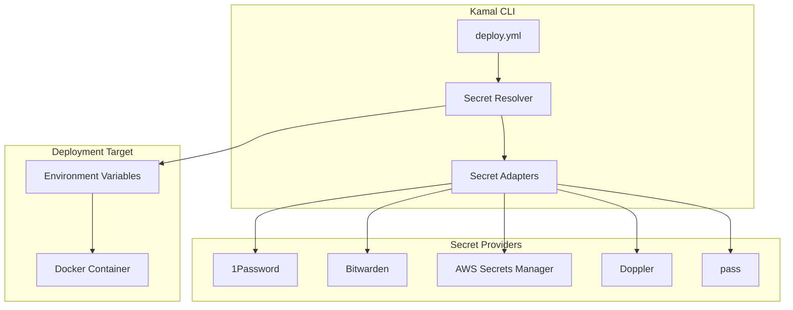

# Deep Dive: Secrets Management

## Overview

This deep dive examines Kamal's secrets management system - how secrets are fetched from various providers (1Password, Bitwarden, AWS Secrets Manager, Doppler), injected into deployments, and kept secure throughout the pipeline.

## Architecture



## Secrets Configuration

### Basic Secrets Setup

```yaml
# deploy.yml

service: myapp
image: myorg/myapp

servers:
  - 192.168.0.1
  - 192.168.0.2

env:
  # Clear text (non-sensitive)
  clear:
    RAILS_ENV: production
    LOG_LEVEL: info
  
  # Secrets (referenced from providers)
  secret:
    # 1Password reference
    - RAILS_MASTER_KEY
  
  # Explicit provider references
    - op://my-vault/DATABASE_URL
    - aws:my-secret-key
    - doppler:API_KEY
```

### Environment-Specific Secrets

```yaml
# deploy.yml

env:
  clear:
    APP_NAME: myapp
  
  secret:
    # Production secrets
    production:
      - RAILS_MASTER_KEY
      - DATABASE_URL
      - REDIS_URL
    
    # Staging secrets (different values)
    staging:
      - RAILS_MASTER_KEY
      - DATABASE_URL
```

## Secret Adapters

### Base Adapter

```ruby
# lib/kamal/secrets/adapters/base.rb

module Kamal::Secrets::Adapters
  class Base
    def initialize(config = {})
      @config = config
    end
    
    def fetch(secret_name)
      raise NotImplementedError, "Subclasses must implement fetch"
    end
    
    def fetch_all(secret_names)
      secret_names.each_with_object({}) do |name, result|
        result[name] = fetch(name)
      end
    end
    
    protected
    
    def execute_command(command)
      output = `#{command}`.strip
      
      if $?.success?
        output
      else
        raise SecretFetchError, "Failed to fetch secret: #{$?.exitstatus}"
      end
    end
  end
end
```

### 1Password Adapter

```ruby
# lib/kamal/secrets/adapters/1password.rb

module Kamal::Secrets::Adapters
  class OnePassword < Base
    def initialize(config = {})
      super
      @vault = config[:vault]
      @op_path = config[:op_path] || "op"
    end
    
    def fetch(secret_name)
      # Parse 1Password reference format:
      # op://vault/item/field or just item/field
      
      if secret_name.start_with?("op://")
        # Full reference
        parse_and_fetch(secret_name)
      else
        # Short reference - use default vault
        fetch_from_vault(secret_name)
      end
    end
    
    private
    
    def parse_and_fetch(reference)
      # Parse: op://vault/item/field
      parts = reference.gsub("op://", "").split("/")
      
      vault = parts[0]
      item = parts[1]
      field = parts[2] || "password"
      
      command = "#{@op_path} read \"op://#{vault}/#{item}/#{field}\""
      execute_command(command)
    end
    
    def fetch_from_vault(secret_name)
      # Try common field names
      %w[password secret notes].each do |field|
        command = "#{@op_path} read \"op://#{@vault}/#{secret_name}/#{field}\" 2>/dev/null"
        result = `#{command}`.strip
        
        return result if $?.success?
      end
      
      raise SecretFetchError, "Could not find secret: #{secret_name}"
    end
  end
end
```

### Bitwarden Adapter

```ruby
# lib/kamal/secrets/adapters/bitwarden.rb

module Kamal::Secrets::Adapters
  class Bitwarden < Base
    def initialize(config = {})
      super
      @bw_path = config[:bw_path] || "bw"
      @session = config[:session]
    end
    
    def fetch(secret_name)
      # Ensure logged in
      ensure_logged_in
      
      # Get item
      item = get_item(secret_name)
      
      # Return password or specific field
      item["password"] || item["notes"]
    end
    
    private
    
    def ensure_logged_in
      status = execute_command("#{@bw_path} status")
      parsed = JSON.parse(status)
      
      if parsed["status"] != "unlocked"
        raise SecretFetchError, "Bitwarden vault is locked. Please unlock it first."
      end
    end
    
    def get_item(name)
      command = "#{@bw_path} get item \"#{name}\""
      output = execute_command(command)
      JSON.parse(output)
    end
  end
end
```

### AWS Secrets Manager Adapter

```ruby
# lib/kamal/secrets/adapters/aws_secrets_manager.rb

module Kamal::Secrets::Adapters
  class AwsSecretsManager < Base
    def initialize(config = {})
      super
      @region = config[:region] || ENV["AWS_REGION"] || "us-east-1"
      @profile = config[:profile]
    end
    
    def fetch(secret_name)
      command = build_command(secret_name)
      output = execute_command(command)
      
      # AWS returns JSON, extract secret string
      parsed = JSON.parse(output)
      
      # Secret can be string or base64-encoded binary
      parsed["SecretString"]
    rescue JSON::ParserError
      # Raw string response
      output
    end
    
    private
    
    def build_command(secret_name)
      cmd = "aws secretsmanager get-secret-value"
      cmd << " --secret-id \"#{secret_name}\""
      cmd << " --region #{@region}"
      cmd << " --profile #{@profile}" if @profile
      cmd << " --query SecretString --output text"
      cmd
    end
  end
end
```

### Doppler Adapter

```ruby
# lib/kamal/secrets/adapters/doppler.rb

module Kamal::Secrets::Adapters
  class Doppler < Base
    def initialize(config = {})
      super
      @doppler_path = config[:doppler_path] || "doppler"
      @project = config[:project]
      @config = config[:config] || "dev"
    end
    
    def fetch(secret_name)
      command = build_command(secret_name)
      execute_command(command)
    end
    
    private
    
    def build_command(secret_name)
      cmd = "#{@doppler_path} secrets get #{secret_name}"
      cmd << " --project #{@project}" if @project
      cmd << " --config #{@config}"
      cmd
    end
  end
end
```

### pass (GPG) Adapter

```ruby
# lib/kamal/secrets/adapters/pass.rb

module Kamal::Secrets::Adapters
  class Pass < Base
    def initialize(config = {})
      super
      @password_store_dir = config[:password_store_dir] || ENV["PASSWORD_STORE_DIR"]
    end
    
    def fetch(secret_name)
      # pass uses GPG-encrypted files in ~/.password-store
      secret_path = File.join(@password_store_dir, "#{secret_name}.gpg")
      
      unless File.exist?(secret_path)
        raise SecretFetchError, "Secret not found: #{secret_name}"
      end
      
      command = "pass show \"#{secret_name}\""
      output = execute_command(command)
      
      # pass output includes secret name on first line
      output.lines.first.strip
    end
  end
end
```

## Secret Resolution

### Secret Resolver

```ruby
# lib/kamal/secrets/resolver.rb

module Kamal::Secrets
  class Resolver
    def initialize(config = {})
      @adapters = {}
      @cache = {}
      
      # Initialize adapters from config
      config[:adapters]&.each do |provider, adapter_config|
        @adapters[provider] = create_adapter(provider, adapter_config)
      end
    end
    
    def resolve(secrets)
      secrets.each_with_object({}) do |secret, result|
        result[secret_key(secret)] = fetch_secret(secret)
      end
    end
    
    def resolve_all(secrets_by_role)
      # Resolve secrets for multiple roles/environments
      secrets_by_role.each_with_object({}) do |(role, secrets), result|
        result[role] = resolve(secrets)
      end
    end
    
    private
    
    def secret_key(secret)
      # Extract key name from full reference
      # "op://vault/item" => "item"
      # "aws:secret-key" => "secret-key"
      secret.split(/[\/:]/).last
    end
    
    def fetch_secret(secret)
      # Check cache first
      return @cache[secret] if @cache[secret]
      
      # Determine provider from secret format
      provider, secret_name = parse_secret(secret)
      
      # Fetch from provider
      value = adapter_for(provider).fetch(secret_name)
      
      # Cache for subsequent calls
      @cache[secret] = value
      
      value
    end
    
    def parse_secret(secret)
      case secret
      when /^op:\/\//
        [:onepassword, secret]
      when /^aws:/
        [:aws, secret.sub("aws:", "")]
      when /^doppler:/
        [:doppler, secret.sub("doppler:", "")]
      when /^bw:/
        [:bitwarden, secret.sub("bw:", "")]
      else
        # Default to pass or 1Password
        [:pass, secret]
      end
    end
    
    def adapter_for(provider)
      @adapters[provider] || default_adapter
    end
    
    def default_adapter
      @adapters[:onepassword] || @adapters[:pass]
    end
    
    def create_adapter(provider, config)
      case provider
      when :onepassword
        Adapters::OnePassword.new(config)
      when :bitwarden
        Adapters::Bitwarden.new(config)
      when :aws
        Adapters::AwsSecretsManager.new(config)
      when :doppler
        Adapters::Doppler.new(config)
      when :pass
        Adapters::Pass.new(config)
      else
        raise "Unknown secret provider: #{provider}"
      end
    end
  end
end
```

## Security Practices

### Secret Handling

```ruby
# lib/kamal/secrets/secure_string.rb

module Kamal::Secrets
  class SecureString
    def initialize(value)
      @value = value
    end
    
    def to_s
      @value
    end
    
    # Prevent secrets from appearing in logs
    def inspect
      "[REDACTED]"
    end
    
    # Securely clear from memory
    def clear!
      # Overwrite memory (best effort in Ruby)
      @value.replace("0" * @value.length)
      @value = nil
    end
  end
end
```

### Environment Injection

```ruby
# lib/kamal/commands/app.rb

class Kamal::Commands::App
  def env_args(host)
    # Clear environment variables
    args = role.env["clear"].map do |key, value|
      ["--env", "#{key}=#{value}"]
    end.flatten.compact
    
    # Secret environment variables (fetched at deploy time)
    role.env["secret"].each do |secret_ref|
      value = secrets.resolve(secret_ref)
      args << "--env"
      args << "#{secret_key(secret_ref)}=#{value}"
    end
    
    args
  end
  
  private
  
  def secret_key(secret_ref)
    # Extract key name
    secret_ref.split(/[\/:]/).last
  end
end
```

### SSH Secret Forwarding

```ruby
# lib/kamal/cli/secrets.rb

class Kamal::Cli::Secrets
  def download
    # Download secrets from provider to local machine
    # Secrets are NEVER stored in git or config files
    
    on_roles(all) do |host, role|
      # Fetch secrets directly on remote server
      role.env["secret"].each do |secret_ref|
        value = secrets.resolve(secret_ref)
        
        # Inject into container environment only
        # Never write to disk
        execute "export #{secret_key(secret_ref)}=#{value}"
      end
    end
  end
end
```

## Error Handling

### Secret Fetch Errors

```ruby
# lib/kamal/secrets/errors.rb

module Kamal::Secrets
  class Error < StandardError; end
  
  class SecretFetchError < Error
    attr_reader :provider, :secret_name
    
    def initialize(provider, secret_name, cause = nil)
      @provider = provider
      @secret_name = secret_name
      super("Failed to fetch secret '#{secret_name}' from #{provider}: #{cause&.message}")
    end
  end
  
  class ProviderNotFoundError < Error
    def initialize(provider)
      super("Secret provider '#{provider}' not found. Available: #{available_providers.join(', ')}")
    end
    
    def available_providers
      Kamal::Secrets::Adapters.constants.map { |c| c.to_s.underscore }.sort
    end
  end
  
  class VaultLockedError < Error
    def initialize(provider)
      super("#{provider} vault is locked. Please unlock it and try again.")
    end
  end
end
```

### Retry Logic

```ruby
# lib/kamal/secrets/retry.rb

module Kamal::Secrets
  class Retry
    def initialize(max_retries: 3, delay: 1, backoff: 2)
      @max_retries = max_retries
      @delay = delay
      @backoff = backoff
    end
    
    def fetch_with_retry(adapter, secret_name)
      retries = 0
      
      begin
        adapter.fetch(secret_name)
      rescue => e
        retries += 1
        
        if retries < @max_retries
          sleep(@delay * (@backoff ** (retries - 1)))
          retry
        else
          raise SecretFetchError.new(
            adapter.class.name.split("::").last.underscore,
            secret_name,
            e
          )
        end
      end
    end
  end
end
```

## Conclusion

Kamal's secrets management provides:

1. **Multiple Providers**: 1Password, Bitwarden, AWS, Doppler, pass
2. **Unified Interface**: Consistent API across providers
3. **No Storage**: Secrets never stored in config files
4. **Caching**: Avoid repeated API calls
5. **Error Handling**: Graceful failure and retry logic
6. **Security**: Redacted logging, secure memory handling
