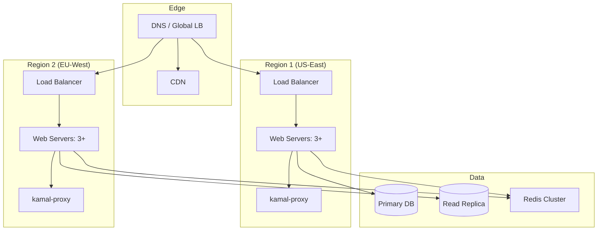

# Production-Grade Kamal Deployments

## Overview

This document covers production deployment patterns for Kamal-based deployments including multi-region setups, monitoring, scaling strategies, high availability configurations, and CI/CD integration.

## Architecture



## Multi-Region Deployment

### Configuration

```yaml
# deploy.yml

service: myapp
image: myorg/myapp

# Multi-region configuration
regions:
  us-east:
    servers:
      - us-east-1.example.com
      - us-east-2.example.com
      - us-east-3.example.com
    primary: true
    db_role: primary
    
  eu-west:
    servers:
      - eu-west-1.example.com
      - eu-west-2.example.com
      - eu-west-3.example.com
    primary: false
    db_role: replica

# Global configuration
env:
  clear:
    RAILS_ENV: production
    
  secret:
    - DATABASE_URL
    - REDIS_URL

# Health check configuration
healthcheck:
  path: /up
  interval: 5s
  timeout: 3s
  retries: 3

# Deployment strategy
deploy:
  strategy: rolling
  batch_size: 1
  wait_between_batches: 30s
  max_failures: 1
  rollback_on_failure: true
```

### Regional Deployment Script

```bash
#!/bin/bash
# deploy-regional.sh

set -e

REGION=${1:-us-east}
VERSION=${2:-$(git rev-parse --short HEAD)}

echo "Deploying $VERSION to $REGION"

# Deploy to primary region first
if [ "$REGION" = "us-east" ]; then
    echo "Deploying to primary region..."
    kamal deploy --hosts us-east-1.example.com,us-east-2.example.com,us-east-3.example.com
    
    # Verify primary deployment
    kamal app status --hosts us-east-1.example.com
    
    # Run migrations only on primary
    kamal app exec --hosts us-east-1.example.com "bundle exec rails db:migrate"
fi

# Deploy to replica regions
if [ "$REGION" = "eu-west" ]; then
    echo "Deploying to replica region..."
    kamal deploy --hosts eu-west-1.example.com,eu-west-2.example.com,eu-west-3.example.com
    
    # Verify replica deployment
    kamal app status --hosts eu-west-1.example.com
fi

echo "Deployment complete"
```

## Monitoring Setup

### Prometheus Metrics Exporter

```ruby
# lib/kamal/metrics/exporter.rb

module Kamal::Metrics
  class Exporter
    def initialize(config)
      @config = config
      @registry = Prometheus::Client.registry
    end
    
    def register_metrics
      # Deployment metrics
      @deployment_count = Prometheus::Client::Counter.new(
        :kamal_deployment_count,
        docstring: "Total number of deployments",
        labels: [:region, :role]
      )
      
      @deployment_duration = Prometheus::Client::Histogram.new(
        :kamal_deployment_duration_seconds,
        docstring: "Deployment duration in seconds",
        labels: [:region, :role]
      )
      
      # Container metrics
      @container_count = Prometheus::Client::Gauge.new(
        :kamal_container_count,
        docstring: "Number of running containers",
        labels: [:host, :role, :version]
      )
      
      # Health check metrics
      @health_check_success = Prometheus::Client::Counter.new(
        :kamal_health_check_success_total,
        docstring: "Total successful health checks",
        labels: [:host, :container]
      )
      
      @health_check_failure = Prometheus::Client::Counter.new(
        :kamal_health_check_failure_total,
        docstring: "Total failed health checks",
        labels: [:host, :container]
      )
      
      @registry.register(@deployment_count)
      @registry.register(@deployment_duration)
      @registry.register(@container_count)
      @registry.register(@health_check_success)
      @registry.register(@health_check_failure)
    end
    
    def record_deployment(region:, role:, duration:)
      @deployment_count.increment(labels: { region:, role: })
      @deployment_duration.observe(duration, labels: { region:, role: })
    end
    
    def record_health_check(host:, container:, success:)
      if success
        @health_check_success.increment(labels: { host:, container: })
      else
        @health_check_failure.increment(labels: { host:, container: })
      end
    end
    
    def metrics_output
      Prometheus::Client::Formats::Text.marshal(@registry)
    end
  end
end
```

### Grafana Dashboard

```json
{
  "dashboard": {
    "title": "Kamal Deployment Dashboard",
    "panels": [
      {
        "title": "Deployment Count",
        "type": "graph",
        "targets": [
          {
            "expr": "rate(kamal_deployment_count[1h])",
            "legendFormat": "{{ region }}/{{ role }}"
          }
        ],
        "gridPos": {"h": 8, "w": 12, "x": 0, "y": 0}
      },
      {
        "title": "Deployment Duration (p95)",
        "type": "graph",
        "targets": [
          {
            "expr": "histogram_quantile(0.95, sum(rate(kamal_deployment_duration_seconds_bucket[5m])) by (le, region))",
            "legendFormat": "{{ region }}"
          }
        ],
        "gridPos": {"h": 8, "w": 12, "x": 12, "y": 0}
      },
      {
        "title": "Container Count by Host",
        "type": "graph",
        "targets": [
          {
            "expr": "kamal_container_count",
            "legendFormat": "{{ host }}/{{ role }}"
          }
        ],
        "gridPos": {"h": 8, "w": 24, "x": 0, "y": 8}
      },
      {
        "title": "Health Check Success Rate",
        "type": "graph",
        "targets": [
          {
            "expr": "rate(kamal_health_check_success_total[5m]) / (rate(kamal_health_check_success_total[5m]) + rate(kamal_health_check_failure_total[5m]))",
            "legendFormat": "{{ host }}"
          }
        ],
        "gridPos": {"h": 8, "w": 24, "x": 0, "y": 16}
      }
    ]
  }
}
```

## High Availability

### Load Balancer Configuration

```nginx
# /etc/nginx/nginx.conf

upstream kamal_web {
    least_conn;
    
    # US-East servers
    server us-east-1.example.com:80 max_fails=3 fail_timeout=30s;
    server us-east-2.example.com:80 max_fails=3 fail_timeout=30s;
    server us-east-3.example.com:80 max_fails=3 fail_timeout=30s;
    
    # EU-West servers (backup)
    server eu-west-1.example.com:80 backup;
    server eu-west-2.example.com:80 backup;
    server eu-west-3.example.com:80 backup;
    
    keepalive 32;
}

server {
    listen 80;
    listen 443 ssl http2;
    server_name app.example.com;
    
    ssl_certificate /etc/ssl/certs/app.example.com.crt;
    ssl_certificate_key /etc/ssl/private/app.example.com.key;
    
    location / {
        proxy_pass http://kamal_web;
        proxy_http_version 1.1;
        proxy_set_header Upgrade $http_upgrade;
        proxy_set_header Connection "upgrade";
        proxy_set_header Host $host;
        proxy_set_header X-Real-IP $remote_addr;
        proxy_set_header X-Forwarded-For $proxy_add_x_forwarded_for;
        proxy_set_header X-Forwarded-Proto $scheme;
        proxy_read_timeout 86400s;
        proxy_send_timeout 86400s;
    }
    
    location /health {
        access_log off;
        return 200 "healthy\n";
        add_header Content-Type text/plain;
    }
}
```

### Database Failover

```ruby
# config/database.yml

production:
  primary:
    <<: *default
    url: <%= ENV["DATABASE_URL"] %>
    replica: false
    
  replica:
    <<: *default
    url: <%= ENV["DATABASE_REPLICA_URL"] %>
    replica: true
    roles:
      - readonly

# config/initializers/database_connection.rb

Rails.application.configure do
  # Automatic failover
  config.active_record.database_selector = { delay: 2.seconds }
  config.active_record.database_resolver = ActiveRecord::Middleware::DatabaseSelector::Resolver
  config.active_record.database_resolver_context = ActiveRecord::Middleware::DatabaseSelector::Resolver::Session
end
```

## CI/CD Integration

### GitHub Actions

```yaml
# .github/workflows/deploy.yml

name: Deploy

on:
  push:
    branches: [main]

env:
  REGISTRY: ghcr.io
  IMAGE_NAME: ${{ github.repository }}

jobs:
  test:
    runs-on: ubuntu-latest
    steps:
      - uses: actions/checkout@v3
      
      - name: Setup Ruby
        uses: ruby/setup-ruby@v1
        with:
          ruby-version: 3.2
          bundler-cache: true
      
      - name: Run tests
        run: bundle exec rspec
      
      - name: Run Rubocop
        run: bundle exec rubocop

  build:
    needs: test
    runs-on: ubuntu-latest
    permissions:
      contents: read
      packages: write
    
    steps:
      - uses: actions/checkout@v3
      
      - name: Login to Container Registry
        uses: docker/login-action@v2
        with:
          registry: ${{ env.REGISTRY }}
          username: ${{ github.actor }}
          password: ${{ secrets.GITHUB_TOKEN }}
      
      - name: Build and push
        uses: docker/build-push-action@v4
        with:
          context: .
          push: true
          tags: ${{ env.REGISTRY }}/${{ env.IMAGE_NAME }}:${{ github.sha }}
          cache-from: type=gha
          cache-to: type=gha,mode=max

  deploy:
    needs: build
    runs-on: ubuntu-latest
    environment: production
    
    steps:
      - uses: actions/checkout@v3
      
      - name: Setup Kamal
        run: |
          gem install kamal
          kamal version
      
      - name: Setup SSH
        run: |
          mkdir -p ~/.ssh
          echo "${{ secrets.SSH_PRIVATE_KEY }}" > ~/.ssh/id_ed25519
          chmod 600 ~/.ssh/id_ed25519
          ssh-keyscan -H example.com >> ~/.ssh/known_hosts
      
      - name: Deploy
        env:
          DOCKER_REGISTRY_TOKEN: ${{ secrets.DOCKER_REGISTRY_TOKEN }}
          DATABASE_URL: ${{ secrets.DATABASE_URL }}
          RAILS_MASTER_KEY: ${{ secrets.RAILS_MASTER_KEY }}
        run: |
          kamal deploy -v ${{ github.sha }}
      
      - name: Smoke Tests
        run: |
          curl -f https://app.example.com/health
          curl -f https://app.example.com/up
```

### Rollback Strategy

```bash
#!/bin/bash
# rollback.sh

set -e

# Get previous version
PREVIOUS_VERSION=$(kamal app list --limit 2 --format json | jq -r '.[1].version')

if [ -z "$PREVIOUS_VERSION" ]; then
    echo "No previous version found"
    exit 1
fi

echo "Rolling back to $PREVIOUS_VERSION"

# Confirm rollback
read -p "Rollback to $PREVIOUS_VERSION? [y/N] " confirm
if [ "$confirm" != "y" ]; then
    echo "Rollback cancelled"
    exit 0
fi

# Execute rollback
kamal rollback -v $PREVIOUS_VERSION

# Verify rollback
sleep 10
kamal app status

# Notify team
curl -X POST -H 'Content-type: application/json' \
  --data "{\"text\":\"Rollback to $PREVIOUS_VERSION completed\"}" \
  $SLACK_WEBHOOK_URL
```

## Security Hardening

### SSH Hardening

```bash
# /etc/ssh/sshd_config

# Disable root login
PermitRootLogin no

# Disable password authentication
PasswordAuthentication no
PubkeyAuthentication yes

# Use only secure key types
PubkeyAcceptedKeyTypes ssh-ed25519,ssh-ed25519-cert-v01@openssh.com

# Limit users
AllowUsers deploy

# Set idle timeout
ClientAliveInterval 300
ClientAliveCountMax 2

# Logging
LogLevel VERBOSE
```

### Docker Security

```yaml
# deploy.yml

roles:
  web:
    # Run as non-root user
    user: app
    
    # Read-only root filesystem
    read_only: true
    
    # Drop capabilities
    cap_drop:
      - ALL
    cap_add:
      - NET_BIND_SERVICE
    
    # Security options
    security_opt:
      - no-new-privileges:true
    
    # Resource limits
    ulimits:
      nofile:
        soft: 65535
        hard: 65535
    
    # Memory limits
    memory: 2g
    memory_swap: 2g
```

## Conclusion

Production-grade Kamal deployments require:

1. **Multi-Region**: Deploy to multiple regions for HA
2. **Monitoring**: Prometheus metrics, Grafana dashboards
3. **Load Balancing**: Nginx/HAProxy with health checks
4. **Database**: Primary-replica with automatic failover
5. **CI/CD**: GitHub Actions for automated deploys
6. **Rollback**: Quick rollback procedures
7. **Security**: SSH hardening, Docker security options
