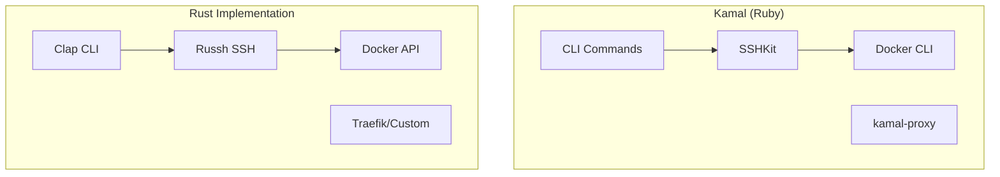

# Rust Revision: Building Kamal-like Deployment Systems in Rust

## Overview

This document demonstrates how to replicate Kamal's zero-downtime deployment patterns in Rust using SSH for remote execution, the Docker API for container management, and orchestration for multi-server deployments.

## Architecture Comparison



## Project Setup

```toml
# Cargo.toml
[package]
name = "kamal-rust"
version = "0.1.0"
edition = "2021"

[dependencies]
# CLI
clap = { version = "4.4", features = ["derive"] }
dialoguer = "0.11"

# Async runtime
tokio = { version = "1.35", features = ["full"] }
tokio-util = { version = "0.7", features = ["codec"] }

# SSH
russh = "0.37"
russh-keys = "0.37"

# Docker API
bollard = "0.15"

# Serialization
serde = { version = "1.0", features = ["derive"] }
serde_json = "1.0"
serde_yaml = "0.9"

# Error handling
thiserror = "1.0"
anyhow = "1.0"

# Logging
tracing = "0.1"
tracing-subscriber = { version = "0.3", features = ["env-filter"] }

# Secrets management
 secrecy = "0.8"
 
# HTTP client
reqwest = { version = "0.11", features = ["json"] }

# Utilities
dirs = "5.0"
tokio-stream = "0.1"
futures = "0.3"
```

## Configuration

### Deploy Configuration

```rust
// src/config.rs

use serde::{Deserialize, Serialize};
use std::collections::HashMap;
use std::path::PathBuf;

#[derive(Debug, Clone, Serialize, Deserialize)]
pub struct DeployConfig {
    pub service: String,
    pub image: String,
    pub servers: Vec<ServerConfig>,
    pub env: Option<EnvConfig>,
    pub roles: Option<HashMap<String, RoleConfig>>,
    pub accessories: Option<HashMap<String, AccessoryConfig>>,
    pub assets: Option<AssetsConfig>,
    pub registry: Option<RegistryConfig>,
    pub ssh: Option<SshConfig>,
}

#[derive(Debug, Clone, Serialize, Deserialize)]
pub struct ServerConfig {
    #[serde(flatten)]
    pub connection: ServerConnection,
    pub roles: Option<Vec<String>>,
}

#[derive(Debug, Clone, Serialize, Deserialize)]
#[serde(untagged)]
pub enum ServerConnection {
    Simple(String), // Just IP/hostname
    Detailed { host: String, user: Option<String>, port: Option<u16> },
}

#[derive(Debug, Clone, Serialize, Deserialize)]
pub struct RoleConfig {
    pub servers: Option<Vec<String>>,
    pub cmd: Option<String>,
    pub proxy: Option<bool>,
    pub env: Option<EnvConfig>,
    pub labels: Option<HashMap<String, String>>,
    pub volumes: Option<Vec<String>>,
}

#[derive(Debug, Clone, Serialize, Deserialize)]
pub struct EnvConfig {
    pub clear: Option<HashMap<String, String>>,
    pub secret: Option<Vec<String>>,
}

#[derive(Debug, Clone, Serialize, Deserialize)]
pub struct AccessoryConfig {
    pub image: String,
    pub host: Option<String>,
    pub port: Option<Vec<String>>,
    pub volumes: Option<Vec<String>>,
    pub env: Option<HashMap<String, String>>,
    pub cmd: Option<String>,
}

#[derive(Debug, Clone, Serialize, Deserialize)]
pub struct AssetsConfig {
    pub path: String,
    pub roles: Option<Vec<String>>,
    pub compression: Option<CompressionConfig>,
    pub cdn: Option<CdnConfig>,
}

#[derive(Debug, Clone, Serialize, Deserialize)]
pub struct CompressionConfig {
    pub gzip: Option<bool>,
    pub zstd: Option<bool>,
    pub level: Option<u32>,
}

#[derive(Debug, Clone, Serialize, Deserialize)]
pub struct CdnConfig {
    pub provider: String,
    pub bucket: String,
    pub region: String,
    pub prefix: Option<String>,
}

#[derive(Debug, Clone, Serialize, Deserialize)]
pub struct RegistryConfig {
    pub username: Option<String>,
    pub password: Option<String>,
    pub server: Option<String>,
}

#[derive(Debug, Clone, Serialize, Deserialize)]
pub struct SshConfig {
    pub user: Option<String>,
    pub port: Option<u16>,
    pub keys: Option<Vec<PathBuf>>,
}

impl DeployConfig {
    pub fn load(path: &Path) -> anyhow::Result<Self> {
        let content = std::fs::read_to_string(path)?;
        let config: DeployConfig = serde_yaml::from_str(&content)?;
        Ok(config)
    }
    
    pub fn validate(&self) -> Result<(), ConfigError> {
        if self.service.is_empty() {
            return Err(ConfigError::MissingService);
        }
        if self.image.is_empty() {
            return Err(ConfigError::MissingImage);
        }
        if self.servers.is_empty() && self.roles.as_ref().map(|r| r.is_empty()).unwrap_or(true) {
            return Err(ConfigError::NoServers);
        }
        Ok(())
    }
}

#[derive(Debug, thiserror::Error)]
pub enum ConfigError {
    #[error("Missing service name")]
    MissingService,
    #[error("Missing image name")]
    MissingImage,
    #[error("No servers configured")]
    NoServers,
    #[error(transparent)]
    Io(#[from] std::io::Error),
    #[error(transparent)]
    Yaml(#[from] serde_yaml::Error),
}
```

## SSH Client

### SSH Connection Manager

```rust
// src/ssh.rs

use russh::{client, Client, ClientConfig, Disconnect};
use russh_keys::{key, Secret};
use std::sync::Arc;
use tokio::sync::Mutex;

pub struct SshClient {
    host: String,
    user: String,
    port: u16,
    client: Arc<Mutex<Option<Client>>>,
}

impl SshClient {
    pub fn new(host: &str, user: &str, port: u16) -> Self {
        Self {
            host: host.to_string(),
            user: user.to_string(),
            port,
            client: Arc::new(Mutex::new(None)),
        }
    }
    
    pub async fn connect(&self) -> anyhow::Result<()> {
        let config = ClientConfig {
            client_version: "SSH-2.0-RustKamal",
            keepalive_interval: Some(30),
            ..Default::default()
        };
        
        let mut client = client::connect(
            config,
            (self.host.as_str(), self.port),
            SshKeyHandler,
        )
        .await?;
        
        // Authenticate with public key
        let key_path = dirs::home_dir()
            .map(|p| p.join(".ssh/id_ed25519"))
            .ok_or_else(|| anyhow::anyhow!("No home directory"))?;
        
        let key_pair = russh_keys::load_secret_key(&key_path, None)?;
        
        let auth = client.authenticate_publickey(
            self.user.clone(),
            Arc::new(key_pair),
        ).await?;
        
        if !auth {
            return Err(anyhow::anyhow!("Authentication failed"));
        }
        
        let mut client_guard = self.client.lock().await;
        *client_guard = Some(client);
        
        Ok(())
    }
    
    pub async fn execute(&self, command: &str) -> anyhow::Result<CommandOutput> {
        let mut client_guard = self.client.lock().await;
        let client = client_guard.as_mut()
            .ok_or_else(|| anyhow::anyhow!("Not connected"))?;
        
        let mut channel = client.channel_open_session().await?;
        channel.exec(true, command).await?;
        
        let mut output = Vec::new();
        let mut exit_code = 0;
        
        while let Some(msg) = channel.wait().await {
            match msg {
                russh::ChannelMsg::Data { data } => {
                    output.extend_from_slice(&data);
                }
                russh::ChannelMsg::ExitStatus { exit_status } => {
                    exit_code = exit_status;
                }
                russh::ChannelMsg::Closed => break,
                _ => {}
            }
        }
        
        Ok(CommandOutput {
            stdout: String::from_utf8_lossy(&output).to_string(),
            exit_code,
        })
    }
    
    pub async fn disconnect(&self) -> anyhow::Result<()> {
        let mut client_guard = self.client.lock().await;
        if let Some(client) = client_guard.take() {
            client
                .disconnect(Disconnect::ByApplication, "", "English")
                .await?;
        }
        Ok(())
    }
}

pub struct CommandOutput {
    pub stdout: String,
    pub exit_code: i32,
}

struct SshKeyHandler;

impl client::Handler for SshKeyHandler {
    type Error = anyhow::Error;
    
    async fn check_server_key(
        &self,
        _server_public_key: &key::PublicKey,
    ) -> Result<client::ServerCheckResult, Self::Error> {
        // Accept all server keys (not recommended for production)
        Ok(client::ServerCheckResult::Ok)
    }
}
```

### Parallel SSH Execution

```rust
// src/ssh/parallel.rs

use crate::ssh::SshClient;
use std::collections::HashMap;
use tokio::task::JoinSet;

pub struct ParallelExecutor {
    max_concurrent: usize,
}

impl ParallelExecutor {
    pub fn new(max_concurrent: usize) -> Self {
        Self { max_concurrent }
    }
    
    pub async fn execute_all(
        &self,
        clients: &[SshClient],
        command: &str,
    ) -> HashMap<String, CommandResult> {
        let mut set = JoinSet::new();
        
        for (i, client) in clients.iter().enumerate() {
            let client = client.clone();
            let command = command.to_string();
            
            set.spawn(async move {
                let result = client.execute(&command).await;
                (i, result)
            });
        }
        
        let mut results = HashMap::new();
        
        while let Some(Ok((index, result))) = set.join_next().await {
            results.insert(index, result);
        }
        
        results
    }
    
    pub async fn execute_with_semaphore(
        &self,
        clients: &[SshClient],
        command: &str,
    ) -> Vec<CommandResult> {
        use tokio::sync::Semaphore;
        let semaphore = Arc::new(Semaphore::new(self.max_concurrent));
        
        let mut handles = Vec::new();
        
        for client in clients {
            let semaphore = semaphore.clone();
            let client = client.clone();
            let command = command.to_string();
            
            let handle = tokio::spawn(async move {
                let _permit = semaphore.acquire().await.unwrap();
                client.execute(&command).await
            });
            
            handles.push(handle);
        }
        
        let mut results = Vec::new();
        
        for handle in handles {
            if let Ok(result) = handle.await {
                results.push(result);
            }
        }
        
        results
    }
}

pub enum CommandResult {
    Success(CommandOutput),
    Failure(anyhow::Error),
}
```

## Docker Commands

### Docker Command Generator

```rust
// src/docker/commands.rs

use crate::config::{DeployConfig, RoleConfig};

pub struct DockerCommands<'a> {
    config: &'a DeployConfig,
    role: &'a RoleConfig,
    version: &'a str,
}

impl<'a> DockerCommands<'a> {
    pub fn new(config: &'a DeployConfig, role: &'a RoleConfig, version: &'a str) -> Self {
        Self { config, role, version }
    }
    
    pub fn run(&self, hostname: Option<&str>) -> String {
        let mut cmd = vec![
            "docker".to_string(),
            "run".to_string(),
            "--detach".to_string(),
            "--restart".to_string(),
            "unless-stopped".to_string(),
            "--name".to_string(),
            self.container_name(),
            "--network".to_string(),
            "kamal".to_string(),
        ];
        
        if let Some(hostname) = hostname {
            cmd.push("--hostname".to_string());
            cmd.push(hostname.to_string());
        }
        
        // Kamal metadata
        cmd.push("--env".to_string());
        cmd.push(format!("KAMAL_CONTAINER_NAME=\"{}\"", self.container_name()));
        
        cmd.push("--env".to_string());
        cmd.push(format!("KAMAL_VERSION=\"{}\"", self.version));
        
        // Role-specific environment
        if let Some(env) = &self.role.env {
            if let Some(clear) = &env.clear {
                for (key, value) in clear {
                    cmd.push("--env".to_string());
                    cmd.push(format!("{}={}", key, value));
                }
            }
        }
        
        // Volumes
        if let Some(volumes) = &self.role.volumes {
            for volume in volumes {
                cmd.push("--volume".to_string());
                cmd.push(volume.clone());
            }
        }
        
        // Labels
        if let Some(labels) = &self.role.labels {
            for (key, value) in labels {
                cmd.push("--label".to_string());
                cmd.push(format!("{}={}", key, value));
            }
        }
        
        // Image and command
        cmd.push(format!("{}:{}", self.config.image, self.version));
        
        if let Some(cmd_str) = &self.role.cmd {
            cmd.push("-d".to_string());
            cmd.extend(cmd_str.split_whitespace().map(String::from));
        }
        
        cmd.join(" ")
    }
    
    pub fn stop(&self, container_name: Option<&str>) -> String {
        let name = container_name.unwrap_or(&self.container_name());
        format!("docker stop {}", name)
    }
    
    pub fn remove(&self, container_name: Option<&str>) -> String {
        let name = container_name.unwrap_or(&self.container_name());
        format!("docker rm {}", name)
    }
    
    pub fn logs(&self, container_name: Option<&str>, follow: bool) -> String {
        let name = container_name.unwrap_or(&self.container_name());
        if follow {
            format!("docker logs -f {}", name)
        } else {
            format!("docker logs {}", name)
        }
    }
    
    pub fn prune(&self) -> String {
        "docker system prune -f".to_string()
    }
    
    fn container_name(&self) -> String {
        format!(
            "{}-{}-{}",
            self.config.service,
            self.role_name(),
            self.version
        )
    }
    
    fn role_name(&self) -> &str {
        // Determine role name from config
        "web" // Simplified
    }
}
```

## Deployment Orchestrator

### Main Orchestrator

```rust
// src/orchestrator.rs

use crate::config::DeployConfig;
use crate::ssh::{SshClient, ParallelExecutor};
use crate::docker::commands::DockerCommands;
use std::sync::Arc;

pub struct DeployOrchestrator {
    config: DeployConfig,
    version: String,
    ssh_executor: ParallelExecutor,
}

impl DeployOrchestrator {
    pub fn new(config: DeployConfig, version: String) -> Self {
        Self {
            ssh_executor: ParallelExecutor::new(10), // Max 10 concurrent SSH
            config,
            version,
        }
    }
    
    pub async fn deploy(&self) -> anyhow::Result<()> {
        // Phase 1: Pre-deployment checks
        self.pre_deploy_checks().await?;
        
        // Phase 2: Build/push image
        self.build_and_push_image().await?;
        
        // Phase 3: Deploy to servers
        self.deploy_to_servers().await?;
        
        // Phase 4: Cleanup
        self.cleanup().await?;
        
        Ok(())
    }
    
    async fn pre_deploy_checks(&self) -> anyhow::Result<()> {
        println!("Running pre-deployment checks...");
        
        // Verify SSH connectivity
        let clients = self.create_ssh_clients().await?;
        
        for client in &clients {
            let result = client.execute("docker --version").await?;
            if result.exit_code != 0 {
                return Err(anyhow::anyhow!("Docker not installed on server"));
            }
            println!("Docker available: {}", result.stdout.trim());
        }
        
        // Check disk space
        for client in &clients {
            let result = client.execute("df -h / | awk 'NR==2 {print $4}'").await?;
            let available_gb: f64 = result.stdout.trim().parse().unwrap_or(0.0);
            if available_gb < 5.0 {
                return Err(anyhow::anyhow!("Insufficient disk space"));
            }
        }
        
        Ok(())
    }
    
    async fn build_and_push_image(&self) -> anyhow::Result<()> {
        println!("Building and pushing image {}:{}...", self.config.image, self.version);
        
        // Build image locally
        let status = std::process::Command::new("docker")
            .args(&["build", "-t", &format!("{}:{}", self.config.image, self.version), "."])
            .status()?;
        
        if !status.success() {
            return Err(anyhow::anyhow!("Build failed"));
        }
        
        // Push to registry
        let status = std::process::Command::new("docker")
            .args(&["push", &format!("{}:{}", self.config.image, self.version)])
            .status()?;
        
        if !status.success() {
            return Err(anyhow::anyhow!("Push failed"));
        }
        
        Ok(())
    }
    
    async fn deploy_to_servers(&self) -> anyhow::Result<()> {
        let clients = self.create_ssh_clients().await?;
        
        for (i, client) in clients.iter().enumerate() {
            let host = &self.config.servers[i];
            println!("Deploying to {}...", host);
            
            // Pull image
            let pull_cmd = format!("docker pull {}:{}", self.config.image, self.version);
            let result = client.execute(&pull_cmd).await?;
            if result.exit_code != 0 {
                return Err(anyhow::anyhow!("Failed to pull image"));
            }
            
            // Stop old container
            let old_container = format!("{}-web-{}", self.config.service, self.get_previous_version());
            let _ = client.execute(&format!("docker stop {}", old_container)).await;
            let _ = client.execute(&format!("docker rm {}", old_container)).await;
            
            // Start new container
            let role = self.config.roles.as_ref().and_then(|r| r.get("web"));
            if let Some(role) = role {
                let docker_cmd = DockerCommands::new(&self.config, role, &self.version);
                let run_cmd = docker_cmd.run(Some(&host.to_string()));
                let result = client.execute(&run_cmd).await?;
                if result.exit_code != 0 {
                    return Err(anyhow::anyhow!("Failed to start container"));
                }
            }
        }
        
        Ok(())
    }
    
    async fn cleanup(&self) -> anyhow::Result<()> {
        println!("Cleaning up old images...");
        
        let clients = self.create_ssh_clients().await?;
        
        for client in &clients {
            let _ = client.execute("docker image prune -f").await;
        }
        
        Ok(())
    }
    
    async fn create_ssh_clients(&self) -> anyhow::Result<Vec<SshClient>> {
        let mut clients = Vec::new();
        
        for server in &self.config.servers {
            let host = match &server.connection {
                crate::config::ServerConnection::Simple(ip) => ip.clone(),
                crate::config::ServerConnection::Detailed { host, user: _, port: _ } => host.clone(),
            };
            
            let user = server.user.as_deref().unwrap_or("root");
            let port = server.port.unwrap_or(22);
            
            let client = SshClient::new(&host, user, port);
            client.connect().await?;
            clients.push(client);
        }
        
        Ok(clients)
    }
    
    fn get_previous_version(&self) -> &str {
        // In production, this would track deployed versions
        "previous"
    }
}
```

## Conclusion

Building Kamal-like deployment in Rust requires:

1. **SSH Client**: russh for async SSH connections
2. **Parallel Execution**: tokio with semaphore for concurrent deploys
3. **Docker Integration**: bollard or CLI wrappers
4. **Configuration**: serde_yaml for deploy.yml parsing
5. **Orchestration**: Custom orchestrator for deployment workflow
6. **Error Handling**: anyhow/thiserror for robust error handling
