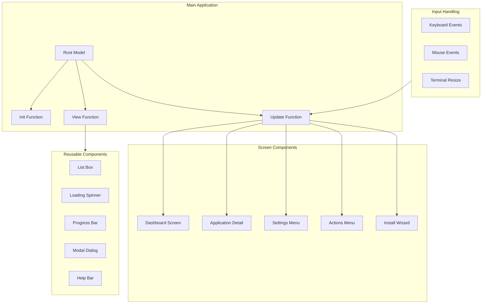

# Deep Dive: TUI Dashboard Implementation

## Overview

This deep dive examines ONCE's Terminal User Interface (TUI) built with the Bubble Tea framework - how the dashboard renders application status, handles user input, manages screen navigation, and provides an intuitive interface for managing Docker containers.

## Architecture



## Bubble Tea Architecture

### The Model-View-Update Pattern

```go
// internal/ui/dashboard/dashboard.go

package dashboard

import (
    "github.com/charmbracelet/bubbletea"
    "github.com/basecamp/once/internal/docker"
)

// Model represents the main dashboard state
type Model struct {
    namespace     *docker.Namespace
    applications  []*docker.Application
    selected      int
    cursor        int
    width         int
    height        int
    err           error
    loading       bool
    quit          bool
}

// Init initializes the dashboard
func (m Model) Init() tea.Cmd {
    return loadApplications(m.namespace)
}

// Update handles messages and updates state
func (m Model) Update(msg tea.Msg) (tea.Model, tea.Cmd) {
    switch msg := msg.(type) {
    case tea.KeyMsg:
        return m.handleKeyPress(msg)
    case tea.WindowSizeMsg:
        m.width = msg.Width
        m.height = msg.Height
        return m, nil
    case applicationsLoadedMsg:
        m.applications = msg.apps
        m.loading = false
        return m, nil
    case errMsg:
        m.err = msg.err
        m.loading = false
        return m, nil
    }
    return m, nil
}

// View renders the dashboard
func (m Model) View() string {
    var b strings.Builder
    
    b.WriteString(m.header())
    b.WriteString(m.appList())
    b.WriteString(m.footer())
    
    return b.String()
}
```

### Message Types

```go
// internal/ui/dashboard/messages.go

package dashboard

// Applications loaded from Docker
type applicationsLoadedMsg struct {
    apps []*docker.Application
}

// Error occurred
type errMsg struct {
    err error
}

// Application status changed
type statusChangedMsg struct {
    appName string
    status  string
}

// Command to load applications
func loadApplications(ns *docker.Namespace) tea.Cmd {
    return func() tea.Msg {
        apps, err := ns.Applications()
        if err != nil {
            return errMsg{err}
        }
        return applicationsLoadedMsg{apps}
    }
}

// Command to check application status
func checkStatus(ns *docker.Namespace, appName string) tea.Cmd {
    return func() tea.Msg {
        app, err := ns.Application(appName)
        if err != nil {
            return errMsg{err}
        }
        
        status := "stopped"
        if app.Running {
            status = "running"
        }
        
        return statusChangedMsg{appName, status}
    }
}
```

## Dashboard Screen

### Main Dashboard View

```go
// internal/ui/dashboard/dashboard.go

func (m Model) View() string {
    if m.err != nil {
        return m.errorView()
    }
    
    if m.loading {
        return m.loadingView()
    }
    
    var b strings.Builder
    
    // Header with title and system info
    b.WriteString(m.header())
    
    // Application list
    b.WriteString(m.appList())
    
    // Footer with help
    b.WriteString(m.footer())
    
    return b.String()
}

func (m Model) header() string {
    var b strings.Builder
    
    b.WriteString("\n")
    b.WriteString("┌─ ONCE Dashboard ─" + strings.Repeat("─", m.width-20) + "┐\n")
    b.WriteString("│\n")
    b.WriteString(fmt.Sprintf("│  %d Applications  •  Namespace: %s\n", 
        len(m.applications), m.namespace.Name))
    b.WriteString("│\n")
    return b.String()
}

func (m Model) appList() string {
    var b strings.Builder
    
    if len(m.applications) == 0 {
        b.WriteString("│  No applications installed.\n")
        b.WriteString("│\n")
        b.WriteString("│  Press [i] to install your first application.\n")
        b.WriteString("│\n")
    } else {
        for i, app := range m.applications {
            status := "○"
            if app.Running {
                status = "✓"
            }
            
            cursor := " "
            if i == m.selected {
                cursor = "→"
            }
            
            statusText := "Stopped"
            if app.Running {
                statusText = fmt.Sprintf("Running (%s)", 
                    formatUptime(app.RunningSince))
            }
            
            b.WriteString(fmt.Sprintf("│  %s %s %s  %s\n", 
                cursor, status, app.Settings.Host, statusText))
        }
    }
    
    b.WriteString("│\n")
    return b.String()
}

func (m Model) footer() string {
    var b strings.Builder
    
    b.WriteString("└─")
    b.WriteString(strings.Repeat("─", m.width-4))
    b.WriteString("┘\n")
    b.WriteString("\n")
    b.WriteString("  [i] Install  [s] Settings  [a] Actions  [r] Refresh  [q] Quit\n")
    
    return b.String()
}

func formatUptime(since time.Time) string {
    d := time.Since(since)
    
    if d < time.Hour {
        return fmt.Sprintf("%dm", int(d.Minutes()))
    } else if d < 24*time.Hour {
        return fmt.Sprintf("%dh, %dm", int(d.Hours()), int(d.Minutes())%60)
    } else {
        return fmt.Sprintf("%dd, %dh", int(d.Hours())/24, int(d.Hours())%24)
    }
}
```

### Keyboard Input Handling

```go
// internal/ui/dashboard/dashboard.go

func (m Model) handleKeyPress(key tea.KeyMsg) (tea.Model, tea.Cmd) {
    switch key.String() {
    case "q", "ctrl+c":
        m.quit = true
        return m, tea.Quit
        
    case "up", "k":
        if m.selected > 0 {
            m.selected--
        }
        return m, nil
        
    case "down", "j":
        if m.selected < len(m.applications)-1 {
            m.selected++
        }
        return m, nil
        
    case "i":
        // Open install wizard
        return openInstallWizard(m.namespace)
        
    case "s":
        // Open settings for selected app
        if len(m.applications) > 0 {
            return openSettings(m.applications[m.selected])
        }
        return m, nil
        
    case "a":
        // Open actions menu
        if len(m.applications) > 0 {
            return openActionsMenu(m.applications[m.selected])
        }
        return m, nil
        
    case "r":
        // Refresh application list
        m.loading = true
        return m, loadApplications(m.namespace)
        
    case "enter":
        // Open application detail view
        if len(m.applications) > 0 {
            return openAppDetail(m.applications[m.selected])
        }
        return m, nil
    }
    
    return m, nil
}
```

## Application Detail Screen

### App Detail View

```go
// internal/ui/application/application.go

package application

type Model struct {
    application  *docker.Application
    logs         []string
    logsLoaded   bool
    logsLoading  bool
    metrics      *docker.Metrics
    width        int
    height       int
    selectedTab  int  // 0: Overview, 1: Logs, 2: Settings
}

func (m Model) View() string {
    var b strings.Builder
    
    b.WriteString(m.header())
    b.WriteString(m.tabBar())
    b.WriteString(m.content())
    b.WriteString(m.footer())
    
    return b.String()
}

func (m Model) header() string {
    status := "Stopped"
    statusColor := "red"
    if m.application.Running {
        status = "Running"
        statusColor = "green"
    }
    
    return fmt.Sprintf(`
┌─ Application: %s
│
│  Hostname: %s
│  Status:   %s
│  Uptime:   %s
│
`, 
        m.application.Settings.Name,
        m.application.Settings.Host,
        status,
        formatUptime(m.application.RunningSince))
}

func (m Model) tabBar() string {
    tabs := []string{"Overview", "Logs", "Settings"}
    
    var b strings.Builder
    b.WriteString("  ")
    
    for i, tab := range tabs {
        if i == m.selectedTab {
            b.WriteString(fmt.Sprintf("▸ %s ", tab))
        } else {
            b.WriteString(fmt.Sprintf("  %s ", tab))
        }
    }
    
    b.WriteString("\n\n")
    return b.String()
}

func (m Model) content() string {
    switch m.selectedTab {
    case 0:
        return m.overviewContent()
    case 1:
        return m.logsContent()
    case 2:
        return m.settingsContent()
    default:
        return ""
    }
}

func (m Model) overviewContent() string {
    var b strings.Builder
    
    if m.metrics != nil {
        b.WriteString(fmt.Sprintf(`  Resource Usage:
    CPU:    %.1f%%
    Memory: %s / %s
    Disk:   %s / %s
    
`, 
            m.metrics.CPUUsage,
            formatBytes(m.metrics.MemoryUsage),
            formatBytes(m.metrics.MemoryLimit),
            formatBytes(m.metrics.DiskUsage),
            formatBytes(m.metrics.DiskLimit)))
    }
    
    b.WriteString("  Network:\n")
    if m.metrics != nil {
        b.WriteString(fmt.Sprintf("    RX: %s\n", formatBytes(m.metrics.NetworkRx)))
        b.WriteString(fmt.Sprintf("    TX: %s\n", formatBytes(m.metrics.NetworkTx)))
    }
    
    return b.String()
}

func (m Model) logsContent() string {
    var b strings.Builder
    
    if m.logsLoading {
        return "  Loading logs...\n"
    }
    
    if !m.logsLoaded {
        return "  Press 'r' to refresh logs\n"
    }
    
    b.WriteString("┌─ Recent Logs ─────────────────────────────────────┐\n")
    
    for _, line := range m.logs {
        b.WriteString(fmt.Sprintf("│ %s\n", line))
    }
    
    b.WriteString("└───────────────────────────────────────────────────┘\n")
    b.WriteString("\n  [r] Refresh  [f] Follow  [c] Clear\n")
    
    return b.String()
}
```

### Logs Streaming

```go
// internal/ui/application/logs.go

package application

import (
    "bufio"
    "context"
    "time"
    
    "github.com/charmbracelet/bubbletea"
    "github.com/basecamp/once/internal/docker"
)

// Stream logs from container
func streamLogs(app *docker.Application) tea.Cmd {
    return func() tea.Msg {
        ctx, cancel := context.WithTimeout(context.Background(), 30*time.Second)
        defer cancel()
        
        reader, err := app.Logs(ctx, docker.LogOptions{
            Tail:    100,
            Follow:  false,
            Since:   time.Now().Add(-1 * time.Hour).Format(time.RFC3339),
            Until:   time.Now().Format(time.RFC3339),
            Colors:  true,
        })
        
        if err != nil {
            return errMsg{err}
        }
        
        var lines []string
        scanner := bufio.NewScanner(reader)
        
        for scanner.Scan() {
            lines = append(lines, scanner.Text())
        }
        
        return logsLoadedMsg{lines}
    }
}

// Follow logs in real-time
func followLogs(app *docker.Application) tea.Cmd {
    return func() tea.Msg {
        ctx := context.Background()
        
        reader, err := app.Logs(ctx, docker.LogOptions{
            Follow: true,
            Since:  time.Now().Format(time.RFC3339),
        })
        
        if err != nil {
            return errMsg{err}
        }
        
        scanner := bufio.NewScanner(reader)
        
        if scanner.Scan() {
            return logLineMsg{scanner.Text()}
        }
        
        return nil
    }
}

type logsLoadedMsg struct {
    lines []string
}

type logLineMsg struct {
    line string
}
```

## Settings Menu

### Settings Screen

```go
// internal/ui/settings/settings.go

package settings

type Model struct {
    application  *docker.Application
    selected     int
    options      []SettingOption
    width        int
    height       int
    editing      bool
    editValue    string
    editField    string
}

type SettingOption struct {
    label       string
    description string
    value       string
    editable    bool
    action      func() tea.Cmd
}

func (m Model) View() string {
    var b strings.Builder
    
    b.WriteString(fmt.Sprintf("┌─ Settings: %s ─", m.application.Settings.Name))
    b.WriteString(strings.Repeat("─", m.width-30))
    b.WriteString("┐\n")
    
    for i, opt := range m.options {
        cursor := " "
        if i == m.selected {
            cursor = "→"
        }
        
        b.WriteString(fmt.Sprintf("│ %s %-20s  %s\n", cursor, opt.label, opt.value))
        b.WriteString(fmt.Sprintf("│    %s\n", opt.description))
        b.WriteString("│\n")
    }
    
    b.WriteString("└─")
    b.WriteString(strings.Repeat("─", m.width-4))
    b.WriteString("┘\n")
    b.WriteString("\n")
    b.WriteString("  ↑↓ Navigate  Enter Select  Esc Back\n")
    
    return b.String()
}

func (m Model) Init() tea.Cmd {
    m.options = []SettingOption{
        {
            label:       "Hostname",
            description: "Domain name for this application",
            value:       m.application.Settings.Host,
            editable:    true,
        },
        {
            label:       "Auto-Update",
            description: "Automatically update to new versions",
            value:       formatBool(m.application.Settings.AutoUpdate),
            editable:    true,
        },
        {
            label:       "Backup Location",
            description: "Directory for automatic backups",
            value:       m.application.Settings.Backup.Location,
            editable:    true,
        },
        {
            label:       "Auto-Backup",
            description: "Create automatic backups on schedule",
            value:       formatBool(m.application.Settings.Backup.AutoBackup),
            editable:    true,
        },
        {
            label:       "Fork Image",
            description: "Custom Docker image to use",
            value:       m.application.Settings.Image,
            editable:    true,
        },
        {
            label:       "Email Settings",
            description: "SMTP configuration for email",
            action:      openEmailSettings,
        },
        {
            label:       "Resource Limits",
            description: "CPU and memory constraints",
            action:      openResourceSettings,
        },
    }
    
    return nil
}

func (m Model) Update(msg tea.Msg) (tea.Model, tea.Cmd) {
    switch msg := msg.(type) {
    case tea.KeyMsg:
        return m.handleKeyPress(msg)
    }
    return m, nil
}

func (m Model) handleKeyPress(key tea.KeyMsg) (tea.Model, tea.Cmd) {
    switch key.String() {
    case "up", "k":
        if m.selected > 0 {
            m.selected--
        }
        return m, nil
        
    case "down", "j":
        if m.selected < len(m.options)-1 {
            m.selected++
        }
        return m, nil
        
    case "enter":
        opt := m.options[m.selected]
        
        if m.editing {
            // Save edited value
            return m, saveSetting(m.application, m.editField, m.editValue)
        }
        
        if opt.editable {
            // Start editing
            m.editing = true
            m.editValue = opt.value
            m.editField = strings.ToLower(strings.ReplaceAll(opt.label, " ", "_"))
            return m, nil
        }
        
        if opt.action != nil {
            // Open sub-menu
            return m, opt.action()
        }
        
    case "esc":
        if m.editing {
            m.editing = false
        } else {
            // Return to dashboard
            return m, returnToDashboard
        }
    }
    
    return m, nil
}
```

### Email Settings Sub-Menu

```go
// internal/ui/settings/email.go

package settings

type EmailModel struct {
    application *docker.Application
    selected    int
    fields      map[string]string
    saving      bool
    saved       bool
    err         error
}

func (m EmailModel) Init() tea.Cmd {
    m.fields = map[string]string{
        "smtp_address": m.application.Settings.Email.Address,
        "smtp_port":    m.application.Settings.Email.Port,
        "smtp_username": m.application.Settings.Email.Username,
        "smtp_password": "••••••••",
        "from_address":  m.application.Settings.Email.From,
    }
    return nil
}

func (m EmailModel) View() string {
    var b strings.Builder
    
    b.WriteString("┌─ Email Settings ─────────────────────────────────────┐\n")
    b.WriteString("│\n")
    
    fields := []struct {
        key   string
        label string
    }{
        {"smtp_address", "SMTP Address"},
        {"smtp_port", "SMTP Port"},
        {"smtp_username", "SMTP Username"},
        {"smtp_password", "SMTP Password"},
        {"from_address", "From Address"},
    }
    
    for i, field := range fields {
        cursor := " "
        if i == m.selected {
            cursor = "→"
        }
        
        value := m.fields[field.key]
        if field.key == "smtp_password" && value != "" {
            value = "••••••••"
        }
        
        b.WriteString(fmt.Sprintf("│ %s %-16s  %s\n", cursor, field.label, value))
    }
    
    b.WriteString("│\n")
    b.WriteString("└──────────────────────────────────────────────────────┘\n")
    b.WriteString("\n")
    b.WriteString("  ↑↓ Navigate  Enter Edit  s Save  Esc Back\n")
    
    if m.saving {
        b.WriteString("\n  Saving...\n")
    }
    if m.saved {
        b.WriteString("\n  ✓ Settings saved!\n")
    }
    if m.err != nil {
        b.WriteString(fmt.Sprintf("\n  ✗ Error: %s\n", m.err))
    }
    
    return b.String()
}

func (m EmailModel) saveSettings() tea.Cmd {
    return func() tea.Msg {
        err := m.application.UpdateEmailSettings(m.fields)
        if err != nil {
            return errMsg{err}
        }
        return settingsSavedMsg{}
    }
}
```

## Actions Menu

### Actions Modal

```go
// internal/ui/actions/actions.go

package actions

type Model struct {
    application *docker.Application
    selected    int
    actions     []Action
    confirming  bool
    processing  bool
    result      string
}

type Action struct {
    label       string
    description string
    destructive bool
    requiresConfirm bool
    do          func() tea.Cmd
}

func (m Model) View() string {
    var b strings.Builder
    
    b.WriteString("┌─ Actions: ")
    b.WriteString(m.application.Settings.Name)
    b.WriteString(" ───────────────────────────────────┐\n")
    
    for i, action := range m.actions {
        cursor := " "
        if i == m.selected {
            cursor = "→"
        }
        
        color := ""
        if action.destructive {
            color = "red"
        }
        
        b.WriteString(fmt.Sprintf("│ %s %-20s  %s\n", cursor, action.label, action.description))
    }
    
    b.WriteString("└──────────────────────────────────────────────────────┘\n")
    b.WriteString("\n")
    b.WriteString("  ↑↓ Navigate  Enter Execute  Esc Cancel\n")
    
    if m.confirming {
        b.WriteString("\n")
        b.WriteString("  Are you sure? This action cannot be undone.\n")
        b.WriteString("  [y] Yes, proceed  [n] Cancel\n")
    }
    
    if m.processing {
        b.WriteString("\n")
        b.WriteString("  Processing...\n")
    }
    
    if m.result != "" {
        b.WriteString("\n")
        b.WriteString(fmt.Sprintf("  %s\n", m.result))
    }
    
    return b.String()
}

func defaultActions(app *docker.Application) []Action {
    return []Action{
        {
            label:       "Start",
            description: "Start the application",
            do: func() tea.Cmd {
                return func() tea.Msg {
                    err := app.Start()
                    if err != nil {
                        return errMsg{err}
                    }
                    return actionCompletedMsg{"Application started"}
                }
            },
        },
        {
            label:       "Stop",
            description: "Stop the application",
            do: func() tea.Cmd {
                return func() tea.Msg {
                    err := app.Stop()
                    if err != nil {
                        return errMsg{err}
                    }
                    return actionCompletedMsg{"Application stopped"}
                }
            },
        },
        {
            label:       "Restart",
            description: "Restart the application",
            do: func() tea.Cmd {
                return func() tea.Msg {
                    err := app.Restart()
                    if err != nil {
                        return errMsg{err}
                    }
                    return actionCompletedMsg{"Application restarted"}
                }
            },
        },
        {
            label:       "Backup",
            description: "Create a backup now",
            do: func() tea.Cmd {
                return func() tea.Msg {
                    err := app.Backup(context.Background())
                    if err != nil {
                        return errMsg{err}
                    }
                    return actionCompletedMsg{"Backup created"}
                }
            },
        },
        {
            label:       "Remove",
            description: "Remove the application",
            destructive: true,
            requiresConfirm: true,
            do: func() tea.Cmd {
                return func() tea.Msg {
                    err := app.Remove()
                    if err != nil {
                        return errMsg{err}
                    }
                    return actionCompletedMsg{"Application removed"}
                }
            },
        },
    }
}
```

## Install Wizard

### Multi-Step Installation

```go
// internal/ui/install/install.go

package install

type Model struct {
    step        int
    totalSteps  int
    namespace   *docker.Namespace
    
    // Step 1: Choose application
    apps        []BuiltinApp
    selectedApp int
    customImage string
    
    // Step 2: Enter hostname
    hostname    string
    hostnameErr string
    
    // Step 3: Review
    reviewing   bool
    
    // Step 4: Installing
    installing  bool
    progress    float64
    status      string
    err         error
}

type BuiltinApp struct {
    Name        string
    Image       string
    Description string
}

var builtinApps = []BuiltinApp{
    {"Writebook", "37signals/writebook:latest", "Note-taking and journals"},
    {"Pitch", "37signals/pitch:latest", "Presentation software"},
    {"Present", "37signals/present:latest", "Slide decks"},
    {"Campfire", "37signals/campfire:latest", "Chat and messaging"},
}

func (m Model) View() string {
    var b strings.Builder
    
    b.WriteString(m.header())
    b.WriteString(m.stepView())
    b.WriteString(m.footer())
    
    return b.String()
}

func (m Model) header() string {
    var b strings.Builder
    
    b.WriteString("\n")
    b.WriteString("┌─ Install Application ─" + strings.Repeat("─", m.width-26) + "┐\n")
    b.WriteString(fmt.Sprintf("│  Step %d of %d\n", m.step+1, m.totalSteps))
    b.WriteString("│\n")
    return b.String()
}

// Step 1: Choose Application
func (m Model) chooseAppView() string {
    var b strings.Builder
    
    b.WriteString("│  Select an application to install:\n")
    b.WriteString("│\n")
    
    for i, app := range m.apps {
        cursor := " "
        if i == m.selectedApp {
            cursor = "→"
        }
        
        b.WriteString(fmt.Sprintf("│  %s %s\n", cursor, app.Name))
        b.WriteString(fmt.Sprintf("│     %s\n", app.Description))
        b.WriteString("│\n")
    }
    
    b.WriteString("│  Or enter custom image path below\n")
    b.WriteString("│\n")
    
    return b.String()
}

// Step 2: Enter Hostname
func (m Model) enterHostnameView() string {
    var b strings.Builder
    
    b.WriteString("│  Enter hostname for ")
    b.WriteString(m.apps[m.selectedApp].Name)
    b.WriteString(":\n")
    b.WriteString("│\n")
    b.WriteString(fmt.Sprintf("│  > %s\n", m.hostname))
    b.WriteString("│\n")
    
    if m.hostnameErr != "" {
        b.WriteString(fmt.Sprintf("│  Error: %s\n", m.hostnameErr))
        b.WriteString("│\n")
    }
    
    b.WriteString("│  DNS Requirements:\n")
    b.WriteString("│  • Create A record: ")
    b.WriteString(m.hostname)
    b.WriteString(" → YOUR_SERVER_IP\n")
    b.WriteString("│  • Wait for DNS propagation (1-5 minutes)\n")
    b.WriteString("│\n")
    
    return b.String()
}

// Step 3: Review
func (m Model) reviewView() string {
    var b strings.Builder
    
    b.WriteString("│  Review installation:\n")
    b.WriteString("│\n")
    b.WriteString(fmt.Sprintf("│  Application: %s\n", m.apps[m.selectedApp].Name))
    b.WriteString(fmt.Sprintf("│  Image:       %s\n", m.apps[m.selectedApp].Image))
    b.WriteString(fmt.Sprintf("│  Hostname:    %s\n", m.hostname))
    b.WriteString("│\n")
    b.WriteString("│  This will:\n")
    b.WriteString("│  • Pull Docker image\n")
    b.WriteString("│  • Create persistent volume\n")
    b.WriteString("│  • Generate secrets\n")
    b.WriteString("│  • Start container\n")
    b.WriteString("│  • Register with proxy\n")
    b.WriteString("│\n")
    
    return b.String()
}

// Step 4: Installing
func (m Model) installingView() string {
    var b strings.Builder
    
    b.WriteString("│  Installing...\n")
    b.WriteString("│\n")
    
    // Progress bar
    barWidth := m.width - 10
    filled := int(m.progress * float64(barWidth))
    
    b.WriteString("│  [")
    b.WriteString(strings.Repeat("█", filled))
    b.WriteString(strings.Repeat("░", barWidth-filled))
    b.WriteString("] ")
    b.WriteString(fmt.Sprintf("%.0f%%\n", m.progress*100))
    b.WriteString("│\n")
    
    b.WriteString(fmt.Sprintf("│  %s\n", m.status))
    b.WriteString("│\n")
    
    if m.err != nil {
        b.WriteString(fmt.Sprintf("│  Error: %s\n", m.err))
    }
    
    return b.String()
}
```

## Conclusion

ONCE's TUI provides:

1. **Clean Architecture**: Model-View-Update pattern with composable screens
2. **Responsive UI**: Real-time log streaming, progress indicators
3. **Intuitive Navigation**: Keyboard shortcuts, clear help text
4. **Multi-Step Workflows**: Install wizard with progress tracking
5. **Error Handling**: Graceful error display and recovery
6. **Reusable Components**: List boxes, modals, progress bars
