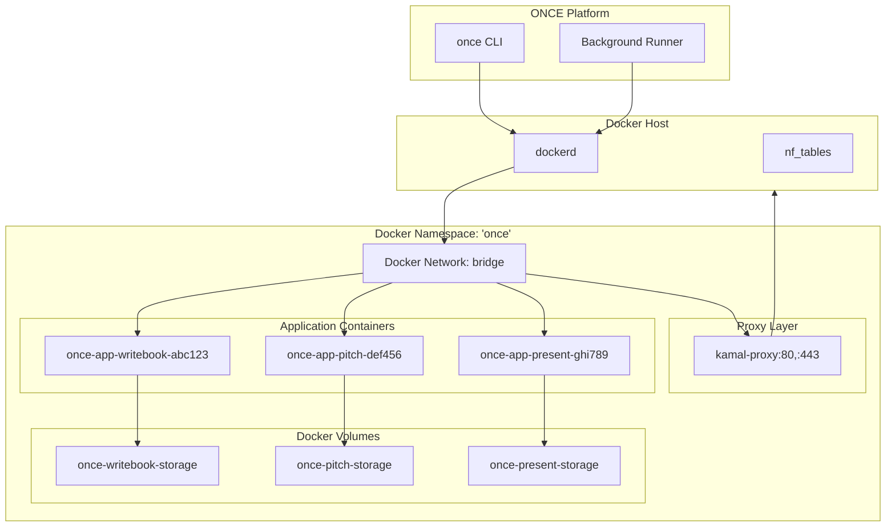

# Deep Dive: Docker Orchestration

## Overview

This deep dive examines ONCE's Docker orchestration layer - how namespaces isolate applications, containers are deployed with proper configuration, volumes manage persistent data, and the kamal-proxy integrates for request routing.

## Architecture



## Namespace Management

### Namespace Structure

```go
// internal/docker/namespace.go

package docker

import (
    "context"
    "fmt"
    "github.com/docker/docker/client"
    "github.com/docker/docker/api/types/network"
)

// Namespace represents an isolated Docker environment
type Namespace struct {
    name   string
    client *client.Client
    proxy  *Proxy
}

// NewNamespace creates or connects to an existing namespace
func NewNamespace(ctx context.Context, name string) (*Namespace, error) {
    client, err := client.NewClientWithOpts(client.FromEnv)
    if err != nil {
        return nil, fmt.Errorf("creating docker client: %w", err)
    }
    
    ns := &Namespace{
        name:   name,
        client: client,
    }
    
    // Ensure namespace exists
    if err := ns.ensure(ctx); err != nil {
        return nil, err
    }
    
    // Initialize proxy
    ns.proxy = NewProxy(ns)
    
    return ns, nil
}

// ensure creates the Docker network if it doesn't exist
func (ns *Namespace) ensure(ctx context.Context) error {
    // Check if network exists
    networks, err := ns.client.NetworkList(ctx, network.ListOptions{})
    if err != nil {
        return fmt.Errorf("listing networks: %w", err)
    }
    
    for _, n := range networks {
        if n.Name == ns.name {
            // Network exists, we're done
            return nil
        }
    }
    
    // Create new network
    _, err = ns.client.NetworkCreate(ctx, ns.name, network.CreateOptions{
        Driver: "bridge",
        Options: map[string]string{
            "com.docker.network.bridge.name": ns.name,
        },
    })
    
    if err != nil {
        return fmt.Errorf("creating network: %w", err)
    }
    
    return nil
}

// Applications returns all applications in this namespace
func (ns *Namespace) Applications(ctx context.Context) ([]*Application, error) {
    // List containers with our namespace label
    containers, err := ns.client.ContainerList(ctx, container.ListOptions{
        All: true,
        Filters: filters.NewArgs(
            filters.Arg("label", fmt.Sprintf("once.namespace=%s", ns.name)),
            filters.Arg("label", "once.app-name"),
        ),
    })
    
    if err != nil {
        return nil, fmt.Errorf("listing containers: %w", err)
    }
    
    // Group containers by application name
    appsByName := make(map[string][]container.Summary)
    for _, c := range containers {
        appName := c.Labels["once.app-name"]
        appsByName[appName] = append(appsByName[appName], c)
    }
    
    // Create Application objects
    var apps []*Application
    for name, containers := range appsByName {
        app := NewApplication(ns, name)
        app.updateFromContainers(containers)
        apps = append(apps, app)
    }
    
    return apps, nil
}

// Application returns a specific application by name
func (ns *Namespace) Application(ctx context.Context, name string) (*Application, error) {
    containers, err := ns.client.ContainerList(ctx, container.ListOptions{
        All: true,
        Filters: filters.NewArgs(
            filters.Arg("label", fmt.Sprintf("once.namespace=%s", ns.name)),
            filters.Arg("label", fmt.Sprintf("once.app-name=%s", name)),
        ),
    })
    
    if err != nil {
        return nil, err
    }
    
    if len(containers) == 0 {
        return nil, ErrApplicationNotFound
    }
    
    app := NewApplication(ns, name)
    app.updateFromContainers(containers)
    
    return app, nil
}
```

### Namespace Discovery

```go
// internal/docker/namespace.go

// ListNamespaces returns all ONCE namespaces on this system
func ListNamespaces(ctx context.Context) ([]string, error) {
    client, err := client.NewClientWithOpts(client.FromEnv)
    if err != nil {
        return nil, err
    }
    
    networks, err := client.NetworkList(ctx, network.ListOptions{})
    if err != nil {
        return nil, err
    }
    
    var namespaces []string
    for _, n := range networks {
        // ONCE namespaces are bridge networks with specific label
        if n.Driver == "bridge" && n.Labels["once.namespace"] == "true" {
            namespaces = append(namespaces, n.Name)
        }
    }
    
    return namespaces, nil
}

// Destroy removes the namespace and all its resources
func (ns *Namespace) Destroy(ctx context.Context) error {
    // Stop and remove all applications
    apps, err := ns.Applications(ctx)
    if err != nil {
        return err
    }
    
    for _, app := range apps {
        if err := app.Remove(ctx); err != nil {
            return err
        }
    }
    
    // Remove proxy
    if err := ns.proxy.Remove(ctx); err != nil {
        return err
    }
    
    // Remove network
    if err := ns.client.NetworkRemove(ctx, ns.name); err != nil {
        return err
    }
    
    return nil
}
```

## Container Deployment

### Application Deployment Flow

```go
// internal/docker/application.go

package docker

import (
    "context"
    "crypto/rand"
    "encoding/hex"
    "fmt"
    
    "github.com/docker/docker/api/types/container"
    "github.com/docker/docker/api/types/network"
    "github.com/docker/go-connections/nat"
)

// Application represents a deployed application
type Application struct {
    namespace *Namespace
    Settings  ApplicationSettings
    Running   bool
    RunningSince time.Time
}

// ApplicationSettings holds configuration for an application
type ApplicationSettings struct {
    Name       string
    Image      string
    Host       string
    AutoUpdate bool
    Backup     BackupSettings
    Resources  ResourceSettings
    Email      EmailSettings
}

// Deploy deploys or updates an application
func (a *Application) Deploy(ctx context.Context, progress ProgressCallback) error {
    if progress != nil {
        progress(0.0, "Pulling Docker image...")
    }
    
    // Step 1: Pull image
    if err := a.pullImage(ctx, progress); err != nil {
        return err
    }
    
    if progress != nil {
        progress(0.25, "Creating persistent volume...")
    }
    
    // Step 2: Create/get volume
    vol, err := a.Volume(ctx)
    if err != nil {
        return fmt.Errorf("getting volume: %w", err)
    }
    
    if progress != nil {
        progress(0.5, "Deploying container...")
    }
    
    // Step 3: Deploy container
    if err := a.deployWithVolume(ctx, vol, progress); err != nil {
        return err
    }
    
    if progress != nil {
        progress(0.75, "Registering with proxy...")
    }
    
    // Step 4: Register with proxy
    tlsEnabled := !isLocalhost(a.Settings.Host)
    if err := a.namespace.Proxy().Deploy(ctx, DeployOptions{
        AppName: a.Settings.Name,
        Target:  a.Settings.Name,
        Host:    a.Settings.Host,
        TLS:     tlsEnabled,
    }); err != nil {
        return fmt.Errorf("deploying to proxy: %w", err)
    }
    
    if progress != nil {
        progress(1.0, "Complete!")
    }
    
    return nil
}

// ContainerRandomID generates a random ID for zero-downtime deploys
func ContainerRandomID() (string, error) {
    b := make([]byte, 6)
    if _, err := rand.Read(b); err != nil {
        return "", err
    }
    return hex.EncodeToString(b), nil
}

// pullImage pulls the Docker image
func (a *Application) pullImage(ctx context.Context, progress ProgressCallback) error {
    // Check if image is local and up-to-date
    images, err := a.namespace.client.ImageList(ctx, image.ListOptions{
        Filters: filters.NewArgs(
            filters.Arg("reference", a.Settings.Image),
        ),
    })
    
    if err != nil {
        return err
    }
    
    if len(images) > 0 {
        // Image exists, inspect to check if we need to pull
        inspect, _, err := a.namespace.client.ImageInspectWithRaw(ctx, a.Settings.Image)
        if err != nil {
            return err
        }
        
        // Pull to check for updates (Docker does this efficiently)
        if progress != nil {
            progress(0.0, fmt.Sprintf("Checking for updates: %s", a.Settings.Image))
        }
    }
    
    // Pull image
    out, err := a.namespace.client.ImagePull(ctx, a.Settings.Image, image.PullOptions{})
    if err != nil {
        return fmt.Errorf("pulling image: %w", err)
    }
    defer out.Close()
    
    // Parse pull progress
    decoder := json.NewDecoder(out)
    for {
        var msg struct {
            Status         string `json:"status"`
            ProgressDetail struct {
                Current int64 `json:"current"`
                Total   int64 `json:"total"`
            } `json:"progressDetail"`
        }
        
        if err := decoder.Decode(&msg); err == io.EOF {
            break
        } else if err != nil {
            return err
        }
        
        if progress != nil && msg.ProgressDetail.Total > 0 {
            pct := float64(msg.ProgressDetail.Current) / float64(msg.ProgressDetail.Total)
            progress(0.25 * pct, msg.Status)
        }
    }
    
    return nil
}
```

### Container Configuration

```go
// internal/docker/application.go

// deployWithVolume creates and starts the container
func (a *Application) deployWithVolume(ctx context.Context, vol *ApplicationVolume, progress ProgressCallback) error {
    // Generate container name with random ID
    id, err := ContainerRandomID()
    if err != nil {
        return err
    }
    
    containerName := fmt.Sprintf("%s-app-%s-%s", 
        a.namespace.name, 
        a.Settings.Name, 
        id[:12])
    
    // Build environment variables
    env := a.buildEnv(vol.Settings)
    
    // Configure port exposure (internal only - proxy handles external)
    exposedPorts := nat.PortSet{
        "80/tcp": {},
    }
    
    // Host configuration
    hostConfig := &container.HostConfig{
        RestartPolicy: container.RestartPolicy{
            Name:              "always",  // Auto-restart on failure
            MaximumRetryCount: 0,
        },
        LogConfig: container.LogConfig{
            Type: "json-file",
            Config: map[string]string{
                "max-size": "10m",
                "max-file": "3",
            },
        },
        NetworkMode: container.NetworkMode(a.namespace.name),
        Mounts:      a.volumeMounts(vol),
        Resources:   a.resourceConfig(),
    }
    
    // Container configuration
    config := &container.Config{
        Image:        a.Settings.Image,
        Env:          env,
        ExposedPorts: exposedPorts,
        Labels: map[string]string{
            "once.namespace":  a.namespace.name,
            "once.app-name":   a.Settings.Name,
            "once.app-host":   a.Settings.Host,
            "once.version":    time.Now().Format(time.RFC3339),
        },
        Healthcheck: &container.HealthConfig{
            Test: []string{"CMD", "curl", "-f", "http://localhost:80/up"},
            Interval: 30 * time.Second,
            Timeout:  5 * time.Second,
            Retries:  3,
            StartPeriod: 10 * time.Second,
        },
    }
    
    // Create container
    resp, err := a.namespace.client.ContainerCreate(
        ctx, config, hostConfig, nil, nil, containerName)
    if err != nil {
        return fmt.Errorf("creating container: %w", err)
    }
    
    // Start container
    if err := a.namespace.client.ContainerStart(
        ctx, resp.ID, container.StartOptions{}); err != nil {
        return fmt.Errorf("starting container: %w", err)
    }
    
    // Remove old containers for this app
    a.removeContainersExcept(ctx, containerName)
    
    return nil
}

// buildEnv builds environment variables for the container
func (a *Application) buildEnv(volSettings ApplicationVolumeSettings) []string {
    env := []string{
        // Required by all ONCE apps
        fmt.Sprintf("SECRET_KEY_BASE=%s", volSettings.SecretKeyBase),
        fmt.Sprintf("VAPID_PUBLIC_KEY=%s", volSettings.VAPIDPublicKey),
        fmt.Sprintf("VAPID_PRIVATE_KEY=%s", volSettings.VAPIDPrivateKey),
        
        // Rails convention support
        "RAILS_ENV=production",
        
        // Storage paths
        "STORAGE_PATH=/storage",
    }
    
    // SSL configuration
    if isLocalhost(a.Settings.Host) {
        env = append(env, "DISABLE_SSL=true")
    }
    
    // Email settings
    if a.Settings.Email.Address != "" {
        env = append(env,
            fmt.Sprintf("SMTP_ADDRESS=%s", a.Settings.Email.Address),
            fmt.Sprintf("SMTP_PORT=%s", a.Settings.Email.Port),
            fmt.Sprintf("SMTP_USERNAME=%s", a.Settings.Email.Username),
            fmt.Sprintf("SMTP_PASSWORD=%s", a.Settings.Email.Password),
            fmt.Sprintf("MAILER_FROM_ADDRESS=%s", a.Settings.Email.From),
        )
    }
    
    // CPU quota detection
    if cpus, err := detectCPUs(); err == nil {
        env = append(env, fmt.Sprintf("NUM_CPUS=%d", cpus))
    }
    
    return env
}

// volumeMounts returns volume mount configuration
func (a *Application) volumeMounts(vol *ApplicationVolume) []mount.Mount {
    return []mount.Mount{
        {
            Type:   mount.TypeVolume,
            Source: vol.Name,
            Target: "/storage",
            VolumeOptions: &mount.VolumeOptions{
                NoCopy: true,
            },
        },
        // Rails convention - same volume, different path
        {
            Type:   mount.TypeVolume,
            Source: vol.Name,
            Target: "/rails/storage",
            VolumeOptions: &mount.VolumeOptions{
                NoCopy: true,
            },
        },
    }
}

// resourceConfig returns resource limits
func (a *Application) resourceConfig() container.Resources {
    resources := container.Resources{}
    
    if a.Settings.Resources.Memory > 0 {
        resources.Memory = int64(a.Settings.Resources.Memory) * 1024 * 1024
    }
    
    if a.Settings.Resources.CPU > 0 {
        resources.NanoCPUs = int64(a.Settings.Resources.CPU * 1e9)
    }
    
    return resources
}
```

## Volume Management

### Volume Creation

```go
// internal/docker/volume.go

package docker

import (
    "context"
    "crypto/rand"
    "encoding/hex"
    "fmt"
    
    "github.com/docker/docker/api/types/volume"
)

// ApplicationVolume represents a persistent data volume
type ApplicationVolume struct {
    Name     string
    Settings ApplicationVolumeSettings
}

// ApplicationVolumeSettings holds secrets and config for a volume
type ApplicationVolumeSettings struct {
    SecretKeyBase   string `json:"secret_key_base"`
    VAPIDPublicKey  string `json:"vapid_public_key"`
    VAPIDPrivateKey string `json:"vapid_private_key"`
}

// Volume returns the volume for this application
func (a *Application) Volume(ctx context.Context) (*ApplicationVolume, error) {
    volName := fmt.Sprintf("%s-%s-storage", a.namespace.name, a.Settings.Name)
    
    // Try to get existing volume
    vol, err := a.namespace.client.VolumeGet(ctx, volName, volume.GetOptions{})
    if err == nil {
        // Volume exists, load settings
        return loadVolumeSettings(vol)
    }
    
    // Create new volume
    vol, err = a.namespace.client.VolumeCreate(ctx, volume.CreateOptions{
        Name:   volName,
        Labels: map[string]string{
            "once.namespace": a.namespace.name,
            "once.app-name":  a.Settings.Name,
            "once.volume":    "true",
        },
    })
    
    if err != nil {
        return nil, fmt.Errorf("creating volume: %w", err)
    }
    
    // Generate settings
    settings, err := generateVolumeSettings()
    if err != nil {
        return nil, err
    }
    
    // Save settings to volume
    if err := saveVolumeSettings(vol, settings); err != nil {
        return nil, err
    }
    
    return &ApplicationVolume{
        Name:     volName,
        Settings: settings,
    }, nil
}

// generateVolumeSettings generates cryptographic secrets
func generateVolumeSettings() (ApplicationVolumeSettings, error) {
    // Generate SECRET_KEY_BASE (64 hex chars = 32 bytes)
    secretKey := make([]byte, 32)
    if _, err := rand.Read(secretKey); err != nil {
        return ApplicationVolumeSettings{}, err
    }
    
    // Generate VAPID keys
    vapidPublic, vapidPrivate, err := generateVAPIDKeys()
    if err != nil {
        return ApplicationVolumeSettings{}, err
    }
    
    return ApplicationVolumeSettings{
        SecretKeyBase:   hex.EncodeToString(secretKey),
        VAPIDPublicKey:  vapidPublic,
        VAPIDPrivateKey: vapidPrivate,
    }, nil
}

// saveVolumeSettings saves settings to the volume
func saveVolumeSettings(vol *types.Volume, settings ApplicationVolumeSettings) error {
    // Create a temporary container to write settings
    // This is necessary because volumes can't be written to directly
    
    config := &container.Config{
        Image: "alpine:latest",
        Cmd: []string{"sh", "-c", fmt.Sprintf(`
            mkdir -p /storage/.once
            echo '%s' > /storage/.once/settings.json
        `, marshalJSON(settings))},
    }
    
    hostConfig := &container.HostConfig{
        Mounts: []mount.Mount{
            {
                Type:   mount.TypeVolume,
                Source: vol.Name,
                Target: "/storage",
            },
        },
    }
    
    // Run container to write settings
    // ... container creation and start logic
    
    return nil
}

// loadVolumeSettings loads settings from the volume
func loadVolumeSettings(vol *types.Volume) (*ApplicationVolume, error) {
    // Create temporary container to read settings
    // Similar to save, but reads the file
    
    settings := ApplicationVolumeSettings{}
    // ... read and parse settings
    
    return &ApplicationVolume{
        Name:     vol.Name,
        Settings: settings,
    }, nil
}
```

### Volume Backup

```go
// internal/docker/application_backup.go

package docker

import (
    "archive/tar"
    "compress/gzip"
    "context"
    "encoding/json"
    "fmt"
    "io"
    "os"
    "path/filepath"
    "time"
)

// Backup creates a backup of the application's volume
func (a *Application) Backup(ctx context.Context) error {
    vol, err := a.Volume(ctx)
    if err != nil {
        return err
    }
    
    // Check for pre-backup hook
    hasHook, err := a.hasPreBackupHook(ctx)
    if err != nil {
        return err
    }
    
    var paused bool
    if hasHook {
        // Run pre-backup hook
        if err := a.execHook(ctx, "/hooks/pre-backup"); err != nil {
            return fmt.Errorf("pre-backup hook failed: %w", err)
        }
    } else {
        // Pause container for consistent backup
        if a.Running {
            if err := a.namespace.client.ContainerPause(ctx, a.containerID()); err != nil {
                return fmt.Errorf("pausing container: %w", err)
            }
            paused = true
        }
    }
    
    defer func() {
        // Unpause container
        if paused {
            a.namespace.client.ContainerUnpause(ctx, a.containerID())
        }
    }()
    
    // Extract volume data
    reader, _, err := a.namespace.client.CopyFromContainer(ctx, 
        a.containerID(), "/storage")
    if err != nil {
        return fmt.Errorf("extracting volume: %w", err)
    }
    defer reader.Close()
    
    // Create backup archive
    backupPath := backupFilename(a.Settings.Name)
    backupFile, err := os.Create(backupPath)
    if err != nil {
        return err
    }
    defer backupFile.Close()
    
    gw := gzip.NewWriter(backupFile)
    defer gw.Close()
    
    tw := tar.NewWriter(gw)
    defer tw.Close()
    
    // Write app settings
    appSettingsJSON, _ := json.MarshalIndent(a.Settings, "", "  ")
    if err := tw.WriteHeader(&tar.Header{
        Name: "app-settings.json",
        Mode: 0644,
        Size: int64(len(appSettingsJSON)),
    }); err != nil {
        return err
    }
    if _, err := tw.Write(appSettingsJSON); err != nil {
        return err
    }
    
    // Write volume settings
    volSettingsJSON, _ := json.MarshalIndent(vol.Settings, "", "  ")
    if err := tw.WriteHeader(&tar.Header{
        Name: "vol-settings.json",
        Mode: 0644,
        Size: int64(len(volSettingsJSON)),
    }); err != nil {
        return err
    }
    if _, err := tw.Write(volSettingsJSON); err != nil {
        return err
    }
    
    // Write volume data
    if err := copyTar(tw, reader); err != nil {
        return fmt.Errorf("writing data: %w", err)
    }
    
    return nil
}

// backupFilename generates a backup filename with timestamp
func backupFilename(appName string) string {
    timestamp := time.Now().Format("2006-01-02-150405")
    return fmt.Sprintf("once-backup-%s-%s.tar.gz", appName, timestamp)
}

// hasPreBackupHook checks if the container has a pre-backup hook
func (a *Application) hasPreBackupHook(ctx context.Context) (bool, error) {
    // Check if /hooks/pre-backup exists in container
    _, err := a.namespace.client.ContainerStatPath(ctx, 
        a.containerID(), "/hooks/pre-backup")
    
    if err != nil {
        if client.IsErrNotFound(err) {
            return false, nil
        }
        return false, err
    }
    
    return true, nil
}

// execHook executes a hook script in the container
func (a *Application) execHook(ctx context.Context, hookPath string) error {
    execConfig := types.ExecConfig{
        Cmd:          []string{hookPath},
        AttachStdout: true,
        AttachStderr: true,
    }
    
    exec, err := a.namespace.client.ContainerExecCreate(ctx, 
        a.containerID(), execConfig)
    if err != nil {
        return err
    }
    
    // Start execution
    resp, err := a.namespace.client.ContainerExecAttach(ctx, 
        exec.ID, types.ExecStartCheck{})
    if err != nil {
        return err
    }
    defer resp.Close()
    
    // Wait for completion
    return a.namespace.client.ContainerExecInspect(ctx, exec.ID)
}
```

### Volume Restore

```go
// internal/docker/application_backup.go

// Restore restores an application from a backup archive
func (n *Namespace) Restore(ctx context.Context, r io.Reader) (*Application, error) {
    // Parse backup archive
    appSettings, volSettings, volumeData, err := parseBackup(r)
    if err != nil {
        return nil, fmt.Errorf("parsing backup: %w", err)
    }
    
    // Generate unique name (in case app already exists)
    name := UniqueName(NameFromImageRef(appSettings.Image))
    appSettings.Name = name
    
    // Create volume with restored settings
    vol, err := n.createVolumeWithSettings(ctx, name, volSettings)
    if err != nil {
        return nil, err
    }
    
    // Restore volume data
    if err := n.restoreVolumeData(ctx, vol.Name, volumeData); err != nil {
        return nil, err
    }
    
    // Create application
    app := NewApplication(n, name)
    app.Settings = *appSettings
    
    // Deploy application
    if err := app.Deploy(ctx, nil); err != nil {
        return nil, err
    }
    
    // Run post-restore hook if exists
    if err := app.execHook(ctx, "/hooks/post-restore"); err != nil {
        // Log warning but don't fail
        log.Warn("post-restore hook failed", "error", err)
    }
    
    return app, nil
}

// parseBackup extracts data from a backup archive
func parseBackup(r io.Reader) (*ApplicationSettings, *ApplicationVolumeSettings, io.Reader, error) {
    gr, err := gzip.NewReader(r)
    if err != nil {
        return nil, nil, nil, err
    }
    defer gr.Close()
    
    tr := tar.NewReader(gr)
    
    var appSettings *ApplicationSettings
    var volSettings *ApplicationVolumeSettings
    var dataReader io.Reader
    
    for {
        header, err := tr.Next()
        if err == io.EOF {
            break
        }
        if err != nil {
            return nil, nil, nil, err
        }
        
        switch header.Name {
        case "app-settings.json":
            content, _ := io.ReadAll(tr)
            if err := json.Unmarshal(content, &appSettings); err != nil {
                return nil, nil, nil, err
            }
        case "vol-settings.json":
            content, _ := io.ReadAll(tr)
            if err := json.Unmarshal(content, &volSettings); err != nil {
                return nil, nil, nil, err
            }
        default:
            // This is volume data - return reader positioned here
            dataReader = tr
            return appSettings, volSettings, dataReader, nil
        }
    }
    
    return appSettings, volSettings, nil, fmt.Errorf("no volume data found")
}

// restoreVolumeData writes data to a volume
func (n *Namespace) restoreVolumeData(ctx context.Context, volName string, data io.Reader) error {
    // Create temporary container
    config := &container.Config{
        Image: "alpine:latest",
        Cmd:   []string{"tar", "-xzf", "-", "-C", "/storage"},
    }
    
    hostConfig := &container.HostConfig{
        Mounts: []mount.Mount{
            {
                Type:   mount.TypeVolume,
                Source: volName,
                Target: "/storage",
            },
        },
    }
    
    // Create and start container
    resp, err := n.client.ContainerCreate(ctx, config, hostConfig, nil, nil, "")
    if err != nil {
        return err
    }
    
    // Copy data to container stdin
    copyOpt := types.CopyToContainerOptions{}
    if err := n.client.CopyToContainer(ctx, resp.ID, "/", data, copyOpt); err != nil {
        return err
    }
    
    return nil
}
```

## Proxy Integration

### kamal-proxy Setup

```go
// internal/docker/proxy.go

package docker

import (
    "context"
    "fmt"
    "net"
    "strconv"
    
    "github.com/docker/docker/api/types/container"
    "github.com/docker/go-connections/nat"
)

// Proxy represents the kamal-proxy reverse proxy
type Proxy struct {
    namespace *Namespace
    settings  *ProxySettings
}

// ProxySettings configures the proxy
type ProxySettings struct {
    HTTPPort   int
    HTTPSPort  int
    TLSEnabled bool
}

// DefaultProxySettings returns default proxy configuration
func DefaultProxySettings() *ProxySettings {
    return &ProxySettings{
        HTTPPort:   80,
        HTTPSPort:  443,
        TLSEnabled: true,
    }
}

// Boot starts the proxy container
func (p *Proxy) Boot(ctx context.Context) error {
    // Check if proxy already running
    if p.IsRunning(ctx) {
        return nil
    }
    
    // Pull proxy image
    if _, err := p.namespace.client.ImagePull(ctx, 
        "basecamp/kamal-proxy:latest", image.PullOptions{}); err != nil {
        return fmt.Errorf("pulling proxy image: %w", err)
    }
    
    // Configure ports
    exposedPorts := nat.PortSet{
        "80/tcp":  {},
        "443/tcp": {},
    }
    
    portBindings := nat.PortMap{
        "80/tcp":  {{HostPort: strconv.Itoa(p.settings.HTTPPort)}},
        "443/tcp": {{HostPort: strconv.Itoa(p.settings.HTTPSPort)}},
    }
    
    // Create container
    config := &container.Config{
        Image:        "basecamp/kamal-proxy",
        ExposedPorts: exposedPorts,
        Labels: map[string]string{
            "once.namespace": p.namespace.name,
            "once.proxy":     "true",
        },
    }
    
    hostConfig := &container.HostConfig{
        PortBindings: portBindings,
        NetworkMode:  container.NetworkMode(p.namespace.name),
        RestartPolicy: container.RestartPolicy{
            Name: "always",
        },
    }
    
    resp, err := p.namespace.client.ContainerCreate(ctx, 
        config, hostConfig, nil, nil, 
        fmt.Sprintf("%s-proxy", p.namespace.name))
    
    if err != nil {
        return err
    }
    
    // Start container
    return p.namespace.client.ContainerStart(ctx, 
        resp.ID, container.StartOptions{})
}

// Deploy registers an application with the proxy
func (p *Proxy) Deploy(ctx context.Context, opts DeployOptions) error {
    // Use kamal-proxy CLI inside the container
    cmd := []string{
        "kamal-proxy", "deploy",
        "--name", opts.AppName,
        "--target", opts.Target,
        "--host", opts.Host,
    }
    
    if opts.TLS {
        cmd = append(cmd, "--tls")
    }
    
    execConfig := types.ExecConfig{
        Cmd:          cmd,
        AttachStdout: true,
        AttachStderr: true,
    }
    
    // Get proxy container ID
    proxyID, err := p.getContainerID(ctx)
    if err != nil {
        return err
    }
    
    // Execute command
    exec, err := p.namespace.client.ContainerExecCreate(ctx, proxyID, execConfig)
    if err != nil {
        return err
    }
    
    resp, err := p.namespace.client.ContainerExecAttach(ctx, exec.ID, types.ExecStartCheck{})
    if err != nil {
        return err
    }
    defer resp.Close()
    
    // Check result
    inspect, err := p.namespace.client.ContainerExecInspect(ctx, exec.ID)
    if err != nil {
        return err
    }
    
    if inspect.ExitCode != 0 {
        return fmt.Errorf("proxy deploy failed with exit code %d", inspect.ExitCode)
    }
    
    return nil
}

// Remove unregisters an application from the proxy
func (p *Proxy) Remove(ctx context.Context, appName string) error {
    cmd := []string{
        "kamal-proxy", "remove",
        "--name", appName,
    }
    
    proxyID, err := p.getContainerID(ctx)
    if err != nil {
        return err
    }
    
    execConfig := types.ExecConfig{
        Cmd:          cmd,
        AttachStdout: true,
        AttachStderr: true,
    }
    
    exec, _ := p.namespace.client.ContainerExecCreate(ctx, proxyID, execConfig)
    resp, _ := p.namespace.client.ContainerExecAttach(ctx, exec.ID, types.ExecStartCheck{})
    defer resp.Close()
    
    return nil
}
```

### Deploy Options

```go
// internal/docker/proxy.go

// DeployOptions configures a proxy deployment
type DeployOptions struct {
    AppName string
    Target  string  // Container ID or name
    Host    string  // Hostname for routing
    TLS     bool    // Enable TLS termination
}

// HealthCheckConfig configures proxy health checks
type HealthCheckConfig struct {
    Path     string
    Interval time.Duration
    Timeout  time.Duration
    Retries  int
}

// DefaultHealthCheck returns default health check config
func DefaultHealthCheck() *HealthCheckConfig {
    return &HealthCheckConfig{
        Path:     "/up",
        Interval: 30 * time.Second,
        Timeout:  5 * time.Second,
        Retries:  3,
    }
}

// UpdateHealthCheck updates health check for an app
func (p *Proxy) UpdateHealthCheck(ctx context.Context, appName string, config *HealthCheckConfig) error {
    cmd := []string{
        "kamal-proxy", "update",
        "--name", appName,
        "--health-path", config.Path,
        "--health-interval", config.Interval.String(),
        "--health-timeout", config.Timeout.String(),
    }
    
    // Execute in proxy container
    // ...
    
    return nil
}
```

## Conclusion

ONCE's Docker orchestration provides:

1. **Namespace Isolation**: Dedicated Docker network per ONCE installation
2. **Persistent Volumes**: Data survives container restarts and updates
3. **Zero-Downtime Deploys**: Random container IDs for seamless updates
4. **Proxy Integration**: Automatic routing and TLS termination via kamal-proxy
5. **Backup/Restore**: Consistent backups with hook support
6. **Resource Limits**: CPU and memory constraints per application
7. **Health Checks**: Automatic container health monitoring
