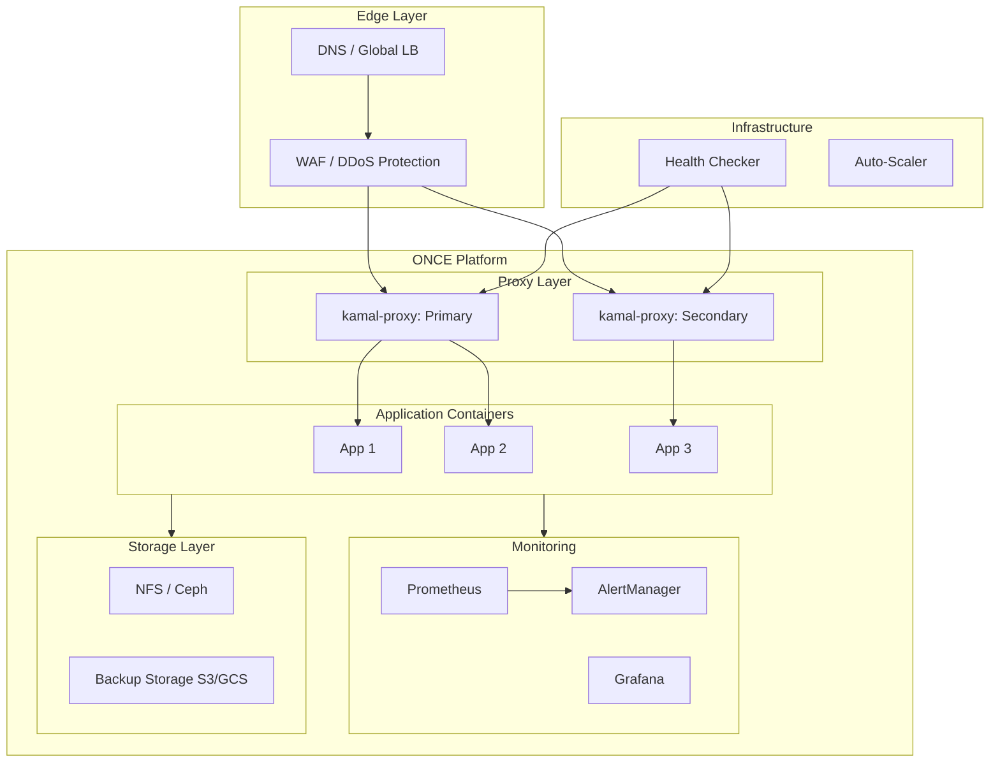

# Production-Grade ONCE Deployments

## Overview

This document covers production deployment patterns for ONCE-based self-hosting platforms including security hardening, monitoring setup, backup strategies, multi-tenant configurations, and enterprise deployment scenarios.

## Architecture



## Security Hardening

### Docker Daemon Hardening

```bash
# /etc/docker/daemon.json

{
    "userland-proxy": false,
    "iptables": true,
    "ip-forward": true,
    "log-driver": "json-file",
    "log-opts": {
        "max-size": "10m",
        "max-file": "3"
    },
    "live-restore": true,
    "userns-remap": "default",
    "no-new-privileges": true,
    "default-ulimits": {
        "nofile": {
            "Name": "nofile",
            "Hard": 65535,
            "Soft": 65535
        }
    }
}
```

### Container Security Options

```rust
// src/security.rs

use bollard::models::{HostConfig, SecurityOpt};

pub fn harden_container_config(host_config: &mut HostConfig) {
    // Drop all capabilities
    host_config.cap_drop = Some(vec![
        "ALL".to_string(),
    ]);
    
    // Add only necessary capabilities
    host_config.cap_add = Some(vec![
        "NET_BIND_SERVICE".to_string(),  // If binding to ports < 1024
        "CHOWN".to_string(),             // If file ownership needed
    ]);
    
    // Security options
    host_config.security_opt = Some(vec![
        "no-new-privileges:true".to_string(),
        "apparmor:docker-default".to_string(),
    ]);
    
    // Read-only root filesystem
    host_config.readonly_rootfs = Some(true);
    
    // Disable privileged mode
    host_config.privileged = Some(false);
    
    // Tmpfs for writable directories
    host_config.tmpfs = Some(std::collections::HashMap::from([
        ("/tmp".to_string(), "rw,noexec,nosuid,size=64m".to_string()),
        ("/var/tmp".to_string(), "rw,noexec,nosuid,size=64m".to_string()),
    ]));
}

pub fn configure_user_namespace_remap() -> Result<(), OnceError> {
    // Enable user namespace remapping
    // /etc/subuid and /etc/subgid should contain:
    // dockremap:100000:65536
    
    std::process::Command::new("systemctl")
        .args(["restart", "docker"])
        .status()?;
    
    Ok(())
}
```

### Network Security

```bash
# /etc/sysctl.d/99-once-security.conf

# Disable IP forwarding (unless routing between networks)
net.ipv4.ip_forward = 0

# Enable SYN flood protection
net.ipv4.tcp_syncookies = 1

# Disable source routing
net.ipv4.conf.all.accept_source_route = 0
net.ipv4.conf.default.accept_source_route = 0

# Disable ICMP redirects
net.ipv4.conf.all.accept_redirects = 0
net.ipv4.conf.default.accept_redirects = 0

# Enable reverse path filtering
net.ipv4.conf.all.rp_filter = 1
net.ipv4.conf.default.rp_filter = 1

# Log suspicious packets
net.ipv4.conf.all.log_martians = 1
```

### TLS Configuration

```rust
// src/proxy_tls.rs

use rcgen::{Certificate, CertificateParams, DistinguishedName};
use std::sync::Arc;
use tokio_rustls::rustls;

pub struct TLSManager {
    cert_dir: String,
    acme_client: Option<AcmeClient>,
}

impl TLSManager {
    pub fn new(cert_dir: String) -> Self {
        Self {
            cert_dir,
            acme_client: None,
        }
    }
    
    pub async fn get_certificate(&self, hostname: &str) -> Result<Arc<rustls::Certificate>, OnceError> {
        let cert_path = format!("{}/{}.crt", self.cert_dir, hostname);
        let key_path = format!("{}/{}.key", self.cert_dir, hostname);
        
        // Check if cert exists and is valid
        if let Ok(cert) = self.load_certificate(&cert_path) {
            if !self.is_expired(&cert_path)? {
                return Ok(cert);
            }
        }
        
        // Request new certificate via ACME
        if let Some(acme) = &self.acme_client {
            let (cert, key) = acme.request_certificate(hostname).await?;
            self.save_certificate(hostname, &cert, &key).await?;
            return Ok(Arc::new(rustls::Certificate(cert)));
        }
        
        // Fall back to self-signed for local development
        let (cert, key) = self.generate_self_signed(hostname)?;
        self.save_certificate(hostname, &cert, &key).await?;
        
        Ok(Arc::new(rustls::Certificate(cert)))
    }
    
    fn generate_self_signed(&self, hostname: &str) -> Result<(Vec<u8>, Vec<u8>), OnceError> {
        let mut params = CertificateParams::default();
        
        let mut dn = DistinguishedName::new();
        dn.push(rcgen::DnType::CommonName, hostname);
        params.distinguished_name = dn;
        
        params.subject_alt_names = vec![
            rcgen::SanType::DnsName(hostname.to_string()),
        ];
        
        let cert = Certificate::from_params(params)?;
        
        let cert_pem = cert.serialize_pem()?;
        let key_pem = cert.serialize_private_key_pem();
        
        Ok((cert_pem.into_bytes(), key_pem.into_bytes()))
    }
}

pub fn configure_tls_config(cert: Arc<rustls::Certificate>, key: Arc<rustls::PrivateKey>) -> rustls::ServerConfig {
    let mut config = rustls::ServerConfig::builder()
        .with_safe_defaults()
        .with_no_client_auth()
        .with_single_cert(vec![cert], key)
        .expect("Invalid certificate or key");
    
    // Configure strong cipher suites
    config.cipher_suites = vec![
        rustls::cipher_suite::TLS13_AES_256_GCM_SHA384,
        rustls::cipher_suite::TLS13_AES_128_GCM_SHA256,
        rustls::cipher_suite::TLS_ECDHE_RSA_WITH_AES_256_GCM_SHA384,
        rustls::cipher_suite::TLS_ECDHE_RSA_WITH_AES_128_GCM_SHA256,
    ];
    
    // Set ALPN protocols
    config.alpn_protocols = vec!["h2".into(), "http/1.1".into()];
    
    config
}
```

## Monitoring Setup

### Prometheus Metrics Exporter

```rust
// src/metrics/prometheus.rs

use prometheus::{Registry, Counter, Gauge, Histogram, Encoder, TextEncoder};
use std::time::Instant;

pub struct MetricsRegistry {
    registry: Registry,
    
    // Deployment metrics
    deployment_count: Counter,
    deployment_duration: Histogram,
    
    // Container metrics
    container_count: Gauge,
    container_memory_usage: Gauge,
    container_cpu_usage: Gauge,
    
    // Backup metrics
    backup_count: Counter,
    backup_size: Histogram,
    backup_duration: Histogram,
    
    // Health check metrics
    health_check_total: Counter,
    health_check_failed: Counter,
}

impl MetricsRegistry {
    pub fn new() -> Result<Self, prometheus::Error> {
        let registry = Registry::new();
        
        let deployment_count = Counter::new(
            "once_deployment_count",
            "Total number of deployments"
        )?;
        registry.register(Box::new(deployment_count.clone()))?;
        
        let deployment_duration = Histogram::with_opts(
            prometheus::HistogramOpts::new(
                "once_deployment_duration_seconds",
                "Deployment duration in seconds"
            ).buckets(vec![10.0, 30.0, 60.0, 120.0, 300.0])
        )?;
        registry.register(Box::new(deployment_duration.clone()))?;
        
        let container_count = Gauge::new(
            "once_container_count",
            "Number of running containers"
        )?;
        registry.register(Box::new(container_count.clone()))?;
        
        let backup_count = Counter::new(
            "once_backup_count",
            "Total number of backups created"
        )?;
        registry.register(Box::new(backup_count.clone()))?;
        
        Ok(Self {
            registry,
            deployment_count,
            deployment_duration,
            container_count,
            container_memory_usage: Gauge::new(
                "once_container_memory_bytes",
                "Container memory usage in bytes"
            )?,
            container_cpu_usage: Gauge::new(
                "once_container_cpu_percent",
                "Container CPU usage percentage"
            )?,
            backup_size: Histogram::with_opts(
                prometheus::HistogramOpts::new(
                    "once_backup_size_bytes",
                    "Backup size in bytes"
                ).buckets(vec![1000000.0, 10000000.0, 100000000.0, 1000000000.0])
            )?,
            backup_duration: Histogram::with_opts(
                prometheus::HistogramOpts::new(
                    "once_backup_duration_seconds",
                    "Backup duration in seconds"
                ).buckets(vec![5.0, 30.0, 60.0, 300.0, 600.0])
            )?,
            health_check_total: Counter::new(
                "once_health_check_total",
                "Total health checks performed"
            )?,
            health_check_failed: Counter::new(
                "once_health_check_failed",
                "Failed health checks"
            )?,
        })
    }
    
    pub fn record_deployment(&self, duration: f64) {
        self.deployment_count.inc();
        self.deployment_duration.observe(duration);
    }
    
    pub fn update_container_stats(&self, count: i64, memory: f64, cpu: f64) {
        self.container_count.set(count as f64);
        self.container_memory_usage.set(memory);
        self.container_cpu_usage.set(cpu);
    }
    
    pub fn record_backup(&self, size: f64, duration: f64) {
        self.backup_count.inc();
        self.backup_size.observe(size);
        self.backup_duration.observe(duration);
    }
    
    pub fn record_health_check(&self, failed: bool) {
        self.health_check_total.inc();
        if failed {
            self.health_check_failed.inc();
        }
    }
    
    pub fn gather(&self) -> Vec<prometheus::proto::MetricFamily> {
        self.registry.gather()
    }
    
    pub fn encode(&self) -> Result<String, prometheus::Error> {
        let encoder = TextEncoder::new();
        let metric_families = self.gather();
        
        let mut buffer = Vec::new();
        encoder.encode(&metric_families, &mut buffer)?;
        
        Ok(String::from_utf8(buffer).unwrap())
    }
}
```

### Grafana Dashboard Configuration

```json
{
  "dashboard": {
    "title": "ONCE Platform Dashboard",
    "panels": [
      {
        "id": 1,
        "title": "Deployment Count (24h)",
        "type": "stat",
        "targets": [
          {
            "expr": "increase(once_deployment_count[24h])",
            "legendFormat": "Deployments"
          }
        ],
        "gridPos": {"h": 4, "w": 6, "x": 0, "y": 0}
      },
      {
        "id": 2,
        "title": "Running Containers",
        "type": "stat",
        "targets": [
          {
            "expr": "once_container_count",
            "legendFormat": "Containers"
          }
        ],
        "gridPos": {"h": 4, "w": 6, "x": 6, "y": 0}
      },
      {
        "id": 3,
        "title": "Container Memory Usage",
        "type": "graph",
        "targets": [
          {
            "expr": "once_container_memory_bytes",
            "legendFormat": "Memory"
          }
        ],
        "gridPos": {"h": 8, "w": 12, "x": 0, "y": 4}
      },
      {
        "id": 4,
        "title": "Backup Size Distribution",
        "type": "histogram",
        "targets": [
          {
            "expr": "once_backup_size_bytes",
            "legendFormat": "Backup Size"
          }
        ],
        "gridPos": {"h": 8, "w": 12, "x": 12, "y": 4}
      },
      {
        "id": 5,
        "title": "Health Check Success Rate",
        "type": "graph",
        "targets": [
          {
            "expr": "1 - (increase(once_health_check_failed[5m]) / increase(once_health_check_total[5m]))",
            "legendFormat": "Success Rate"
          }
        ],
        "gridPos": {"h": 8, "w": 24, "x": 0, "y": 12}
      },
      {
        "id": 6,
        "title": "Deployment Duration (p95)",
        "type": "graph",
        "targets": [
          {
            "expr": "histogram_quantile(0.95, sum(rate(once_deployment_duration_seconds_bucket[5m])) by (le))",
            "legendFormat": "p95"
          }
        ],
        "gridPos": {"h": 8, "w": 12, "x": 0, "y": 20}
      }
    ],
    "refresh": "30s",
    "time": {"from": "now-24h", "to": "now"}
  }
}
```

### AlertManager Configuration

```yaml
# alertmanager.yml

global:
  resolve_timeout: 5m
  smtp_smarthost: 'smtp.example.com:587'
  smtp_from: 'alerts@example.com'

route:
  group_by: ['alertname', 'severity']
  group_wait: 10s
  group_interval: 10s
  repeat_interval: 1h
  receiver: 'slack-notifications'
  
  routes:
    - match:
        severity: critical
      receiver: 'pagerduty-critical'
    - match:
        severity: warning
      receiver: 'slack-notifications'

receivers:
  - name: 'slack-notifications'
    slack_configs:
      - api_url: 'https://hooks.slack.com/services/xxx/yyy/zzz'
        channel: '#alerts'
        title: '{{ .Status | toUpper }}: {{ .GroupLabels.alertname }}'
        text: '{{ range .Alerts }}{{ .Annotations.description }}{{ end }}'

  - name: 'pagerduty-critical'
    pagerduty_configs:
      - service_key: 'your-pagerduty-service-key'
        severity: critical
        description: '{{ .GroupLabels.alertname }}'

inhibit_rules:
  - source_match:
      severity: 'critical'
    target_match:
      severity: 'warning'
    equal: ['alertname', 'instance']
```

### Alert Rules

```yaml
# alert_rules.yml

groups:
  - name: once-alerts
    rules:
      - alert: ContainerDown
        expr: once_container_count == 0
        for: 5m
        labels:
          severity: critical
        annotations:
          summary: "No containers running"
          description: "All application containers are down"
      
      - alert: HighMemoryUsage
        expr: once_container_memory_bytes > 1073741824  # 1GB
        for: 10m
        labels:
          severity: warning
        annotations:
          summary: "High memory usage detected"
          description: "Container memory usage is above 1GB"
      
      - alert: BackupFailed
        expr: increase(once_health_check_failed[1h]) > 5
        for: 5m
        labels:
          severity: critical
        annotations:
          summary: "Multiple backup failures"
          description: "More than 5 backup failures in the last hour"
      
      - alert: DeploymentSlow
        expr: histogram_quantile(0.95, rate(once_deployment_duration_seconds_bucket[1h])) > 120
        for: 30m
        labels:
          severity: warning
        annotations:
          summary: "Slow deployments"
          description: "95th percentile deployment time is above 2 minutes"
      
      - alert: HealthCheckFailing
        expr: 1 - (increase(once_health_check_failed[5m]) / increase(once_health_check_total[5m])) < 0.95
        for: 5m
        labels:
          severity: warning
        annotations:
          summary: "Health check success rate below 95%"
          description: "Application health checks are failing frequently"
```

## Backup Strategy

### Multi-Tier Backup

```rust
// src/backup/strategy.rs

use chrono::{DateTime, Duration, Utc};

pub struct BackupStrategy {
    local_retention_days: i32,
    remote_retention_days: i32,
    remote_destination: String,  // S3 bucket or GCS path
}

impl BackupStrategy {
    pub fn new(
        local_retention_days: i32,
        remote_retention_days: i32,
        remote_destination: String,
    ) -> Self {
        Self {
            local_retention_days,
            remote_retention_days,
            remote_destination,
        }
    }
    
    pub async fn execute_backup(&self, app: &Application) -> Result<(), OnceError> {
        let timestamp = Utc::now().format("%Y%m%d-%H%M%S").to_string();
        let backup_name = format!("once-backup-{}-{}.tar.gz", app.settings.name, timestamp);
        
        // Create local backup
        let local_path = format!("/var/once/backups/{}", backup_name);
        app.backup(&local_path).await?;
        
        // Upload to remote storage
        self.upload_to_remote(&local_path, &backup_name).await?;
        
        // Trim old backups
        self.trim_local_backups().await?;
        self.trim_remote_backups().await?;
        
        Ok(())
    }
    
    async fn upload_to_remote(&self, local_path: &str, backup_name: &str) -> Result<(), OnceError> {
        // Upload to S3
        use aws_sdk_s3::{Client, Config};
        
        let config = Config::builder().build();
        let client = Client::from_conf(config);
        
        let body = aws_sdk_s3::primitives::ByteStream::from_path(local_path).await?;
        
        client.put_object()
            .bucket(self.remote_destination.split('/').next().unwrap_or("backups"))
            .key(format!("once/{}", backup_name))
            .body(body)
            .send()
            .await?;
        
        Ok(())
    }
    
    async fn trim_local_backups(&self) -> Result<(), OnceError> {
        let cutoff = Utc::now() - Duration::days(self.local_retention_days as i64);
        
        let entries = std::fs::read_dir("/var/once/backups")?;
        
        for entry in entries {
            let entry = entry?;
            let path = entry.path();
            
            if let Ok(metadata) = entry.metadata() {
                if let Ok(modified) = metadata.modified() {
                    let modified: DateTime<Utc> = modified.into();
                    if modified < cutoff {
                        std::fs::remove_file(path)?;
                    }
                }
            }
        }
        
        Ok(())
    }
    
    async fn trim_remote_backups(&self) -> Result<(), OnceError> {
        let cutoff = Utc::now() - Duration::days(self.remote_retention_days as i64);
        
        use aws_sdk_s3::{Client, Config};
        
        let config = Config::builder().build();
        let client = Client::from_conf(config);
        
        let bucket = self.remote_destination.split('/').next().unwrap_or("backups");
        
        let objects = client.list_objects_v2()
            .bucket(bucket)
            .prefix("once/")
            .send()
            .await?;
        
        for object in objects.contents.unwrap_or_default() {
            if let Some(last_modified) = object.last_modified {
                if last_modified < cutoff.into() {
                    client.delete_object()
                        .bucket(bucket)
                        .key(object.key.unwrap())
                        .send()
                        .await?;
                }
            }
        }
        
        Ok(())
    }
}
```

### Backup Verification

```rust
// src/backup/verify.rs

use sha2::{Sha256, Digest};
use std::fs::File;
use std::io::{Read, BufReader};

pub struct BackupVerifier;

impl BackupVerifier {
    pub fn verify_backup(backup_path: &str) -> Result<BackupVerification, OnceError> {
        let file = File::open(backup_path)?;
        let mut reader = BufReader::new(file);
        
        // Calculate checksum
        let mut hasher = Sha256::new();
        let mut buffer = [0; 8192];
        
        loop {
            let bytes_read = reader.read(&mut buffer)?;
            if bytes_read == 0 {
                break;
            }
            hasher.update(&buffer[..bytes_read]);
        }
        
        let checksum = format!("{:x}", hasher.finalize());
        
        // Verify archive structure
        let file = File::open(backup_path)?;
        let decoder = flate2::read::GzDecoder::new(file);
        let mut archive = tar::Archive::new(decoder);
        
        let mut has_app_settings = false;
        let mut has_vol_settings = false;
        let mut has_data = false;
        
        for entry in archive.entries()? {
            let entry = entry?;
            let path = entry.path()?.to_string_lossy().to_string();
            
            match path.as_str() {
                "app-settings.json" => has_app_settings = true,
                "vol-settings.json" => has_vol_settings = true,
                p if p.starts_with("data/") => has_data = true,
                _ => {}
            }
        }
        
        Ok(BackupVerification {
            checksum,
            has_app_settings,
            has_vol_settings,
            has_data,
            is_valid: has_app_settings && has_vol_settings && has_data,
        })
    }
}

pub struct BackupVerification {
    pub checksum: String,
    pub has_app_settings: bool,
    pub has_vol_settings: bool,
    pub has_data: bool,
    pub is_valid: bool,
}
```

## High Availability

### Multi-Node Setup

```yaml
# docker-compose.ha.yml

version: '3.8'

services:
  once-primary:
    image: once:latest
    deploy:
      replicas: 1
    volumes:
      - once-primary-data:/var/once
      - /var/run/docker.sock:/var/run/docker.sock
    environment:
      - ONCE_MODE=primary
      - ETCD_ENDPOINTS=etcd-1:2379,etcd-2:2379,etcd-3:2379
    networks:
      - once-network
    
  once-secondary:
    image: once:latest
    deploy:
      replicas: 2
    volumes:
      - /var/run/docker.sock:/var/run/docker.sock
    environment:
      - ONCE_MODE=secondary
      - PRIMARY_URL=https://once-primary:8080
    networks:
      - once-network
    
  etcd-1:
    image: quay.io/coreos/etcd:v3.5
    command: etcd --name etcd-1 --initial-advertise-peer-urls http://etcd-1:2380
    networks:
      - once-network
    
  etcd-2:
    image: quay.io/coreos/etcd:v3.5
    command: etcd --name etcd-2 --initial-advertise-peer-urls http://etcd-2:2380
    networks:
      - once-network
    
  etcd-3:
    image: quay.io/coreos/etcd:v3.5
    command: etcd --name etcd-3 --initial-advertise-peer-urls http://etcd-3:2380
    networks:
      - once-network

volumes:
  once-primary-data:

networks:
  once-network:
    driver: overlay
```

## Production Checklist

Before deploying to production:

### Security
- [ ] Docker daemon hardened (userns-remap, no-new-privileges)
- [ ] Container capabilities dropped to minimum
- [ ] Read-only root filesystem enabled
- [ ] Network policies configured
- [ ] TLS certificates from trusted CA (Let's Encrypt)
- [ ] Firewall rules configured (only 80/443 open)
- [ ] SSH key-based authentication only

### Monitoring
- [ ] Prometheus metrics endpoint exposed
- [ ] Grafana dashboards configured
- [ ] AlertManager rules configured
- [ ] Log aggregation enabled (Loki/ELK)
- [ ] Health check endpoints verified

### Backup
- [ ] Automatic backups enabled
- [ ] Remote backup storage configured (S3/GCS)
- [ ] Backup verification implemented
- [ ] Restore procedure tested
- [ ] Retention policies configured

### High Availability
- [ ] Multiple proxy instances running
- [ ] Database replication configured (if applicable)
- [ ] Load balancer health checks configured
- [ ] Failover procedure documented

### Performance
- [ ] Resource limits set for all containers
- [ ] Log rotation configured
- [ ] Image pull caching enabled
- [ ] DNS caching configured

## Conclusion

Production-grade ONCE deployments require:

1. **Security Hardening**: Container isolation, capability dropping, TLS
2. **Monitoring**: Prometheus metrics, Grafana dashboards, alerting
3. **Backup Strategy**: Multi-tier backups with verification
4. **High Availability**: Multi-node setup with failover
5. **Performance**: Resource limits, caching, log management
