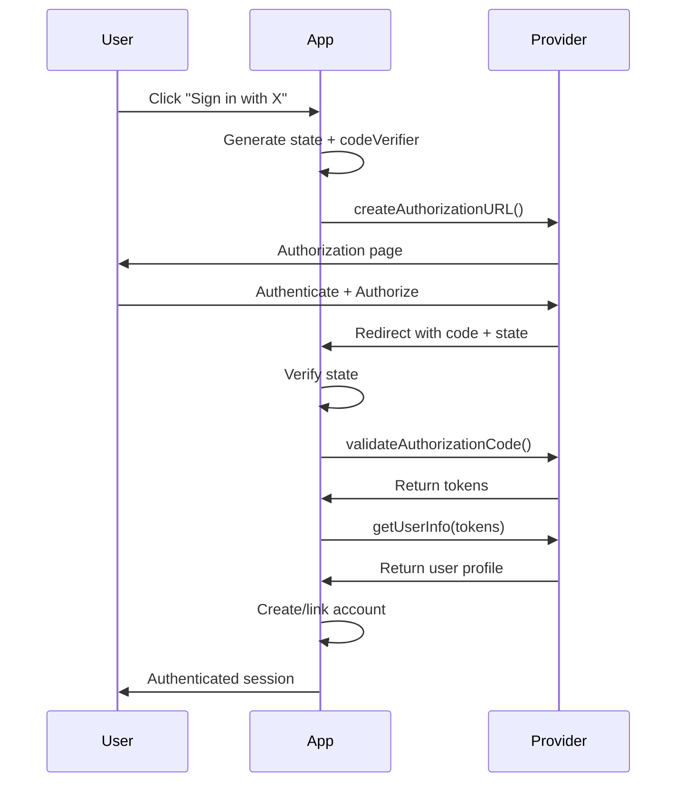

# OAuth Providers - Comprehensive Deep Dive

## Table of Contents

1. [OAuth2 Core Architecture](#1-oauth2-core-architecture)
2. [Provider Implementation Pattern](#2-provider-implementation-pattern)
3. [Built-in Providers Reference](#3-built-in-providers-reference)
   - [Major Providers (Detailed)](#31-github)
   - [Additional Built-in Providers](#3-additional-built-in-providers)
4. [Generic OAuth Plugin](#4-generic-oauth-plugin)
5. [Security Considerations](#5-security-considerations)
6. [Production Implementation Checklist](#6-production-implementation-checklist)
7. [Complete Provider Comparison Matrix](#7-complete-provider-comparison-matrix)

---

## 1. OAuth2 Core Architecture

### 1.1 OAuthProvider Interface

All OAuth providers in better-auth implement the `OAuthProvider` interface:

```typescript
interface OAuthProvider<T = any, O = Partial<ProviderOptions>> {
    id: LiteralString;
    name: string;

    // Step 1: Create authorization URL
    createAuthorizationURL: (data: {
        state: string;
        codeVerifier: string;
        scopes?: string[];
        redirectURI: string;
        display?: string;
        loginHint?: string;
    }) => Awaitable<URL>;

    // Step 2: Validate authorization code
    validateAuthorizationCode: (data: {
        code: string;
        redirectURI: string;
        codeVerifier?: string;
        deviceId?: string;
    }) => Promise<OAuth2Tokens | null>;

    // Step 3: Get user info
    getUserInfo: (token: OAuth2Tokens & { user?: ... }) => Promise<{
        user: OAuth2UserInfo;
        data: T;
    } | null>;

    // Optional: Token refresh
    refreshAccessToken?: (refreshToken: string) => Promise<OAuth2Tokens>;

    // Optional: Token revocation
    revokeToken?: (token: string) => Promise<void>;

    // Optional: ID token verification (OIDC)
    verifyIdToken?: (token: string, nonce?: string) => Promise<boolean>;

    // Configuration
    disableImplicitSignUp?: boolean;
    disableSignUp?: boolean;
    options?: O;
}
```

### 1.2 OAuth2Tokens Structure

```typescript
interface OAuth2Tokens {
    tokenType?: string;           // Usually "Bearer"
    accessToken?: string;         // Primary access token
    refreshToken?: string;        // For refreshing access
    accessTokenExpiresAt?: Date;  // Expiration timestamp
    refreshTokenExpiresAt?: Date; // Refresh token expiration
    scopes?: string[];            // Granted scopes
    idToken?: string;             // OIDC identity token
    raw?: Record<string, any>;    // Provider-specific fields
}
```

### 1.3 OAuth2UserInfo Structure

```typescript
type OAuth2UserInfo = {
    id: string | number;      // Provider user ID
    name?: string;            // Display name
    email?: string | null;    // Email address
    image?: string;           // Profile picture URL
    emailVerified: boolean;   // Email verification status
};
```

### 1.4 Core OAuth2 Flow



---

## 2. Provider Implementation Pattern

### 2.1 Common Structure

All providers follow this pattern:

```typescript
export const providerName = (options: ProviderOptions) => {
    const tokenEndpoint = "https://provider.com/oauth/token";

    return {
        id: "provider-name",
        name: "Provider Name",

        createAuthorizationURL({ state, scopes, redirectURI, codeVerifier }) {
            const _scopes = options.disableDefaultScope
                ? []
                : ["default", "scopes"];
            if (options.scope) _scopes.push(...options.scope);
            if (scopes) _scopes.push(...scopes);

            return createAuthorizationURL({
                id: "provider-name",
                options,
                authorizationEndpoint: "https://provider.com/oauth/authorize",
                scopes: _scopes,
                state,
                codeVerifier,
                redirectURI,
                // Provider-specific params
            });
        },

        validateAuthorizationCode: async ({ code, redirectURI, codeVerifier }) => {
            return validateAuthorizationCode({
                code,
                redirectURI,
                codeVerifier,
                options,
                tokenEndpoint,
                authentication: "post", // or "basic"
            });
        },

        refreshAccessToken: options.refreshAccessToken
            ? options.refreshAccessToken
            : async (refreshToken) => {
                return refreshAccessToken({
                    refreshToken,
                    options,
                    tokenEndpoint,
                });
            },

        async getUserInfo(token) {
            if (options.getUserInfo) {
                return options.getUserInfo(token);
            }

            // Fetch from provider API
            const { data: profile } = await betterFetch<ProfileType>(
                "https://api.provider.com/user",
                {
                    headers: {
                        Authorization: `Bearer ${token.accessToken}`,
                    },
                },
            );

            const userMap = await options.mapProfileToUser?.(profile);

            return {
                user: {
                    id: profile.id,
                    name: profile.name,
                    email: profile.email,
                    image: profile.picture,
                    emailVerified: profile.email_verified,
                    ...userMap,
                },
                data: profile,
            };
        },
    };
};
```

### 2.2 PKCE Implementation

```typescript
// packages/core/src/oauth2/utils.ts
export async function generateCodeChallenge(codeVerifier: string) {
    const encoder = new TextEncoder();
    const data = encoder.encode(codeVerifier);
    const hash = await crypto.subtle.digest("SHA-256", data);
    return base64Url.encode(new Uint8Array(hash), {
        padding: false,
    });
}
```

### 2.3 Authorization URL Creation

```typescript
// packages/core/src/oauth2/create-authorization-url.ts
export async function createAuthorizationURL({
    id,
    options,
    authorizationEndpoint,
    state,
    codeVerifier,
    scopes,
    redirectURI,
    prompt,
    loginHint,
    additionalParams,
}) {
    options = typeof options === "function" ? await options() : options;
    const url = new URL(options.authorizationEndpoint || authorizationEndpoint);

    url.searchParams.set("response_type", "code");
    url.searchParams.set("client_id", options.clientId);
    url.searchParams.set("state", state);

    if (scopes) {
        url.searchParams.set("scope", scopes.join(" "));
    }

    url.searchParams.set("redirect_uri", options.redirectURI || redirectURI);

    // PKCE
    if (codeVerifier) {
        const codeChallenge = await generateCodeChallenge(codeVerifier);
        url.searchParams.set("code_challenge_method", "S256");
        url.searchParams.set("code_challenge", codeChallenge);
    }

    // Optional params
    prompt && url.searchParams.set("prompt", prompt);
    loginHint && url.searchParams.set("login_hint", loginHint);

    if (additionalParams) {
        Object.entries(additionalParams).forEach(([key, value]) => {
            url.searchParams.set(key, value);
        });
    }

    return url;
}
```

### 2.4 Token Exchange

```typescript
// packages/core/src/oauth2/validate-authorization-code.ts
export async function validateAuthorizationCode({
    code,
    codeVerifier,
    redirectURI,
    options,
    tokenEndpoint,
    authentication,
}) {
    const { body, headers } = createAuthorizationCodeRequest({
        code,
        codeVerifier,
        redirectURI,
        options,
        authentication,
    });

    const { data, error } = await betterFetch(tokenEndpoint, {
        method: "POST",
        body,
        headers,
    });

    if (error) throw error;

    return getOAuth2Tokens(data);
}

export function createAuthorizationCodeRequest({
    code,
    codeVerifier,
    redirectURI,
    options,
    authentication,
}) {
    const body = new URLSearchParams();
    const headers = {
        "content-type": "application/x-www-form-urlencoded",
        accept: "application/json",
    };

    body.set("grant_type", "authorization_code");
    body.set("code", code);
    codeVerifier && body.set("code_verifier", codeVerifier);
    body.set("redirect_uri", options.redirectURI || redirectURI);

    // Authentication method
    if (authentication === "basic") {
        // HTTP Basic Auth (RFC 7617)
        headers["authorization"] = "Basic " +
            base64.encode(`${options.clientId}:${options.clientSecret}`);
    } else {
        // POST body credentials
        body.set("client_id", options.clientId);
        body.set("client_secret", options.clientSecret);
    }

    return { body, headers };
}
```

### 2.5 Token Refresh

```typescript
// packages/core/src/oauth2/refresh-access-token.ts
export async function refreshAccessToken({
    refreshToken,
    options,
    tokenEndpoint,
    authentication,
}): Promise<OAuth2Tokens> {
    const { body, headers } = createRefreshAccessTokenRequest({
        refreshToken,
        options,
        authentication,
    });

    const { data } = await betterFetch(tokenEndpoint, {
        method: "POST",
        body,
        headers,
    });

    return getOAuth2Tokens(data);
}

export function createRefreshAccessTokenRequest({
    refreshToken,
    options,
    authentication,
}) {
    const body = new URLSearchParams();
    const headers = {
        "content-type": "application/x-www-form-urlencoded",
        accept: "application/json",
    };

    body.set("grant_type", "refresh_token");
    body.set("refresh_token", refreshToken);

    if (authentication === "basic") {
        headers["authorization"] = "Basic " +
            base64.encode(`${options.clientId}:${options.clientSecret}`);
    } else {
        body.set("client_id", options.clientId);
        body.set("client_secret", options.clientSecret);
    }

    return { body, headers };
}
```

---

## 3. Built-in Providers Reference

### 3.1 GitHub

```typescript
// packages/core/src/social-providers/github.ts
interface GithubProfile {
    login: string;
    id: string;
    avatar_url: string;
    name: string;
    company: string;
    blog: string;
    location: string;
    email: string;
    hireable: boolean;
    bio: string;
    twitter_username: string;
    public_repos: string;
    followers: string;
    following: string;
    created_at: string;
}

interface GithubOptions extends ProviderOptions<GithubProfile> {
    clientId: string;
}

const github = (options: GithubOptions) => ({
    id: "github",
    name: "GitHub",

    createAuthorizationURL({ state, scopes, codeVerifier, redirectURI }) {
        const _scopes = options.disableDefaultScope
            ? []
            : ["read:user", "user:email"];  // Default minimal scopes
        if (options.scope) _scopes.push(...options.scope);
        if (scopes) _scopes.push(...scopes);

        return createAuthorizationURL({
            id: "github",
            options,
            authorizationEndpoint: "https://github.com/login/oauth/authorize",
            scopes: _scopes,
            state,
            codeVerifier,
            redirectURI,
        });
    },

    validateAuthorizationCode: async ({ code, codeVerifier, redirectURI }) => {
        // GitHub doesn't support PKCE properly, uses POST auth
        const { body, headers } = createAuthorizationCodeRequest({
            code,
            codeVerifier,
            redirectURI,
            options,
        });

        const { data, error } = await betterFetch(
            "https://github.com/login/oauth/access_token",
            {
                method: "POST",
                body,
                headers,
            }
        );

        if (error) return null;
        if ("error" in data) return null;

        return getOAuth2Tokens(data);
    },

    async getUserInfo(token) {
        // GitHub requires TWO requests:
        // 1. Get user profile
        // 2. Get user emails (to get verified email)

        const { data: profile } = await betterFetch<GithubProfile>(
            "https://api.github.com/user",
            {
                headers: {
                    "User-Agent": "better-auth",
                    Authorization: `Bearer ${token.accessToken}`,
                },
            }
        );

        // Get emails - GitHub doesn't include email in profile by default
        const { data: emails } = await betterFetch<
            { email: string; primary: boolean; verified: boolean; visibility: string }[]
        >("https://api.github.com/user/emails", {
            headers: {
                Authorization: `Bearer ${token.accessToken}`,
                "User-Agent": "better-auth",
            },
        });

        // Fallback to emails array if profile.email is null
        if (!profile.email && emails) {
            profile.email = (emails.find(e => e.primary) ?? emails[0])?.email;
        }

        // Check email verification status
        const emailVerified = emails?.find(e => e.email === profile.email)?.verified ?? false;

        return {
            user: {
                id: profile.id,
                name: profile.name || profile.login,
                email: profile.email,
                image: profile.avatar_url,
                emailVerified,
            },
            data: profile,
        };
    },
});
```

**Key GitHub Behaviors:**
- **Default scopes:** `read:user`, `user:email` (minimal permission model)
- **Requires separate API call for emails** - GitHub doesn't include email in profile by default
- **Token response is URL-encoded, not JSON** - Must parse `access_token=xxx&scope=yyy&token_type=bearer`
- **Does not support PKCE properly** - Falls back to POST auth (codeVerifier ignored)
- **No refresh token support** in original OAuth flow - Must re-authorize for new token
- **User-Agent header required** - Must include `User-Agent: better-auth` in API requests

**Production Considerations for GitHub:**
```typescript
// Email handling - may be null if user has no public email
if (!profile.email) {
    // Fallback to primary email from emails array
    profile.email = emails.find(e => e.primary)?.email;
}

// Email verification is CRITICAL for GitHub
// Users can have unverified emails in their account
const emailVerified = emails?.find(e => e.email === profile.email)?.verified ?? false;

// Handle rate limiting (60 requests/hour unauthenticated)
// Use conditional requests with ETag for caching
const { data } = await betterFetch("https://api.github.com/user", {
    headers: {
        "If-None-Match": cachedEtag,  // Return 304 if unchanged
        Authorization: `Bearer ${token.accessToken}`,
    },
});
```

**Error Handling:**
```typescript
// Common GitHub OAuth errors:
// - bad_verification_code: Invalid/expired authorization code
// - incorrect_client_credentials: Invalid client_id/secret
// - redirect_uri_mismatch: Callback URL doesn't match config
// - bad_redirect_uri: Redirect URI is malformed

// Handle token exchange failure
if ("error" in data) {
    switch (data.error) {
        case "bad_verification_code":
            throw new Error("Authorization code expired or invalid");
        case "incorrect_client_credentials":
            throw new Error("GitHub app credentials invalid");
        default:
            throw new Error(`GitHub OAuth error: ${data.error}`);
    }
}
```

---

### 3.2 Google

**Profile Interface:**
```typescript
interface GoogleProfile {
    aud: string;           // Audience (client ID) - MUST validate
    azp: string;           // Authorized party - client ID that requested token
    email: string;
    email_verified: boolean;
    exp: number;           // Expiration (seconds since epoch)
    family_name: string;
    given_name: string;
    hd?: string;           // Hosted domain (G Suite/Workspace)
    iat: number;           // Issued at timestamp
    iss: string;           // Issuer URL
    name: string;
    picture: string;
    sub: string;           // Subject (immutable user ID)
}
```

**Implementation:**
```typescript
const google = (options: GoogleOptions) => ({
    id: "google",
    name: "Google",

    async createAuthorizationURL({ state, scopes, codeVerifier, redirectURI, loginHint }) {
        // VALIDATION: Google REQUIRES both client_id and client_secret
        if (!options.clientId || !options.clientSecret) {
            throw new BetterAuthError("CLIENT_ID_AND_SECRET_REQUIRED");
        }

        // VALIDATION: PKCE is MANDATORY for Google OAuth
        if (!codeVerifier) {
            throw new BetterAuthError("codeVerifier is required for Google");
        }

        const _scopes = options.disableDefaultScope
            ? []
            : ["email", "profile", "openid"];  // OIDC scopes for ID token

        if (options.scope) _scopes.push(...options.scope);
        if (scopes) _scopes.push(...scopes);

        return createAuthorizationURL({
            id: "google",
            options,
            authorizationEndpoint: "https://accounts.google.com/o/oauth2/v2/auth",
            scopes: _scopes,
            state,
            codeVerifier,
            redirectURI,
            loginHint,
            accessType: options.accessType,  // "offline" for refresh tokens
            display: options.display,
            hd: options.hd,  // G Suite domain restriction
            additionalParams: {
                include_granted_scopes: "true",  // Incremental auth (add scopes later)
            },
        });
    },

    validateAuthorizationCode: async ({ code, codeVerifier, redirectURI }) => {
        return validateAuthorizationCode({
            code,
            codeVerifier,
            redirectURI,
            options,
            tokenEndpoint: "https://oauth2.googleapis.com/token",
        });
    },

    async verifyIdToken(token, nonce) {
        if (options.disableIdTokenSignIn) return false;
        if (options.verifyIdToken) return options.verifyIdToken(token, nonce);

        try {
            const { kid, alg } = decodeProtectedHeader(token);
            if (!kid || !alg) return false;

            const publicKey = await getGooglePublicKey(kid);
            const { payload } = await jwtVerify(token, publicKey, {
                algorithms: [alg],
                issuer: ["https://accounts.google.com", "accounts.google.com"],
                audience: options.clientId,
                maxTokenAge: "1h",
            });

            if (nonce && payload.nonce !== nonce) return false;
            return true;
        } catch {
            return false;
        }
    },

    async getUserInfo(token) {
        // Google provides ID token - decode it instead of API call
        if (!token.idToken) return null;

        const user = decodeJwt(token.idToken) as GoogleProfile;

        const userMap = await options.mapProfileToUser?.(user);

        return {
            user: {
                id: user.sub,
                name: user.name,
                email: user.email,
                image: user.picture,
                emailVerified: user.email_verified,  // From ID token
                ...userMap,
            },
            data: user,
        };
    },
});
```

**Key Google Behaviors:**
- **Default scopes:** `email`, `profile`, `openid` (OIDC for ID token)
- **PKCE MANDATORY** - Will reject authorization request without code_verifier
- **Uses ID token for user info** - No additional API call needed (faster, more reliable)
- **Supports `accessType: "offline"`** - Required for refresh tokens
- **Supports hosted domain (`hd`)** - Restrict to G Suite/Workspace domains
- **Issuer validation flexible** - Accepts both `https://accounts.google.com` AND `accounts.google.com`
- **ID token expires in 1 hour** - Must refresh for long-lived sessions
- **Incremental auth supported** - `include_granted_scopes: true` allows adding scopes later

**Production Considerations for Google:**
```typescript
// HD (hosted domain) restriction for enterprise
const google = googleProvider({
    clientId: process.env.GOOGLE_CLIENT_ID,
    clientSecret: process.env.GOOGLE_CLIENT_SECRET,
    hd: "yourcompany.com",  // Only allow @yourcompany.com emails
});

// Validate hd claim in ID token for additional security
const profile = decodeJwt(idToken);
if (options.hd && profile.hd !== options.hd) {
    throw new Error("User not from allowed domain");
}

// Handle refresh token (Google only gives refresh token on first auth)
// User must revoke access and re-authorize to get new refresh token
if (!token.refreshToken) {
    console.warn("No refresh token - user may have previously authorized");
}

// ID token validation - check all critical claims
function validateGoogleIdToken(payload: GoogleProfile) {
    if (payload.aud !== options.clientId) {
        throw new Error("Invalid audience");
    }
    if (!["https://accounts.google.com", "accounts.google.com"].includes(payload.iss)) {
        throw new Error("Invalid issuer");
    }
    if (Date.now() >= payload.exp * 1000) {
        throw new Error("Token expired");
    }
}
```

**Error Handling:**
```typescript
// Common Google OAuth errors:
// - invalid_grant: Code expired (10 min) or already used
// - invalid_client: Client credentials invalid
// - redirect_uri_mismatch: Callback doesn't match console config
// - access_denied: User denied consent
// - account_disabled: User account suspended

// Handle specific error cases
try {
    const tokens = await validateAuthorizationCode({...});
} catch (error) {
    if (error.data?.error === "invalid_grant") {
        // Code expired - prompt user to sign in again
        redirect("/login?error=code_expired");
    }
}
```

---

### 3.2 Google

```typescript
// packages/core/src/social-providers/google.ts
interface GoogleProfile {
    aud: string;           // Audience (client ID)
    azp: string;           // Authorized party
    email: string;
    email_verified: boolean;
    exp: number;           // Expiration
    family_name: string;
    given_name: string;
    hd?: string;           // Hosted domain (G Suite)
    iat: number;           // Issued at
    iss: string;           // Issuer
    name: string;
    picture: string;
    sub: string;           // Subject (user ID)
}

interface GoogleOptions extends ProviderOptions<GoogleProfile> {
    clientId: string;
    accessType?: "offline" | "online";  // For refresh tokens
    display?: "page" | "popup" | "touch" | "wap";
    hd?: string;  // Hosted domain restriction
}

const google = (options: GoogleOptions) => ({
    id: "google",
    name: "Google",

    async createAuthorizationURL({ state, scopes, codeVerifier, redirectURI, loginHint }) {
        if (!options.clientId || !options.clientSecret) {
            throw new BetterAuthError("CLIENT_ID_AND_SECRET_REQUIRED");
        }
        if (!codeVerifier) {
            throw new BetterAuthError("codeVerifier is required for Google");
        }

        const _scopes = options.disableDefaultScope
            ? []
            : ["email", "profile", "openid"];  // OIDC scopes
        if (options.scope) _scopes.push(...options.scope);
        if (scopes) _scopes.push(...scopes);

        return createAuthorizationURL({
            id: "google",
            options,
            authorizationEndpoint: "https://accounts.google.com/o/oauth2/v2/auth",
            scopes: _scopes,
            state,
            codeVerifier,
            redirectURI,
            loginHint,
            accessType: options.accessType,  // "offline" for refresh tokens
            display: options.display,
            hd: options.hd,  // G Suite domain restriction
            additionalParams: {
                include_granted_scopes: "true",  // Incremental auth
            },
        });
    },

    validateAuthorizationCode: async ({ code, codeVerifier, redirectURI }) => {
        return validateAuthorizationCode({
            code,
            codeVerifier,
            redirectURI,
            options,
            tokenEndpoint: "https://oauth2.googleapis.com/token",
        });
    },

    async verifyIdToken(token, nonce) {
        if (options.disableIdTokenSignIn) return false;
        if (options.verifyIdToken) return options.verifyIdToken(token, nonce);

        try {
            const { kid, alg } = decodeProtectedHeader(token);
            if (!kid || !alg) return false;

            const publicKey = await getGooglePublicKey(kid);
            const { payload } = await jwtVerify(token, publicKey, {
                algorithms: [alg],
                issuer: ["https://accounts.google.com", "accounts.google.com"],
                audience: options.clientId,
                maxTokenAge: "1h",
            });

            if (nonce && payload.nonce !== nonce) return false;
            return true;
        } catch {
            return false;
        }
    },

    async getUserInfo(token) {
        // Google provides ID token - decode it instead of API call
        if (!token.idToken) return null;

        const user = decodeJwt(token.idToken) as GoogleProfile;

        const userMap = await options.mapProfileToUser?.(user);

        return {
            user: {
                id: user.sub,
                name: user.name,
                email: user.email,
                image: user.picture,
                emailVerified: user.email_verified,  // From ID token
                ...userMap,
            },
            data: user,
        };
    },
});

export const getGooglePublicKey = async (kid: string) => {
    const { data } = await betterFetch<{
        keys: Array<{ kid: string; alg: string; kty: string; n: string; e: string }>;
    }>("https://www.googleapis.com/oauth2/v3/certs");

    if (!data?.keys) throw new APIError("BAD_REQUEST", { message: "Keys not found" });

    const jwk = data.keys.find(key => key.kid === kid);
    if (!jwk) throw new Error(`JWK with kid ${kid} not found`);

    return await importJWK(jwk, jwk.alg);
};
```

**Key Google Behaviors:**
- Default scopes: `email`, `profile`, `openid` (OIDC)
- Requires `codeVerifier` (PKCE mandatory)
- Uses ID token for user info (no API call needed)
- Supports `accessType: "offline"` for refresh tokens
- Supports hosted domain (`hd`) restriction for G Suite
- Issuer can be `https://accounts.google.com` OR `accounts.google.com`
- ID token expires in 1 hour

---

### 3.3 Apple

```typescript
// packages/core/src/social-providers/apple.ts
interface AppleProfile {
    sub: string;              // Subject (user ID)
    email: string;            // Real or proxy email
    email_verified: true | "true";
    is_private_email: boolean;  // Using Hide My Email
    real_user_status: number;   // 0=Unsupported, 1=Unknown, 2=LikelyReal
    name: string;
    picture: string;
    user?: AppleNonConformUser;  // First-time consent data
}

interface AppleNonConformUser {
    name: {
        firstName: string;
        lastName: string;
    };
    email: string;
}

interface AppleOptions extends ProviderOptions<AppleProfile> {
    clientId: string;
    appBundleIdentifier?: string;
    audience?: string | string[];  // For ID token verification
}

const apple = (options: AppleOptions) => ({
    id: "apple",
    name: "Apple",

    async createAuthorizationURL({ state, scopes, redirectURI }) {
        const _scope = options.disableDefaultScope
            ? []
            : ["email", "name"];
        if (options.scope) _scope.push(...options.scope);
        if (scopes) _scope.push(...scopes);

        return createAuthorizationURL({
            id: "apple",
            options,
            authorizationEndpoint: "https://appleid.apple.com/auth/authorize",
            scopes: _scope,
            state,
            redirectURI,
            responseMode: "form_post",  // Required for web
            responseType: "code id_token",  // OIDC hybrid flow
        });
    },

    validateAuthorizationCode: async ({ code, codeVerifier, redirectURI }) => {
        return validateAuthorizationCode({
            code,
            codeVerifier,
            redirectURI,
            options,
            tokenEndpoint: "https://appleid.apple.com/auth/token",
        });
    },

    async verifyIdToken(token, nonce) {
        if (options.disableIdTokenSignIn) return false;
        if (options.verifyIdToken) return options.verifyIdToken(token, nonce);

        try {
            const { kid, alg } = decodeProtectedHeader(token);
            if (!kid || !alg) return false;

            const publicKey = await getApplePublicKey(kid);
            const { payload } = await jwtVerify(token, publicKey, {
                algorithms: [alg],
                issuer: "https://appleid.apple.com",
                audience: options.audience || options.appBundleIdentifier || options.clientId,
                maxTokenAge: "1h",
            });

            // Normalize boolean claims
            ["email_verified", "is_private_email"].forEach(field => {
                if (payload[field] !== undefined) {
                    payload[field] = Boolean(payload[field]);
                }
            });

            if (nonce && payload.nonce !== nonce) return false;
            return true;
        } catch {
            return false;
        }
    },

    async getUserInfo(token) {
        if (!token.idToken) return null;

        const profile = decodeJwt(token.idToken) as AppleProfile;

        // Handle user data from form_post (first consent only)
        let name: string;
        if (token.user?.name) {
            const firstName = token.user.name.firstName || "";
            const lastName = token.user.name.lastName || "";
            name = `${firstName} ${lastName}`.trim();
        } else {
            name = profile.name || "";
        }

        const emailVerified = typeof profile.email_verified === "boolean"
            ? profile.email_verified
            : profile.email_verified === "true";

        return {
            user: {
                id: profile.sub,
                name,
                emailVerified,
                email: profile.email,
            },
            data: { ...profile, name },
        };
    },
});

export const getApplePublicKey = async (kid: string) => {
    const { data } = await betterFetch<{
        keys: Array<{ kid: string; alg: string; kty: string; n: string; e: string }>;
    }>("https://appleid.apple.com/auth/keys");

    if (!data?.keys) throw new APIError("BAD_REQUEST", { message: "Keys not found" });

    const jwk = data.keys.find(key => key.kid === kid);
    if (!jwk) throw new Error(`JWK with kid ${kid} not found`);

    return await importJWK(jwk, jwk.alg);
};
```

**Key Apple Behaviors:**
- Uses `form_post` response mode (not redirect)
- Returns `code id_token` (OIDC hybrid flow)
- User name is ONLY available on first consent via `token.user`
- Email can be proxied (Hide My Email) - check `is_private_email`
- `real_user_status` helps detect bot accounts
- Apple's JWKS endpoint: `https://appleid.apple.com/auth/keys`
- ID token expires in 1 hour

---

### 3.4 Microsoft Entra ID (Azure AD)

```typescript
// packages/core/src/social-providers/microsoft-entra-id.ts
interface MicrosoftEntraIDProfile {
    aud: string;            // Token audience
    iss: string;            // Issuer URL
    iat: Date;
    idp: string;            // Identity provider
    nbf: Date;
    exp: Date;
    preferred_username: string;
    email: string;
    name: string;
    oid: string;            // Object ID (immutable)
    sub: string;            // Subject ID
    tid: string;            // Tenant ID
    sid: string;            // Session ID
    roles: string[];        // Directory roles
    email_verified?: boolean;  // Optional claim
    verified_primary_email?: string[];   // Fallback
    verified_secondary_email?: string[]; // Fallback
    // ... 40+ additional claims
}

interface MicrosoftOptions extends ProviderOptions<MicrosoftEntraIDProfile> {
    clientId: string;
    tenantId?: string;  // "common", "organizations", "consumers", or specific
    authority?: string; // Default: "https://login.microsoftonline.com"
    profilePhotoSize?: 48 | 64 | 96 | 120 | 240 | 360 | 432 | 504 | 648;
    disableProfilePhoto?: boolean;
}

const microsoft = (options: MicrosoftOptions) => {
    const tenant = options.tenantId || "common";
    const authority = options.authority || "https://login.microsoftonline.com";

    return {
        id: "microsoft",
        name: "Microsoft EntraID",

        createAuthorizationURL(data) {
            const scopes = options.disableDefaultScope
                ? []
                : ["openid", "profile", "email", "User.Read", "offline_access"];
            if (options.scope) scopes.push(...options.scope);
            if (data.scopes) scopes.push(...data.scopes);

            return createAuthorizationURL({
                id: "microsoft",
                options,
                authorizationEndpoint: `${authority}/${tenant}/oauth2/v2.0/authorize`,
                state: data.state,
                codeVerifier: data.codeVerifier,
                scopes,
                redirectURI: data.redirectURI,
                loginHint: data.loginHint,
            });
        },

        validateAuthorizationCode({ code, codeVerifier, redirectURI }) {
            return validateAuthorizationCode({
                code,
                codeVerifier,
                redirectURI,
                options,
                tokenEndpoint: `${authority}/${tenant}/oauth2/v2.0/token`,
            });
        },

        async verifyIdToken(token, nonce) {
            if (options.disableIdTokenSignIn) return false;
            if (options.verifyIdToken) return options.verifyIdToken(token, nonce);

            try {
                const { kid, alg } = decodeProtectedHeader(token);
                if (!kid || !alg) return false;

                const publicKey = await getMicrosoftPublicKey(kid, tenant, authority);

                const verifyOptions = {
                    algorithms: [alg],
                    audience: options.clientId,
                    maxTokenAge: "1h",
                };

                // Only validate issuer for non-multi-tenant endpoints
                if (tenant !== "common" && tenant !== "organizations" && tenant !== "consumers") {
                    verifyOptions.issuer = `${authority}/${tenant}/v2.0`;
                }

                const { payload } = await jwtVerify(token, publicKey, verifyOptions);

                if (nonce && payload.nonce !== nonce) return false;
                return true;
            } catch (error) {
                return false;
            }
        },

        async getUserInfo(token) {
            if (!token.idToken) return null;

            const user = decodeJwt(token.idToken) as MicrosoftEntraIDProfile;

            // Fetch profile photo from Graph API
            const profilePhotoSize = options.profilePhotoSize || 48;
            await betterFetch<ArrayBuffer>(
                `https://graph.microsoft.com/v1.0/me/photos/${profilePhotoSize}x${profilePhotoSize}/$value`,
                {
                    headers: { Authorization: `Bearer ${token.accessToken}` },
                    async onResponse(context) {
                        if (!options.disableProfilePhoto && context.response.ok) {
                            const pictureBuffer = await context.response.arrayBuffer();
                            const pictureBase64 = base64.encode(pictureBuffer);
                            user.picture = `data:image/jpeg;base64, ${pictureBase64}`;
                        }
                    },
                }
            );

            // email_verified is OPTIONAL in Entra ID - must be configured
            const emailVerified = user.email_verified !== undefined
                ? user.email_verified
                : user.email && (
                    user.verified_primary_email?.includes(user.email) ||
                    user.verified_secondary_email?.includes(user.email)
                );

            return {
                user: {
                    id: user.sub,
                    name: user.name,
                    email: user.email,
                    image: user.picture,
                    emailVerified: emailVerified || false,
                },
                data: user,
            };
        },

        refreshAccessToken: options.refreshAccessToken
            ? options.refreshAccessToken
            : async (refreshToken) => {
                const scopes = options.disableDefaultScope
                    ? []
                    : ["openid", "profile", "email", "User.Read", "offline_access"];
                if (options.scope) scopes.push(...options.scope);

                return refreshAccessToken({
                    refreshToken,
                    options: { clientId: options.clientId, clientSecret: options.clientSecret },
                    extraParams: { scope: scopes.join(" ") },  // Microsoft requires scopes
                    tokenEndpoint: `${authority}/${tenant}/oauth2/v2.0/token`,
                });
            },
    };
};
```

**Key Microsoft Behaviors:**
- Multi-tenant support via `tenantId`: `common`, `organizations`, `consumers`, or specific tenant
- Default scopes include `User.Read` (Graph API access) and `offline_access` (refresh token)
- `email_verified` claim is OPTIONAL - must be configured in app registration
- Profile photo fetched from Microsoft Graph API separately
- Token refresh REQUIRES scopes parameter
- JWKS endpoint: `${authority}/${tenant}/discovery/v2.0/keys`
- Over 40 optional claims available (groups, roles, etc.)

---

### 3.5 Discord

```typescript
// packages/core/src/social-providers/discord.ts
interface DiscordProfile {
    id: string;                 // User ID (snowflake)
    username: string;           // Username (not unique)
    discriminator: string;      // 4-digit tag (deprecated for handles)
    global_name: string | null; // Display name
    avatar: string | null;      // Avatar hash
    avatar_decoration: string | null;
    banner: string | null;      // Banner hash
    accent_color: number | null;
    locale: string;             // Language
    flags: number;              // User flags
    public_flags: number;
    premium_type: number;       // Nitro level
    mfa_enabled: boolean;
    verified: boolean;          // Email verified
    email: string;
    image_url: string;          // Computed avatar URL
}

interface DiscordOptions extends ProviderOptions<DiscordProfile> {
    clientId: string;
    prompt?: "none" | "consent";
    permissions?: number;  // For bot authorization
}

const discord = (options: DiscordOptions) => ({
    id: "discord",
    name: "Discord",

    createAuthorizationURL({ state, scopes, redirectURI }) {
        const _scopes = options.disableDefaultScope
            ? []
            : ["identify", "email"];
        if (options.scope) _scopes.push(...options.scope);
        if (scopes) _scopes.push(...scopes);

        const hasBotScope = _scopes.includes("bot");
        const permissionsParam = hasBotScope && options.permissions !== undefined
            ? `&permissions=${options.permissions}`
            : "";

        return new URL(
            `https://discord.com/api/oauth2/authorize` +
            `?scope=${_scopes.join("+")}` +
            `&response_type=code` +
            `&client_id=${options.clientId}` +
            `&redirect_uri=${encodeURIComponent(options.redirectURI || redirectURI)}` +
            `&state=${state}` +
            `&prompt=${options.prompt || "none"}` +
            permissionsParam
        );
    },

    validateAuthorizationCode: async ({ code, redirectURI }) => {
        return validateAuthorizationCode({
            code,
            redirectURI,
            options,
            tokenEndpoint: "https://discord.com/api/oauth2/token",
        });
    },

    async getUserInfo(token) {
        const { data: profile } = await betterFetch<DiscordProfile>(
            "https://discord.com/api/users/@me",
            {
                headers: { Authorization: `Bearer ${token.accessToken}` },
            }
        );

        // Compute avatar URL
        if (profile.avatar === null) {
            const defaultAvatarNumber = profile.discriminator === "0"
                ? Number(BigInt(profile.id) >> BigInt(22)) % 6
                : parseInt(profile.discriminator) % 5;
            profile.image_url = `https://cdn.discordapp.com/embed/avatars/${defaultAvatarNumber}.png`;
        } else {
            const format = profile.avatar.startsWith("a_") ? "gif" : "png";
            profile.image_url = `https://cdn.discordapp.com/avatars/${profile.id}/${profile.avatar}.${format}`;
        }

        return {
            user: {
                id: profile.id,
                name: profile.global_name || profile.username,
                email: profile.email,
                image: profile.image_url,
                emailVerified: profile.verified,
            },
            data: profile,
        };
    },
});
```

**Key Discord Behaviors:**
- Default scopes: `identify`, `email`
- Avatar URL must be computed from hash (or default)
- `global_name` is the new display name system
- `discriminator` being phased out for handles
- Bot authorization requires `permissions` parameter
- Email verification only available with `email` scope
- No refresh token support by default (add `offline_access` scope)

---

### 3.6 Facebook

```typescript
// packages/core/src/social-providers/facebook.ts
interface FacebookProfile {
    id: string;
    name: string;
    email: string;
    email_verified: boolean;
    picture: {
        data: {
            height: number;
            is_silhouette: boolean;
            url: string;
            width: number;
        };
    };
}

interface FacebookOptions extends ProviderOptions<FacebookProfile> {
    clientId: string;
    fields?: string[];  // Fields to request
    configId?: string;  // For Meta Business configs
}

const facebook = (options: FacebookOptions) => ({
    id: "facebook",
    name: "Facebook",

    async createAuthorizationURL({ state, scopes, redirectURI, loginHint }) {
        const _scopes = options.disableDefaultScope
            ? []
            : ["email", "public_profile"];
        if (options.scope) _scopes.push(...options.scope);
        if (scopes) _scopes.push(...scopes);

        return createAuthorizationURL({
            id: "facebook",
            options,
            authorizationEndpoint: "https://www.facebook.com/v24.0/dialog/oauth",
            scopes: _scopes,
            state,
            redirectURI,
            loginHint,
            additionalParams: options.configId
                ? { config_id: options.configId }
                : {},
        });
    },

    validateAuthorizationCode: async ({ code, redirectURI }) => {
        return validateAuthorizationCode({
            code,
            redirectURI,
            options,
            tokenEndpoint: "https://graph.facebook.com/v24.0/oauth/access_token",
        });
    },

    async verifyIdToken(token, nonce) {
        if (options.disableIdTokenSignIn) return false;
        if (options.verifyIdToken) return options.verifyIdToken(token, nonce);

        // Check if limited login token (3-part JWT)
        if (token.split(".").length === 3) {
            try {
                const { payload } = await jwtVerify(
                    token,
                    createRemoteJWKSet(
                        new URL("https://limited.facebook.com/.well-known/oauth/openid/jwks/")
                    ),
                    {
                        algorithms: ["RS256"],
                        audience: options.clientId,
                        issuer: "https://www.facebook.com",
                    }
                );

                if (nonce && payload.nonce !== nonce) return false;
                return !!payload;
            } catch {
                return false;
            }
        }

        // Regular access token - skip verification
        return true;
    },

    async getUserInfo(token) {
        // Try ID token first (limited login)
        if (token.idToken && token.idToken.split(".").length === 3) {
            const profile = decodeJwt(token.idToken);

            return {
                user: {
                    id: profile.sub,
                    name: profile.name,
                    email: profile.email,
                    image: profile.picture,
                    emailVerified: false,  // Not available in limited login
                },
                data: profile,
            };
        }

        // Standard Graph API
        const fields = ["id", "name", "email", "picture", ...(options.fields || [])];

        const { data: profile } = await betterFetch<FacebookProfile>(
            `https://graph.facebook.com/me?fields=${fields.join(",")}`,
            {
                auth: { type: "Bearer", token: token.accessToken },
            }
        );

        return {
            user: {
                id: profile.id,
                name: profile.name,
                email: profile.email,
                image: profile.picture.data.url,
                emailVerified: profile.email_verified,
            },
            data: profile,
        };
    },
});
```

**Key Facebook Behaviors:**
- Default scopes: `email`, `public_profile`
- Supports "Limited Login" (OIDC) and standard Graph API
- Limited Login uses separate JWKS endpoint
- API version in URL (v24.0)
- Fields must be explicitly requested
- `config_id` for Meta Business integrations
- App Review required for most permissions

---

### 3.7 Twitter/X

```typescript
// packages/core/src/social-providers/twitter.ts
interface TwitterProfile {
    data: {
        id: string;           // User ID (numeric string)
        name: string;         // Display name
        username: string;     // Handle (@username)
        email?: string;
        location?: string;
        description?: string;
        verified?: boolean;
        profile_image_url?: string;
        protected?: boolean;
        created_at?: string;
    };
}

interface TwitterOptions extends ProviderOptions<TwitterProfile> {
    clientId: string;
}

const twitter = (options: TwitterOptions) => ({
    id: "twitter",
    name: "Twitter",

    createAuthorizationURL(data) {
        const _scopes = options.disableDefaultScope
            ? []
            : ["users.read", "tweet.read", "offline.access", "users.email"];
        if (options.scope) _scopes.push(...options.scope);
        if (data.scopes) _scopes.push(...data.scopes);

        return createAuthorizationURL({
            id: "twitter",
            options,
            authorizationEndpoint: "https://x.com/i/oauth2/authorize",
            scopes: _scopes,
            state: data.state,
            codeVerifier: data.codeVerifier,
            redirectURI: data.redirectURI,
        });
    },

    validateAuthorizationCode: async ({ code, codeVerifier, redirectURI }) => {
        return validateAuthorizationCode({
            code,
            codeVerifier,
            authentication: "basic",  // Twitter requires Basic Auth
            redirectURI,
            options,
            tokenEndpoint: "https://api.x.com/2/oauth2/token",
        });
    },

    refreshAccessToken: options.refreshAccessToken
        ? options.refreshAccessToken
        : async (refreshToken) => {
            return refreshAccessToken({
                refreshToken,
                options,
                authentication: "basic",  // Required for token refresh
                tokenEndpoint: "https://api.x.com/2/oauth2/token",
            });
        },

    async getUserInfo(token) {
        // Get profile
        const { data: profile } = await betterFetch<TwitterProfile>(
            "https://api.x.com/2/users/me?user.fields=profile_image_url",
            {
                headers: { Authorization: `Bearer ${token.accessToken}` },
            }
        );

        // Email is a SEPARATE API call
        const { data: emailData } = await betterFetch<{
            data: { confirmed_email: string };
        }>("https://api.x.com/2/users/me?user.fields=confirmed_email", {
            headers: { Authorization: `Bearer ${token.accessToken}` },
        });

        let emailVerified = false;
        if (!emailError && emailData?.data?.confirmed_email) {
            profile.data.email = emailData.data.confirmed_email;
            emailVerified = true;
        }

        return {
            user: {
                id: profile.data.id,
                name: profile.data.name,
                email: profile.data.email || profile.data.username,
                image: profile.data.profile_image_url,
                emailVerified,
            },
            data: profile,
        };
    },
});
```

**Key Twitter Behaviors:**
- Default scopes: `users.read`, `tweet.read`, `offline.access`, `users.email`
- REQUIRES HTTP Basic Authentication (RFC 7617)
- Email requires separate API call with different scope
- `offline.access` scope needed for refresh tokens
- API v2 endpoints
- User ID is numeric string (BigInt handling)

---

### 3.8 LinkedIn

```typescript
// packages/core/src/social-providers/linkedin.ts
interface LinkedInProfile {
    sub: string;
    name: string;
    given_name: string;
    family_name: string;
    picture: string;
    locale: {
        country: string;
        language: string;
    };
    email: string;
    email_verified: boolean;
}

const linkedin = (options) => ({
    id: "linkedin",
    name: "Linkedin",

    createAuthorizationURL: async ({ state, scopes, redirectURI, loginHint }) => {
        const _scopes = options.disableDefaultScope
            ? []
            : ["profile", "email", "openid"];
        if (options.scope) _scopes.push(...options.scope);
        if (scopes) _scopes.push(...scopes);

        return createAuthorizationURL({
            id: "linkedin",
            options,
            authorizationEndpoint: "https://www.linkedin.com/oauth/v2/authorization",
            scopes: _scopes,
            state,
            loginHint,
            redirectURI,
        });
    },

    validateAuthorizationCode: async ({ code, redirectURI }) => {
        return validateAuthorizationCode({
            code,
            redirectURI,
            options,
            tokenEndpoint: "https://www.linkedin.com/oauth/v2/accessToken",
        });
    },

    async getUserInfo(token) {
        const { data: profile } = await betterFetch<LinkedInProfile>(
            "https://api.linkedin.com/v2/userinfo",
            {
                headers: { Authorization: `Bearer ${token.accessToken}` },
            }
        );

        return {
            user: {
                id: profile.sub,
                name: profile.name,
                email: profile.email,
                image: profile.picture,
                emailVerified: profile.email_verified || false,
            },
            data: profile,
        };
    },
});
```

**Key LinkedIn Behaviors:**
- Default scopes: `profile`, `email`, `openid`
- Uses OpenID Connect
- Single userinfo endpoint
- `email_verified` may not always be present

---

### 3.9 Spotify

```typescript
// packages/core/src/social-providers/spotify.ts
interface SpotifyProfile {
    id: string;
    display_name: string;
    email: string;
    images: { url: string }[];
}

const spotify = (options) => ({
    id: "spotify",
    name: "Spotify",

    createAuthorizationURL({ state, scopes, codeVerifier, redirectURI }) {
        const _scopes = options.disableDefaultScope
            ? []
            : ["user-read-email"];
        if (options.scope) _scopes.push(...options.scope);
        if (scopes) _scopes.push(...scopes);

        return createAuthorizationURL({
            id: "spotify",
            options,
            authorizationEndpoint: "https://accounts.spotify.com/authorize",
            scopes: _scopes,
            state,
            codeVerifier,
            redirectURI,
        });
    },

    async getUserInfo(token) {
        const { data: profile } = await betterFetch<SpotifyProfile>(
            "https://api.spotify.com/v1/me",
            {
                headers: { Authorization: `Bearer ${token.accessToken}` },
            }
        );

        return {
            user: {
                id: profile.id,
                name: profile.display_name,
                email: profile.email,
                image: profile.images[0]?.url,
                emailVerified: false,  // Spotify doesn't provide verification
            },
            data: profile,
        };
    },
});
```

**Key Spotify Behaviors:**
- Default scope: `user-read-email`
- Email NOT verified by Spotify
- Profile images come as array (multiple sizes)
- Supports PKCE
- Token refresh supported

---

### 3.10 Twitch

```typescript
// packages/core/src/social-providers/twitch.ts
interface TwitchProfile {
    sub: string;
    preferred_username: string;
    email: string;
    email_verified: boolean;
    picture: string;
}

const twitch = (options) => ({
    id: "twitch",
    name: "Twitch",

    createAuthorizationURL({ state, scopes, redirectURI }) {
        const _scopes = options.disableDefaultScope
            ? []
            : ["user:read:email", "openid"];
        if (options.scope) _scopes.push(...options.scope);
        if (scopes) _scopes.push(...scopes);

        return createAuthorizationURL({
            id: "twitch",
            redirectURI,
            options,
            authorizationEndpoint: "https://id.twitch.tv/oauth2/authorize",
            scopes: _scopes,
            state,
            claims: options.claims || [
                "email",
                "email_verified",
                "preferred_username",
                "picture",
            ],
        });
    },

    async getUserInfo(token) {
        if (!token.idToken) return null;

        const profile = decodeJwt(token.idToken) as TwitchProfile;

        return {
            user: {
                id: profile.sub,
                name: profile.preferred_username,
                email: profile.email,
                image: profile.picture,
                emailVerified: profile.email_verified,
            },
            data: profile,
        };
    },
});
```

**Key Twitch Behaviors:**
- Uses OIDC with `claims` parameter
- Default scopes: `user:read:email`, `openid`
- User info from ID token only
- Claims must be explicitly requested

---

### 3.11 Zoom

```typescript
// packages/core/src/social-providers/zoom.ts
interface ZoomProfile {
    id: string;
    display_name: string;
    email: string;
    verified: number;  // 0 or 1
    pic_url: string;
    // 40+ additional fields
}

const zoom = (options) => ({
    id: "zoom",
    name: "Zoom",

    createAuthorizationURL: async ({ state, redirectURI, codeVerifier }) => {
        const params = new URLSearchParams({
            response_type: "code",
            redirect_uri: options.redirectURI || redirectURI,
            client_id: options.clientId,
            state,
        });

        // PKCE is enabled by default for Zoom
        if (options.pkce !== false) {
            const codeChallenge = await generateCodeChallenge(codeVerifier);
            params.set("code_challenge_method", "S256");
            params.set("code_challenge", codeChallenge);
        }

        const url = new URL("https://zoom.us/oauth/authorize");
        url.search = params.toString();
        return url;
    },

    validateAuthorizationCode: async ({ code, redirectURI, codeVerifier }) => {
        return validateAuthorizationCode({
            code,
            redirectURI,
            codeVerifier,
            options,
            tokenEndpoint: "https://zoom.us/oauth/token",
            authentication: "post",  // Zoom uses POST auth
        });
    },

    async getUserInfo(token) {
        const { data: profile } = await betterFetch<ZoomProfile>(
            "https://api.zoom.us/v2/users/me",
            {
                headers: { Authorization: `Bearer ${token.accessToken}` },
            }
        );

        return {
            user: {
                id: profile.id,
                name: profile.display_name,
                email: profile.email,
                image: profile.pic_url,
                emailVerified: Boolean(profile.verified),
            },
            data: profile,
        };
    },
});
```

**Key Zoom Behaviors:**
- PKCE enabled by default
- `verified` is integer (0/1), not boolean
- Token endpoint uses POST authentication
- Profile has 40+ additional fields available

---

## 3. Additional Built-in Providers (Quick Reference)

The following providers follow the same OAuth2 patterns but have provider-specific quirks documented below.

### 3.12 Atlassian

**Profile & Implementation:**
```typescript
interface AtlassianProfile {
    account_id: string;
    email?: string;
    name: string;
    picture?: string;
    extended_profile?: {
        job_title?: string;
        organization?: string;
        department?: string;
        location?: string;
    };
}

const atlassian = (options) => ({
    id: "atlassian",
    name: "Atlassian",
    // PKCE REQUIRED
    async createAuthorizationURL({ state, scopes, codeVerifier, redirectURI }) {
        if (!codeVerifier) {
            throw new BetterAuthError("codeVerifier is required for Atlassian");
        }
        const _scopes = options.disableDefaultScope
            ? []
            : ["read:jira-user", "offline_access"];

        return createAuthorizationURL({
            id: "atlassian",
            options,
            authorizationEndpoint: "https://auth.atlassian.com/authorize",
            scopes: _scopes,
            state,
            codeVerifier,
            redirectURI,
            additionalParams: {
                audience: "api.atlassian.com",  // REQUIRED
            },
        });
    },
    // Standard token exchange
    // Userinfo: GET https://api.atlassian.com/me
});
```

**Key Behaviors:**
- **Default scopes:** `read:jira-user`, `offline_access`
- **PKCE REQUIRED** - `codeVerifier` mandatory
- **Audience parameter** - Must include `audience: "api.atlassian.com"`
- **Email NOT verified** - Returns `emailVerified: false`

---

### 3.13 AWS Cognito

**Profile & Implementation:**
```typescript
interface CognitoProfile {
    sub: string;
    email: string;
    email_verified: boolean;
    name: string;
    given_name?: string;
    family_name?: string;
    picture?: string;
    // Custom attributes supported
}

const cognito = (options) => ({
    id: "cognito",
    name: "Cognito",
    // Requires domain, region, userPoolId options
    async createAuthorizationURL({ state, scopes, codeVerifier, redirectURI }) {
        const _scopes = ["openid", "profile", "email"];

        const url = await createAuthorizationURL({...});

        // AWS Cognito requires scopes encoded with %20 not +
        const scopeValue = url.searchParams.get("scope");
        if (scopeValue) {
            url.searchParams.delete("scope");
            const encodedScope = encodeURIComponent(scopeValue);
            return new URL(`${url.toString()}&scope=${encodedScope}`);
        }
        return url;
    },
    // ID token verification with region-specific issuer
    async verifyIdToken(token, nonce) {
        const expectedIssuer = `https://cognito-idp.${options.region}.amazonaws.com/${options.userPoolId}`;
        // Standard JWKS verification
    },
});
```

**Key Behaviors:**
- **Default scopes:** `openid`, `profile`, `email`
- **PKCE support** - Recommended
- **ID token verification** - Full OIDC with region-specific issuer
- **Scope encoding quirk** - AWS requires `%20` instead of `+`
- **Custom attributes** - Supports `custom:*` attributes

---

### 3.14 Dropbox

**Profile:**
```typescript
interface DropboxProfile {
    account_id: string;
    name: {
        given_name: string;
        surname: string;
        display_name: string;
    };
    email: string;
    email_verified: boolean;
    profile_photo_url: string;
}
```

**Key Behaviors:**
- **Default scope:** `account_info.read`
- **Access type:** `offline` for refresh tokens
- **Userinfo:** POST to `users/get_current_account`
- **Structured name** - Use `name.display_name`

---

### 3.15 Figma

**Profile:**
```typescript
interface FigmaProfile {
    id: string;
    email: string;
    handle: string;
    img_url: string;
}
```

**Key Behaviors:**
- **Default scope:** `current_user:read`
- **PKCE REQUIRED**
- **HTTP Basic Auth** for token endpoint
- **Email NOT verified** - Always returns `false`

---

### 3.16 GitLab

**Profile:**
```typescript
interface GitlabProfile {
    id: number;
    username: string;
    email: string;
    name: string;
    state: string;        // Must be "active"
    avatar_url: string;
    locked: boolean;      // Account lock status
    email_verified?: boolean;
}
```

**Key Behaviors:**
- **Default scope:** `read_user`
- **Self-hosted support** - `issuer` option for custom instances
- **State validation** - Rejects if `state !== "active"` or `locked`
- **Email verified fallback** - `email_verified ?? false`

---

### 3.17 Hugging Face

**Profile:**
```typescript
interface HuggingFaceProfile {
    sub: string;
    name: string;
    preferred_username: string;
    picture: string;
    email?: string;
    email_verified?: boolean;
    isPro: boolean;
    orgs?: Array<{sub: string; name: string; roleInOrg: string}>;
}
```

**Key Behaviors:**
- **Default scopes:** `openid`, `profile`, `email`
- **OIDC provider** - Full ID token support
- **Organization info** - User's org memberships
- **Pro status** - `isPro` flag

---

### 3.18 Kakao (Korea)

**Profile:**
```typescript
interface KakaoProfile {
    id: number;
    kakao_account: {
        profile?: {nickname: string; profile_image_url: string};
        email?: string;
        is_email_valid?: boolean;
        is_email_verified?: boolean;
        // More fields with consent requirements
    };
}
```

**Key Behaviors:**
- **Default scopes:** `account_email`, `profile_image`, `profile_nickname`
- **Consent-based** - Each field needs explicit consent (`_needs_agreement` flags)
- **Dual email verification** - Check BOTH `is_email_valid` AND `is_email_verified`
- **Nested profile** - Data in `kakao_account.profile`

---

### 3.19 Kick

**Profile:**
```typescript
interface KickProfile {
    user_id: string;
    name: string;
    email: string;
    profile_picture: string;
}
```

**Key Behaviors:**
- **Default scope:** `user:read`
- **Array response** - `{data: KickProfile[]}`
- **Email NOT verified** - Always `false`

---

### 3.20 LINE (Japan/Asia)

**Profile:**
```typescript
interface LineProfile {
    sub: string;
    name?: string;
    picture?: string;
    email?: string;
}
```

**Key Behaviors:**
- **Default scopes:** `openid`, `profile`, `email`
- **ID token verification** - Uses dedicated verify endpoint (not JWKS)
- **Dual profile source** - Prefers ID token, falls back to userinfo

---

### 3.21 Linear

**Profile:**
```typescript
interface LinearUser {
    id: string;
    name: string;
    email: string;
    avatarUrl?: string;
    active: boolean;
}
```

**Key Behaviors:**
- **Default scope:** `read`
- **GraphQL API** - Uses GraphQL query for userinfo
- **Email NOT verified** - Always `false`

---

### 3.22 Naver (Korea)

**Profile:**
```typescript
interface NaverProfile {
    resultcode: string;   // "00" = success
    message: string;
    response: {
        id: string;
        nickname: string;
        name: string;
        email: string;
        gender: string;   // "F", "M", "U"
        age: string;      // Age range
    };
}
```

**Key Behaviors:**
- **Default scopes:** `profile`, `email`
- **Wrapped response** - Must check `resultcode === "00"`
- **Email NOT verified** - Always `false`

---

### 3.23 Notion

**Profile:**
```typescript
interface NotionProfile {
    object: "user" | "bot";
    id: string;
    type: "person" | "bot";
    name?: string;
    person?: {email?: string};
}
```

**Key Behaviors:**
- **No default scopes**
- **`owner: user` param** - Required in auth URL
- **HTTP Basic Auth** for token endpoint
- **Version header** - Requires `Notion-Version: 2022-06-28`

---

### 3.24 PayPal

**Profile:**
```typescript
interface PayPalProfile {
    user_id: string;
    name: string;
    email: string;
    email_verified: boolean;
    // Address, phone, birthdate, etc.
}
```

**Key Behaviors:**
- **No scopes** - Permissions in PayPal dashboard
- **Sandbox/live** - Different endpoints
- **HTTP Basic Auth** for token exchange
- **Schema param** - `?schema=paypalv1.1` for userinfo

---

### 3.25 Polar

**Profile:**
```typescript
interface PolarProfile {
    id: string;
    email: string;
    username: string;
    github_username?: string;
    email_verified?: boolean;
}
```

**Key Behaviors:**
- **Default scopes:** `openid`, `profile`, `email`
- **GitHub integration** - Links to GitHub username

---

### 3.26 Railway

**Profile:**
```typescript
interface RailwayProfile {
    sub: string;
    email: string;
    name: string;
    picture: string;
}
```

**Key Behaviors:**
- **Default scopes:** `openid`, `email`, `profile`
- **HTTP Basic Auth** for token endpoint
- **Email NOT verified** - Always `false`

---

### 3.27 Reddit

**Profile:**
```typescript
interface RedditProfile {
    id: string;
    name: string;
    icon_img: string | null;  // Avatar with size params
    has_verified_email: boolean;
}
```

**Key Behaviors:**
- **Default scope:** `identity`
- **HTTP Basic Auth** required
- **User-Agent required** - `better-auth`
- **Accept: text/plain** - Reddit returns plain text
- **Avatar cleanup** - `icon_img.split("?")[0]`

---

### 3.28 Roblox

**Profile:**
```typescript
interface RobloxProfile {
    sub: string;
    preferred_username: string;
    nickname: string;
    created_at: number;  // Account creation timestamp
}
```

**Key Behaviors:**
- **Default scopes:** `openid`, `profile`
- **No email** - Uses username as identifier
- **Account age** - `created_at` for age checks

---

### 3.29 Salesforce

**Profile:**
```typescript
interface SalesforceProfile {
    sub: string;
    user_id: string;
    organization_id: string;  // Multi-tenant org ID
    email: string;
    email_verified?: boolean;
    photos?: {picture?: string};
}
```

**Key Behaviors:**
- **Default scopes:** `openid`, `email`, `profile`
- **Sandbox/production** - Different endpoints
- **PKCE REQUIRED**
- **Organization ID** - For multi-tenant

---

### 3.30 Slack

**Profile:**
```typescript
interface SlackProfile {
    sub: string;
    "https://slack.com/user_id": string;
    "https://slack.com/team_id": string;
    email: string;
    email_verified: boolean;
    date_email_verified: number;
    // Team info, multiple image sizes
}
```

**Key Behaviors:**
- **Default scopes:** `openid`, `profile`, `email`
- **OpenID Connect** - Full OIDC
- **Custom claims** - Full URL keys
- **Team info** - Workspace details included

---

### 3.31 TikTok

**Profile:**
```typescript
interface TiktokProfile {
    data: {
        user: {
            open_id: string;
            union_id?: string;
            display_name: string;
            username: string;
            email?: string;
            follower_count?: number;
        };
    };
}
```

**Key Behaviors:**
- **Default scope:** `user.info.profile`
- **Client key** - Uses `client_key` (not ID)
- **Field selection** - Must request specific fields
- **Limited email** - Often unavailable

---

### 3.32 Vercel

**Profile:**
```typescript
interface VercelProfile {
    sub: string;
    name?: string;
    preferred_username?: string;
    email?: string;
    email_verified?: boolean;
}
```

**Key Behaviors:**
- **PKCE REQUIRED**
- **No default scopes**
- **Name fallback** - `name ?? preferred_username`

---

### 3.33 VK (VKontakte)

**Profile:**
```typescript
interface VkProfile {
    user: {
        user_id: string;
        first_name: string;
        last_name: string;
        email?: string;
        sex?: number;  // 0:unknown, 1:F, 2:M
        birthday: string;
    };
}
```

**Key Behaviors:**
- **Default scopes:** `email`, `phone`
- **Email REQUIRED** - Returns null without email
- **POST userinfo** - Form data request

---

### 3.34 WeChat (China)

**Profile:**
```typescript
interface WeChatProfile {
    openid: string;      // App-specific ID
    nickname: string;
    headimgurl: string;
    unionid?: string;    // Cross-app ID
}
```

**Key Behaviors:**
- **Default scope:** `snsapi_login`
- **Non-standard OAuth** - `appid` instead of `client_id`
- **GET token exchange** - Credentials in URL
- **URL fragment** - Requires `#wechat_redirect`
- **OpenID required** - For userinfo endpoint

---

## 4. Generic OAuth Plugin

For providers not built-in, better-auth provides a generic OAuth plugin:

```typescript
// packages/better-auth/src/plugins/generic-oauth/index.ts
import { genericOAuth } from "better-auth/plugins/generic-oauth";

const auth = betterAuth({
    plugins: [
        genericOAuth({
            config: [
                {
                    providerId: "auth0",
                    clientId: process.env.AUTH0_CLIENT_ID,
                    clientSecret: process.env.AUTH0_CLIENT_SECRET,
                    authorizationUrl: "https://your-tenant.auth0.com/authorize",
                    tokenUrl: "https://your-tenant.auth0.com/oauth/token",
                    userInfoUrl: "https://your-tenant.auth0.com/userinfo",
                    scopes: ["openid", "email", "profile"],
                    pkce: true,
                    discoveryUrl: "https://your-tenant.auth0.com/.well-known/openid-configuration",
                },
                // Add more custom providers
            ],
        }),
    ],
});
```

### 4.1 Generic OAuth Configuration

```typescript
interface GenericOAuthConfig {
    providerId: string;           // Unique identifier
    clientId: string;
    clientSecret: string;
    redirectURI?: string;

    // Endpoint URLs
    authorizationUrl?: string;
    tokenUrl?: string;
    userInfoUrl?: string;
    discoveryUrl?: string;        // OIDC discovery

    // Authentication
    scopes?: string[];
    pkce?: boolean;
    authentication?: "basic" | "post";

    // Headers
    authorizationHeaders?: Record<string, string>;
    discoveryHeaders?: Record<string, string>;

    // Behavior
    disableImplicitSignUp?: boolean;
    disableSignUp?: boolean;
    overrideUserInfo?: boolean;

    // Custom handlers
    getToken?: (data: { code: string; ... }) => Promise<OAuth2Tokens>;
    getUserInfo?: (tokens: OAuth2Tokens) => Promise<...>;
    mapProfileToUser?: (profile: any) => Promise<...>;
}
```

### 4.2 Built-in Generic Providers

The following providers are available as pre-configured templates in the Generic OAuth Plugin:

```typescript
// packages/better-auth/src/plugins/generic-oauth/providers/
- auth0.ts       - Auth0 OIDC provider
- okta.ts        - Okta enterprise SSO
- keycloak.ts    - Keycloak self-hosted IAM
- patreon.ts     - Patreon creator platform
- hubspot.ts     - HubSpot CRM
- gumroad.ts     - Gumroad creator marketplace
- line.ts        - LINE messaging app (also built-in)
- slack.ts       - Slack workspace auth (also built-in)
- microsoft-entra-id.ts - Microsoft Entra ID (also built-in)
```

#### Auth0

```typescript
import { genericOAuth, auth0 } from "better-auth/plugins/generic-oauth";

const auth = betterAuth({
    plugins: [
        genericOAuth({
            config: [
                auth0({
                    clientId: process.env.AUTH0_CLIENT_ID,
                    clientSecret: process.env.AUTH0_CLIENT_SECRET,
                    domain: process.env.AUTH0_DOMAIN,  // e.g., "dev-xxx.auth0.com"
                    scopes: ["openid", "profile", "email"],
                    pkce: true,
                }),
            ],
        }),
    ],
});
```

**Key Behaviors:**
- **OIDC Discovery** - Auto-discovers endpoints from `/.well-known/openid-configuration`
- **Default scopes:** `openid`, `profile`, `email`
- **Full OIDC support** - ID token verification, refresh tokens

---

#### Okta

```typescript
import { genericOAuth, okta } from "better-auth/plugins/generic-oauth";

const auth = betterAuth({
    plugins: [
        genericOAuth({
            config: [
                okta({
                    clientId: process.env.OKTA_CLIENT_ID,
                    clientSecret: process.env.OKTA_CLIENT_SECRET,
                    issuer: process.env.OKTA_ISSUER,  // e.g., "https://dev-xxxxx.okta.com/oauth2/default"
                    scopes: ["openid", "profile", "email"],
                    pkce: true,
                }),
            ],
        }),
    ],
});
```

**Key Behaviors:**
- **OIDC Discovery** - Auto-discovers from issuer URL
- **Default scopes:** `openid`, `profile`, `email`
- **Enterprise features** - Custom policies, MFA, SAML integration

---

#### Keycloak

```typescript
import { genericOAuth, keycloak } from "better-auth/plugins/generic-oauth";

const auth = betterAuth({
    plugins: [
        genericOAuth({
            config: [
                keycloak({
                    clientId: process.env.KEYCLOAK_CLIENT_ID,
                    clientSecret: process.env.KEYCLOAK_CLIENT_SECRET,
                    issuer: process.env.KEYCLOAK_ISSUER,  // Includes realm: "https://auth.example.com/realms/myrealm"
                    scopes: ["openid", "profile", "email"],
                    pkce: true,
                }),
            ],
        }),
    ],
});
```

**Key Behaviors:**
- **OIDC Discovery** - Auto-discovers from issuer
- **Default scopes:** `openid`, `profile`, `email`
- **Self-hosted** - Full control over deployment
- **Custom realms** - Multi-tenant support

---

#### Patreon

```typescript
import { genericOAuth, patreon } from "better-auth/plugins/generic-oauth";

const auth = betterAuth({
    plugins: [
        genericOAuth({
            config: [
                patreon({
                    clientId: process.env.PATREON_CLIENT_ID,
                    clientSecret: process.env.PATREON_CLIENT_SECRET,
                    scopes: ["identity[email]"],
                }),
            ],
        }),
    ],
});
```

**Profile Interface:**
```typescript
interface PatreonProfile {
    data: {
        id: string;
        attributes: {
            full_name: string;
            email: string;
            image_url: string;
            is_email_verified: boolean;
        };
    };
}
```

**Key Behaviors:**
- **Default scope:** `identity[email]`
- **Nested profile** - Data in `data.attributes`
- **Email verification** - `is_email_verified` field
- **UserInfo endpoint:** `https://www.patreon.com/api/oauth2/v2/identity`

---

#### HubSpot

```typescript
import { genericOAuth, hubspot } from "better-auth/plugins/generic-oauth";

const auth = betterAuth({
    plugins: [
        genericOAuth({
            config: [
                hubspot({
                    clientId: process.env.HUBSPOT_CLIENT_ID,
                    clientSecret: process.env.HUBSPOT_CLIENT_SECRET,
                    scopes: ["oauth"],  // Add "contacts" for contact access
                }),
            ],
        }),
    ],
});
```

**Profile Interface:**
```typescript
interface HubSpotProfile {
    user: string;           // Email address
    user_id: string;
    hub_domain: string;
    hub_id: string;
    signed_access_token?: {
        userId?: string;
    };
}
```

**Key Behaviors:**
- **Default scope:** `oauth`
- **Limited profile** - Email only, no name or avatar
- **UserInfo endpoint:** `https://api.hubapi.com/oauth/v1/access-tokens/{token}`
- **Known limitation:** No profile picture available

---

#### Gumroad

```typescript
import { genericOAuth, gumroad } from "better-auth/plugins/generic-oauth";

const auth = betterAuth({
    plugins: [
        genericOAuth({
            config: [
                gumroad({
                    clientId: process.env.GUMROAD_CLIENT_ID,
                    clientSecret: process.env.GUMROAD_CLIENT_SECRET,
                    scopes: ["view_profile"],
                }),
            ],
        }),
    ],
});
```

**Profile Interface:**
```typescript
interface GumroadProfile {
    success: boolean;
    user: {
        user_id: string;
        name: string;
        email: string;
        profile_url: string;
    };
}
```

**Key Behaviors:**
- **Default scope:** `view_profile`
- **Success flag** - Check `success: true` in response
- **UserInfo endpoint:** `https://api.gumroad.com/v2/user`
- **Simple profile** - Minimal fields

---

### 4.3 Custom Provider Configuration

For providers not included, configure manually:

```typescript
import { genericOAuth } from "better-auth/plugins/generic-oauth";

const auth = betterAuth({
    plugins: [
        genericOAuth({
            config: [
                {
                    providerId: "my-custom-provider",
                    clientId: process.env.CUSTOM_CLIENT_ID,
                    clientSecret: process.env.CUSTOM_CLIENT_SECRET,
                    authorizationUrl: "https://auth.provider.com/oauth/authorize",
                    tokenUrl: "https://auth.provider.com/oauth/token",
                    userInfoUrl: "https://api.provider.com/userinfo",
                    scopes: ["openid", "profile", "email"],
                    pkce: true,
                    authentication: "post",  // or "basic"

                    // Optional custom handlers
                    async getUserInfo(tokens) {
                        const { data } = await betterFetch("https://api.provider.com/user", {
                            headers: { Authorization: `Bearer ${tokens.accessToken}` },
                        });
                        return {
                            id: data.id,
                            name: data.name,
                            email: data.email,
                            image: data.avatar,
                            emailVerified: data.email_verified,
                        };
                    },

                    async mapProfileToUser(profile) {
                        // Transform provider profile to your user schema
                        return {
                            displayName: profile.name,
                            avatarUrl: profile.avatar_url,
                        };
                    },
                },
            ],
        }),
    ],
});
```

---

### 4.4 OIDC Discovery

For OIDC-compliant providers, use discovery URL instead of manual endpoints:

```typescript
{
    providerId: "my-oidc-provider",
    clientId: process.env.CLIENT_ID,
    clientSecret: process.env.CLIENT_SECRET,
    discoveryUrl: "https://auth.provider.com/.well-known/openid-configuration",
    scopes: ["openid", "profile", "email"],
    pkce: true,
}
```

The plugin will automatically discover:
- `authorization_endpoint`
- `token_endpoint`
- `userinfo_endpoint`
- `jwks_uri` (for ID token verification)
- `issuer`

---

## 5. Security Considerations

### 5.1 PKCE (Proof Key for Code Exchange)

**Required for:**
- Public clients (SPAs, mobile apps)
- Google (mandatory)
- Zoom (enabled by default)

**Implementation:**
```typescript
// Generate code verifier (43-128 chars)
const codeVerifier = generateSecureRandom(32);

// Generate code challenge (SHA256)
const codeChallenge = await generateCodeChallenge(codeVerifier);

// Store verifier in session
await storeOAuthState(state, codeVerifier);

// Include in token request
body.set("code_verifier", codeVerifier);
```

### 5.2 State Parameter

- Prevents CSRF attacks
- Must be cryptographically random
- Should be validated on callback
- Expires after 10 minutes

### 5.3 ID Token Verification

For OIDC providers:

```typescript
async verifyIdToken(token: string, nonce?: string) {
    const { kid, alg } = decodeProtectedHeader(token);

    // Fetch public key from JWKS
    const publicKey = await getJWKSProvider(token);

    // Verify signature and claims
    const { payload } = await jwtVerify(token, publicKey, {
        algorithms: [alg],
        issuer: provider.issuer,
        audience: clientId,
        maxTokenAge: "1h",
    });

    // Verify nonce if provided
    if (nonce && payload.nonce !== nonce) return false;

    return true;
}
```

### 5.4 Token Storage

**Best Practices:**
1. Store refresh tokens server-side only
2. Use HttpOnly, Secure, SameSite cookies
3. Encrypt tokens at rest
4. Implement token rotation
5. Set appropriate expiration times

### 5.5 Scope Validation

```typescript
// Default scopes should be minimal
const defaultScopes = ["email", "profile"];

// User-requested scopes should be validated
const validScopes = ["email", "profile", "openid"];
const requestedScopes = userScopes.filter(s => validScopes.includes(s));

// Check scope on each API call
if (!token.scopes.includes("required:scope")) {
    throw new Error("Insufficient scope");
}
```

---

## 6. Production Implementation Checklist

### 6.1 Provider Configuration

- [ ] Client ID and Secret stored in environment variables
- [ ] Redirect URIs whitelisted in provider dashboard
- [ ] Appropriate scopes configured
- [ ] PKCE enabled where supported
- [ ] Token refresh configured
- [ ] Error handling for token exchange failures

### 6.2 Security

- [ ] State parameter validation
- [ ] PKCE for public clients
- [ ] ID token verification (OIDC providers)
- [ ] Secure cookie configuration
- [ ] Token encryption at rest
- [ ] Rate limiting on auth endpoints
- [ ] Account linking validation

### 6.3 User Experience

- [ ] Clear error messages
- [ ] Fallback for missing email
- [ ] Profile picture caching
- [ ] Email verification flow
- [ ] Account linking UI
- [ ] Sign-out everywhere

### 6.4 Monitoring

- [ ] Auth success/failure metrics
- [ ] Token refresh failure alerts
- [ ] Provider downtime detection
- [ ] User correlation across providers
- [ ] Suspicious activity detection

### 6.5 Provider-Specific Considerations

| Provider | Special Requirements | Gotchas |
|----------|---------------------|---------|
| GitHub | Separate email endpoint | No refresh tokens by default |
| Google | PKCE mandatory | ID token has 1h expiry |
| Apple | `form_post` response | Name only on first consent |
| Microsoft | Scopes on refresh | `email_verified` optional |
| Twitter | Basic auth required | Email is separate API call |
| Facebook | App review for scopes | Limited login vs standard |
| Discord | Avatar URL computation | No refresh without scope |
| Atlassian | `audience` param required | PKCE mandatory |
| AWS Cognito | Scope encoding (%20 not +) | Region-specific issuer |
| Figma | Basic auth for tokens | Email never verified |
| GitLab | Check account state/locked | Self-hosted URL handling |
| Kakao | Consent-based fields | Dual email verification flags |
| Naver | Check resultcode="00" | Wrapped response structure |
| Notion | `owner=user` param | Version header required |
| PayPal | Sandbox vs production | Schema param for userinfo |
| Reddit | User-Agent required | Plain text response format |
| Roblox | No email provided | Use username as identifier |
| Salesforce | Org ID for multi-tenant | Sandbox vs production |
| Slack | Custom URL claim keys | Multiple image sizes |
| TikTok | `client_key` not ID | Field selection required |
| VK | Email required | POST userinfo with form data |
| WeChat | Non-standard OAuth | GET token exchange, URL fragment |
| LINE | Dedicated verify endpoint | ID token preferred |
| HubSpot | Limited profile info | No avatar available |

### 6.6 Missing Production Features

The following production features may need implementation:

1. **Token Caching**: No built-in caching of user info API calls
2. **Provider Health Checks**: No monitoring of provider availability
3. **Graceful Degradation**: No fallback when provider is down
4. **Account Recovery**: No built-in recovery for OAuth-only accounts
5. **Rate Limit Backoff**: No exponential backoff for API rate limits
6. **Token Pre-refresh**: No proactive refresh before expiry
7. **Multi-provider linking**: No UI for linking multiple providers
8. **Provider-specific error codes**: Generic error handling

### 6.7 Recommended Additions

```typescript
// Token caching layer
const tokenCache = new Map<string, CachedUserInfo>();

async function getCachedUserInfo(provider: string, token: string) {
    const cached = tokenCache.get(`${provider}:${token}`);
    if (cached && cached.expiresAt > Date.now()) {
        return cached.data;
    }

    const userInfo = await provider.getUserInfo(token);
    tokenCache.set(`${provider}:${token}`, {
        data: userInfo,
        expiresAt: Date.now() + 5 * 60 * 1000,  // 5 min cache
    });
    return userInfo;
}

// Provider health monitoring
const providerHealth = new Map<string, ProviderHealth>();

async function checkProviderHealth(providerId: string) {
    try {
        await fetch(providerDiscoveryUrl(providerId), {
            method: "HEAD",
            timeout: 5000
        });
        providerHealth.set(providerId, { status: "healthy", lastCheck: Date.now() });
    } catch {
        providerHealth.set(providerId, { status: "unhealthy", lastCheck: Date.now() });
    }
}

// Graceful degradation
async function signInWithProvider(providerId: string) {
    const health = providerHealth.get(providerId);
    if (health?.status === "unhealthy") {
        // Offer alternative providers
        throw new ProviderUnavailableError(providerId);
    }
    // ... normal flow
}
```

---

## Appendix A: Complete Provider Comparison Matrix (40+ Providers)

### Built-in Social Providers

| Provider | ID | Default Scopes | PKCE | Refresh | ID Token | Auth Method | Email Verified | Notes |
|----------|-----|----------------|------|---------|----------|-------------|----------------|-------|
| Apple | `apple` | email, name | No | Yes | Yes | POST | Yes | form_post response, name only on first consent |
| Atlassian | `atlassian` | read:jira-user, offline_access | Yes | Yes | No | POST | No | Requires audience param |
| AWS Cognito | `cognito` | openid, profile, email | Yes | Yes | Yes | POST | Yes | Scope encoding quirk (%20 not +) |
| Discord | `discord` | identify, email | No | With scope | No | POST | Yes | Avatar URL computation required |
| Dropbox | `dropbox` | account_info.read | No | Yes | No | POST | Yes | accessType: "offline" for refresh |
| Facebook | `facebook` | email, public_profile | No | Yes | Limited | POST | Yes | Limited Login (OIDC) or Graph API |
| Figma | `figma` | current_user:read | Yes | Yes | No | Basic | No | |
| GitHub | `github` | read:user, user:email | No | No | No | POST | Yes | Separate email endpoint required |
| GitLab | `gitlab` | read_user | No | Yes | No | POST | Yes | Self-hosted support via issuer |
| Google | `google` | email, profile, openid | Yes | With scope | Yes | POST | Yes | PKCE mandatory, 1h ID token |
| Hugging Face | `huggingface` | openid, profile, email | No | Yes | Yes | POST | Yes | Pro status, org info |
| Kakao | `kakao` | account_email, profile_image | No | Yes | No | POST | Yes | Consent-based fields (Korea) |
| Kick | `kick` | user:read | No | Yes | No | POST | No | Array response |
| LINE | `line` | openid, profile, email | No | Yes | Yes | POST | No | Dedicated verify endpoint (Japan) |
| LinkedIn | `linkedin` | profile, email, openid | No | Yes | Yes | POST | Yes | Single userinfo endpoint |
| Microsoft Entra ID | `microsoft` | openid, profile, email, User.Read | No | Yes | Yes | POST | Optional | Scopes required on refresh |
| Naver | `naver` | profile, email | No | Yes | No | POST | No | Wrapped response (Korea) |
| Notion | `notion` | (none) | No | Yes | No | Basic | No | owner=user param, Version header |
| PayPal | `paypal` | (dashboard) | No | Yes | Yes | Basic | Yes | Sandbox/live environments |
| Polar | `polar` | openid, profile, email | No | Yes | No | POST | Yes | GitHub integration |
| Railway | `railway` | openid, email, profile | No | Yes | No | Basic | No | |
| Reddit | `reddit` | identity | No | No | No | Basic | Yes | User-Agent required, text/plain |
| Roblox | `roblox` | openid, profile | No | Yes | No | POST | No | No email provided |
| Salesforce | `salesforce` | openid, email, profile | Yes | Yes | Yes | POST | Yes | Sandbox/production environments |
| Slack | `slack` | openid, profile, email | No | Yes | Yes | POST | Yes | Custom URL claims |
| Spotify | `spotify` | user-read-email | Yes | Yes | No | POST | No | Email not verified |
| TikTok | `tiktok` | user.info.profile | No | Yes | No | POST | No | client_key (not ID), field selection |
| Twitch | `twitch` | user:read:email, openid | No | Yes | Yes | POST | Yes | claims parameter |
| Twitter/X | `twitter` | users.read, tweet.read, offline.access | Yes | Yes | No | Basic | Yes | Email separate API call |
| Vercel | `vercel` | (none) | Yes | No | No | POST | Yes | |
| VK | `vk` | email, phone | No | Yes | No | POST | No | Email required (Russia) |
| WeChat | `wechat` | snsapi_login | No | Yes | No | GET | No | Non-standard OAuth (China) |
| Zoom | `zoom` | (custom) | Yes | Yes | No | POST | Yes | PKCE enabled by default |

### Generic OAuth Plugin Providers

| Provider | ID | Default Scopes | PKCE | Refresh | ID Token | Discovery | Notes |
|----------|-----|----------------|------|---------|----------|-----------|-------|
| Auth0 | `auth0` | openid, profile, email | Yes | Yes | Yes | Yes | Full OIDC |
| Okta | `okta` | openid, profile, email | Yes | Yes | Yes | Yes | Enterprise features |
| Keycloak | `keycloak` | openid, profile, email | Yes | Yes | Yes | Yes | Self-hosted |
| Patreon | `patreon` | identity[email] | No | Yes | No | No | Nested profile |
| HubSpot | `hubspot` | oauth | No | Yes | No | No | Limited profile info |
| Gumroad | `gumroad` | view_profile | No | Yes | No | No | Simple profile |
| LINE (Generic) | `line` | openid, profile, email | No | Yes | Yes | No | Also available built-in |
| Slack (Generic) | `slack` | openid, profile, email | No | Yes | Yes | No | Also available built-in |
| Microsoft (Generic) | `microsoft-entra-id` | openid, profile, email | No | Yes | Yes | Yes | Also available built-in |

### Authentication Methods Explained

| Method | Description | Providers |
|--------|-------------|-----------|
| POST | Client credentials in POST body | Most providers |
| Basic | HTTP Basic Auth (RFC 7617) - Base64 encoded `client_id:client_secret` | Twitter, Figma, Notion, Reddit, PayPal, Railway, Slack |
| GET | Credentials in URL query string | WeChat (non-standard) |
| Discovery | OIDC auto-discovery via `/.well-known/openid-configuration` | Auth0, Okta, Keycloak, Google, Apple, Microsoft |

### Email Verification Status

| Provides Verification | Does NOT Provide Verification |
|----------------------|-------------------------------|
| Apple, Discord, Facebook, GitHub, GitLab, Google, Hugging Face, Kakao, LINE, LinkedIn, Microsoft, PayPal, Salesforce, Slack, Twitch, Twitter, Zoom | Atlassian, Dropbox (yes), Figma, Kick, Naver, Notion, Polar, Railway, Roblox, Spotify, TikTok, Vercel, VK, WeChat, HubSpot, Gumroad |

---

## Appendix B: Common Error Codes

```typescript
// Token exchange errors
"invalid_grant" - Authorization code expired or already used
"invalid_client" - Client credentials invalid
"unauthorized_client" - Client not authorized for this flow
"invalid_scope" - Requested scope invalid

// Provider-specific errors
GitHub: No specific error codes
Google: "account_disabled", "needs_browser"
Apple: "access_denied", "invalid_grant"
Microsoft: "invalid_issuer", "tenant_not_found"
```

---

## Appendix C: Testing OAuth Flows

```typescript
// Mock OAuth provider for testing
const mockOAuthProvider = {
    id: "mock",
    createAuthorizationURL: async () => new URL("https://mock.com/auth"),
    validateAuthorizationCode: async () => ({
        accessToken: "mock_token",
        refreshToken: "mock_refresh",
        accessTokenExpiresAt: new Date(Date.now() + 3600000),
    }),
    getUserInfo: async () => ({
        user: {
            id: "test-user",
            email: "test@example.com",
            emailVerified: true,
        },
        data: {},
    }),
};

// Test sign-in flow
test("OAuth sign-in flow", async () => {
    const authUrl = await mockOAuthProvider.createAuthorizationURL({
        state: "test-state",
        codeVerifier: "test-verifier",
        redirectURI: "http://localhost:3000/callback",
    });

    expect(authUrl.toString()).toContain("client_id");
    expect(authUrl.toString()).toContain("state=test-state");
});
```

---

This document covers the complete OAuth provider implementations in better-auth, including all built-in providers, the generic OAuth plugin, security considerations, and production requirements.
