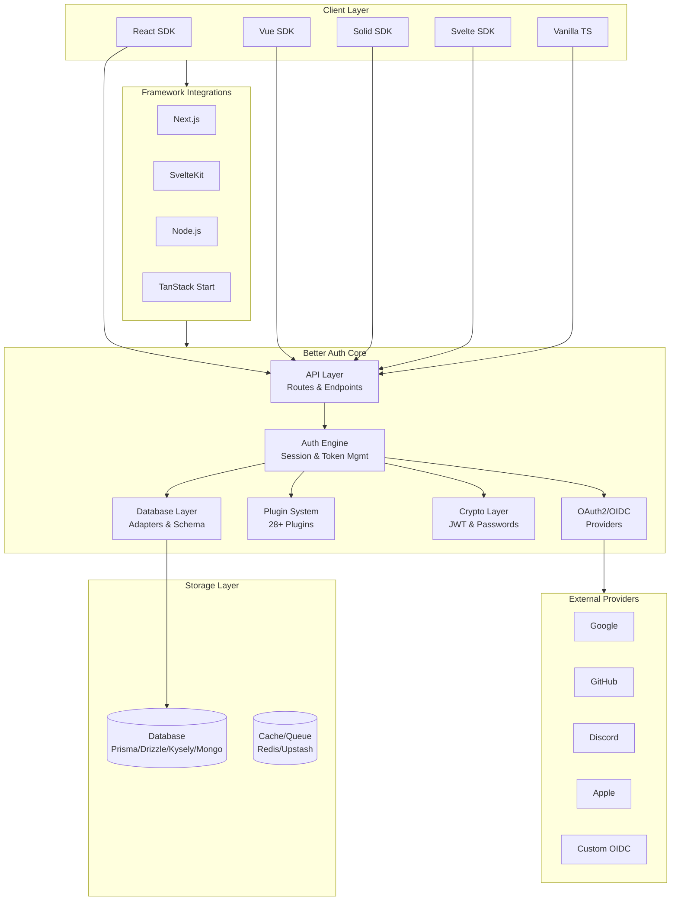
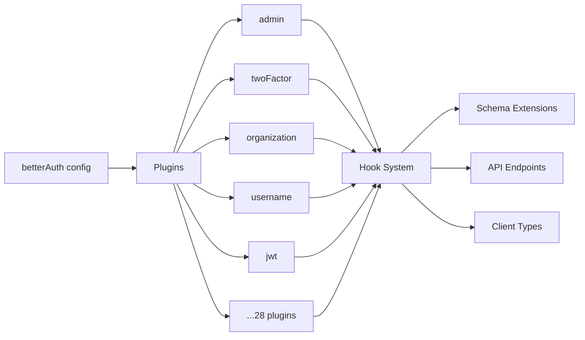
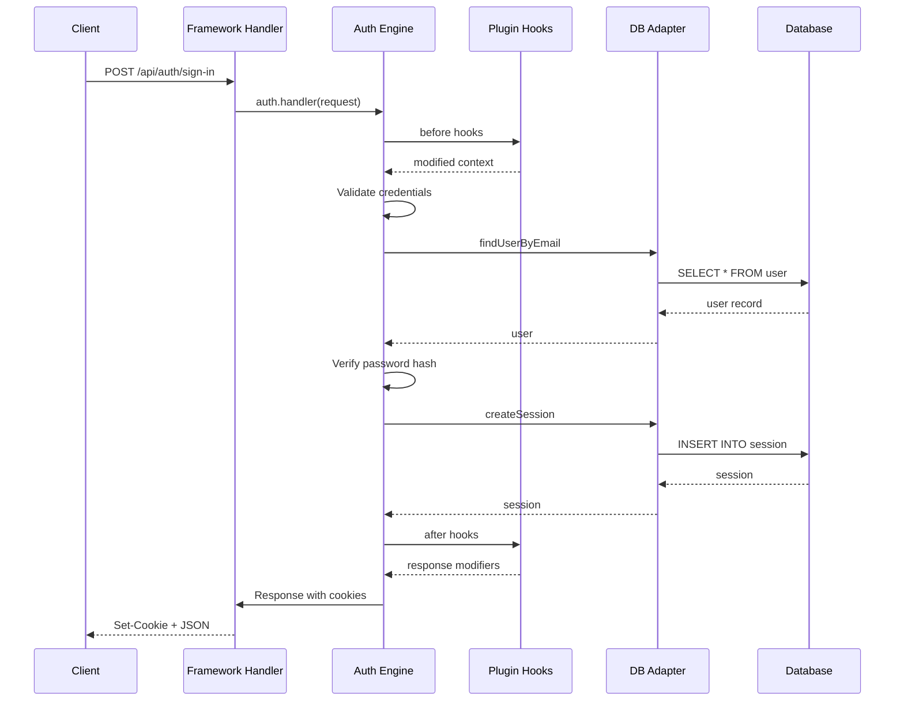

# Project Exploration: Better Auth

## Overview

Better Auth is a comprehensive, framework-agnostic authentication and authorization library for TypeScript. It provides a complete authentication solution out of the box with a plugin ecosystem for advanced features like 2FA, multi-tenant organizations, social sign-on, magic links, and more.

The project's mission is to solve authentication as a "half-solved problem" in the TypeScript ecosystem by providing a production-ready solution that doesn't require third-party services.

## Repository

- **Location:** `/home/darkvoid/Boxxed/@formulas/src.auth/better-auth`
- **Remote:** `git@github.com:better-auth/better-auth.git`
- **Primary Language:** TypeScript
- **License:** MIT
- **Branch:** `canary` (PRs target this branch)

## Directory Structure

```
better-auth/
├── packages/                    # Core monorepo packages
│   ├── better-auth/             # Main authentication library (119 source files)
│   │   ├── src/
│   │   │   ├── auth/            # Auth initialization (full/minimal modes)
│   │   │   ├── api/             # API routes, rate limiting, middlewares
│   │   │   ├── client/          # Type-safe client SDKs (React, Vue, Solid, Svelte)
│   │   │   ├── plugins/         # 28 authentication plugins
│   │   │   ├── db/              # Database adapters, schema, migrations
│   │   │   ├── cookies/         # Cookie handling, session stores
│   │   │   ├── crypto/          # JWT, password hashing, secrets
│   │   │   ├── oauth2/          # OAuth2/OIDC utilities
│   │   │   ├── social-providers/# Social login providers
│   │   │   ├── integrations/    # Framework integrations (Next.js, SvelteKit, etc.)
│   │   │   └── utils/           # Shared utilities
│   │   └── package.json         # 80+ export entries for submodules
│   │
│   ├── core/                    # Core utilities and types (shared by all packages)
│   │   └── src/
│   │       ├── api/             # Low-level API utilities
│   │       ├── context/         # Request/endpoint context management
│   │       ├── db/              # Database adapter interfaces
│   │       ├── oauth2/          # OAuth2 core types
│   │       ├── social-providers/# Social provider definitions
│   │       ├── types/           # Shared TypeScript types
│   │       └── utils/           # Shared utilities (error codes, ID generation)
│   │
│   ├── adapters/                # Database adapter implementations
│   │   ├── prisma-adapter/      # Prisma ORM adapter
│   │   ├── drizzle-adapter/     # Drizzle ORM adapter
│   │   ├── kysely-adapter/      # Kysely query builder adapter
│   │   ├── mongo-adapter/       # MongoDB adapter
│   │   └── memory-adapter/      # In-memory adapter (testing)
│   │
│   ├── plugins/                 # Standalone plugin packages
│   │   ├── admin/               # Admin dashboard features
│   │   ├── two-factor/          # 2FA/TOTP support
│   │   ├── organization/        # Multi-tenant organizations
│   │   ├── passkey/             # WebAuthn passkeys
│   │   ├── jwt/                 # JWT session support
│   │   ├── oidc-provider/       # OpenID Connect provider
│   │   ├── oauth-provider/      # OAuth2 provider
│   │   ├── api-key/             # API key authentication
│   │   ├── scim/                # SCIM protocol support
│   │   ├── sso/                 # Single sign-on
│   │   └── stripe/              # Stripe integration
│   │
│   ├── integrations/            # Platform-specific integrations
│   │   ├── expo/                # React Native/Expo
│   │   └── electron/            # Electron apps
│   │
│   ├── cli/                     # CLI tooling
│   ├── telemetry/               # Usage telemetry
│   └── test-utils/              # Shared testing utilities
│
├── demo/                        # Demo applications
│   ├── nextjs/                  # Next.js demo app
│   ├── expo/                    # React Native demo
│   ├── electron/                # Electron demo
│   ├── stateless/               # Stateless mode demo
│   └── oidc-client/             # OIDC client demo
│
├── docs/                        # Documentation site
│   └── content/docs/            # MDX documentation files
│       ├── introduction.mdx
│       ├── installation.mdx
│       ├── basic-usage.mdx
│       ├── comparison.mdx
│       ├── authentication/      # Auth feature docs
│       ├── plugins/             # Plugin documentation
│       ├── adapters/            # Database adapter docs
│       ├── integrations/        # Framework integration docs
│       ├── guides/              # How-to guides
│       └── reference/           # API reference
│
├── e2e/                         # End-to-end tests
│   ├── smoke/                   # Smoke tests
│   ├── adapter/                 # Adapter integration tests
│   └── integration/             # Full integration tests
│
├── test/                        # Unit tests (Vitest)
├── landing/                     # Landing page
├── .claude/                     # Claude Code configuration
│   ├── agents/                  # Custom agents (cherry-pick, release)
│   └── rules/                   # Claude rules (release.md)
└── .postmortem/                 # Post-incident documentation
```

## Architecture

### High-Level Architecture



### Plugin Architecture



## Component Breakdown

### Core Package (`@better-auth/core`)

| Location | Purpose |
|----------|---------|
| `packages/core/src/context/` | Request context, transaction management, endpoint context |
| `packages/core/src/db/` | Database adapter interfaces, verification token storage |
| `packages/core/src/oauth2/` | OAuth2 flow utilities, token handling, state management |
| `packages/core/src/social-providers/` | Social login provider definitions |
| `packages/core/src/types/` | Core TypeScript types (`BetterAuthOptions`, `AuthContext`, etc.) |
| `packages/core/src/utils/` | Shared utilities (error codes, ID generation, JSON helpers) |

**Key Types:**
- `BetterAuthOptions` - Configuration schema
- `AuthContext` - Runtime context with adapter, cookies, secrets
- `GenericEndpointContext` - Endpoint execution context
- `InternalAdapter` - Database operations interface

### Main Package (`better-auth`)

#### Auth Initialization

| File | Purpose |
|------|---------|
| `src/auth/base.ts` | Core `createBetterAuth()` factory |
| `src/auth/full.ts` | Full-mode initialization (with Kysely) |
| `src/auth/minimal.ts` | Minimal-mode initialization (custom adapters) |

#### API Layer

| Location | Purpose |
|----------|---------|
| `src/api/routes/` | Authentication endpoints (signIn, signUp, session, etc.) |
| `src/api/middlewares/` | Request middlewares (auth, rate limiting, CORS) |
| `src/api/rate-limiter/` | Rate limiting implementation |

#### Client SDKs

| Location | Purpose |
|----------|---------|
| `src/client/react/` | React hooks (`useSession`, `useSignIn`) |
| `src/client/vue/` | Vue composition API |
| `src/client/solid/` | SolidJS signals |
| `src/client/svelte/` | Svelte stores |
| `src/client/vanilla.ts` | Framework-agnostic client |

Key client features:
- Type-safe API calls via `better-call`
- Session atom with auto-refresh
- Broadcast channel for cross-tab sync
- SSR support

#### Database Layer

| File | Purpose |
|------|---------|
| `src/db/adapter-base.ts` | Base adapter class |
| `src/db/adapter-kysely.ts` | Kysely query builder adapter |
| `src/db/schema.ts` | Default database schema |
| `src/db/get-migration.ts` | Migration generation |
| `src/db/internal-adapter.ts` | Internal CRUD operations |

#### Plugins (28 Total)

| Plugin | Purpose |
|--------|---------|
| `admin` | Admin dashboard, user management |
| `two-factor` | TOTP 2FA, backup codes |
| `organization` | Multi-tenant orgs, members, invitations |
| `username` | Username authentication |
| `email-otp` | Email one-time passwords |
| `magic-link` | Passwordless magic links |
| `jwt` | JWT session support |
| `oidc-provider` | Act as OIDC provider |
| `oauth-proxy` | OAuth flow proxying |
| `bearer` | Bearer token auth |
| `anonymous` | Anonymous sign-in |
| `phone-number` | Phone authentication |
| `generic-oauth` | Custom OAuth providers |
| `captcha` | CAPTCHA verification |
| `haveibeenpwned` | Password breach checking |
| `siwe` | Sign-in with Ethereum |
| `mcp` | MCP (Model Context Protocol) |
| `passkey` | WebAuthn passkeys |
| `device-authorization` | Device flow |
| `one-time-token` | Single-use tokens |
| `one-tap` | Google One Tap |
| `last-login-method` | Track login method |
| `multi-session` | Multiple concurrent sessions |
| `open-api` | OpenAPI schema generation |
| `access` | RBAC access control |
| `additional-fields` | Schema extension |
| `scim` | SCIM protocol |
| `stripe` | Stripe billing integration |

#### Social Providers

Built-in support for: Google, GitHub, Discord, Apple, Microsoft, Spotify, Twitch, Dropbox, Facebook, GitLab, LinkedIn, Twitter/X, Roblox, Steam, TikTok, ВКонтакте, Amazon, PayPal, Coinbase, Figma, Line, Webex

#### Integrations

| Integration | File |
|-------------|------|
| Next.js | `src/integrations/next-js.ts` |
| SvelteKit | `src/integrations/svelte-kit.ts` |
| Node.js | `src/integrations/node.ts` |
| TanStack Start (React) | `src/integrations/tanstack-start.ts` |
| TanStack Start (Solid) | `src/integrations/tanstack-start-solid.ts` |
| Solid Start | `src/integrations/solid-start.ts` |

## Entry Points

### Server-Side Initialization

```typescript
// Full mode (default) - includes Kysely
import { betterAuth } from "better-auth";

const auth = betterAuth({
  database: new PostgresDialect({ connection: process.env.DATABASE_URL }),
  emailAndPassword: { enabled: true },
  plugins: [
    organization(),
    twoFactor(),
    // ... more plugins
  ],
});

export { auth };
```

```typescript
// Minimal mode - bring your own adapter
import { betterAuth } from "better-auth/minimal";
import { drizzleAdapter } from "better-auth/adapters/drizzle";

const auth = betterAuth({
  database: drizzleAdapter(db, { provider: "pg" }),
  emailAndPassword: { enabled: true },
});
```

### Client-Side Usage

```typescript
// React example
import { createAuthClient } from "better-auth/react";

const authClient = createAuthClient({
  baseURL: "http://localhost:3000",
  plugins: [
    organizationClient(),
    twoFactorClient(),
  ],
});

// Use hooks
const { signIn, signUp, useSession } = authClient;
```

### API Route Handlers

```typescript
// Next.js App Router
export const { GET, POST } = toNextJsHandler(auth);

// Or custom path
export async function GET(request: Request) {
  return auth.handler(request);
}
```

## Data Flow



## External Dependencies

| Dependency | Version | Purpose |
|------------|---------|---------|
| `@better-auth/core` | workspace:* | Core types and utilities |
| `@better-auth/utils` | catalog: | Cryptographic utilities |
| `@better-fetch/fetch` | catalog: | Fetch wrapper |
| `better-call` | catalog: | Type-safe RPC framework |
| `jose` | ^6.1.3 | JWT and JWE handling |
| `kysely` | ^0.28.11 | Type-safe SQL query builder |
| `nanostores` | ^1.1.1 | State management (client) |
| `zod` | ^4.3.6 | Runtime type validation |
| `@noble/hashes` | ^2.0.1 | Cryptographic hashes |
| `@noble/ciphers` | ^2.1.1 | Encryption ciphers |
| `defu` | ^6.1.4 | Deep object defaults |
| `@opentelemetry/api` | ^1.9.0 | Telemetry instrumentation |

### Database Adapters (Optional Peer Dependencies)

| Database | Package | Version |
|----------|---------|---------|
| Prisma | `@prisma/client` | ^5.0.0+ |
| Drizzle | `drizzle-orm` | ^0.41.0 |
| MongoDB | `mongodb` | ^6.0.0+ |
| PostgreSQL | `pg` | ^8.0.0 |
| MySQL | `mysql2` | ^3.0.0 |
| SQLite | `better-sqlite3` | ^12.0.0 |

## Configuration

### Core Options

```typescript
interface BetterAuthOptions {
  // Database
  database: Dialect | Adapter;

  // Authentication methods
  emailAndPassword?: { enabled: boolean; minPasswordLength?: number };
  socialProviders?: { github?: GithubOptions; google?: GoogleOptions; };

  // Session configuration
  session?: {
    expiresIn?: number;
    updateAge?: number;
    cookieCache?: { enabled?: boolean; maxAge?: number };
  };

  // User configuration
  user?: {
    changeEmail?: { enabled: boolean };
    deleteUser?: { enabled: boolean };
  };

  // Advanced
  advanced?: {
    cookies?: CookieOptions;
    generateId?: () => string;
    useSecureCookies?: boolean;
  };

  // Plugins
  plugins?: BetterAuthPlugin[];
}
```

### Environment Variables

| Variable | Purpose |
|----------|---------|
| `BETTER_AUTH_SECRET` | Signing secret for cookies/tokens |
| `BETTER_AUTH_URL` | Base URL for callbacks |
| `DATABASE_URL` | Database connection string |
| `GOOGLE_CLIENT_ID/SECRET` | Google OAuth credentials |
| `GITHUB_CLIENT_ID/SECRET` | GitHub OAuth credentials |

## Testing

### Test Structure

- **Unit Tests:** Vitest under each package (`*.test.ts`)
- **E2E Tests:** Playwright in `e2e/` directory
- **Adapter Tests:** Require Docker containers (`docker compose up -d`)

### Test Helpers

```typescript
import { getTestInstance } from "better-auth/test";

const { auth, signInWithTestUser } = await getTestInstance({
  // custom options
});
```

### Running Tests

```bash
# Full test suite (all packages)
pnpm test

# Specific test file
vitest path/to/test-file.ts

# Adapter tests (requires Docker)
pnpm test:adapters

# Coverage
pnpm coverage
```

## Key Insights

1. **Plugin-First Architecture:** Every feature (even core auth) is built as a plugin, enabling extreme extensibility

2. **Framework Agnostic:** Core logic has zero framework dependencies; integrations are thin adapters

3. **Type Safety:** Heavy use of TypeScript generics and inference ensures end-to-end type safety from server to client

4. **Dual-Mode Operation:** Supports "full" mode (with Kysely) and "minimal" mode (bring your own adapter)

5. **Hook System:** Plugins use before/after hooks to intercept and modify authentication flows

6. **Standard Schema Support:** Uses `@standard-schema/spec` for validation interoperability

7. **Telemetry Built-In:** Optional telemetry tracks feature usage for product decisions

8. **Monorepo with pnpm:** Uses pnpm workspaces, Turbo for builds, and a catalog for shared dependency versions

---

## Deep Dive: Core Components

### Request Flow (Detailed)

```
1. Request arrives at framework handler
   └─> auth.handler(request)

2. Router (api/index.ts)
   ├─> onRequest middleware chain
   │   ├─> Plugin onRequest hooks
   │   ├─> Rate limiting (onRequestRateLimit)
   │   └─> Origin check middleware
   │
   ├─> Endpoint matching
   │   └─> toAuthEndpoints() wraps endpoints with context
   │
   └─> Endpoint execution
       ├─> Body validation (Zod)
       ├─> Before hooks (plugin matchers)
       ├─> Endpoint handler
       ├─> After hooks (plugin matchers)
       └─> onResponse middleware
           ├─> Rate limiting (onResponseRateLimit)
           └─> Plugin onResponse hooks
```

### Session Cookie Architecture

**Three-cookie system:**

1. **`session_token`** - Signed cookie with session token (DB lookup)
   - MaxAge: 7 days (configurable)
   - HttpOnly, Secure, SameSite=lax

2. **`session_data`** - Cached session data (reduces DB calls)
   - MaxAge: 5 minutes (configurable)
   - Three strategies:
     - `compact` - Base64 + HMAC (default)
     - `jwt` - JWT with HS256 signature
     - `jwe` - Encrypted with A256CBC-HS512
   - Supports chunking for large sessions

3. **`dont_remember`** - Flag for non-persistent sessions
   - Session expires when browser closes

### Secret Management

```typescript
// Single secret (legacy)
{
  secret: "your-secret-min-32-chars"
}

// Multiple secrets with key rotation
{
  currentVersion: 2,
  keys: new Map([
    [1, "old-secret-still-valid"],
    [2, "current-secret"],
  ]),
  legacySecret: "for-decrypting-old-data"
}
```

### Password Hashing

```typescript
// Default: uses @noble/hashes with Argon2id
import { hashPassword, verifyPassword } from "better-auth";

// Custom hash function
const auth = betterAuth({
  emailAndPassword: {
    password: {
      hash: async (password) => customHash(password),
      verify: async ({ password, hash }) => customVerify(password, hash),
    }
  }
});
```

### Rate Limiting

```typescript
// Configuration
rateLimit: {
  enabled: true,
  window: 10,        // seconds
  max: 100,          // requests per window
  storage: "memory" | "database" | "secondary-storage"
}

// Per-plugin rate limits
plugins: [
  twoFactor({
    rateLimit: [
      {
        pathMatcher: (path) => path.startsWith("/two-factor/"),
        window: 10,
        max: 3,  // strict limit for 2FA
      }
    ]
  })
]
```

### Plugin Hook System

```typescript
const plugin = {
  id: "my-plugin",
  hooks: {
    before: [
      {
        // Runs before endpoint
        matcher: (ctx) => ctx.path === "/sign-in/email",
        handler: createAuthMiddleware(async (ctx) => {
          // Validate/modify request
          return { context: { myData: "value" } };
        })
      }
    ],
    after: [
      {
        // Runs after endpoint
        matcher: (ctx) => ctx.path.startsWith("/sign-in/"),
        handler: createAuthMiddleware(async (ctx) => {
          // Modify response, log, etc.
        })
      }
    ]
  }
};
```

### Database Schema Extension

Plugins can extend core schemas:

```typescript
// Plugin schema
const plugin = {
  id: "username",
  schema: {
    user: {
      fields: {
        username: {
          type: "string",
          unique: true,
          required: false,
        }
      }
    }
  }
};

// Usage in options
const auth = betterAuth({
  user: {
    additionalFields: {
      username: {
        type: "string",
        required: true,
      }
    }
  }
});
```

### OAuth2 Flow Implementation

```typescript
// 1. Create authorization URL
const { codeVerifier, state } = await generateState(ctx);
const url = await provider.createAuthorizationURL({
  state,
  codeVerifier,
  redirectURI: `${ctx.baseURL}/callback/${provider.id}`,
});

// 2. Handle callback
const tokens = await validateAuthorizationCode({
  code,
  codeVerifier,
  redirectURI,
});

const userInfo = await provider.getUserInfo(tokens);

// 3. Link or create user
const result = await handleOAuthUserInfo(ctx, {
  userInfo,
  account: { providerId, accountId: userInfo.id },
});
```

### Trusted Origins

```typescript
// Configuration
const auth = betterAuth({
  baseURL: "https://app.example.com",
  trustedOrigins: [
    "https://example.com",
    "https://*.example.com",  // wildcard
    "https://admin.example.com",
  ]
});

// Dynamic config (per-request resolution)
const auth = betterAuth({
  baseURL: {
    protocol: "https",
    allowedHosts: ["example.com", "*.vercel.app"],
  }
});
```

---

## Security Deep Dive

### CSRF Protection

- **Origin header check** - Validates `Origin` and `Referer` headers
- **Trusted origins list** - Configurable allowed origins
- **Cookie-based state** - OAuth state stored in signed cookies
- **Skip options** - Can skip for specific paths (SAML callbacks)

### Timing Attack Prevention

```typescript
// Consistent password hashing time - even for invalid emails
const user = await findUserByEmail(email);
if (!user) {
  // Hash anyway to prevent timing-based email enumeration
  await ctx.context.password.hash(password);
  throw APIError.UNAUTHORIZED;
}
```

### Session Security

| Feature | Description |
|---------|-------------|
| **Signed cookies** | HMAC-SHA256 signature on all cookies |
| **Encrypted session data** | JWE or compact encrypted format |
| **HttpOnly** | JavaScript cannot access cookies |
| **Secure flag** | Cookies only sent over HTTPS |
| **SameSite=lax** | CSRF protection via SameSite |
| **Sliding expiration** | Active sessions auto-extend |
| **Fresh session check** | Require recent auth for sensitive ops |

---

## Open Questions

1. ~~How does the rate limiting storage backend work in distributed deployments?~~
   **Answer:** Supports `memory`, `database`, or `secondary-storage` (Redis/Upstash). Database storage uses the `rateLimit` table.

2. ~~What is the exact mechanism for plugin dependency ordering?~~
   **Answer:** Plugins are executed in order they appear in the `plugins` array. No explicit dependency system - order matters.

3. ~~How are database migrations handled in production deployments?~~
   **Answer:** Via CLI: `npx auth db:migrate`. Uses Kysely's migration system. Can also run programmatically via `auth.$context.runMigrations()`.

4. ~~What is the session invalidation strategy for distributed systems?~~
   **Answer:** Database-backed sessions invalidate immediately. Cookie cache has short TTL (5 min default). For instant invalidation, use `secondaryStorage` (Redis).

5. ~~How does the broadcast channel work across different domains/subdomains?~~
   **Answer:** Uses `BroadcastChannel` API for same-origin tabs. Cross-tab sync via cookie changes. Cross-domain requires `crossSubDomainCookies` with shared domain.

