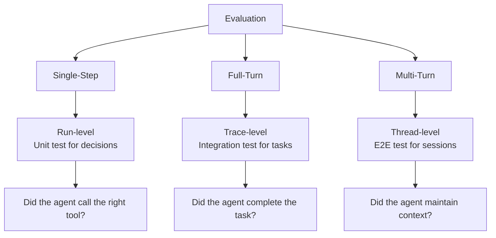
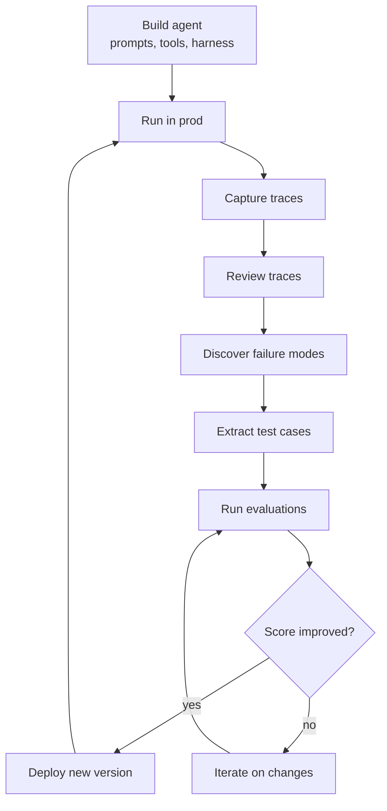

# Agent Observability -- Comprehensive Guide

## Purpose

Agent observability captures non-deterministic reasoning through traces, evaluates behavior at multiple granularities, and powers the continuous improvement loop. This document surveys current approaches, tools, and methods — from LangChain's LangSmith stack to building observability from scratch, and alternative approaches across the industry.

Sources: [LangChain Observability](https://www.langchain.com/blog/agent-observability-powers-agent-evaluation), [Agent Engineering: A New Discipline](https://blog.langchain.com/agent-engineering-a-new-discipline/), [Production Monitoring](https://www.langchain.com/blog/production-monitoring), [Traces Start the Agent Improvement Loop](https://www.langchain.com/blog/traces-start-agent-improvement-loop), [On Agent Frameworks and Observability](https://www.langchain.com/blog/on-agent-frameworks-and-agent-observability)

## Aha Moments

**Aha: Agent observability is fundamentally different from software observability.** Traditional monitoring tells you which service failed and when. Agent monitoring must tell you *why the agent reasoned badly* across 200 steps — including full prompts, tool calls, and context at every step.

**Aha: Traces are the new source of truth.** In traditional software, the code is the source of truth. In agents, the code (prompts, tools, harness) only defines the rules. The actual behavior emerges at runtime, captured only by traces.

**Aha: Observability is the foundation of evaluation, which is the foundation of improvement.** Without traces, you can't evaluate. Without evaluation, you can't improve systematically. The three form an inseparable stack.

## The Observability Gap

### Why Traditional Tools Don't Work for Agents

| Traditional Observability | Agent Observability |
|--------------------------|---------------------|
| Stack traces, error logs | No stack traces — reasoning failed, not code |
| Service call latency | LLM call latency + tool chain latency |
| Deterministic outputs | Non-deterministic reasoning trajectories |
| Fixed request/response | Open-ended natural language inputs |
| A few spans per trace | 200+ runs per trace, hundreds of MB |
| Sampling (1% of requests) | Every trace matters — each is unique |

### The Spectrum: Software → LLM Apps → Agents


| Property | Software | LLM Apps | Agents | Multi-Agent |
|----------|----------|----------|--------|-------------|
| Calls to LLM | 0 | 1 | N (loop) | N×M (network) |
| Determinism | Full | Partial | None | Chaotic |
| Debugging | Stack trace | Prompt inspection | Trace analysis | Cross-agent traces |
| Trace size | Bytes | KB | MB to hundreds of MB | GB |
| Testing | Unit tests | Golden tests | Eval suites | Cross-agent evals |

## Core Observability Primitives

### Level 1: Runs (Single Steps)

A run captures one LLM call with its complete context:

```
Run:
├── id: run_abc123
├── name: "agent_loop_iteration_7"
├── run_type: "llm"
├── inputs:
│   ├── messages: [SystemPrompt, UserMessage, ToolResults...]
│   ├── model: "claude-sonnet-4-6"
│   ├── temperature: 0.1
│   └── tools: [read_file, edit_file, run_test, grep]
├── outputs:
│   ├── tool_calls: [{name: "read_file", args: {path: "auth.py"}}]
│   └── reasoning: "I need to understand the auth flow..."
├── start_time: 2026-05-01T10:30:00Z
├── end_time: 2026-05-01T10:30:01.2Z
├── tokens: {input: 12470, output: 43}
└── metadata: {cost_usd: 0.0037, session: "cron_job_xyz"}
```

### Level 2: Traces (Complete Executions)

A trace links all runs in a single agent execution:

```mermaid
flowchart TD
    T[Trace: "Fix auth bug"] --> R1[Run 1: Research codebase]
    T --> R2[Run 2: Read session.py]
    T --> R3[Run 3: Implement fix]
    T --> R4[Run 4: Run tests]
    T --> R5[Run 5: Verify]

    R1 --> T1[Tool: grep 'session']
    R2 --> T2[Tool: read_file 'session.py']
    R3 --> T3[Tool: edit_file 'session.py']
    R4 --> T4[Tool: run_test 'test_session.py']
    R5 --> T5[Tool: run_test 'test_auth.py']
```

Each trace includes:
- All LLM calls (runs) with full inputs/outputs
- All tool calls with arguments and results
- Nested structure showing parent-child relationships
- Timing and cost metadata
- Error information (if any)

### Level 3: Threads (Multi-Turn Sessions)

A thread groups multiple traces into a session:

```
Thread: "Session #42 with user Alice"
├── Trace 1 (10:30): "Set up project structure"
│   ├── 5 runs, 3 tool calls
│   └── Result: Created directory structure
├── Trace 2 (10:45): "Add authentication"
│   ├── 12 runs, 8 tool calls
│   └── Result: Implemented JWT auth
├── Trace 3 (11:00): "Fix the test failure"
│   ├── 8 runs, 5 tool calls
│   └── Result: Fixed mock import
└── State at end: 3 files created, 2 modified
```

## LangSmith Observability Stack

### Architecture

```
Agent Code
    │
    ├── @traceable decorator       ← Auto-capture function calls
    ├── CallbackHandler            ← Auto-capture LLM calls
    └── Client().create_run()      ← Manual trace creation
    │
    ▼
┌─────────────────────────────────┐
│       LangSmith Platform         │
├─────────────────────────────────┤
│  Runs    → Single LLM calls     │
│  Traces  → Complete executions  │
│  Threads → Multi-turn sessions  │
├─────────────────────────────────┤
│  Evaluation → Score traces      │
│  Datasets   → Test case repos   │
│  Prompts    → Versioned prompts │
├─────────────────────────────────┤
│  Deployment → Host agents       │
│  Fleet      → Manage agents     │
│  Monitoring → Production alerts │
└─────────────────────────────────┘
```

### Instrumentation Methods

**1. @traceable decorator** (automatic):

```python
from langsmith import traceable

@traceable
def research_task(query: str) -> str:
    # This function call becomes a run in the trace
    results = search(query)
    return synthesize(results)

@traceable
def agent_loop(goal: str):
    while not done:
        plan = llm_call(goal, context)  # Captured as LLM run
        result = execute_tool(plan)     # Captured as tool run
        context.append(result)
```

**2. CallbackHandler** (framework integration):

```python
from langsmith import Client
from langchain.callbacks import LangChainTracer

client = Client()
tracer = LangChainTracer(client=client)

# LangChain agents auto-trace all LLM calls and tool executions
agent = create_react_agent(llm, tools, callbacks=[tracer])
```

**3. Manual trace creation** (custom frameworks):

```python
from langsmith import Client

client = Client()

# Start a trace
run_id = str(uuid.uuid4())
client.create_run(
    name="my_agent",
    inputs={"goal": "Fix the bug"},
    run_type="chain",
    id=run_id,
)

# Add child runs
client.create_run(
    name="llm_call_1",
    inputs={"messages": [...]},
    run_type="llm",
    id=str(uuid.uuid4()),
    parent_run_id=run_id,
)

# End runs with outputs
client.update_run(run_id, outputs={"result": "Done"}, end_time=time.time())
```

## Building Observability From Scratch

If you're not using LangSmith, here's how to build the core primitives.

### Data Model

```python
@dataclass
class Run:
    id: str                          # UUID
    name: str                        # "llm_call", "tool_execution", etc.
    run_type: str                    # "llm", "tool", "chain", "agent"
    parent_id: Optional[str]         # Parent run ID (for nesting)
    inputs: dict                     # Input data (prompts, tool args)
    outputs: Optional[dict]          # Output data (responses, results)
    start_time: float                # Epoch seconds
    end_time: Optional[float]
    error: Optional[str]             # Error message if failed
    metadata: dict                   # model, cost, tokens, session_id
    events: list                     # Streaming events (token chunks)

@dataclass
class Trace:
    id: str                          # UUID (same as root run ID)
    name: str                        # "agent_execution"
    root_run: Run                    # Top-level run
    runs: dict[str, Run]             # All runs by ID
    thread_id: Optional[str]         # Thread this trace belongs to
    start_time: float
    end_time: Optional[float]
    status: str                      # "success", "error", "partial"

@dataclass
class Thread:
    id: str                          # UUID
    name: str                        # "session with user_42"
    traces: list[str]                # Trace IDs in order
    metadata: dict                   # user_id, platform, chat_id
    created_at: float
    updated_at: float
```

### Storage

```python
# SQLite for development, Postgres for production
# Runs table
CREATE TABLE runs (
    id TEXT PRIMARY KEY,
    name TEXT NOT NULL,
    run_type TEXT NOT NULL,
    parent_id TEXT REFERENCES runs(id),
    trace_id TEXT NOT NULL,
    thread_id TEXT,
    inputs TEXT,          -- JSON
    outputs TEXT,         -- JSON
    start_time REAL,
    end_time REAL,
    error TEXT,
    metadata TEXT,        -- JSON
    events TEXT           -- JSON array
);

# Threads table
CREATE TABLE threads (
    id TEXT PRIMARY KEY,
    name TEXT,
    metadata TEXT,        -- JSON
    created_at REAL,
    updated_at REAL
);

# Indexes for common queries
CREATE INDEX idx_runs_trace ON runs(trace_id);
CREATE INDEX idxruns_thread ON runs(thread_id);
CREATE INDEX idxruns_parent ON runs(parent_id);
CREATE INDEX idxruns_type ON runs(run_type);
```

### Capture Decorator

```python
import time
import uuid
from functools import wraps
from contextvars import ContextVar

# Track the current parent run
_current_run: ContextVar[Optional[str]] = ContextVar('current_run', default=None)

def traceable(func=None, *, run_type="chain"):
    def decorator(f):
        @wraps(f)
        def wrapper(*args, **kwargs):
            run_id = str(uuid.uuid4())
            parent_id = _current_run.get()

            # Create run record
            run = Run(
                id=run_id,
                name=f.__name__,
                run_type=run_type,
                parent_id=parent_id,
                trace_id=parent_id or run_id,  # root run's ID = trace ID
                inputs={"args": str(args), "kwargs": kwargs},
                start_time=time.time(),
                metadata={},
            )
            storage.save_run(run)

            # Set as current parent for child calls
            token = _current_run.set(run_id)

            try:
                result = f(*args, **kwargs)
                run.outputs = {"return": str(result)}
                run.status = "success"
                return result
            except Exception as e:
                run.error = str(e)
                run.status = "error"
                raise
            finally:
                run.end_time = time.time()
                storage.update_run(run)
                _current_run.reset(token)

        return wrapper
    return decorator if func else decorator
```

### Trace Visualization

```python
def render_trace(trace_id: str) -> str:
    """Render a trace as a readable tree."""
    runs = storage.get_runs_by_trace(trace_id)
    root = runs[trace_id]  # root run

    def render_run(run: Run, indent: int = 0) -> str:
        prefix = "  " * indent
        lines = [
            f"{prefix}{'▼' if run.children else '•'} {run.name} ({run.run_type})",
            f"{prefix}  Duration: {(run.end_time - run.start_time)*1000:.0f}ms",
        ]

        if run.run_type == "llm":
            tokens = run.metadata.get("tokens", {})
            lines.append(f"{prefix}  Tokens: {tokens.get('input', '?')}→{tokens.get('output', '?')}")

        if run.error:
            lines.append(f"{prefix}  ERROR: {run.error}")

        for child in run.children:
            lines.append(render_run(child, indent + 1))

        return "\n".join(lines)

    return render_run(root)
```

## Evaluation: The Layer Above Observability

### Three Evaluation Levels



### Evaluation Methods

| Method | What It Evaluates | Granularity |
|--------|-------------------|-------------|
| **Deterministic assertions** | Tool call correctness | Single run |
| **Golden comparisons** | Output matches expected | Full trace |
| **LLM-as-judge** | Reasoning quality | Run, trace, thread |
| **Rubric scoring** | Multi-dimensional quality | Full trace |
| **Pairwise comparison** | A vs B agent versions | Full trace |
| **Conversation analysis** | Context maintenance | Thread |

### LLM-as-Judge Pattern

```python
@traceable
def evaluate_trace(trace: Trace, rubric: dict) -> dict:
    """Use an LLM to evaluate agent performance."""
    judge_prompt = f"""
Evaluate the agent's performance on this task:

Task: {trace.root_run.inputs['goal']}
Agent trajectory:
{render_trace_summary(trace)}

Score on these dimensions (1-5):
- Correctness: Did the agent achieve the goal?
- Efficiency: Did it avoid unnecessary steps?
- Tool usage: Did it use the right tools?
- Error handling: Did it recover from failures?

Return JSON with scores and reasoning.
"""
    result = llm_call(judge_prompt, model="gpt-4o-mini")
    return json.loads(result.content)
```

## Alternative Observability Tools

### Open Source

| Tool | Approach | Strengths | Tradeoffs |
|------|----------|-----------|-----------|
| **LangSmith OSS** | @traceable decorator, SDK integration | Deep LangChain integration, evals built-in | Requires LangSmith infrastructure |
| **OpenLIT** | OpenTelemetry-based tracing | OTel standard, vendor-neutral | Less agent-specific features |
| **Phoenix (Arize)** | Embedding + trace analysis | Strong embedding visualization | More focused on RAG than agents |
| **Langfuse** | Open-source tracing | Self-hostable, clean UI, multi-framework | Evals less mature |
| **Smithery** | Agent monitoring platform | Lightweight, cost tracking | Smaller ecosystem |

### Commercial

| Tool | Approach | Strengths | Tradeoffs |
|------|----------|-----------|-----------|
| **LangSmith** | Full platform (traces + evals + deploy) | Most complete, LangChain native | Vendor lock-in |
| **Braintrust** | Eval-first platform | Great eval UX, data management | Traces secondary |
| **Galileo** | Observability + fine-tuning | Model optimization | Agent-specific features limited |
| **Patronus** | Evaluation platform | LLM-as-judge, guardrails | Not a tracing tool |

### The OpenTelemetry Approach

OpenTelemetry (OTel) provides a vendor-neutral standard:

```python
from opentelemetry import trace, metrics
from opentelemetry.trace import Status, StatusCode

tracer = trace.get_tracer("my_agent")

@tracer.start_as_current_span("agent_loop")
def agent_loop(goal):
    with tracer.start_as_current_span("llm_call") as span:
        span.set_attribute("model", "claude-sonnet-4-6")
        span.set_attribute("input_tokens", 1247)
        response = llm(prompt)
        span.set_attribute("output_tokens", 43)

    with tracer.start_as_current_span("tool_call") as span:
        span.set_attribute("tool", "read_file")
        span.set_attribute("tool_input.path", "auth.py")
        result = read_file("auth.py")
```

**Aha: OTel gives you vendor-neutral traces but lacks agent semantics.** You get spans and attributes, but not the run/trace/thread hierarchy or LLM-specific features (token counting, cost tracking, prompt versioning). You'd need to build those on top.

## Production Monitoring

### Key Metrics to Track

| Metric | Why It Matters | Alert Threshold |
|--------|---------------|-----------------|
| **Trace error rate** | Agent failures per time window | > 5% of traces |
| **Average trace duration** | Agent speed degradation | > 2x baseline |
| **Token cost per trace** | Cost explosion | > 2x baseline |
| **Tool failure rate** | External dependency issues | > 10% of tool calls |
| **Loop iteration count** | Agent stuck in loop | > max_expected |
| **Context window usage** | Approaching limits | > 90% of max |
| **Human approval rate** | Agent confidence | < 50% approvals |
| **Thread abandonment rate** | Users leaving mid-conversation | > 20% |

### Dashboard Structure

```
┌─────────────────────────────────────────────────┐
│  Agent Performance Dashboard                     │
├────────────┬────────────┬────────────┬───────────┤
│ Traces/HR  │ Avg Cost   │ Error Rate │ Avg Steps │
│   1,247    │   $0.34    │   2.3%     │   8.4     │
├────────────┴────────────┴────────────┴───────────┤
│  Trace Timeline (last 24h)                       │
│  ▁▂▃▅▇▆▅▃▂▁▂▃▄▅▆▇▇▆▅▃▂▁                        │
├─────────────────────────────────────────────────┤
│  Top Errors (last 24h)                          │
│  • ToolTimeout: 34 (28%)                        │
│  • ContextOverflow: 21 (17%)                    │
│  • Hallucination: 18 (15%)                      │
├─────────────────────────────────────────────────┤
│  Model Usage Breakdown                          │
│  Claude Sonnet 4.6: 67%  GPT-4o: 23%  Other: 10%│
└─────────────────────────────────────────────────┘
```

## The Agent Improvement Loop



**Aha: The loop never stops.** Agents operate on open-ended natural language inputs. New failure modes will always emerge. Continuous evaluation is the only path to reliability.

## Building vs. Buying: Decision Framework

| Consideration | Build | Buy (LangSmith) |
|--------------|-------|-----------------|
| **Time to value** | Weeks to months | Hours |
| **Custom depth** | Unlimited | Platform-dependent |
| **Data sovereignty** | Full control | Vendor-dependent |
| **Maintenance burden** | Ongoing | Vendor handles it |
| **LLM-as-judge** | Build yourself | Built-in |
| **Dataset management** | Build yourself | Built-in |
| **Prompt versioning** | Build yourself | Built-in |
| **Multi-framework** | Yes (your design) | Yes (LangChain + custom) |

### Minimum Viable Observability

If building from scratch, start with:

1. **Trace capture**: Decorator-based or manual, storing runs with parent-child relationships
2. **Trace viewing**: Web UI to inspect individual traces as trees
3. **Error tracking**: Count and categorize trace failures
4. **Cost tracking**: Tokens × pricing per model
5. **Basic evals**: Deterministic assertions on tool calls

Add later:
- LLM-as-judge evaluations
- Dataset management
- Prompt versioning
- Multi-turn thread analysis
- Production monitoring and alerting

## Key Takeaways

1. **Agent observability is different from software observability.** You're capturing reasoning, not service calls. Traces are the source of truth, not code.

2. **Three primitives: runs, traces, threads.** Single steps, complete executions, and multi-turn sessions. Each serves a different debugging and evaluation purpose.

3. **Observability powers evaluation powers improvement.** You can't evaluate without traces. You can't improve without evaluation. The three form a single stack.

4. **LangSmith is the most complete stack but not the only option.** Langfuse, OpenLIT, Phoenix, and building from scratch are all viable. OTel provides a vendor-neutral base.

5. **Production traces become your test suite.** Every failure mode discovered in production should become a test case in your eval suite. This is how agents improve.

[See LangSmith internals (source code deep dive) → 01-langsmith-internals.md](01-langsmith-internals.md)
[See LangChain overview → ../langchain/00-overview.md](../langchain/00-overview.md)
[See LangChain observability → ../langchain/03-observability-evaluation.md](../langchain/03-observability-evaluation.md)
