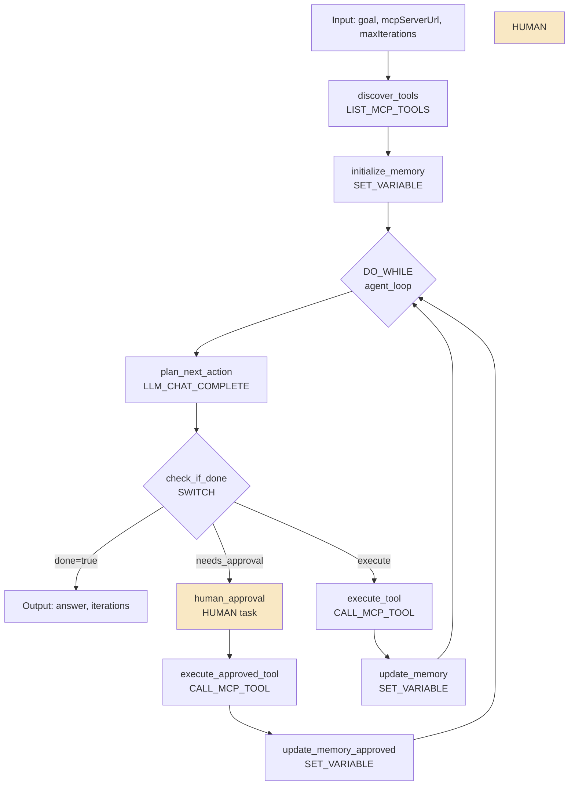

# Conductor -- Production Agent Architecture

## Purpose

Conductor OSS applies durable execution workflows to AI agents. Every step is a checkpoint. Human approvals are durable gates. Retries are automatic. This document covers the canonical production agent pattern using Conductor's workflow engine.

Source: `conductor-oss.github.io/conductor/devguide/ai/production-agent-architecture.html`
Source: `github.com/conductor-oss/conductor`

## Aha Moments

**Aha: Every step is a durable checkpoint.** Unlike in-memory agent loops, if the server restarts mid-execution, the agent resumes from the last completed task — not from the beginning. No custom checkpointing code needed.

**Aha: The agent loop is a DO_WHILE with LLM-as-planner.** The workflow defines the loop structure; the LLM decides what happens inside each iteration. Determinism + flexibility.

**Aha: Compensation handles side effects.** If an agent fails after taking irreversible actions (sending emails, creating resources), a failure workflow can undo them. This is impossible with in-memory agent loops.

## Architecture: The Canonical Agent Pattern



## Core Agent Concerns Mapped to Conductor Primitives

| Agent Concern | Conductor Primitive | How |
|--------------|-------------------|-----|
| Plan next action | `LLM_CHAT_COMPLETE` | LLM receives goal + context + tools, returns structured plan |
| Select tool at runtime | `DYNAMIC` task | LLM output determines which task executes |
| Execute tool | `CALL_MCP_TOOL`, `HTTP`, `SIMPLE` | Tool runs with retry, timeout, I/O recording |
| Retry with backoff | Task `retryLogic` | `FIXED`, `EXPONENTIAL_BACKOFF`, `LINEAR_BACKOFF` — no code |
| Parallel tool calls | `FORK/JOIN`, `DYNAMIC_FORK` | Fan out to N tools, join when done |
| Memory/context | `SET_VARIABLE` + workflow vars | Accumulate results across iterations |
| Human approval | `HUMAN` task | Durable pause, survives restarts |
| Long waits | `WAIT` task | Timer-based, survives server restarts |
| Resume from event | `HUMAN` + webhook/API | External system calls update API |
| Reflection loop | `DO_WHILE` with LLM-as-judge | Second LLM evaluates quality |
| Budget cap | `DO_WHILE` `loopCondition` | `iteration < maxIterations` or cost check |
| Termination | `DO_WHILE` exit + `SWITCH` | LLM sets `done: true` |
| Delegate | `SUB_WORKFLOW` | Spawn child agent, parent waits |
| Compensation | `failureWorkflow` | Undo side effects on failure |
| Audit trail | Automatic | Every task's I/O, timing, retries persisted |

## The Agent Loop in Detail

The core loop is a `DO_WHILE` operator:

```javascript
// loopCondition — evaluated after each iteration
if ($.loop['plan'].output.result.done == true) {
    false;  // exit loop
} else if ($.loop['plan'].output.iteration >= $.maxIterations) {
    false;  // exit loop (budget cap)
} else {
    true;   // continue
}
```

Each iteration:

1. **`plan_next_action`** (LLM_CHAT_COMPLETE): LLM receives system prompt with goal, available tools, and previous context. Returns JSON plan: `{action, arguments, reasoning, needs_approval, done}`.

2. **`check_if_done`** (SWITCH): Routes based on the plan:
   - `done=true` → exit loop, return answer
   - `needs_approval=true` → pause at HUMAN task
   - `execute` → run tool directly

3. **Tool execution** with automatic retry and timeout.

4. **Memory update** via `SET_VARIABLE`, appending action + result to the context array.

## What Makes This Production-Ready

### Every Step Is a Durable Checkpoint

```
Time →
Plan ──█── Execute Tool ──█── Update Memory ──█── Plan ──█── ...
                  ↑
            Server restarts here
                  │
            Resumes from █ (last checkpoint)
            NOT from beginning
```

If the server crashes between tool execution and memory update, Conductor re-runs the memory update task. The tool execution result is preserved.

### Human Approval Is a Durable Gate

The `HUMAN` task pauses the workflow indefinitely:

- Survives server restarts and deployments
- Shows planned action, arguments, reasoning to the reviewer
- Resumes only when the reviewer approves via API
- The agent loop continues from exactly where it paused

### Retry Is Automatic and Configurable

No custom retry logic in agent code:

```json
{
  "retryLogic": "EXPONENTIAL_BACKOFF",
  "retryCount": 3,
  "retryDelaySeconds": 1,
  "timeoutSeconds": 120,
  "timeoutPolicy": "RETRY"
}
```

This applies to every tool call. The agent loop doesn't need to handle errors.

### Memory Persists Across Iterations

Workflow variables accumulate context:

```javascript
// Each iteration appends to the context
"context": "${workflow.variables.context.concat([
  {action: plan.output.result.action, result: tool_call.output.content}
])}"
```

This context is passed to the LLM in the next iteration, enabling the agent to build on previous actions.

### Budget Cap Prevents Runaway Agents

The `DO_WHILE` loop condition enforces iteration limits:

```javascript
$.loop['plan'].output.iteration >= $.maxIterations
```

This prevents infinite loops where the agent keeps planning but never completes.

### Compensation Handles Side Effects

If the agent workflow fails (network down, tool permanently unavailable), Conductor runs a `failureWorkflow`:

```
failureWorkflow: "agent_compensation_workflow"
  → Revoke API calls made by the agent
  → Send failure notification
  → Release locked resources
  → Log compensation results
```

**Aha: This is impossible with in-memory agent loops.** When an in-memory agent crashes, you can't undo the actions it already took. Conductor's durable execution records every action and can trigger compensation.

### Observability Is Automatic

Every task records:
- Input parameters
- Output results
- Start/end time
- Retry count
- Worker ID
- Error messages (if any)

No instrumentation code needed — observability is built into the workflow engine.

## Extending the Pattern

### Parallel Research

```
FORK
├── Research agent A: "Analyze competitors"
├── Research agent B: "Analyze market trends"
└── Research agent C: "Analyze customer feedback"
JOIN
→ Synthesize findings
```

### Reflection/Evaluation Loop

```
DO_WHILE (quality_score < threshold AND iteration < 5):
  1. Generate output
  2. LLM-as-judge evaluates quality
  3. If below threshold, loop with feedback
```

### Long Waits

```
WAIT for 24 hours → Check for new data → Resume agent loop
```

Useful for agents that monitor conditions and act when something changes.

### Delegate to Specialist Agents

```
Main Agent
  └── SUB_WORKFLOW: "data_analysis_agent"
        → Runs independently
        → Returns results
        → Main agent continues with results
```

Full observability across the agent tree.

## Comparison: Conductor vs LangGraph

| Dimension | Conductor | LangGraph |
|-----------|-----------|-----------|
| **Model** | Workflow engine (JSON-defined) | Graph builder (Python/JS code) |
| **Execution** | Server-side, distributed | In-process or server |
| **Checkpointing** | Every task (automatic) | Configurable checkpointer |
| **Durability** | Survives server restarts | Depends on checkpointer backend |
| **Compensation** | Built-in failure workflows | Manual error handling |
| **Human-in-the-loop** | `HUMAN` task (durable) | `interrupt()` (in-process) |
| **Observability** | Automatic (built-in) | Via LangSmith integration |
| **SDKs** | Java, Python, Go, JS, C#, Ruby, Rust | Python, JS |
| **Agent definition** | JSON workflow + code workers | Python/JS code |

**Aha: Conductor trades flexibility for durability.** The JSON-defined workflow is more rigid than LangGraph's code-defined graph, but every step is automatically checkpointed, retried, and observed.

## Key Takeaways

1. **Durable execution is the differentiator.** Every step is a checkpoint. Server restarts don't lose work. Compensation undoes side effects.

2. **The agent loop is a workflow pattern, not code.** `DO_WHILE` + `LLM_CHAT_COMPLETE` + `SWITCH` + `CALL_MCP_TOOL` = production agent, no custom framework.

3. **Human-in-the-loop is a durable pause, not an interrupt.** The workflow pauses at a `HUMAN` task and resumes when approved — surviving restarts during the pause.

4. **Observability is free.** Every task's I/O is recorded automatically. No tracing instrumentation needed.

[See Stripe Minions architecture → ../stripe/README.md](../stripe/README.md)
[See LangGraph design → ../langchain/01-langgraph-design.md](../langchain/01-langgraph-design.md)
