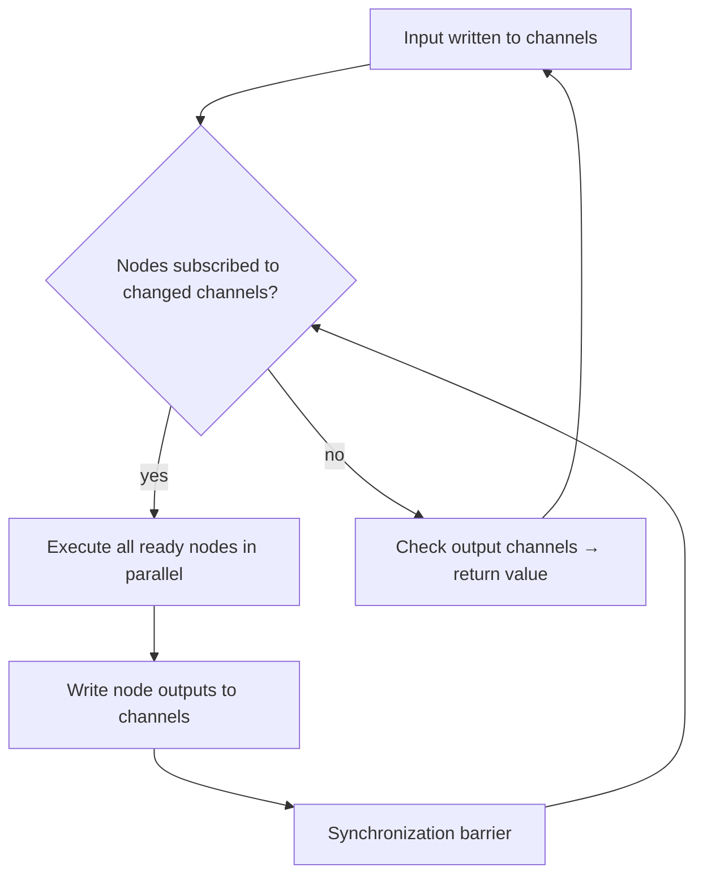

# LangChain -- Core Principles & Architecture

## Purpose

LangChain evolved from a popular chain-based LLM framework into a layered ecosystem: **LangGraph** for low-level production agent control, **Deep Agents** for long-running agentic tasks, and **LangSmith** for observability and evaluation. The key lesson from their journey: production agents need control and durability, not higher-level abstractions.

Source: [Building LangGraph](https://www.langchain.com/blog/building-langgraph)
Source: [The Anatomy of an Agent Harness](https://www.langchain.com/blog/the-anatomy-of-an-agent-harness)
Source: [Your Harness, Your Memory](https://www.langchain.com/blog/your-harness-your-memory)

## Aha Moments

**Aha: The biggest competitor to any agent framework is no framework at all.** LangGraph's design philosophy is "it should feel like writing code." Every requirement placed on the developer's code must be justified by enabling a really high-value feature. Otherwise the pull of skipping the framework is too strong.

**Aha: Memory isn't a plugin — it's the harness.** How the harness manages context and state is the foundation for agent memory. Asking to plug memory into an agent harness is like asking to plug driving into a car. If you use a closed harness behind a proprietary API, you yield control of your memory to a third party.

**Aha: LLMs are slow, flaky, and open-ended.** These three properties drove every LangGraph design decision. Slow → need parallelization and streaming. Flaky → need checkpointing and task queues. Open-ended → need human-in-the-loop and tracing.

## What LangChain Is

LangChain started as a framework for composing LLM chains. As models improved and agents emerged, LangChain restructured into three layers:

| Layer | Product | Purpose |
|-------|---------|---------|
| **Runtime** | LangGraph | Low-level agent graph execution with loops, state, checkpointing |
| **Harness** | Deep Agents | High-level long-running agent with skills, subagents, context management |
| **Observability** | LangSmith | Traces, evals, deployment, Fleet management |

```
User Request
    │
    ▼
┌─────────────────────────┐
│   LangSmith (observ.)   │  ← Traces, evals, monitoring
├─────────────────────────┤
│   Deep Agents (harness) │  ← Skills, subagents, context
├─────────────────────────┤
│   LangGraph (runtime)   │  ← StateGraph, PregelLoop, checkpoints
├─────────────────────────┤
│   Model Providers        │  ← OpenAI, Anthropic, etc.
└─────────────────────────┘
```

## Design Principles

LangGraph was designed with two leading principles:

**1. Few assumptions about the future.** The fewer assumptions baked in, the more relevant the framework stays. The only baked-in assumptions: LLMs are slow, flaky, and open-ended.

**2. It should feel like writing code.** The public API should be as close to regular framework-less code as possible.

This resulted in two key architectural decisions:

- **Runtime independent from SDKs.** The runtime (PregelLoop) implements features, plans computation graphs, and executes them. SDKs (StateGraph, imperative API) are public interfaces. This allows SDK and runtime to evolve independently.
- **Features as building blocks.** Each of the 6 core features is optional — you reach for them when needed. The framework doesn't force a particular pattern.

## Six Features Every Production Agent Needs

From building agents with Uber, LinkedIn, Klarna, and Elastic, LangChain identified six features developers need:

| Feature | Problem Solved | Mechanism |
|---------|---------------|-----------|
| **Parallelization** | Actual latency | Run independent steps concurrently, avoid data races |
| **Streaming** | Perceived latency | Show progress/actions/tokens to user while agent runs |
| **Task Queue** | Failed retries | Decouple agent execution from triggering request |
| **Checkpointing** | Retry cost | Save intermediate state, resume from failure point |
| **Human-in-the-loop** | Non-deterministic outcomes | Interrupt/resume at any point, approve actions |
| **Tracing** | Visibility | See inputs, trajectories, outputs of agent loops |

## Execution Algorithm: BSP/Pregel

LangGraph's runtime uses the **Bulk Synchronous Parallel / Pregel** algorithm, not DAG topological sort:



- **Channels** contain data (any Python/JS type), with a name and monotonically increasing version
- **Nodes** are functions that subscribe to channels, run when channels change
- **Input channels** trigger nodes; **output channels** define the return value
- **Synchronization barrier** ensures deterministic concurrency between supersteps

This provides deterministic concurrency with full loop support — critical for agents that need to iterate.

## Agent Harnesses: The Indispensable Layer

An agent harness is the scaffolding around the LLM that facilitates tool calling, context management, and interaction with the world. Harnesses are not going away — even the best models need a harness:

- Claude Code leaked source: **512k lines of code** (the harness)
- When models absorb scaffolding (e.g., built-in web search), they just become a lightweight harness behind the API

**Key responsibilities of the harness:**
- Tool selection and invocation
- Context window management (loading, compression, eviction)
- Memory management (short-term, long-term, cross-session)
- Instruction loading (AGENTS.md, CLAUDE.md, skills)
- System prompt construction

## Harness-Memory Coupling

The harness is intimately tied to memory:

> "Asking to plug memory into an agent harness is like asking to plug driving into a car." — Sarah Wooders

Questions the harness must answer:
- How is AGENTS.md/CLAUDE.md loaded into context?
- Can the agent modify its own system instructions?
- What survives compaction, what's lost?
- Are interactions stored and made queryable?
- How is the current working directory represented?

**Aha: If you don't own your harness, you don't own your memory.** Using a stateful API (like OpenAI's Responses API or Anthropic's server-side compaction) stores state on their server — you can't swap models and resume previous threads.

## Agent Authorization Patterns

Two authorization patterns emerged for shared agents:

| Type | Identity | Use Case |
|------|----------|----------|
| **Assistant** (on-behalf-of) | Acts as the end user | Onboarding agent uses Alice's Slack/Notion creds |
| **Claw** (fixed credentials) | Has its own credentials | Email agent uses a dedicated account |

With Claw-style agents, human-in-the-loop guardrails become essential — anyone interacting with the agent uses the same fixed credentials.

## Key Files

```
langchain-ai/
├── langgraph/                ← Low-level runtime
│   ├── langgraph/            ← Python SDK
│   │   ├── graph/            ← StateGraph, add_node, add_edge
│   │   ├── pregel/           ← PregelLoop runtime
│   │   ├── checkpoint/       ← Checkpointing (sqlite, postgres, memory)
│   │   └── types/            ← Channel, State types
│   └── tests/                ← Integration tests
├── deepagents/               ← High-level harness
│   ├── deepagents/
│   │   ├── harness.py        ← create_deep_agent()
│   │   ├── middleware/       ← Summarization, compaction tools
│   │   └── backends/         ← StateBackend, filesystem storage
│   └── cli/                  ← Deep Agents CLI
└── langsmith/                ← Observability platform
    ├── traceable             ← @traceable decorator
    ├── runs, traces, threads ← Core primitives
    └── evaluation            ← Evals, assertions
```

## The Tradeoff: Low-Level vs High-Level

LangGraph chose to be low-level in a sea of high-level frameworks:

| Low-Level (LangGraph) | High-Level (others) |
|-----------------------|---------------------|
| More control | Faster to prototype |
| You choose which features to use | Features are bundled |
| Harder to start | Easy to start |
| Production-ready by design | May hit walls at scale |

**Aha: High-level abstractions come and go. LangGraph remains relevant by being low-level.** The framework provides building blocks, not a prescribed pattern.

[See LangGraph design details → 01-langgraph-design.md](01-langgraph-design.md)
[See agent harness anatomy → 02-agent-harness.md](02-agent-harness.md)
[See observability and evaluation → 03-observability-evaluation.md](03-observability-evaluation.md)
