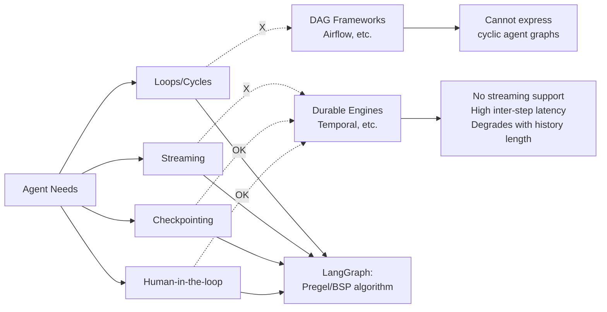
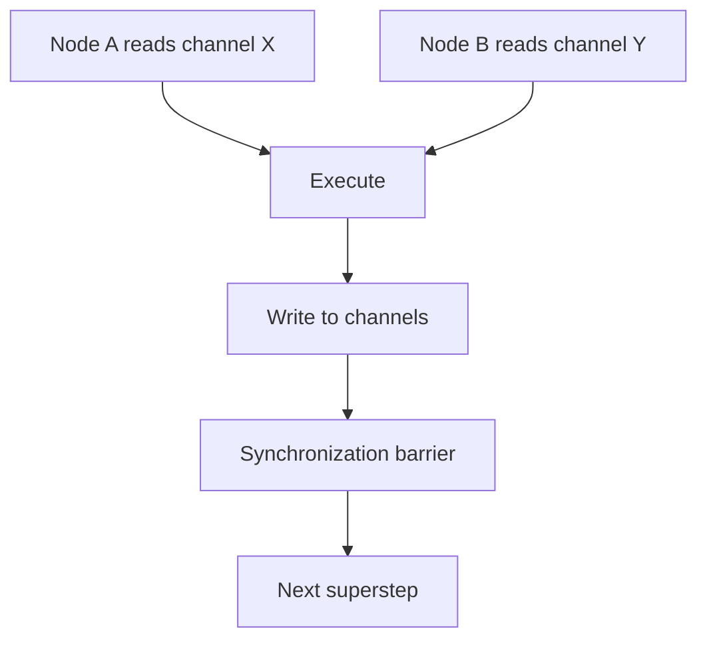

# LangGraph -- Design from First Principles

## Purpose

LangGraph was built as a reboot of LangChain's chains and agents, starting fresh to address the core feedback: LangChain was easy to get started but hard to customize and scale. This document covers the design decisions that make LangGraph production-ready.

Source: `github.com/langchain-ai/langgraph`
Source: [Building LangGraph](https://www.langchain.com/blog/building-langgraph)

## Aha Moments

**Aha: DAG frameworks can't handle agents.** Agent computation graphs are cyclical (agents loop until done), which DAG algorithms like topological sort fundamentally cannot express.

**Aha: Durable execution engines (Temporal, etc.) were designed before LLMs.** They lack streaming, introduce inter-step latency noticeable to chatbot users, and their performance degrades with longer histories — a bad bet as agents get more complex.

**Aha: Structured agents with discrete steps are non-negotiable.** You can write an agent as a single function with one big while loop, but you lose checkpointing, human-in-the-loop, and portable state. Execution state of generators can't be saved in a format resumable on a different machine.

## Why Previous Frameworks Didn't Work



## The Pregel/BSP Execution Model

LangGraph chose Bulk Synchronous Parallel / Pregel over "no algorithm" because ad-hoc concurrency leads to non-deterministic behavior:

```python
# Conceptual structure — channels and nodes
class Channel:
    name: str
    value: Any           # Current data
    version: int         # Monotonically increasing

class Node:
    name: str
    subscribes: list[str]  # Channel names
    def run(self, state) -> dict  # Returns updates to channels
```

The execution loop:
1. Write input to channels
2. Find all nodes subscribed to changed channels
3. Execute them in parallel (deterministic concurrency)
4. Write outputs back to channels
5. Synchronization barrier
6. Repeat until no nodes are ready → read output channels

## SDK Evolution: Three APIs

LangGraph offers three SDKs, all running on the same PregelLoop runtime:

| SDK | Style | Use Case |
|-----|-------|----------|
| **StateGraph** (current) | Declarative graph builder | Complex multi-node agents |
| **Imperative/Functional** | Direct function calls | Simple agents, closer to plain code |
| **Graph** (deprecated) | Original graph API | Early adopters, replaced by StateGraph |

The runtime/SDK separation enabled this evolution without breaking changes:

```
┌──────────────────────────────────────┐
│         SDK Layer (evolves)           │
│  StateGraph  │  Imperative  │  Graph │
├──────────────────────────────────────┤
│         PregelLoop Runtime            │
│  (stable contract, perf improved)     │
├──────────────────────────────────────┤
│       Checkpoint / Stream / Queue     │
│       (features as building blocks)   │
└──────────────────────────────────────┘
```

## Checkpointing: Resuming From Failure

Checkpointing saves snapshots of computation state at intermediate stages. This is critical because:

- A 10-minute agent failing at minute 9 shouldn't restart from zero
- Human-in-the-loop requires pausing and resuming
- Time travel (redoing from a previous step) needs historical states

```python
# Checkpoint interface (conceptual)
from langgraph.checkpoint.memory import MemorySaver

checkpointer = MemorySaver()  # Or SqliteSaver, PostgresSaver

graph = StateGraph(State)
# ... define nodes and edges ...
app = graph.compile(checkpointer=checkpointer)

# Run with checkpointing
config = {"configurable": {"thread_id": "conversation-1"}}
result = app.invoke(input, config)

# Resume from checkpoint (same thread_id)
result = app.invoke({"continue": True}, config)
```

Checkpointer backends:
- **MemorySaver**: In-memory, for testing
- **SqliteSaver**: Local persistence
- **PostgresSaver**: Production, scalable

## Human-in-the-Loop: Interrupt/Resume

The interrupt pattern is as simple as adding `interrupt()` to a node:

```python
def review_node(state):
    # Agent did work, now pause for human review
    interrupt("Review the changes before proceeding?")
    # After human approval, execution resumes here
    return state
```

This enables UX patterns:
- **Approve/reject actions**: "Should I delete this file?"
- **Edit next action**: Human modifies the agent's planned step
- **Clarifying questions**: Agent asks user for more info
- **Time travel**: Replay from any checkpoint with modifications

## Streaming: Fighting Perceived Latency

LangGraph supports streaming at multiple levels:

| Level | What Streams | Latency Feel |
|-------|-------------|--------------|
| **Token** | LLM output token-by-token | Immediate |
| **Action** | Tool calls and their results | Seconds |
| **Node** | Start/end of each node | Coarse |

```python
for event in app.stream(input, stream_mode="updates"):
    for node_name, updates in event.items():
        print(f"Node {node_name}: {updates}")
```

**Aha: When you can't reduce actual latency, fight perceived latency.** Showing useful information to the user while the agent runs — from progress bars to token-by-token streaming — keeps users engaged.

## Task Queue: Decoupling Execution

LangGraph Server adds a task queue that:
- Disconnects agent execution from the triggering HTTP request
- Provides fair retry primitives
- Handles backpressure when many agents start simultaneously

```
HTTP Request → Queue → Worker → Agent Execution → Result
     │              │         │
     │ (200 OK      │ (acks)  │ (scales
     │  + job ID)   │         │  horizontally)
```

This eliminates a common failure source: request timeouts killing long-running agent executions.

## Parallelization Without Data Races

The Pregel algorithm provides deterministic parallelism:



All nodes in a superstep read from the *same* channel state (from the end of the previous barrier). Writes are collected and applied atomically at the next barrier. No data races possible.

## Distributed Execution: The Future

LangGraph's runtime/SDK split enables experimental distributed execution:

- The runtime can be deployed across multiple workers
- Each superstep's nodes run on different machines
- Checkpoint state is shared via a backend (Postgres, Redis)
- The SDK code doesn't change — same graph definition

This is how LangGraph scales from a single chatbot to distributed multi-agent systems without rewriting agent logic.

## Production Tradeoffs Made

| Tradeoff | Decision | Rationale |
|----------|----------|-----------|
| Ease of start vs. production scale | Prioritized production | LangChain already solved "easy to start" |
| High-level abstraction vs. low control | Low control | Abstractions age poorly |
| Single SDK vs. multi-language | Multi (Python + JS) | Teams use both |
| Tight coupling to LangChain | Independent runtime | Can be used without LangChain |

## Key Insights

1. **LLMs broke the "code is source of truth" assumption.** You write prompts and tool descriptions, but you don't know the logic until you run it. Traces become the source of truth.

2. **Agent traces are fundamentally different from service traces.** A typical distributed trace is a few hundred bytes. Agent traces can reach hundreds of megabytes for complex runs.

3. **The execution algorithm matters.** "No algorithm" feels simpler but produces non-deterministic results under concurrency. BSP/Pregel gives deterministic loops.

4. **Features as building blocks, not bundles.** Interrupt/resume doesn't get in your way until you reach for it — just add `interrupt()`.

[See core principles overview → 00-overview.md](00-overview.md)
[See agent harness patterns → 02-agent-harness.md](02-agent-harness.md)
[See production deployment → 04-production-agents.md](04-production-agents.md)
