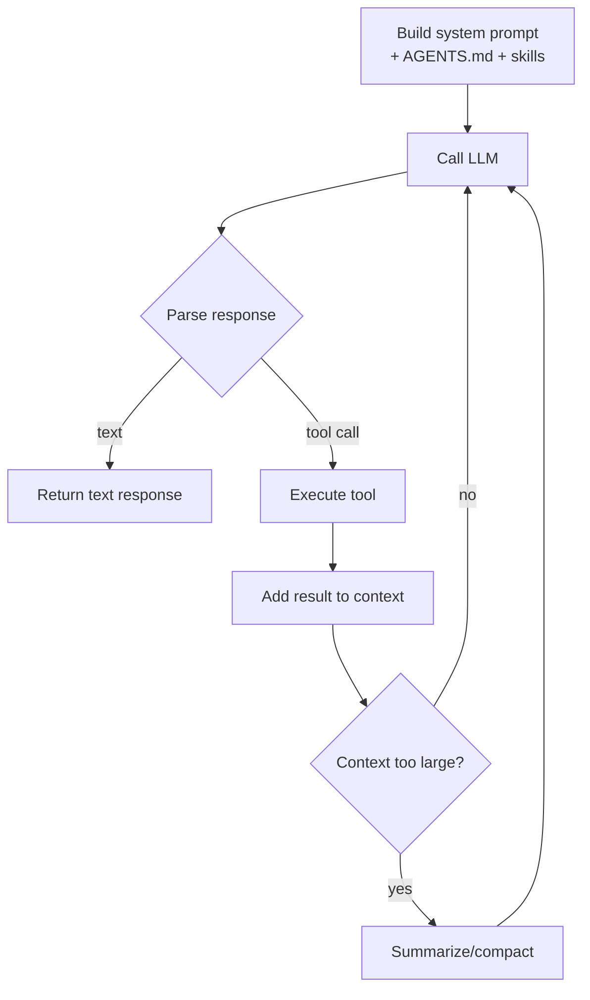

# LangChain -- Agent Harness Anatomy

## Purpose

An agent harness is the scaffolding around the LLM that manages tool calling, context, memory, and execution flow. As models improve, scaffolding shifts rather than disappears. This document covers the anatomy of agent harnesses based on LangChain's deep agents, Claude Code, and other production harnesses.

Source: [The Anatomy of an Agent Harness](https://www.langchain.com/blog/the-anatomy-of-an-agent-harness)
Source: [Your Harness, Your Memory](https://www.langchain.com/blog/your-harness-your-memory)
Source: [How Middleware Lets You Customize Your Agent Harness](https://www.langchain.com/blog/how-middleware-lets-you-customize-your-agent-harness)

## Aha Moments

**Aha: Agent harnesses evolved as models got better, not worse.** Simple chains (2023) → LangGraph (models improved) → agent harnesses (models got much better). Better models don't absorb the harness; they enable more sophisticated harnesses.

**Aha: The harness handles what the model can't be trusted with.** Linting, git operations, CI runs, test execution — these are deterministic nodes interleaved with agent loops. "Putting LLMs into contained boxes" compounds into system-wide reliability.

**Aha: Middleware is the customization hook.** Rather than forking the harness, middleware lets you intercept and modify agent behavior at specific points (before/after tool calls, during context compaction, on response).

## What Is an Agent Harness?

An agent harness wraps the LLM in a loop that:
1. Constructs the system prompt and context
2. Calls the LLM with available tools
3. Executes tool calls
4. Feeds results back to the LLM
5. Repeats until the LLM signals completion



## Deep Agents Harness Architecture

The Deep Agents harness (`create_deep_agent`) consists of:

| Component | Purpose |
|-----------|---------|
| **Model** | LLM provider, model selection |
| **Middleware stack** | Interceptors for tool calls, context, responses |
| **Skills** | Reusable instruction sets (like `SKILL.md`) |
| **Subagents** | Background task delegation |
| **Summarization** | Context compression (automatic + tool-triggered) |
| **Backend** | State persistence (filesystem, memory) |
| **Tools** | MCP tools, custom tools, filesystem tools |

```python
from deepagents import create_deep_agent
from deepagents.middleware.summarization import (
    create_summarization_tool_middleware,
)

agent = create_deep_agent(
    model="anthropic:claude-sonnet-4-6-20250514",
    middleware=[
        create_summarization_tool_middleware(model, backend),
        # custom middleware...
    ],
    skills=["my-skill"],
)
```

## Middleware: The Customization Hook

Middleware intercepts specific lifecycle events:

| Middleware Point | Use Case |
|------------------|----------|
| Before tool call | Add auth, modify arguments, skip tools |
| After tool call | Transform results, log, validate |
| Before LLM call | Inject context, modify system prompt |
| After LLM call | Validate response, add headers |
| On compaction | Custom summarization strategy |

Middleware replaces the need to fork the harness — you intercept behavior at specific points while inheriting the core loop.

## Context Management

### Autonomous Context Compression

Deep Agents added a tool that lets the model trigger its own context compression:

```python
# The model can decide when to compact
# Good times to compact:
# - At clean task boundaries
# - After extracting a result from large context
# - Before consuming a large amount of new context
# - Before entering a complex multi-step process
# - When a decision supersedes prior context
```

The tool retains recent messages (10% of available context) and summarizes what comes before. All conversation history is preserved in the virtual filesystem for recovery.

**Aha: Autonomous compaction follows "the bitter lesson."** Can we give agents more control over their own context to avoid tuning their harness by hand? In practice, agents are conservative about triggering compaction but choose good moments when they do.

### Model Profiles

Deep Agents uses model profiles to compact at 85% of any given model's context limit. This avoids the fixed-threshold problem where compaction happens at a rigid token count regardless of task state.

## Skills: Reusable Instructions

Skills are instructions the agent loads when a task matches the skill description:

```yaml
---
name: docs-code-samples
description: Use this skill when migrating inline code samples from
  LangChain docs (MDX files) into external, testable code files...
---
```

The body contains:
- When to use the skill
- Directory structure and file layout
- Step-by-step instructions
- Commands to run and their order
- Naming, tagging, import conventions

Skills live in `.deepagents/skills/{name}/SKILL.md`. The description in frontmatter tells the agent when to load it.

**Aha: Skills are like instructions to a coworker.** Write them as step-by-step instructions you'd give to a colleague. The agent loads them on demand when a task matches.

## Subagents: Background Delegation

Deep Agents supports running subagents in the background:

```
Main Agent
  │
  ├── Task A → Subagent 1 (background)
  ├── Task B → Subagent 2 (background)
  └── Task C → Main agent continues
       │
       └── Wait for subagents → Combine results
```

Use cases:
- Independent research tasks running in parallel
- Code analysis while the main agent writes
- Testing/validation in the background

**Aha: Subagents enable parallelism without complexity.** The main agent spawns background tasks and continues working. Results are combined when the main agent is ready.

## Harness Engineering: Hill Climbling with Evals

Improving a harness requires systematic evaluation:

1. **Define the eval suite**: Representative tasks covering all harness capabilities
2. **Run the baseline**: Measure current performance
3. **Make a targeted change**: One variable at a time (tool description, system prompt, middleware)
4. **Re-run evals**: Measure delta
5. **Commit or revert**: Only keep changes that improve scores

**Aha: Eval-driven harness tuning beats intuition.** With non-deterministic LLMs, you can't reason about whether a prompt change will help — you have to measure it.

## Harness Comparison: Industry Landscape

| Harness | Lines of Code | Type | Key Feature |
|---------|--------------|------|-------------|
| Claude Code | 512k | Coding agent | Project context files, skills |
| Deep Agents | ~10k | Coding agent | Skills, subagents, MCP |
| Pi | ~15k | General agent | 40+ tools, 10+ platforms |
| OpenClaw | ~20k | General agent | Self-hosted, MCP native |
| Codex (OpenAI) | Unknown | Coding agent | Built-in web search |

Even the makers of the best models invest heavily in harnesses. The harness is where the production value is added.

## Memory: The Harness's Responsibility

The harness manages all levels of memory:

| Memory Type | Managed By | Example |
|------------|------------|---------|
| Short-term | Harness | Messages in conversation, large tool results |
| Long-term | Harness | Cross-session memory, user representations |
| Filesystem | Harness + Agent | AGENTS.md, project context files |
| Tool state | Harness | MCP tool states, connection pools |

**Aha: There are no well-known memory abstractions yet.** The industry is still figuring out memory. Until best practices emerge, separate memory systems don't make sense — memory is the harness's job.

## Key Takeaways

1. **Harnesses are not going away.** Models getting better means different scaffolding, not no scaffolding. Even built-in model features (web search) are just lightweight harnesses behind the API.

2. **Context management is the harness's core job.** Loading, compressing, evicting, and recovering context is where the harness adds the most value.

3. **Middleware > Forking.** Middleware lets you customize behavior without maintaining a fork.

4. **Eval-driven improvement.** You can't improve what you can't measure. Production traces become your eval suite.

[See core principles overview → 00-overview.md](00-overview.md)
[See LangGraph design details → 01-langgraph-design.md](01-langgraph-design.md)
[See observability and evaluation → 03-observability-evaluation.md](03-observability-evaluation.md)
