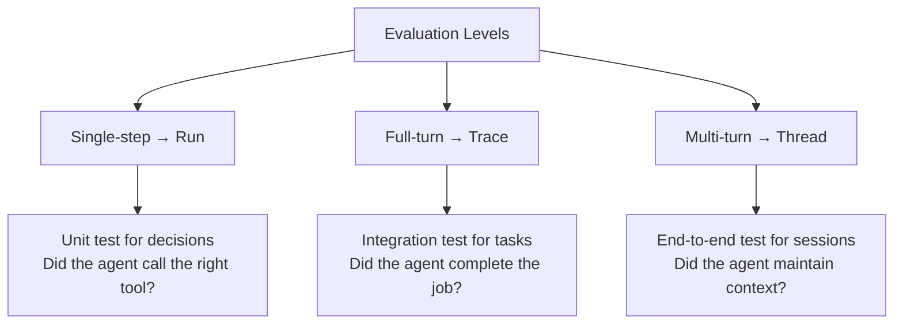
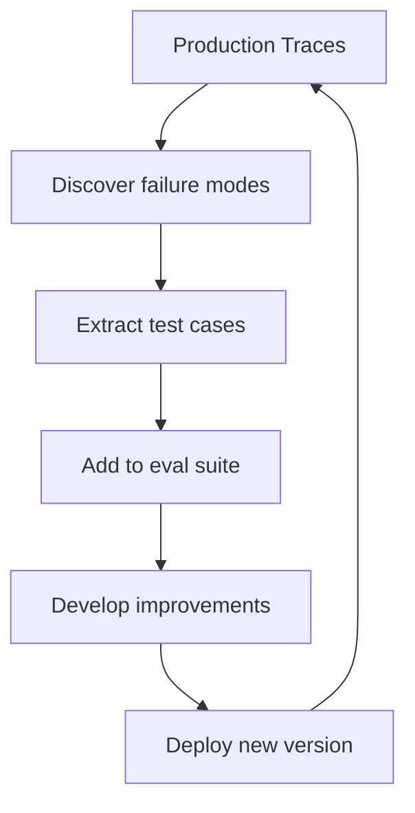

# LangChain -- Agent Observability & Evaluation

## Purpose

You don't know what your agents will do until you actually run them. Agent observability captures non-deterministic reasoning through runs, traces, and threads. These primitives power evaluation, which validates agent reasoning at single-step, full-turn, and multi-turn granularity. This is the foundation of the agent improvement loop.

Source: [Agent Observability Powers Agent Evaluation](https://www.langchain.com/blog/agent-observability-powers-agent-evaluation)
Source: [Agent Engineering: A New Discipline](https://blog.langchain.com/agent-engineering-a-new-discipline/)
Source: [The Agent Evaluation Readiness Checklist](https://www.langchain.com/blog/agent-evaluation-readiness-checklist)

## Aha Moments

**Aha: There's no stack trace when an agent fails.** When an agent takes 200 steps over two minutes and makes a mistake, there's no line of code that failed. What failed was the agent's reasoning. The source of truth shifts from code to traces.

**Aha: Production isn't just where you catch missed bugs — it's where you discover what to test for offline.** Production traces become test cases, and your evaluation suite grows continuously from real-world examples, not just engineered scenarios.

**Aha: Observability and evaluation are inseparable.** Agent behavior only emerges at runtime, captured by observability primitives. To evaluate behavior, you need to evaluate your observability data.

## From Debugging Code to Debugging Reasoning

```mermaid
flowchart LR
    A[Traditional Software] -->|deterministic| B[Code → Logs → Stack Trace]
    C[LLM Apps] -->|single call, fuzzy| D[Prompt → LLM → Response]
    E[Agents] -->|loop, non-deterministic| F[Traces → Reasoning → Behavior]

    style A fill:#2d4a3e
    style C fill:#4a4a2d
    style E fill:#4a2d2d
```



| Dimension | Traditional Software | LLM Apps | Agents |
|-----------|---------------------|----------|--------|
| Determinism | Same input → same output | Fuzzy via natural language | Open-ended reasoning |
| Source of truth | Code | Code + prompts | Traces |
| Debugging | Stack trace, logs | Prompt inspection | Trace analysis |
| Testing | Unit/integration/e2e | Prompt evals, golden tests | Run/trace/thread evals |

## Observability Primitives

### Runs: Single Execution Steps

A run captures one LLM call with its complete context:

- Full prompt (instructions, tools, context)
- LLM output (tool calls, text, reasoning)
- Timing and token counts

```
Run:
├── model: claude-sonnet-4-6
├── input: "Find and fix the bug in auth.py"
├── tools: [read_file, edit_file, run_test]
├── output: tool_call("read_file", "auth.py")
├── tokens: 1247 input, 43 output
└── duration: 1.2s
```

**Uses**: Debugging (what was the agent thinking?) and evaluation (did the agent make the right decision?).

### Traces: Complete Agent Executions

A trace links all runs in a single agent execution:

- All LLM calls (runs) with inputs/outputs
- All tool calls with arguments and results
- Nested structure showing step relationships
- Can reach hundreds of megabytes for complex agents

```
Trace (agent execution):
├── Run 1: "Research the codebase..."
│   └── Tool: grep("session_manager")
├── Run 2: "Now read the file..."
│   └── Tool: read_file("session.py")
├── Run 3: "I need to fix..."
│   └── Tool: edit_file("session.py", changes)
├── Run 4: "Let me verify..."
│   └── Tool: run_test("test_session.py")
└── Result: "Fixed the session timeout bug"
```

**Aha: Agent traces are massive.** A typical distributed trace is a few hundred bytes. Agent traces can reach hundreds of megabytes. This context is necessary for debugging reasoning.

### Threads: Multi-Turn Conversations

A thread groups multiple traces into a session:

- Multi-turn context across interactions
- State evolution (memory, files, artifacts)
- Time spans from minutes to days

**Example**: A coding agent works fine for 10 turns but makes mistakes on turn 11. The turn 11 trace looks reasonable in isolation. The full thread reveals that on turn 6 the agent stored an incorrect assumption in memory, and by turn 11 that bad context compounded.

## Evaluation Granularities

Three evaluation levels map 1:1 to observability primitives:



### Single-Step Evaluation (Runs)

Like a unit test for agent reasoning:

```python
# Set up a specific state
state = {
    "messages": [{"role": "user", "content": "Schedule meeting with Alice at 3pm"}],
    "available_tools": ["create_calendar_event", "send_email", "check_availability"],
}

# Run agent for one step
result = agent.invoke(state, max_steps=1)

# Assert the decision
assert result["tool_calls"][0]["name"] == "check_availability"
```

**Use when**: Testing tool selection, argument correctness, response format.

### Full-Turn Evaluation (Traces)

Tests end-to-end task execution:

| Criterion | How to Evaluate |
|-----------|----------------|
| Task completion | Did the agent achieve the goal? |
| Tool usage | Did it use the right tools in the right order? |
| Error handling | Did it recover from tool failures? |
| Efficiency | Did it avoid unnecessary steps? |

### Multi-Turn Evaluation (Threads)

Tests context maintenance across interactions:

| Criterion | How to Evaluate |
|-----------|----------------|
| Context retention | Does the agent remember earlier decisions? |
| State consistency | Are file changes, memory updates preserved? |
| Behavior drift | Does the agent's behavior degrade over turns? |

## Production as Primary Teacher



**Aha: You can't anticipate how users will phrase requests.** Because every natural language input is unique, production traces reveal failure modes you couldn't predict and help you understand what "correct behavior" actually looks like.

## Agent Evaluation Readiness Checklist

Before deploying an agent to production:

- [ ] **Tracing is wired up**: Every agent execution is captured as a trace
- [ ] **Baseline evals exist**: At least one eval suite for the primary use case
- [ ] **Production traces are reviewed**: Someone looks at traces to find failure modes
- [ ] **Failure modes are documented**: Known edge cases and how the agent handles them
- [ ] **Human-in-the-loop is defined**: What requires human approval?
- [ ] **Escalation path exists**: What happens when the agent can't complete a task?

## Continual Learning: The Agent Improvement Loop

Agent engineering is iterative:

1. **Build**: Define agent with tools, prompts, harness
2. **Run**: Execute in development and production
3. **Trace**: Capture all executions as traces
4. **Evaluate**: Score traces against criteria
5. **Learn**: Identify patterns in failures
6. **Improve**: Modify prompts, tools, harness
7. **Repeat**: Go to step 2

**Aha: The loop never stops.** Agents are non-deterministic systems operating on open-ended inputs. Continuous evaluation and improvement is the only path to reliability.

## Traces Power Everything

```
┌─────────────────────────────────────┐
│           Production Traces          │
├──────────────┬──────────┬───────────┤
│   Debugging  │ Evals    │ Evals     │
│   (manual)   │ (auto)   │ (LLM)     │
├──────────────┼──────────┼───────────┤
│ Find the bug │ Score    │ LLM judges│
│ in a trace   │ against  │ quality   │
│              │ criteria │           │
└──────────────┴──────────┴───────────┘
       │              │           │
       ▼              ▼           ▼
  Fix harness    Update eval   Curate test
  or prompts     thresholds    cases
```

## Key Takeaways

1. **Agent observability ≠ software observability.** Traditional traces capture service calls. Agent traces capture reasoning context — which tools, which arguments, which decisions.

2. **Evaluation happens at three levels.** Single-step (unit), full-turn (integration), multi-turn (end-to-end). Each maps to an observability primitive.

3. **Production is the primary teacher.** You discover failure modes from real usage, not engineered scenarios. Traces become test cases.

4. **Observability and evaluation are inseparable.** You can't evaluate what you can't observe. Traces are the foundation of both debugging and evaluation.

[See core principles overview → 00-overview.md](00-overview.md)
[See agent harness patterns → 02-agent-harness.md](02-agent-harness.md)
[See production deployment → 04-production-agents.md](04-production-agents.md)
