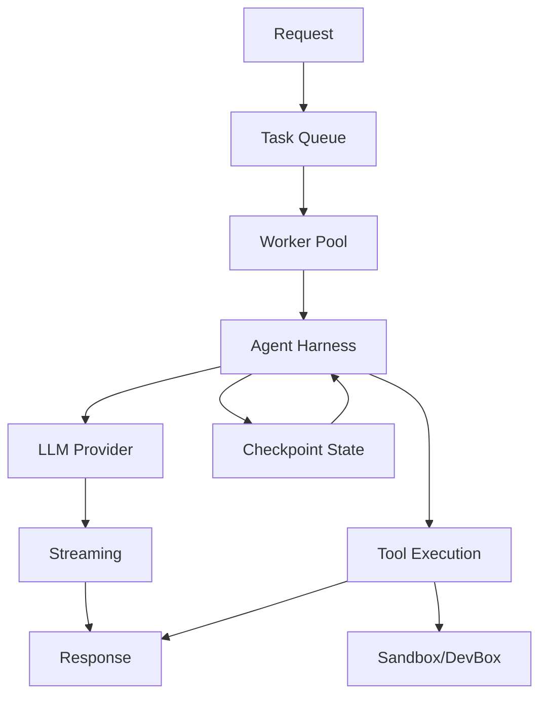
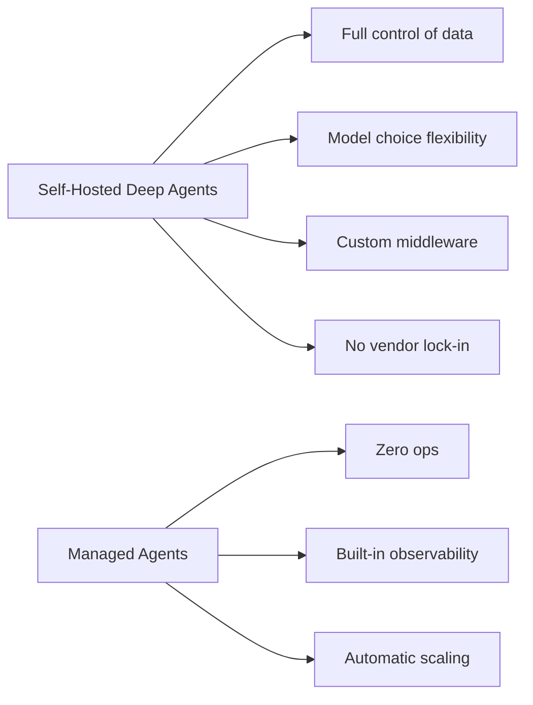
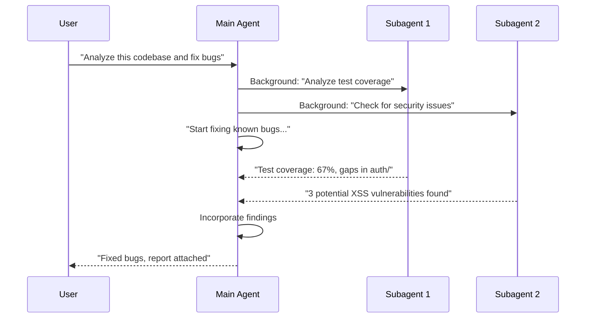

# LangChain -- Production Deep Agents

## Purpose

Deep agents are long-running agents that handle complex, multi-step tasks. This document covers the runtime architecture, deployment patterns, context management, and security considerations for production deep agents.

Source: [The Runtime Behind Production Deep Agents](https://www.langchain.com/blog/runtime-behind-production-deep-agents)
Source: [Running Subagents in the Background](https://www.langchain.com/blog/running-subagents-in-the-background)
Source: [Context Management for Deep Agents](https://www.langchain.com/blog/context-management-for-deepagents/)
Source: [Secure Agents with Cisco AI Defense](https://www.langchain.com/blog/secure-agents-cisco-ai-defense)

## Aha Moments

**Aha: The runtime is the hidden cost driver.** How the runtime schedules LLM calls, manages context, and handles failures determines whether an agent scales to 100 concurrent users or falls over at 10.

**Aha: Two sandbox connection patterns dominate.** Agents connect to sandboxes either through a "sidecar" (agent runs alongside the sandbox) or "remote" (agent calls into the sandbox via network). Each has different security and latency tradeoffs.

**Aha: Two types of agent authorization exist.** "On-behalf-of" (agent acts as the user) and "Claw" (agent has its own fixed credentials). OpenClaw made the Claw pattern mainstream.

## Runtime Architecture

The deep agents runtime handles:



### Key Runtime Components

| Component | Purpose | Design Decision |
|-----------|---------|-----------------|
| **Task Queue** | Decouple execution from trigger | Eliminates request timeouts |
| **Worker Pool** | Scale concurrent agents | Configurable max_workers |
| **Harness Loop** | LLM → tool → LLM cycle | Pregel algorithm for determinism |
| **Context Manager** | Window management, summarization | Model profiles at 85% threshold |
| **Checkpoint Store** | State persistence | Pluggable (memory, sqlite, postgres) |
| **Streaming Engine** | Real-time output delivery | Token-level, action-level, node-level |

## Deployment: Open Alternative to Managed Agents

LangGraph's deep agents can be deployed as an open alternative to Claude Managed Agents:



| Dimension | Self-Hosted | Managed |
|-----------|------------|---------|
| Data control | Full | Vendor-dependent |
| Model choice | Any provider | Vendor's models |
| Customization | Full (middleware, skills) | Limited to API params |
| Operations | You run it | Vendor runs it |
| Cost | Infrastructure + compute | Per-usage pricing |
| Lock-in | None | High (memory, state) |

## Context Management

### The Context Problem

Deep agents accumulate context over long runs:

- Conversation history (messages)
- File contents (read files)
- Tool results (search results, code analysis)
- System instructions (skills, AGENTS.md)

This grows until it exceeds the context window, causing **context rot** — older information degrades the model's ability to use recent information effectively.

### Compression Strategies

| Strategy | When | Retention |
|----------|------|-----------|
| **Automatic at threshold** | Context hits 85% of limit | Recent 10% kept, rest summarized |
| **Tool-triggered** | Agent calls compact tool | Agent decides what's recent |
| **User-triggered** | User runs `/compact` | Recent 10% kept, rest summarized |

**What gets preserved:**
- All conversation history in virtual filesystem (recoverable)
- Recent messages (10% of context window)
- Tool call results needed for current task

**What gets summarized:**
- Older conversation turns
- Intermediate reasoning steps
- File contents that were read but not modified

### When to Compact

Good times to compact:
- At clean task boundaries (finished one task, starting another)
- After extracting a result from large context (research done, conclusion reached)
- Before consuming large new context (about to read many files)
- Before complex multi-step processes (starting a refactor)
- When decisions supersede prior context (new requirements invalidate old context)

**Aha: Agents are conservative about compaction but choose good moments when they do.** This suggests autonomous compaction is viable — agents can identify opportune times better than fixed thresholds.

## Subagents: Background Execution

Deep agents can spawn subagents that run in the background:



Use cases:
- **Parallel research**: Multiple independent analysis tasks
- **Validation**: Testing changes while the main agent continues working
- **Monitoring**: Background processes watching for conditions

## Security: Two Types of Agent Authorization

### On-Behalf-Of (Assistants)

The agent acts as the end user with their credentials:

```
Alice → Onboarding Agent → (Alice's Slack creds, Alice's Notion creds)
Bob   → Onboarding Agent → (Bob's Slack creds, Bob's Notion creds)
```

Requires: User identification, credential mapping at runtime.

### Fixed Credentials (Claws)

The agent has its own dedicated credentials:

```
Anyone → Email Agent → (Agent's dedicated Gmail account)
Anyone → Product Agent → (Agent's dedicated Notion account)
```

Requires: Dedicated service accounts, human-in-the-loop for sensitive actions.

**Aha: OpenClaw made the Claw pattern mainstream.** Before OpenClaw, most people thought of agents as acting on-behalf-of users. OpenClaw showed that user-created agents with fixed credentials are a major pattern.

### Security Controls

| Control | Purpose | Implementation |
|---------|---------|----------------|
| **Sandboxing** | Limit blast radius | Isolated devboxes, no prod access |
| **Tool curation** | Limit capabilities | Subset of MCP tools per agent |
| **Human-in-the-loop** | Gate sensitive actions | Approval gates before destructive ops |
| **Cisco AI Defense** | Policy enforcement | Guardrails for tool access, data exfiltration |

## The Two Sandbox Patterns

Agents connect to isolated environments in two ways:

| Pattern | Description | Pros | Cons |
|---------|-------------|------|------|
| **Sidecar** | Agent runs inside/alongside the sandbox | Low latency, full access | Tight coupling |
| **Remote** | Agent calls into sandbox via network | Loose coupling, multi-tenant | Higher latency, network dependency |

Most coding agents use sidecar (agent runs on the devbox). Most general agents use remote (agent calls tools via MCP).

## Key Takeaways

1. **The runtime is the scaling bottleneck.** How the runtime manages concurrency, context, and failures determines whether agents work in production.

2. **Context management is the hardest problem in long-running agents.** Autonomous compaction gives the model control over its own working memory.

3. **Authorization type matters.** On-behalf-of vs. fixed credentials determines the agent's security model and user experience.

4. **Self-hosted is viable.** Deep agents provide an open alternative to managed agent services with full control over data, models, and customization.

[See core principles overview → 00-overview.md](00-overview.md)
[See observability and evaluation → 03-observability-evaluation.md](03-observability-evaluation.md)
[See agent harness patterns → 02-agent-harness.md](02-agent-harness.md)
