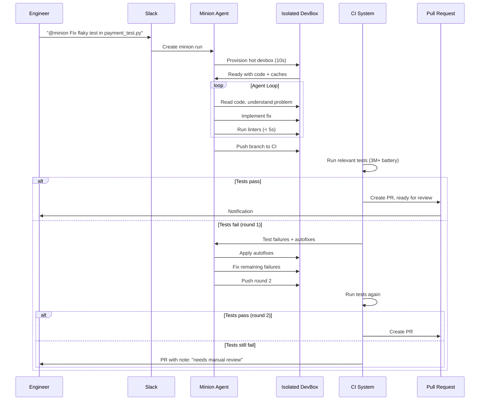
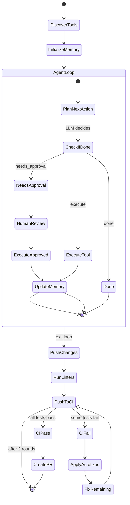

# Stripe Minions -- One-Shot Coding Agents

## Purpose

Minions are Stripe's unattended coding agents. A typical minion run starts in Slack and ends in a pull request ready for review — with zero human interaction in between. Over 1,300 PRs merged per week are minion-produced with no human-written code. This document covers the architecture, blueprint orchestration, and developer experience.

Source: [Stripe Minions Part 1](https://stripe.dev/blog/minions-stripes-one-shot-end-to-end-coding-agents)
Source: [Stripe Minions Part 2](https://stripe.dev/blog/minions-stripes-one-shot-end-to-end-coding-agents-part-2)

## Aha Moments

**Aha: What's good for human developers is good for agents.** Stripe built devboxes, linting, caching, and CI for humans first. Minions use the exact same infrastructure. This is why "what's good for humans is good for agents."

**Aha: Blueprints interleave deterministic code with agent loops.** Rather than letting the agent decide everything, blueprints define a state machine where some nodes are deterministic (linters, git push) and some are agent-driven (implement task, fix CI). "Putting LLMs into contained boxes" compounds into system-wide reliability.

**Aha: One or two CI rounds, then done.** There are diminishing marginal returns for an LLM running against many rounds of full CI. After two pushes and CI runs, the branch goes to human review.

## Developer Experience



### Entry Points

| Entry Point | Use Case |
|------------|----------|
| **Slack** | `@minion` in a thread discussing a change |
| **CLI** | Direct terminal invocation |
| **Web UI** | Management interface for minion runs |
| **Internal platforms** | Docs, feature flags, ticketing UI |
| **Automated tickets** | CI detects flaky test → auto-creates minion ticket |

### The End Result

- Minion creates a branch, pushes to CI, prepares a PR
- Engineer opens the PR, requests review
- If changes needed: give further instructions, minion pushes updated code
- North Star: PR with no human-written code

## Architecture

```mermaid
flowchart TD
    SLACK[Slack/CLI/Web UI] --> ORCH[Orchestrator]
    ORCH --> POOL[DevBox Pool\n"Hot and Ready"]
    POOL --> DEVBOX[Isolated DevBox\n10s provision]

    DEVBOX --> BP[Blueprint State Machine]

    BP --> AGENT_NODE[Agent Node\n"Implement task"]
    BP --> DET_NODE[Deterministic Node\n"Run linters"]
    BP --> GIT_NODE[Git Node\n"Push changes"]

    AGENT_NODE --> MCP[MCP: Toolshed\n~500 tools]
    AGENT_NODE --> RULES[Rule Files\nAGENTS.md etc.]

    DET_NODE --> LINT[Pre-push linters\n< 5s]
    GIT_NODE --> CI[CI: 3M+ tests]
    CI --> AUTO[Autofixes]
    AUTO --> BP

    BP --> PR[Pull Request\nReady for review]
```

## DevBoxes: Parallel, Predictable, Isolated

A Stripe devbox is an AWS EC2 instance with:
- Source code pre-cloned
- Bazel and type-checking caches warmed
- Code generation services running
- Services under development ready to start

**Hot and ready: 10-second provisioning.** A pool of pre-warmed devboxes means spinning one up takes 10 seconds, not minutes.

### Why Devboxes for Agents?

| Property | Why It Matters for Agents |
|----------|--------------------------|
| **Parallelism** | Many minions can work simultaneously without interference |
| **Predictability** | Clean environments eliminate "works on my machine" token waste |
| **Isolation** | Safe for autonomous operation — no confirmation prompts needed |
| **Security** | QA environment, no prod access, no network egress |

**Aha: Devboxes were built for humans, not agents.** Stripe invested in parallel, predictable, isolated developer environments. What's good for humans turned out to be exactly what agents need.

## The Agent Harness

Minions use a fork of Block's [goose](https://github.com/block/goose), customized for unattended operation:

| Feature | Human-Supervised Tools | Minions (Unattended) |
|---------|----------------------|---------------------|
| Interruptibility | Yes | No |
| Confirmation prompts | Yes | No (safe in devbox) |
| Human-triggered commands | Yes | No |
| Full permissions | Restricted | Yes (isolated devbox) |

**Aha: No confirmation prompts needed.** Because the devbox is quarantined, any mistakes are confined to its blast radius. Minions run with full permissions safely.

## Blueprints: The Key Innovation

Blueprints are workflows that combine deterministic code and agent loops:



### Blueprint Node Types

| Node Type | What It Does | Example |
|-----------|-------------|---------|
| **Agent node** | LLM loop with tools, makes its own decisions | "Implement task", "Fix CI failures" |
| **Deterministic node** | Runs code, no LLM involved | "Run configured linters", "Push changes" |

**Aha: Deterministic nodes save tokens and increase reliability.** Always linting changes at the end of a run is a small decision we can anticipate. Writing code for it saves tokens and eliminates a failure mode.

### Blueprint Design Principles

1. **Put LLMs in contained boxes.** Each agent node has a narrow scope and specific inputs.
2. **Deterministic for what you can anticipate.** Linting, git operations, test execution — these don't need an LLM.
3. **Agent flexibility for what you can't.** Implementation, debugging, CI fixup — these need LLM reasoning.

## Context Gathering: Rule Files

Due to Stripe's repository size, rule files are scoped to subdirectories, not global:

```
repo/
├── AGENTS.md          # Global rules (minimal, to avoid context bloat)
├── payments/
│   └── AGENTS.md      # Payment-specific conventions
├── frontend/
│   └── .cursorrules   # Frontend patterns (Cursor format)
└── infra/
    └── AGENTS.md      # Infrastructure patterns
```

Standardized on Cursor's rule format, synced to also work with Claude Code:

| Agent | Rule Format |
|-------|------------|
| Minions | `.cursorrules`, `AGENTS.md` |
| Cursor | `.cursorrules` |
| Claude Code | `CLAUDE.md` (synced from `.cursorrules`) |

**Aha: One source of truth for all agents.** Stripe syncs rule files so all three coding agents benefit from the same guidance.

## Context Gathering: MCP + Toolshed

Stripe built a centralized MCP server called **Toolshed** with ~500 tools:

- Internal documentation
- Ticket details
- Build statuses
- Code intelligence (Sourcegraph)
- SaaS platforms

Minions receive a curated subset of Toolshed tools. Different agents get different tool sets — "agents perform best with a smaller box."

## Feedback Loop: Shift Left

```
Fastest feedback ← IDE / Pre-push hooks (< 5s)
                  ↑
               Local lint / typecheck
                  ↑
               CI tests (selective)
                  ↑
Slowest feedback ← Full CI battery (minutes)
```

The minion blueprint follows this pattern:

1. **Pre-push linters** (< 5s): Background daemon precomputes heuristics, caches results
2. **CI tests** (one iteration): Selective tests, autofixes auto-applied
3. **Second CI round** (if needed): Minion fixes remaining failures, pushes again
4. **Human review**: After two CI rounds, branch goes to manual scrutiny

**Aha: Two CI rounds max.** CI runs cost tokens, compute, and time. Diminishing marginal returns after two full CI loops.

## Key Takeaways

1. **Infrastructure investment pays agent dividends.** Stripe's years of developer productivity investment (devboxes, caching, linting, CI) became the perfect foundation for agents.

2. **Blueprints are the key innovation.** Interleaving deterministic nodes with agent nodes gives the reliability of workflows with the flexibility of agents.

3. **MCP is the capability layer.** Toolshed's ~500 tools make capabilities instantly available to all agents, not just minions.

4. **What's good for humans is good for agents.** Devboxes, rule files, pre-push hooks, CI — all built for humans first, repurposed for agents.

[See Conductor production architecture → ../conductor/00-production-agent-architecture.md](../conductor/00-production-agent-architecture.md)
[See LangGraph design → ../langchain/01-langgraph-design.md](../langchain/01-langgraph-design.md)
