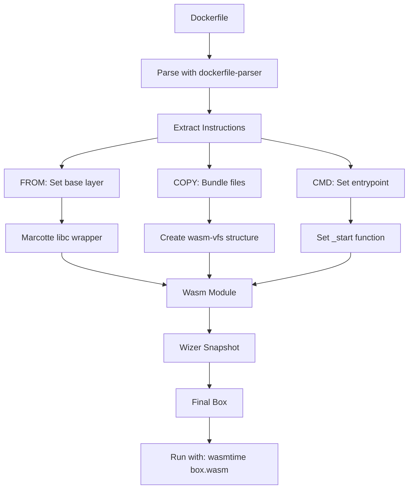

# Zero to Boxer Engineer: First Principles

## Executive Summary

This guide takes you from zero knowledge of boxing/WebAssembly to understanding the core concepts that make Boxer work. We cover:

1. **What is "boxing"?** - The concept from Rust and beyond
2. **Type erasure** - Hiding concrete types behind interfaces
3. **WebAssembly fundamentals** - The Wasm execution model
4. **Container vs. Box** - Why Wasm boxes are different
5. **Zero-cost abstractions** - Rust's performance guarantee

---

## 1. What is Boxing?

### The Rust `Box` Type

In Rust, `Box<T>` is a **smart pointer** that allocates values on the heap:

```rust
// Stack allocation (default)
let value: i32 = 42;  // Stored on stack

// Heap allocation with Box
let boxed: Box<i32> = Box::new(42);  // Stored on heap
```

**Why box values?**

| Reason | Example |
|--------|---------|
| **Unknown size at compile time** | Recursive types, trait objects |
| **Transfer ownership** | Move heap data without copying |
| **Reduce stack size** | Large data structures |
| **Type erasure** | `Box<dyn Trait>` |

### Boxing in Boxer (Cloud Context)

In **Boxer** (the framework), "boxing" means **packaging applications into Wasm containers**:

```
Traditional Container:           Wasm Box:
┌────────────────────────┐      ┌────────────────────────┐
│ Application            │      │ Application            │
│ + libc + deps          │      │ + minimal libc         │
│ + full OS layer        │      │ + virtualized FS       │
│ (100MB - 1GB)          │      │ (100KB - 10MB)         │
└────────────────────────┘      └────────────────────────┘
```

**Key insight:** Boxing an application means **abstracting away the underlying OS** and providing a **portable execution environment**.

---

## 2. Type Erasure and Trait Objects

### What is Type Erasure?

**Type erasure** is the technique of hiding a concrete type behind an abstract interface.

```rust
// Without type erasure - concrete types
fn process_string(s: String) { ... }
fn process_vec(v: Vec<i32>) { ... }
fn process_hashmap(h: HashMap<String, i32>) { ... }

// With type erasure - trait object
fn process_any<T: std::fmt::Display>(value: T) { ... }

// Or with dynamic dispatch
fn process_boxed(value: Box<dyn std::fmt::Display>) { ... }
```

### Trait Objects in Rust

A **trait object** is Rust's primary mechanism for type erasure:

```rust
// Define a trait
trait Animal {
    fn speak(&self) -> &str;
}

// Implement for concrete types
struct Dog;
impl Animal for Dog {
    fn speak(&self) -> &str { "Woof!" }
}

struct Cat;
impl Animal for Cat {
    fn speak(&self) -> &str { "Meow!" }
}

// Type erasure with Box<dyn Trait>
let animals: Vec<Box<dyn Animal>> = vec![
    Box::new(Dog),
    Box::new(Cat),
];

// All items have the same type: Box<dyn Animal>
// But different underlying concrete types
for animal in &animals {
    println!("{}", animal.speak());
}
```

### How Boxer Uses Type Erasure

Boxer uses type erasure to **abstract filesystem operations**:

```rust
// In wasm-vfs, FileSystem abstracts all file operations
pub trait FileSystemOps {
    fn open(&mut self, path: &Path) -> Result<FileDescriptor>;
    fn read(&mut self, fd: FileDescriptor) -> Result<Vec<u8>>;
    fn write(&mut self, fd: FileDescriptor, data: &[u8]) -> Result<()>;
}

// In-memory implementation
pub struct InMemoryFS { ... }
impl FileSystemOps for InMemoryFS { ... }

// Could have other implementations:
// - PersistentFS (backed by disk)
// - NetworkFS (backed by remote storage)
// - SnapshotFS (read-only snapshot)

// Type-erased usage
fn run_app(fs: Box<dyn FileSystemOps>) {
    // App code works with any filesystem implementation
}
```

---

## 3. WebAssembly Fundamentals

### What is WebAssembly?

**WebAssembly (Wasm)** is a binary instruction format for a stack-based virtual machine.

```
High-level code:           Wasm binary (simplified):
fn add(a: i32, b: i32) -> i32 {
    a + b
}

// Text format (WAT):
(func $add (param $a i32) (param $b i32) (result i32)
  local.get $a
  local.get $b
  i32.add
)
```

### Wasm Execution Model


### Wasm Memory Model

Wasm uses a **linear memory** model:

```
Wasm Memory (linear address space):
0x0000 ┌─────────────────┐
       │ Stack           │
       │ (grows down)    │
       ├─────────────────┤
       │ Free space      │
       ├─────────────────┤
       │ Heap            │
       │ (grows up)      │
       └─────────────────┘ 0xFFFF
```

**Key properties:**
- **Isolated:** Wasm module cannot access memory outside its linear memory
- **Explicit:** All data passed to/from Wasm uses memory offsets
- **Safe:** Runtime validates all memory accesses

### Imports and Exports

Wasm modules communicate with the host via **imports** and **exports**:

```rust
// Wasm module EXPORTS (host can call):
#[no_mangle]
pub extern "C" fn _start() -> i32 {
    42  // Return value
}

// Wasm module IMPORTS (calls host):
extern "C" {
    fn wasm_vfs_open(path_ptr: *const u8, path_len: u32) -> i32;
    fn wasm_vfs_read(fd: i32, buf_ptr: *mut u8, buf_len: u32) -> i32;
}

pub fn read_file(path: &str) -> Vec<u8> {
    unsafe {
        let fd = wasm_vfs_open(path.as_ptr(), path.len() as u32);
        // ... read using fd
    }
}
```

---

## 4. Container vs. Box

### Traditional Container Architecture

```
┌─────────────────────────────────────────┐
│ Container Runtime (Docker, containerd)  │
├─────────────────────────────────────────┤
│ Container 1         │ Container 2       │
│ ┌─────────────────┐ │ ┌─────────────────┐│
│ │ Application     │ │ │ Application     ││
│ │ + libc          │ │ │ + libc          ││
│ │ + deps          │ │ │ + deps          ││
│ ├─────────────────┤ │ ├─────────────────┤│
│ │ Root FS (ext4)  │ │ │ Root FS (ext4)  ││
│ │ /bin, /lib, /usr│ │ │ /bin, /lib, /usr││
│ └─────────────────┘ │ └─────────────────┘│
├─────────────────────────────────────────┤
│ Linux Kernel (shared)                   │
│ - Namespace isolation                   │
│ - cgroups resource limits               │
│ - seccomp security profiles             │
└─────────────────────────────────────────┘
```

**Characteristics:**
- **OS-dependent:** Requires Linux kernel
- **Large:** Full root filesystem (100MB+)
- **Slow startup:** Mount filesystem, initialize namespaces
- **Security:** Kernel-level isolation (can be bypassed)

### Wasm Box Architecture

```
┌─────────────────────────────────────────┐
│ Wasm Runtime (Wasmtime, WasmEdge)       │
├─────────────────────────────────────────┤
│ Box 1               │ Box 2             │
│ ┌─────────────────┐ │ ┌─────────────────┐│
│ │ Application     │ │ │ Application     ││
│ │ Wasm binary     │ │ │ Wasm binary     ││
│ ├─────────────────┤ │ ├─────────────────┤│
│ │ wasm-vfs        │ │ │ wasm-vfs        ││
│ │ (in-memory)     │ │ │ (in-memory)     ││
│ └─────────────────┘ │ └─────────────────┘│
├─────────────────────────────────────────┤
│ WASI Layer (standard interface)         │
│ - Filesystem access                     │
│ - Network access                        │
│ - Environment variables                 │
├─────────────────────────────────────────┤
│ Host OS (Linux, macOS, Windows, browser)│
└─────────────────────────────────────────┘
```

**Characteristics:**
- **OS-independent:** Runs anywhere with Wasm runtime
- **Small:** Binary + VFS (100KB - 10MB)
- **Fast startup:** Memory-mapped, instant initialization
- **Security:** Sandbox isolation (cannot escape)

### Comparison Table

| Aspect | Container | Wasm Box |
|--------|-----------|----------|
| **Startup Time** | 100ms - 1s | 1ms - 50ms |
| **Size** | 100MB - 1GB | 100KB - 10MB |
| **Isolation** | Kernel namespaces | Memory sandbox |
| **Portability** | Linux-only (mostly) | Anywhere (Linux, macOS, Windows, browser) |
| **Security** | Shared kernel | Complete isolation |
| **Memory Overhead** | 10-100MB | 100KB - 10MB |
| **Ecosystem** | Docker, Kubernetes | Emerging (Wasm Cloud, Krustlet) |

---

## 5. Zero-Cost Abstractions in Rust

### What are Zero-Cost Abstractions?

**Zero-cost abstraction** means you pay no runtime penalty for using high-level features.

```rust
// High-level: Iterator chain
let sum: i32 = (1..100)
    .filter(|x| x % 2 == 0)
    .map(|x| x * x)
    .sum();

// Compiles to same machine code as:
let mut sum = 0;
for i in 1..100 {
    if i % 2 == 0 {
        sum += i * i;
    }
}
```

### How Boxer Uses Zero-Cost Abstractions

#### 1. Custom HashMap (no std)

```rust
// wasm-vfs uses a custom HashMap that works without std
pub struct HashMap<K, V, const CAP: usize> {
    entries: Vec<Option<(K, V)>>,
}

// Linear search - simple but predictable
pub fn get(&self, key: &K) -> Option<&V> {
    for slot in &self.entries {
        if let Some((ref stored_k, ref stored_v)) = slot {
            if *stored_k == *key {
                return Some(stored_v);
            }
        }
    }
    None
}

// No heap allocation for the map structure itself
// Capacity is known at compile time
```

#### 2. PathBuf without std::path

```rust
// Custom PathBuf for WASM (no std dependency)
pub struct PathBuf {
    inner: String,
}

impl PathBuf {
    pub fn join(&self, other: &PathBuf) -> PathBuf {
        if other.is_absolute() {
            other.clone()
        } else {
            let mut joined = self.inner.clone();
            if !joined.ends_with('/') && !joined.is_empty() {
                joined.push('/');
            }
            joined.push_str(&other.inner);
            PathBuf { inner: joined }
        }
    }
}
```

#### 3. Spinlock Mutex (no OS threads)

```rust
// Spinlock for WASM (no OS mutex dependency)
pub struct Mutex<T> {
    locked: AtomicBool,
    data: UnsafeCell<T>,
}

pub fn lock(&self) -> MutexGuard<'_, T> {
    while self.locked
        .compare_exchange_weak(false, true, Ordering::Acquire, Ordering::Relaxed)
        != Ok(false)
    {
        // Spin - no OS blocking
    }
    MutexGuard { mutex: self }
}
```

---

## 6. The Boxing Workflow

### From Dockerfile to Wasm Box



### Step-by-Step Example

**1. Create Dockerfile:**

```dockerfile
FROM scratch
COPY hello.wasm /hello
CMD ["/hello"]
```

**2. Build with Boxer:**

```bash
box build -f Dockerfile
```

**3. Boxer CLI processes:**

```rust
// Simplified boxer main.rs logic
fn main() {
    let dockerfile = parse_dockerfile("Dockerfile");

    for instruction in dockerfile.instructions {
        match instruction {
            Instruction::From(base) => {
                // Set base WASM module (from Marcotte)
                builder.config_base(&base);
            }
            Instruction::Copy { src, dest } => {
                // Read files and bundle into VFS
                let content = fs::read(src);
                builder.bundle_file(dest, content);
            }
            Instruction::Cmd(cmd) => {
                // Set entrypoint
                builder.set_entrypoint(&cmd);
            }
        }
    }

    // Finalize: bundle VFS, snapshot with Wizer
    builder.build();
}
```

**4. Run the box:**

```bash
wasmtime output.wasm
# Output: Hello from Wasm Box!
```

---

## 7. Key Concepts Summary

### Boxing Fundamentals

| Concept | Description | Example |
|---------|-------------|---------|
| **Box (Rust)** | Heap-allocated smart pointer | `Box<T>` |
| **Box (Boxer)** | Wasm-based deployment unit | `my-app.wasm` |
| **Type Erasure** | Hide concrete type behind trait | `Box<dyn Trait>` |
| **Trait Object** | Runtime-dispatched interface | `dyn FileSystem` |
| **Zero-Cost** | No runtime overhead | Iterator chains |

### WASM Fundamentals

| Concept | Description | Example |
|---------|-------------|---------|
| **Linear Memory** | Flat address space | `memory[0..N]` |
| **Imports** | Host functions called by Wasm | `wasm_vfs_open()` |
| **Exports** | Wasm functions called by host | `_start()` |
| **Validation** | Security checks before execution | Type checking |
| **Instantiation** | Link imports, allocate memory | `Instance::new()` |

### Container vs. Box

| Aspect | Container | Box |
|--------|-----------|-----|
| Isolation | Kernel namespaces | Memory sandbox |
| Size | 100MB+ | 100KB+ |
| Startup | 100ms+ | 1ms+ |
| Portability | Linux | Anywhere |

---

## 8. Your First Box

### Prerequisites

```bash
# Install Rust
curl --proto '=https' --tlsv1.2 -sSf https://sh.rustup.rs | sh

# Install wasm32-wasi target
rustup target add wasm32-wasi

# Clone boxer
git clone https://github.com/dphilla/boxer
cd boxer/boxer/box
```

### Build a Simple Box

**1. Create C source:**

```c
// hello.c
#include <stdio.h>

int main() {
    printf("Hello from Box!\n");
    return 0;
}
```

**2. Compile with Boxer:**

```bash
cargo run -- compile hello.c
```

**3. Run the result:**

```bash
wasmtime output.wasm
```

---

## 9. Next Steps

After mastering these fundamentals:

1. **[Boxing Patterns Deep Dive](01-boxing-patterns-deep-dive.md)** - Type boxing, value wrappers
2. **[WASM Compatibility Deep Dive](02-wasm-compatibility-deep-dive.md)** - WASM integration patterns
3. **[Performance Deep Dive](03-performance-deep-dive.md)** - Zero-cost abstractions, optimizations

---

## Document History

| Date | Change |
|------|--------|
| 2026-03-27 | Initial creation from first principles |

---

*This document is a living textbook. Work through examples as you read.*
