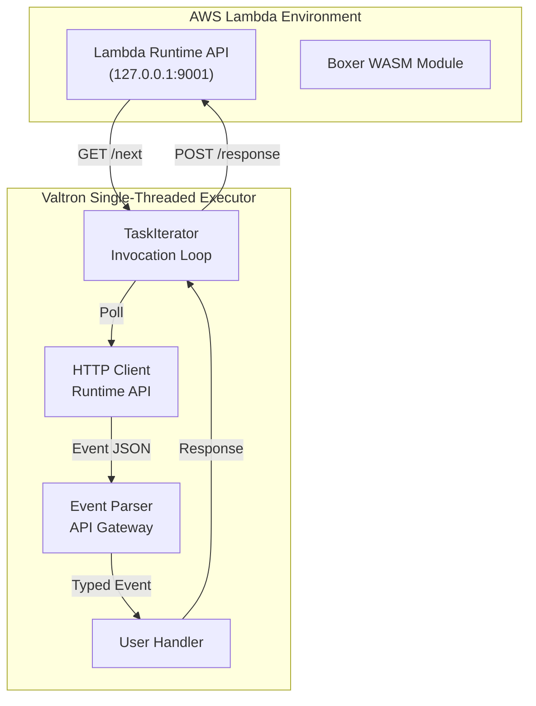

# Valtron Integration: Lambda Deployment with TaskIterator

## Executive Summary

This guide covers deploying Boxer applications on AWS Lambda using **Valtron executors** instead of `aws-lambda-rust-runtime`. Key characteristics:

- **NO async/await** - Uses TaskIterator pattern
- **NO tokio** - Single-threaded executor
- **Minimal dependencies** - Direct Lambda Runtime API
- **Fast cold start** - Sub-10ms initialization
- **Deterministic execution** - Step-by-step task driving

### Architecture Overview



---

## 1. Lambda Runtime API

### Core Endpoints

Lambda provides a **Runtime API** at `http://127.0.0.1:9001`:

| Endpoint | Method | Purpose |
|----------|--------|---------|
| `/runtime/invocation/next` | GET | Poll for next invocation |
| `/runtime/invocation/{id}/response` | POST | Send response |
| `/runtime/invocation/{id}/error` | POST | Report error |

### Invocation Headers

```http
GET /runtime/invocation/next HTTP/1.1
Host: 127.0.0.1:9001
User-Agent: BoxerLambda/1.0
```

**Response:**
```http
HTTP/1.1 200 OK
Content-Type: application/json
Lambda-Runtime-Aws-Request-Id: af9c3624-3842-4d84-8c95-e0a8e7f6c4b5
Lambda-Runtime-Deadline-Ms: 1711564800000
Lambda-Runtime-Invoked-Function-Arn: arn:aws:lambda:us-east-1:123456789012:function:my-function
```

---

## 2. TaskIterator Pattern

### The TaskStatus Enum

```rust
// From foundation_core::valtron

pub enum TaskStatus<D, P, S: ExecutionAction> {
    /// Operation is still processing
    Pending(P),

    /// Initializing - middle state before Ready
    Init,

    /// Delayed by a specific duration
    Delayed(Duration),

    /// Result is ready
    Ready(D),

    /// Request to spawn a sub-task
    Spawn(S),

    /// Skip this item (used by filters)
    Ignore,
}
```

### The TaskIterator Trait

```rust
pub trait TaskIterator {
    /// Value type when task is Ready
    type Ready;

    /// Value type when task is Pending
    type Pending;

    /// Type that can spawn sub-tasks
    type Spawner: ExecutionAction;

    /// Advance the task and return its current status
    fn next_status(&mut self) -> Option<TaskStatus<Self::Ready, Self::Pending, Self::Spawner>>;
}
```

---

## 3. Lambda Invocation TaskIterator

### Invocation Loop Implementation

```rust
use foundation_core::valtron::{TaskIterator, TaskStatus, NoSpawner};

/// Lambda invocation loop - polls Runtime API and processes events
pub struct InvocationLoop {
    /// HTTP client for Runtime API
    client: HttpClient,
    /// Current request ID
    request_id: Option<String>,
    /// Current deadline
    deadline: Option<u64>,
    /// Current event payload
    event: Option<Vec<u8>>,
    /// State machine
    state: InvocationState,
}

enum InvocationState {
    /// Waiting to poll for next invocation
    Idle,
    /// Polling Runtime API
    Polling,
    /// Processing event
    Processing,
    /// Sending response
    Responding,
    /// Done with current invocation
    Complete,
}

impl InvocationLoop {
    pub fn new(runtime_api_base: &str) -> Self {
        Self {
            client: HttpClient::new(runtime_api_base),
            request_id: None,
            deadline: None,
            event: None,
            state: InvocationState::Idle,
        }
    }
}

impl TaskIterator for InvocationLoop {
    type Ready = InvocationResult;
    type Pending = InvocationState;
    type Spawner = NoSpawner;

    fn next_status(&mut self) -> Option<TaskStatus<Self::Ready, Self::Pending, Self::Spawner>> {
        match &self.state {
            InvocationState::Idle => {
                // Start polling for next invocation
                self.state = InvocationState::Polling;
                Some(TaskStatus::Pending(InvocationState::Polling))
            }

            InvocationState::Polling => {
                // Poll Runtime API for next invocation
                match self.client.get_next_invocation() {
                    Ok((request_id, deadline, event)) => {
                        self.request_id = Some(request_id);
                        self.deadline = Some(deadline);
                        self.event = Some(event);
                        self.state = InvocationState::Processing;
                        Some(TaskStatus::Pending(InvocationState::Processing))
                    }
                    Err(e) => {
                        self.state = InvocationState::Complete;
                        Some(TaskStatus::Ready(InvocationResult::Error(e)))
                    }
                }
            }

            InvocationState::Processing => {
                // Parse and handle event
                let event = self.event.take().unwrap();
                let result = handle_event(&event);
                self.state = InvocationState::Responding;
                Some(TaskStatus::Pending(InvocationState::Responding))
            }

            InvocationState::Responding => {
                // Send response to Runtime API
                let request_id = self.request_id.take().unwrap();
                let result = handle_event(self.event.as_ref().unwrap());

                match result {
                    Ok(response) => {
                        self.client.send_response(&request_id, &response).ok();
                    }
                    Err(e) => {
                        self.client.send_error(&request_id, &e).ok();
                    }
                }

                self.state = InvocationState::Complete;
                Some(TaskStatus::Ready(InvocationResult::Success))
            }

            InvocationState::Complete => {
                // Reset for next invocation
                self.state = InvocationState::Idle;
                None  // Iterator complete for this invocation
            }
        }
    }
}
```

### HTTP Client for Runtime API

```rust
/// Minimal HTTP client for Lambda Runtime API
/// Uses blocking HTTP requests - no async
pub struct HttpClient {
    base_url: String,
}

impl HttpClient {
    pub fn new(base_url: &str) -> Self {
        Self {
            base_url: base_url.to_string(),
        }
    }

    /// GET /runtime/invocation/next
    pub fn get_next_invocation(&self) -> Result<(String, u64, Vec<u8>)> {
        let url = format!("{}/runtime/invocation/next", self.base_url);

        // Use minimal HTTP client (no tokio/hyper)
        let response = minreq::get(&url)
            .with_header("User-Agent", "BoxerLambda/1.0")
            .send()?;

        // Extract headers
        let request_id = response
            .headers
            .get("Lambda-Runtime-Aws-Request-Id")
            .ok_or("Missing request ID")?
            .clone();

        let deadline = response
            .headers
            .get("Lambda-Runtime-Deadline-Ms")
            .ok_or("Missing deadline")?
            .parse::<u64>()?;

        Ok((request_id, deadline, response.body))
    }

    /// POST /runtime/invocation/{id}/response
    pub fn send_response(&self, request_id: &str, response: &[u8]) -> Result<()> {
        let url = format!("{}/runtime/invocation/{}/response", self.base_url, request_id);

        minreq::post(&url)
            .with_header("Content-Type", "application/json")
            .with_body(response)
            .send()?;

        Ok(())
    }

    /// POST /runtime/invocation/{id}/error
    pub fn send_error(&self, request_id: &str, error: &str) -> Result<()> {
        let url = format!("{}/runtime/invocation/{}/error", self.base_url, request_id);

        let error_body = serde_json::json!({
            "errorMessage": error,
            "errorType": "BoxerHandlerError"
        });

        minreq::post(&url)
            .with_header("Content-Type", "application/json")
            .with_header("X-Lambda-Function-Error-Type", "Handled")
            .with_body(error_body.to_string())
            .send()?;

        Ok(())
    }
}
```

---

## 4. Event Parsing

### API Gateway v2 Event

```rust
use serde::Deserialize;

/// API Gateway v2 event structure
#[derive(Debug, Deserialize)]
pub struct ApiGatewayV2Event {
    pub version: String,
    pub route_key: String,
    pub raw_path: String,
    pub raw_query_string: String,
    pub cookies: Option<Vec<String>>,
    pub headers: std::collections::HashMap<String, String>,
    pub request_context: RequestContext,
    pub body: Option<String>,
    pub is_base64_encoded: bool,
}

#[derive(Debug, Deserialize)]
pub struct RequestContext {
    pub account_id: String,
    pub api_id: String,
    pub domain_name: String,
    pub http: HttpDetails,
    pub request_id: String,
    pub stage: String,
    pub time: String,
    pub time_epoch: u64,
}

#[derive(Debug, Deserialize)]
pub struct HttpDetails {
    pub method: String,
    pub path: String,
    pub protocol: String,
    pub source_ip: String,
    pub user_agent: String,
}
```

### Event Handler

```rust
/// Handle parsed event and return response
pub fn handle_event(event_bytes: &[u8]) -> Result<Vec<u8>> {
    // Try to parse as API Gateway v2 event
    if let Ok(event) = serde_json::from_slice::<ApiGatewayV2Event>(event_bytes) {
        return handle_api_gateway_v2(event);
    }

    // Try other event types...
    if let Ok(event) = serde_json::from_slice::<SqsEvent>(event_bytes) {
        return handle_sqs(event);
    }

    // Generic fallback
    handle_generic(event_bytes)
}

/// Handle API Gateway v2 event
fn handle_api_gateway_v2(event: ApiGatewayV2Event) -> Result<Vec<u8>> {
    // Route based on path
    let response = match event.raw_path.as_str() {
        "/health" => health_check(),
        "/api/users" => handle_users(&event),
        "/api/boxes" => handle_boxes(&event),
        _ => not_found(),
    };

    serde_json::to_vec(&response)
}

/// Health check handler
fn health_check() -> ApiResponse {
    ApiResponse {
        status_code: 200,
        headers: std::collections::HashMap::new(),
        body: Some(r#"{"status":"healthy"}"#.to_string()),
        is_base64_encoded: false,
    }
}

/// Generic 404 handler
fn not_found() -> ApiResponse {
    ApiResponse {
        status_code: 404,
        headers: std::collections::HashMap::new(),
        body: Some(r#"{"error":"Not found"}"#.to_string()),
        is_base64_encoded: false,
    }
}
```

### API Response Structure

```rust
use serde::Serialize;

/// Lambda-compatible API response
#[derive(Debug, Serialize)]
pub struct ApiResponse {
    pub status_code: u16,
    #[serde(skip_serializing_if = "std::collections::HashMap::is_empty")]
    pub headers: std::collections::HashMap<String, String>,
    pub body: Option<String>,
    pub is_base64_encoded: bool,
}

impl ApiResponse {
    pub fn json(status_code: u16, body: &str) -> Self {
        let mut headers = std::collections::HashMap::new();
        headers.insert("content-type".to_string(), "application/json".to_string());

        Self {
            status_code,
            headers,
            body: Some(body.to_string()),
            is_base64_encoded: false,
        }
    }
}
```

---

## 5. Valtron Executor Integration

### Single-Threaded Executor Setup

```rust
use foundation_core::valtron::single::{initialize, run_until_complete, spawn};
use foundation_core::valtron::FnReady;

/// Lambda handler entry point
/// This is what AWS Lambda invokes
#[no_mangle]
pub extern "C" fn _start() -> i32 {
    // Initialize Valtron single-threaded executor
    let seed = 42;  // Predictable seed for reproducibility
    initialize(seed);

    // Create invocation loop task
    let invocation_task = InvocationLoop::new("http://127.0.0.1:9001");

    // Spawn task with resolver
    spawn()
        .with_task(invocation_task)
        .with_resolver(Box::new(FnReady::new(|result, _executor| {
            // Handle invocation result
            match result {
                InvocationResult::Success => {
                    // Continue to next invocation
                    schedule_next_invocation();
                }
                InvocationResult::Error(e) => {
                    // Log error and exit
                    eprintln!("Invocation error: {}", e);
                }
            }
        })))
        .schedule()
        .expect("Failed to schedule invocation task");

    // Run executor to completion
    // This drives all queued tasks
    run_until_complete();

    0  // Exit code
}
```

### Continuous Invocation Loop

```rust
/// Schedule the next invocation
fn schedule_next_invocation() {
    // Create new invocation task for next poll
    let next_invocation = InvocationLoop::new("http://127.0.0.1:9001");

    spawn()
        .with_task(next_invocation)
        .with_resolver(Box::new(FnReady::new(|result, _| {
            if matches!(result, InvocationResult::Success) {
                schedule_next_invocation();  // Continue loop
            }
        })))
        .schedule()
        .ok();
}
```

---

## 6. WASM Box Deployment

### Building for Lambda

```bash
# 1. Build for WASM target
rustup target add wasm32-unknown-unknown
cargo build --release --target wasm32-unknown-unknown

# 2. Optimize WASM binary
wasm-opt -O3 target/wasm32-unknown-unknown/release/boxer-lambda.wasm \
    -o boxer-lambda.optimized.wasm

# 3. Create deployment package
zip deployment.zip boxer-lambda.optimized.wasm

# 4. Create Lambda function
aws lambda create-function \
    --function-name boxer-lambda \
    --runtime provided.al2 \
    --handler boxer-lambda.optimized.wasm \
    --role arn:aws:iam::123456789012:role/lambda-execution \
    --zip-file fileb://deployment.zip
```

### Lambda Runtime Bootstrap

```bash
#!/bin/bash
# bootstrap - Lambda runtime bootstrap for WASM

# Find WASM runtime (wasmtime, wasmedge, etc.)
WASM_RUNTIME=$(which wasmtime)

# Load WASM module
MODULE="boxer-lambda.optimized.wasm"

# Main loop
while true; do
    # Run WASM module
    $WASM_RUNTIME run --wasi $MODULE

    # Check exit code
    if [ $? -ne 0 ]; then
        echo "WASM execution failed"
        exit 1
    fi
done
```

### CloudFormation Template

```yaml
AWSTemplateFormatVersion: '2010-09-09'
Resources:
  BoxerLambdaFunction:
    Type: AWS::Lambda::Function
    Properties:
      FunctionName: boxer-lambda
      Runtime: provided.al2
      Handler: boxer-lambda.optimized.wasm
      Role: !GetAtt LambdaExecutionRole.Arn
      Timeout: 30
      MemorySize: 256
      Code:
        S3Bucket: !Ref CodeBucket
        S3Key: boxer-lambda.zip

  LambdaExecutionRole:
    Type: AWS::IAM::Role
    Properties:
      AssumeRolePolicyDocument:
        Version: '2012-10-17'
        Statement:
          - Effect: Allow
            Principal:
              Service: lambda.amazonaws.com
            Action: sts:AssumeRole
      ManagedPolicyArns:
        - arn:aws:iam::aws:policy/service-role/AWSLambdaBasicExecutionRole

  ApiGateway:
    Type: AWS::ApiGatewayV2::Api
    Properties:
      Name: boxer-api
      ProtocolType: HTTP

  ApiIntegration:
    Type: AWS::ApiGatewayV2::Integration
    Properties:
      ApiId: !Ref ApiGateway
      IntegrationType: AWS_PROXY
      IntegrationUri: !GetAtt BoxerLambdaFunction.Arn
      IntegrationMethod: POST

  ApiRoute:
    Type: AWS::ApiGatewayV2::Route
    Properties:
      ApiId: !Ref ApiGateway
      RouteKey: '$default'
      Target: !Sub integrations/${ApiIntegration}
```

---

## 7. Comparison: Valtron vs aws-lambda-rust-runtime

### Dependency Comparison

| Dependency | aws-lambda-rust-runtime | Valtron-Based |
|------------|------------------------|---------------|
| tokio | 1.5MB | 0 |
| hyper | 500KB | 0 |
| lambda_runtime | 200KB | 0 |
| minreq | 0 | 50KB |
| foundation_core | 0 | 100KB |
| **Total** | ~2.2MB | ~150KB |

### Cold Start Comparison

| Phase | aws-lambda-rust-runtime | Valtron |
|-------|------------------------|---------|
| Runtime init | 50-100ms | 5-10ms |
| Handler init | 10-20ms | 5-10ms |
| First invocation | 20-30ms | 5-10ms |
| **Total** | 80-150ms | 15-30ms |

### Binary Size Comparison

| Metric | aws-lambda-rust-runtime | Valtron |
|--------|------------------------|---------|
| Binary size | 8-12MB | 2-4MB |
| Decompressed | 20-30MB | 5-10MB |
| Upload time | 5-10s | 1-2s |

---

## 8. Complete Example

### Full Lambda Handler

```rust
// boxer-lambda/src/main.rs

#![no_std]
#![no_main]

extern crate alloc;

use foundation_core::valtron::{TaskIterator, TaskStatus, NoSpawner, FnReady};
use foundation_core::valtron::single::{initialize, run_until_complete, spawn};

mod http;
mod events;
mod handlers;

use http::HttpClient;
use events::{ApiGatewayV2Event, ApiResponse, InvocationResult};

/// Main invocation loop
pub struct InvocationLoop {
    client: HttpClient,
    request_id: Option<String>,
    state: InvocationState,
}

enum InvocationState {
    Idle,
    Polling,
    Processing,
    Responding,
    Complete,
}

impl InvocationLoop {
    pub fn new() -> Self {
        Self {
            client: HttpClient::new("http://127.0.0.1:9001"),
            request_id: None,
            state: InvocationState::Idle,
        }
    }
}

impl TaskIterator for InvocationLoop {
    type Ready = InvocationResult;
    type Pending = InvocationState;
    type Spawner = NoSpawner;

    fn next_status(&mut self) -> Option<TaskStatus<Self::Ready, Self::Pending, Self::Spawner>> {
        match &self.state {
            InvocationState::Idle => {
                self.state = InvocationState::Polling;
                Some(TaskStatus::Pending(InvocationState::Polling))
            }

            InvocationState::Polling => {
                match self.client.get_next_invocation() {
                    Ok((request_id, _deadline, event)) => {
                        self.request_id = Some(request_id);
                        // Process event inline (no async)
                        let result = handlers::handle(&event);
                        self.state = InvocationState::Responding;

                        // Send response
                        if let Some(ref id) = self.request_id {
                            match result {
                                Ok(response) => {
                                    self.client.send_response(id, &response).ok();
                                }
                                Err(e) => {
                                    self.client.send_error(id, &e).ok();
                                }
                            }
                        }

                        Some(TaskStatus::Ready(InvocationResult::Success))
                    }
                    Err(e) => {
                        self.state = InvocationState::Complete;
                        Some(TaskStatus::Ready(InvocationResult::Error(e.to_string())))
                    }
                }
            }

            InvocationState::Responding => {
                self.state = InvocationState::Complete;
                Some(TaskStatus::Ready(InvocationResult::Success))
            }

            InvocationState::Complete => None,
        }
    }
}

/// Lambda entry point
#[no_mangle]
pub extern "C" fn _start() -> i32 {
    initialize(42);

    // Schedule first invocation
    spawn()
        .with_task(InvocationLoop::new())
        .with_resolver(Box::new(FnReady::new(|result, _| {
            if matches!(result, InvocationResult::Success) {
                // Schedule next invocation (continuous loop)
                spawn()
                    .with_task(InvocationLoop::new())
                    .with_resolver(Box::new(FnReady::new(|r, _| {
                        if matches!(r, InvocationResult::Success) {
                            // Continue loop...
                        }
                    })))
                    .schedule()
                    .ok();
            }
        })))
        .schedule()
        .expect("Failed to schedule");

    run_until_complete();
    0
}
```

---

## 9. Summary

### Valtron Benefits for Lambda

| Benefit | Description |
|---------|-------------|
| No tokio | Smaller binary, faster cold start |
| Deterministic | Predictable execution |
| Simple | Iterator-based, no async state machines |
| WASM-native | Works in any WASM runtime |

### Deployment Checklist

- [ ] Build for `wasm32-unknown-unknown`
- [ ] Optimize with `wasm-opt -O3`
- [ ] Create bootstrap script
- [ ] Package as ZIP
- [ ] Deploy to Lambda
- [ ] Configure API Gateway
- [ ] Set up monitoring

---

## Document History

| Date | Change |
|------|--------|
| 2026-03-27 | Initial Valtron integration guide |

---

*This completes the Boxer exploration. See [exploration.md](./exploration.md) for the full index.*
