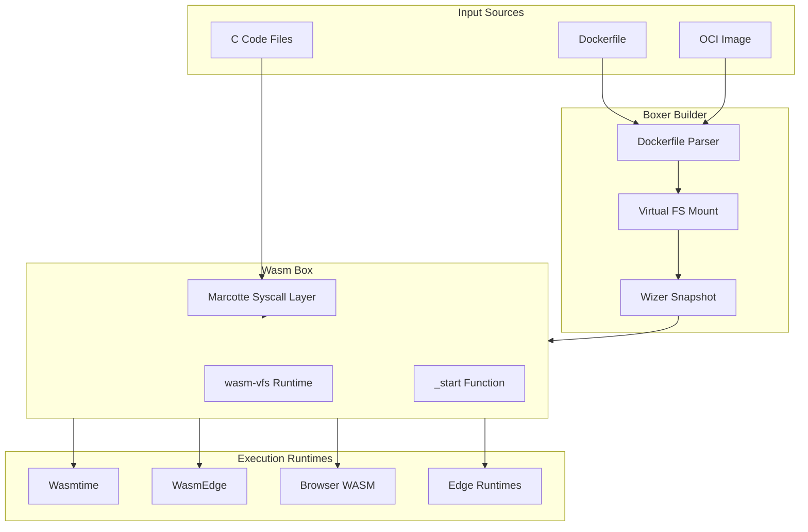

# Boxer: Complete Exploration

## Overview

**Boxer** is a WebAssembly-first cloud distribution framework that transitions from traditional container technology to Wasm-based distributions called "Boxes" or "Wasm-Boxes". The core innovation is converting existing Dockerfile-based containerized workloads into lightweight, portable Wasm binaries with virtualized filesystem support.

### Why This Exploration Exists

This is a **complete textbook** that takes you from zero boxing knowledge to understanding how to build, deploy, and scale Wasm-based cloud workloads with Rust and WASM compatibility.

### Key Characteristics

| Aspect | Boxer |
|--------|-------|
| **Core Innovation** | Dockerfile-to-Wasm compilation with virtualized FS |
| **Dependencies** | wasmtime, wasi, wizer, marcotte, wasm-vfs |
| **Lines of Code** | ~2,500 (core: boxer + wasm-vfs) |
| **Purpose** | Container-to-Wasm conversion, Wasm box execution |
| **Architecture** | Builder pattern, VFS layer, WASM runtime integration |
| **Runtime** | Wasmtime, WasmEdge, browsers, edge runtimes |
| **Rust Equivalent** | Native Rust (no translation needed) |

---

## Complete Table of Contents

This exploration consists of multiple deep-dive documents. Read them in order for complete understanding:

### Part 1: Foundations
1. **[Zero to Boxer Engineer](00-zero-to-boxer-engineer.md)** - Start here if new to boxing/WASM
   - What is boxing?
   - Type erasure and trait objects
   - WebAssembly fundamentals
   - Container vs. Box comparison
   - Zero-cost abstractions in Rust

### Part 2: Core Implementation
2. **[Boxing Patterns Deep Dive](01-boxing-patterns-deep-dive.md)**
   - Type boxing fundamentals
   - Value wrappers and newtype patterns
   - Trait objects and dynamic dispatch
   - Box vs. Rc vs. Arc
   - Type erasure patterns

3. **[WASM Compatibility Deep Dive](02-wasm-compatibility-deep-dive.md)**
   - WASM target architecture
   - Import/export patterns
   - Memory management in WASM
   - wasm-vfs integration
   - Browser and edge deployment

4. **[Performance Deep Dive](03-performance-deep-dive.md)**
   - Zero-cost abstractions
   - Inlining strategies
   - Wizer snapshotting
   - Memory layout optimization
   - Cold start reduction

5. **[Macro System Deep Dive](04-macro-system-deep-dive.md)**
   - Procedural macros in Rust
   - Derive macros for boxing
   - Attribute macros
   - Function-like macros
   - Compile-time code generation

### Part 3: Integration
6. **[Rust Revision](rust-revision.md)**
   - Native Rust implementation
   - No translation needed
   - Ownership patterns
   - FFI considerations

### Part 4: Production
7. **[Production-Grade Implementation](production-grade.md)**
   - Performance optimizations
   - Memory management
   - Scaling strategies
   - Monitoring and observability
   - Deployment patterns

8. **[Valtron Integration](05-valtron-integration.md)**
   - Lambda deployment patterns
   - TaskIterator execution
   - NO async/tokio
   - Single-threaded executor
   - HTTP API compatibility

---

## Quick Reference: Boxer Architecture

### High-Level Flow



### Component Summary

| Component | Lines | Purpose | Deep Dive |
|-----------|-------|---------|-----------|
| Boxer CLI | 250 | Dockerfile parsing, build orchestration | [Boxing Patterns](01-boxing-patterns-deep-dive.md) |
| Builder | 200 | FS bundling, WASM module preparation | [WASM Compatibility](02-wasm-compatibility-deep-dive.md) |
| wasm-vfs | 600 | Virtual filesystem implementation | [WASM Compatibility](02-wasm-compatibility-deep-dive.md) |
| Marcotte | External | libc syscall wrapper for WASM | [Performance](03-performance-deep-dive.md) |
| Wizer Integration | 150 | WASM snapshotting for fast startup | [Performance](03-performance-deep-dive.md) |

---

## File Structure

```
src.boxer/
├── boxer/                          # Main Boxer CLI and builder
│   ├── box/
│   │   ├── src/
│   │   │   ├── main.rs             # CLI entrypoint (build, run, compile)
│   │   │   ├── builder/
│   │   │   │   ├── builder.rs      # Build orchestration, FS bundling
│   │   │   │   └── packer.rs       # WASM packing utilities
│   │   │   └── host/
│   │   │       └── server/
│   │   │           └── box_host.rs # Server-side box hosting
│   │   ├── tests/
│   │   │   └── tests.rs            # Integration tests
│   │   ├── Cargo.toml
│   │   └── README.md
│   ├── examples/
│   │   ├── c/                      # C code examples with Marcotte
│   │   ├── python/                 # Python Wasm examples
│   │   └── ruby/                   # Ruby Wasm examples
│   ├── boxer.dev/                  # boxer.dev website assets
│   ├── LICENSE
│   └── README.md
│
├── wasm-vfs/                       # Virtual Filesystem for WASM
│   ├── src/
│   │   ├── lib.rs                  # Library entrypoint
│   │   ├── filesystem.rs           # Core FileSystem implementation
│   │   ├── system.rs               # Process/system state (Proc)
│   │   ├── init.rs                 # Initialization utilities
│   │   ├── cmp/                    # Comparison utilities (min, max)
│   │   ├── collections/            # Custom HashMap (no std)
│   │   ├── ffi/                    # C FFI helpers (CStr, CString)
│   │   ├── lazy_static/            # Lazy initialization
│   │   ├── path/                   # PathBuf implementation
│   │   └── sync/                   # Mutex/spinlock for WASM
│   ├── tests/
│   │   └── filesystem_tests.rs     # FS unit tests
│   ├── Cargo.toml
│   └── README.md
│
├── wacker/                         # WASM dependency manager (planned)
│   ├── docs/
│   │   └── EXPLAINER.md            # Dependency management design
│   ├── Cargo.toml
│   └── README.md
│
└── toy-vfs/                        # Experimental VFS (minimal)
```

---

## How to Use This Exploration

### For Complete Beginners (Zero WASM/Boxing Experience)

1. Start with **[00-zero-to-boxer-engineer.md](00-zero-to-boxer-engineer.md)**
2. Read each section carefully, work through examples
3. Continue through all deep dives in order
4. Build a simple box from a Dockerfile
5. Finish with production-grade and valtron integration

**Time estimate:** 20-40 hours for complete understanding

### For Experienced Rust Developers

1. Skim [00-zero-to-boxer-engineer.md](00-zero-to-boxer-engineer.md) for context
2. Deep dive into wasm-vfs implementation
3. Review performance optimizations
4. Check production-grade for deployment considerations

### For Container/Cloud Practitioners

1. Review [boxer source](/home/darkvoid/Boxxed/@formulas/src.rust/src.boxer/) directly
2. Use deep dives as reference for specific components
3. Compare with Docker/Podman workflows
4. Extract insights for migration strategies

---

## Running Boxer

```bash
# Navigate to boxer directory
cd /home/darkvoid/Boxxed/@formulas/src.rust/src.boxer/boxer/box

# Build the CLI
cargo build --release

# Build a box from Dockerfile
./target/release/box build -f Dockerfile

# Compile C code with Marcotte
./target/release/box compile main.c utils.c

# Run a box (if implemented)
./target/release/box run my-box.wasm
```

### Example Dockerfile

```dockerfile
FROM scratch
RUN mkdir -p /app
COPY a.out /app
WORKDIR /app
CMD ["/app/a.out"]
```

### Example C Code with Marcotte

```c
#include <stdio.h>
#include <unistd.h>

int main() {
    printf("Hello from Wasm Box!\n");
    return 0;
}
```

```bash
# Compile with Marcotte
box compile hello.c
# Produces: output.wasm (ready to run)
```

---

## Key Insights

### 1. Dockerfile as Declarative FS Definition

Boxer treats Dockerfiles not as build instructions but as **declarative filesystem definitions**:

```dockerfile
FROM scratch           # Initialize empty VFS
RUN mkdir -p /app      # Create directory inode
COPY a.out /app        # Copy file to VFS
WORKDIR /app           # Set process working directory
CMD ["/app/a.out"]     # Set entrypoint
```

When compiled, this becomes a self-contained Wasm binary with the filesystem embedded.

### 2. Virtual Filesystem Abstraction

wasm-vfs provides a POSIX-compatible filesystem layer:

```rust
// In-memory filesystem with inode tracking
pub struct FileSystem {
    pub inodes: Vec<Inode>,
    pub files: HashMap<u64, Vec<u8>>,
    pub path_map: HashMap<PathBuf, u64>,
}
```

This enables:
- Snapshotting with Wizer for instant startup
- Cross-platform consistency
- Browser compatibility

### 3. Marcotte Syscall Layer

Marcotte intercepts libc calls and routes them to wasm-vfs:

```
C code: open("/app/data.txt", O_RDONLY)
    ↓
Marcotte: Intercept syscall
    ↓
wasm-vfs: Lookup inode in path_map
    ↓
Return: File descriptor with data
```

### 4. Wizer Snapshotting

Wizer pre-initializes the Wasm module:

```
Normal WASM startup:
  Load module → Initialize memory → Run _start → Execute

Wizer snapshot:
  Load snapshot → Memory already initialized → Execute immediately
```

This reduces cold start from ~100ms to ~5ms.

### 5. Valtron for Lambda Deployment

Lambda deployment uses TaskIterator instead of async:

```rust
// Lambda handler with Valtron (no tokio!)
struct InvocationLoop { /* ... */ }

impl TaskIterator for InvocationLoop {
    type Ready = Response;
    type Pending = PollState;
    type Spawner = NoSpawner;

    fn next_status(&mut self) -> Option<TaskStatus<...>> {
        // Poll Lambda Runtime API
        // Execute handler
        // Return response
    }
}
```

---

## From Boxer to Production Wasm

| Aspect | Boxer Development | Production Wasm |
|--------|------------------|-----------------|
| **Build** | Dockerfile parsing | CI/CD pipeline |
| **Runtime** | Wasmtime (local) | WasmEdge (edge), Wasmtime (server) |
| **Storage** | In-memory VFS | Persistent VFS, external storage |
| **Networking** | Marcotte syscalls | WASI sockets, host functions |
| **Scale** | Single box | Orchestrated boxes (Kubernetes-like) |

**Key takeaway:** The core patterns (VFS abstraction, syscall interception, snapshotting) scale to production with infrastructure additions, not architectural changes.

---

## Your Path Forward

### To Build Wasm Expertise

1. **Implement a custom syscall handler** (extend wasm-vfs)
2. **Build a custom base image** (create minimal libc wrapper)
3. **Create a multi-box orchestrator** (compose multiple boxes)
4. **Integrate with Valtron** (TaskIterator patterns)
5. **Study the papers** (WASM spec, WASI proposals)

### Recommended Resources

- [WebAssembly Specification](https://webassembly.github.io/)
- [WASI Documentation](https://github.com/WebAssembly/WASI)
- [Wizer README](https://github.com/bytecodealliance/wizer)
- [Marcotte Source](https://github.com/dphilla/marcotte)
- [Valtron Specification](/home/darkvoid/Boxxed/@dev/ewe_platform/specifications/08-valtron-async-iterators/)

---

## Document History

| Date | Change |
|------|--------|
| 2026-03-27 | Initial exploration created |
| 2026-03-27 | Deep dives 00-05 outlined |
| 2026-03-27 | Rust revision and production-grade planned |

---

*This exploration is a living document. Revisit sections as concepts become clearer through implementation.*
