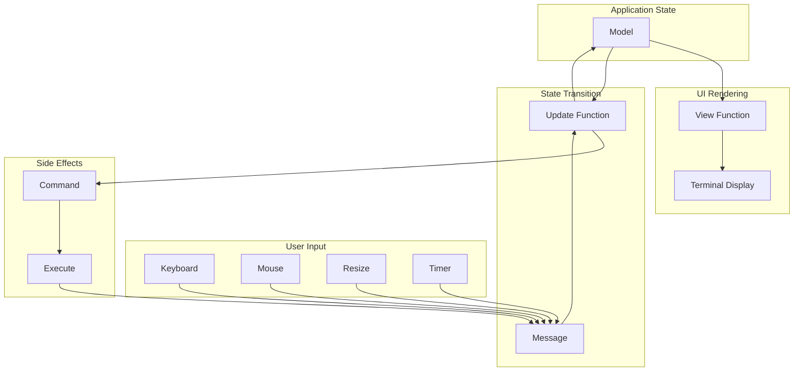

# Elm Architecture Deep Dive

## Table of Contents

1. [The Elm Architecture Pattern](#1-the-elm-architecture-pattern)
2. [Model: Application State](#2-model-application-state)
3. [View: Rendering State](#3-view-rendering-state)
4. [Update: Processing Messages](#4-update-processing-messages)
5. [Messages: The Universal Interface](#5-messages-the-universal-interface)
6. [Commands: Side Effects](#6-commands-side-effects)
7. [Subscriptions: External Events](#7-subscriptions-external-events)
8. [Component Composition](#8-component-composition)
9. [Advanced Patterns](#9-advanced-patterns)

---

## 1. The Elm Architecture Pattern

### 1.1 Origins and Philosophy

The **Elm Architecture** originated from the Elm programming language as a pattern for building frontend applications. Bubble Tea adapts it for terminal user interfaces.

**Core Philosophy:**

```
┌─────────────────────────────────────────────────────────┐
│              Elm Architecture Principles                 │
│                                                          │
│  1. Unidirectional Data Flow                            │
│     - State flows down (Model → View)                   │
│     - Events flow up (Input → Update → Model)           │
│                                                          │
│  2. Pure Functions                                      │
│     - View is a pure function of Model                  │
│     - Update is a pure function of (Model, Msg)         │
│                                                          │
│  3. Immutable State                                     │
│     - Model is never mutated                            │
│     - New model returned on each update                 │
│                                                          │
│  4. Explicit Side Effects                               │
│     - Side effects isolated to Commands                 │
│     - Update returns Cmd, doesn't execute it            │
│                                                          │
└─────────────────────────────────────────────────────────┘
```

### 1.2 The Core Loop



### 1.3 The Model Interface

**Go Interface:**

```go
type Model interface {
    // Init returns the initial command (if any)
    Init() Cmd

    // Update processes a message and returns new state
    Update(Msg) (Model, Cmd)

    // View renders the current state as a string
    View() string
}
```

**Type-Safe Implementation Pattern:**

```go
// Define your concrete model type
type MyModel struct {
    counter    int
    items      []string
    selected   int
    loading    bool
    error      error
    viewport   viewport.Model
    textinput  textinput.Model
}

// Implement the interface
var _ tea.Model = (*MyModel)(nil)

func (m MyModel) Init() tea.Cmd {
    return nil
}

func (m MyModel) Update(msg tea.Msg) (tea.Model, tea.Cmd) {
    // Handle messages...
    return m, nil
}

func (m MyModel) View() string {
    // Render UI...
    return ""
}
```

---

## 2. Model: Application State

### 2.1 Model Design Principles

**Good Model Design:**

```go
// ✓ Good: All state in one place
type Model struct {
    // Application state
    counter int
    items   []string

    // UI state
    cursor      int
    viewport    viewport.Model
    textinput   textinput.Model

    // Async state
    loading     bool
    data        *Result
    err         error
}
```

```go
// ✗ Bad: Hidden state
type Model struct {
    counter int
    // Don't hide state in globals, channels, or external services
}
```

### 2.2 State Categories

**1. Application State:**

```go
type Model struct {
    // Domain-specific state
    todos      []Todo
    filter     FilterMode
    sortBy     SortField

    // Business logic state
    completedCount int
    lastSaved      time.Time
}
```

**2. UI State:**

```go
type Model struct {
    // Cursor and selection
    cursorIndex    int
    selectedItems  map[int]bool

    // Scroll position
    scrollOffset   int

    // Focus state
    focusedElement string

    // View dimensions
    width  int
    height int
}
```

**3. Async State:**

```go
type Model struct {
    // Loading states
    isLoading       bool
    loadingProgress int

    // Cached data
    cachedData      *Data

    // Error states
    loadError       error
    retryCount      int
}
```

**4. Component State:**

```go
type Model struct {
    // Embedded bubble components
    spinner     spinner.Model
    list        list.Model
    textinput   textinput.Model
    viewport    viewport.Model
    table       table.Model
}
```

### 2.3 State Initialization

**Init Function Patterns:**

```go
// Pattern 1: No initial command
func (m Model) Init() tea.Cmd {
    return nil
}

// Pattern 2: Start async operation immediately
func (m Model) Init() tea.Cmd {
    return loadDataCmd()
}

// Pattern 3: Start timer/animation
func (m Model) Init() tea.Cmd {
    return tickCmd()
}

// Pattern 4: Multiple commands with Batch
func (m Model) Init() tea.Cmd {
    return tea.Batch(
        loadDataCmd(),
        tickCmd(),
        showSpinnerCmd(),
    )
}
```

### 2.4 Initial Model Construction

```go
func NewModel() Model {
    // Initialize textinput component
    ti := textinput.New()
    ti.Placeholder = "Search..."
    ti.Focus()
    ti.CharLimit = 156
    ti.Width = 20

    // Initialize list component
    l := list.New([]list.Item{}, list.NewDefaultDelegate(), 0, 0)
    l.Title = "Items"

    return Model{
        // Application state
        items: []string{},

        // UI state
        cursor: 0,

        // Component state
        textinput: ti,
        list:      l,

        // Async state
        loading: false,
        data:    nil,
    }
}

func main() {
    p := tea.NewProgram(NewModel())
    p.Run()
}
```

---

## 3. View: Rendering State

### 3.1 View Function Principles

**Pure Function:**

```go
// ✓ Good: Pure function, no side effects
func (m Model) View() string {
    return fmt.Sprintf("Counter: %d\n", m.counter)
}

// ✗ Bad: Side effects in View
func (m Model) View() string {
    // Don't modify state!
    m.counter++
    // Don't do I/O!
    data, _ := os.ReadFile("file.txt")
    return fmt.Sprintf("Counter: %d, File: %s\n", m.counter, data)
}
```

### 3.2 Building Views

**String Building Patterns:**

```go
import (
    "strings"
    "github.com/charmbracelet/lipgloss"
)

// Pattern 1: fmt.Sprintf (simple)
func (m Model) View() string {
    return fmt.Sprintf(
        "Counter: %d\nItems: %d\n",
        m.counter,
        len(m.items),
    )
}

// Pattern 2: strings.Builder (efficient)
func (m Model) View() string {
    var b strings.Builder
    b.WriteString("Dashboard\n")
    b.WriteString("---------\n")
    for _, item := range m.items {
        b.WriteString(fmt.Sprintf("• %s\n", item))
    }
    return b.String()
}

// Pattern 3: Lip Gloss styling
func (m Model) View() string {
    titleStyle := lipgloss.NewStyle().
        Bold(true).
        Foreground(lipgloss.Color("205")).
        MarginBottom(1)

    return titleStyle.Render("My Application") +
        "\nContent here\n"
}

// Pattern 4: Component composition
func (m Model) View() string {
    return lipgloss.JoinVertical(
        lipgloss.Left,
        m.headerView(),
        m.listView(),
        m.footerView(),
    )
}
```

### 3.3 Conditional Rendering

```go
func (m Model) View() string {
    var b strings.Builder

    // Loading state
    if m.loading {
        b.WriteString(m.spinner.View())
        b.WriteString(" Loading...\n")
        return b.String()
    }

    // Error state
    if m.err != nil {
        errorStyle := lipgloss.NewStyle().
            Foreground(lipgloss.Color("196")).
            Bold(true)
        b.WriteString(errorStyle.Render("Error: " + m.err.Error()))
        b.WriteString("\nPress 'r' to retry")
        return b.String()
    }

    // Empty state
    if len(m.items) == 0 {
        b.WriteString("No items. Press 'a' to add one.\n")
        return b.String()
    }

    // Normal state - render items
    for i, item := range m.items {
        if i == m.cursor {
            b.WriteString("> ")
        } else {
            b.WriteString("  ")
        }
        b.WriteString(item + "\n")
    }

    return b.String()
}
```

### 3.4 Layout Techniques

**Fixed Layout:**

```go
func (m Model) View() string {
    const width = 40

    title := lipgloss.NewStyle().
        Width(width).
        Align(lipgloss.Center).
        Render("My App")

    content := lipgloss.NewStyle().
        Width(width).
        Height(10).
        Render(m.content)

    footer := lipgloss.NewStyle().
        Width(width).
        Align(lipgloss.Center).
        Render("Press q to quit")

    return lipgloss.JoinVertical(
        lipgloss.Left,
        title,
        content,
        footer,
    )
}
```

**Dynamic Layout:**

```go
func (m Model) View() string {
    // Use actual terminal width
    width := m.width
    if width == 0 {
        width = 80 // Default
    }

    // Sidebar + main content
    sidebar := lipgloss.NewStyle().
        Width(20).
        Height(m.height - 2).
        Border(lipgloss.NormalBorder()).
        BorderRight(true).
        Render(m.sidebarContent())

    main := lipgloss.NewStyle().
        Width(width - 22).
        Height(m.height - 2).
        Render(m.mainContent())

    header := lipgloss.NewStyle().
        Width(width).
        Render("Header")

    footer := lipgloss.NewStyle().
        Width(width).
        Render("Footer")

    body := lipgloss.JoinHorizontal(
        lipgloss.Top,
        sidebar,
        main,
    )

    return lipgloss.JoinVertical(
        lipgloss.Left,
        header,
        body,
        footer,
    )
}
```

**Responsive Layout:**

```go
func (m Model) View() string {
    if m.width < 60 {
        // Mobile: stacked layout
        return lipgloss.JoinVertical(
            lipgloss.Left,
            m.headerView(),
            m.contentView(),
            m.navView(),
        )
    }

    // Desktop: sidebar + main
    return lipgloss.JoinHorizontal(
        lipgloss.Top,
        m.sidebarView(),
        m.mainView(),
    )
}
```

### 3.5 Performance Considerations

**View Optimization:**

```go
// ✓ Good: Minimal allocations
func (m Model) View() string {
    // Reuse styles (don't create new each time)
    return m.titleStyle.Render(m.title) + "\n" + m.content
}

// Cache expensive computations
type Model struct {
    cachedView     string
    cachedViewHash uint64
    stateHash      uint64
}

func (m Model) View() string {
    // Only recompute if state changed
    if m.stateHash == m.cachedViewHash {
        return m.cachedView
    }

    view := m.expensiveRender()
    m.cachedView = view
    m.cachedViewHash = m.stateHash
    return view
}
```

---

## 4. Update: Processing Messages

### 4.1 Update Function Structure

```go
func (m Model) Update(msg tea.Msg) (tea.Model, tea.Cmd) {
    // 1. Type switch on message type
    switch msg := msg.(type) {

    // 2. Handle keyboard input
    case tea.KeyMsg:
        return m.handleKeyPress(msg)

    // 3. Handle mouse input
    case tea.MouseMsg:
        return m.handleMouseClick(msg)

    // 4. Handle window resize
    case tea.WindowSizeMsg:
        m.width = msg.Width
        m.height = msg.Height
        return m, nil

    // 5. Handle custom messages
    case DataLoadedMsg:
        m.data = msg.Data
        m.loading = false
        return m, nil

    case ErrorMsg:
        m.err = msg.Err
        return m, nil
    }

    // 6. Default: no change, no command
    return m, nil
}
```

### 4.2 Key Handling Patterns

**String Matching:**

```go
func (m Model) Update(msg tea.Msg) (tea.Model, tea.Cmd) {
    switch msg := msg.(type) {
    case tea.KeyMsg:
        switch msg.String() {
        case "q", "ctrl+c":
            return m, tea.Quit
        case "up", "k":
            m.cursor--
        case "down", "j":
            m.cursor++
        case "enter":
            return m, m.selectItem()
        case " ":
            m.toggleItem()
        }
    }
    return m, nil
}
```

**Type Matching (more robust):**

```go
func (m Model) Update(msg tea.Msg) (tea.Model, tea.Cmd) {
    switch msg := msg.(type) {
    case tea.KeyMsg:
        switch msg.Type {
        case tea.KeyCtrlC, tea.KeyEscape:
            return m, tea.Quit
        case tea.KeyUp, tea.KeyDown:
            // Arrow keys
        case tea.KeyEnter:
            return m, m.selectItem()
        case tea.KeyRunes:
            // Handle character input
            switch string(msg.Runes) {
            case "q":
                return m, tea.Quit
            case "j":
                m.cursor++
            case "k":
                m.cursor--
            }
        }
    }
    return m, nil
}
```

**Key Binding System:**

```go
// Define key bindings
type KeyMap struct {
    Up       key.Binding
    Down     key.Binding
    Select   key.Binding
    Quit     key.Binding
}

var DefaultKeyMap = KeyMap{
    Up: key.NewBinding(
        key.WithKeys("up", "k"),
        key.WithHelp("↑/k", "move up"),
    ),
    Down: key.NewBinding(
        key.WithKeys("down", "j"),
        key.WithHelp("↓/j", "move down"),
    ),
    Select: key.NewBinding(
        key.WithKeys("enter", " "),
        key.WithHelp("enter", "select"),
    ),
    Quit: key.NewBinding(
        key.WithKeys("q", "ctrl+c"),
        key.WithHelp("q", "quit"),
    ),
}

func (m Model) Update(msg tea.Msg) (tea.Model, tea.Cmd) {
    switch msg := msg.(type) {
    case tea.KeyMsg:
        switch {
        case key.Matches(msg, m.KeyMap.Up):
            m.cursor--
        case key.Matches(msg, m.KeyMap.Down):
            m.cursor++
        case key.Matches(msg, m.KeyMap.Select):
            return m, m.selectItem()
        case key.Matches(msg, m.KeyMap.Quit):
            return m, tea.Quit
        }
    }
    return m, nil
}
```

### 4.3 Cursor and Selection

```go
func (m Model) Update(msg tea.Msg) (tea.Model, tea.Cmd) {
    switch msg := msg.(type) {
    case tea.KeyMsg:
        switch msg.String() {
        case "up", "k":
            if m.cursor > 0 {
                m.cursor--
            }
        case "down", "j":
            if m.cursor < len(m.items)-1 {
                m.cursor++
            }
        case "home":
            m.cursor = 0
        case "end":
            m.cursor = len(m.items) - 1
        case "pgup":
            m.cursor -= m.pageHeight
            if m.cursor < 0 {
                m.cursor = 0
            }
        case "pgdown":
            m.cursor += m.pageHeight
            if m.cursor > len(m.items)-1 {
                m.cursor = len(m.items) - 1
            }
        }
    }
    return m, nil
}
```

### 4.4 Handling Multiple Components

```go
func (m Model) Update(msg tea.Msg) (tea.Model, tea.Cmd) {
    var cmds []tea.Cmd

    // Update spinner
    var cmd tea.Cmd
    m.spinner, cmd = m.spinner.Update(msg)
    cmds = append(cmds, cmd)

    // Update textinput
    if m.textinput.Focused() {
        m.textinput, cmd = m.textinput.Update(msg)
        cmds = append(cmds, cmd)
    }

    // Update list
    m.list, cmd = m.list.Update(msg)
    cmds = append(cmds, cmd)

    // Handle global keys
    switch msg := msg.(type) {
    case tea.KeyMsg:
        switch msg.String() {
        case "ctrl+n":
            // Create new item
            m.textinput.Focus()
            return m, tea.Batch(cmds...)
        case "esc":
            m.textinput.Blur()
            return m, tea.Batch(cmds...)
        }
    }

    return m, tea.Batch(cmds...)
}
```

---

## 5. Messages: The Universal Interface

### 5.1 Built-in Message Types

```go
// From bubbletea package
type KeyMsg Key           // Keyboard input
type MouseMsg MouseEvent  // Mouse input
type WindowSizeMsg struct { Width, Height int }

// Special messages
func Quit() Msg      // Quit message
func Suspend() Msg   // Suspend (Ctrl+Z)
func Interrupt() Msg // Interrupt (Ctrl+C)
```

### 5.2 Custom Message Types

**Simple Messages:**

```go
// Empty struct for signal-only messages
type TickMsg struct{}
type ReloadMsg struct{}
type SaveCompleteMsg struct{}

// With data
type DataLoadedMsg struct {
    Data []string
}

type ErrorMsg struct {
    Err error
}

type ProgressMsg struct {
    Current int
    Total   int
}
```

**Message Naming Convention:**

```go
// ✓ Good: Clear, descriptive names
type UserDataLoadedMsg struct{}
type FileSaveFailedMsg struct{}
type NetworkTimeoutMsg struct{}

// ✗ Bad: Vague names
type DataMsg struct{}  // What data?
type ResultMsg struct{} // What result?
```

### 5.3 Message Dispatch Patterns

**Switch on Type:**

```go
func (m Model) Update(msg tea.Msg) (tea.Model, tea.Cmd) {
    switch msg := msg.(type) {
    case tea.KeyMsg:
        // Handle keyboard
    case tea.MouseMsg:
        // Handle mouse
    case tea.WindowSizeMsg:
        // Handle resize
    case DataLoadedMsg:
        // Handle data loaded
    }
    return m, nil
}
```

**Type Assertion Chain:**

```go
func (m Model) Update(msg tea.Msg) (tea.Model, tea.Cmd) {
    if k, ok := msg.(tea.KeyMsg); ok {
        return m.handleKey(k)
    }
    if d, ok := msg.(DataLoadedMsg); ok {
        m.data = d.Data
        return m, nil
    }
    return m, nil
}
```

**Pattern Matching Helper:**

```go
func isQuit(msg tea.Msg) bool {
    _, ok := msg.(tea.QuitMsg)
    return ok
}

func isEnter(msg tea.Msg) bool {
    if k, ok := msg.(tea.KeyMsg); ok {
        return k.Type == tea.KeyEnter
    }
    return false
}

func (m Model) Update(msg tea.Msg) (tea.Model, tea.Cmd) {
    if isQuit(msg) || isEnter(msg) {
        return m, tea.Quit
    }
    return m, nil
}
```

---

## 6. Commands: Side Effects

### 6.1 Command Definition

```go
// A Cmd is a function that returns a message when complete
type Cmd func() Msg

// Example: Simple command
func tickCmd() tea.Cmd {
    return func() tea.Msg {
        return TickMsg{}
    }
}

// Example: Command with data
func loadDataCmd(url string) tea.Cmd {
    return func() tea.Msg {
        resp, err := http.Get(url)
        if err != nil {
            return ErrorMsg{err}
        }
        defer resp.Body.Close()

        data, err := io.ReadAll(resp.Body)
        if err != nil {
            return ErrorMsg{err}
        }

        return DataLoadedMsg{string(data)}
    }
}
```

### 6.2 Batch Commands

```go
// Run multiple commands concurrently
func initCmd() tea.Cmd {
    return tea.Batch(
        loadDataCmd("https://api.example.com/data"),
        tickCmd(),
        showSpinnerCmd(),
    )
}

// Batch with nil filtering
func sometimesCmd() tea.Cmd {
    var cmds []tea.Cmd

    if needRefresh {
        cmds = append(cmds, refreshCmd())
    }
    if needSave {
        cmds = append(cmds, saveCmd())
    }

    return tea.Batch(cmds...)
}
```

### 6.3 Sequence Commands

```go
// Run commands sequentially
func setupCmd() tea.Cmd {
    return tea.Sequence(
        clearScreenCmd(),
        initDatabaseCmd(),
        loadConfigCmd(),
        startAppCmd(),
    )
}

// Sequence stops on first non-nil message
func saveAndQuitCmd() tea.Cmd {
    return tea.Sequence(
        saveDataCmd(),  // If this returns a message, quit won't run
        tea.Quit,
    )
}
```

### 6.4 Timers and Ticks

**Every (sync with clock):**

```go
// Tick at the top of each minute
func tickEveryMinute() tea.Cmd {
    return tea.Every(time.Minute, func(t time.Time) tea.Msg {
        return TickMsg(t)
    })
}

// In Update, reschedule:
func (m Model) Update(msg tea.Msg) (tea.Model, tea.Cmd) {
    switch msg.(type) {
    case TickMsg:
        m.currentTime = time.Now()
        return m, tickEveryMinute() // Reschedule
    }
    return m, nil
}
```

**Tick (interval from now):**

```go
// Tick every second starting now
func doTick() tea.Cmd {
    return tea.Tick(time.Second, func(t time.Time) tea.Msg {
        return TickMsg(t)
    })
}

// In Update:
func (m Model) Update(msg tea.Msg) (tea.Model, tea.Cmd) {
    switch msg.(type) {
    case TickMsg:
        m.seconds++
        return m, doTick() // Reschedule
    }
    return m, nil
}
```

### 6.5 I/O Commands

**File Operations:**

```go
func readFileCmd(path string) tea.Cmd {
    return func() tea.Msg {
        data, err := os.ReadFile(path)
        if err != nil {
            return FileReadErrorMsg{err}
        }
        return FileReadOkMsg{data: string(data)}
    }
}

func writeFileCmd(path, content string) tea.Cmd {
    return func() tea.Msg {
        err := os.WriteFile(path, []byte(content), 0644)
        if err != nil {
            return FileWriteErrorMsg{err}
        }
        return FileWriteOkMsg{}
    }
}
```

**HTTP Operations:**

```go
func fetchJSONCmd[T any](url string) tea.Cmd {
    return func() tea.Msg {
        resp, err := http.Get(url)
        if err != nil {
            return HTTPErrorMsg{err}
        }
        defer resp.Body.Close()

        if resp.StatusCode != http.StatusOK {
            return HTTPErrorMsg{fmt.Errorf("status: %d", resp.StatusCode)}
        }

        var data T
        if err := json.NewDecoder(resp.Body).Decode(&data); err != nil {
            return HTTPErrorMsg{err}
        }

        return HTTPSuccessMsg[T]{data}
    }
}
```

**Process Execution:**

```go
func execCmd(name string, args ...string) tea.Cmd {
    return func() tea.Msg {
        output, err := exec.Command(name, args...).CombinedOutput()
        if err != nil {
            return ExecErrorMsg{err}
        }
        return ExecOkMsg{output: string(output)}
    }
}
```

---

## 7. Subscriptions: External Events

### 7.1 Subscription Pattern

Bubble Tea doesn't have built-in subscriptions like Elm, but you can implement them:

```go
// Subscription returns a command that listens for external events
func subscribeToChannel(ch <-chan Event) tea.Cmd {
    return func() tea.Msg {
        event, ok := <-ch
        if !ok {
            return SubscriptionClosedMsg{}
        }
        return ExternalEventMsg{event}
    }
}

// In Update, resubscribe:
func (m Model) Update(msg tea.Msg) (tea.Model, tea.Cmd) {
    switch msg := msg.(type) {
    case ExternalEventMsg:
        m.events = append(m.events, msg.Event)
        return m, subscribeToChannel(m.eventChan)
    }
    return m, nil
}
```

### 7.2 WebSocket Subscription

```go
func websocketSubscribe(url string) tea.Cmd {
    return func() tea.Msg {
        conn, _, err := websocket.Dial(context.Background(), url, nil)
        if err != nil {
            return WebSocketErrorMsg{err}
        }

        _, data, err := conn.Read(context.Background())
        if err != nil {
            return WebSocketErrorMsg{err}
        }

        return WebSocketMessageMsg{data: data}
    }
}

// Resubscribe after each message:
func (m Model) Update(msg tea.Msg) (tea.Model, tea.Cmd) {
    switch msg.(type) {
    case WebSocketMessageMsg:
        // Process message...
        return m, websocketSubscribe(m.wsUrl)
    }
    return m, nil
}
```

### 7.3 File Watcher Subscription

```go
func watchFileCmd(path string) tea.Cmd {
    return func() tea.Msg {
        watcher, err := fsnotify.NewWatcher()
        if err != nil {
            return FileWatchErrorMsg{err}
        }
        defer watcher.Close()

        watcher.Add(path)

        event := <-watcher.Events
        return FileChangedMsg{event}
    }
}
```

---

## 8. Component Composition

### 8.1 Embedding Components

```go
type Model struct {
    // Embed bubble components
    spinner    spinner.Model
    textinput  textinput.Model
    list       list.Model
    viewport   viewport.Model
    paginator  paginator.Model

    // Your state
    items  []string
    state  AppState
}

func NewModel() Model {
    return Model{
        spinner:   spinner.New(),
        textinput: textinput.New(),
        list:      list.New(items, list.NewDefaultDelegate(), 30, 10),
        viewport:  viewport.New(80, 20),
        paginator: paginator.New(),
    }
}
```

### 8.2 Delegating Updates

```go
func (m Model) Update(msg tea.Msg) (tea.Model, tea.Cmd) {
    var cmds []tea.Cmd
    var cmd tea.Cmd

    // Delegate to spinner
    m.spinner, cmd = m.spinner.Update(msg)
    cmds = append(cmds, cmd)

    // Delegate to textinput (when focused)
    if m.state == InputState {
        m.textinput, cmd = m.textinput.Update(msg)
        cmds = append(cmds, cmd)
    }

    // Delegate to list
    m.list, cmd = m.list.Update(msg)
    cmds = append(cmds, cmd)

    // Handle global keys
    if k, ok := msg.(tea.KeyMsg); ok {
        switch k.String() {
        case "tab":
            // Toggle focus between components
            m.state = (m.state + 1) % StateCount
        }
    }

    return m, tea.Batch(cmds...)
}
```

### 8.3 Composing Views

```go
func (m Model) View() string {
    var b strings.Builder

    // Header with spinner
    b.WriteString(m.spinner.View())
    b.WriteString(" Loading...\n\n")

    // Text input
    b.WriteString("Search: ")
    b.WriteString(m.textinput.View())
    b.WriteString("\n\n")

    // List
    b.WriteString(m.list.View())
    b.WriteString("\n\n")

    // Paginator
    b.WriteString(m.paginator.View())

    return b.String()
}
```

### 8.4 Custom Component Pattern

```go
// Define your own component
type CustomComponent struct {
    Value string
    Focus bool
}

func NewCustomComponent() CustomComponent {
    return CustomComponent{
        Value: "",
        Focus: false,
    }
}

// Update method (like tea.Model but simpler)
func (c *CustomComponent) Update(msg tea.Msg) tea.Cmd {
    if !c.Focus {
        return nil
    }

    if k, ok := msg.(tea.KeyMsg); ok {
        switch k.Type {
        case tea.KeyRunes:
            c.Value += string(k.Runes)
        case tea.KeyBackspace:
            if len(c.Value) > 0 {
                c.Value = c.Value[:len(c.Value)-1]
            }
        }
    }
    return nil
}

// View method
func (c *CustomComponent) View() string {
    if c.Focus {
        return "[" + c.Value + "_]"
    }
    return "[" + c.Value + "]"
}

// Use in your main model
type Model struct {
    custom CustomComponent
}

func (m Model) Update(msg tea.Msg) (tea.Model, tea.Cmd) {
    cmd := m.custom.Update(msg)
    return m, cmd
}

func (m Model) View() string {
    return m.custom.View()
}
```

---

## 9. Advanced Patterns

### 9.1 State Machines

```go
type AppState int

const (
    LoadingState AppState = iota
    ReadyState
    EditingState
    ErrorState
)

func (m Model) Update(msg tea.Msg) (tea.Model, tea.Cmd) {
    switch m.state {
    case LoadingState:
        return m.updateLoading(msg)
    case ReadyState:
        return m.updateReady(msg)
    case EditingState:
        return m.updateEditing(msg)
    case ErrorState:
        return m.updateError(msg)
    }
    return m, nil
}

func (m Model) updateLoading(msg tea.Msg) (tea.Model, tea.Cmd) {
    if _, ok := msg.(DataLoadedMsg); ok {
        m.state = ReadyState
        return m, nil
    }
    if _, ok := msg.(errorMsg); ok {
        m.state = ErrorState
        return m, nil
    }
    return m, nil
}
```

### 9.2 Undo/Redo

```go
type Model struct {
    history  [][]string
    future   [][]string
    current  []string
}

func (m *Model) setState(items []string) {
    m.history = append(m.history, m.current)
    m.current = items
    m.future = nil // Clear future on new action
}

func (m Model) Update(msg tea.Msg) (tea.Model, tea.Cmd) {
    switch msg := msg.(type) {
    case tea.KeyMsg:
        switch msg.String() {
        case "ctrl+z":
            // Undo
            if len(m.history) > 0 {
                m.future = append(m.future, m.current)
                m.current = m.history[len(m.history)-1]
                m.history = m.history[:len(m.history)-1]
            }
        case "ctrl+y":
            // Redo
            if len(m.future) > 0 {
                m.history = append(m.history, m.current)
                m.current = m.future[len(m.future)-1]
                m.future = m.future[:len(m.future)-1]
            }
        }
    }
    return m, nil
}
```

### 9.3 Debouncing

```go
type Model struct {
    debounceTimer *time.Timer
    searchQuery   string
}

func (m *Model) scheduleSearch() tea.Cmd {
    if m.debounceTimer != nil {
        m.debounceTimer.Stop()
    }

    return tea.Tick(300*time.Millisecond, func(t time.Time) tea.Msg {
        return DoSearchMsg{query: m.searchQuery}
    })
}

func (m Model) Update(msg tea.Msg) (tea.Model, tea.Cmd) {
    switch msg := msg.(type) {
    case tea.KeyMsg:
        // Typing in search
        m.searchQuery += string(msg.Runes)
        return m, m.scheduleSearch()

    case DoSearchMsg:
        // Execute search
        return m, performSearchCmd(msg.query)
    }
    return m, nil
}
```

### 9.4 Request Deduplication

```go
type Model struct {
    activeRequest string
    cache         map[string][]string
}

func (m Model) Update(msg tea.Msg) (tea.Model, tea.Cmd) {
    switch msg := msg.(type) {
    case RequestDataMsg:
        // Don't start duplicate request
        if m.activeRequest == msg.key {
            return m, nil
        }

        // Return cached data if available
        if data, ok := m.cache[msg.key]; ok {
            return m, nil
        }

        // Start new request
        m.activeRequest = msg.key
        return m, fetchDataCmd(msg.key)

    case DataLoadedMsg:
        m.cache[msg.key] = msg.data
        m.activeRequest = ""
        return m, nil

    case ErrorMsg:
        m.activeRequest = ""
        return m, nil
    }
    return m, nil
}
```

---

## Key Takeaways

1. **Model is immutable**: Never mutate, always return new model
2. **View is pure**: No side effects, deterministic rendering
3. **Update is pure**: Same (Model, Msg) always produces same result
4. **Commands isolate effects**: Side effects happen outside Update
5. **Messages are the interface**: All communication through messages
6. **Components compose**: Embed and delegate to sub-components

---

*Continue to [02-rendering-pipeline-deep-dive.md](02-rendering-pipeline-deep-dive.md) for the rendering system.*
