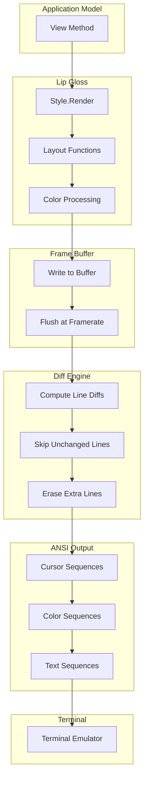

# Rendering Pipeline Deep Dive

## Table of Contents

1. [Rendering Architecture Overview](#1-rendering-architecture-overview)
2. [ANSI Escape Sequences Fundamentals](#2-ansi-escape-sequences-fundamentals)
3. [Frame-Based Renderer](#3-frame-based-renderer)
4. [Diff-Based Optimization](#4-diff-based-optimization)
5. [Lip Gloss Styling System](#5-lip-gloss-styling-system)
6. [Layout Composition](#6-layout-composition)
7. [ANSI-Aware Text Processing](#7-ansi-aware-text-processing)
8. [Performance Optimization](#8-performance-optimization)

---

## 1. Rendering Architecture Overview

### 1.1 The Rendering Stack

```
┌─────────────────────────────────────────────────────────┐
│                   Application Layer                      │
│  Model.View() → string                                  │
└─────────────────────────┬───────────────────────────────┘
                          │
                          ▼
┌─────────────────────────────────────────────────────────┐
│                   Lip Gloss Layer                        │
│  Style.Render(), JoinHorizontal, PlaceVertical          │
│  Color handling, borders, padding, margins              │
└─────────────────────────┬───────────────────────────────┘
                          │
                          ▼
┌─────────────────────────────────────────────────────────┐
│              Bubble Tea Renderer Layer                   │
│  standardRenderer, frame buffering, diff computation    │
│  ANSI compression, line optimization                    │
└─────────────────────────┬───────────────────────────────┘
                          │
                          ▼
┌─────────────────────────────────────────────────────────┐
│              Terminal Output Layer                       │
│  ansi package: cursor, color, screen control            │
│  Direct write to stdout                                 │
└─────────────────────────┬───────────────────────────────┘
                          │
                          ▼
┌─────────────────────────────────────────────────────────┐
│                    Terminal Emulator                     │
│  iTerm2, Kitty, Alacritty, Windows Terminal             │
│  Parses ANSI, renders pixels                            │
└─────────────────────────────────────────────────────────┘
```

### 1.2 Render Flow



### 1.3 The Renderer Interface

```go
// renderer.go
type renderer interface {
    // Lifecycle
    start()
    stop()
    kill()

    // Core rendering
    write(string)
    repaint()
    clearScreen()

    // Screen buffer control
    altScreen() bool
    enterAltScreen()
    exitAltScreen()

    // Cursor control
    showCursor()
    hideCursor()

    // Mouse control
    enableMouseCellMotion()
    enableMouseAllMotion()
    disableMouseCellMotion()
    disableMouseAllMotion()
    enableMouseSGRMode()
    disableMouseSGRMode()

    // Paste control
    enableBracketedPaste()
    disableBracketedPaste()
    bracketedPasteActive() bool

    // Focus reporting
    enableReportFocus()
    disableReportFocus()
    reportFocus() bool

    // Window title
    setWindowTitle(string)
}
```

---

## 2. ANSI Escape Sequences Fundamentals

### 2.1 Sequence Structure

```
Escape Sequence Format:
┌─────┬─────┬────────────┬─────────┬────────┐
│ ESC │ [   │ Parameters │ ;分隔符 │ Command│
│ 0x1B│ CSI │ P1;P2;P3   │    ;    │   Cm   │
└─────┴─────┴────────────┴─────────┴────────┘

Example: Move cursor to row 10, column 20
\e[10;20H
│  │  └─ Command: H (Cursor Position)
│  └──── Parameters: 10;20
└─────── ESC [ (CSI introducer)
```

### 2.2 Cursor Control Sequences

```go
import "github.com/charmbracelet/x/ansi"

// Cursor Movement
ansi.CursorUp(3)        // \e[3A - Move up 3 rows
ansi.CursorDown(2)      // \e[2B - Move down 2 rows
ansi.CursorRight(5)     // \e[5C - Move right 5 columns
ansi.CursorLeft(3)      // \e[3D - Move left 3 columns
ansi.CursorPosition(10, 20)  // \e[10;20H - Absolute position
ansi.CursorHomePosition        // \e[H - Top-left corner

// Cursor Visibility
ansi.ShowCursor  // \e[?25h - Show cursor
ansi.HideCursor  // \e[?25l - Hide cursor

// Cursor Save/Restore
ansi.SaveCursor    // \e[s - Save position
ansi.RestoreCursor // \e[u - Restore position
```

### 2.3 Screen Manipulation Sequences

```go
// Clear Operations
ansi.EraseLineRight      // \e[K - Clear from cursor to end of line
ansi.EraseLineLeft       // \e[1K - Clear from cursor to start of line
ansi.EraseEntireLine     // \e[2K - Clear entire line
ansi.EraseScreenBelow    // \e[J - Clear from cursor to end of screen
ansi.EraseScreenAbove    // \e[1J - Clear from cursor to start of screen
ansi.EraseEntireScreen   // \e[2J - Clear entire screen

// Scroll Operations
ansi.ScrollUp(3)    // \e[3S - Scroll up 3 lines
ansi.ScrollDown(2)  // \e[3T - Scroll down 2 lines
```

### 2.4 Color Sequences

```go
// 16 ANSI Colors (4-bit)
ansi.SetForegroundColor(31)   // \e[31m - Red
ansi.SetBackgroundColor(42)   // \e[42m - Green
ansi.SetDefaultForegroundColor()  // \e[39m
ansi.SetDefaultBackgroundColor()  // \e[49m

// 256 Colors (8-bit)
ansi.SetForegroundColor256(201)  // \e[38;5;201m - Hot pink
ansi.SetBackgroundColor256(22)   // \e[48;5;22m - Dark green

// True Color (24-bit)
ansi.SetForegroundColorRGB(255, 87, 51)   // \e[38;2;255;87;51m
ansi.SetBackgroundColorRGB(45, 70, 185)   // \e[48;2;45;70;185m

// Reset
ansi.ResetAttributes  // \e[0m - Reset all attributes
```

### 2.5 Text Attribute Sequences

```go
// Text Styles
ansi.Bold          // \e[1m
ansi.Faint         // \e[2m
ansi.Italic        // \e[3m
ansi.Underline     // \e[4m
ansi.Blink         // \e[5m
ansi.Reverse       // \e[7m
ansi.Conceal       // \e[8m
ansi.Strikethrough // \e[9m

// Bold Off variants
ansi.NormalIntensity  // \e[22m
ansi.NoItalic         // \e[23m
ansi.NoUnderline      // \e[24m
ansi.NoBlink          // \e[25m
ansi.NoReverse        // \e[27m
ansi.NoConceal        // \e[28m
ansi.NoStrikethrough  // \e[29m
```

### 2.6 Mouse Sequences

```go
// Enable Mouse Tracking
ansi.SetButtonEventMouseMode    // \e[?1002h - Track drag events
ansi.SetAnyEventMouseMode       // \e[?1003h - Track all motion
ansi.SetSgrExtMouseMode         // \e[?1006h - SGR extended format

// Disable Mouse Tracking
ansi.ResetButtonEventMouseMode  // \e[?1002l
ansi.ResetAnyEventMouseMode     // \e[?1003l
ansi.ResetSgrExtMouseMode       // \e[?1006l

// Mouse Event Format (SGR):
// \e[<button;x;y{M|m}
// M = button press, m = button release
// button: 0=left, 1=middle, 2=right, 64=wheel up, 65=wheel down
```

---

## 3. Frame-Based Renderer

### 3.1 Renderer Structure

```go
// standard_renderer.go
type standardRenderer struct {
    mtx *sync.Mutex
    out io.Writer

    // Frame buffer
    buf                bytes.Buffer
    queuedMessageLines []string

    // Framerate control
    framerate time.Duration
    ticker    *time.Ticker
    done      chan struct{}

    // Diff tracking
    lastRender        string
    lastRenderedLines []string
    linesRendered     int
    altLinesRendered  int

    // Optimization
    useANSICompressor bool
    once              sync.Once

    // Cursor state
    cursorHidden bool

    // Screen state
    altScreenActive bool
    bpActive        bool // bracketed paste
    reportingFocus  bool

    // Dimensions
    width  int
    height int

    // Render exclusions
    ignoreLines map[int]struct{}
}
```

### 3.2 Framerate Control

```go
const (
    defaultFPS = 60
    maxFPS     = 120
)

func newRenderer(out io.Writer, useANSICompressor bool, fps int) renderer {
    if fps < 1 {
        fps = defaultFPS
    } else if fps > maxFPS {
        fps = maxFPS
    }

    r := &standardRenderer{
        out:               out,
        mtx:               &sync.Mutex{},
        done:              make(chan struct{}),
        framerate:         time.Second / time.Duration(fps),
        useANSICompressor: useANSICompressor,
    }

    if r.useANSICompressor {
        r.out = &compressor.Writer{Forward: out}
    }

    return r
}

func (r *standardRenderer) start() {
    if r.ticker == nil {
        r.ticker = time.NewTicker(r.framerate)
    } else {
        r.ticker.Reset(r.framerate)
    }

    r.once = sync.Once{}
    go r.listen()
}

func (r *standardRenderer) listen() {
    for {
        select {
        case <-r.done:
            r.ticker.Stop()
            return
        case <-r.ticker.C:
            r.flush() // Render at controlled framerate
        }
    }
}
```

### 3.3 Write and Flush Cycle

```go
// write() - Called by Program after every Update
func (r *standardRenderer) write(s string) {
    r.mtx.Lock()
    defer r.mtx.Unlock()
    r.buf.Reset()

    if s == "" {
        s = " " // Render space instead of empty
    }

    _, _ = r.buf.WriteString(s)
    // Buffer will be flushed on next ticker tick
}

// flush() - Called by ticker at framerate
func (r *standardRenderer) flush() {
    r.mtx.Lock()
    defer r.mtx.Unlock()

    // Skip if nothing to render
    if r.buf.Len() == 0 || r.buf.String() == r.lastRender {
        return
    }

    // Build output buffer
    buf := &bytes.Buffer{}

    // Move cursor to start of rendered area
    if r.altScreenActive {
        buf.WriteString(ansi.CursorHomePosition)
    } else if r.linesRendered > 1 {
        buf.WriteString(ansi.CursorUp(r.linesRendered - 1))
    }

    // Render lines (with diff optimization)
    newLines := strings.Split(r.buf.String(), "\n")
    r.renderLines(buf, newLines)

    // Write to terminal
    _, _ = r.out.Write(buf.Bytes())

    // Update state
    r.lastRender = r.buf.String()
    r.lastRenderedLines = newLines
    r.buf.Reset()
}
```

### 3.4 Line-by-Line Rendering

```go
func (r *standardRenderer) renderLines(buf *bytes.Buffer, newLines []string) {
    // Handle queued messages (Println output)
    flushQueuedMessages := len(r.queuedMessageLines) > 0 && !r.altScreenActive
    if flushQueuedMessages {
        for _, line := range r.queuedMessageLines {
            if ansi.StringWidth(line) < r.width {
                line = line + ansi.EraseLineRight
            }
            _, _ = buf.WriteString(line)
            _, _ = buf.WriteString("\r\n")
        }
        r.queuedMessageLines = []string{}
    }

    // Render new content lines
    for i := 0; i < len(newLines); i++ {
        // Check if we can skip this line (unchanged from last render)
        canSkip := !flushQueuedMessages &&
            len(r.lastRenderedLines) > i &&
            r.lastRenderedLines[i] == newLines[i]

        // Check if line is explicitly ignored
        _, ignore := r.ignoreLines[i]

        if ignore || canSkip {
            // Skip unchanged line, but move cursor down
            if i < len(newLines)-1 {
                buf.WriteByte('\n')
            }
            continue
        }

        // First line: return cursor to start
        if i == 0 && r.lastRender == "" {
            buf.WriteByte('\r')
        }

        line := newLines[i]

        // Truncate if wider than terminal
        if r.width > 0 {
            line = ansi.Truncate(line, r.width, "")
        }

        // Clear rest of line if shorter than terminal width
        if ansi.StringWidth(line) < r.width {
            line = line + ansi.EraseLineRight
        }

        _, _ = buf.WriteString(line)

        // Newline (except for last line)
        if i < len(newLines)-1 {
            _, _ = buf.WriteString("\r\n")
        }
    }

    // Clear leftover lines from previous render
    if r.lastLinesRendered() > len(newLines) {
        buf.WriteString(ansi.EraseScreenBelow)
    }

    // Update rendered line count
    if r.altScreenActive {
        r.altLinesRendered = len(newLines)
    } else {
        r.linesRendered = len(newLines)
    }

    // Position cursor at end of output
    if r.altScreenActive {
        buf.WriteString(ansi.CursorPosition(0, len(newLines)))
    } else {
        buf.WriteString(ansi.CursorBackward(r.width))
    }
}
```

---

## 4. Diff-Based Optimization

### 4.1 How Diff Rendering Works

```
Frame N:                          Frame N+1:
┌────────────────────┐            ┌────────────────────┐
│ Header             │  (line 0)  │ Header             │  ← Same, skip
│ Item 1             │  (line 1)  │ Item 1             │  ← Same, skip
│ Item 2             │  (line 2)  │ ITEM 2 (selected)  │  ← Changed, render
│ Item 3             │  (line 3)  │ Item 3             │  ← Same, skip
│ Footer             │  (line 4)  │ Footer             │  ← Same, skip
└────────────────────┘            └────────────────────┘

Only line 2 is rendered. Cursor movement:
1. Move up 2 lines (to line 2)
2. Render "ITEM 2 (selected)" + EraseLineRight
3. Move down to end
```

### 4.2 Diff Implementation

```go
// Key optimization: compare strings before rendering
func (r *standardRenderer) flush() {
    newLines := strings.Split(r.buf.String(), "\n")

    for i := 0; i < len(newLines); i++ {
        // Check if line is identical to last render
        canSkip := len(r.lastRenderedLines) > i &&
                   r.lastRenderedLines[i] == newLines[i]

        if canSkip {
            // Move cursor down but don't render
            if i < len(newLines)-1 {
                buf.WriteByte('\n')
            }
            continue
        }

        // Render changed line
        r.renderLine(buf, newLines[i])
    }

    // Save for next comparison
    r.lastRenderedLines = newLines
}
```

### 4.3 When Diff Doesn't Help

**Full repaint needed:**

```go
// Force full repaint
func (r *standardRenderer) repaint() {
    r.lastRender = ""
    r.lastRenderedLines = nil
}

// Called when:
// - Terminal resized
// - User switches back from another program
// - Alt screen toggled
```

**Line ignore for static regions:**

```go
// Ignore specific lines from diff comparison
func (r *standardRenderer) setIgnoreLines(lines map[int]struct{}) {
    r.ignoreLines = lines
}

// Use case: Terminal has static header/footer
// Only middle content changes
```

### 4.4 ANSI Compressor

```go
// github.com/muesli/ansi/compressor
// Removes redundant ANSI sequences

// Without compressor:
"\e[31mRed \e[39mDefault \e[31mRed again\e[0m"

// With compressor (optimized):
"\e[31mRed \e[39mDefault Red again\e[0m"
// (Removed redundant second \e[31m)

// Enable in Bubble Tea:
p := tea.NewProgram(model, tea.WithANSICompressor())
```

---

## 5. Lip Gloss Styling System

### 5.1 Style Structure

```go
// lipgloss/style.go
type Style struct {
    // Text attributes
    bold          *bool
    italic        *bool
    underline     *bool
    strikethrough *bool
    reversed      *bool
    blink         *bool
    faint         *bool

    // Colors
    foreground *TerminalColor
    background *TerminalColor

    // Borders
    border           *Border
    borderForeground *TerminalColor
    borderBackground *TerminalColor
    borderTop        *bool
    borderBottom     *bool
    borderLeft       *bool
    borderRight      *bool

    // Layout
    width           *int
    height          *int
    alignHorizontal *Position
    alignVertical   *Position

    // Spacing
    paddingTop    *int
    paddingRight  *int
    paddingBottom *int
    paddingLeft   *int
    marginTop     *int
    marginRight   *int
    marginBottom  *int
    marginLeft    *int

    // Other
    tabWidth       *int
    inline         *bool
    maxWidth       *int
    maxHeight      *int
}
```

### 5.2 Creating Styles

```go
import "github.com/charmbracelet/lipgloss"

// Method chaining (builder pattern)
var titleStyle = lipgloss.NewStyle().
    Bold(true).
    Foreground(lipgloss.Color("205")).
    Background(lipgloss.Color("236")).
    Padding(1, 2).
    MarginBottom(1).
    Width(40).
    Align(lipgloss.Center)

// Copy and modify
var errorStyle = titleStyle.
    Foreground(lipgloss.Color("196")).
    Border(lipgloss.RoundedBorder())

// Unset properties
var plainStyle = titleStyle.
    UnsetBold().
    UnsetForeground().
    UnsetBackground()
```

### 5.3 Color System

```go
// ANSI 16 colors (4-bit)
lipgloss.Color("0")   // Black
lipgloss.Color("1")   // Red
lipgloss.Color("2")   // Green
lipgloss.Color("3")   // Yellow
lipgloss.Color("4")   // Blue
lipgloss.Color("5")   // Magenta
lipgloss.Color("6")   // Cyan
lipgloss.Color("7")   // White
lipgloss.Color("8")   // Bright Black
lipgloss.Color("9")   // Bright Red
lipgloss.Color("10")  // Bright Green
lipgloss.Color("11")  // Bright Yellow
lipgloss.Color("12")  // Bright Blue
lipgloss.Color("13")  // Bright Magenta
lipgloss.Color("14")  // Bright Cyan
lipgloss.Color("15")  // Bright White

// ANSI 256 colors (8-bit)
lipgloss.Color("201") // Hot pink
lipgloss.Color("22")  // Dark green
lipgloss.Color("242") // Gray

// True color (24-bit hex)
lipgloss.Color("#FF5733") // Orange-red
lipgloss.Color("#7D56F4") // Purple

// Adaptive colors (light/dark backgrounds)
lipgloss.AdaptiveColor{
    Light: "236",  // Dark gray for light bg
    Dark:  "248",  // Light gray for dark bg
}

// Complete color specification
lipgloss.CompleteColor{
    TrueColor: "#0000FF",
    ANSI256:   "86",
    ANSI:      "5",
}

// Complete adaptive
lipgloss.CompleteAdaptiveColor{
    Light: lipgloss.CompleteColor{
        TrueColor: "#d7ffae",
        ANSI256:   "193",
        ANSI:      "11",
    },
    Dark: lipgloss.CompleteColor{
        TrueColor: "#d75fee",
        ANSI256:   "163",
        ANSI:      "5",
    },
}
```

### 5.4 Border System

```go
// Built-in border styles
lipgloss.NormalBorder()   // Single line
lipgloss.RoundedBorder()  // Rounded corners
lipgloss.DoubleBorder()   // Double line
lipgloss.ThickBorder()    // Thick lines
lipgloss.HiddenBorder()   // Invisible (for layout)

// Custom border
customBorder := lipgloss.Border{
    Top:         "─",
    Bottom:      "─",
    Left:        "│",
    Right:       "│",
    TopLeft:     "╭",
    TopRight:    "╮",
    BottomLeft:  "╰",
    BottomRight: "╯",
}

// Apply border
var borderedStyle = lipgloss.NewStyle().
    Border(lipgloss.RoundedBorder()).
    BorderForeground(lipgloss.Color("63")).
    BorderBackground(lipgloss.Color("236")).
    BorderTop(true).
    BorderBottom(true).
    BorderLeft(true).
    BorderRight(true)

// Shorthand
var borderedStyle2 = lipgloss.NewStyle().
    Border(lipgloss.RoundedBorder(), true, false)  // Top/bottom only
```

### 5.5 Rendering with Styles

```go
// Basic rendering
style := lipgloss.NewStyle().Bold(true)
fmt.Println(style.Render("Hello"))

// With SetString
style := lipgloss.NewStyle().
    SetString("Hello").
    Bold(true)
fmt.Println(style.String())  // Implements fmt.Stringer

// Multiple strings
style.Render("Hello", " ", "World")

// Inline mode (single line, ignore margins/borders)
style.Inline(true).Render("Long text...")

// Max dimensions
style.MaxWidth(40).MaxHeight(10).Render(text)
```

---

## 6. Layout Composition

### 6.1 Joining Paragraphs

```go
// Horizontal join (side by side)
row := lipgloss.JoinHorizontal(
    lipgloss.Bottom,  // Align along bottom edge
    sidebar,
    mainContent,
)

// Vertical join (stacked)
column := lipgloss.JoinVertical(
    lipgloss.Center,  // Align along center axis
    header,
    body,
    footer,
)

// Position parameter can be:
// - lipgloss.Left, lipgloss.Right, lipgloss.Center
// - lipgloss.Top, lipgloss.Bottom
// - float64 (0.0 to 1.0) for percentage

// 20% from top alignment
lipgloss.JoinHorizontal(0.2, a, b, c)
```

### 6.2 Complex Layout Example

```go
func (m Model) View() string {
    // Header (full width)
    header := lipgloss.NewStyle().
        Width(m.width).
        Height(3).
        Border(lipgloss.DoubleBorder()).
        BorderForeground(lipgloss.Color("205")).
        Align(lipgloss.Center, lipgloss.Center).
        Render("MY APPLICATION")

    // Sidebar (fixed width)
    sidebar := lipgloss.NewStyle().
        Width(20).
        Height(m.height - 6).
        Border(lipgloss.NormalBorder()).
        BorderRight(true).
        Render(m.sidebarContent())

    // Main content (remaining width)
    main := lipgloss.NewStyle().
        Width(m.width - 22).
        Height(m.height - 6).
        Render(m.mainContent())

    // Body (sidebar + main side by side)
    body := lipgloss.JoinHorizontal(
        lipgloss.Top,
        sidebar,
        main,
    )

    // Footer (full width)
    footer := lipgloss.NewStyle().
        Width(m.width).
        Height(2).
        Border(lipgloss.NormalBorder()).
        BorderTop(true).
        Align(lipgloss.Center, lipgloss.Center).
        Render("Press 'q' to quit")

    // Complete layout (stacked vertically)
    return lipgloss.JoinVertical(
        lipgloss.Left,
        header,
        body,
        footer,
    )
}
```

### 6.3 Placing Text in Whitespace

```go
// Place horizontally (center in width)
centered := lipgloss.PlaceHorizontal(
    80,                     // Total width
    lipgloss.Center,        // Position
    "Short Text",           // Content
)

// Place vertically (bottom of height)
bottom := lipgloss.PlaceVertical(
    30,                     // Total height
    lipgloss.Bottom,        // Position
    "Footer Text",          // Content
)

// Place in both dimensions
placed := lipgloss.Place(
    80, 30,                 // Width, Height
    lipgloss.Center, lipgloss.Center,  // Position
    lipgloss.NewStyle(),    // Style (optional)
    "Centered Content",     // Content
)
```

### 6.4 Measuring Dimensions

```go
// Get width of rendered text
width := lipgloss.Width("Hello")  // Returns 5

// Get height of rendered text
height := lipgloss.Height("Line 1\nLine 2\nLine 3")  // Returns 3

// Get both
w, h := lipgloss.Size(block)

// Use for centering
func centerInViewport(content string, viewportW, viewportH int) string {
    w := lipgloss.Width(content)
    h := lipgloss.Height(content)

    paddingTop := (viewportH - h) / 2
    paddingLeft := (viewportW - w) / 2

    return lipgloss.NewStyle().
        PaddingTop(paddingTop).
        PaddingLeft(paddingLeft).
        Render(content)
}
```

---

## 7. ANSI-Aware Text Processing

### 7.1 Width Calculation

```go
import "github.com/mattn/go-runewidth"

// Basic width (doesn't handle ANSI)
len("Hello")  // 5

// ANSI-aware width
ansi.StringWidth("Hello")           // 5
ansi.StringWidth("\e[31mRed\e[0m")  // 3 (ANSI codes don't count)

// Rune width (handles wide characters)
runewidth.StringWidth("猫")  // 2 (wide character)
runewidth.StringWidth("a")   // 1
```

### 7.2 Truncation

```go
// Truncate with ellipsis
truncated := ansi.Truncate("Hello, World!", 10, "...")
// Result: "Hello, ..."

// Truncate preserving ANSI codes
truncated := ansi.Truncate("\e[31mHello, World!\e[0m", 10, "...")
// Result: "\e[31mHello, ...\e[0m" (ANSI codes preserved)

// Lip Gloss truncation
style := lipgloss.NewStyle().Width(20)
rendered := style.Render("Very long text...")  // Automatically truncated
```

### 7.3 Word Wrapping

```go
import "github.com/muesli/reflow/wordwrap"

// Wrap text to width
wrapped := wordwrap.String(longText, 40)

// With Lip Gloss
style := lipgloss.NewStyle().Width(40)
wrapped := style.Render(longText)  // Auto-wrapped
```

### 7.4 Reflow Utilities

```go
import (
    "github.com/muesli/reflow/indent"
    "github.com/muesli/reflow/ansi"
)

// ANSI-aware indentation
indented := indent.String(text, 4)  // Indent 4 spaces

// ANSI-aware padding
padded := ansi.Padding(text, 2)  // 2 cells padding

// Word wrap
wrapped := ansi.WordWrap(text, 40, "")  // Empty prefix
```

---

## 8. Performance Optimization

### 8.1 Style Caching

```go
// ✓ Good: Reuse styles
type Model struct {
    titleStyle lipgloss.Style
    errorStyle lipgloss.Style
}

func NewModel() Model {
    return Model{
        titleStyle: lipgloss.NewStyle().Bold(true).Foreground(lipgloss.Color("205")),
        errorStyle: lipgloss.NewStyle().Foreground(lipgloss.Color("196")),
    }
}

func (m Model) View() string {
    return m.titleStyle.Render("Title") + m.errorStyle.Render("Error")
}

// ✗ Bad: Create styles every render
func (m Model) View() string {
    titleStyle := lipgloss.NewStyle().Bold(true).Foreground(lipgloss.Color("205"))
    return titleStyle.Render("Title")  // Allocates new style each frame
}
```

### 8.2 Conditional Rendering

```go
// Only render what changed
func (m Model) View() string {
    var b strings.Builder

    // Always render header
    b.WriteString(m.headerView())

    // Only render list if cursor moved
    if m.cursorChanged {
        b.WriteString(m.listView())
    } else {
        // Reuse cached list view
        b.WriteString(m.cachedListView)
    }

    return b.String()
}
```

### 8.3 Batch Updates

```go
// Instead of multiple rapid updates:
func (m Model) Update(msg tea.Msg) (tea.Model, tea.Cmd) {
    m.data = newData
    m.loading = false
    m.spinner = spinner.New()
    // Each triggers a render - inefficient!
    return m, nil
}

// Batch state changes:
func (m Model) Update(msg tea.Msg) (tea.Model, tea.Cmd) {
    m.data = newData
    m.loading = false
    m.spinner = spinner.New()
    // Single render with all changes
    return m, nil
}
```

### 8.4 Lazy Loading Views

```go
// Defer expensive renders
type Model struct {
    viewport     viewport.Model
    contentCache string
    contentHash  uint64
}

func (m Model) View() string {
    if m.contentHash != m.computeContentHash() {
        m.contentCache = m.expensiveRender()
        m.contentHash = m.computeContentHash()
    }

    m.viewport.SetContent(m.contentCache)
    return m.viewport.View()
}
```

### 8.5 Viewport Optimization

```go
// Use viewport for large scrollable content
type Model struct {
    viewport viewport.Model
    ready    bool
}

func (m Model) Update(msg tea.Msg) (tea.Model, tea.Cmd) {
    switch msg := msg.(type) {
    case tea.WindowSizeMsg:
        // Set viewport size on resize
        if !m.ready {
            m.viewport = viewport.New(msg.Width, msg.Height-4)
            m.ready = true
        } else {
            m.viewport.Width = msg.Width
            m.viewport.Height = msg.Height - 4
        }

        // Set content (only when needed)
        m.viewport.SetContent(m.getLargeContent())
    }
    return m, nil
}

func (m Model) View() string {
    if !m.ready {
        return "Initializing..."
    }
    return m.viewport.View()  // Only renders visible portion
}
```

---

## Key Takeaways

1. **Frame-based rendering**: 60 FPS ticker controls render rate
2. **Diff optimization**: Only changed lines are re-rendered
3. **ANSI compressor**: Removes redundant escape sequences
4. **Lip Gloss is declarative**: CSS-like styling for terminals
5. **Layout composition**: JoinHorizontal/Vertical for complex layouts
6. **ANSI-aware processing**: Width, truncate, wrap handle escape codes
7. **Cache expensive operations**: Styles, content hashes, view buffers

---

*Continue to [03-tea-executor-deep-dive.md](03-tea-executor-deep-dive.md) for the command execution system.*
