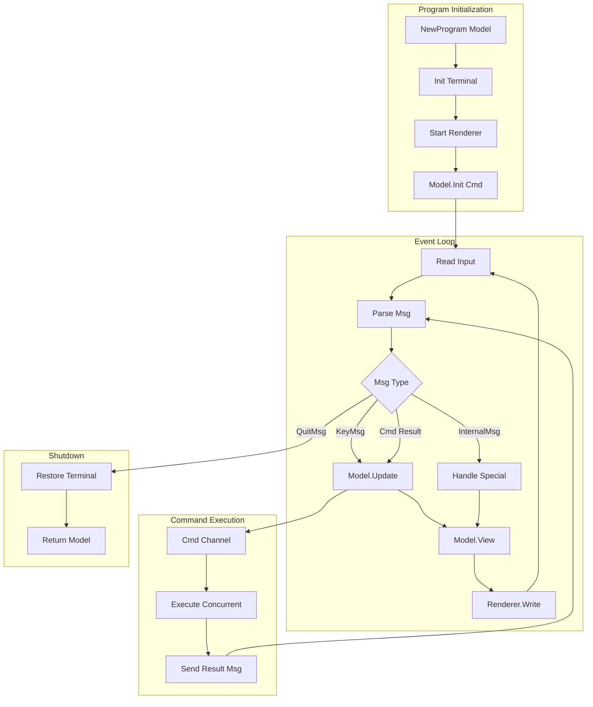

# Bubble Tea: Complete Exploration

## Overview

**Bubble Tea** is a Go framework for building rich terminal user interfaces (TUIs) based on the paradigms of The Elm Architecture. It's battle-tested in production applications like Glow, Gum, Wish, and hundreds of community projects.

### Why This Exploration Exists

This is a **complete textbook** that takes you from zero TUI knowledge to understanding how to build and deploy production terminal applications with Rust/ratatui replication.

### Key Characteristics

| Aspect | Bubble Tea |
|--------|------------|
| **Core Innovation** | Elm Architecture (Model-View-Update) for TUIs |
| **Dependencies** | charmbracelet/x/ansi, muesli/cancelreader, muesli/reflow |
| **Lines of Code** | ~2,500 (core framework), ~5,000 (bubbles components) |
| **Purpose** | Terminal user interface framework |
| **Architecture** | Elm Architecture: Model, View, Update, Commands |
| **Runtime** | Terminal (raw mode, ANSI escape sequences) |
| **Rust Equivalent** | ratatui + crossterm/termion |

---

## Complete Table of Contents

This exploration consists of multiple deep-dive documents. Read them in order for complete understanding:

### Part 1: Foundations
1. **[Zero to TUI Engineer](00-zero-to-tui-engineer.md)** - Start here if new to TUIs
   - Terminal fundamentals
   - ANSI escape sequences
   - Event loops and input handling
   - Raw mode vs cooked mode
   - The Elm Architecture overview

### Part 2: Core Implementation
2. **[Elm Architecture Deep Dive](01-elm-architecture-deep-dive.md)**
   - Model-View-Update pattern
   - Commands and subscriptions
   - Message passing
   - Pure update functions
   - State management

3. **[Rendering Pipeline Deep Dive](02-rendering-pipeline-deep-dive.md)**
   - ANSI escape sequences
   - Frame-based rendering
   - Diff-based optimization
   - Lip Gloss styling
   - Layout composition

4. **[Tea Executor Deep Dive](03-tea-executor-deep-dive.md)**
   - Program loop (Run, eventLoop)
   - Batch commands
   - tea.Cmd execution
   - Concurrent command handling
   - Signal handling

5. **[Bubbles Components Deep Dive](04-bubbletea-components-deep-dive.md)**
   - Spinner, Progress, Textinput
   - List, Table, Viewport
   - Help, Key bindings
   - File picker, Timer, Stopwatch
   - Component composition

### Part 3: Rust Replication
6. **[Rust Revision](rust-revision.md)**
   - Complete Rust translation
   - ratatui comparison
   - Crossterm backend
   - Type system design
   - Code examples

### Part 4: Production
7. **[Production-Grade](production-grade.md)**
   - Performance optimizations
   - Memory management
   - Testing strategies
   - Deployment patterns
   - Observability

8. **[Valtron Integration](05-valtron-integration.md)**
   - TUI backend patterns
   - Lambda deployment considerations
   - No async/tokio approach
   - TaskIterator for TUI events

---

## Quick Reference: Bubble Tea Architecture

### High-Level Flow



### Component Summary

| Component | Lines | Purpose | Deep Dive |
|-----------|-------|---------|-----------|
| Program Core (tea.go) | 900 | Event loop, message handling | [Tea Executor](03-tea-executor-deep-dive.md) |
| Key Handling (key.go) | 550 | Key parsing, sequences | [Zero to TUI](00-zero-to-tui-engineer.md) |
| Mouse Handling (mouse.go) | 400 | Mouse event parsing | [Zero to TUI](00-zero-to-tui-engineer.md) |
| Renderer (standard_renderer.go) | 500 | Frame-based rendering | [Rendering Pipeline](02-rendering-pipeline-deep-dive.md) |
| Commands (commands.go) | 200 | Batch, Sequence, Tick, Every | [Tea Executor](03-tea-executor-deep-dive.md) |
| Bubbles Components | 2,000+ | Reusable UI components | [Components Deep Dive](04-bubbletea-components-deep-dive.md) |
| Lip Gloss | 1,500 | Styling and layout | [Rendering Pipeline](02-rendering-pipeline-deep-dive.md) |

---

## File Structure

### Bubble Tea Core

```
bubbletea/
├── tea.go                      # Program, Run, eventLoop, Model interface
├── commands.go                 # Batch, Sequence, Tick, Every, SetWindowTitle
├── key.go                      # KeyMsg, Key, KeyType, parsing
├── key_sequences.go            # ANSI key sequence parsing
├── mouse.go                    # MouseMsg, mouse event parsing
├── renderer.go                 # Renderer interface
├── standard_renderer.go        # Frame-based renderer implementation
├── screen.go                   # Screen buffer management
├── options.go                  # ProgramOption configurations
├── inputreader_*.go            # Platform-specific input handling
├── signals_unix.go             # Signal handling (SIGINT, SIGTERM)
├── tty.go                      # TTY initialization
├── exec.go                     # Command execution
├── logging.go                  # Debug logging
├── nil_renderer.go             # No-op renderer for testing
│
├── examples/                   # Example programs
│   ├── simple/                 # Basic hello world
│   ├── spinner/                # Spinner component
│   ├── textinput/              # Text input field
│   ├── list-default/           # List component
│   ├── table/                  # Table component
│   ├── progress-animated/      # Progress bar
│   ├── chat/                   # Chat interface
│   ├── pager/                  # Text pager
│   └── ... (25+ examples)
│
├── tutorials/                  # Official tutorials
│   ├── basics/                 # Model, View, Update
│   ├── commands/               # tea.Cmd usage
│   └── delegate/               # Delegation pattern
│
├── README.md
├── go.mod
└── go.sum
```

### Bubbles Components

```
bubbles/
├── textinput/                  # Single-line text input
│   └── textinput.go
├── textarea/                   # Multi-line text area
│   └── textarea.go
├── spinner/                    # Spinner animations
│   └── spinner.go
├── progress/                   # Progress bar
│   └── progress.go
├── list/                       # List with pagination
│   └── list.go
├── table/                      # Tabular data
│   └── table.go
├── viewport/                   # Scrollable content
│   └── viewport.go
├── paginator/                  # Pagination logic
│   └── paginator.go
├── help/                       # Help view generator
│   └── help.go
├── key/                        # Key binding management
│   └── key.go
├── filepicker/                 # File selection
│   └── filepicker.go
├── timer/                      # Countdown timer
│   └── timer.go
├── stopwatch/                  # Elapsed time
│   └── stopwatch.go
├── cursor/                     # Cursor handling
│   └── cursor.go
├── runeutil/                   # Rune utilities
│   └── runeutil.go
│
├── README.md
├── go.mod
└── Taskfile.yaml
```

### Lip Gloss (Styling)

```
lipgloss/
├── style.go                    # Style type, rules
├── set.go                      # Setter methods
├── get.go                      # Getter methods
├── unset.go                    # Unsetter methods
├── color.go                    # Color handling
├── borders.go                  # Border styles
├── align.go                    # Text alignment
├── position.go                 # Positioning
├── join.go                     # Join paragraphs
├── whitespace.go               # Whitespace handling
├── renderer.go                 # Custom renderers
├── runes.go                    # Rune utilities
│
├── README.md
└── go.mod
```

---

## The Elm Architecture for TUIs

### Core Pattern

```
                    ┌─────────────────┐
                    │      Model      │
                    │  (Application   │
                    │     State)      │
                    └────────┬────────┘
                             │
                             │ View()
                             ▼
                    ┌─────────────────┐
                    │  View: String   │
                    │  (ANSI Output)  │
                    └─────────────────┘
                             │
                             │ Rendered to Terminal
                             │
                             ▼
                    ┌─────────────────┐
                    │    User Input   │
                    │  (Key, Mouse)   │
                    └────────┬────────┘
                             │
                             │ Parsed as Msg
                             ▼
                    ┌─────────────────┐
                    │  Update(Model,  │
                    │         Msg) →  │
                    │    (Model, Cmd) │
                    └─────────────────┘
                             │
                             │ Model becomes new Model
                             │ Cmd executes asynchronously
                             └──→ Returns Msg when done
```

### Model Interface

```go
type Model interface {
    // Init is the first function called. Returns optional initial command.
    Init() Cmd

    // Update is called when a message is received.
    // Returns updated model and optional command.
    Update(Msg) (Model, Cmd)

    // View renders the program's UI as a string.
    View() string
}
```

### Message Types

```go
// Messages trigger update and henceforth the UI
type Msg interface{}

// Common built-in message types:
type KeyMsg Key          // Key press events
type MouseMsg MouseEvent // Mouse events
type QuitMsg struct{}    // Quit signal
type WindowSizeMsg struct{} // Terminal resize
```

### Commands

```go
// Cmd is an IO operation that returns a message when complete
type Cmd func() Msg

// Examples:
// - HTTP requests
// - File I/O
// - Timers
// - Database queries
// - Spawning subprocesses
```

---

## Key Insights

### 1. Elm Architecture Benefits for TUIs

| Benefit | Description | Why It Matters for TUIs |
|---------|-------------|------------------------|
| **Pure Update** | `Update` is a pure function | Deterministic, testable, debuggable |
| **Explicit State** | Model contains all state | No hidden state, easy serialization |
| **Message-Driven** | All changes via messages | Clear event sourcing, replay possible |
| **Command Effects** | Side effects isolated to Cmd | Clean separation of concerns |
| **Composability** | Models can contain sub-models | Reusable components (bubbles) |

### 2. Frame-Based Rendering

Bubble Tea uses a framerate-based renderer (default 60 FPS):

```go
// standard_renderer.go
const (
    defaultFPS = 60
    maxFPS     = 120
)

func (r *standardRenderer) listen() {
    for {
        select {
        case <-r.done:
            return
        case <-r.ticker.C:
            r.flush() // Render at controlled framerate
        }
    }
}
```

**Why this matters:**
- Prevents terminal overload from rapid updates
- Enables smooth animations
- Reduces flicker with diff-based rendering

### 3. Diff-Based Optimization

The renderer only updates changed lines:

```go
func (r *standardRenderer) flush() {
    // Compare new lines with last rendered lines
    for i := 0; i < len(newLines); i++ {
        canSkip := len(r.lastRenderedLines) > i &&
                   r.lastRenderedLines[i] == newLines[i]

        if canSkip {
            continue // Skip unchanged lines
        }
        // Render only changed lines
    }
    r.lastRenderedLines = newLines
}
```

### 4. Lip Gloss Styling

Lip Gloss provides CSS-like styling for terminals:

```go
var style = lipgloss.NewStyle().
    Bold(true).
    Foreground(lipgloss.Color("#FAFAFA")).
    Background(lipgloss.Color("#7D56F4")).
    PaddingTop(2).
    PaddingLeft(4).
    Width(22).
    BorderStyle(lipgloss.RoundedBorder()).
    BorderForeground(lipgloss.Color("63"))

fmt.Println(style.Render("Hello, kitty"))
```

### 5. Component Composition

Bubbles components compose cleanly:

```go
type Model struct {
    spinner    spinner.Model
    textinput  textinput.Model
    list       list.Model
    viewport   viewport.Model
}

func (m Model) Update(msg tea.Msg) (tea.Model, tea.Cmd) {
    var cmd tea.Cmd

    m.spinner, cmd = m.spinner.Update(msg)
    cmds = append(cmds, cmd)

    m.textinput, cmd = m.textinput.Update(msg)
    cmds = append(cmds, cmd)

    return m, tea.Batch(cmds...)
}
```

---

## From Bubble Tea to Real TUI Systems

| Aspect | Bubble Tea | Production TUI Systems |
|--------|------------|----------------------|
| **Architecture** | Elm Architecture | MVU + Event Sourcing |
| **Rendering** | Frame-based, diff | Direct buffer, GPU accel |
| **State** | In-memory Model | Persistent + sync |
| **Scale** | Single terminal | Multi-terminal, remote |
| **Input** | Local keyboard/mouse | SSH, WebSocket, HTTP |
| **Color** | ANSI 16/256/True | True color, HDR |

**Key takeaway:** The Elm Architecture scales well, but production systems need persistence, remote rendering, and multi-user support.

---

## Your Path Forward

### To Build TUI Skills

1. **Start simple:** Build a counter app with Model-View-Update
2. **Add input:** Handle keypresses and mouse clicks
3. **Use bubbles:** Integrate textinput, list, spinner components
4. **Style with lipgloss:** Add colors, borders, layouts
5. **Build real apps:** Clone existing tools (htop, less, etc.)
6. **Translate to Rust:** Learn ratatui patterns

### Recommended Resources

- [Bubble Tea Tutorials](https://github.com/charmbracelet/bubbletea/tree/master/tutorials)
- [Bubbles Examples](https://github.com/charmbracelet/bubbles/tree/master/examples)
- [Lip Gloss Documentation](https://github.com/charmbracelet/lipgloss)
- [Charm Community](https://github.com/charm-and-friends)
- [ratatui Documentation](https://ratatui.rs/) (Rust equivalent)

---

## Comparison: Bubble Tea vs Ratatui

| Aspect | Bubble Tea (Go) | Ratatui (Rust) |
|--------|-----------------|----------------|
| **Architecture** | Elm Architecture | Elm Architecture |
| **Backend** | Built-in renderer | Crossterm, Termion, etc. |
| **Styling** | Lip Gloss (built-in) | tui-rs style, ratatui styling |
| **Components** | Bubbles (official) | ratatui-ui, tui-react |
| **Type System** | Go interfaces | Rust traits, enums |
| **Memory Safety** | GC | Ownership, borrow checker |
| **Performance** | Good | Excellent |
| **Concurrency** | Goroutines, channels | async/await, threads |
| **Learning Curve** | Gentle | Steeper (Rust) |

---

## Document History

| Date | Change |
|------|--------|
| 2026-03-27 | Initial exploration created |
| 2026-03-27 | Deep dives 00-05 outlined |
| 2026-03-27 | Rust revision and production-grade planned |

---

*This exploration is a living document. Revisit sections as concepts become clearer through implementation.*
