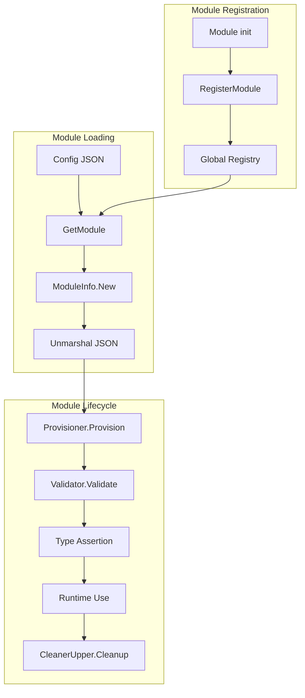
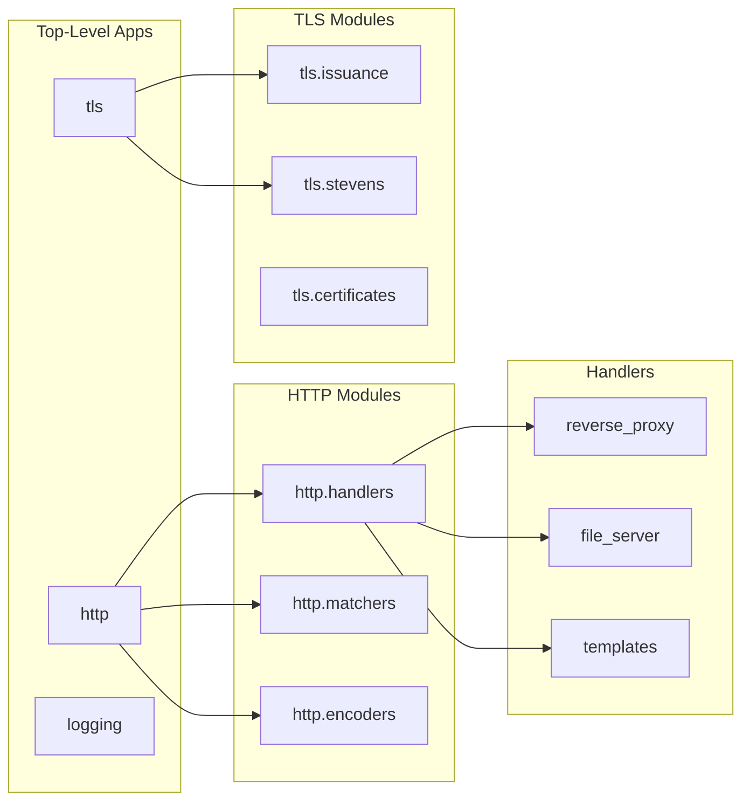

# Module System Deep Dive

**Location:** `/home/darkvoid/Boxxed/@dev/repo-expolorations/caddy/caddy/`
**Source:** `modules.go`, `caddy.go`, `context.go`
**Focus:** Caddy's plugin architecture, module registration, lifecycle

---

## Table of Contents

1. [Module System Overview](#1-module-system-overview)
2. [Module Registration](#2-module-registration)
3. [Module Lifecycle](#3-module-lifecycle)
4. [Module Namespaces and IDs](#4-module-namespaces-and-ids)
5. [Loading Modules](#5-loading-modules)
6. [Building Custom Modules](#6-building-custom-modules)
7. [Module Patterns in Rust](#7-module-patterns-in-rust)

---

## 1. Module System Overview

### 1.1 Why a Module System?

Caddy's architecture is built entirely around modules. **Everything** in Caddy is a module:

```
HTTP handlers      -> modules
TLS issuers        -> modules
Log encoders       -> modules
Storage backends   -> modules
Config adapters    -> modules
```

**Benefits:**
1. **Extensibility**: Add functionality without modifying core
2. **Composability**: Mix and match modules
3. **Testability**: Modules are isolated and testable
4. **Discoverability**: Modules self-register with metadata

### 1.2 High-Level Architecture



### 1.3 Core Interfaces

```go
// From modules.go - The base Module interface
type Module interface {
    CaddyModule() ModuleInfo
}

// ModuleInfo contains module metadata
type ModuleInfo struct {
    ID  ModuleID      // Unique identifier: "http.handlers.reverse_proxy"
    New func() Module // Constructor function
}

// Optional interfaces modules can implement
type Provisioner interface {
    Provision(ctx Context)
}

type Validator interface {
    Validate() error
}

type CleanerUpper interface {
    Cleanup() error
}
```

---

## 2. Module Registration

### 2.1 Registration Mechanism

Modules register themselves in their `init()` function:

```go
// From modules/caddyhttp/reverseproxy/reverseproxy.go
func init() {
    caddy.RegisterModule(Handler{})
}

// Handler implements the reverse proxy handler
type Handler struct {
    TransportRaw        json.RawMessage `json:"transport,omitempty"`
    LoadBalancing       *LoadBalancing  `json:"load_balancing,omitempty"`
    HealthChecks        *HealthChecks   `json:"health_checks,omitempty"`
    Upstreams           UpstreamPool    `json:"upstreams,omitempty"`
    // ... many more fields
}

func (Handler) CaddyModule() caddy.ModuleInfo {
    return caddy.ModuleInfo{
        ID:  "http.handlers.reverse_proxy",
        New: func() caddy.Module { return new(Handler) },
    }
}
```

### 2.2 The Global Registry

```go
// From modules.go
var (
    modules   = make(map[string]ModuleInfo)
    modulesMu sync.RWMutex
)

// RegisterModule registers a module by its info.
// This should be called in init() and panics on error.
func RegisterModule(instance Module) {
    mod := instance.CaddyModule()

    // Validation
    if mod.ID == "" {
        panic("module ID missing")
    }
    if mod.ID == "caddy" || mod.ID == "admin" {
        panic(fmt.Sprintf("module ID '%s' is reserved", mod.ID))
    }
    if mod.New == nil {
        panic("missing ModuleInfo.New")
    }
    if val := mod.New(); val == nil {
        panic("ModuleInfo.New must return a non-nil module instance")
    }

    // Thread-safe registration
    modulesMu.Lock()
    defer modulesMu.Unlock()

    if _, ok := modules[string(mod.ID)]; ok {
        panic(fmt.Sprintf("module already registered: %s", mod.ID))
    }
    modules[string(mod.ID)] = mod
}
```

### 2.3 Module Discovery

```go
// GetModule retrieves a module by its ID
func GetModule(name string) (ModuleInfo, error) {
    modulesMu.RLock()
    defer modulesMu.RUnlock()

    m, ok := modules[name]
    if !ok {
        return ModuleInfo{}, fmt.Errorf("module not registered: %s", name)
    }
    return m, nil
}

// GetModules returns all modules in a namespace
func GetModules(scope string) []ModuleInfo {
    modulesMu.RLock()
    defer modulesMu.RUnlock()

    var result []ModuleInfo
    for _, mod := range modules {
        if mod.ID.Namespace() == scope {
            result = append(result, mod)
        }
    }
    return result
}

// Example: Get all HTTP handler modules
handlers := GetModules("http.handlers")
// Returns: http.handlers.reverse_proxy, http.handlers.file_server, etc.
```

---

## 3. Module Lifecycle

### 3.1 The Complete Lifecycle

```
1. Registration (init)
   RegisterModule(Handler{})

2. Instantiation (config load)
   module := ModuleInfo.New()

3. Unmarshaling (config load)
   json.Unmarshal(configJSON, &module)

4. Provisioning (startup)
   module.(Provisioner).Provision(ctx)

5. Validation (startup, optional)
   module.(Validator).Validate()

6. Type Assertion (for use)
   handler := module.(MiddlewareHandler)

7. Runtime Use (handling requests)
   handler.ServeHTTP(w, r, next)

8. Cleanup (shutdown/reload)
   module.(CleanerUpper).Cleanup()
```

### 3.2 Provisioning

```go
// From caddy.go - How modules are provisioned
func (ctx Context) LoadModule(target any, fieldName string) (any, error) {
    // 1. Get the raw JSON for the module
    jsonVal := reflect.ValueOf(target).Elem().FieldByName(fieldName)
    if !jsonVal.IsValid() {
        return nil, fmt.Errorf("field %s does not exist", fieldName)
    }

    rawJSON := jsonVal.Bytes()

    // 2. Determine module type from JSON
    var moduleType string
    json.Unmarshal(rawJSON, &moduleType) // from "handler" or "module" key

    // 3. Get module info from registry
    modInfo, err := GetModule(moduleType)
    if err != nil {
        return nil, err
    }

    // 4. Create new instance
    instance := modInfo.New()

    // 5. Unmarshal config into instance
    json.Unmarshal(rawJSON, instance)

    // 6. Call Provision if implemented
    if prov, ok := instance.(Provisioner); ok {
        prov.Provision(ctx)
    }

    // 7. Call Validate if implemented
    if val, ok := instance.(Validator); ok {
        if err := val.Validate(); err != nil {
            return nil, err
        }
    }

    return instance, nil
}
```

### 3.3 Provision Example

```go
// From modules/caddyhttp/reverseproxy/reverseproxy.go
func (h *Handler) Provision(ctx caddy.Context) error {
    h.ctx = ctx
    h.logger = ctx.Logger(h)
    h.events = h.ctx.AppIfConfigured("events").(*caddyevents.App)

    // 1. Load transport module
    if h.TransportRaw != nil {
        val, err := ctx.LoadModule(h, "TransportRaw")
        if err != nil {
            return fmt.Errorf("loading transport: %v", err)
        }
        h.Transport = val.(http.RoundTripper)
    }

    // 2. Set default transport if none specified
    if h.Transport == nil {
        h.Transport = &http.Transport{
            Proxy: http.ProxyFromEnvironment,
            DialContext: (&net.Dialer{
                Timeout:   30 * time.Second,
                KeepAlive: 30 * time.Second,
            }).DialContext,
        }
    }

    // 3. Load circuit breaker
    if h.CBRaw != nil {
        val, err := ctx.LoadModule(h, "CBRaw")
        if err != nil {
            return err
        }
        h.CB = val.(CircuitBreaker)
    }

    // 4. Load dynamic upstreams
    if h.DynamicUpstreamsRaw != nil {
        val, err := ctx.LoadModule(h, "DynamicUpstreamsRaw")
        if err != nil {
            return err
        }
        h.DynamicUpstreams = val.(UpstreamSource)
    }

    // 5. Provision load balancing
    if h.LoadBalancing != nil {
        h.LoadBalancing.Provision(ctx)
    }

    // 6. Provision health checks
    if h.HealthChecks != nil {
        h.HealthChecks.Provision(ctx, h)
    }

    // 7. Provision upstreams
    for _, u := range h.Upstreams {
        u.provision()
    }

    return nil
}
```

### 3.4 Cleanup

```go
// From modules/caddyhttp/reverseproxy/reverseproxy.go
func (h *Handler) Cleanup() error {
    // Close idle connections
    if transport, ok := h.Transport.(*http.Transport); ok {
        transport.CloseIdleConnections()
    }

    // Stop health checkers
    if h.HealthChecks != nil {
        h.HealthChecks.Stop()
    }

    // Close hijacked connections (WebSockets)
    h.connectionsMu.Lock()
    for conn := range h.connections {
        conn.Close()
    }
    h.connectionsMu.Unlock()

    return nil
}
```

---

## 4. Module Namespaces and IDs

### 4.1 Module ID Structure

```
Format: <namespace>.<subnamespace>.<name>

Examples:
- http                          (top-level app)
- tls                           (top-level app)
- http.handlers.reverse_proxy   (HTTP handler module)
- http.handlers.file_server     (HTTP handler module)
- http.matchers.path            (HTTP matcher module)
- tls.issuance.acme             (TLS issuer module)
- caddy.storage.file_system     (Storage module)
```

### 4.2 Namespace Hierarchy



### 4.3 Module Maps

Module maps allow multiple modules in a single field:

```go
// From caddy.go
// ModuleMap is a map where key is module name, value is config
type ModuleMap map[string]json.RawMessage

// Example usage in TLS app
type TLS struct {
    // Certificate modules: key is cert name
    CertificatesRaw ModuleMap `json:"certificates,omitempty" caddy:"namespace=tls.certificates"`

    // Automation policy issuers: array of modules
    AutomationPolicies []*AutomationPolicy `json:"automation,omitempty"`
}

// In AutomationPolicy
type AutomationPolicy struct {
    // Issuers can be multiple modules tried in order
    IssuersRaw []json.RawMessage `json:"issuers,omitempty" caddy:"namespace=tls.issuance"`
}
```

### 4.4 Struct Tags for Module Loading

```go
// Struct tags tell LoadModule how to find module info
type Handler struct {
    // namespace=http.handlers - look in this namespace
    // inline_key=handler - the "handler" key contains module name
    TransportRaw json.RawMessage `json:"transport,omitempty" caddy:"namespace=http.handlers inline_key=protocol"`

    // No namespace - top-level modules
    // inline_key=module - the "module" key contains module name
    StorageRaw json.RawMessage `json:"storage,omitempty" caddy:"namespace=caddy.storage inline_key=module"`

    // Empty namespace for module maps (keys are module names)
    AppsRaw ModuleMap `json:"apps,omitempty" caddy:"namespace="`
}
```

---

## 5. Loading Modules

### 5.1 Context and Module Loading

```go
// From context.go
type Context struct {
    context.Context
    cfg   *Config
    ctx   context.Context
    apps  map[string]App
    storage certmagic.Storage
    // ...
}

// LoadModule loads a module from a struct field
func (ctx Context) LoadModule(target any, fieldName string) (any, error) {
    // Implementation as shown in section 3.2
}

// App loads a top-level app module
func (ctx Context) App(name string) (any, error) {
    if app, ok := ctx.apps[name]; ok {
        return app, nil
    }
    return nil, fmt.Errorf("app not started: %s", name)
}

// AppIfConfigured returns app if it was configured, nil otherwise
func (ctx Context) AppIfConfigured(name string) (any, error) {
    if app, ok := ctx.apps[name]; ok {
        return app, nil
    }
    // Check if app was configured at all
    if _, ok := ctx.cfg.AppsRaw[name]; !ok {
        return nil, nil // Not configured, not an error
    }
    return nil, fmt.Errorf("app not configured: %s", name)
}
```

### 5.2 Loading Arrays of Modules

```go
// From modules/caddytls/tls.go - Loading multiple issuers
func (ap *AutomationPolicy) Provision(tlsApp *TLS) error {
    // Load all configured issuers
    if ap.IssuersRaw != nil {
        for i, issuerJSON := range ap.IssuersRaw {
            // Get module type
            var raw struct {
                Module string `json:"module"`
            }
            json.Unmarshal(issuerJSON, &raw)

            // Load the module
            val, err := tlsApp.ctx.LoadModule(ap, "IssuersRaw")
            if err != nil {
                return fmt.Errorf("loading issuer[%d]: %v", i, err)
            }

            // Append to issuers list
            ap.Issuers = append(ap.Issuers, val.(certmagic.Issuer))
        }
    }

    // Default to ACME if no issuers specified
    if len(ap.Issuers) == 0 {
        ap.Issuers = []certmagic.Issuer{
            &ACMEIssuer{CA: "https://acme-v02.api.letsencrypt.org/directory"},
        }
    }

    return nil
}
```

### 5.3 Module Type Assertions

```go
// After loading, modules are type-asserted to useful interfaces

// From modules/caddyhttp/server.go
func (s *Server) provisionHandlers(ctx caddy.Context) error {
    for _, route := range s.Routes {
        // Load handler modules
        handlersIface, err := ctx.LoadModule(&route, "HandlersRaw")
        if err != nil {
            return err
        }

        // Type assert to MiddlewareHandler
        for _, handler := range handlersIface.([]any) {
            midHandler := handler.(MiddlewareHandler)
            route.Handlers = append(route.Handlers, midHandler)
        }
    }
    return nil
}

// MiddlewareHandler is what HTTP handlers must implement
type MiddlewareHandler interface {
    ServeHTTP(http.ResponseWriter, *http.Request, Handler) error
}
```

---

## 6. Building Custom Modules

### 6.1 Custom HTTP Handler

```go
// myhandler/handler.go
package myhandler

import (
    "net/http"
    "encoding/json"
    "github.com/caddyserver/caddy/v2"
    "github.com/caddyserver/caddy/v2/modules/caddyhttp"
)

func init() {
    caddy.RegisterModule(HelloHandler{})
}

// HelloHandler is a simple handler that returns JSON
type HelloHandler struct {
    Message string `json:"message,omitempty"`
    logger  *zap.Logger
}

func (HelloHandler) CaddyModule() caddy.ModuleInfo {
    return caddy.ModuleInfo{
        ID:  "http.handlers.hello",
        New: func() caddy.Module { return new(HelloHandler) },
    }
}

// Provision is called during setup
func (h *HelloHandler) Provision(ctx caddy.Context) error {
    h.logger = ctx.Logger(h)
    if h.Message == "" {
        h.Message = "Hello, World!"
    }
    return nil
}

// ServeHTTP handles the request
func (h HelloHandler) ServeHTTP(w http.ResponseWriter, r *http.Request, next caddyhttp.Handler) error {
    h.logger.Debug("handling request", zap.String("path", r.URL.Path))

    response := map[string]string{
        "message": h.Message,
        "path":    r.URL.Path,
        "method":  r.Method,
    }

    w.Header().Set("Content-Type", "application/json")
    return json.NewEncoder(w).Encode(response)
}

// Ensure we implement the interface
var _ caddyhttp.MiddlewareHandler = (*HelloHandler)(nil)
```

### 6.2 Custom Matcher

```go
// mymatcher/matcher.go
package mymatcher

import (
    "net/http"
    "strings"
    "github.com/caddyserver/caddy/v2"
    "github.com/caddyserver/caddy/v2/modules/caddyhttp"
)

func init() {
    caddy.RegisterModule(HeaderMatcher{})
}

// HeaderMatcher matches requests with specific headers
type HeaderMatcher struct {
    // Header name to match
    Header string `json:"header"`
    // Value must contain this substring
    Contains string `json:"contains"`
}

func (HeaderMatcher) CaddyModule() caddy.ModuleInfo {
    return caddy.ModuleInfo{
        ID:  "http.matchers.header_contains",
        New: func() caddy.Module { return new(HeaderMatcher) },
    }
}

// Match returns true if request matches
func (m HeaderMatcher) Match(r *http.Request) bool {
    value := r.Header.Get(m.Header)
    return strings.Contains(value, m.Contains)
}

var _ caddyhttp.RequestMatcher = (*HeaderMatcher)(nil)
```

### 6.3 Custom TLS Issuer

```go
// myissuer/issuer.go
package myissuer

import (
    "context"
    "crypto/x509"
    "github.com/caddyserver/caddy/v2"
    "github.com/caddyserver/certmagic"
)

func init() {
    caddy.RegisterModule(MyIssuer{})
}

// MyIssuer implements custom certificate issuance
type MyIssuer struct {
    APIEndpoint string `json:"api_endpoint"`
    APIKey      string `json:"api_key"`
}

func (MyIssuer) CaddyModule() caddy.ModuleInfo {
    return caddy.ModuleInfo{
        ID:  "tls.issuance.my_issuer",
        New: func() caddy.Module { return new(MyIssuer) },
    }
}

func (i *MyIssuer) Provision(ctx caddy.Context) error {
    // Validate configuration
    if i.APIEndpoint == "" {
        return fmt.Errorf("api_endpoint is required")
    }
    return nil
}

// Issuer implements certmagic.Issuer
var _ certmagic.Issuer = (*MyIssuer)(nil)

func (i *MyIssuer) Issue(ctx context.Context, request certmagic.IssuanceRequest) (*certmagic.Certificate, error) {
    // Call your custom certificate API
    cert, key, err := i.fetchCertificate(request.SANs)
    if err != nil {
        return nil, err
    }

    // Parse and return certificate
    tlsCert, err := tls.X509KeyPair(cert, key)
    if err != nil {
        return nil, err
    }

    return &certmagic.Certificate{
        Certificate: tlsCert,
    }, nil
}

func (i *MyIssuer) Revoke(ctx context.Context, cert *certmagic.Certificate) error {
    // Implement revocation logic
    return nil
}
```

### 6.4 Using Your Custom Module

**Caddyfile:**
```caddyfile
example.com {
    # Your custom handler
    hello {
        message "Custom greeting!"
    }

    # With custom matcher
    @mobile header_contains {
        header User-Agent
        contains Mobile
    }
    handle @mobile {
        hello {
            message "Hello mobile user!"
        }
    }

    respond "Hello desktop!"
}
```

**JSON Config:**
```json
{
  "apps": {
    "http": {
      "servers": {
        "srv0": {
          "listen": [":443"],
          "routes": [
            {
              "handle": [
                {
                  "handler": "hello",
                  "message": "Custom greeting!"
                }
              ]
            }
          ]
        }
      }
    }
  }
}
```

---

## 7. Module Patterns in Rust

### 7.1 Module Trait in Rust

```rust
// From rust-revision.md - Module system translation

use std::any::Any;
use std::collections::HashMap;
use std::sync::{Arc, RwLock};

/// Module ID like Caddy's: "http.handlers.reverse_proxy"
#[derive(Debug, Clone, Hash, PartialEq, Eq)]
pub struct ModuleId(String);

impl ModuleId {
    pub fn namespace(&self) -> &str {
        self.0.rsplit_once('.').map(|(ns, _)| ns).unwrap_or("")
    }

    pub fn name(&self) -> &str {
        self.0.rsplit_once('.').map(|(_, name)| name).unwrap_or(&self.0)
    }
}

/// Module trait - all modules implement this
pub trait Module: Send + Sync {
    fn module_id(&self) -> ModuleId;
    fn as_any(&self) -> &dyn Any;
    fn as_any_mut(&mut self) -> &mut dyn Any;
}

/// Optional: Provisioning
pub trait Provisioner: Module {
    fn provision(&mut self, ctx: &Context) -> Result<(), ModuleError>;
}

/// Optional: Validation
pub trait Validator: Module {
    fn validate(&self) -> Result<(), ModuleError>;
}

/// Optional: Cleanup
pub trait CleanerUpper: Module {
    fn cleanup(&mut self) -> Result<(), ModuleError>;
}
```

### 7.2 Module Registry

```rust
/// Module constructor function
type ModuleConstructor = Box<dyn Fn() -> Box<dyn Module> + Send + Sync>;

/// Global module registry
pub struct ModuleRegistry {
    modules: RwLock<HashMap<ModuleId, ModuleConstructor>>,
}

impl ModuleRegistry {
    pub fn register<M: Module + Default + 'static>(&self) {
        let id = M::default().module_id();
        let constructor = Box::new(|| Box::new(M::default()));

        let mut modules = self.modules.write().unwrap();
        if modules.contains_key(&id) {
            panic!("Module already registered: {}", id.0);
        }
        modules.insert(id, constructor);
    }

    pub fn get(&self, id: &ModuleId) -> Option<Box<dyn Module>> {
        let modules = self.modules.read().unwrap();
        modules.get(id).map(|ctor| ctor())
    }

    pub fn get_modules_in_namespace(&self, namespace: &str) -> Vec<ModuleId> {
        let modules = self.modules.read().unwrap();
        modules
            .keys()
            .filter(|id| id.namespace() == namespace)
            .cloned()
            .collect()
    }
}

// Global registry instance
static REGISTRY: OnceLock<ModuleRegistry> = OnceLock::new();

pub fn get_registry() -> &'static ModuleRegistry {
    REGISTRY.get_or_init(ModuleRegistry::new)
}
```

### 7.3 Context and Module Loading

```rust
/// Context for module loading (like Caddy's Context)
pub struct Context {
    apps: HashMap<String, Arc<dyn Module>>,
    storage: Arc<dyn Storage>,
    logger: Logger,
}

impl Context {
    /// Load a module from configuration
    pub fn load_module<M: Module + 'static>(
        &self,
        config: &serde_json::Value,
    ) -> Result<Arc<M>, ModuleError> {
        // Extract module type from config
        let module_type = config["module"]
            .as_str()
            .ok_or(ModuleError::MissingModuleType)?;

        let module_id = ModuleId(module_type.to_string());

        // Get module from registry
        let registry = get_registry();
        let mut module = registry
            .get(&module_id)
            .ok_or_else(|| ModuleError::NotFound(module_id.0.clone()))?;

        // Deserialize configuration into module
        let module_any = module.as_any_mut();
        let concrete = module_any
            .downcast_mut::<M>()
            .ok_or(ModuleError::TypeMismatch)?;

        // Provision the module
        if let Some(provisioner) = concrete.as_any_mut().downcast_mut::<dyn Provisioner>() {
            provisioner.provision(self)?;
        }

        // Validate
        if let Some(validator) = concrete.as_any().downcast_ref::<dyn Validator>() {
            validator.validate()?;
        }

        Ok(Arc::new(M::from(concrete)))
    }

    /// Get a loaded app
    pub fn app<A: Module + 'static>(&self, name: &str) -> Option<Arc<A>> {
        self.apps.get(name).and_then(|m| {
            m.as_any().downcast_ref::<A>().map(Arc::clone)
        })
    }
}
```

### 7.4 HTTP Handler Module in Rust

```rust
use http::{Request, Response};

/// HTTP Middleware Handler trait
pub trait HttpHandler: Module {
    fn serve_http(
        &self,
        req: Request<Body>,
        next: Next,
    ) -> impl Future<Output = Result<Response<Body>, HandlerError>> + Send;
}

/// Example: Hello Handler
#[derive(Debug, Default)]
pub struct HelloHandler {
    message: String,
}

impl Module for HelloHandler {
    fn module_id(&self) -> ModuleId {
        ModuleId("http.handlers.hello".to_string())
    }

    fn as_any(&self) -> &dyn Any {
        self
    }

    fn as_any_mut(&mut self) -> &mut dyn Any {
        self
    }
}

impl Provisioner for HelloHandler {
    fn provision(&mut self, ctx: &Context) -> Result<(), ModuleError> {
        if self.message.is_empty() {
            self.message = "Hello, World!".to_string();
        }
        Ok(())
    }
}

impl HttpHandler for HelloHandler {
    async fn serve_http(&self, req: Request<Body>, _next: Next) -> Result<Response<Body>, HandlerError> {
        let body = serde_json::json!({
            "message": self.message,
            "path": req.uri().path().to_string(),
        });

        Ok(Response::builder()
            .status(200)
            .header("Content-Type", "application/json")
            .body(Body::from(body.to_string()))
            .unwrap())
    }
}

// Register the module
inventory::submit! {
    ModuleRegistration::new("http.handlers.hello", || Box::new(HelloHandler::default()))
}
```

### 7.5 Module Macros

```rust
// Macro for easy module registration
#[macro_export]
macro_rules! register_module {
    ($type:ty, $id:expr) => {
        impl $crate::module::Module for $type {
            fn module_id(&self) -> $crate::module::ModuleId {
                $crate::module::ModuleId($id.to_string())
            }

            fn as_any(&self) -> &dyn std::any::Any {
                self
            }

            fn as_any_mut(&mut self) -> &mut dyn std::any::Any {
                self
            }
        }

        $crate::inventory::submit! {
            $crate::module::ModuleRegistration::new(
                $id,
                || Box::new(<$type>::default())
            )
        }
    };
}

// Usage
pub struct MyHandler {
    config: MyConfig,
}

register_module!(MyHandler, "http.handlers.my_handler");
```

---

## Summary

### Key Takeaways

1. **Everything is a module**: Handlers, matchers, issuers, storage - all use the same registration/loading pattern
2. **Registration is global**: Modules register in `init()`, loaded on-demand from config
3. **Lifecycle is predictable**: Provision -> Validate -> Use -> Cleanup
4. **Namespaces organize**: `http.handlers`, `tls.issuance`, etc.
5. **Type assertions enable use**: Load as `any`, assert to specific interface

### Module Patterns

| Pattern | Go | Rust |
|---------|-----|------|
| Registration | `init()` + `RegisterModule` | `inventory` crate or `OnceLock` |
| Constructor | `func() Module` | `Box<dyn Fn() -> Box<dyn Module>>` |
| Provisioning | `Provision(ctx)` | `provision(&ctx) -> Result` |
| Validation | `Validate() error` | `validate() -> Result` |
| Type erasure | `any` interface | `dyn Any` trait object |

### From Module System to ewe_platform

For the ewe_platform Rust translation:
1. Use trait objects for module interfaces
2. Global registry with thread-safe access
3. Context for dependency injection
4. Provision/Validate/Cleanup lifecycle
5. Module IDs for discovery

---

*Continue with [TLS Automation Deep Dive](02-tls-automation-deep-dive.md) for ACME protocol details.*
