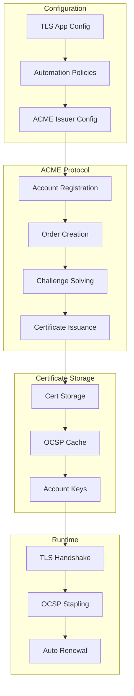
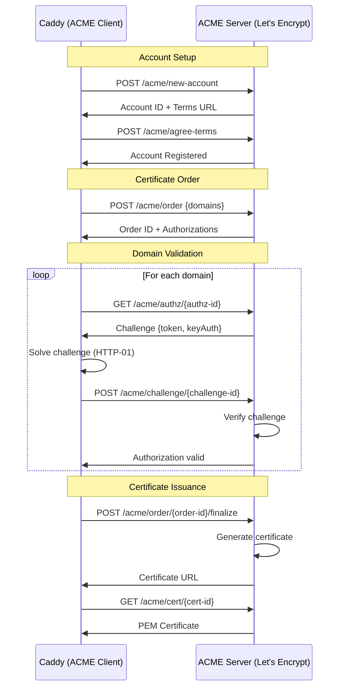

# TLS Automation Deep Dive

**Location:** `/home/darkvoid/Boxxed/@dev/repo-expolorations/caddy/caddy/`
**Source:** `modules/caddytls/acmeissuer.go`, `automation.go`, `tls.go`, `connpolicy.go`
**Focus:** ACME protocol, Let's Encrypt, certificate lifecycle management

---

## Table of Contents

1. [TLS Automation Overview](#1-tls-automation-overview)
2. [ACME Protocol Fundamentals](#2-acme-protocol-fundamentals)
3. [Certificate Lifecycle](#3-certificate-lifecycle)
4. [ACME Issuer Implementation](#4-acme-issuer-implementation)
5. [Challenge Types](#5-challenge-types)
6. [Certificate Storage](#6-certificate-storage)
7. [OCSP Stapling](#7-ocsp-stapling)
8. [On-Demand TLS](#8-on-demand-tls)
9. [Rust Translation](#9-rust-translation)

---

## 1. TLS Automation Overview

### 1.1 The Problem Caddy Solves

Before automatic HTTPS:
```
1. Generate private key
2. Create CSR (Certificate Signing Request)
3. Prove domain ownership (manual DNS/file upload)
4. Download certificate from CA
5. Install on server
6. Remember to renew in 90 days
7. Repeat forever...
```

**Caddy's solution:**
```
1. Start Caddy with domain name
2. Caddy automatically:
   - Generates key pair
   - Registers ACME account
   - Completes challenges
   - Obtains certificate
   - Renews before expiry
   - Staples OCSP responses
```

### 1.2 Architecture Overview



### 1.3 Key Components

| Component | File | Purpose |
|-----------|------|---------|
| TLS App | `tls.go` | Top-level TLS configuration |
| AutomationPolicy | `automation.go` | Rules for certificate management |
| ACMEIssuer | `acmeissuer.go` | ACME protocol implementation |
| ConnectionPolicy | `connpolicy.go` | TLS connection settings |
| certmagic | External | Core ACME/certificate library |

---

## 2. ACME Protocol Fundamentals

### 2.1 ACME RFC 8555 Overview

ACME (Automatic Certificate Management Environment) is defined in RFC 8555.

**Key Concepts:**
- **Directory**: Entry point to ACME server
- **Account**: Registered user with key pair
- **Order**: Request for certificate
- **Authorization**: Permission to issue for domain
- **Challenge**: Proof of domain control
- **Certificate**: Final issued certificate

### 2.2 ACME Message Flow



### 2.3 ACME Directory Structure

```json
{
  "newNonce": "https://acme-v02.api.letsencrypt.org/acme/newNonce",
  "newAccount": "https://acme-v02.api.letsencrypt.org/acme/new-account",
  "newOrder": "https://acme-v02.api.letsencrypt.org/acme/new-order",
  "revokeCert": "https://acme-v02.api.letsencrypt.org/acme/revoke-cert",
  "keyChange": "https://acme-v02.api.letsencrypt.org/acme/key-change",
  "meta": {
    "termsOfService": "https://letsencrypt.org/documents/LE-SA-v1.3.pdf",
    "website": "https://letsencrypt.org",
    "caaIdentities": ["letsencrypt.org"]
  }
}
```

---

## 3. Certificate Lifecycle

### 3.1 Certificate Timeline

```
Day 0: Certificate Issued
       |
       |  (Certificate is valid)
       |
Day 30: Renewal Check ( certs older than 30 days checked)
       |
Day 60: Auto Renewal Trigger (1/3 lifetime remaining)
       |
       |  (Old cert still works, new cert obtained)
       |
Day 90: Original Certificate Expires
```

### 3.2 Renewal Logic

```go
// From modules/caddytls/automation.go
// When to renew a certificate

const (
    DefaultRenewalWindowRatio = 0.33  // Renew when 1/3 lifetime remains
    MinimumRenewalWindow      = 12 * time.Hour
)

func (ap *AutomationPolicy) needsRenewal(cert *CertificateResource) bool {
    lifetime := cert.Leaf.NotAfter.Sub(cert.Leaf.NotBefore)
    window := time.Duration(float64(lifetime) * ap.RenewalWindowRatio)

    // Minimum window
    if window < MinimumRenewalWindow {
        window = MinimumRenewalWindow
    }

    // Time until expiry
    timeLeft := time.Until(cert.Leaf.NotAfter)

    // Renew if within window
    return timeLeft < window
}
```

### 3.3 Renewal Process

```go
// From modules/caddytls/tls.go
func (t *TLS) maintenance() {
    // Check for renewals periodically
    renewalTicker := time.NewTicker(time.Duration(t.RenewCheckInterval))

    for {
        select {
        case <-renewalTicker.C:
            t.renewManagedCertificates()

        case <-t.ctx.Done():
            renewalTicker.Stop()
            return
        }
    }
}

func (t *TLS) renewManagedCertificates() {
    // Get all managed certificates from storage
    certs := t.magic.ManagedCertificates()

    for _, cert := range certs {
        if t.needsRenewal(cert) {
            // Queue for renewal
            t.magic.RenewAsync(cert.Names)
        }
    }
}
```

---

## 4. ACME Issuer Implementation

### 4.1 ACMEIssuer Structure

```go
// From modules/caddytls/acmeissuer.go
type ACMEIssuer struct {
    // ACME server URL
    CA string `json:"ca,omitempty"`

    // Test CA for retries
    TestCA string `json:"test_ca,omitempty"`

    // Contact email
    Email string `json:"email,omitempty"`

    // ACME profile (experimental)
    Profile string `json:"profile,omitempty"`

    // Existing account key (PEM format)
    AccountKey string `json:"account_key,omitempty"`

    // External Account Binding (for some CAs)
    ExternalAccount *acme.EAB `json:"external_account,omitempty"`

    // Timeout for ACME operations
    ACMETimeout caddy.Duration `json:"acme_timeout,omitempty"`

    // Challenge configuration
    Challenges *ChallengesConfig `json:"challenges,omitempty"`

    // Trusted root CAs for ACME server
    TrustedRootsPEMFiles []string `json:"trusted_roots_pem_files,omitempty"`

    // Preferred certificate chain
    PreferredChains *ChainPreference `json:"preferred_chains,omitempty"`

    // Certificate validity period (experimental)
    CertificateLifetime caddy.Duration `json:"certificate_lifetime,omitempty"`

    // Internal state (not serialized)
    rootPool *x509.CertPool
    logger   *zap.Logger
    template certmagic.ACMEIssuer
    magic    *certmagic.Config
    issuer   *certmagic.ACMEIssuer
}
```

### 4.2 Provisioning ACMEIssuer

```go
// From modules/caddytls/acmeissuer.go
func (iss *ACMEIssuer) Provision(ctx caddy.Context) error {
    iss.logger = ctx.Logger()
    repl := caddy.NewReplacer()

    // Expand placeholders in email
    if iss.Email != "" {
        email, err := repl.ReplaceOrErr(iss.Email, true, true)
        if err != nil {
            return fmt.Errorf("expanding email: %v", err)
        }
        iss.Email = email
    }

    // Expand account key
    if iss.AccountKey != "" {
        accountKey, err := repl.ReplaceOrErr(iss.AccountKey, true, true)
        if err != nil {
            return fmt.Errorf("expanding account key: %v", err)
        }
        iss.AccountKey = accountKey
    }

    // Setup DNS challenge provider if configured
    if iss.Challenges != nil && iss.Challenges.DNS != nil {
        prov, err := ctx.LoadModule(iss.Challenges.DNS, "ProviderRaw")
        if err != nil {
            return fmt.Errorf("loading DNS provider: %v", err)
        }

        iss.Challenges.DNS.solver = &certmagic.DNS01Solver{
            DNSManager: certmagic.DNSManager{
                DNSProvider:        prov.(certmagic.DNSProvider),
                TTL:                time.Duration(iss.Challenges.DNS.TTL),
                PropagationDelay:   time.Duration(iss.Challenges.DNS.PropagationDelay),
                PropagationTimeout: time.Duration(iss.Challenges.DNS.PropagationTimeout),
                Resolvers:          iss.Challenges.DNS.Resolvers,
                Logger:             iss.logger.Named("dns_manager"),
            },
        }
    }

    // Load custom root CAs
    if len(iss.TrustedRootsPEMFiles) > 0 {
        iss.rootPool = x509.NewCertPool()
        for _, pemFile := range iss.TrustedRootsPEMFiles {
            pemData, err := os.ReadFile(pemFile)
            if err != nil {
                return err
            }
            if !iss.rootPool.AppendCertsFromPEM(pemData) {
                return fmt.Errorf("no certificates in %s", pemFile)
            }
        }
    }

    return nil
}
```

### 4.3 Certificate Issuance

```go
// From modules/caddytls/acmeissuer.go
func (iss *ACMEIssuer) Issue(ctx context.Context, request certmagic.IssuanceRequest) (*certmagic.Certificate, error) {
    // Create ACME client
    client := &acmez.Client{
        Directory: iss.CA,
        HTTPClient: &http.Client{
            Timeout: time.Duration(iss.ACMETimeout),
            Transport: &http.Transport{
                TLSClientConfig: &tls.Config{
                    RootCAs: iss.rootPool,
                },
            },
        },
    }

    // Get or create account
    account, err := iss.getAccount(ctx, client)
    if err != nil {
        return nil, err
    }

    // Create order
    order, err := client.NewOrder(ctx, account, acme.Order{
        Identifiers: request.SANs,
        NotAfter:    request.NotAfter,
    })
    if err != nil {
        return nil, err
    }

    // Solve challenges for each authorization
    for _, auth := range order.Authorizations {
        chal := auth.Challenge("http-01")  // or dns-01, tls-alpn-01

        keyAuth, err := client.KeyAuthorization(account.Key, chal)
        if err != nil {
            return nil, err
        }

        // Present challenge (create file, DNS record, etc.)
        err = iss.Challenges.solver.Present(ctx, chal.Domain, chal.Token, keyAuth)
        if err != nil {
            return nil, err
        }

        // Tell ACME server to verify
        chal, err = client.Challenge(ctx, account, chal)
        if err != nil {
            return nil, err
        }

        // Clean up challenge
        iss.Challenges.solver.CleanUp(ctx, chal.Domain, chal.Token, keyAuth)
    }

    // Wait for order to be ready
    order, err = client.WaitForOrder(ctx, order)
    if err != nil {
        return nil, err
    }

    // Fetch certificate
    cert, err := client.FetchCertificate(ctx, order.Certificate)
    if err != nil {
        return nil, err
    }

    // Parse and return
    return &certmagic.Certificate{
        Certificate: cert.Certificate,
        Leaf:        cert.Leaf,
        PrivateKey:  cert.PrivateKey,
    }, nil
}
```

### 4.4 Account Management

```go
// From modules/caddytls/acmeissuer.go
func (iss *ACMEIssuer) getAccount(ctx context.Context, client *acmez.Client) (*acme.Account, error) {
    // Try to load existing account from storage
    if iss.AccountKey != "" {
        // Use provided account key
        key, err := pemDecode([]byte(iss.AccountKey))
        if err != nil {
            return nil, err
        }

        account, err := client.GetAccountByKey(ctx, key)
        if err == nil {
            return account, nil
        }
    }

    // Create new account
    newAccount := &acme.Account{
        Contact: []string{"mailto:" + iss.Email},
    }

    if iss.ExternalAccount != nil {
        newAccount.ExternalAccount = iss.ExternalAccount
    }

    // Register with ACME server
    account, err := client.NewAccount(ctx, newAccount)
    if err != nil {
        return nil, err
    }

    // Store account key in storage for future use
    if iss.Email != "" {
        keyPEM := pemEncode(account.PrivateKey)
        // Store in certmagic storage
    }

    return account, nil
}
```

---

## 5. Challenge Types

### 5.1 HTTP-01 Challenge

**How it works:**
```
1. ACME server provides token
2. Server creates file at:
   http://domain/.well-known/acme-challenge/{token}
3. File content: {keyAuthorization}
4. ACME server fetches URL and verifies content
```

**Caddy implementation:**
```go
// HTTP-01 is built into the HTTP server
// From modules/caddyhttp/autohttps.go

func (s *Server) solveHTTPChallenge(w http.ResponseWriter, r *http.Request) bool {
    // Check if request is for ACME challenge
    if !strings.HasPrefix(r.URL.Path, "/.well-known/acme-challenge/") {
        return false
    }

    // Get token from path
    token := strings.TrimPrefix(r.URL.Path, "/.well-known/acme-challenge/")

    // Look up challenge info from certmagic
    keyAuth, ok := s.magic.GetHTTPChallengeResponse(token)
    if !ok {
        http.NotFound(w, r)
        return true
    }

    // Return key authorization
    w.Header().Set("Content-Type", "text/plain")
    w.Write([]byte(keyAuth))
    return true
}
```

### 5.2 DNS-01 Challenge

**How it works:**
```
1. ACME server provides token
2. Server creates TXT record:
   _acme-challenge.domain.com. IN TXT "{keyAuthorization}"
3. ACME server queries DNS and verifies
```

**Configuration:**
```json
{
  "tls": {
    "automation": {
      "policies": [{
        "issuers": [{
          "module": "acme",
          "ca": "https://acme-v02.api.letsencrypt.org/directory",
          "challenges": {
            "dns": {
              "provider": {
                "module": "cloudflare",
                "api_token": "{env.CLOUDFLARE_API_TOKEN}"
              }
            }
          }
        }]
      }]
    }
  }
}
```

### 5.3 TLS-ALPN-01 Challenge

**How it works:**
```
1. ACME server provides token
2. Server creates self-signed cert with special extension
3. Server listens on port 443 with special ALPN "acme-tls/1"
4. ACME server connects via TLS and verifies extension
```

**Use case:** When you can't serve HTTP on port 80

---

## 6. Certificate Storage

### 6.1 Storage Interface

```go
// From storage.go
type Storage interface {
    // Store/retrieve certificate data
    Store(ctx context.Context, key string, data []byte) error
    Load(ctx context.Context, key string) ([]byte, error)
    Delete(ctx context.Context, key string) error
    Exists(ctx context.Context, key string) bool

    // List keys with prefix
    List(ctx context.Context, prefix string) ([]string, error)

    // Locking for distributed operation
    Lock(ctx context.Context, name string) error
    Unlock(ctx context.Context, name string) error
}
```

### 6.2 Storage Key Structure

```
certificates/
├── acme-v02.api.letsencrypt.org-directory/
│   └── example.com/
│       ├── example.com.crt      # Certificate PEM
│       ├── example.com.key      # Private key PEM
│       └── example.com.json     # Metadata (issuer, dates, etc.)
│
accounts/
├── acme-v02.api.letsencrypt.org-directory/
│   └── user123456/
│       └── user.json            # Account info + private key
│
ocsp/
├── example.com-ocsp.response    # Cached OCSP response
```

### 6.3 File System Storage

```go
// From internal/filesystems/filesystem.go
type FileSystemStorage struct {
    basepath string
}

func (f *FileSystemStorage) Store(ctx context.Context, key string, data []byte) error {
    // Convert key to file path
    path := filepath.Join(f.basepath, key)

    // Create directory
    dir := filepath.Dir(path)
    err := os.MkdirAll(dir, 0o700)
    if err != nil {
        return err
    }

    // Write atomically (write to temp, rename)
    tmp := path + ".tmp"
    err = os.WriteFile(tmp, data, 0o600)
    if err != nil {
        return err
    }

    return os.Rename(tmp, path)
}

func (f *FileSystemStorage) Load(ctx context.Context, key string) ([]byte, error) {
    path := filepath.Join(f.basepath, key)
    return os.ReadFile(path)
}
```

### 6.4 Distributed Storage

For multiple Caddy instances, use shared storage:

```json
{
  "storage": {
    "module": "caddy.storage.consul",
    "address": "http://consul:8500",
    "prefix": "caddy/"
  }
}
```

---

## 7. OCSP Stapling

### 7.1 What is OCSP?

OCSP (Online Certificate Status Protocol) allows checking if a certificate has been revoked.

**Without stapling:**
```
Client                                    Server              CA
  |                                          |                 |
  |-------- ClientHello -------------------->|                 |
  |<------- Certificate ---------------------|                 |
  |                                          |                 |
  |--------- OCSP Request ----------------------------------->|
  |<-------- OCSP Response -----------------------------------|
  |                                          |                 |
  | [Verify cert is not revoked]             |                 |
```

**With stapling:**
```
Server                                    CA
  |                                         |
  |-- Periodic OCSP Request --------------->|
  |<-- OCSP Response (signed, cached) ------|
  |                                         |
Client                                    Server
  |                                          |
  |-- ClientHello ------------------------->|
  |<-- Certificate + OCSP Response ----------|
  |                                          |
  | [Verify cert + OCSP without extra RTT]  |
```

### 7.2 OCSP Stapling Implementation

```go
// From modules/caddytls/tls.go
func (t *TLS) stapleOCSP(ctx context.Context) {
    ticker := time.NewTicker(time.Duration(t.OCSPCheckInterval))

    for {
        select {
        case <-ticker.C:
            // Get all managed certificates
            certs := t.magic.ManagedCertificates()

            for _, cert := range certs {
                // Skip if OCSP disabled
                if cert.DisableOCSPStapling {
                    continue
                }

                // Get OCSP responder URL from cert
                ocspURL := cert.Leaf.OCSPServer
                if len(ocspURL) == 0 {
                    continue
                }

                // Fetch OCSP response
                ocspResp, err := t.fetchOCSPResponse(cert, ocspURL[0])
                if err != nil {
                    t.logger.Error("OCSP fetch failed", zap.Error(err))
                    continue
                }

                // Cache in storage
                key := ocspCacheKey(cert)
                t.storage.Store(ctx, key, ocspResp)

                // Update certificate's stapled OCSP
                cert.StapledOCSP = ocspResp
            }

        case <-ctx.Done():
            return
        }
    }
}

func (t *TLS) fetchOCSPResponse(cert *certmagic.Certificate, url string) ([]byte, error) {
    // Create OCSP request
    ocspReq, err := ocsp.CreateRequest(
        cert.Leaf,
        cert.Leaf.Issuer,
        nil,
    )
    if err != nil {
        return nil, err
    }

    // Send to OCSP responder
    resp, err := http.Post(url, "application/ocsp-request", bytes.NewReader(ocspReq))
    if err != nil {
        return nil, err
    }
    defer resp.Body.Close()

    ocspData, err := io.ReadAll(resp.Body)
    if err != nil {
        return nil, err
    }

    // Verify response
    ocspResp, err := ocsp.ParseResponse(ocspData, cert.Leaf.Issuer)
    if err != nil {
        return nil, err
    }

    // Check status
    switch ocspResp.Status {
    case ocsp.Good:
        return ocspData, nil
    case ocsp.Revoked:
        return nil, fmt.Errorf("certificate revoked: %s", ocspResp.RevocationReason)
    case ocsp.Unknown:
        return nil, fmt.Errorf("OCSP responder doesn't know about cert")
    }

    return nil, fmt.Errorf("unknown OCSP status")
}
```

### 7.3 OCSP in TLS Handshake

```go
// When TLS handshake happens
func (cs *connState) handshake() error {
    // ... TLS handshake ...

    // Get OCSP response from certificate
    if cert.StapledOCSP != nil {
        cs.OCSPResponse = cert.StapledOCSP
    }

    // ... continue handshake ...
}
```

---

## 8. On-Demand TLS

### 8.1 What is On-Demand TLS?

Normal TLS: Certificates obtained at startup/config load

On-Demand TLS: Certificates obtained during first TLS handshake

**Use case:** Hosting platforms where domains aren't known in advance

### 8.2 Configuration

```json
{
  "tls": {
    "automation": {
      "policies": [{
        "on_demand": true
      }],
      "on_demand": {
        "ask": "https://example.com/validate-domain",
        "rate_limiter": {
          "interval": "1m",
          "burst": 10
        }
      }
    }
  }
}
```

### 8.3 Implementation

```go
// From modules/caddytls/automation.go
type OnDemandConfig struct {
    // URL to ask if domain is allowed
    AskURL string `json:"ask,omitempty"`

    // Rate limiting
    RateLimiter *RateLimiter `json:"rate_limiter,omitempty"`
}

func (t *TLS) getCertificateDuringHandshake(hello *tls.ClientHelloInfo) (*tls.Certificate, error) {
    domain := hello.ServerName

    // Check if on-demand is enabled for this domain
    policy := t.getAutomationPolicyForDomain(domain)
    if policy == nil || !policy.OnDemand {
        return nil, fmt.Errorf("on-demand TLS not enabled for %s", domain)
    }

    // Rate limit check
    if !t.onDemandRateLimiter.Allow(domain) {
        return nil, fmt.Errorf("rate limit exceeded")
    }

    // Ask URL check (if configured)
    if t.onDemandConfig.AskURL != "" {
        allowed, err := t.askPermission(domain)
        if err != nil || !allowed {
            return nil, fmt.Errorf("domain not allowed")
        }
    }

    // Obtain certificate now (during handshake!)
    cert, err := t.magic.ObtainCertSync(domain)
    if err != nil {
        return nil, err
    }

    return cert, nil
}

func (t *TLS) askPermission(domain string) (bool, error) {
    resp, err := http.PostForm(t.onDemandConfig.AskURL, url.Values{
        "domain": {domain},
    })
    if err != nil {
        return false, err
    }
    defer resp.Body.Close()

    return resp.StatusCode == 200, nil
}
```

---

## 9. Rust Translation

### 9.1 ACME Types

```rust
// ACME protocol types
#[derive(Debug, Clone)]
pub struct AcmeDirectory {
    pub new_nonce: String,
    pub new_account: String,
    pub new_order: String,
    pub revoke_cert: String,
    pub key_change: String,
    pub meta: DirectoryMeta,
}

#[derive(Debug, Clone)]
pub struct DirectoryMeta {
    pub terms_of_service: Option<String>,
    pub website: Option<String>,
    pub caa_identities: Vec<String>,
}

#[derive(Debug)]
pub struct AcmeAccount {
    pub id: String,
    pub key: P256PrivateKey,
    pub contact: Vec<String>,
    pub status: String,
}

#[derive(Debug)]
pub struct AcmeOrder {
    pub id: String,
    pub status: String,
    pub identifiers: Vec<AcmeIdentifier>,
    pub authorizations: Vec<String>,
    pub finalize: String,
    pub certificate: Option<String>,
}

#[derive(Debug)]
pub struct AcmeAuthorization {
    pub id: String,
    pub status: String,
    pub identifier: AcmeIdentifier,
    pub challenges: Vec<AcmeChallenge>,
}

#[derive(Debug, Clone)]
pub struct AcmeIdentifier {
    pub r#type: String,  // "dns"
    pub value: String,   // domain name
}

#[derive(Debug)]
pub struct AcmeChallenge {
    pub id: String,
    pub r#type: String,  // "http-01", "dns-01", "tls-alpn-01"
    pub url: String,
    pub status: String,
    pub token: String,
}
```

### 9.2 Certificate Manager Trait

```rust
use std::sync::Arc;

/// Certificate management trait (like certmagic.Issuer)
pub trait CertificateIssuer: Send + Sync {
    /// Issue a new certificate
    fn issue(
        &self,
        ctx: &TlsContext,
        request: IssuanceRequest,
    ) -> impl Future<Output = Result<Certificate, TlsError>> + Send;

    /// Revoke a certificate
    fn revoke(
        &self,
        ctx: &TlsContext,
        cert: &Certificate,
    ) -> impl Future<Output = Result<(), TlsError>> + Send;
}

#[derive(Debug)]
pub struct IssuanceRequest {
    pub sans: Vec<String>,  // Subject Alternative Names
    pub not_after: Option<DateTime<Utc>>,
}

#[derive(Debug)]
pub struct Certificate {
    pub cert_pem: Vec<u8>,
    pub key_pem: Vec<u8>,
    pub issuer: String,
    pub not_before: DateTime<Utc>,
    pub not_after: DateTime<Utc>,
}
```

### 9.3 ACME Issuer in Rust

```rust
use reqwest::Client;
use rcgen::{CertificateParams, KeyPair};

pub struct AcmeIssuer {
    ca_url: String,
    email: String,
    account: RwLock<Option<AcmeAccount>>,
    http_client: Client,
    storage: Arc<dyn CertificateStorage>,
}

impl AcmeIssuer {
    pub fn new(ca_url: String, email: String, storage: Arc<dyn CertificateStorage>) -> Self {
        Self {
            ca_url,
            email,
            account: RwLock::new(None),
            http_client: Client::new(),
            storage,
        }
    }

    async fn get_or_create_account(&self) -> Result<AcmeAccount, TlsError> {
        // Check if we have account cached
        {
            let guard = self.account.read().unwrap();
            if let Some(acc) = guard.as_ref() {
                return Ok(acc.clone());
            }
        }

        // Try to load from storage
        if let Some(acc_data) = self.storage.load("account.json").await? {
            let acc: AcmeAccount = serde_json::from_slice(&acc_data)?;
            *self.account.write().unwrap() = Some(acc.clone());
            return Ok(acc);
        }

        // Create new account
        let key = P256PrivateKey::generate();
        let account = self.register_account(&key).await?;

        // Cache in memory and storage
        *self.account.write().unwrap() = Some(account.clone());
        self.storage.store("account.json", &serde_json::to_vec(&account)?).await?;

        Ok(account)
    }

    async fn register_account(&self, key: &P256PrivateKey) -> Result<AcmeAccount, TlsError> {
        let directory = self.fetch_directory().await?;

        let payload = serde_json::json!({
            "contact": [format!("mailto:{}", self.email)],
            "termsOfServiceAgreed": true,
        });

        let response = self.post_acme(&directory.new_account, key, &payload).await?;
        let account: AcmeAccount = response.json().await?;

        Ok(account)
    }
}

impl CertificateIssuer for AcmeIssuer {
    async fn issue(&self, ctx: &TlsContext, request: IssuanceRequest) -> Result<Certificate, TlsError> {
        let account = self.get_or_create_account().await?;
        let directory = self.fetch_directory().await?;

        // Create order
        let order_payload = serde_json::json!({
            "identifiers": request.sans.iter().map(|d| {
                serde_json::json!({ "type": "dns", "value": d })
            }).collect::<Vec<_>>(),
        });

        let order: AcmeOrder = self.post_acme(&directory.new_order, &account.key, &order_payload).await?.json().await?;

        // Solve challenges
        for auth_url in &order.authorizations {
            let auth: AcmeAuthorization = self.post_acme(auth_url, &account.key, &()).await?.json().await?;

            // Find HTTP-01 challenge
            let challenge = auth.challenges.iter()
                .find(|c| c.r#type == "http-01")
                .ok_or(TlsError::NoSupportedChallenge)?;

            // Get key authorization
            let key_auth = self.compute_key_authorization(&account.key, &challenge.token);

            // Present challenge (register with HTTP server)
            ctx.register_http_challenge(&challenge.token, &key_auth).await?;

            // Tell ACME server to verify
            self.post_acme(&challenge.url, &account.key, &()).await?;

            // Wait for validation
            self.wait_for_challenge(&challenge.url).await?;

            // Clean up
            ctx.unregister_http_challenge(&challenge.token).await?;
        }

        // Finalize order
        let csr = self.generate_csr(&request.sans).await?;
        self.post_acme(&order.finalize, &account.key, &serde_json::json!({
            "csr": base64_url::encode(&csr)
        })).await?;

        // Wait for certificate
        let final_order = self.wait_for_order(&order.id).await?;

        // Download certificate
        let cert_url = final_order.certificate.ok_or(TlsError::NoCertificateInOrder)?;
        let cert_pem: Vec<u8> = self.get_acme(&cert_url, &account.key).await?.text().await?.into_bytes().collect();

        Ok(Certificate {
            cert_pem,
            key_pem: vec![],  // Generated separately
            issuer: "Let's Encrypt".to_string(),
            not_before: Utc::now(),
            not_after: Utc::now() + chrono::Duration::days(90),
        })
    }

    async fn revoke(&self, _ctx: &TlsContext, _cert: &Certificate) -> Result<(), TlsError> {
        // Implement revocation
        Ok(())
    }
}
```

### 9.4 Certificate Storage Trait

```rust
#[async_trait]
pub trait CertificateStorage: Send + Sync {
    async fn store(&self, key: &str, data: &[u8]) -> Result<(), StorageError>;
    async fn load(&self, key: &str) -> Result<Option<Vec<u8>>, StorageError>;
    async fn delete(&self, key: &str) -> Result<(), StorageError>;
    async fn exists(&self, key: &str) -> Result<bool, StorageError>;
    async fn list(&self, prefix: &str) -> Result<Vec<String>, StorageError>;
}

// File system implementation
pub struct FileSystemStorage {
    base_path: PathBuf,
}

#[async_trait]
impl CertificateStorage for FileSystemStorage {
    async fn store(&self, key: &str, data: &[u8]) -> Result<(), StorageError> {
        let path = self.base_path.join(key);
        if let Some(parent) = path.parent() {
            tokio::fs::create_dir_all(parent).await?;
        }

        // Atomic write
        let tmp_path = path.with_extension("tmp");
        tokio::fs::write(&tmp_path, data).await?;
        tokio::fs::rename(&tmp_path, &path).await?;

        Ok(())
    }

    async fn load(&self, key: &str) -> Result<Option<Vec<u8>>, StorageError> {
        let path = self.base_path.join(key);
        match tokio::fs::read(path).await {
            Ok(data) => Ok(Some(data)),
            Err(e) if e.kind() == std::io::ErrorKind::NotFound => Ok(None),
            Err(e) => Err(e.into()),
        }
    }

    // ... other methods
}
```

### 9.5 OCSP Stapling in Rust

```rust
use x509_parser::prelude::*;
use der_parser::oid;

pub struct OcspStapler {
    storage: Arc<dyn CertificateStorage>,
    check_interval: Duration,
}

impl OcspStapler {
    pub async fn run(&self, certs: Vec<Certificate>) -> Result<(), TlsError> {
        let mut interval = tokio::time::interval(self.check_interval);

        loop {
            interval.tick().await;

            for cert in &certs {
                // Parse certificate to get OCSP URLs
                let (_, x509) = X509Certificate::from_pem(&cert.cert_pem)
                    .map_err(TlsError::ParseCertificate)?;

                let ocsp_urls = x509.ocsp_urls();
                if ocsp_urls.is_empty() {
                    continue;
                }

                // Fetch OCSP response
                match self.fetch_ocsp_response(&x509, ocsp_urls[0]).await {
                    Ok(response) => {
                        // Cache in storage
                        let key = format!("ocsp/{}.response", cert.fingerprint());
                        self.storage.store(&key, &response).await?;

                        // Update cert's stapled OCSP
                        cert.set_stapled_ocsp(response);
                    }
                    Err(e) => {
                        tracing::warn!("OCSP fetch failed for cert: {}", e);
                    }
                }
            }
        }
    }

    async fn fetch_ocsp_response(&self, cert: &X509Certificate, url: &str) -> Result<Vec<u8>, TlsError> {
        // Create OCSP request
        let issuer = cert.issuer();
        let ocsp_req = ocsp::OCSPRequest::new(cert.tbs_certificate, issuer)?;

        // Send request
        let response = reqwest::Client::new()
            .post(url)
            .header("Content-Type", "application/ocsp-request")
            .body(ocsp_req.to_der()?)
            .send()
            .await?
            .bytes()
            .await?;

        // Verify response
        let ocsp_resp = ocsp::OCSPResponse::from_der(&response)?;
        ocsp_resp.verify_signature(issuer.public_key())?;

        Ok(response.to_vec())
    }
}
```

---

## Summary

### Key Takeaways

1. **ACME automates TLS**: No manual certificate management needed
2. **Challenge types**: HTTP-01 (file), DNS-01 (TXT record), TLS-ALPN-01 (TLS extension)
3. **Automatic renewal**: Certificates renewed when 1/3 lifetime remains
4. **OCSP stapling**: Improves client performance and privacy
5. **Storage abstraction**: Certificates stored in filesystem, Consul, etc.
6. **On-demand TLS**: Obtain certs during handshake for unknown domains

### From Caddy to Rust/ewe_platform

| Component | Caddy (Go) | Rust Equivalent |
|-----------|------------|-----------------|
| ACME Client | `acmez` crate | `reqwest` + manual ACME |
| Cert Magic | `certmagic` | Custom with `rcgen`, `x509-parser` |
| Storage | `certmagic.Storage` | `CertificateStorage` trait |
| OCSP | Built-in | `ocsp` crate |
| Async | Goroutines | `tokio` or valtron |

### Integration Points

For ewe_platform:
1. Implement `CertificateIssuer` trait
2. Use `reqwest` for ACME HTTP calls
3. Use `rcgen` for CSR/cert generation
4. Use `x509-parser` for cert parsing
5. Implement storage with your preferred backend

---

*Continue with [Reverse Proxy Deep Dive](03-reverse-proxy-deep-dive.md) for load balancing and health checks.*
