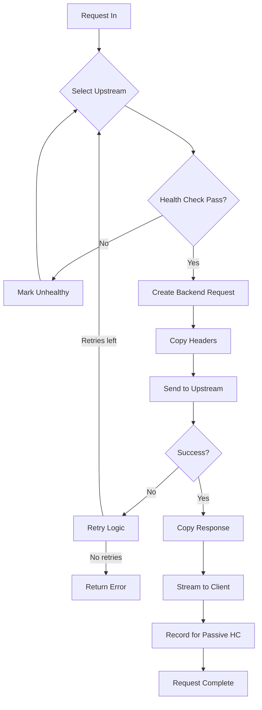

# Reverse Proxy Deep Dive

**Location:** `/home/darkvoid/Boxxed/@dev/repo-expolorations/caddy/caddy/`
**Source:** `modules/caddyhttp/reverseproxy/reverseproxy.go`, `healthchecks.go`, `selectionpolicies.go`, `httptransport.go`
**Focus:** Load balancing, health checks, connection pooling, streaming

---

## Table of Contents

1. [Reverse Proxy Overview](#1-reverse-proxy-overview)
2. [Load Balancing Algorithms](#2-load-balancing-algorithms)
3. [Health Checks](#3-health-checks)
4. [Connection Pooling](#4-connection-pooling)
5. [Request/Response Handling](#5-requestresponse-handling)
6. [Streaming and Buffering](#6-streaming-and-buffering)
7. [Retry Logic](#7-retry-logic)
8. [Rust Translation](#8-rust-translation)

---

## 1. Reverse Proxy Overview

### 1.1 What is a Reverse Proxy?

```
┌─────────┐     ┌─────────────────┐     ┌──────────────┐
│ Client  │────▶│ Reverse Proxy   │────▶│  Backend     │
│         │◀────│ (Caddy)         │◀────│  (App)       │
└─────────┘     └─────────────────┘     └──────────────┘
                       │
                       ├─ Load Balancing
                       ├─ SSL Termination
                       ├─ Caching
                       ├─ Compression
                       └─ Security
```

### 1.2 Handler Structure

```go
// From modules/caddyhttp/reverseproxy/reverseproxy.go
type Handler struct {
    // Transport: How to communicate with backends
    Transport        http.RoundTripper

    // Load balancing configuration
    LoadBalancing    *LoadBalancing

    // Health check configuration
    HealthChecks     *HealthChecks

    // Backend pool
    Upstreams        UpstreamPool

    // Dynamic upstream discovery
    DynamicUpstreams UpstreamSource

    // Response handling
    FlushInterval    caddy.Duration
    ResponseBuffers  int64

    // Error handling
    HandleResponse   []ResponseHandler

    // Logging
    VerboseLogs      bool
}
```

### 1.3 Middleware Flow



---

## 2. Load Balancing Algorithms

### 2.1 Round Robin

```go
// From modules/caddyhttp/reverseproxy/selectionpolicies.go
type RoundRobinSelection struct {
    counter atomic.Uint64
}

func (rr *RoundRobinSelection) Select(pool UpstreamPool) *Upstream {
    n := rr.counter.Add(1)
    available := pool.availableUpstreams()

    if len(available) == 0 {
        return nil
    }

    return available[n % uint64(len(available))]
}
```

**Visual:**
```
Request 1 -> Backend A
Request 2 -> Backend B
Request 3 -> Backend C
Request 4 -> Backend A (cycle)
Request 5 -> Backend B
```

### 2.2 Least Connections

```go
type LeastConnSelection struct{}

func (lc *LeastConnSelection) Select(pool UpstreamPool) *Upstream {
    var best *Upstream
    var bestCount int64 = -1

    for _, upstream := range pool.availableUpstreams() {
        count := upstream.activeRequests()

        if best == nil || count < bestCount {
            best = upstream
            bestCount = count
        }
    }

    return best
}
```

**Visual:**
```
Backend A: ██████████ (10 active)
Backend B: ████ (4 active)  <- Selected
Backend C: ████████ (8 active)
```

### 2.3 First Selection (Sticky)

```go
type FirstSelection struct{}

func (f *FirstSelection) Select(pool UpstreamPool) *Upstream {
    available := pool.availableUpstreams()
    if len(available) == 0 {
        return nil
    }
    return available[0]  // Always first healthy upstream
}
```

### 2.4 IP Hash

```go
type IPHashSelection struct{}

func (ip *IPHashSelection) Select(pool UpstreamPool, req *http.Request) *Upstream {
    // Get client IP (from X-Forwarded-For if trusted)
    clientIP := getClientIP(req)

    // Hash the IP
    hash := fnv.New32a()
    hash.Write([]byte(clientIP))
    h := hash.Sum32()

    available := pool.availableUpstreams()
    if len(available) == 0 {
        return nil
    }

    // Select based on hash
    return available[int(h) % len(available)]
}
```

**Visual:**
```
Client 192.168.1.1 -> hash() -> Backend B
Client 192.168.1.2 -> hash() -> Backend A
Client 192.168.1.1 -> hash() -> Backend B (same!)
```

### 2.5 Weighted Selection

```go
type WeightedSelection struct{}

func (w *WeightedSelection) Select(pool UpstreamPool) *Upstream {
    // Calculate total weight
    var totalWeight int
    for _, u := range pool.availableUpstreams() {
        totalWeight += u.Weight
    }

    // Pick random number
    r := rand.Intn(totalWeight)

    // Select based on weight
    var cumulative int
    for _, u := range pool.availableUpstreams() {
        cumulative += u.Weight
        if r < cumulative {
            return u
        }
    }

    return nil
}
```

**Visual:**
```
Backend A: Weight 50 (50% of requests)
Backend B: Weight 30 (30% of requests)
Backend C: Weight 20 (20% of requests)
```

---

## 3. Health Checks

### 3.1 Active Health Checks

```go
// From modules/caddyhttp/reverseproxy/healthchecks.go
type HealthChecks struct {
    Active  *ActiveHealthChecks
    Passive *PassiveHealthChecks
}

type ActiveHealthChecks struct {
    Path           string
    Interval       caddy.Duration
    Timeout        caddy.Duration
    ExpectStatus   int
    ExpectBody     string
    Headers        http.Header
    Port           int
    TLSConfig      *tls.Config
}

func (h *HealthChecks) ActiveHealthChecker(ctx context.Context, upstreams UpstreamPool) {
    ticker := time.NewTicker(time.Duration(h.Active.Interval))

    for {
        select {
        case <-ticker.C:
            for _, upstream := range upstreams {
                go h.checkUpstream(upstream)
            }
        case <-ctx.Done():
            return
        }
    }
}

func (h *HealthChecks) checkUpstream(upstream *Upstream) {
    // Build health check URL
    url := upstream.healthCheckURL(h.Active.Path, h.Active.Port)

    // Create request
    req, err := http.NewRequest("GET", url, nil)
    if err != nil {
        upstream.MarkUnhealthy()
        return
    }

    // Add custom headers
    for k, v := range h.Active.Headers {
        req.Header[k] = v
    }

    // Send request
    client := &http.Client{
        Timeout: time.Duration(h.Active.Timeout),
    }

    resp, err := client.Do(req)
    if err != nil {
        upstream.MarkUnhealthy()
        return
    }
    defer resp.Body.Close()

    // Check status code
    if h.Active.ExpectStatus > 0 && resp.StatusCode != h.Active.ExpectStatus {
        upstream.MarkUnhealthy()
        return
    }

    // Check body content (if configured)
    if h.Active.ExpectBody != "" {
        body, _ := io.ReadAll(io.LimitReader(resp.Body, 1024))
        if !strings.Contains(string(body), h.Active.ExpectBody) {
            upstream.MarkUnhealthy()
            return
        }
    }

    // All checks passed
    upstream.MarkHealthy()
}
```

### 3.2 Passive Health Checks

```go
// From modules/caddyhttp/reverseproxy/healthchecks.go
type PassiveHealthChecks struct {
    MaxFails     int
    FailTimeout  caddy.Duration
    UnhealthyStatus []int  // Status codes to count as failures
    UnhealthyLatency  caddy.Duration
}

type Upstream struct {
    Dial          string
    Healthy       atomic.Bool
    fails         atomic.Int64
    lastFail      atomic.Time
    healthyCount  atomic.Int64
}

func (u *Upstream) RecordRequest(err error, latency time.Duration, statusCode int) {
    // Check if request failed
    if err != nil || u.isUnhealthyStatus(statusCode) || latency > unhealthyLatency {
        u.fails.Add(1)
        u.lastFail.Store(time.Now())

        // Mark unhealthy if threshold reached
        if u.fails.Load() >= int64(maxFails) {
            u.MarkUnhealthy()
        }
    } else {
        // Successful request
        u.healthyCount.Add(1)

        // Decay failures over time
        if u.healthyCount.Load() >= 10 {
            u.fails.Store(0)
            u.healthyCount.Store(0)
            u.MarkHealthy()
        }
    }
}

func (u *Upstream) isUnhealthyStatus(status int) bool {
    for _, s := range unhealthyStatus {
        if s == status {
            return true
        }
    }
    return false
}
```

### 3.3 Health Check Configuration

**Caddyfile:**
```caddyfile
reverse_proxy backend:8080 {
    # Active health checks
    health_check /health {
        interval 10s
        timeout 5s
        expect_status 200
        expect_body "OK"
    }

    # Passive health checks
    passive_health_check {
        max_fails 3
        fail_timeout 30s
        unhealthy_status 502 503 504
        unhealthy_latency 30s
    }
}
```

**JSON:**
```json
{
  "handler": "reverse_proxy",
  "upstreams": [{"dial": "backend:8080"}],
  "health_checks": {
    "active": {
      "path": "/health",
      "interval": "10s",
      "timeout": "5s",
      "expect_status": 200,
      "expect_body": "OK"
    },
    "passive": {
      "max_fails": 3,
      "fail_timeout": "30s",
      "unhealthy_status": [502, 503, 504],
      "unhealthy_latency": "30s"
    }
  }
}
```

---

## 4. Connection Pooling

### 4.1 HTTP Transport Configuration

```go
// From modules/caddyhttp/reverseproxy/httptransport.go
type HTTPTransport struct {
    // Connection timeouts
    DialTimeout     caddy.Duration  // Default: 30s
    KeepAlive       caddy.Duration  // Default: 300s

    // Connection limits
    MaxConnsPerHost     int  // Default: 0 (unlimited)
    MaxIdleConns        int  // Default: 100
    MaxIdleConnsPerHost int  // Default: 2

    // Idle connection timeout
    IdleConnTimeout     caddy.Duration  // Default: 90s

    // TLS configuration
    TLSHandshakeTimeout   caddy.Duration
    TLSConfig           *TLSConfig

    // Proxy settings
    ProxyFromEnvironment bool
    ProxyConnectHeaders  http.Header

    // HTTP/2 settings
    EnableHTTP2 bool
}

func (t *HTTPTransport) RoundTrip(req *http.Request) (*http.Response, error) {
    return t.transport.RoundTrip(req)
}

func (t *HTTPTransport) Provision(ctx caddy.Context) error {
    t.transport = &http.Transport{
        // Dial settings
        DialContext: (&net.Dialer{
            Timeout:   time.Duration(t.DialTimeout),
            KeepAlive: time.Duration(t.KeepAlive),
        }).DialContext,

        // Connection pooling
        MaxConnsPerHost:     t.MaxConnsPerHost,
        MaxIdleConns:        t.MaxIdleConns,
        MaxIdleConnsPerHost: t.MaxIdleConnsPerHost,
        IdleConnTimeout:     time.Duration(t.IdleConnTimeout),

        // TLS settings
        TLSHandshakeTimeout: time.Duration(t.TLSHandshakeTimeout),
        TLSClientConfig:     t.TLSConfig,

        // Proxy settings
        Proxy: t.proxyFunc(),
    }

    return nil
}
```

### 4.2 Connection Pooling Behavior

```
Request 1 to backend:8080
├── Create new connection
└── Response returned

Request 2 to backend:8080 (soon after)
├── Reuse idle connection from pool
└── Response returned

Request 3 to backend:8080 (after IdleConnTimeout)
├── Previous connection closed
└── Create new connection
```

### 4.3 Unix Socket Transport

```go
type UnixTransport struct {
    SocketPath string
}

func (t *UnixTransport) RoundTrip(req *http.Request) (*http.Response, error) {
    // Create unix socket connection
    conn, err := net.Dial("unix", t.SocketPath)
    if err != nil {
        return nil, err
    }

    // Send HTTP request over unix socket
    err = req.Write(conn)
    if err != nil {
        return nil, err
    }

    // Read response
    return http.ReadResponse(bufio.NewReader(conn), req)
}
```

---

## 5. Request/Response Handling

### 5.1 Core Proxy Logic

```go
// From modules/caddyhttp/reverseproxy/reverseproxy.go
func (h *Handler) ServeHTTP(w http.ResponseWriter, r *http.Request, next caddyhttp.Handler) error {
    // Create proxy request context
    proxyCtx := &reverseProxyContext{
        request: r,
        logger:  h.logger,
    }

    // Get retry delay function
    retryDelay := h.LoadBalancing.TryDuration / 10

    // Main proxy loop (for retries)
    var lastErr error
    start := time.Now()

    for time.Since(start) < h.LoadBalancing.TryDuration {
        // Select upstream
        upstream := h.selectBackend(r)
        if upstream == nil {
            lastErr = fmt.Errorf("no healthy upstreams")
            continue
        }

        // Try to proxy
        err := h.proxyToUpstream(proxyCtx, upstream)
        if err == nil {
            // Success!
            return nil
        }

        lastErr = err

        // Check if we should retry
        if !h.isRetryableError(err) {
            return err
        }

        // Wait before retry
        time.Sleep(retryDelay)
    }

    return lastErr
}
```

### 5.2 Backend Request Creation

```go
func (h *Handler) proxyToUpstream(ctx *reverseProxyContext, upstream *Upstream) error {
    // Clone request for backend
    backendReq := cloneRequest(ctx.request)

    // Update request URI for backend
    backendReq.URL.Scheme = upstream.scheme()
    backendReq.URL.Host = upstream.dialAddr()
    backendReq.Host = upstream.Host

    // Add proxy headers
    h.setProxyHeaders(backendReq, ctx.request, upstream)

    // Record for in-flight tracking
    incInFlightRequest(upstream.Dial)
    defer decInFlightRequest(upstream.Dial)

    // Send request to backend
    start := time.Now()
    resp, err := h.Transport.RoundTrip(backendReq)
    latency := time.Since(start)

    // Record for passive health checks
    if h.HealthChecks != nil && h.HealthChecks.Passive != nil {
        upstream.RecordRequest(err, latency, resp.StatusCode)
    }

    if err != nil {
        return err
    }
    defer resp.Body.Close()

    // Copy response back to client
    return h.copyResponse(ctx, resp)
}

func (h *Handler) setProxyHeaders(backendReq, clientReq *http.Request, upstream *Upstream) {
    // X-Forwarded-For
    if clientIP := getClientIP(clientReq); clientIP != "" {
        if existing := backendReq.Header.Get("X-Forwarded-For"); existing != "" {
            backendReq.Header.Set("X-Forwarded-For", existing + ", " + clientIP)
        } else {
            backendReq.Header.Set("X-Forwarded-For", clientIP)
        }
    }

    // X-Forwarded-Proto
    if clientReq.TLS != nil {
        backendReq.Header.Set("X-Forwarded-Proto", "https")
    } else {
        backendReq.Header.Set("X-Forwarded-Proto", "http")
    }

    // X-Forwarded-Host
    backendReq.Header.Set("X-Forwarded-Host", clientReq.Host)

    // X-Real-IP
    if clientIP := getClientIP(clientReq); clientIP != "" {
        backendReq.Header.Set("X-Real-IP", clientIP)
    }

    // Connection header (hop-by-hop)
    backendReq.Header.Del("Connection")
    backendReq.Header.Del("Keep-Alive")
    backendReq.Header.Del("Proxy-Authenticate")
    backendReq.Header.Del("Proxy-Authorization")
    backendReq.Header.Del("TE")
    backendReq.Header.Del("Trailers")
    backendReq.Header.Del("Transfer-Encoding")
    backendReq.Header.Del("Upgrade")
}
```

### 5.3 Response Copying

```go
func (h *Handler) copyResponse(ctx *reverseProxyContext, resp *http.Response) error {
    // Copy headers
    copyHeaders(ctx.writer.Header(), resp.Header)

    // Set status code
    ctx.writer.WriteHeader(resp.StatusCode)

    // Determine if streaming or buffering
    if h.shouldBuffer(resp) {
        // Buffer entire response
        body, err := io.ReadAll(io.LimitReader(resp.Body, h.ResponseBuffers))
        if err != nil {
            return err
        }
        _, err = ctx.writer.Write(body)
        return err
    }

    // Stream response
    if h.FlushInterval > 0 {
        // Flush periodically (for SSE, etc.)
        ticker := time.NewTicker(time.Duration(h.FlushInterval))
        defer ticker.Stop()

        flusher, _ := ctx.writer.(http.Flusher)

        buf := make([]byte, 32*1024)
        for {
            select {
            case <-ticker.C:
                if flusher != nil {
                    flusher.Flush()
                }
            default:
            }

            n, err := io.CopyBuffer(ctx.writer, resp.Body, buf)
            if n > 0 {
                // Data written
            }
            if err != nil {
                if err == io.EOF {
                    return nil
                }
                return err
            }
        }
    } else {
        // Standard streaming
        _, err := io.Copy(ctx.writer, resp.Body)
        return err
    }
}
```

---

## 6. Streaming and Buffering

### 6.1 When to Buffer vs Stream

```go
func (h *Handler) shouldBuffer(resp *http.Response) bool {
    // Buffer if content-length is known and under limit
    if resp.ContentLength > 0 && resp.ContentLength <= h.ResponseBuffers {
        return true
    }

    // Don't buffer streaming responses
    if isStreamingResponse(resp) {
        return false
    }

    // Buffer if configured
    return h.ResponseBuffers > 0
}

func isStreamingResponse(resp *http.Response) bool {
    // Check for Server-Sent Events
    if strings.Contains(resp.Header.Get("Content-Type"), "text/event-stream") {
        return true
    }

    // Check for chunked transfer encoding
    if resp.TransferEncoding != nil {
        for _, te := range resp.TransferEncoding {
            if te == "chunked" {
                return true
            }
        }
    }

    // Check for WebSocket upgrade
    if strings.ToLower(resp.Header.Get("Upgrade")) == "websocket" {
        return true
    }

    return false
}
```

### 6.2 Flush Interval Configuration

```go
// Negative flush interval = immediate flush (no buffering)
// Zero = default behavior
// Positive = flush every N duration

// Example: Server-Sent Events
// Caddyfile:
reverse_proxy sse-backend:8080 {
    flush_interval -1ms  # Immediate flush
}

// Example: Normal API
// Caddyfile:
reverse_proxy api-backend:8080 {
    flush_interval 100ms  # Buffer for 100ms, then flush
}
```

### 6.3 WebSocket Handling

```go
func (h *Handler) handleWebSocket(ctx *reverseProxyContext, backendConn net.Conn) {
    // Hijack client connection
    hijacker, ok := ctx.writer.(http.Hijacker)
    if !ok {
        return
    }

    clientConn, buf, err := hijacker.Hijack()
    if err != nil {
        return
    }

    // Copy buffered data
    if buf.Reader.Buffered() > 0 {
        io.Copy(backendConn, buf.Reader)
    }

    // Bidirectional copy
    done := make(chan struct{}, 2)

    go func() {
        io.Copy(backendConn, clientConn)
        done <- struct{}{}
    }()

    go func() {
        io.Copy(clientConn, backendConn)
        done <- struct{}{}
    }()

    // Wait for both directions to complete
    <-done
    <-done

    // Track for cleanup on reload
    h.trackHijackedConnection(clientConn)
}
```

---

## 7. Retry Logic

### 7.1 Retryable Errors

```go
func (h *Handler) isRetryableError(err error) bool {
    // Network errors
    if errors.Is(err, io.EOF) {
        return true
    }

    // Connection refused
    var netErr net.Error
    if errors.As(err, &netErr) {
        return true
    }

    // 502 Bad Gateway
    // 503 Service Unavailable
    // 504 Gateway Timeout
    return false
}
```

### 7.2 Retry Configuration

```go
type LoadBalancing struct {
    // How long to try selecting backends
    TryDuration caddy.Duration

    // How long to wait between retries
    RetryInterval caddy.Duration

    // Connection limits
    MaxConnections int

    // Selection policy
    SelectionPolicy SelectionPolicy
}
```

### 7.3 Circuit Breaker

```go
type CircuitBreaker interface {
    Allow() bool
    RecordSuccess()
    RecordFailure()
}

type SimpleCircuitBreaker struct {
    maxFailures int
    failures    atomic.Int64
    resetTime   atomic.Time
    halfOpen    atomic.Bool
}

func (cb *SimpleCircuitBreaker) Allow() bool {
    if cb.halfOpen.Load() {
        return true  // Allow one request to test
    }

    if cb.failures.Load() >= int64(cb.maxFailures) {
        // Check if reset timeout passed
        if time.Since(cb.resetTime.Load()) > 30*time.Second {
            cb.halfOpen.Store(true)
            return true
        }
        return false  // Circuit open
    }

    return true  // Circuit closed, allow
}

func (cb *SimpleCircuitBreaker) RecordSuccess() {
    cb.failures.Store(0)
    cb.halfOpen.Store(false)
}

func (cb *SimpleCircuitBreaker) RecordFailure() {
    failures := cb.failures.Add(1)
    if failures >= int64(cb.maxFailures) {
        cb.resetTime.Store(time.Now())
    }
}
```

---

## 8. Rust Translation

### 8.1 Reverse Proxy Trait

```rust
use http::{Request, Response};
use std::sync::Arc;

pub trait LoadBalancer: Send + Sync {
    fn select(&self, pool: &UpstreamPool) -> Option<Arc<Upstream>>;
}

pub trait HealthChecker: Send + Sync {
    fn check(&self, upstream: &Upstream) -> impl Future<Output = bool> + Send;
}

pub trait Transport: Send + Sync {
    fn send(&self, req: Request<Body>) -> impl Future<Output = Result<Response<Body>, ProxyError>> + Send;
}

pub struct ReverseProxy {
    upstreams: Arc<RwLock<UpstreamPool>>,
    load_balancer: Arc<dyn LoadBalancer>,
    health_checker: Arc<dyn HealthChecker>,
    transport: Arc<dyn Transport>,
    config: ProxyConfig,
}

impl ReverseProxy {
    pub async fn proxy(&self, mut req: Request<Body>) -> Result<Response<Body>, ProxyError> {
        let start = Instant::now();
        let mut last_error: Option<ProxyError> = None;

        // Retry loop
        while start.elapsed() < self.config.try_duration {
            // Select upstream
            let upstream = {
                let pool = self.upstreams.read().unwrap();
                self.load_balancer.select(&pool)
            };

            let Some(upstream) = upstream else {
                last_error = Some(ProxyError::NoHealthyUpstream);
                break;
            };

            // Try to proxy
            match self.proxy_to_upstream(req, &upstream).await {
                Ok(response) => return Ok(response),
                Err(e) => {
                    // Record failure for passive health check
                    upstream.record_failure(&e).await;
                    last_error = Some(e);

                    // Check if retryable
                    if !last_error.as_ref().unwrap().is_retryable() {
                        break;
                    }

                    // Wait before retry
                    tokio::time::sleep(self.config.retry_interval).await;
                }
            }
        }

        Err(last_error.unwrap_or(ProxyError::NoHealthyUpstream))
    }
}
```

### 8.2 Load Balancing in Rust

```rust
pub struct RoundRobin {
    counter: AtomicU64,
}

impl LoadBalancer for RoundRobin {
    fn select(&self, pool: &UpstreamPool) -> Option<Arc<Upstream>> {
        let available = pool.healthy_upstreams();
        if available.is_empty() {
            return None;
        }

        let n = self.counter.fetch_add(1, Ordering::Relaxed);
        Some(available[(n as usize) % available.len()].clone())
    }
}

pub struct LeastConnections;

impl LoadBalancer for LeastConnections {
    fn select(&self, pool: &UpstreamPool) -> Option<Arc<Upstream>> {
        pool.healthy_upstreams()
            .into_iter()
            .min_by_key(|u| u.active_requests.load(Ordering::Relaxed))
    }
}

pub struct IpHash;

impl LoadBalancer for IpHash {
    fn select(&self, pool: &UpstreamPool) -> Option<Arc<Upstream>> {
        // Extract client IP from request
        // Hash and select
        todo!()
    }
}
```

### 8.3 Health Checker in Rust

```rust
pub struct ActiveHealthChecker {
    path: String,
    interval: Duration,
    timeout: Duration,
    expect_status: StatusCode,
}

impl ActiveHealthChecker {
    pub fn spawn_checker(
        &self,
        upstreams: Arc<RwLock<UpstreamPool>>,
    ) -> JoinHandle<()> {
        let path = self.path.clone();
        let interval = self.interval;
        let timeout = self.timeout;
        let expect = self.expect_status;

        tokio::spawn(async move {
            let mut ticker = tokio::time::interval(interval);

            loop {
                ticker.tick().await;

                let upstreams_guard = upstreams.read().unwrap();
                for upstream in upstreams_guard.iter() {
                    let upstream = upstream.clone();
                    let path = path.clone();

                    tokio::spawn(async move {
                        let healthy = Self::check_single(&upstream, &path, timeout, expect).await;
                        upstream.set_healthy(healthy).await;
                    });
                }
            }
        })
    }

    async fn check_single(
        upstream: &Upstream,
        path: &str,
        timeout: Duration,
        expect: StatusCode,
    ) -> bool {
        let client = reqwest::Client::builder()
            .timeout(timeout)
            .build()
            .unwrap();

        let url = format!("{}://{}{}", upstream.scheme, upstream.host, path);

        match client.get(&url).send().await {
            Ok(resp) => resp.status() == expect,
            Err(_) => false,
        }
    }
}
```

### 8.4 Connection Pooling in Rust

```rust
use hyper::client::HttpConnector;
use hyper::Client;
use deadpool::managed::Pool;

pub struct ConnectionPool {
    pool: Pool<HttpConnector>,
}

impl ConnectionPool {
    pub fn new(config: &TransportConfig) -> Self {
        let connector = HttpConnector::new();

        let pool = Pool::builder(connector)
            .max_size(config.max_conns_per_host)
            .idle_timeout(Some(config.idle_conn_timeout))
            .build()
            .unwrap();

        Self { pool }
    }

    pub async fn get_connection(&self) -> Result<Connection, PoolError> {
        self.pool.get().await
    }
}
```

---

## Summary

### Key Takeaways

1. **Load balancing**: Round robin, least connections, IP hash, weighted
2. **Health checks**: Active (periodic probes) and passive (observe failures)
3. **Connection pooling**: Reuse connections, limit per-host, idle timeout
4. **Streaming**: Buffer small responses, stream large/unknown
5. **Retry logic**: Retry on network errors, 502/503/504
6. **Circuit breaker**: Prevent cascading failures

### Rust Patterns

| Pattern | Go | Rust |
|---------|-----|------|
| Load Balancer | Interface | `dyn LoadBalancer` trait |
| Health Check | Goroutine | `tokio::spawn` |
| Connection Pool | `http.Transport` | `deadpool` or `hyper` |
| Streaming | `io.Copy` | `tokio::io::copy` |
| Mutex | `sync.Mutex` | `tokio::sync::RwLock` |

---

*Continue with [Caddyfile Config Deep Dive](04-caddyfile-config-deep-dive.md) for configuration parsing details.*
