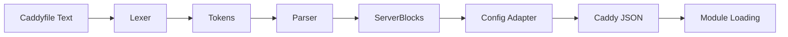

# Caddyfile Configuration Deep Dive

**Location:** `/home/darkvoid/Boxxed/@dev/repo-expolorations/caddy/caddy/`
**Source:** `caddyconfig/caddyfile/lexer.go`, `parse.go`, `dispenser.go`
**Focus:** Configuration language parsing, lexer, directives

---

## Table of Contents

1. [Caddyfile Overview](#1-caddyfile-overview)
2. [Lexer Implementation](#2-lexer-implementation)
3. [Parser Implementation](#3-parser-implementation)
4. [Dispenser and Token Navigation](#4-dispenser-and-token-navigation)
5. [Server Block Structure](#5-server-block-structure)
6. [Directive Processing](#6-directive-processing)
7. [Environment Variables](#7-environment-variables)
8. [Imports and Snippets](#8-imports-and-snippets)
9. [Rust Translation](#9-rust-translation)

---

## 1. Caddyfile Overview

### 1.1 What is the Caddyfile?

The Caddyfile is Caddy's native configuration format - a human-readable DSL that gets converted to JSON internally.

**Example:**
```caddyfile
# Simple static site
example.com {
    root * /var/www/html
    file_server
    encode gzip
}

# Reverse proxy
api.example.com {
    reverse_proxy localhost:8080
}

# Complex configuration
www.example.com {
    # Handle /api/* paths
    @api path /api/*
    handle @api {
        reverse_proxy api-backend:3000
    }

    # Handle everything else
    handle {
        root * /var/www/html
        file_server
    }
}
```

### 1.2 Caddyfile vs JSON

| Aspect | Caddyfile | JSON |
|--------|-----------|------|
| Readability | High | Low |
| Verbosity | Low | High |
| Validation | Runtime | Schema |
| Dynamic Updates | No | Yes (Admin API) |
| Comments | Yes | No |

### 1.3 Parsing Pipeline



---

## 2. Lexer Implementation

### 2.1 Token Structure

```go
// From caddyconfig/caddyfile/lexer.go
type Token struct {
    File          string  // Source filename
    Line          int     // Line number
    Text          string  // Token content
    wasQuoted     rune    // Quote character if quoted
    heredocMarker string  // For heredoc syntax
    snippetName   string  // For snippet tokens
    imports       []string // Import chain
}
```

### 2.2 Lexer State Machine

```go
// From caddyconfig/caddyfile/lexer.go
type lexer struct {
    reader       *bufio.Reader
    token        Token
    line         int
    skippedLines int
}

func (l *lexer) next() (bool, error) {
    var val []rune
    var comment, quoted, btQuoted, inHeredoc, escaped bool
    var heredocMarker string

    makeToken := func(quoted rune) bool {
        l.token.Text = string(val)
        l.token.wasQuoted = quoted
        l.token.heredocMarker = heredocMarker
        return true
    }

    for {
        ch, _, err := l.reader.ReadRune()
        if err != nil {
            if len(val) > 0 {
                return makeToken(0), nil
            }
            return false, nil  // EOF
        }

        // Handle heredoc
        if inHeredoc {
            val = append(val, ch)
            if ch == '\n' {
                l.skippedLines++
            }
            // Check for end marker
            if strings.HasSuffix(string(val), heredocMarker) {
                l.line += l.skippedLines
                l.skippedLines = 0
                return makeToken('<'), nil
            }
            continue
        }

        // Handle comments
        if ch == '#' && !quoted && !btQuoted {
            comment = true
            continue
        }
        if comment && ch == '\n' {
            comment = false
            l.line++
            continue
        }
        if comment {
            continue
        }

        // Handle whitespace
        if unicode.IsSpace(ch) {
            if len(val) > 0 {
                return makeToken(0), nil
            }
            if ch == '\n' {
                l.line++
            }
            continue
        }

        // Handle heredoc start
        if !quoted && !btQuoted && len(val) > 1 && string(val[:2]) == "<<" {
            if ch == '\n' {
                heredocMarker = string(val[2:])
                inHeredoc = true
                val = nil
                continue
            }
        }

        // Handle quotes
        if ch == '`' && !quoted && !btQuoted {
            btQuoted = true
            continue
        }
        if btQuoted && ch == '`' {
            btQuoted = false
            return makeToken('`'), nil
        }

        if ch == '"' && !quoted && !btQuoted {
            quoted = true
            continue
        }
        if quoted && ch == '"' && !escaped {
            return makeToken('"'), nil
        }
        if quoted && ch == '\\' && !escaped {
            escaped = true
            continue
        }

        escaped = false
        val = append(val, ch)
    }
}
```

### 2.3 Token Types

```go
// Token categorization
const (
    TokenEOF = iota
    TokenWord        // Regular word: example.com, file_server
    TokenQuoted      // "quoted string"
    TokenBacktick    // `backtick string`
    TokenHeredoc     // <<END ... END
    TokenBraceOpen   // {
    TokenBraceClose  // }
    TokenComment     // # comment (skipped)
)
```

### 2.4 Lexing Examples

**Input:**
```caddyfile
example.com {
    root * "/var/www/html"
    file_server
}
```

**Tokens:**
```
Token{Text: "example.com", Line: 1}
Token{Text: "{", Line: 1}
Token{Text: "root", Line: 2}
Token{Text: "*", Line: 2}
Token{Text: "/var/www/html", Line: 2, wasQuoted: '"'}
Token{Text: "file_server", Line: 3}
Token{Text: "}", Line: 4}
```

---

## 3. Parser Implementation

### 3.1 Parser Structure

```go
// From caddyconfig/caddyfile/parse.go
type parser struct {
    *Dispenser
    block           ServerBlock
    eof             bool
    definedSnippets map[string][]Token
    nesting         int
    importGraph     importGraph
}

type ServerBlock struct {
    Keys         []Token
    Segments     []Segment
    IsNamedRoute bool
}

type Segment []Token
```

### 3.2 Parsing Flow

```go
// From caddyconfig/caddyfile/parse.go
func Parse(filename string, input []byte) ([]ServerBlock, error) {
    // 1. Lex all tokens
    tokens, err := allTokens(filename, input)
    if err != nil {
        return nil, err
    }

    // 2. Create parser
    p := parser{
        Dispenser: NewDispenser(tokens),
        importGraph: importGraph{
            nodes: make(map[string]struct{}),
            edges: make(adjacency),
        },
    }

    // 3. Parse all server blocks
    return p.parseAll()
}

func (p *parser) parseAll() ([]ServerBlock, error) {
    var blocks []ServerBlock

    for p.Next() {
        err := p.parseOne()
        if err != nil {
            return blocks, err
        }

        if len(p.block.Keys) > 0 || len(p.block.Segments) > 0 {
            blocks = append(blocks, p.block)
        }

        if p.nesting > 0 {
            return blocks, p.EOFErr()
        }
    }

    return blocks, nil
}
```

### 3.3 Server Block Parsing

```go
func (p *parser) parseOne() error {
    p.block = ServerBlock{}
    return p.begin()
}

func (p *parser) begin() error {
    // 1. Parse addresses (keys)
    err := p.addresses()
    if err != nil {
        return err
    }

    // 2. Check for snippet definition
    if ok, name := p.isSnippet(); ok {
        tokens, err := p.blockTokens(false)
        if err != nil {
            return err
        }
        p.definedSnippets[name] = tokens
        return nil
    }

    // 3. Check for named route
    if ok, name := p.isNamedRoute(); ok {
        nameToken := p.Token()
        nameToken.Text = name
        p.block.Keys = []Token{nameToken}
        p.block.IsNamedRoute = true

        tokens, err := p.blockTokens(true)
        if err != nil {
            return err
        }
        tokens = append([]Token{nameToken}, tokens...)
        p.block.Segments = []Segment{tokens}
        return nil
    }

    // 4. Parse regular server block body
    tokens, err := p.blockTokens(false)
    if err != nil {
        return err
    }
    p.block.Segments = []Segment{tokens}

    return nil
}
```

### 3.4 Address Parsing

```go
func (p *parser) addresses() error {
    for {
        // Check for block start
        if p.Val() == "{" {
            return nil
        }

        // Check for snippet/named route
        if p.Val() == "(" {
            return nil
        }

        // This is an address
        p.block.Keys = append(p.block.Keys, p.Token())

        // Move to next token
        if !p.Next() {
            p.eof = true
            break
        }
    }

    return nil
}
```

### 3.5 Block Token Collection

```go
func (p *parser) blockTokens(allowNested bool) ([]Token, error) {
    var tokens []Token

    // Expect opening brace
    if p.Val() != "{" {
        if !p.Next() {
            return nil, p.EOFErr()
        }
        if p.Val() != "{" {
            return nil, p.Err("expected '{'")
        }
    }

    p.nesting++

    for p.Next() {
        // Check for nested block
        if p.Val() == "{" {
            if !allowNested {
                return nil, p.Err("unexpected '{'")
            }

            // Collect nested block
            nested, err := p.blockTokens(true)
            if err != nil {
                return nil, err
            }
            tokens = append(tokens, nested...)
            continue
        }

        // Check for closing brace
        if p.Val() == "}" {
            p.nesting--
            return tokens, nil
        }

        // Handle import directive
        if p.Val() == "import" {
            imported, err := p.importTokens()
            if err != nil {
                return nil, err
            }
            tokens = append(tokens, imported...)
            continue
        }

        // Regular token
        tokens = append(tokens, p.Token())
    }

    return nil, p.EOFErr()
}
```

---

## 4. Dispenser and Token Navigation

### 4.1 Dispenser Structure

```go
// From caddyconfig/caddyfile/dispenser.go
type Dispenser struct {
    filename string
    tokens   []Token
    cursor   int
}

func NewDispenser(tokens []Token) *Dispenser {
    return &Dispenser{
        tokens: tokens,
        cursor: -1,
    }
}
```

### 4.2 Navigation Methods

```go
// Move to next token
func (d *Dispenser) Next() bool {
    d.cursor++
    return d.cursor < len(d.tokens)
}

// Move to next token, return false if at end or token doesn't match
func (d *Dispenser) NextArg() bool {
    if d.cursor < 0 {
        d.cursor = 0
        return true
    }
    d.cursor++
    return d.cursor < len(d.tokens) && d.tokens[d.cursor].Text != "{" && d.tokens[d.cursor].Text != "}"
}

// Get current token value
func (d *Dispenser) Val() string {
    if d.cursor < 0 || d.cursor >= len(d.tokens) {
        return ""
    }
    return d.tokens[d.cursor].Text
}

// Get current token
func (d *Dispenser) Token() Token {
    if d.cursor < 0 || d.cursor >= len(d.tokens) {
        return Token{}
    }
    return d.tokens[d.cursor]
}

// Check if next token exists
func (d *Dispenser) NextArg() bool {
    return d.cursor+1 < len(d.tokens)
}

// Get next token without moving cursor
func (d *Dispenser) NextVal() string {
    if d.cursor+1 < len(d.tokens) {
        return d.tokens[d.cursor+1].Text
    }
    return ""
}

// Check remaining arguments on current line
func (d *Dispenser) RemainingArgs() []string {
    var args []string
    for i := d.cursor + 1; i < len(d.tokens); i++ {
        if d.tokens[i].Text == "{" || d.tokens[i].Text == "}" {
            break
        }
        args = append(args, d.tokens[i].Text)
    }
    return args
}

// Count remaining arguments
func (d *Dispenser) RemainingArgs() int {
    count := 0
    for i := d.cursor + 1; i < len(d.tokens); i++ {
        if d.tokens[i].Text == "{" || d.tokens[i].Text == "}" {
            break
        }
        count++
    }
    return count
}

// Check if more tokens exist
func (d *Dispenser) EOF() bool {
    return d.cursor >= len(d.tokens)-1
}

// Get current line number
func (d *Dispenser) Line() int {
    if d.cursor < 0 || d.cursor >= len(d.tokens) {
        return 0
    }
    return d.tokens[d.cursor].Line
}

// Get current filename
func (d *Dispenser) File() string {
    return d.filename
}
```

### 4.3 Argument Parsing Helpers

```go
// Parse exactly N arguments
func (d *Dispenser) Args(count int) ([]string, error) {
    args := make([]string, count)
    for i := 0; i < count; i++ {
        if !d.NextArg() {
            return nil, d.ArgErr()
        }
        args[i] = d.Val()
    }
    return args, nil
}

// Parse optional argument
func (d *Dispenser) OptionalArg(defaultValue string) string {
    if d.NextArg() {
        return d.Val()
    }
    return defaultValue
}

// Parse key-value pairs
func (d *Dispenser) Remainder() map[string]string {
    result := make(map[string]string)
    for d.NextArg() {
        key := d.Val()
        if d.NextArg() {
            result[key] = d.Val()
        } else {
            result[key] = ""
        }
    }
    return result
}

// Parse block content
func (d *Dispenser) Block(func(d *Dispenser) error) error {
    if d.Val() != "{" {
        return d.Err("expected '{'")
    }

    for d.Next() {
        if d.Val() == "}" {
            return nil
        }
        if err := fn(d); err != nil {
            return err
        }
    }

    return d.EOFErr()
}
```

### 4.4 Error Generation

```go
func (d *Dispenser) Err(message string) error {
    return fmt.Errorf("%s:%d: Error: %s", d.File(), d.Line(), message)
}

func (d *Dispenser) ArgErr() error {
    return d.Errf("wrong argument count or unexpected end of line")
}

func (d *Dispenser) Errf(format string, args ...any) error {
    return fmt.Errorf("%s:%d: Error: "+format, append([]any{d.File(), d.Line()}, args...)...)
}
```

---

## 5. Server Block Structure

### 5.1 Server Block Components

```go
// From caddyconfig/caddyfile/parse.go
type ServerBlock struct {
    // Keys are the addresses (domain names, IPs, patterns)
    Keys []Token

    // Segments are the directives within the block
    Segments []Segment

    // IsNamedRoute indicates if this is a named route
    IsNamedRoute bool
}

type Segment []Token
```

### 5.2 Example Server Block

**Caddyfile:**
```caddyfile
example.com www.example.com {
    root * /var/www/html
    encode gzip

    @api path /api/*
    handle @api {
        reverse_proxy localhost:8080
    }

    file_server
}
```

**Parsed Structure:**
```go
ServerBlock{
    Keys: [
        Token{Text: "example.com"},
        Token{Text: "www.example.com"},
    ],
    Segments: [
        // Segment 1: root directive
        [Token{Text: "root"}, Token{Text: "*"}, Token{Text: "/var/www/html"}],

        // Segment 2: encode directive
        [Token{Text: "encode"}, Token{Text: "gzip"}],

        // Segment 3: matcher definition
        [Token{Text: "@api"}, Token{Text: "path"}, Token{Text: "/api/*"}],

        // Segment 4: handle block (nested)
        [Token{Text: "handle"}, Token{Text: "@"}, Token{Text: "api"}, Token{Text: "{"},
         Token{Text: "reverse_proxy"}, Token{Text: "localhost:8080"}, Token{Text: "}"}],

        // Segment 5: file_server directive
        [Token{Text: "file_server"}],
    ],
}
```

---

## 6. Directive Processing

### 6.1 Directive Ordering

```go
// From caddyconfig/httpcaddyfile/directives.go
var directiveOrder = []string{
    "tracing",
    "encode",
    "headers",
    "request_body",
    "vars",
    "root",
    "skip_log",

    // Matchers
    "@",

    // Middleware
    "map",
    "try_files",
    "uri",
    "rewrite",
    "redir",

    // Routing
    "handle",
    "handle_path",
    "route",

    // Terminal handlers
    "respond",
    "file_server",
    "reverse_proxy",
    "php_fastcgi",

    // Logging
    "log",
}

// Directives are sorted by this order during config adaptation
func sortDirectives(segments []Segment) []Segment {
    sort.Slice(segments, func(i, j int) bool {
        return directiveIndex(segments[i].Directive()) < directiveIndex(segments[j].Directive())
    })
    return segments
}
```

### 6.2 Directive Parsing Pattern

```go
// Example: parse file_server directive
func parseFileServer(d *Dispenser) (httpcaddyfile.ConfigValue, error) {
    // Parse optional arguments
    var hide []string
    for d.NextArg() {
        if d.Val() == "hide" {
            hide = d.RemainingArgs()
            if len(hide) == 0 {
                return nil, d.ArgErr()
            }
            break
        }
        return nil, d.ArgErr()
    }

    // Parse nested blocks
    for nesting := d.Nesting(); d.NextBlock(nesting); {
        switch d.Val() {
        case "hide":
            hide = append(hide, d.RemainingArgs()...)
        case "status":
            if !d.NextArg() {
                return nil, d.ArgErr()
            }
            // Parse status code
        default:
            return nil, d.Errf("unrecognized subdirective: %s", d.Val())
        }
    }

    return httpcaddyfile.ConfigValue{
        Class: "file_server",
        Value: map[string]any{
            "hide": hide,
        },
    }, nil
}
```

### 6.3 Matcher Parsing

```go
// Parse request matcher
func parseMatcher(d *Dispenser) (httpcaddyfile.ConfigValue, error) {
    matcherName := strings.TrimPrefix(d.Val(), "@")

    // Parse matcher type and arguments
    var matcherType string
    var matcherArgs []string

    if d.NextArg() {
        matcherType = d.Val()
        matcherArgs = d.RemainingArgs()
    }

    // Build matcher config based on type
    var matcherConfig map[string]any
    switch matcherType {
    case "path":
        matcherConfig = map[string]any{
            "path": matcherArgs,
        }
    case "header":
        if len(matcherArgs) < 2 {
            return nil, d.ArgErr()
        }
        matcherConfig = map[string]any{
            "header": map[string]string{
                matcherArgs[0]: matcherArgs[1],
            },
        }
    case "method":
        matcherConfig = map[string]any{
            "method": matcherArgs,
        }
    case "query":
        matcherConfig = map[string]any{
            "query": parseQueryArgs(matcherArgs),
        }
    default:
        return nil, d.Errf("unknown matcher type: %s", matcherType)
    }

    return httpcaddyfile.ConfigValue{
        Class: "matcher",
        Name:  matcherName,
        Value: matcherConfig,
    }, nil
}
```

---

## 7. Environment Variables

### 7.1 Environment Variable Syntax

```caddyfile
# Basic environment variable
{$HOME}

# With default value
{$PORT:8080}

# Nested in directive
root * {$APP_ROOT:/var/www}
```

### 7.2 Environment Variable Expansion

```go
// From caddyconfig/caddyfile/parse.go
var (
    spanOpen  = []byte("{$")
    spanClose = []byte("}")
)

func replaceEnvVars(input []byte) []byte {
    var offset int
    for {
        // Find {$
        begin := bytes.Index(input[offset:], spanOpen)
        if begin < 0 {
            break
        }
        begin += offset

        // Find }
        end := bytes.Index(input[begin+len(spanOpen):], spanClose)
        if end < 0 {
            break
        }
        end += begin + len(spanOpen)

        // Get variable name
        envString := input[begin+len(spanOpen) : end]
        if len(envString) == 0 {
            offset = end + len(spanClose)
            continue
        }

        // Split name and default
        envParts := strings.SplitN(string(envString), ":", 2)

        // Lookup with default fallback
        envVarValue, found := os.LookupEnv(envParts[0])
        if !found && len(envParts) == 2 {
            envVarValue = envParts[1]
        }

        // Replace in input
        input = append(input[:begin],
            append([]byte(envVarValue), input[end+len(spanClose):]...)...)

        offset = begin + len(envVarValue)
    }
    return input
}
```

---

## 8. Imports and Snippets

### 8.1 Import Directive

```caddyfile
# Import another Caddyfile
import common/*.caddyfile

# Import with arguments
import site_template.caddyfile example.com

# Recursive import
import sites/*
```

### 8.2 Import Implementation

```go
func (p *parser) importTokens() ([]Token, error) {
    if !p.NextArg() {
        return nil, p.ArgErr()
    }

    importPattern := p.Val()

    // Expand glob pattern
    var files []string
    if strings.Contains(importPattern, "*") || strings.Contains(importPattern, "?") {
        var err error
        files, err = filepath.Glob(importPattern)
        if err != nil {
            return nil, err
        }
    } else {
        files = []string{importPattern}
    }

    var allTokens []Token
    for _, file := range files {
        // Check for import cycles
        if err := p.importGraph.addImport(p.File(), file); err != nil {
            return nil, err
        }

        // Read and tokenize file
        content, err := os.ReadFile(file)
        if err != nil {
            return nil, err
        }

        tokens, err := Tokenize(content, file)
        if err != nil {
            return nil, err
        }

        allTokens = append(allTokens, tokens...)
    }

    return allTokens, nil
}
```

### 8.3 Snippet Definition and Usage

```caddyfile
# Define snippet
(backend) {
    reverse_proxy {$BACKEND_HOST}:{$BACKEND_PORT}
    health_check /health
}

# Use snippet
example.com {
    import backend
}

# Snippet with arguments
(site_with_root $domain $root) {
    $domain {
        root * $root
        file_server
    }
}

# Use snippet with arguments
import site_with_root example.com /var/www/html
```

```go
func (p *parser) isSnippet() (bool, string) {
    if p.Val() != "(" {
        return false, ""
    }

    if !p.NextArg() {
        return false, ""
    }

    snippetName := p.Val()

    if !p.NextArg() || p.Val() != ")" {
        return false, ""
    }

    return true, snippetName
}
```

---

## 9. Rust Translation

### 9.1 Token Type

```rust
#[derive(Debug, Clone)]
pub struct Token {
    pub file: String,
    pub line: u32,
    pub text: String,
    pub was_quoted: Option<char>,
    pub heredoc_marker: Option<String>,
}

#[derive(Debug, Clone, PartialEq)]
pub enum TokenType {
    Word,
    Quoted,
    Backtick,
    Heredoc,
    BraceOpen,
    BraceClose,
}

impl Token {
    pub fn r#type(&self) -> TokenType {
        if self.text == "{" {
            TokenType::BraceOpen
        } else if self.text == "}" {
            TokenType::BraceClose
        } else if self.was_quoted == Some('"') {
            TokenType::Quoted
        } else if self.was_quoted == Some('`') {
            TokenType::Backtick
        } else if self.was_quoted == Some('<') {
            TokenType::Heredoc
        } else {
            TokenType::Word
        }
    }
}
```

### 9.2 Lexer in Rust

```rust
use std::io::{BufReader, BufRead};

pub struct Lexer<R: BufRead> {
    reader: BufReader<R>,
    line: u32,
    current_token: Option<Token>,
}

impl<R: BufRead> Lexer<R> {
    pub fn new(reader: R, filename: &str) -> Self {
        Self {
            reader: BufReader::new(reader),
            line: 1,
            current_token: None,
        }
    }

    pub fn next_token(&mut self) -> Result<Option<Token>, LexerError> {
        let mut val = String::new();
        let mut quoted: Option<char> = None;
        let mut in_comment = false;
        let mut in_heredoc: Option<String> = None;
        let mut escaped = false;

        loop {
            let ch = self.read_char()?;

            match ch {
                None => {
                    if !val.is_empty() {
                        return Ok(Some(self.make_token(val, quoted, None)));
                    }
                    return Ok(None);  // EOF
                }
                Some('\n') => {
                    self.line += 1;
                    if in_comment {
                        in_comment = false;
                        val.clear();
                        continue;
                    }
                    if let Some(ref marker) = in_heredoc {
                        if val.ends_with(marker) {
                            in_heredoc = None;
                            return Ok(Some(self.make_token(val, Some('<'), None)));
                        }
                        val.push(ch);
                        continue;
                    }
                    if !val.is_empty() {
                        return Ok(Some(self.make_token(val, quoted, None)));
                    }
                    continue;
                }
                Some('#') if !quoted.is_some() && !in_heredoc.is_some() => {
                    in_comment = true;
                    val.clear();
                    continue;
                }
                Some(' ') | Some('\t') | Some('\r') if !quoted.is_some() && !in_heredoc.is_some() => {
                    if !val.is_empty() {
                        return Ok(Some(self.make_token(val, quoted, None)));
                    }
                    continue;
                }
                Some('"') if quoted.is_none() && !in_heredoc.is_some() => {
                    quoted = Some('"');
                    continue;
                }
                Some('"') if quoted == Some('"') && !escaped => {
                    return Ok(Some(self.make_token(val, quoted, None)));
                }
                Some('\\') if !escaped && quoted.is_some() => {
                    escaped = true;
                    continue;
                }
                _ => {
                    if in_heredoc.is_some() || !in_comment {
                        escaped = false;
                        val.push(ch);
                    }
                }
            }
        }
    }

    fn read_char(&mut self) -> Result<Option<char>, LexerError> {
        let mut buf = [0u8; 4];
        let result = self.reader.read_until(b'\n', &mut buf);

        match result {
            Ok(0) => Ok(None),
            Ok(_) => {
                let s = String::from_utf8_lossy(&buf);
                Ok(s.chars().next())
            }
            Err(e) => Err(e.into()),
        }
    }

    fn make_token(&self, text: String, quoted: Option<char>, heredoc: Option<String>) -> Token {
        Token {
            file: String::new(),  // Set by parser
            line: self.line,
            text,
            was_quoted: quoted,
            heredoc_marker: heredoc,
        }
    }
}
```

### 9.3 Dispenser in Rust

```rust
#[derive(Debug)]
pub struct Dispenser {
    filename: String,
    tokens: Vec<Token>,
    cursor: i32,
}

impl Dispenser {
    pub fn new(tokens: Vec<Token>, filename: &str) -> Self {
        Self {
            filename: filename.to_string(),
            tokens,
            cursor: -1,
        }
    }

    pub fn next(&mut self) -> bool {
        self.cursor += 1;
        (self.cursor as usize) < self.tokens.len()
    }

    pub fn val(&self) -> &str {
        if self.cursor < 0 || (self.cursor as usize) >= self.tokens.len() {
            ""
        } else {
            &self.tokens[self.cursor as usize].text
        }
    }

    pub fn token(&self) -> Option<&Token> {
        if self.cursor < 0 || (self.cursor as usize) >= self.tokens.len() {
            None
        } else {
            Some(&self.tokens[self.cursor as usize])
        }
    }

    pub fn next_arg(&mut self) -> bool {
        if self.cursor < 0 {
            self.cursor = 0;
            return true;
        }
        self.cursor += 1;
        if (self.cursor as usize) >= self.tokens.len() {
            return false;
        }
        let t = &self.tokens[self.cursor as usize];
        t.text != "{" && t.text != "}"
    }

    pub fn remaining_args(&self) -> Vec<&str> {
        let mut args = Vec::new();
        for i in (self.cursor as usize + 1)..self.tokens.len() {
            let t = &self.tokens[i];
            if t.text == "{" || t.text == "}" {
                break;
            }
            args.push(t.text.as_str());
        }
        args
    }

    pub fn eof(&self) -> bool {
        (self.cursor as usize) >= self.tokens.len() - 1
    }

    pub fn line(&self) -> u32 {
        if (self.cursor as usize) < self.tokens.len() {
            self.tokens[self.cursor as usize].line
        } else {
            0
        }
    }

    pub fn file(&self) -> &str {
        &self.filename
    }

    pub fn err(&self, message: &str) -> ParseError {
        ParseError {
            file: self.filename.clone(),
            line: self.line(),
            message: message.to_string(),
        }
    }
}
```

### 9.4 Parser in Rust

```rust
#[derive(Debug)]
pub struct ServerBlock {
    pub keys: Vec<Token>,
    pub segments: Vec<Segment>,
    pub is_named_route: bool,
}

#[derive(Debug)]
pub struct Segment(Vec<Token>);

pub struct Parser {
    dispenser: Dispenser,
    defined_snippets: HashMap<String, Vec<Token>>,
    nesting: u32,
}

impl Parser {
    pub fn parse(filename: &str, input: &str) -> Result<Vec<ServerBlock>, ParseError> {
        // First expand environment variables
        let expanded = expand_env_vars(input);

        // Tokenize
        let tokens = tokenize(&expanded, filename)?;

        // Parse
        let mut parser = Parser {
            dispenser: Dispenser::new(tokens, filename),
            defined_snippets: HashMap::new(),
            nesting: 0,
        };

        parser.parse_all()
    }

    fn parse_all(&mut self) -> Result<Vec<ServerBlock>, ParseError> {
        let mut blocks = Vec::new();

        while self.dispenser.next() {
            let block = self.parse_one()?;
            if !block.keys.is_empty() || !block.segments.is_empty() {
                blocks.push(block);
            }
            if self.nesting > 0 {
                return Err(self.dispenser.err("unexpected EOF, unmatched brace"));
            }
        }

        Ok(blocks)
    }

    fn parse_one(&mut self) -> Result<ServerBlock, ParseError> {
        let mut block = ServerBlock {
            keys: Vec::new(),
            segments: Vec::new(),
            is_named_route: false,
        };

        // Parse keys (addresses)
        while self.dispenser.val() != "{" {
            if let Some(token) = self.dispenser.token().cloned() {
                block.keys.push(token);
            }
            if !self.dispenser.next() {
                break;
            }
        }

        // Parse body
        let segment = self.parse_block()?;
        block.segments.push(segment);

        Ok(block)
    }

    fn parse_block(&mut self) -> Result<Segment, ParseError> {
        let mut tokens = Vec::new();

        // Expect opening brace
        if self.dispenser.val() != "{" {
            if !self.dispenser.next() {
                return Err(self.dispenser.err("expected '{'"));
            }
        }
        if self.dispenser.val() != "{" {
            return Err(self.dispenser.err("expected '{'"));
        }

        self.nesting += 1;

        while self.dispenser.next() {
            if self.dispenser.val() == "}" {
                self.nesting -= 1;
                return Ok(Segment(tokens));
            }
            if let Some(token) = self.dispenser.token().cloned() {
                tokens.push(token);
            }
        }

        Err(self.dispenser.err("unmatched brace"))
    }
}
```

### 9.5 Environment Variable Expansion

```rust
use regex::Regex;

fn expand_env_vars(input: &str) -> String {
    let re = Regex::new(r"\$\{([^}:]+)(?::([^}]+))?\}").unwrap();

    re.replace_all(input, |caps: &regex::Captures| {
        let var_name = &caps[1];
        let default = caps.get(2).map(|m| m.as_str());

        std::env::var(var_name)
            .unwrap_or_else(|_| default.unwrap_or("").to_string())
    })
    .to_string()
}
```

---

## Summary

### Key Takeaways

1. **Lexer**: Tokenizes input into words, handling quotes, heredocs, comments
2. **Parser**: Builds server blocks from tokens, handles nesting
3. **Dispenser**: Navigation helper for token traversal
4. **Directives**: Sorted by priority order during config adaptation
5. **Environment variables**: Expanded before parsing with `{$VAR}` or `{$VAR:default}`
6. **Imports**: Glob patterns supported, cycle detection
7. **Snippets**: Reusable configuration blocks with arguments

### Rust Patterns

| Pattern | Go | Rust |
|---------|-----|------|
| Lexer | `bufio.Reader` | `BufRead` trait |
| Token | Struct with fields | `#[derive(Clone)]` struct |
| Dispenser | Cursor-based | Index-based with bounds check |
| Error | `fmt.Errorf` | Custom error type |
| Regex | `regexp` package | `regex` crate |

### For ewe_platform

Consider:
1. Implement similar lexer/parser for config format
2. Use `regex` crate for environment variable expansion
3. Create `Dispenser`-like helper for navigation
4. Define directive ordering for configuration

---

*Continue with [Rust Revision](rust-revision.md) for complete translation guide.*
